# Page: Home

<details>
<summary>Relevant source files</summary>

The following files were used as context for generating this wiki page:

- [README.md](https://github.com/pallets/flask/blob/258d68b6ff5e2244386540f48b48bab90d6ab827/README.md)
</details>

# Home

Flask is a lightweight web application framework for Python based on the WSGI standard. It is designed for rapid development and simplicity, allowing developers to build applications quickly while providing the flexibility to scale to more complex systems. Flask provides a core set of features but does not enforce a specific project structure or third-party library dependencies, giving developers the freedom to choose their preferred tools.

The framework is built upon two key libraries: Werkzeug, a WSGI utility library, and Jinja, a templating engine. While Flask provides a solid foundation, its functionality can be extended through a rich ecosystem of community-provided extensions.

Sources: [README.md:5-14](https://github.com/pallets/flask/blob/258d68b6ff5e2244386540f48b48bab90d6ab827/README.md#L5-L14)

## Core Dependencies

Flask's core design is a wrapper around Werkzeug and Jinja, which handle WSGI and templating, respectively.

Sources: [README.md:7-8](https://github.com/pallets/flask/blob/258d68b6ff5e2244386540f48b48bab90d6ab827/README.md#L7-L8)

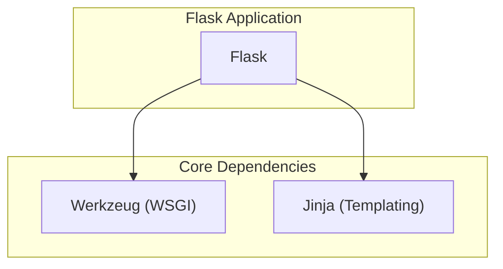
This diagram illustrates that Flask directly utilizes Werkzeug and Jinja to provide its functionality.

The following table summarizes the core libraries that Flask is built on:

| Library  | Description                               |
| :------- | :---------------------------------------- |
| Werkzeug | A WSGI web application utility library.   |
| Jinja    | A modern and designer-friendly templating engine. |

Sources: [README.md:7-8](https://github.com/pallets/flask/blob/258d68b6ff5e2244386540f48b48bab90d6ab827/README.md#L7-L8), [README.md:17-18](https://github.com/pallets/flask/blob/258d68b6ff5e2244386540f48b48bab90d6ab827/README.md#L17-L18)

## A Simple Example

Getting started with Flask involves creating an instance of the `Flask` class and defining routes to handle incoming web requests.

Sources: [README.md:20-31](https://github.com/pallets/flask/blob/258d68b6ff5e2244386540f48b48bab90d6ab827/README.md#L20-L31)

### Application Code

The following is a minimal Flask application:

```python
# save this as app.py
from flask import Flask

app = Flask(__name__)

@app.route("/")
def hello():
    return "Hello, World!"
```
This code creates a web server that responds with "Hello, World!" to requests for the root URL (`/`).

Sources: [README.md:23-31](https://github.com/pallets/flask/blob/258d68b6ff5e2244386540f48b48bab90d6ab827/README.md#L23-L31)

### Running the Application

The application can be run using the `flask` command-line tool.

```
$ flask run
  * Running on http://127.0.0.1:5000/ (Press CTRL+C to quit)
```
This command starts a local development server, typically accessible at `http://127.0.0.1:5000/`.

Sources: [README.md:34-36](https://github.com/pallets/flask/blob/258d68b6ff5e2244386540f48b48bab90d6ab827/README.md#L34-L36)

### Request-Response Flow

The following diagram shows the sequence of events when a user accesses the simple application.

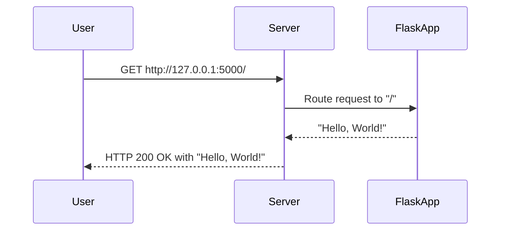
This illustrates the basic interaction where a user's request is received by the server, processed by the Flask application's route handler, and a response is returned.

## Community and Support

The Flask project is developed and supported by the Pallets organization. The community is encouraged to participate through financial donations and code contributions.

### Donations

Financial contributions help the maintainers dedicate more time to the project and support the community of users and contributors.

Sources: [README.md:40-45](https://github.com/pallets/flask/blob/258d68b6ff5e2244386540f48b48bab90d6ab827/README.md#L40-L45)

### Contributing

There are various ways to contribute to the project, including reporting issues, requesting features, and submitting pull requests. Detailed guidelines for contributing are available in the project's documentation.

Sources: [README.md:49-53](https://github.com/pallets/flask/blob/258d68b6ff5e2244386540f48b48bab90d6ab827/README.md#L49-L53)

# Page: Installation and Dependencies

<details>
<summary>Relevant source files</summary>

The following files were used as context for generating this wiki page:

- [pyproject.toml](https://github.com/pallets/flask/blob/258d68b6ff5e2244386540f48b48bab90d6ab827/pyproject.toml)
</details>

# Installation and Dependencies

Flask's installation process and dependency management are centralized within the `pyproject.toml` file, which follows modern Python packaging standards (PEP 621). This file is the single source of truth for project metadata, build requirements, core dependencies, optional features, and a comprehensive suite of development and testing tools. The project requires Python 3.10 or newer and utilizes `flit` as its build backend.

Sources: [pyproject.toml:1-87](https://github.com/pallets/flask/blob/258d68b6ff5e2244386540f48b48bab90d6ab827/pyproject.toml#L1-L87)

## Project Metadata

The `[project]` table in `pyproject.toml` defines the core metadata for the Flask package.

| Attribute | Value | Source |
| --- | --- | --- |
| `name` | "Flask" | `pyproject.toml:2` |
| `version` | "3.2.0.dev" | `pyproject.toml:3` |
| `description` | "A simple framework for building complex web applications." | `pyproject.toml:4` |
| `license` | "BSD-3-Clause" | `pyproject.toml:6` |
| `requires-python` | ">=3.10" | `pyproject.toml:22` |

The project also defines a console script entry point, `flask`, which executes the `main` function in the `flask.cli` module.

Sources: [pyproject.toml:82-83](https://github.com/pallets/flask/blob/258d68b6ff5e2244386540f48b48bab90d6ab827/pyproject.toml#L82-L83)

## Core Dependencies

Flask requires a set of core libraries to function. These are specified in the `[project.dependencies]` section and are automatically installed with Flask.

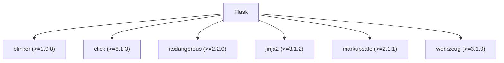
*A diagram showing Flask's core dependencies.*

The following table lists the core dependencies and their minimum required versions.

| Dependency | Version Specifier |
| --- | --- |
| `blinker` | `>=1.9.0` |
| `click` | `>=8.1.3` |
| `itsdangerous` | `>=2.2.0` |
| `jinja2` | `>=3.1.2` |
| `markupsafe` | `>=2.1.1` |
| `werkzeug` | `>=3.1.0` |

Sources: [pyproject.toml:23-29](https://github.com/pallets/flask/blob/258d68b6ff5e2244386540f48b48bab90d6ab827/pyproject.toml#L23-L29)

## Optional Dependencies

Flask provides optional features that can be installed as "extras". These are defined in the `[project.optional-dependencies]` table.

| Extra | Dependency | Description |
| --- | --- | --- |
| `async` | `asgiref>=3.2` | Enables support for ASGI and asynchronous views. |
| `dotenv` | `python-dotenv` | Enables automatic loading of environment variables from `.env` and `.flaskenv` files when running `flask` commands. |

To install Flask with an extra, use the following syntax:
```bash
pip install 'flask[async]'
pip install 'flask[dotenv]'
```

Sources: [pyproject.toml:32-34](https://github.com/pallets/flask/blob/258d68b6ff5e2244386540f48b48bab90d6ab827/pyproject.toml#L32-L34)

## Development and Tooling

The project uses a comprehensive set of tools for development, testing, and code quality, all configured within `pyproject.toml`.

### Build System

Flask uses `flit` as its build system, as specified in the `[build-system]` table.

- **Build requirements**: `flit_core>=3.11,<4`
- **Build backend**: `flit_core.buildapi`

Sources: [pyproject.toml:85-87](https://github.com/pallets/flask/blob/258d68b6ff5e2244386540f48b48bab90d6ab827/pyproject.toml#L85-L87)

### Dependency Groups

Development dependencies are organized into groups under the `[dependency-groups]` table. This allows for installing specific sets of tools for different tasks.

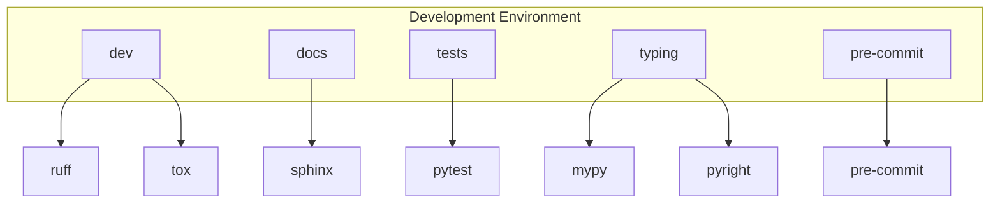
*A diagram illustrating the main dependency groups and some of their key tools.*

- **`dev`**: Core development tools like `ruff`, `tox`, and `tox-uv`.
- **`docs`**: Tools for building documentation, including `sphinx` and `pallets-sphinx-themes`.
- **`tests`**: Libraries for running the test suite, such as `pytest`, `greenlet`, and `asgiref`.
- **`typing`**: Static type checkers and their dependencies, including `mypy`, `pyright`, and various `types-*` packages.
- **`pre-commit`**: Tools for managing and running pre-commit hooks.

Sources: [pyproject.toml:36-73](https://github.com/pallets/flask/blob/258d68b6ff5e2244386540f48b48bab90d6ab827/pyproject.toml#L36-L73)

### Testing Environment with Tox

The project uses `tox` to automate testing in various environments. The configuration is located in the `[tool.tox]` section.

The following table summarizes the key `tox` environments:

| Environment | Description |
| --- | --- |
| `py3.10` - `py3.14`, `pypy3.11` | Runs the pytest suite against different Python versions with the latest dependencies. |
| `tests-min` | Runs tests against the minimum specified versions of the core dependencies. |
| `tests-dev` | Runs tests against the development (main branch) versions of Pallets dependencies. |
| `style` | Runs all pre-commit hooks on all files to check for code style and formatting. |
| `typing` | Runs static type checkers (`mypy` and `pyright`). |
| `docs` | Builds the project documentation using Sphinx. |

The base test command runs `pytest` with verbose output and a short traceback format.

```
pytest -v --tb=short --basetemp={env_tmp_dir}
```

Sources: [pyproject.toml:171-278](https://github.com/pallets/flask/blob/258d68b6ff5e2244386540f48b48bab90d6ab827/pyproject.toml#L171-L278)

### Code Quality

#### Linting and Formatting

`ruff` is used for linting and auto-formatting. It is configured to fix issues automatically (`fix = true`) and checks for a specific set of rules:
- `B`: `flake8-bugbear`
- `E`: `pycodestyle` errors
- `F`: `pyflakes`
- `I`: `isort`
- `UP`: `pyupgrade`
- `W`: `pycodestyle` warnings

Sources: [pyproject.toml:148-166](https://github.com/pallets/flask/blob/258d68b6ff5e2244386540f48b48bab90d6ab827/pyproject.toml#L148-L166)

#### Static Type Checking

The project uses both `mypy` and `pyright` for static type analysis, configured under `[tool.mypy]` and `[tool.pyright]` respectively.
- **Mypy**: Runs in `strict` mode on Python 3.10. It is configured to ignore missing imports for several third-party libraries like `asgiref` and `cryptography`.
- **Pyright**: Is configured to run in `basic` type-checking mode.

Both checkers analyze the `src` and `tests/type_check` directories.

Sources: [pyproject.toml:127-146](https://github.com/pallets/flask/blob/258d68b6ff5e2244386540f48b48bab90d6ab827/pyproject.toml#L127-L146)

# Page: A "Hello, World!" Application

<details>
<summary>Relevant source files</summary>

The following files were used as context for generating this wiki page:

- [README.md](https://github.com/pallets/flask/blob/258d68b6ff5e2244386540f48b48bab90d6ab827/README.md)
- [src/flask/app.py](https://github.com/pallets/flask/blob/258d68b6ff5e2244386540f48b48bab90d6ab827/src/flask/app.py)
- [src/flask/__init__.py](https://github.com/pallets/flask/blob/258d68b6ff5e2244386540f48b48bab90d6ab827/src/flask/__init__.py)
- [src/flask/__main__.py](https://github.com/pallets/flask/blob/258d68b6ff5e2244386540f48b48bab90d6ab827/src/flask/__main__.py)
- [src/flask/debughelpers.py](https://github.com/pallets/flask/blob/258d68b6ff5e2244386540f48b48bab90d6ab827/src/flask/debughelpers.py)
- [src/flask/logging.py](https://github.com/pallets/flask/blob/258d68b6ff5e2244386540f48b48bab90d6ab827/src/flask/logging.py)
- [src/flask/typing.py](https://github.com/pallets/flask/blob/258d68b6ff5e2244386540f48b48bab90d6ab827/src/flask/typing.py)
</details>

# A "Hello, World!" Application

A minimal Flask application serves as the entry point for understanding the framework's core concepts. It demonstrates how to instantiate the application, define a web route, and handle an incoming request with a simple view function. Flask is a lightweight WSGI web application framework designed for a quick and easy start, while being scalable to complex applications.

The canonical "Hello, World!" example is presented in the project's `README.md`:

```python
# save this as app.py
from flask import Flask

app = Flask(__name__)

@app.route("/")
def hello():
    return "Hello, World!"
```
*Sources: [README.md:23-31](https://github.com/pallets/flask/blob/258d68b6ff5e2244386540f48b48bab90d6ab827/README.md#L23-L31)*

This wiki page breaks down the components and lifecycle of this minimal application.

## Core Components

### The `Flask` Application Object

The central object in any Flask application is an instance of the `Flask` class. This object implements the WSGI application and acts as a registry for view functions, URL rules, and configuration.

*Sources: [src/flask/app.py:109-114](https://github.com/pallets/flask/blob/258d68b6ff5e2244386540f48b48bab90d6ab827/src/flask/app.py#L109-L114)*

#### Initialization

The `Flask` class is initialized with the `import_name` of the application's module or package. This is crucial for Flask to locate resources like templates and static files. Using `__name__` is the standard convention for single-module applications.

```python
app = Flask(__name__)
```
*Sources: [README.md:26](https://github.com/pallets/flask/blob/258d68b6ff5e2244386540f48b48bab90d6ab827/README.md#L26), [src/flask/app.py:310-322](https://github.com/pallets/flask/blob/258d68b6ff5e2244386540f48b48bab90d6ab827/src/flask/app.py#L310-L322)*

The `__init__` method of the `Flask` class sets up default configuration, initializes a CLI command group, and, if a `static_folder` is present, adds a URL rule to serve static files.

*Sources: [src/flask/app.py:310-363](https://github.com/pallets/flask/blob/258d68b6ff5e2244386540f48b48bab90d6ab827/src/flask/app.py#L310-L363)*

The following diagram illustrates the key components of a `Flask` instance upon creation.

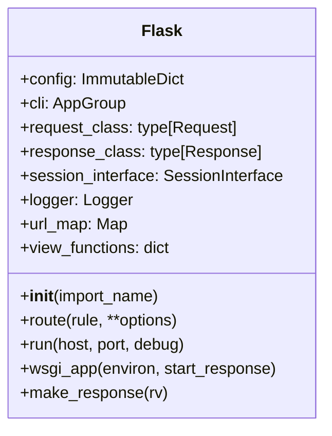
*Sources: [src/flask/app.py:109-1625](https://github.com/pallets/flask/blob/258d68b6ff5e2244386540f48b48bab90d6ab827/src/flask/app.py#L109-L1625), [src/flask/logging.py:58-79](https://github.com/pallets/flask/blob/258d68b6ff5e2244386540f48b48bab90d6ab827/src/flask/logging.py#L58-L79)*

### Routing

Routing maps URLs to the Python functions that handle them. The `@app.route()` decorator is the primary way to register a view function for a given URL rule.

```python
@app.route("/")
def hello():
    # ...
```
*Sources: [README.md:28-29](https://github.com/pallets/flask/blob/258d68b6ff5e2244386540f48b48bab90d6ab827/README.md#L28-L29)*

The `route()` method is a decorator that calls `add_url_rule()` on the application object. This adds a `Rule` to the app's `url_map`, which is a Werkzeug `Map` instance. The rule connects the URL path (`/`), an endpoint name (by default, the function name `hello`), and the view function itself.

*Sources: [src/flask/sansio/app.py](https://github.com/pallets/flask/blob/258d68b6ff5e2244386540f48b48bab90d6ab827/src/flask/sansio/app.py#L398-L417)*

### The View Function

A view function is a Python function that receives a web request and returns a response. In the example, `hello()` is the view function.

```python
def hello():
    return "Hello, World!"
```
*Sources: [README.md:29-30](https://github.com/pallets/flask/blob/258d68b6ff5e2244386540f48b48bab90d6ab827/README.md#L29-L30)*

The return value of a view function, known as `ResponseReturnValue`, is converted into a `Response` object by Flask's `make_response` method.

*Sources: [src/flask/app.py:1224-1226](https://github.com/pallets/flask/blob/258d68b6ff5e2244386540f48b48bab90d6ab827/src/flask/app.py#L1224-L1226), [src/flask/typing.py:36-42](https://github.com/pallets/flask/blob/258d68b6ff5e2244386540f48b48bab90d6ab827/src/flask/typing.py#L36-L42)*

#### Valid Return Values

A view function can return various types, which Flask handles accordingly.

| Return Type | Flask's Action |
| --- | --- |
| `str` | Creates a `Response` object with the string as the body and a `200 OK` status. |
| `bytes` | Creates a `Response` object with the bytes as the body. |
| `dict` or `list` | Creates a JSON response using `jsonify`. |
| `tuple` | Can be `(body, status)`, `(body, headers)`, or `(body, status, headers)`. |
| `Response` instance | The instance is returned directly. |
| WSGI callable | The callable is used as the WSGI application for the response. |

*Sources: [src/flask/app.py:1224-1350](https://github.com/pallets/flask/blob/258d68b6ff5e2244386540f48b48bab90d6ab827/src/flask/app.py#L1224-L1350), [src/flask/typing.py:12-42](https://github.com/pallets/flask/blob/258d68b6ff5e2244386540f48b48bab90d6ab827/src/flask/typing.py#L12-L42)*

## Running the Application

There are two primary ways to run the development server for a Flask application.

### Using the `flask` Command

The recommended way to run a development server is with the `flask run` command.

```bash
$ flask run
  * Running on http://127.0.0.1:5000/ (Press CTRL+C to quit)
```
*Sources: [README.md:34-36](https://github.com/pallets/flask/blob/258d68b6ff5e2244386540f48b48bab90d6ab827/README.md#L34-L36)*

This command is enabled by Flask's integration with the Click library. The `src/flask/__main__.py` file acts as an entry point, allowing `python -m flask` to execute, which in turn calls `cli.main()`. The `flask run` command discovers the application instance and starts a Werkzeug development server.

*Sources: [src/flask/__main__.py:1-3](https://github.com/pallets/flask/blob/258d68b6ff5e2244386540f48b48bab90d6ab827/src/flask/__main__.py#L1-L3), [src/flask/cli.py](https://github.com/pallets/flask/blob/258d68b6ff5e2244386540f48b48bab90d6ab827/src/flask/cli.py#L980-L1011)*

### Using `app.run()`

Alternatively, the `app.run()` method can be called directly from a Python script. This method is intended for development only and should not be used in production.

*Sources: [src/flask/app.py:642-644](https://github.com/pallets/flask/blob/258d68b6ff5e2244386540f48b48bab90d6ab827/src/flask/app.py#L642-L644)*

The `run()` method starts a local development server by calling `werkzeug.serving.run_simple`. It determines the host, port, and debug status from its arguments, environment variables, or the app's configuration.

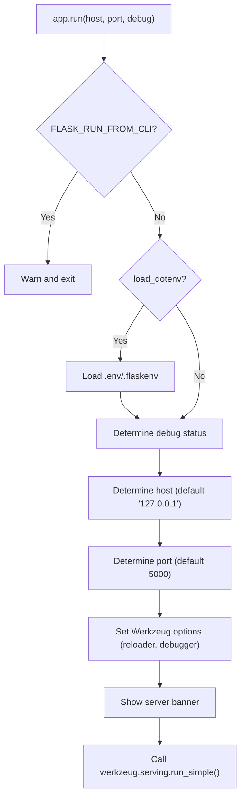
*Sources: [src/flask/app.py:632-754](https://github.com/pallets/flask/blob/258d68b6ff5e2244386540f48b48bab90d6ab827/src/flask/app.py#L632-L754)*

## Request-Response Lifecycle

The following diagram illustrates the sequence of events when a request for `/` is made to the "Hello, World!" application.

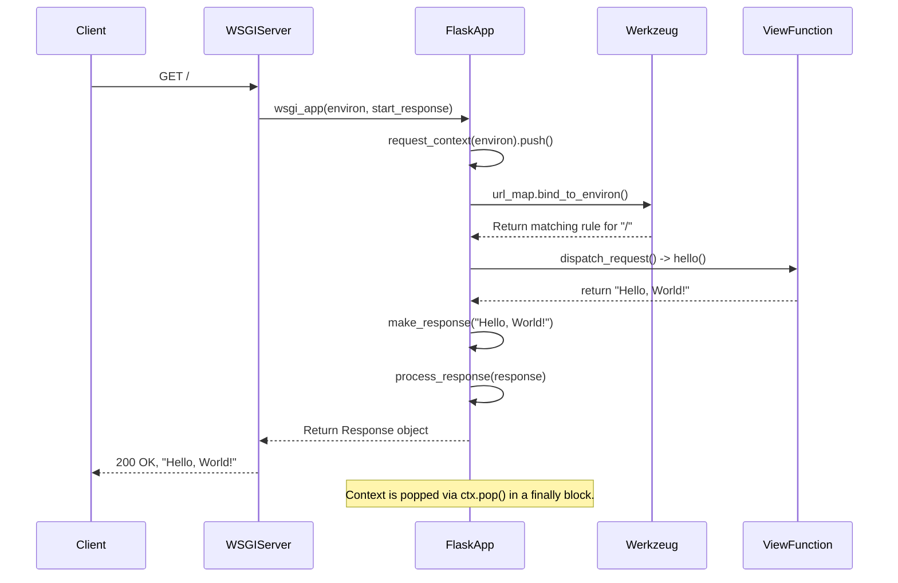
*Sources: [src/flask/app.py:1566-1616](https://github.com/pallets/flask/blob/258d68b6ff5e2244386540f48b48bab90d6ab827/src/flask/app.py#L1566-L1616), [src/flask/app.py:966-991](https://github.com/pallets/flask/blob/258d68b6ff5e2244386540f48b48bab90d6ab827/src/flask/app.py#L966-L991), [src/flask/app.py:1224-1364](https://github.com/pallets/flask/blob/258d68b6ff5e2244386540f48b48bab90d6ab827/src/flask/app.py#L1224-L1364)*

1.  **WSGI Call**: The WSGI server calls the `Flask` instance as a WSGI application (`__call__`), which delegates to `wsgi_app`.
    *Sources: [src/flask/app.py:1618-1625](https://github.com/pallets/flask/blob/258d68b6ff5e2244386540f48b48bab90d6ab827/src/flask/app.py#L1618-L1625)*
2.  **Context Creation**: A `RequestContext` (which is also an `AppContext`) is created from the WSGI environment and pushed. This makes globals like `request` available.
    *Sources: [src/flask/app.py:1592-1596](https://github.com/pallets/flask/blob/258d68b6ff5e2244386540f48b48bab90d6ab827/src/flask/app.py#L1592-L1596)*
3.  **Request Dispatch**: `full_dispatch_request` is called. It runs `preprocess_request` functions (none in this case), then calls `dispatch_request`.
    *Sources: [src/flask/app.py:992-1019](https://github.com/pallets/flask/blob/258d68b6ff5e2244386540f48b48bab90d6ab827/src/flask/app.py#L992-L1019)*
4.  **URL Matching**: `dispatch_request` uses the `request.url_rule` (matched by Werkzeug) to find the associated view function, `hello`.
    *Sources: [src/flask/app.py:976-980](https://github.com/pallets/flask/blob/258d68b6ff5e2244386540f48b48bab90d6ab827/src/flask/app.py#L976-L980)*
5.  **View Execution**: The `hello` function is executed and returns the string `"Hello, World!"`.
    *Sources: [src/flask/app.py:990](https://github.com/pallets/flask/blob/258d68b6ff5e2244386540f48b48bab90d6ab827/src/flask/app.py#L990), [README.md:29-30](https://github.com/pallets/flask/blob/258d68b6ff5e2244386540f48b48bab90d6ab827/README.md#L29-L30)*
6.  **Response Creation**: The return value is passed to `finalize_request`, which calls `make_response`. The string is converted into a `Response` object with default status `200` and `Content-Type: text/html; charset=utf-8`.
    *Sources: [src/flask/app.py:1019](https://github.com/pallets/flask/blob/258d68b6ff5e2244386540f48b48bab90d6ab827/src/flask/app.py#L1019), [src/flask/app.py:1224-1364](https://github.com/pallets/flask/blob/258d68b6ff5e2244386540f48b48bab90d6ab827/src/flask/app.py#L1224-L1364)*
7.  **Post-processing**: `process_response` is called, which runs any `after_request` functions (none in this case) and saves the session if necessary.
    *Sources: [src/flask/app.py:1041](https://github.com/pallets/flask/blob/258d68b6ff5e2244386540f48b48bab90d6ab827/src/flask/app.py#L1041), [src/flask/app.py:1394-1418](https://github.com/pallets/flask/blob/258d68b6ff5e2244386540f48b48bab90d6ab827/src/flask/app.py#L1394-L1418)*
8.  **Context Teardown**: The `wsgi_app` method's `finally` block ensures `ctx.pop()` is called, which triggers `teardown_request` and `teardown_appcontext` functions.
    *Sources: [src/flask/app.py:1616](https://github.com/pallets/flask/blob/258d68b6ff5e2244386540f48b48bab90d6ab827/src/flask/app.py#L1616), [src/flask/app.py:1420-1452](https://github.com/pallets/flask/blob/258d68b6ff5e2244386540f48b48bab90d6ab827/src/flask/app.py#L1420-L1452), [src/flask/app.py:1453-1479](https://github.com/pallets/flask/blob/258d68b6ff5e2244386540f48b48bab90d6ab827/src/flask/app.py#L1453-L1479)*
9.  **Return to Server**: The `Response` object is returned to the WSGI server, which sends the HTTP response to the client.
    *Sources: [src/flask/app.py:1604](https://github.com/pallets/flask/blob/258d68b6ff5e2244386540f48b48bab90d6ab827/src/flask/app.py#L1604)*

# Page: Recommended Project Structure

<details>
<summary>Relevant source files</summary>

The following files were used as context for generating this wiki page:

- [examples/tutorial/flaskr/__init__.py](https://github.com/pallets/flask/blob/258d68b6ff5e2244386540f48b48bab90d6ab827/examples/tutorial/flaskr/__init__.py)
- [examples/tutorial/pyproject.toml](https://github.com/pallets/flask/blob/258d68b6ff5e2244386540f48b48bab90d6ab827/examples/tutorial/pyproject.toml)
- [examples/celery/pyproject.toml](https://github.com/pallets/flask/blob/258d68b6ff5e2244386540f48b48bab90d6ab827/examples/celery/pyproject.toml)
- [examples/javascript/pyproject.toml](https://github.com/pallets/flask/blob/258d68b6ff5e2244386540f48b48bab90d6ab827/examples/javascript/pyproject.toml)
</details>

# Recommended Project Structure

A well-structured Flask project utilizes the application factory pattern to facilitate configuration, testing, and scalability. The application is organized as a Python package, with functionality split into modular components called Blueprints. Project metadata, dependencies, and tool configurations are managed centrally in a `pyproject.toml` file. This approach keeps the codebase clean, maintainable, and easy to extend.

The core of this structure is the `create_app` factory function, which is responsible for instantiating and configuring the Flask application object. This includes setting up default configurations, loading instance-specific secrets, initializing extensions like databases, and registering blueprints that define the application's routes and logic.

## Project Layout

The recommended project structure separates the application logic from the instance-specific data and configuration. The main application code resides within a package (e.g., `flaskr`), while sensitive configuration and data files, like the SQLite database, are stored in a separate `instance` folder outside the package.

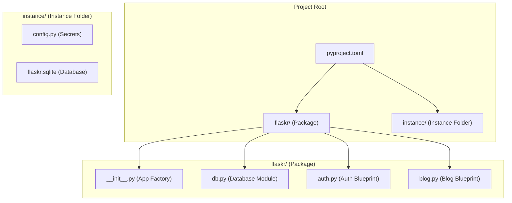

This layout is established by instantiating the Flask app with `instance_relative_config=True` (`examples/tutorial/flaskr/__init__.py:8`) and defining the database path within the `app.instance_path` (`examples/tutorial/flaskr/__init__.py:13`).

## The Application Factory

The application factory pattern is implemented through a `create_app` function. This function constructs the Flask application object, allowing for different configurations to be applied, which is particularly useful for testing.

Sources: [`examples/tutorial/flaskr/__init__.py:6-48`]()

### Factory Execution Flow

The `create_app` function follows a specific sequence to build and configure the application instance.

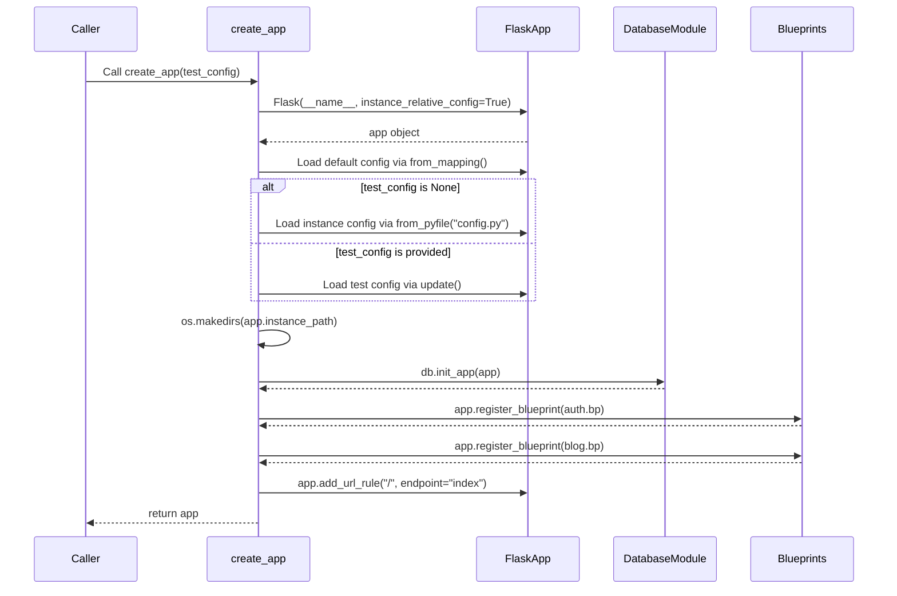

**Key Steps:**

1.  **Instantiation**: An instance of `Flask` is created with `instance_relative_config=True` to make the app aware of the `instance` folder.
    Sources: [`examples/tutorial/flaskr/__init__.py:8`]()
2.  **Default Configuration**: Default settings are applied using `app.config.from_mapping()`.
    Sources: [`examples/tutorial/flaskr/__init__.py:9-14`]()
3.  **Instance Configuration**: If not testing, it attempts to load configuration from `config.py` in the instance folder. `silent=True` prevents an error if the file doesn't exist.
    Sources: [`examples/tutorial/flaskr/__init__.py:16-18`]()
4.  **Test Configuration**: If a `test_config` dictionary is passed, it overrides other configurations.
    Sources: [`examples/tutorial/flaskr/__init__.py:19-21`]()
5.  **Instance Folder**: The existence of the instance folder is ensured with `os.makedirs`.
    Sources: [`examples/tutorial/flaskr/__init__.py:24`]()
6.  **Extension Initialization**: Extensions are initialized by calling their `init_app` method, passing the application instance.
    Sources: [`examples/tutorial/flaskr/__init__.py:31-33`]()
7.  **Blueprint Registration**: Modular parts of the application (Blueprints) are registered.
    Sources: [`examples/tutorial/flaskr/__init__.py:36-40`]()
8.  **URL Rule Mapping**: Additional URL rules can be added, such as mapping the root URL `/` to a blueprint's index view.
    Sources: [`examples/tutorial/flaskr/__init__.py:46`]()
9.  **Return**: The fully configured application instance is returned.
    Sources: [`examples/tutorial/flaskr/__init__.py:48`]()

## Configuration Management

Configuration is layered to provide flexibility between development, production, and testing environments.

| Key | Default Value | Purpose | Source |
|---|---|---|---|
| `SECRET_KEY` | `"dev"` | A secret key for signing session cookies. This should be overridden in production. | [`examples/tutorial/flaskr/__init__.py:11`]() |
| `DATABASE` | `os.path.join(app.instance_path, "flaskr.sqlite")` | Path to the SQLite database file, stored in the instance folder. | [`examples/tutorial/flaskr/__init__.py:13`]() |

The loading order is:
1.  Defaults from `app.config.from_mapping()`.
2.  Instance-specific values from `instance/config.py` via `app.config.from_pyfile()`.
3.  Test-specific values from the `test_config` parameter via `app.config.update()`.

## Modularization with Blueprints

Blueprints are used to organize a group of related views, templates, and static files. This helps in structuring larger applications by splitting them into distinct components. In the `flaskr` example, authentication and blog functionalities are separated into their own blueprints.

-   The `auth` and `blog` modules are imported within the `create_app` function.
    Sources: [`examples/tutorial/flaskr/__init__.py:36-37`]()
-   Each blueprint is registered with the application instance using `app.register_blueprint()`.
    Sources: [`examples/tutorial/flaskr/__init__.py:39-40`]()
-   Top-level URL rules can be created to point to a blueprint's endpoint, as shown with `app.add_url_rule("/", endpoint="index")`, which makes `url_for('index')` and `url_for('blog.index')` equivalent.
    Sources: [`examples/tutorial/flaskr/__init__.py:42-46`]()

## Project Metadata and Dependencies

The `pyproject.toml` file is the standard for defining project metadata, dependencies, and build system requirements, as well as configurations for various development tools.

| Section | Purpose | Example | Sources |
|---|---|---|---|
| `[project]` | Defines core project metadata like name, version, and dependencies. | `name = "flaskr"`, `dependencies = ["flask"]` | [`examples/tutorial/pyproject.toml:1-11`](), [`examples/celery/pyproject.toml:1-7`]() |
| `[project.optional-dependencies]` | Defines optional dependencies for specific features, like testing. | `test = ["pytest"]` | [`examples/tutorial/pyproject.toml:16-17`](), [`examples/javascript/pyproject.toml:14-15`]() |
| `[build-system]` | Specifies the build backend (e.g., Flit). | `build-backend = "flit_core.buildapi"` | [`examples/tutorial/pyproject.toml:19-21`](), [`examples/celery/pyproject.toml:9-11`]() |
| `[tool.flit.module]` | Tells the Flit build tool where to find the main package. | `name = "flaskr"` | [`examples/tutorial/pyproject.toml:23-24`](), [`examples/celery/pyproject.toml:13-14`]() |
| `[tool.pytest.ini_options]` | Configures the Pytest test runner. | `testpaths = ["tests"]` | [`examples/tutorial/pyproject.toml:31-33`](), [`examples/javascript/pyproject.toml:24-26`]() |
| `[tool.coverage.run]` | Configures the coverage tool for test reporting. | `source = ["flaskr", "tests"]` | [`examples/tutorial/pyproject.toml:35-37`](), [`examples/javascript/pyproject.toml:28-30`]() |
| `[tool.ruff]` | Configures the Ruff linter and formatter. | `src = ["src"]` | [`examples/tutorial/pyproject.toml:39-40`](), [`examples/celery/pyproject.toml:16-17`]() |

# Page: The Application Object (Flask)

<details>
<summary>Relevant source files</summary>

The following files were used as context for generating this wiki page:

- [src/flask/app.py](https://github.com/pallets/flask/blob/258d68b6ff5e2244386540f48b48bab90d6ab827/src/flask/app.py)
- [src/flask/sansio/app.py](https://github.com/pallets/flask/blob/258d68b6ff5e2244386540f48b48bab90d6ab827/src/flask/sansio/app.py)
</details>

# The Application Object (Flask)

The `Flask` object is the central component of any Flask-based web application. It implements a WSGI application and serves as the primary registry for view functions, URL rules, template configurations, and extensions. The `Flask` class, defined in `src/flask/app.py`, inherits from `flask.sansio.app.App`, which provides the core, protocol-agnostic application logic. This separation allows the main `Flask` object to focus on WSGI-specific implementations while the `App` class handles fundamental application setup and structure.

Upon instantiation, the `Flask` object requires an `import_name` which it uses to determine the application's root path for locating resources like templates and static files. It configures a default set of parameters, sets up logging, initializes the Jinja2 templating environment, and prepares the routing system. The object is designed to be the single point of interaction for developers to define the application's behavior.

## Core Architecture

The application object's architecture is based on a class hierarchy that separates protocol-specific concerns from core application logic.

*   **`Scaffold`**: The base class for both `App` and `Blueprint` objects, providing common functionality for naming, path management, and basic registration hooks.
*   **`App`**: Inherits from `Scaffold` and implements the core, non-WSGI-specific application logic. This includes configuration management, blueprint registration, URL rule handling, and hooks for request preprocessing and postprocessing.
*   **`Flask`**: Inherits from `App` and adds the WSGI-specific layer. This class implements the `wsgi_app` method, making it a callable WSGI application. It also manages the request lifecycle, context handling, and response generation within a WSGI environment.

Sources: [src/flask/app.py:109-109](https://github.com/pallets/flask/blob/258d68b6ff5e2244386540f48b48bab90d6ab827/src/flask/app.py#L109-L109), [src/flask/sansio/app.py:59-59](https://github.com/pallets/flask/blob/258d68b6ff5e2244386540f48b48bab90d6ab827/src/flask/sansio/app.py#L59-L59)

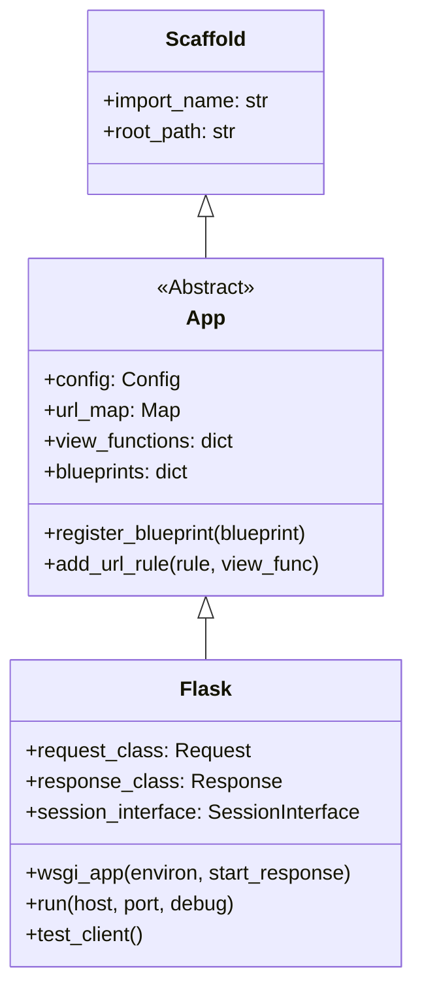

## Initialization and Configuration

A `Flask` application is instantiated by providing an `import_name`, which is typically `__name__`. This helps Flask locate the application's root path for resources.

Sources: [src/flask/app.py:122-126](https://github.com/pallets/flask/blob/258d68b6ff5e2244386540f48b48bab90d6ab827/src/flask/app.py#L122-L126)

### Constructor Parameters

The constructor accepts several parameters to customize the application's behavior, particularly regarding static files, templates, and instance configuration.

| Parameter | Description | Source |
| --- | --- | --- |
| `import_name` | The name of the application package or module. Used to determine the `root_path`. | [src/flask/app.py:312-312](https://github.com/pallets/flask/blob/258d68b6ff5e2244386540f48b48bab90d6ab827/src/flask/app.py#L312-L312) |
| `static_url_path` | The URL path for serving static files. Defaults to the name of `static_folder`. | [src/flask/app.py:313-313](https://github.com/pallets/flask/blob/258d68b6ff5e2244386540f48b48bab90d6ab827/src/flask/app.py#L313-L313) |
| `static_folder` | The folder containing static files. Defaults to `"static"`. | [src/flask/app.py:314-314](https://github.com/pallets/flask/blob/258d68b6ff5e2244386540f48b48bab90d6ab827/src/flask/app.py#L314-L314) |
| `template_folder` | The folder containing template files. Defaults to `"templates"`. | [src/flask/app.py:318-318](https://github.com/pallets/flask/blob/258d68b6ff5e2244386540f48b48bab90d6ab827/src/flask/app.py#L318-L318) |
| `instance_path` | The path to the instance folder, which can hold configuration files and other data that shouldn't be in version control. | [src/flask/app.py:319-319](https://github.com/pallets/flask/blob/258d68b6ff5e2244386540f48b48bab90d6ab827/src/flask/app.py#L319-L319) |
| `instance_relative_config` | If `True`, configuration files are loaded relative to the `instance_path`. | [src/flask/app.py:320-320](https://github.com/pallets/flask/blob/258d68b6ff5e2244386540f48b48bab90d6ab827/src/flask/app.py#L320-L320) |
| `host_matching` | If `True`, enables host-based matching for URL rules. | [src/flask/app.py:316-316](https://github.com/pallets/flask/blob/258d68b6ff5e2244386540f48b48bab90d6ab827/src/flask/app.py#L316-L316) |
| `subdomain_matching` | If `True`, enables subdomain-based matching for URL rules. | [src/flask/app.py:317-317](https://github.com/pallets/flask/blob/258d68b6ff5e2244386540f48b48bab90d6ab827/src/flask/app.py#L317-L317) |

The `Flask` `__init__` method calls its parent `App.__init__` and then proceeds to set up the static file route if a `static_folder` is configured.

Sources: [src/flask/app.py:310-363](https://github.com/pallets/flask/blob/258d68b6ff5e2244386540f48b48bab90d6ab827/src/flask/app.py#L310-L363), [src/flask/sansio/app.py:279-408](https://github.com/pallets/flask/blob/258d68b6ff5e2244386540f48b48bab90d6ab827/src/flask/sansio/app.py#L279-L408)

### Default Configuration

The `Flask` object comes with a set of default configuration values stored in the `default_config` dictionary. These can be overridden by loading a configuration file or setting values on `app.config`.

| Key | Default Value | Description |
| --- | --- | --- |
| `DEBUG` | `None` (derived from `FLASK_DEBUG` env var) | Enables or disables debug mode. |
| `TESTING` | `False` | Enables testing mode. |
| `SECRET_KEY` | `None` | A secret key for signing session cookies. |
| `PERMANENT_SESSION_LIFETIME` | `timedelta(days=31)` | The lifetime of a permanent session. |
| `SERVER_NAME` | `None` | The name and port of the server. Required for subdomain support. |
| `APPLICATION_ROOT` | `/` | The root path of the application. |
| `SESSION_COOKIE_NAME` | `session` | The name of the session cookie. |
| `MAX_CONTENT_LENGTH` | `None` | The maximum size of incoming request data. |

Sources: [src/flask/app.py:206-238](https://github.com/pallets/flask/blob/258d68b6ff5e2244386540f48b48bab90d6ab827/src/flask/app.py#L206-L238)

## Request Lifecycle

The core function of the `Flask` object is to handle incoming WSGI requests and produce a response. This process, known as the request lifecycle, involves several distinct stages orchestrated by methods on the `Flask` instance.

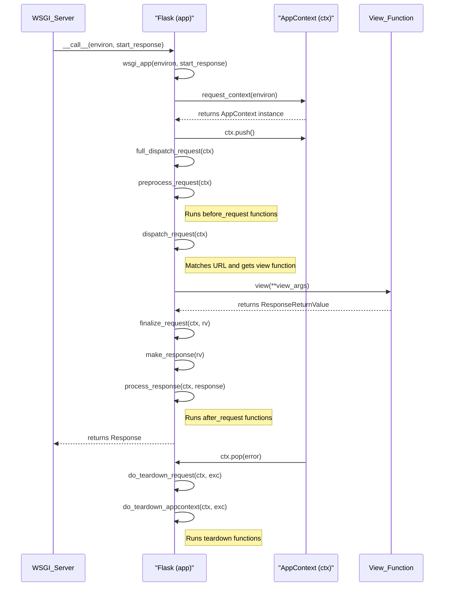
This diagram illustrates the sequence of method calls for a typical successful request.

Sources: [src/flask/app.py:1566-1616](https://github.com/pallets/flask/blob/258d68b6ff5e2244386540f48b48bab90d6ab827/src/flask/app.py#L1566-L1616)

### Key Lifecycle Methods

-   **`wsgi_app(environ, start_response)`**: The main entry point for the WSGI server. It creates a request context (`AppContext`) from the WSGI environment, pushes it, and then calls `full_dispatch_request` to handle the request. It ensures that the context is popped and teardown functions are called, even if an error occurs.
    Sources: [src/flask/app.py:1566-1616](https://github.com/pallets/flask/blob/258d68b6ff5e2244386540f48b48bab90d6ab827/src/flask/app.py#L1566-L1616)
-   **`full_dispatch_request(ctx)`**: This method orchestrates the main dispatching logic. It calls `preprocess_request`, then `dispatch_request`, and finally wraps the entire process in a `try...except` block to catch exceptions, which are passed to `handle_user_exception`. The result is then passed to `finalize_request`.
    Sources: [src/flask/app.py:992-1019](https://github.com/pallets/flask/blob/258d68b6ff5e2244386540f48b48bab90d6ab827/src/flask/app.py#L992-L1019)
-   **`preprocess_request(ctx)`**: Executes all functions registered with `before_request`. If any of these functions return a value, it is treated as the response, and further request processing is stopped.
    Sources: [src/flask/app.py:1366-1392](https://github.com/pallets/flask/blob/258d68b6ff5e2244386540f48b48bab90d6ab827/src/flask/app.py#L1366-L1392)
-   **`dispatch_request(ctx)`**: This method performs the actual routing. It uses the `url_rule` from the request context to find the corresponding view function and calls it with the URL arguments.
    Sources: [src/flask/app.py:966-990](https://github.com/pallets/flask/blob/258d68b6ff5e2244386540f48b48bab90d6ab827/src/flask/app.py#L966-L990)
-   **`make_response(rv)`**: Converts the return value from a view function (`rv`) into a `Response` object. It can handle various return types, including strings, bytes, dictionaries (which are converted to JSON), tuples of `(body, status, headers)`, and existing `Response` objects.
    Sources: [src/flask/app.py:1224-1364](https://github.com/pallets/flask/blob/258d68b6ff5e2244386540f48b48bab90d6ab827/src/flask/app.py#L1224-L1364)
-   **`finalize_request(ctx, rv, from_error_handler)`**: Takes the return value from the view (or an error handler), converts it to a `Response` object via `make_response`, and then calls `process_response`.
    Sources: [src/flask/app.py:1021-1051](https://github.com/pallets/flask/blob/258d68b6ff5e2244386540f48b48bab90d6ab827/src/flask/app.py#L1021-L1051)
-   **`process_response(ctx, response)`**: Executes all functions registered with `after_request`. These functions can modify the response object before it is sent. It also handles saving the session if it has been modified.
    Sources: [src/flask/app.py:1394-1418](https://github.com/pallets/flask/blob/258d68b6ff5e2244386540f48b48bab90d6ab827/src/flask/app.py#L1394-L1418)
-   **`do_teardown_request(ctx, exc)` and `do_teardown_appcontext(ctx, exc)`**: These methods are called when the respective contexts are popped. They execute all registered teardown functions, which are typically used for cleanup tasks like closing database connections.
    Sources: [src/flask/app.py:1420-1452](https://github.com/pallets/flask/blob/258d68b6ff5e2244386540f48b48bab90d6ab827/src/flask/app.py#L1420-L1452), [src/flask/app.py:1453-1479](https://github.com/pallets/flask/blob/258d68b6ff5e2244386540f48b48bab90d6ab827/src/flask/app.py#L1453-L1479)

## Exception Handling

Flask has a robust exception handling system that allows developers to register custom handlers for specific HTTP status codes or exception types.

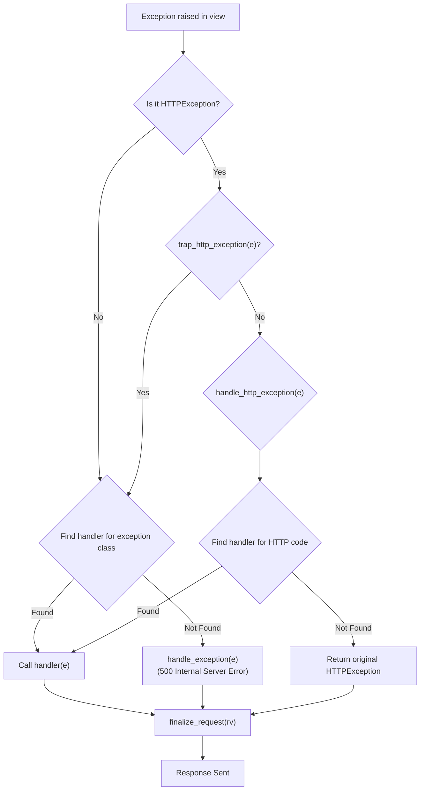
This flowchart shows the logic for routing an exception to the appropriate handler.

### Handler Methods

-   **`handle_user_exception(ctx, e)`**: The primary entry point for exceptions occurring during request dispatch. It checks if the exception is an `HTTPException` and, if so, forwards it to `handle_http_exception` unless `trap_http_exception` returns `True`. For other exceptions, it searches for a registered handler. If no handler is found, the exception is re-raised.
    Sources: [src/flask/app.py:865-895](https://github.com/pallets/flask/blob/258d68b6ff5e2244386540f48b48bab90d6ab827/src/flask/app.py#L865-L895)
-   **`handle_http_exception(ctx, e)`**: Specifically handles `HTTPException` instances. It finds a handler for the exception's status code and calls it. If no handler is found, the exception itself is returned as the response.
    Sources: [src/flask/app.py:830-863](https://github.com/pallets/flask/blob/258d68b6ff5e2244386540f48b48bab90d6ab827/src/flask/app.py#L830-L863)
-   **`handle_exception(ctx, e)`**: This is the last resort for exceptions that were not caught by any registered handler. It logs the exception, sends the `got_request_exception` signal, and always generates a 500 `InternalServerError` response. If `PROPAGATE_EXCEPTIONS` is true (as in debug or testing mode), it re-raises the exception.
    Sources: [src/flask/app.py:897-948](https://github.com/pallets/flask/blob/258d68b6ff5e2244386540f48b48bab90d6ab827/src/flask/app.py#L897-L948)
-   **`_find_error_handler(e, blueprints)`**: This internal method is responsible for looking up the most appropriate error handler. It searches first in the current blueprint's handlers, then in the application's handlers, checking for both specific status codes and exception classes.
    Sources: [src/flask/sansio/app.py:865-888](https://github.com/pallets/flask/blob/258d68b6ff5e2244386540f48b48bab90d6ab827/src/flask/sansio/app.py#L865-L888)

## Routing and URL Generation

The `Flask` object manages URL routing through a `werkzeug.routing.Map` instance stored at `app.url_map`.

### URL Rule Definition

URL rules are added using the `add_url_rule()` method or, more commonly, the `@route()` decorator.

```python
# Using the method
app.add_url_rule('/profile', view_func=show_profile)

# Using the decorator
@app.route('/profile')
def show_profile():
    ...
```

The `add_url_rule` method creates an instance of `url_rule_class` (which defaults to `werkzeug.routing.Rule`) and adds it to the `url_map`. It also associates the given endpoint with the `view_func` in the `view_functions` dictionary.

Sources: [src/flask/sansio/app.py:602-659](https://github.com/pallets/flask/blob/258d68b6ff5e2244386540f48b48bab90d6ab827/src/flask/sansio/app.py#L602-L659)

### URL Generation

URLs for endpoints are generated using the `url_for()` method. This method is crucial for avoiding hardcoded URLs in templates and application code.

```python
url_for('show_profile', username='dev')
# Result: /profile?username=dev
```

The `url_for` method uses the `url_adapter` from the active context to build the URL. It can generate both relative and absolute (external) URLs. When called outside a request context, it requires `SERVER_NAME` to be configured to generate external URLs.

Sources: [src/flask/app.py:1102-1222](https://github.com/pallets/flask/blob/258d68b6ff5e2244386540f48b48bab90d6ab827/src/flask/app.py#L1102-L1222)

## Templating

Flask uses the Jinja2 templating engine. The `Flask` object manages the Jinja2 `Environment`.

-   **`create_jinja_environment()`**: This method creates and configures the Jinja2 `Environment`. It sets options like `autoescape` and `auto_reload` based on the application's configuration. It also adds Flask-specific globals like `url_for`, `get_flashed_messages`, `config`, `request`, `session`, and `g` to the environment.
    Sources: [src/flask/app.py:469-507](https://github.com/pallets/flask/blob/258d68b6ff5e2244386540f48b48bab90d6ab827/src/flask/app.py#L469-L507)
-   **Template Decorators**: The application object provides decorators to easily add custom filters, tests, and globals to the Jinja environment:
    -   `@app.template_filter()`
    -   `@app.template_test()`
    -   `@app.template_global()`

    These decorators register the decorated function with the `jinja_env`.

    Sources: [src/flask/sansio/app.py:660-822](https://github.com/pallets/flask/blob/258d68b6ff5e2244386540f48b48bab90d6ab827/src/flask/sansio/app.py#L660-L822)

## Summary

The `Flask` application object is the heart of a Flask application, providing a unified interface for routing, configuration, request handling, and integration with the WSGI standard. Its design, which separates core logic (`App`) from WSGI-specific implementation (`Flask`), makes the framework flexible and extensible. By understanding the lifecycle of a request through the `Flask` object and the various hooks it provides (such as `before_request`, `after_request`, and error handlers), developers can build complex and robust web applications.

# Page: Sans-IO Architecture

<details>
<summary>Relevant source files</summary>

The following files were used as context for generating this wiki page:

- [src/flask/sansio/README.md](https://github.com/pallets/flask/blob/258d68b6ff5e2244386540f48b48bab90d6ab827/src/flask/sansio/README.md)
- [src/flask/sansio/app.py](https://github.com/pallets/flask/blob/258d68b6ff5e2244386540f48b48bab90d6ab827/src/flask/sansio/app.py)
- [src/flask/sansio/scaffold.py](https://github.com/pallets/flask/blob/258d68b6ff5e2244386540f48b48bab90d6ab827/src/flask/sansio/scaffold.py)
</details>

# Sans-IO Architecture

The Sans-IO (Input/Output) architecture in Flask isolates core application logic from any I/O operations and global state. This design principle ensures that components within the `flask.sansio` module can be reused by other web frameworks, such as Quart, that might employ different I/O models (e.g., asynchronous). The code in this layer is forbidden from performing I/O or accessing Flask's context-local globals.

This architecture is primarily built around two key classes: `Scaffold`, which provides a common structure for application and blueprint-level features, and `App`, which extends `Scaffold` to implement the central WSGI application object.

Sources: [src/flask/sansio/README.md:3-6](https://github.com/pallets/flask/blob/258d68b6ff5e2244386540f48b48bab90d6ab827/src/flask/sansio/README.md#L3-L6)

## Core Components

The Sans-IO architecture revolves around the `Scaffold` base class and its primary implementation, the `App` class.

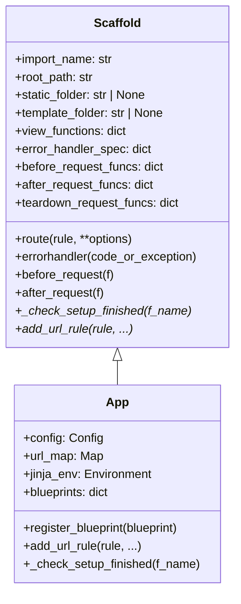
This diagram shows the inheritance relationship where `App` extends the base functionality defined in `Scaffold`. Abstract methods in `Scaffold` are implemented in `App`.

Sources: [src/flask/sansio/app.py:59](https://github.com/pallets/flask/blob/258d68b6ff5e2244386540f48b48bab90d6ab827/src/flask/sansio/app.py#L59), [src/flask/sansio/scaffold.py:52](https://github.com/pallets/flask/blob/258d68b6ff5e2244386540f48b48bab90d6ab827/src/flask/sansio/scaffold.py#L52)

## Scaffold Class

The `Scaffold` class provides the common structure and registration mechanisms shared by both the main application (`Flask`/`App`) and `Blueprint` objects. It is responsible for managing collections of view functions, error handlers, request hooks, and template utilities.

Sources: [src/flask/sansio/scaffold.py:52-68](https://github.com/pallets/flask/blob/258d68b6ff5e2244386540f48b48bab90d6ab827/src/flask/sansio/scaffold.py#L52-L68)

### Initialization

A `Scaffold` object is initialized with parameters that define its relationship to the project structure, such as its import name and paths for templates and static files.

| Parameter | Description | Source |
| --- | --- | --- |
| `import_name` | The import name of the module where the object is defined, typically `__name__`. Used to determine the `root_path`. | `src/flask/sansio/scaffold.py:77` |
| `static_folder` | Path to a folder for static files. | `src/flask/sansio/scaffold.py:78` |
| `static_url_path` | URL prefix for the static file route. | `src/flask/sansio/scaffold.py:79` |
| `template_folder` | Path to a folder containing templates. | `src/flask/sansio/scaffold.py:80` |
| `root_path` | The absolute path to the application's root. If not provided, it's discovered from `import_name`. | `src/flask/sansio/scaffold.py:81,95-97` |

### Function Registries

`Scaffold` maintains several dictionary-based registries to store functions that are later used during request processing, URL building, or template rendering. These are designed to be populated via decorator methods.

| Property | Purpose | Registration Decorator(s) |
| --- | --- | --- |
| `view_functions` | Maps endpoint names to view functions. | `route()`, `get()`, `post()`, etc., `endpoint()` |
| `error_handler_spec` | Maps error codes and exception classes to handler functions. | `errorhandler()` |
| `before_request_funcs` | Stores functions to run before each request. | `before_request()` |
| `after_request_funcs` | Stores functions to run after each request, modifying the response. | `after_request()` |
| `teardown_request_funcs` | Stores functions to run at the end of a request, regardless of exceptions. | `teardown_request()` |
| `template_context_processors` | Stores functions that inject variables into the template context. | `context_processor()` |
| `url_value_preprocessors` | Stores functions that modify URL values before they reach the view. | `url_value_preprocessor()` |
| `url_default_functions` | Stores functions that provide default values when building URLs. | `url_defaults()` |

Sources: [src/flask/sansio/scaffold.py:102-215](https://github.com/pallets/flask/blob/258d68b6ff5e2244386540f48b48bab90d6ab827/src/flask/sansio/scaffold.py#L102-L215)

### Setup Methods

Methods intended for application setup are decorated with `@setupmethod`. This decorator ensures that these methods cannot be called after the application has started handling requests, preventing inconsistent application state.

```python
def setupmethod(f: F) -> F:
    f_name = f.__name__

    def wrapper_func(self: Scaffold, *args: t.Any, **kwargs: t.Any) -> t.Any:
        self._check_setup_finished(f_name)
        return f(self, *args, **kwargs)

    return t.cast(F, update_wrapper(wrapper_func, f))
```
The `_check_setup_finished` method is abstract in `Scaffold` and must be implemented by subclasses.

Sources: [src/flask/sansio/scaffold.py:42-50](https://github.com/pallets/flask/blob/258d68b6ff5e2244386540f48b48bab90d6ab827/src/flask/sansio/scaffold.py#L42-L50), [src/flask/sansio/scaffold.py:220-221](https://github.com/pallets/flask/blob/258d68b6ff5e2244386540f48b48bab90d6ab827/src/flask/sansio/scaffold.py#L220-L221)

## App Class

The `App` class is the concrete implementation of `Scaffold` and represents the central application object. It builds upon `Scaffold`'s registration features by adding configuration management, URL routing machinery, and Jinja2 environment setup.

Sources: [src/flask/sansio/app.py:59-64](https://github.com/pallets/flask/blob/258d68b6ff5e2244386540f48b48bab90d6ab827/src/flask/sansio/app.py#L59-L64)

### Initialization and Configuration

The `App` constructor initializes the core components of a Flask application.

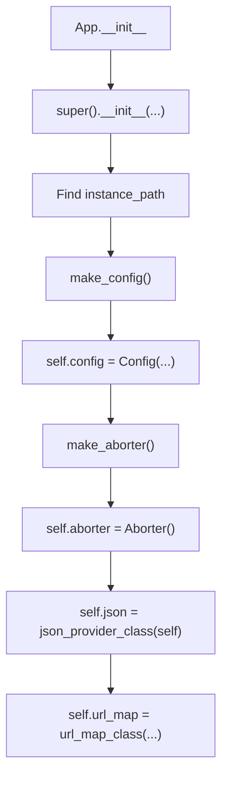
This flow shows the key steps during application instantiation, including creating the configuration object, the aborter for HTTP exceptions, the JSON provider, and the URL map for routing.

Sources: [src/flask/sansio/app.py:279-409](https://github.com/pallets/flask/blob/258d68b6ff5e2244386540f48b48bab90d6ab827/src/flask/sansio/app.py#L279-L409)

The application's behavior is highly customizable through class attributes that specify which classes to use for core objects.

| Attribute | Default Class | Purpose | Source |
| --- | --- | --- | --- |
| `aborter_class` | `werkzeug.exceptions.Aborter` | Creates the `app.aborter` object for handling `abort()`. | `src/flask/sansio/app.py:164` |
| `config_class` | `flask.Config` | The class used for the `app.config` dictionary. | `src/flask/sansio/app.py:193` |
| `json_provider_class` | `DefaultJSONProvider` | The class that provides JSON operations. | `src/flask/sansio/app.py:227` |
| `url_rule_class` | `werkzeug.routing.Rule` | The class used for URL rules. | `src/flask/sansio/app.py:254` |
| `url_map_class` | `werkzeug.routing.Map` | The class used for the URL rule map. | `src/flask/sansio/app.py:260` |

### Routing

The `App` class provides the concrete implementation for `add_url_rule`, which was abstract in `Scaffold`. This method is the core of Flask's routing system.

The process of adding a URL rule is as follows:
1.  An endpoint name is determined. If not provided, it's derived from the view function's name (`_endpoint_from_view_func`).
2.  HTTP methods are determined. If not provided, they are taken from the view function's `methods` attribute or defaulted to `("GET",)`.
3.  Automatic `OPTIONS` handling is configured based on application settings.
4.  A `Rule` object is instantiated using `self.url_rule_class`.
5.  The rule object is added to the `self.url_map`.
6.  The view function is associated with the endpoint in `self.view_functions`.

```python
# A simplified representation of the logic in add_url_rule
def add_url_rule(
    self,
    rule: str,
    endpoint: str | None = None,
    view_func: ft.RouteCallable | None = None,
    # ...
) -> None:
    if endpoint is None:
        endpoint = _endpoint_from_view_func(view_func)
    
    # ... method and options processing ...

    rule_obj = self.url_rule_class(rule, methods=methods, **options)
    self.url_map.add(rule_obj)

    if view_func is not None:
        self.view_functions[endpoint] = view_func
```

Sources: [src/flask/sansio/app.py:602-659](https://github.com/pallets/flask/blob/258d68b6ff5e2244386540f48b48bab90d6ab827/src/flask/sansio/app.py#L602-L659), [src/flask/sansio/scaffold.py:701-706](https://github.com/pallets/flask/blob/258d68b6ff5e2244386540f48b48bab90d6ab827/src/flask/sansio/scaffold.py#L701-L706)

### Setup Finalization

`App` implements the `_check_setup_finished` method required by the `@setupmethod` decorator. It uses an internal flag, `_got_first_request`, which is set after the first request is handled. Any subsequent calls to a setup method will raise an `AssertionError`. This prevents changes to a live application that would not be applied consistently.

Sources: [src/flask/sansio/app.py:408](https://github.com/pallets/flask/blob/258d68b6ff5e2244386540f48b48bab90d6ab827/src/flask/sansio/app.py#L408), [src/flask/sansio/app.py:410-421](https://github.com/pallets/flask/blob/258d68b6ff5e2244386540f48b48bab90d6ab827/src/flask/sansio/app.py#L410-L421)

### Templating

The `App` class manages the Jinja2 templating environment. It provides decorators to register custom filters, tests, and globals.

-   `@app.template_filter()`: Registers a custom template filter.
-   `@app.template_test()`: Registers a custom template test.
-   `@app.template_global()`: Registers a custom template global.

These decorators are setup methods that add the given function to the `jinja_env.filters`, `jinja_env.tests`, or `jinja_env.globals` dictionaries, respectively. The `jinja_env` itself is a `cached_property`, created on first access by `create_jinja_environment`. The `create_jinja_environment` method in `sansio.app` is abstract (`raise NotImplementedError()`), as its full implementation depends on I/O-bound context processors which are part of the IO-based `flask.app`.

Sources: [src/flask/sansio/app.py:466-478](https://github.com/pallets/flask/blob/258d68b6ff5e2244386540f48b48bab90d6ab827/src/flask/sansio/app.py#L466-L478), [src/flask/sansio/app.py:660-822](https://github.com/pallets/flask/blob/258d68b6ff5e2244386540f48b48bab90d6ab827/src/flask/sansio/app.py#L660-L822)

# Page: Routing and URL Building

<details>
<summary>Relevant source files</summary>

The following files were used as context for generating this wiki page:

- [src/flask/sansio/app.py](https://github.com/pallets/flask/blob/258d68b6ff5e2244386540f48b48bab90d6ab827/src/flask/sansio/app.py)
- [src/flask/helpers.py](https://github.com/pallets/flask/blob/258d68b6ff5e2244386540f48b48bab90d6ab827/src/flask/helpers.py)
</details>

# Routing and URL Building

Flask's routing system is responsible for mapping incoming request URLs to the Python functions that handle them (view functions). It also provides a mechanism to build URLs from view function endpoints, decoupling the URL structure from the code that links to it. This system is built upon Werkzeug's routing utilities, providing a powerful and flexible way to manage application URLs.

The two primary operations are:
1.  **Route Registration**: Associating a URL rule (e.g., `/users/<int:user_id>`) with a view function.
2.  **URL Generation**: Creating a URL string for a given view function endpoint and its arguments.

## Core Routing Components

The routing system is managed by the `App` object and relies on several key classes, mostly from the underlying Werkzeug library.

| Component | Default Class | Description | Source |
| --- | --- | --- | --- |
| `url_map` | `werkzeug.routing.Map` | An attribute on the `App` instance that stores the collection of all URL rules. | `src/flask/sansio/app.py:260`, `src/flask/sansio/app.py:387-402` |
| `url_rule_class` | `werkzeug.routing.Rule` | The class used to create individual URL rule objects that are added to the `url_map`. | `src/flask/sansio/app.py:250-254` |
| `view_functions` | `dict` | A dictionary on the `App` instance that maps endpoint names to the corresponding view functions. | `src/flask/sansio/app.py:652-658` |

The relationship between these components can be visualized as follows:

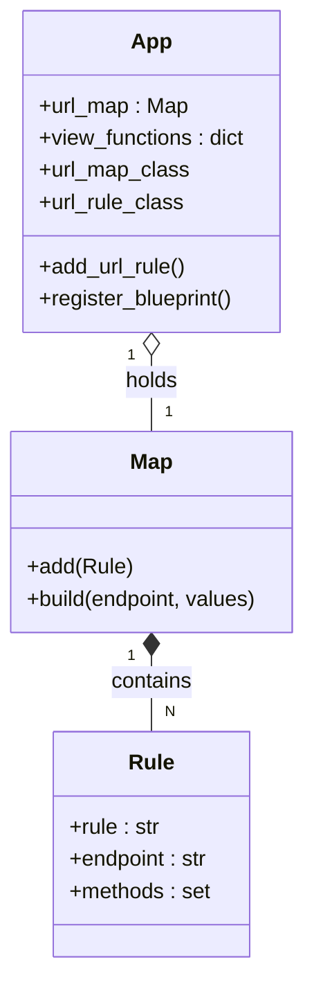
*This diagram illustrates that the `App` holds a `Map` instance, which in turn contains multiple `Rule` objects. The `App` uses its `url_rule_class` to create `Rule` objects and adds them to its `url_map`.*

## Defining Routes

Routes are defined by adding URL rules to the application's `url_map`. The primary method for this is `add_url_rule()`. Decorators like `@app.route()` are convenient wrappers around this method.

### The `add_url_rule()` Method

This method binds a URL rule to an endpoint and a view function.

`add_url_rule(rule, endpoint=None, view_func=None, provide_automatic_options=None, **options)`

| Parameter | Type | Description |
| --- | --- | --- |
| `rule` | `str` | The URL rule as a string, including variable parts like `<variable_name>`. |
| `endpoint` | `str` | The unique name for this rule, used for URL generation with `url_for()`. If `None`, it's derived from the `view_func`'s name. |
| `view_func` | `Callable` | The function to call when a request matches this rule. |
| `provide_automatic_options` | `bool` | If `True`, Flask automatically adds the `OPTIONS` method and handles `OPTIONS` requests. Defaults to `True` if `OPTIONS` is not in `methods`. |
| `methods` | `Iterable[str]` | A list of HTTP methods this rule should match (e.g., `['GET', 'POST']`). Defaults to `('GET',)` if not specified. |
| `**options` | `Any` | Additional arguments to be passed to the underlying `Rule` object, such as `defaults`, `subdomain`, etc. |

Sources: [`src/flask/sansio/app.py:602-609`]()

The process of adding a URL rule is illustrated below:

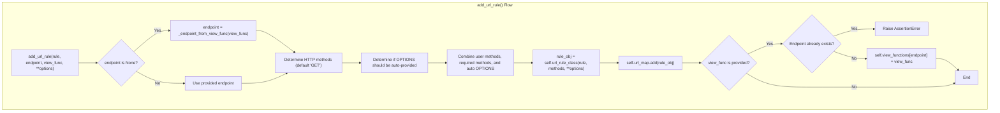
*This flowchart shows the logic within `add_url_rule`, from determining the endpoint and methods to creating and registering the `Rule` object and associating it with a view function.*
Sources: [`src/flask/sansio/app.py:602-659`]()

## Generating URLs with `url_for()`

Flask provides the `url_for()` helper function to build URLs for a specific endpoint. This is preferred over hard-coding URLs in templates and code because it allows URLs to be changed in one place without breaking links throughout the application.

The `url_for()` function is a wrapper that delegates to the `url_for` method on the current application context (`current_app`).

Sources: [`src/flask/helpers.py:200-251`]()

### `url_for()` Parameters

`url_for(endpoint, **values)`

The function takes the endpoint name as its first argument and any number of keyword arguments corresponding to the variable parts of the URL rule. Any arguments not used in the URL rule are appended as query parameters.

`url_for()` also accepts several special keyword arguments prefixed with an underscore:

| Parameter | Type | Description |
| --- | --- | --- |
| `_external` | `bool` | If `True`, generates an absolute URL including the scheme and host. |
| `_scheme` | `str` | Specifies a URL scheme (e.g., `https` or `wss`) if the URL is external. |
| `_anchor` | `str` | Appends a fragment (e.g., `#anchor`) to the URL. |
| `_method` | `str` | Specifies the HTTP method to consider when finding a matching rule, which can be useful if multiple rules for the same endpoint differ by method. |

Sources: [`src/flask/helpers.py:203-207`]()

The following diagram shows the sequence of a typical `url_for()` call:

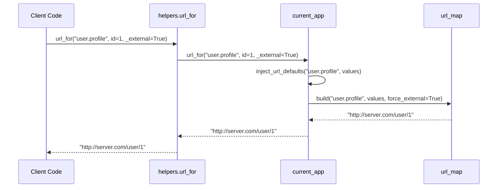
*This sequence shows that `helpers.url_for` calls `current_app.url_for`, which in turn may inject default values before using the `url_map` to build the final URL string.*

### URL Parameter Defaults

Flask allows defining default values for URL parameters on a per-application or per-blueprint basis. These defaults are injected during URL generation by the `inject_url_defaults` method. This method is called automatically by `url_for`.

When building a URL for an endpoint, `inject_url_defaults` iterates through the registered URL default functions for the relevant application and blueprint hierarchy, allowing each function to modify the `values` dictionary before the URL is built.

For a nested blueprint endpoint like `"bp1.bp2.my_view"`, it will check for default functions registered for `"bp1.bp2"`, then `"bp1"`, and finally the application itself.

Sources: [`src/flask/sansio/app.py:957-977`](), [`src/flask/helpers.py:644-651`]()

## URL Build Error Handling

If `url_for()` is called with an endpoint that doesn't exist or with arguments that don't match the URL rule, Werkzeug's `url_map.build()` will raise a `BuildError`. Flask provides a hook to handle these errors gracefully.

The `App` object has a method `handle_url_build_error` which is called when a `BuildError` occurs. This method iterates through a list of registered handlers in `app.url_build_error_handlers`. Each handler is called with the error, endpoint, and values. If a handler returns a string, that string is used as the result of the `url_for()` call. If it returns `None` or raises a `BuildError`, the next handler is tried. If no handler provides a return value, the original exception is re-raised.

Sources: [`src/flask/sansio/app.py:350-352`](), [`src/flask/sansio/app.py:978-1010`]()

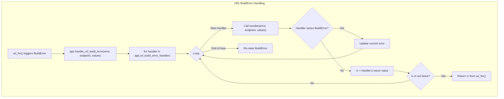
*This flowchart details the process Flask uses to allow custom handling of URL build errors, providing a fallback mechanism before an exception is raised.*

## Blueprints and Routing

Blueprints are Flask's concept for organizing an application into smaller, reusable components. Each blueprint can have its own routes, templates, and static files.

When a blueprint is registered on an application using `app.register_blueprint()`, its routes are added to the application's `url_map`. The blueprint's name is prepended to its endpoints, creating a namespace. For example, a view function `show` in a blueprint named `user` will have the endpoint `user.show`. This namespacing prevents endpoint collisions between different parts of an application.

The `url_for()` function is aware of these namespaces. To generate a URL for a blueprint's endpoint, you use the format `url_for('blueprint_name.endpoint_name')`.

Sources: [`src/flask/sansio/app.py:368-374`](), [`src/flask/sansio/app.py:567-593`]()

# Page: Request and Response Objects

<details>
<summary>Relevant source files</summary>

The following files were used as context for generating this wiki page:

- [src/flask/wrappers.py](https://github.com/pallets/flask/blob/258d68b6ff5e2244386540f48b48bab90d6ab827/src/flask/wrappers.py)
- [tests/test_request.py](https://github.com/pallets/flask/blob/258d68b6ff5e2244386540f48b48bab90d6ab827/tests/test_request.py)
- [tests/static/config.toml](https://github.com/pallets/flask/blob/258d68b6ff5e2244386540f48b48bab90d6ab827/tests/static/config.toml)
- [tests/test_apps/blueprintapp/__init__.py](https://github.com/pallets/flask/blob/258d68b6ff5e2244386540f48b48bab90d6ab827/tests/test_apps/blueprintapp/__init__.py)
- [tests/test_apps/blueprintapp/apps/__init__.py](https://github.com/pallets/flask/blob/258d68b6ff5e2244386540f48b48bab90d6ab827/tests/test_apps/blueprintapp/apps/__init__.py)
- [tests/test_apps/blueprintapp/apps/admin/__init__.py](https://github.com/pallets/flask/blob/258d68b6ff5e2244386540f48b48bab90d6ab827/tests/test_apps/blueprintapp/apps/admin/__init__.py)
- [tests/test_apps/blueprintapp/apps/frontend/__init__.py](https://github.com/pallets/flask/blob/258d68b6ff5e2244386540f48b48bab90d6ab827/tests/test_apps/blueprintapp/apps/frontend/__init__.py)
- [tests/test_apps/cliapp/__init__.py](https://github.com/pallets/flask/blob/258d68b6ff5e2244386540f48b48bab90d6ab827/tests/test_apps/cliapp/__init__.py)
- [tests/test_apps/cliapp/app.py](https://github.com/pallets/flask/blob/258d68b6ff5e2244386540f48b48bab90d6ab827/tests/test_apps/cliapp/app.py)
- [tests/test_apps/cliapp/factory.py](https://github.com/pallets/flask/blob/258d68b6ff5e2244386540f48b48bab90d6ab827/tests/test_apps/cliapp/factory.py)
- [tests/test_apps/cliapp/importerrorapp.py](https://github.com/pallets/flask/blob/258d68b6ff5e2244386540f48b48bab90d6ab827/tests/test_apps/cliapp/importerrorapp.py)
- [tests/test_apps/cliapp/inner1/__init__.py](https://github.com/pallets/flask/blob/258d68b6ff5e2244386540f48b48bab90d6ab827/tests/test_apps/cliapp/inner1/__init__.py)
</details>

# Request and Response Objects

In Flask, the `Request` and `Response` objects are central to handling client-server communication. They are subclasses of Werkzeug's `RequestBase` and `ResponseBase` respectively, extended with Flask-specific attributes and methods to integrate seamlessly with the application context, routing system, and configuration. These objects provide a high-level, object-oriented interface to the underlying WSGI environment.

The default classes can be replaced with custom subclasses by setting the `request_class` and `response_class` attributes on the `Flask` application object. This allows for extending or modifying the default behavior to suit specific application needs.

Sources: [src/flask/wrappers.py:18-29, 222-230]()

## The Request Object

The `Request` object encapsulates an incoming HTTP request from a client. It is globally available as `flask.request` within an active request context.

### Core Inheritance and Customization

Flask's `Request` class inherits from `werkzeug.wrappers.Request` and adds properties that are tightly coupled with Flask's routing and application context.

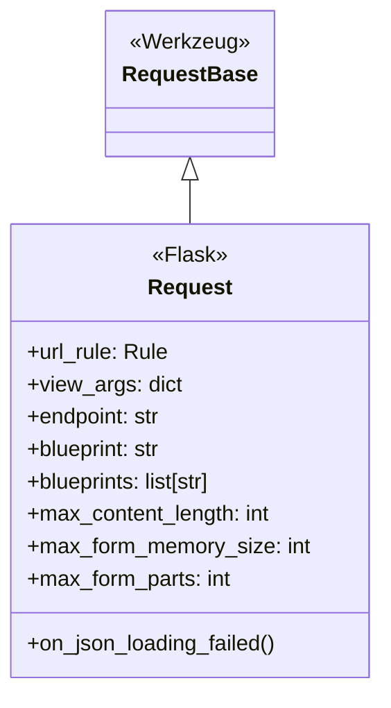
This diagram illustrates that `flask.wrappers.Request` is a specialized version of `werkzeug.wrappers.RequestBase`.

Sources: [src/flask/wrappers.py:7, 18]()

### Routing Information

After Flask's router matches a URL, it populates the request object with details about the matched endpoint. This information is invaluable for introspection, URL generation, and logic within request hooks or views.

| Property | Type | Description |
|---|---|---|
| `url_rule` | `Rule \| None` | The internal `werkzeug.routing.Rule` object that matched the request. Useful for inspecting allowed methods (`request.url_rule.methods`). |
| `view_args` | `dict[str, Any] \| None` | A dictionary of the view arguments captured from the URL. For a rule like `/users/<int:user_id>`, `view_args` would be `{'user_id': 123}`. |
| `routing_exception` | `HTTPException \| None` | If URL matching fails, this holds the Werkzeug exception, such as `NotFound`. |
| `endpoint` | `str \| None` | The name of the matched endpoint, derived from `url_rule.endpoint`. It's the name of the view function or the name provided in `@app.route`. |
| `blueprint` | `str \| None` | The name of the blueprint the matched endpoint belongs to. For an endpoint `admin.index`, this would be `admin`. |
| `blueprints` | `list[str]` | A list of all parent blueprint names for a nested blueprint. |

Sources: [src/flask/wrappers.py:33-53, 147-195](), [tests/test_apps/blueprintapp/apps/admin/__init__.py:4-10](https://github.com/pallets/flask/blob/258d68b6ff5e2244386540f48b48bab90d6ab827/tests/test_apps/blueprintapp/apps/admin/__init__.py#L4-L10)

For example, if a blueprint named `admin` is registered (`app.register_blueprint(admin)`), a request to a route within that blueprint will populate the `blueprint` property.

Sources: [tests/test_apps/blueprintapp/__init__.py:8](https://github.com/pallets/flask/blob/258d68b6ff5e2244386540f48b48bab90d6ab827/tests/test_apps/blueprintapp/__init__.py#L8), [tests/test_apps/blueprintapp/apps/admin/__init__.py:4-6](https://github.com/pallets/flask/blob/258d68b6ff5e2244386540f48b48bab90d6ab827/tests/test_apps/blueprintapp/apps/admin/__init__.py#L4-L6)

### Request Body Limits

The `Request` object provides configurable limits to prevent denial-of-service attacks from large request bodies. These can be set globally in the application config or overridden on a per-request basis.

The resolution logic for these properties follows a clear order of precedence:

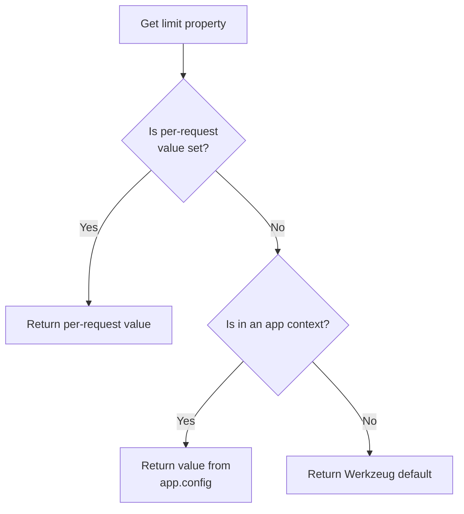
This flow applies to `max_content_length`, `max_form_memory_size`, and `max_form_parts`.

Sources: [src/flask/wrappers.py:59-145](https://github.com/pallets/flask/blob/258d68b6ff5e2244386540f48b48bab90d6ab827/src/flask/wrappers.py#L59-L145), [tests/test_request.py:25-55](https://github.com/pallets/flask/blob/258d68b6ff5e2244386540f48b48bab90d6ab827/tests/test_request.py#L25-L55)

| Property | App Config Key | Werkzeug Default | Description |
|---|---|---|---|
| `max_content_length` | `MAX_CONTENT_LENGTH` | `None` | Max size of the entire request body in bytes. |
| `max_form_memory_size` | `MAX_FORM_MEMORY_SIZE` | `500_000` | Max size for non-file fields in multipart form data. |
| `max_form_parts` | `MAX_FORM_PARTS` | `1_000` | Max number of fields (file or non-file) in multipart form data. |

These limits can be set directly on the request object within a view or a `before_request` function to apply a more specific limit for a particular endpoint.

```python
# Example from tests/test_request.py
# Set globally
app.config["MAX_CONTENT_LENGTH"] = 100

# Set per-request
r = Request({})
r.max_content_length = 90
```
Sources: [tests/test_request.py:26, 43]()

### Data Handling

#### JSON
The `Request` object uses the `json` module configured on the application for serialization and deserialization (`json_module`). The `on_json_loading_failed` method handles JSON parsing errors. By default, it raises a `werkzeug.exceptions.BadRequest`. In debug mode, the original `ValueError` is re-raised to provide more detailed feedback.

Sources: [src/flask/wrappers.py:31, 212-219]()

#### Form Data
The `_load_form_data` method is overridden to provide a developer-friendly enhancement in debug mode. If a request has a mimetype other than `multipart/form-data` and `request.files` is accessed, a more helpful error is raised to suggest adding `enctype="multipart/form-data"` to the HTML form.

Sources: [src/flask/wrappers.py:197-211](https://github.com/pallets/flask/blob/258d68b6ff5e2244386540f48b48bab90d6ab827/src/flask/wrappers.py#L197-L211)

## The Response Object

The `Response` object represents the HTTP response that Flask will send back to the client. View functions must return a response object, or a value that Flask can convert into one using `Flask.make_response`.

### Core Inheritance and Customization

Similar to the `Request` object, `flask.wrappers.Response` is a subclass of `werkzeug.wrappers.Response` and can be replaced by setting `Flask.response_class`.

Sources: [src/flask/wrappers.py:8, 222-229]()

### Key Attributes

The Flask `Response` object sets some defaults and adds properties that integrate with the application config.

| Attribute | Type | Default | Description |
|---|---|---|---|
| `default_mimetype` | `str \| None` | `"text/html"` | The mimetype used if none is specified when the object is created. |
| `json_module` | `Any` | `flask.json` | The JSON implementation to use for `response.json`. |
| `max_cookie_size` | `int` | `4093` (Werkzeug default) | A read-only property that gets the value from the `MAX_COOKIE_SIZE` application config key. |

The `max_cookie_size` is particularly notable as it directly reflects the application's configuration, falling back to Werkzeug's default only when outside an application context.

Sources: [src/flask/wrappers.py:240-257](https://github.com/pallets/flask/blob/258d68b6ff5e2244386540f48b48bab90d6ab827/src/flask/wrappers.py#L240-L257)

## Summary

Flask's `Request` and `Response` objects are powerful, extensible wrappers around the WSGI environment. The `Request` object is enriched with routing and blueprint information after URL matching, and provides robust, configurable controls for handling request body size. The `Response` object provides sensible defaults and integrates with the application configuration for features like cookie handling. Both can be subclassed to provide custom application-wide behavior, demonstrating Flask's flexibility. The existence of application factories is a common pattern for creating the `Flask` app instance which then uses these classes.

Sources: [tests/test_apps/cliapp/factory.py:4-5](https://github.com/pallets/flask/blob/258d68b6ff5e2244386540f48b48bab90d6ab827/tests/test_apps/cliapp/factory.py#L4-L5), [tests/test_apps/cliapp/app.py:3](https://github.com/pallets/flask/blob/258d68b6ff5e2244386540f48b48bab90d6ab827/tests/test_apps/cliapp/app.py#L3)

# Page: Request and Application Contexts

<details>
<summary>Relevant source files</summary>

The following files were used as context for generating this wiki page:

- [src/flask/ctx.py](https://github.com/pallets/flask/blob/258d68b6ff5e2244386540f48b48bab90d6ab827/src/flask/ctx.py)
- [src/flask/globals.py](https://github.com/pallets/flask/blob/258d68b6ff5e2244386540f48b48bab90d6ab827/src/flask/globals.py)
- [tests/test_appctx.py](https://github.com/pallets/flask/blob/258d68b6ff5e2244386540f48b48bab90d6ab827/tests/test_appctx.py)
- [tests/test_reqctx.py](https://github.com/pallets/flask/blob/258d68b6ff5e2244386540f48b48bab90d6ab827/tests/test_reqctx.py)
- [tests/test_apps/cliapp/inner1/inner2/__init__.py](https://github.com/pallets/flask/blob/258d68b6ff5e2244386540f48b48bab90d6ab827/tests/test_apps/cliapp/inner1/inner2/__init__.py)
- [tests/test_apps/cliapp/inner1/inner2/flask.py](https://github.com/pallets/flask/blob/258d68b6ff5e2244386540f48b48bab90d6ab827/tests/test_apps/cliapp/inner1/inner2/flask.py)
- [tests/test_apps/cliapp/multiapp.py](https://github.com/pallets/flask/blob/258d68b6ff5e2244386540f48b48bab90d6ab827/tests/test_apps/cliapp/multiapp.py)
- [tests/test_apps/helloworld/hello.py](https://github.com/pallets/flask/blob/258d68b6ff5e2244386540f48b48bab90d6ab827/tests/test_apps/helloworld/hello.py)
- [tests/test_apps/helloworld/wsgi.py](https://github.com/pallets/flask/blob/258d68b6ff5e2244386540f48b48bab90d6ab827/tests/test_apps/helloworld/wsgi.py)
- [tests/test_apps/subdomaintestmodule/__init__.py](https://github.com/pallets/flask/blob/258d68b6ff5e2244386540f48b48bab90d6ab827/tests/test_apps/subdomaintestmodule/__init__.py)
- [tests/test_basic.py](https://github.com/pallets/flask/blob/258d68b6ff5e2244386540f48b48bab90d6ab827/tests/test_basic.py)
- [tests/test_converters.py](https://github.com/pallets/flask/blob/258d68b6ff5e2244386540f48b48bab90d6ab827/tests/test_converters.py)
</details>

# Request and Application Contexts

In Flask, contexts are used to make application and request-specific information available to code without having to pass objects around explicitly. There are two types of contexts: the application context and the request context. The application context provides access to the application instance via the `current_app` proxy and a general-purpose storage object `g`. The request context, which is a specialization of the application context, also provides access to the current request and session objects via the `request` and `session` proxies.

These contexts are managed as a stack. When a context is "pushed," it becomes the active context for the current thread or greenlet. This mechanism allows view functions, error handlers, and other parts of the application to access objects like `request` as if they were global variables, while ensuring they are thread-safe and specific to the current request. The core implementation relies on Python's `contextvars` for managing context state.

Sources: [src/flask/ctx.py:260-266](https://github.com/pallets/flask/blob/258d68b6ff5e2244386540f48b48bab90d6ab827/src/flask/ctx.py#L260-L266), [src/flask/globals.py:33-62](https://github.com/pallets/flask/blob/258d68b6ff5e2244386540f48b48bab90d6ab827/src/flask/globals.py#L33-L62)

## Context Architecture

The context system is built around the `AppContext` class, a `ContextVar`, and several `LocalProxy` objects that provide a user-friendly interface.

### The `AppContext` Class

The `AppContext` class encapsulates all the information for both application and request contexts. As of Flask 3.2, it has merged the functionality of the former `RequestContext`. An `AppContext` is created for every request and CLI command.

Sources: [src/flask/ctx.py:260-298](https://github.com/pallets/flask/blob/258d68b6ff5e2244386540f48b48bab90d6ab827/src/flask/ctx.py#L260-L298)

Key attributes of `AppContext`:

| Attribute | Type | Description |
| --- | --- | --- |
| `app` | `Flask` | The application instance this context belongs to. |
| `g` | `_AppCtxGlobals` | A namespace object for storing data during the context's lifetime. |
| `url_adapter` | `MapAdapter` | The URL adapter for matching and building URLs. |
| `_request` | `Request` | The request object. Is `None` if it's a pure app context. |
| `_session` | `SessionMixin` | The session object. Loaded on first access. |

Sources: [src/flask/ctx.py:307-323](https://github.com/pallets/flask/blob/258d68b6ff5e2244386540f48b48bab90d6ab827/src/flask/ctx.py#L307-L323)

```mermaid
classDiagram
    direction TD
    class AppContext {
        +Flask app
        +_AppCtxGlobals g
        +MapAdapter url_adapter
        +Request _request
        +SessionMixin _session
        +push() None
        +pop(exc) None
        +copy() AppContext
        +match_request() None
    }
    class _AppCtxGlobals {
        <<Namespace>>
        +get(name, default) Any
        +pop(name, default) Any
        +setdefault(name, default) Any
    }
    AppContext --> "_AppCtxGlobals" : creates
    AppContext --> "Flask" : has
    AppContext --> "Request" : has
    AppContext --> "SessionMixin" : has
```
*Diagram illustrating the structure of the `AppContext` class and its relationship with `_AppCtxGlobals`.*
Sources: [src/flask/ctx.py:30-116](https://github.com/pallets/flask/blob/258d68b6ff5e2244386540f48b48bab90d6ab827/src/flask/ctx.py#L30-L116), [src/flask/ctx.py:260-526](https://github.com/pallets/flask/blob/258d68b6ff5e2244386540f48b48bab90d6ab827/src/flask/ctx.py#L260-L526)

### Context-Local Proxies

Flask provides several globally accessible proxy objects that resolve to attributes on the currently active `AppContext`. These proxies are instances of `werkzeug.local.LocalProxy` and are the primary way developers interact with context-specific data.

| Proxy | Points to | Description |
| --- | --- | --- |
| `current_app` | `app_ctx.app` | The active `Flask` application instance. |
| `g` | `app_ctx.g` | The `_AppCtxGlobals` object for storing arbitrary data. |
| `request` | `app_ctx.request` | The current `Request` object. Only available in a request context. |
| `session` | `app_ctx.session` | The current `SessionMixin` object. Only available in a request context. |

These proxies are bound to a `ContextVar` named `flask.app_ctx` (`_cv_app`), which holds the active `AppContext`. When a proxy is accessed, it looks up the current `AppContext` from the `ContextVar` and retrieves the corresponding attribute. If no context is active, a `RuntimeError` is raised.

Sources: [src/flask/globals.py:40-62](https://github.com/pallets/flask/blob/258d68b6ff5e2244386540f48b48bab90d6ab827/src/flask/globals.py#L40-L62)

```mermaid
graph TD
    subgraph "ContextVar"
        _cv_app["_cv_app (ContextVar('flask.app_ctx'))"]
    end

    subgraph "Active Context"
        AppContext_instance["AppContext Instance"]
        AppContext_instance -- contains --> Flask_app["app: Flask"]
        AppContext_instance -- contains --> g_object["g: _AppCtxGlobals"]
        AppContext_instance -- contains --> request_object["request: Request"]
        AppContext_instance -- contains --> session_object["session: SessionMixin"]
    end

    _cv_app -- "holds" --> AppContext_instance

    subgraph "Global Proxies (werkzeug.local.LocalProxy)"
        current_app["current_app"]
        g["g"]
        request["request"]
        session["session"]
    end

    current_app -- "proxies to" --> Flask_app
    g -- "proxies to" --> g_object
    request -- "proxies to" --> request_object
    session -- "proxies to" --> session_object
```
*This diagram shows how global proxies like `current_app` and `request` resolve to attributes on the active `AppContext` instance held by the `_cv_app` context variable.*
Sources: [src/flask/globals.py:40-62](https://github.com/pallets/flask/blob/258d68b6ff5e2244386540f48b48bab90d6ab827/src/flask/globals.py#L40-L62), [src/flask/ctx.py:300-404](https://github.com/pallets/flask/blob/258d68b6ff5e2244386540f48b48bab90d6ab827/src/flask/ctx.py#L300-L404)

## Context Lifecycle

The lifecycle of a context is typically managed using a `with` statement, which ensures it is properly pushed at the start and popped at the end, even if errors occur.

Sources: [tests/test_appctx.py:40-43](https://github.com/pallets/flask/blob/258d68b6ff5e2244386540f48b48bab90d6ab827/tests/test_appctx.py#L40-L43), [tests/test_reqctx.py:126-132](https://github.com/pallets/flask/blob/258d68b6ff5e2244386540f48b48bab90d6ab827/tests/test_reqctx.py#L126-L132)

### Pushing a Context

When an `AppContext` is pushed, it becomes the active context. This is handled by the `push()` method, which is called by `__enter__`.

The `push()` method performs the following steps:
1.  Increments a `_push_count` to handle nested pushes of the same context.
2.  If the context is not already active, it sets the `_cv_app` `ContextVar` to itself, storing the previous state in `_cv_token`.
3.  Dispatches the `appcontext_pushed` signal.
4.  If it is a request context (`_request` is not `None`):
    - The session is opened by calling `_get_session()`. This allows custom session interfaces to access the request context.
    - URL routing is performed by calling `match_request()`. This populates `request.url_rule` and `request.view_args` or `request.routing_exception`.

Sources: [src/flask/ctx.py:416-445](https://github.com/pallets/flask/blob/258d68b6ff5e2244386540f48b48bab90d6ab827/src/flask/ctx.py#L416-L445)

### Popping a Context

When the `with` block exits, `__exit__` calls the `pop()` method. This cleans up the context and restores the previous one.

The `pop()` method performs these steps:
1.  Decrements the `_push_count`. If the count is still greater than 0, it returns, as this is a nested pop.
2.  If it was a request context, it calls the request teardown functions registered with `@app.teardown_request`.
3.  Calls the application teardown functions registered with `@app.teardown_appcontext`.
4.  Resets the `_cv_app` `ContextVar` to its previous state using the stored token.
5.  Dispatches the `appcontext_popped` signal.
6.  Any exceptions that occurred during the teardown process are collected and raised.

Sources: [src/flask/ctx.py:446-505](https://github.com/pallets/flask/blob/258d68b6ff5e2244386540f48b48bab90d6ab827/src/flask/ctx.py#L446-L505), [tests/test_appctx.py:46-56](https://github.com/pallets/flask/blob/258d68b6ff5e2244386540f48b48bab90d6ab827/tests/test_appctx.py#L46-L56)

```mermaid
sequenceDiagram
    participant C as Caller
    participant AC as AppContext
    participant CV as "_cv_app (ContextVar)"
    participant S as Signals
    participant App as "Flask App"

    C->>AC: with app.app_context():
    AC->>AC: push()
    AC->>CV: set(self)
    CV-->>AC: token
    AC->>S: appcontext_pushed.send()
    note over AC,App: If request context, open session and match URL
    AC-->>C: context is active

    C->>C: ... code using current_app, g, request ...

    C->>AC: (end of with block)
    AC->>AC: pop()
    note over AC,App: If request context, run request teardowns
    AC->>App: do_teardown_request(exc)
    App-->>AC:
    AC->>App: do_teardown_appcontext(exc)
    App-->>AC:
    AC->>CV: reset(token)
    CV-->>AC:
    AC->>S: appcontext_popped.send()
    AC-->>C: context is inactive
```
*Sequence diagram of the push/pop lifecycle of an `AppContext` managed by a `with` statement.*
Sources: [src/flask/ctx.py:416-517](https://github.com/pallets/flask/blob/258d68b6ff5e2244386540f48b48bab90d6ab827/src/flask/ctx.py#L416-L517)

## The `g` Object

The `g` object (`flask.g`) is a proxy to an instance of `_AppCtxGlobals`. It is created for each application context and can be used as a temporary namespace to store data during the life of a context. For example, it's a common place to store a database connection or the currently logged-in user.

The `_AppCtxGlobals` class provides a `dict`-like interface for attribute access.

| Method | Description |
| --- | --- |
| `get(name, default=None)` | Get an attribute, returning a default value if not found. |
| `pop(name, default=...)` | Get and remove an attribute. |
| `setdefault(name, default=None)` | Get an attribute, or set and return a default if not found. |
| `in` operator | Checks for the presence of an attribute. |
| `iter()` | Iterates over the attribute names. |

A custom class for `g` can be specified by setting `app.app_ctx_globals_class`.

Sources: [src/flask/ctx.py:30-116](https://github.com/pallets/flask/blob/258d68b6ff5e2244386540f48b48bab90d6ab827/src/flask/ctx.py#L30-L116), [tests/test_appctx.py:139-160](https://github.com/pallets/flask/blob/258d68b6ff5e2244386540f48b48bab90d6ab827/tests/test_appctx.py#L139-L160), [tests/test_appctx.py:162-170](https://github.com/pallets/flask/blob/258d68b6ff5e2244386540f48b48bab90d6ab827/tests/test_appctx.py#L162-L170)

## Context-aware Functions

Flask provides several functions that must be used within an active context.

### `has_app_context()` and `has_request_context()`

These functions can be used to check if an application or request context is currently active.
- `has_app_context()` returns `True` if `_cv_app.get()` is not `None`. This is useful in CLI commands or other non-request scenarios.
- `has_request_context()` returns `True` if an app context is active *and* it contains a request object (`ctx.has_request`).

Sources: [src/flask/ctx.py:209-233](https://github.com/pallets/flask/blob/258d68b6ff5e2244386540f48b48bab90d6ab827/src/flask/ctx.py#L209-L233), [src/flask/ctx.py:235-258](https://github.com/pallets/flask/blob/258d68b6ff5e2244386540f48b48bab90d6ab827/src/flask/ctx.py#L235-L258)

### `copy_current_request_context(f)`

This decorator is used to capture the current request context and run a function within it later. This is particularly useful for background tasks (e.g., in a greenlet or thread) that need to access request-specific information like `request` or `session`. The decorator works by calling `ctx.copy()` and wrapping the function to run inside a `with` block for the copied context.

Sources: [src/flask/ctx.py:154-207](https://github.com/pallets/flask/blob/258d68b6ff5e2244386540f48b48bab90d6ab827/src/flask/ctx.py#L154-L207), [tests/test_reqctx.py:179-202](https://github.com/pallets/flask/blob/258d68b6ff5e2244386540f48b48bab90d6ab827/tests/test_reqctx.py#L179-L202)

### `after_this_request(f)`

This decorator registers a function to be executed after the current request has been handled, but before the context is torn down. It is a one-time version of `@app.after_request`. It must be called from within an active request context, as it appends the function to the `_after_request_functions` list on the current `AppContext`.

Sources: [src/flask/ctx.py:118-148](https://github.com/pallets/flask/blob/258d68b6ff5e2244386540f48b48bab90d6ab827/src/flask/ctx.py#L118-L148), [tests/test_basic.py:760-772](https://github.com/pallets/flask/blob/258d68b6ff5e2244386540f48b48bab90d6ab827/tests/test_basic.py#L760-L772)

## Teardown Behavior

When a context is popped, Flask executes teardown functions. This is a reliable way to ensure resources are cleaned up.

- **Request Teardowns**: Functions registered with `@app.teardown_request` are executed when a request context is popped. They receive the exception that occurred during request handling, or `None` if no exception occurred.
- **App Context Teardowns**: Functions registered with `@app.teardown_appcontext` are executed whenever an app context (including request contexts) is popped. They also receive the exception.

The teardown process is designed to be robust. All registered teardown functions and signals are executed, even if some of them raise exceptions. The exceptions are collected and may be re-raised together.

Sources: [src/flask/ctx.py:488-505](https://github.com/pallets/flask/blob/258d68b6ff5e2244386540f48b48bab90d6ab827/src/flask/ctx.py#L488-L505), [tests/test_appctx.py:46-56](https://github.com/pallets/flask/blob/258d68b6ff5e2244386540f48b48bab90d6ab827/tests/test_appctx.py#L46-L56), [tests/test_reqctx.py:16-28](https://github.com/pallets/flask/blob/258d68b6ff5e2244386540f48b48bab90d6ab827/tests/test_reqctx.py#L16-L28), [tests/test_appctx.py:216-265](https://github.com/pallets/flask/blob/258d68b6ff5e2244386540f48b48bab90d6ab827/tests/test_appctx.py#L216-L265)

# Page: Blueprints for Modular Applications

<details>
<summary>Relevant source files</summary>

The following files were used as context for generating this wiki page:

- [src/flask/blueprints.py](https://github.com/pallets/flask/blob/258d68b6ff5e2244386540f48b48bab90d6ab827/src/flask/blueprints.py)
- [src/flask/sansio/blueprints.py](https://github.com/pallets/flask/blob/258d68b6ff5e2244386540f48b48bab90d6ab827/src/flask/sansio/blueprints.py)
- [tests/test_blueprints.py](https://github.com/pallets/flask/blob/258d68b6ff5e2244386540f48b48bab90d6ab827/tests/test_blueprints.py)
- [tests/test_helpers.py](https://github.com/pallets/flask/blob/258d68b6ff5e2244386540f48b48bab90d6ab827/tests/test_helpers.py)
- [tests/test_instance_config.py](https://github.com/pallets/flask/blob/258d68b6ff5e2244386540f48b48bab90d6ab827/tests/test_instance_config.py)
- [tests/test_json_tag.py](https://github.com/pallets/flask/blob/258d68b6ff5e2244386540f48b48bab90d6ab827/tests/test_json_tag.py)
- [tests/test_logging.py](https://github.com/pallets/flask/blob/258d68b6ff5e2244386540f48b48bab90d6ab827/tests/test_logging.py)
- [tests/test_regression.py](https://github.com/pallets/flask/blob/258d68b6ff5e2244386540f48b48bab90d6ab827/tests/test_regression.py)
- [tests/test_subclassing.py](https://github.com/pallets/flask/blob/258d68b6ff5e2244386540f48b48bab90d6ab827/tests/test_subclassing.py)
</details>

# Blueprints for Modular Applications

Blueprints are Flask's concept for building modular and reusable application components. A `Blueprint` object represents a collection of routes, views, templates, static files, and other app-related functions. It is not an application itself; rather, it's a blueprint for how to construct or extend an application. This allows for better organization of larger projects by grouping related functionality into distinct modules, which can then be registered on an application, potentially multiple times with different configurations.

The core idea is to defer the registration of functions until the blueprint is registered with an application. This is achieved by recording setup functions that are executed later in the context of a specific application. This approach decouples components from the main application instance, enhancing reusability and maintainability.

## Core Concepts

### The `Blueprint` Class

The central component is the `flask.Blueprint` class, which inherits from `flask.sansio.blueprints.Blueprint`. It acts as a container for deferred application functions.

```mermaid
classDiagram
    direction TD
    class Scaffold {
        +import_name
        +root_path
        +static_folder
        +static_url_path
        +template_folder
    }
    class SansioBlueprint {
        <<SansIO>>
        +name
        +url_prefix
        +subdomain
        +deferred_functions
        +register(app, options)
        +record(func)
        +add_url_rule()
    }
    class Blueprint {
        +cli
        +get_send_file_max_age()
        +send_static_file()
        +open_resource()
    }

    Scaffold <|-- SansioBlueprint
    SansioBlueprint <|-- Blueprint
```
*Diagram illustrating the inheritance structure of the Blueprint class.*
Sources: [src/flask/blueprints.py:18](https://github.com/pallets/flask/blob/258d68b6ff5e2244386540f48b48bab90d6ab827/src/flask/blueprints.py#L18), [src/flask/sansio/blueprints.py:119](https://github.com/pallets/flask/blob/258d68b6ff5e2244386540f48b48bab90d6ab827/src/flask/sansio/blueprints.py#L119)

When creating a `Blueprint` instance, several parameters can be configured to define its behavior and resources.

| Parameter | Type | Description |
| --- | --- | --- |
| `name` | `str` | The name of the blueprint. Used to prefix endpoint names. Cannot be empty or contain a dot. |
| `import_name` | `str` | The name of the blueprint's package or module, typically `__name__`. Used to locate the `root_path`. |
| `static_folder` | `str \| os.PathLike \| None` | Path to the folder for static files, relative to the blueprint's `root_path`. |
| `static_url_path` | `str \| None` | URL path to serve static files from. Defaults to the value of `static_folder`. |
| `template_folder` | `str \| os.PathLike \| None` | Path to the folder for templates, relative to the blueprint's `root_path`. |
| `url_prefix` | `str \| None` | A URL path to prepend to all routes defined on the blueprint. |
| `subdomain` | `str \| None` | A subdomain that all blueprint routes will match on by default. |
| `url_defaults` | `dict \| None` | A dictionary of default values for URL variables in the blueprint's routes. |
| `root_path` | `str \| None` | The root path for the blueprint's resources. Usually detected automatically from `import_name`. |
| `cli_group` | `str \| None` | The name of the Click group for CLI commands registered on the blueprint. |

Sources: [src/flask/blueprints.py:19-31](https://github.com/pallets/flask/blob/258d68b6ff5e2244386540f48b48bab90d6ab827/src/flask/blueprints.py#L19-L31), [src/flask/sansio/blueprints.py:174-186](https://github.com/pallets/flask/blob/258d68b6ff5e2244386540f48b48bab90d6ab827/src/flask/sansio/blueprints.py#L174-L186)

### Blueprint Registration

A blueprint is inactive until it is registered on a Flask application using the `app.register_blueprint()` method. During registration, the functions recorded on the blueprint are applied to the application.

The registration process is managed by the `Blueprint.register()` method, which creates a `BlueprintSetupState` object. This state object holds the application context and registration options, and is passed to all deferred functions.

```mermaid
sequenceDiagram
    participant User
    participant App
    participant Blueprint
    participant BlueprintSetupState

    User->>App: register_blueprint(bp, options)
    App->>Blueprint: register(app, options)
    Blueprint->>Blueprint: make_setup_state(app, options)
    Blueprint-->>Blueprint: state
    loop for each deferred_function
        Blueprint->>Blueprint: deferred_function(state)
    end
    Note over Blueprint,BlueprintSetupState: Deferred functions use the state to<br/>add rules, hooks, etc. to the app.
    loop for each nested_blueprint
        Blueprint->>Blueprint: nested_bp.register(app, nested_options)
    end
    Blueprint-->>App: 
    App-->>User: 
```
*Sequence diagram of the blueprint registration process.*
Sources: [src/flask/sansio/blueprints.py:273-378](https://github.com/pallets/flask/blob/258d68b6ff5e2244386540f48b48bab90d6ab827/src/flask/sansio/blueprints.py#L273-L378)

The `BlueprintSetupState` class is a temporary object that provides context during registration. It combines the blueprint's own configuration with any options passed during `register_blueprint` (e.g., a dynamic `url_prefix`).

Key attributes of `BlueprintSetupState`:
- `app`: A reference to the application instance.
- `blueprint`: A reference to the blueprint being registered.
- `options`: The dictionary of options passed to `register_blueprint`.
- `first_registration`: A boolean indicating if this is the first time this blueprint is registered on any app.
- `url_prefix`: The final URL prefix, resolved from blueprint and registration options.
- `subdomain`: The final subdomain.

Sources: [src/flask/sansio/blueprints.py:34-86](https://github.com/pallets/flask/blob/258d68b6ff5e2244386540f48b48bab90d6ab827/src/flask/sansio/blueprints.py#L34-L86)

## Defining Behavior

Blueprints use decorators similar to the `Flask` app object to define routes, error handlers, and request hooks. These decorators don't immediately register with an app, but instead record a function to be called at registration time.

### Routing

Routes are defined using the `@route()` decorator. The endpoint name for a view function is automatically prefixed with the blueprint's name.

```python
# src/flask/sansio/blueprints.py:413-441
bp = Blueprint("bp", __name__)

@bp.route("/foo")
def foo():
    return "foo"
```
When this blueprint is registered, it's equivalent to calling `app.add_url_rule("/<url_prefix>/foo", endpoint="bp.foo", view_func=foo)`. The `add_url_rule` method on the blueprint records a lambda that calls `state.add_url_rule` during registration.

The endpoint can be customized, but it cannot contain a dot (`.`) to avoid ambiguity with the blueprint's namespacing.
Sources: [src/flask/sansio/blueprints.py:413-441](https://github.com/pallets/flask/blob/258d68b6ff5e2244386540f48b48bab90d6ab827/src/flask/sansio/blueprints.py#L413-L441), [tests/test_blueprints.py:318-335](https://github.com/pallets/flask/blob/258d68b6ff5e2244386540f48b48bab90d6ab827/tests/test_blueprints.py#L318-L335)

### Request Hooks and Error Handlers

Blueprints can have their own request hooks and error handlers that are specific to requests handled by that blueprint. They can also register hooks and handlers that apply to the entire application.

| Decorator | Scope | Description |
| --- | --- | --- |
| `@bp.before_request` | Blueprint | Runs before each request handled by the blueprint. |
| `@bp.after_request` | Blueprint | Runs after each request handled by the blueprint. |
| `@bp.teardown_request` | Blueprint | Runs at the end of a request handled by the blueprint, regardless of exceptions. |
| `@bp.errorhandler(code)` | Blueprint | Handles errors for requests routed to the blueprint. |
| `@bp.context_processor` | Blueprint | Injects variables into the template context for the blueprint's views. |
| `@bp.before_app_request` | Application | Runs before every request in the application. |
| `@bp.after_app_request` | Application | Runs after every request in the application. |
| `@bp.teardown_app_request` | Application | Runs at the end of every request in the application. |
| `@bp.app_errorhandler(code)` | Application | Handles errors for any request in the application. |
| `@bp.app_context_processor` | Application | Injects variables into the template context for all views. |

Sources: [src/flask/sansio/blueprints.py:613-670](https://github.com/pallets/flask/blob/258d68b6ff5e2244386540f48b48bab90d6ab827/src/flask/sansio/blueprints.py#L613-L670), [tests/test_blueprints.py:768-836](https://github.com/pallets/flask/blob/258d68b6ff5e2244386540f48b48bab90d6ab827/tests/test_blueprints.py#L768-L836), [tests/test_blueprints.py:673-712](https://github.com/pallets/flask/blob/258d68b6ff5e2244386540f48b48bab90d6ab827/tests/test_blueprints.py#L673-L712)

The following diagram illustrates the error handler resolution logic.

```mermaid
graph TD
    A[Request triggers an error] --> B{Is there a handler for this error on the matched blueprint?};
    B -- Yes --> C[Execute blueprint error handler];
    B -- No --> D{Is there a handler for this error on the application?};
    D -- Yes --> E[Execute application error handler];
    D -- No --> F[Use default Werkzeug exception];
    C --> G[End];
    E --> G;
    F --> G;
```
*Flowchart for error handler resolution.*
Sources: [tests/test_blueprints.py:8-43](https://github.com/pallets/flask/blob/258d68b6ff5e2244386540f48b48bab90d6ab827/tests/test_blueprints.py#L8-L43)

### Template Helpers

Blueprints can register template filters, tests, and globals that are available application-wide using the `app_template_filter`, `app_template_test`, and `app_template_global` decorators. These are registered only once per application, even if the blueprint is registered multiple times.

Sources: [src/flask/sansio/blueprints.py:443-611](https://github.com/pallets/flask/blob/258d68b6ff5e2244386540f48b48bab90d6ab827/src/flask/sansio/blueprints.py#L443-L611), [tests/test_blueprints.py:353-427](https://github.com/pallets/flask/blob/258d68b6ff5e2244386540f48b48bab90d6ab827/tests/test_blueprints.py#L353-L427)

## Resources

### Static Files and Templates

A blueprint can be associated with its own `static_folder` and `template_folder`.
- **Static Files**: If `static_folder` is set, a route is automatically added to serve these files from `static_url_path`. The `Blueprint` class provides its own `send_static_file` method to handle this. It also has a `get_send_file_max_age` method to control caching, which by default uses the `SEND_FILE_MAX_AGE_DEFAULT` app config value.
- **Templates**: If `template_folder` is set, it is added to the application's template search path. Blueprint templates have a lower precedence than the application's main template folder.

Sources: [src/flask/blueprints.py:82-102](https://github.com/pallets/flask/blob/258d68b6ff5e2244386540f48b48bab90d6ab827/src/flask/blueprints.py#L82-L102), [src/flask/sansio/blueprints.py:323-328](https://github.com/pallets/flask/blob/258d68b6ff5e2244386540f48b48bab90d6ab827/src/flask/sansio/blueprints.py#L323-L328), [tests/test_blueprints.py:176-221](https://github.com/pallets/flask/blob/258d68b6ff5e2244386540f48b48bab90d6ab827/tests/test_blueprints.py#L176-L221)

### Opening Resources

The `open_resource()` method allows opening a file relative to the blueprint's `root_path`. This is useful for accessing data files packaged with the blueprint module.

```python
# src/flask/blueprints.py:104-128
def open_resource(
    self, resource: str, mode: str = "rb", encoding: str | None = "utf-8"
) -> t.IO[t.AnyStr]:
    """Open a resource file relative to :attr:`root_path` for reading."""
    if mode not in {"r", "rt", "rb"}:
        raise ValueError("Resources can only be opened for reading.")

    path = os.path.join(self.root_path, resource)

    if mode == "rb":
        return open(path, mode)

    return open(path, mode, encoding=encoding)
```
Sources: [src/flask/blueprints.py:104-128](https://github.com/pallets/flask/blob/258d68b6ff5e2244386540f48b48bab90d6ab827/src/flask/blueprints.py#L104-L128), [tests/test_helpers.py:355-378](https://github.com/pallets/flask/blob/258d68b6ff5e2244386540f48b48bab90d6ab827/tests/test_helpers.py#L355-L378)

## Advanced Usage

### Nesting Blueprints

Blueprints can be registered on other blueprints. This allows for creating a hierarchical structure of components. When a child blueprint is registered on a parent, its `url_prefix` and `subdomain` are combined with the parent's.

```mermaid
graph TD
    subgraph Application
        A["app.register_blueprint(parent, url_prefix='/parent')"]
    end
    subgraph "parent: Blueprint"
        B["parent.register_blueprint(child, url_prefix='/child')"]
    end
    subgraph "child: Blueprint"
        C["child.register_blueprint(grandchild, url_prefix='/grandchild')"]
    end
    subgraph "grandchild: Blueprint"
        D["@grandchild.route('/')"]
    end

    A --> B --> C --> D

    subgraph "Resulting Route"
        R["/parent/child/grandchild/"]
    end

    D -- "Endpoint: parent.child.grandchild.index" --> R
```
*Visualization of nested blueprint URL prefix composition.*
Sources: [src/flask/sansio/blueprints.py:349-378](https://github.com/pallets/flask/blob/258d68b6ff5e2244386540f48b48bab90d6ab827/src/flask/sansio/blueprints.py#L349-L378), [tests/test_blueprints.py:865-912](https://github.com/pallets/flask/blob/258d68b6ff5e2244386540f48b48bab90d6ab827/tests/test_blueprints.py#L865-L912)

The endpoint names are also nested, joined by dots. For example, a view `index` on `grandchild` registered as above would be reachable via `url_for('parent.child.grandchild.index')`.

### Registering a Blueprint Multiple Times

The same blueprint can be registered on an application multiple times, provided a unique `name` is given at registration time. This is useful for mounting the same component at different URL prefixes or with different configurations.

```python
# tests/test_blueprints.py:1075
bp = flask.Blueprint("bp", __name__)
app.register_blueprint(bp, url_prefix="/a")
# This would raise a ValueError:
# app.register_blueprint(bp, url_prefix="/b")

# This is correct:
app.register_blueprint(bp, url_prefix="/b", name="bp_alt")
```
If a blueprint with a given name is already registered, a `ValueError` is raised. The `name` option in `register_blueprint` overrides the blueprint's original name for that specific registration instance, ensuring that endpoints and other namespaced items are unique.

Sources: [src/flask/sansio/blueprints.py:306-314](https://github.com/pallets/flask/blob/258d68b6ff5e2244386540f48b48bab90d6ab827/src/flask/sansio/blueprints.py#L306-L314), [tests/test_blueprints.py:1066-1081](https://github.com/pallets/flask/blob/258d68b6ff5e2244386540f48b48bab90d6ab827/tests/test_blueprints.py#L1066-L1081)

## Command-Line Integration

Each `Blueprint` instance has a `cli` attribute, which is an instance of `flask.cli.AppGroup`. This can be used to register CLI commands that are specific to the blueprint. When the blueprint is registered on an application, its commands are added to the main `flask` command.

The `cli_group` parameter in the `Blueprint` constructor or `register_blueprint` call controls how the commands are nested.
- If `None`, commands are merged into the app's top-level `flask` command.
- If not set (default), a new group is created with the blueprint's registered name.
- If set to a string, a new group with that name is created.

Sources: [src/flask/blueprints.py:45-54](https://github.com/pallets/flask/blob/258d68b6ff5e2244386540f48b48bab90d6ab827/src/flask/blueprints.py#L45-L54), [src/flask/sansio/blueprints.py:337-347](https://github.com/pallets/flask/blob/258d68b6ff5e2244386540f48b48bab90d6ab827/src/flask/sansio/blueprints.py#L337-L347)

## Summary

Blueprints are a powerful tool for structuring Flask applications. They promote modularity by encapsulating related views, static assets, and logic into reusable components. Through features like deferred registration, namespacing, and nesting, they enable the development of complex, maintainable, and scalable web applications.

# Page: Templating with Jinja2

<details>
<summary>Relevant source files</summary>

The following files were used as context for generating this wiki page:

- [src/flask/templating.py](https://github.com/pallets/flask/blob/258d68b6ff5e2244386540f48b48bab90d6ab827/src/flask/templating.py)
- [tests/test_templating.py](https://github.com/pallets/flask/blob/258d68b6ff5e2244386540f48b48bab90d6ab827/tests/test_templating.py)
</details>

# Templating with Jinja2

Flask utilizes the Jinja2 template engine to generate dynamic HTML and other text-based formats. The core integration is managed within the `flask.templating` module, which provides functions to render templates, a specialized Jinja2 environment, and a loader that searches for templates within the application and its blueprints. This system is designed to be extensible, allowing developers to add custom filters, tests, and global variables to the templating environment.

## Core Components

### Jinja2 Environment

Flask configures a custom Jinja2 environment that is aware of the application's structure, particularly blueprints.

-   **`Environment` Class**: A subclass of `jinja2.BaseEnvironment` that is initialized with the Flask application instance. It automatically sets up the template loader by calling `app.create_global_jinja_loader()` if no loader is provided.
    `Sources: [src/flask/templating.py:36-47](https://github.com/pallets/flask/blob/258d68b6ff5e2244386540f48b48bab90d6ab827/src/flask/templating.py#L36-L47)`

-   **`jinja_environment` Attribute**: A Flask application can specify a custom environment class by setting the `jinja_environment` attribute.
    `Sources: [tests/test_templating.py:528-530](https://github.com/pallets/flask/blob/258d68b6ff5e2244386540f48b48bab90d6ab827/tests/test_templating.py#L528-L530)`

-   **Auto-reloading**: The Jinja2 environment's `auto_reload` feature is automatically enabled if the application is in debug mode (`app.debug is True`) or if the `TEMPLATES_AUTO_RELOAD` configuration key is explicitly set to `True`. This can be overridden by setting `TEMPLATES_AUTO_RELOAD` to `False`.
    `Sources: [tests/test_templating.py:443-473](https://github.com/pallets/flask/blob/258d68b6ff5e2244386540f48b48bab90d6ab827/tests/test_templating.py#L443-L473)`

### Template Loading

The `DispatchingJinjaLoader` is Flask's default loader, responsible for locating templates across the main application and all registered blueprints.

-   **`DispatchingJinjaLoader`**: A subclass of `jinja2.BaseLoader` that iterates through the application's and its blueprints' respective Jinja loaders to find a requested template.
    `Sources: [src/flask/templating.py:49-52](https://github.com/pallets/flask/blob/258d68b6ff5e2244386540f48b48bab90d6ab827/src/flask/templating.py#L49-L52)`

-   **Search Order**: The loader first checks the application's own template folder via `app.jinja_loader`. If not found, it then iterates through all registered blueprints in the order they are registered and checks their loaders (`blueprint.jinja_loader`). The first template found is used.
    `Sources: [src/flask/templating.py:98-107](https://github.com/pallets/flask/blob/258d68b6ff5e2244386540f48b48bab90d6ab827/src/flask/templating.py#L98-L107)`

The following diagram illustrates the template search process:

```mermaid
graph TD
    A["render_template(#quot;template.html#quot;)"] --> B{DispatchingJinjaLoader};
    B --> C{Check app.jinja_loader};
    C -- Found --> F[Return Template Source];
    C -- Not Found --> D{"Iterate app.iter_blueprints()"};
    D --> E{Check blueprint.jinja_loader};
    E -- Found --> F;
    E -- Not Found --> D;
    D -- End of Blueprints --> G[Raise TemplateNotFound];
```
*Diagram illustrating the template search flow within `DispatchingJinjaLoader`.*
`Sources: [src/flask/templating.py:91-107](https://github.com/pallets/flask/blob/258d68b6ff5e2244386540f48b48bab90d6ab827/src/flask/templating.py#L91-L107)`

## Rendering API

Flask provides four main functions for rendering templates, supporting both standard and streaming responses from either files or strings.

| Function                 | Description                                                                 | Return Type        | Added in |
| ------------------------ | --------------------------------------------------------------------------- | ------------------ | -------- |
| `render_template()`      | Renders a template from a file. Can take a list of names.                   | `str`              | -        |
| `render_template_string()` | Renders a template from a string source.                                    | `str`              | -        |
| `stream_template()`      | Renders a template from a file as a stream (iterator).                      | `Iterator[str]`    | 2.2      |
| `stream_template_string()` | Renders a template from a string source as a stream (iterator).             | `Iterator[str]`    | 2.2      |

`Sources: [src/flask/templating.py:136-212](https://github.com/pallets/flask/blob/258d68b6ff5e2244386540f48b48bab90d6ab827/src/flask/templating.py#L136-L212)`

### Rendering Lifecycle

The rendering process involves several steps, including context updates and signal dispatching.

```mermaid
sequenceDiagram
    participant View as "View Function"
    participant Flask as "flask.render_template()"
    participant JinjaEnv as "app.jinja_env"
    participant App as "app"
    participant Signals as "before_render_template / template_rendered"
    participant Template as "Jinja2 Template"

    View->>Flask: Call with template name and context
    Flask->>JinjaEnv: get_or_select_template(name)
    JinjaEnv-->>Flask: Return Template object
    Flask->>App: update_template_context(context)
    App-->>Flask: Context updated
    Flask->>Signals: send(before_render_template)
    Flask->>Template: render(context)
    Template-->>Flask: Return rendered string (HTML)
    Flask->>Signals: send(template_rendered)
    Flask-->>View: Return rendered string
```
*Sequence diagram for a standard `render_template` call.*
`Sources: [src/flask/templating.py:123-133](https://github.com/pallets/flask/blob/258d68b6ff5e2244386540f48b48bab90d6ab827/src/flask/templating.py#L123-L133), [src/flask/templating.py:146-148](https://github.com/pallets/flask/blob/258d68b6ff5e2244386540f48b48bab90d6ab827/src/flask/templating.py#L146-L148)`

The streaming versions (`stream_template`, `stream_template_string`) follow a similar flow but use `template.generate()` to yield content incrementally. The `template_rendered` signal is sent after the generator is exhausted.
`Sources: [src/flask/templating.py:163-178](https://github.com/pallets/flask/blob/258d68b6ff5e2244386540f48b48bab90d6ab827/src/flask/templating.py#L163-L178)`

## Context Management

### Default Context

Flask automatically injects several variables into the template context. This is handled by `_default_template_ctx_processor`.

-   `g`: The application-global `g` object from the current app context.
-   `request`: The current `request` object (if a request context is active).
-   `session`: The current `session` object (if a request context is active).
-   `config`: The application's configuration object.

`Sources: [src/flask/templating.py:21-34](https://github.com/pallets/flask/blob/258d68b6ff5e2244386540f48b48bab90d6ab827/src/flask/templating.py#L21-L34), [tests/test_templating.py:53-68](https://github.com/pallets/flask/blob/258d68b6ff5e2244386540f48b48bab90d6ab827/tests/test_templating.py#L53-L68)`

### Customizing the Context

The Jinja2 environment can be extended with custom variables, functions, filters, and tests.

#### Context Processors
A context processor is a function decorated with `@app.context_processor` that returns a dictionary. The items in this dictionary are added to the template context for all rendered templates.

```python
@app.context_processor
def inject_user():
    return dict(user=g.user)
```
`Sources: [tests/test_templating.py:12-15](https://github.com/pallets/flask/blob/258d68b6ff5e2244386540f48b48bab90d6ab827/tests/test_templating.py#L12-L15)`

#### Custom Filters, Tests, and Globals
Flask provides decorators and methods to add custom filters, tests, and global functions to the Jinja environment.

| Feature         | Decorator                       | Method                      | Purpose                                        |
| --------------- | ------------------------------- | --------------------------- | ---------------------------------------------- |
| **Filters**     | `@app.template_filter()`        | `app.add_template_filter()` | Modify variables in the template.              |
| **Tests**       | `@app.template_test()`          | `app.add_template_test()`   | Perform a boolean test on a variable.          |
| **Globals**     | `@app.template_global()`        | `app.add_template_global()` | Make a function available globally.            |

These can be registered with a custom name by passing it as an argument to the decorator, e.g., `@app.template_filter("strrev")`.
`Sources: [tests/test_templating.py:123-155](https://github.com/pallets/flask/blob/258d68b6ff5e2244386540f48b48bab90d6ab827/tests/test_templating.py#L123-L155), [tests/test_templating.py:241-273](https://github.com/pallets/flask/blob/258d68b6ff5e2244386540f48b48bab90d6ab827/tests/test_templating.py#L241-L273), [tests/test_templating.py:359-403](https://github.com/pallets/flask/blob/258d68b6ff5e2244386540f48b48bab90d6ab827/tests/test_templating.py#L359-L403)`

## Debugging

To help debug issues with template loading, especially in complex applications with multiple blueprints, Flask provides a configuration flag:

-   **`EXPLAIN_TEMPLATE_LOADING`**: When this config flag is set to `True`, Flask will log the search path and attempts made by the `DispatchingJinjaLoader` to find a template. If the template is not found, the log provides a detailed explanation of which loaders were tried. This is handled by the `_get_source_explained` method.
    `Sources: [src/flask/templating.py:60-62](https://github.com/pallets/flask/blob/258d68b6ff5e2244386540f48b48bab90d6ab827/src/flask/templating.py#L60-L62), [src/flask/templating.py:64-87](https://github.com/pallets/flask/blob/258d68b6ff5e2244386540f48b48bab90d6ab827/src/flask/templating.py#L64-L87), [tests/test_templating.py:488-522](https://github.com/pallets/flask/blob/258d68b6ff5e2244386540f48b48bab90d6ab827/tests/test_templating.py#L488-L522)`

Without this flag, the loader uses a faster, non-logging path via `_get_source_fast`.
`Sources: [src/flask/templating.py:62](https://github.com/pallets/flask/blob/258d68b6ff5e2244386540f48b48bab90d6ab827/src/flask/templating.py#L62), [src/flask/templating.py:88-97](https://github.com/pallets/flask/blob/258d68b6ff5e2244386540f48b48bab90d6ab827/src/flask/templating.py#L88-L97)`

# Page: Configuration Handling

<details>
<summary>Relevant source files</summary>

The following files were used as context for generating this wiki page:

- [src/flask/config.py](https://github.com/pallets/flask/blob/258d68b6ff5e2244386540f48b48bab90d6ab827/src/flask/config.py)
- [tests/test_config.py](https://github.com/pallets/flask/blob/258d68b6ff5e2244386540f48b48bab90d6ab827/tests/test_config.py)
</details>

# Configuration Handling

Flask's configuration system is centered around the `Config` class, a dictionary-like object that stores configuration values for a Flask application. It is accessible through the `app.config` attribute on the main application object. This system is designed to be flexible, allowing developers to load settings from a variety of sources, including Python files, environment variables, and in-memory objects.

The core design principle is that only variables with uppercase names are stored in the configuration object when loading from files or objects. This allows developers to define temporary, local variables in configuration files without polluting the application's config state.

Sources: [src/flask/config.py:50-73](https://github.com/pallets/flask/blob/258d68b6ff5e2244386540f48b48bab90d6ab827/src/flask/config.py#L50-L73)

## The `Config` Class

The `Config` class is a subclass of Python's built-in `dict` type. It is initialized with a `root_path`, which is used to resolve relative paths for configuration files, and an optional dictionary of `defaults`.

Sources: [src/flask/config.py:50](https://github.com/pallets/flask/blob/258d68b6ff5e2244386540f48b48bab90d6ab827/src/flask/config.py#L50), [src/flask/config.py:94-101](https://github.com/pallets/flask/blob/258d68b6ff5e2244386540f48b48bab90d6ab827/src/flask/config.py#L94-L101)

### Class Diagram

```mermaid
classDiagram
    direction TB
    class dict {
        <<Python built-in>>
    }
    class Config {
        +root_path: str
        +from_envvar(variable_name, silent) bool
        +from_prefixed_env(prefix, loads) bool
        +from_pyfile(filename, silent) bool
        +from_object(obj) None
        +from_file(filename, load, silent, text) bool
        +from_mapping(mapping, **kwargs) bool
        +get_namespace(namespace, lowercase, trim_namespace) dict
    }
    dict <|-- Config
```
Sources: [src/flask/config.py:50-367](https://github.com/pallets/flask/blob/258d68b6ff5e2244386540f48b48bab90d6ab827/src/flask/config.py#L50-L367)

## Loading Configuration

The `Config` object provides multiple methods for populating its values. These methods can be chained to load configuration from different sources, with later calls overriding values from earlier ones.

The following diagram illustrates the various methods available for loading configuration data into the `app.config` object.

```mermaid
graph TD
    subgraph Configuration Sources
        A["Python File (.py)"]
        B["Python Object (module/class)"]
        C["Environment Variable (path to file)"]
        D["Prefixed Environment Variables"]
        E["Data File (JSON, TOML)"]
        F["Mapping (dict, kwargs)"]
    end

    subgraph Config Methods
        M1["from_pyfile()"]
        M2["from_object()"]
        M3["from_envvar()"]
        M4["from_prefixed_env()"]
        M5["from_file()"]
        M6["from_mapping()"]
    end

    App[("Flask App")] -- instantiates --> Config(("app.config"))

    A --> M1
    B --> M2
    C --> M3
    D --> M4
    E --> M5
    F --> M6

    M1 -- populates --> Config
    M2 -- populates --> Config
    M3 -- populates --> Config
    M4 -- populates --> Config
    M5 -- populates --> Config
    M6 -- populates --> Config
```

### Loading Methods Summary

| Method | Description |
| --- | --- |
| `from_pyfile(filename, silent=False)` | Loads configuration from a Python file (`.py` or `.cfg`). Only uppercase variables are imported. |
| `from_object(obj)` | Loads configuration from a Python object (module, class, or instance). Only uppercase attributes are imported. |
| `from_envvar(variable_name, silent=False)` | Loads configuration from a file whose path is specified in an environment variable. |
| `from_prefixed_env(prefix="FLASK", loads=json.loads)` | Loads configuration from all environment variables starting with a given prefix. |
| `from_file(filename, load, silent=False, text=True)` | Loads configuration from a data file (e.g., JSON, TOML) using a provided loading function. |
| `from_mapping(mapping, **kwargs)` | Updates the configuration from a dictionary or keyword arguments. Only uppercase keys are added. |

Sources: [src/flask/config.py](https://github.com/pallets/flask/blob/258d68b6ff5e2244386540f48b48bab90d6ab827/src/flask/config.py)

### From a Python File (`from_pyfile`)

This method executes a Python file and imports any top-level variables with uppercase names into the config. The filename can be absolute or relative to the `root_path`.

- **Implementation**: It creates a new module object, reads and compiles the Python file, and executes it within the module's dictionary (`d.__dict__`). It then calls `from_object()` on this new module.
- **Error Handling**: If `silent=True`, it will ignore `FileNotFoundError` and similar `OSError` exceptions. Otherwise, it raises an `OSError`.

Sources: [src/flask/config.py:187-217](https://github.com/pallets/flask/blob/258d68b6ff5e2244386540f48b48bab90d6ab827/src/flask/config.py#L187-L217), [tests/test_config.py:19-23](https://github.com/pallets/flask/blob/258d68b6ff5e2244386540f48b48bab90d6ab827/tests/test_config.py#L19-L23)

### From an Object (`from_object`)

This method loads values from a given Python object, which can be a module, a class, or an object instance. It iterates through the object's attributes using `dir()` and adds any attribute with an uppercase name to the config. If a string is passed, it is treated as an import path and the corresponding module is imported.

Sources: [src/flask/config.py:218-255](https://github.com/pallets/flask/blob/258d68b6ff5e2244386540f48b48bab90d6ab827/src/flask/config.py#L218-L255), [tests/test_config.py:25-28](https://github.com/pallets/flask/blob/258d68b6ff5e2244386540f48b48bab90d6ab827/tests/test_config.py#L25-L28), [tests/test_config.py:132-142](https://github.com/pallets/flask/blob/258d68b6ff5e2244386540f48b48bab90d6ab827/tests/test_config.py#L132-L142)

### From an Environment Variable (`from_envvar`)

This is a convenience method that reads a filename from an environment variable and then calls `from_pyfile()` with that filename.

- **Behavior**: It first retrieves the value of `variable_name` from `os.environ`.
- **Error Handling**: If the environment variable is not set, it raises a `RuntimeError` unless `silent=True`, in which case it returns `False`.

The following sequence diagram shows the control flow for this method.

```mermaid
sequenceDiagram
    participant C as Caller
    participant Conf as app.config
    participant OS as os.environ

    C->>Conf: from_envvar('MYAPP_SETTINGS')
    Conf->>OS: get('MYAPP_SETTINGS')
    OS-->>Conf: '/path/to/settings.py'
    Conf->>Conf: from_pyfile('/path/to/settings.py')
    Conf-->>Conf: True
    Conf-->>C: True
```

Sources: [src/flask/config.py:102-124](https://github.com/pallets/flask/blob/258d68b6ff5e2244386540f48b48bab90d6ab827/src/flask/config.py#L102-L124), [tests/test_config.py:144-159](https://github.com/pallets/flask/blob/258d68b6ff5e2244386540f48b48bab90d6ab827/tests/test_config.py#L144-L159)

### From Prefixed Environment Variables (`from_prefixed_env`)

This method scans all environment variables and loads those that start with a specific prefix (defaulting to `FLASK_`).

- **Key Transformation**: The prefix is stripped from the environment variable name to form the configuration key. For example, `FLASK_DEBUG` becomes `DEBUG`.
- **Value Parsing**: Values are processed by a `loads` function, which defaults to `json.loads`. This attempts to convert string values into Python types like booleans, integers, lists, or dictionaries. If parsing fails, the value is kept as a string.
- **Nested Dictionaries**: Keys containing double underscores (`__`) are treated as nested dictionary keys. For example, `FLASK_DATABASE__USER` sets `config['DATABASE']['USER']`.

Sources: [src/flask/config.py:126-185](https://github.com/pallets/flask/blob/258d68b6ff5e2244386540f48b48bab90d6ab827/src/flask/config.py#L126-L185), [tests/test_config.py:48-108](https://github.com/pallets/flask/blob/258d68b6ff5e2244386540f48b48bab90d6ab827/tests/test_config.py#L48-L108)

### From a Generic Data File (`from_file`)

Added in version 2.0, this method provides a generic way to load configuration from structured data files like JSON or TOML. It requires a `load` function (e.g., `json.load` or `tomllib.load`) that can parse the file content. The loaded data is then passed to `from_mapping()`.

- **`text` parameter**: Determines if the file is opened in text mode (`"r"`) or binary mode (`"rb"`). This is important for formats like TOML which expect a binary file handle.

Sources: [src/flask/config.py:256-303](https://github.com/pallets/flask/blob/258d68b6ff5e2244386540f48b48bab90d6ab827/src/flask/config.py#L256-L303), [tests/test_config.py:31-46](https://github.com/pallets/flask/blob/258d68b6ff5e2244386540f48b48bab90d6ab827/tests/test_config.py#L31-L46)

### From a Mapping (`from_mapping`)

This method behaves like `dict.update()` but only considers items with uppercase keys. It can accept a mapping object (like a dictionary) and/or keyword arguments.

Sources: [src/flask/config.py:304-322](https://github.com/pallets/flask/blob/258d68b6ff5e2244386540f48b48bab90d6ab827/src/flask/config.py#L304-L322), [tests/test_config.py:110-125](https://github.com/pallets/flask/blob/258d68b6ff5e2244386540f48b48bab90d6ab827/tests/test_config.py#L110-L125)

## Accessing Configuration

### Direct Access

Since `app.config` is a dictionary, values can be accessed using standard dictionary key lookup: `app.config['SECRET_KEY']`.

### `ConfigAttribute` Descriptor

Flask uses a descriptor, `ConfigAttribute`, to provide convenient access to certain configuration values directly as attributes of the app object (e.g., `app.secret_key`).

- **`__get__`**: When an attribute like `app.secret_key` is accessed, the descriptor's `__get__` method is called, which in turn looks up `secret_key.upper()` (e.g., `'SECRET_KEY'`) in `app.config`.
- **`__set__`**: Assigning to the attribute (e.g., `app.secret_key = 'new'`) calls `__set__`, which updates the corresponding key in `app.config`.
- **Converters**: A `get_converter` function can be provided to process the value after it's retrieved from the config. For example, `PERMANENT_SESSION_LIFETIME` is converted from an integer to a `timedelta` object.

Sources: [src/flask/config.py:20-49](https://github.com/pallets/flask/blob/258d68b6ff5e2244386540f48b48bab90d6ab827/src/flask/config.py#L20-L49), [tests/test_config.py:211-214](https://github.com/pallets/flask/blob/258d68b6ff5e2244386540f48b48bab90d6ab827/tests/test_config.py#L211-L214)

### Namespace Access (`get_namespace`)

The `get_namespace()` method extracts a subset of the configuration variables that share a common prefix. This is useful for collecting settings for a specific component, like a Flask extension.

| Parameter | Type | Default | Description |
| --- | --- | --- | --- |
| `namespace` | `str` | | The prefix to filter keys by (e.g., `'IMAGE_STORE_'`). |
| `lowercase` | `bool` | `True` | If `True`, the keys in the returned dictionary are lowercased. |
| `trim_namespace`| `bool` | `True` | If `True`, the prefix is removed from the keys in the returned dictionary. |

For example, `app.config.get_namespace('FOO_')` on a config with `FOO_OPTION_1` will return a dictionary `{'option_1': ...}`.

Sources: [src/flask/config.py:323-364](https://github.com/pallets/flask/blob/258d68b6ff5e2244386540f48b48bab90d6ab827/src/flask/config.py#L323-L364), [tests/test_config.py:217-241](https://github.com/pallets/flask/blob/258d68b6ff5e2244386540f48b48bab90d6ab827/tests/test_config.py#L217-L241)

## Customization

It is possible to use a custom configuration class by subclassing `flask.Config` and assigning it to the `config_class` attribute of a custom `Flask` application class. This allows for extending or modifying the default configuration behavior.

```python
class MyConfig(flask.Config):
    def custom_method(self):
        # ...

class MyApp(flask.Flask):
    config_class = MyConfig

app = MyApp(__name__)
assert isinstance(app.config, MyConfig)
```
Sources: [tests/test_config.py:198-209](https://github.com/pallets/flask/blob/258d68b6ff5e2244386540f48b48bab90d6ab827/tests/test_config.py#L198-L209)

# Page: Session Management

<details>
<summary>Relevant source files</summary>

The following files were used as context for generating this wiki page:

- [src/flask/sessions.py](https://github.com/pallets/flask/blob/258d68b6ff5e2244386540f48b48bab90d6ab827/src/flask/sessions.py)
- [tests/test_session_interface.py](https://github.com/pallets/flask/blob/258d68b6ff5e2244386540f48b48bab90d6ab827/tests/test_session_interface.py)
</details>

# Session Management

Flask's session management provides a way to store information specific to a user across multiple requests. The system is designed to be extensible, centered around the `SessionInterface` abstract base class, which defines the contract for opening and saving session data. The default implementation, `SecureCookieSessionInterface`, stores session data in a cryptographically signed cookie on the client-side, ensuring data integrity and preventing tampering.

This client-side approach is stateless from the server's perspective but requires a `secret_key` on the application for signing. Developers can replace the default interface with custom implementations to support various backend stores, such as databases or caches.

Sources: [src/flask/sessions.py:100-135](https://github.com/pallets/flask/blob/258d68b6ff5e2244386540f48b48bab90d6ab827/src/flask/sessions.py#L100-L135), [src/flask/sessions.py:284-287](https://github.com/pallets/flask/blob/258d68b6ff5e2244386540f48b48bab90d6ab827/src/flask/sessions.py#L284-L287)

## Core Components

The session management system is composed of several key classes that work together to provide session functionality.

```mermaid
classDiagram
    direction TD
    class MutableMapping {
        <<interface>>
    }
    class CallbackDict {
        +on_update()
    }
    class SessionMixin {
        +bool permanent
        +bool new
        +bool modified
        +bool accessed
    }
    class SecureCookieSession {
        +bool modified
    }
    class NullSession {
        -_fail()
    }
    class SessionInterface {
        <<abstract>>
        +null_session_class
        +open_session(app, request)
        +save_session(app, session, response)
        +get_cookie_name(app)
        +get_expiration_time(app, session)
        +should_set_cookie(app, session)
    }
    class SecureCookieSessionInterface {
        +salt
        +serializer
        +session_class
        +get_signing_serializer(app)
        +open_session(app, request)
        +save_session(app, session, response)
    }

    MutableMapping <|-- SessionMixin
    CallbackDict <|-- SecureCookieSession
    SessionMixin <|-- SecureCookieSession
    SecureCookieSession <|-- NullSession
    SessionInterface <|-- SecureCookieSessionInterface
```

This diagram illustrates the inheritance and composition relationships between the main session classes. `SecureCookieSession` combines dictionary-like behavior with session-specific attributes from `SessionMixin`. The `SecureCookieSessionInterface` provides the logic for cookie-based storage.

Sources: [src/flask/sessions.py:24-55](https://github.com/pallets/flask/blob/258d68b6ff5e2244386540f48b48bab90d6ab827/src/flask/sessions.py#L24-L55), [src/flask/sessions.py:57-82](https://github.com/pallets/flask/blob/258d68b6ff5e2244386540f48b48bab90d6ab827/src/flask/sessions.py#L57-L82), [src/flask/sessions.py:83-98](https://github.com/pallets/flask/blob/258d68b6ff5e2244386540f48b48bab90d6ab827/src/flask/sessions.py#L83-L98), [src/flask/sessions.py:100-271](https://github.com/pallets/flask/blob/258d68b6ff5e2244386540f48b48bab90d6ab827/src/flask/sessions.py#L100-L271), [src/flask/sessions.py:284-385](https://github.com/pallets/flask/blob/258d68b6ff5e2244386540f48b48bab90d6ab827/src/flask/sessions.py#L284-L385)

## The Session Interface

The `SessionInterface` class defines the contract for session management in Flask. To create a custom session implementation, a developer must subclass `SessionInterface` and implement two key methods: `open_session` and `save_session`.

Sources: [src/flask/sessions.py:100-106](https://github.com/pallets/flask/blob/258d68b6ff5e2244386540f48b48bab90d6ab827/src/flask/sessions.py#L100-L106)

### Key Methods

| Method | Description |
| --- | --- |
| `open_session(app, request)` | Called at the beginning of a request to load the session from the request data (e.g., cookies). It must return a session object that implements the `SessionMixin` interface. If it returns `None`, a `NullSession` is created. |
| `save_session(app, session, response)` | Called at the end of a request to save the session data to the response (e.g., by setting a cookie). This method is skipped if the session is a `NullSession`. |
| `make_null_session(app)` | Creates a `NullSession` instance when `open_session` returns `None`, typically due to a configuration error like a missing secret key. |
| `is_null_session(obj)` | Checks if an object is an instance of the `null_session_class`. |
| `should_set_cookie(app, session)` | Determines if the session cookie should be set on the response. This is true if the session was modified, or if it's a permanent session and `SESSION_REFRESH_EACH_REQUEST` is enabled. |
| `get_expiration_time(app, session)` | Returns the expiration `datetime` for a permanent session, or `None` for a session tied to the browser's lifetime. |

Sources: [src/flask/sessions.py:249-271](https://github.com/pallets/flask/blob/258d68b6ff5e2244386540f48b48bab90d6ab827/src/flask/sessions.py#L249-L271), [src/flask/sessions.py:150-170](https://github.com/pallets/flask/blob/258d68b6ff5e2244386540f48b48bab90d6ab827/src/flask/sessions.py#L150-L170), [src/flask/sessions.py:223-248](https://github.com/pallets/flask/blob/258d68b6ff5e2244386540f48b48bab90d6ab827/src/flask/sessions.py#L223-L248)

### Cookie Attribute Helpers

`SessionInterface` also provides several helper methods to retrieve cookie attributes from the application configuration. These methods are used by `save_session` to construct the `Set-Cookie` header.

| Method | Configuration Key |
| --- | --- |
| `get_cookie_name(app)` | `SESSION_COOKIE_NAME` |
| `get_cookie_domain(app)` | `SESSION_COOKIE_DOMAIN` |
| `get_cookie_path(app)` | `SESSION_COOKIE_PATH` |
| `get_cookie_httponly(app)` | `SESSION_COOKIE_HTTPONLY` |
| `get_cookie_secure(app)` | `SESSION_COOKIE_SECURE` |
| `get_cookie_samesite(app)` | `SESSION_COOKIE_SAMESITE` |
| `get_cookie_partitioned(app)` | `SESSION_COOKIE_PARTITIONED` |

Sources: [src/flask/sessions.py:171-222](https://github.com/pallets/flask/blob/258d68b6ff5e2244386540f48b48bab90d6ab827/src/flask/sessions.py#L171-L222), [src/flask/app.py](https://github.com/pallets/flask/blob/258d68b6ff5e2244386540f48b48bab90d6ab827/src/flask/app.py)

## Default Implementation: `SecureCookieSessionInterface`

Flask's default session implementation, `SecureCookieSessionInterface`, stores session data in a client-side cookie. It uses the `itsdangerous` library to serialize, compress, sign, and timestamp the session dictionary, making it secure against tampering.

Sources: [src/flask/sessions.py:284-287](https://github.com/pallets/flask/blob/258d68b6ff5e2244386540f48b48bab90d6ab827/src/flask/sessions.py#L284-L287)

### Security and Serialization

The security of the session cookie relies on a secret key configured on the Flask application (`app.secret_key`). This key is used by a `URLSafeTimedSerializer` to generate a signature for the session data.

The serialization process is configurable through several class attributes:

| Attribute | Default Value | Description |
| --- | --- | --- |
| `salt` | `"cookie-session"` | A salt added to the secret key to namespace the signature, preventing other parts of an application from using the same key to sign different data. |
| `digest_method` | `hashlib.sha1` | The hashing algorithm used for the signature. It is lazily imported to support FIPS builds where SHA-1 may be disabled. |
| `key_derivation` | `"hmac"` | The key derivation method used by `itsdangerous`. |
| `serializer` | `session_json_serializer` | The object used to serialize the session dictionary before signing. The default is a `TaggedJSONSerializer` which supports types like `datetime`. |

The `get_signing_serializer` method constructs the `URLSafeTimedSerializer` instance. It requires `app.secret_key` to be set. It also supports key rotation by using the `SECRET_KEY_FALLBACKS` configuration.

Sources: [src/flask/sessions.py:289-301](https://github.com/pallets/flask/blob/258d68b6ff5e2244386540f48b48bab90d6ab827/src/flask/sessions.py#L289-L301), [src/flask/sessions.py:303-321](https://github.com/pallets/flask/blob/258d68b6ff5e2244386540f48b48bab90d6ab827/src/flask/sessions.py#L303-L321), [src/flask/json/tag.py](https://github.com/pallets/flask/blob/258d68b6ff5e2244386540f48b48bab90d6ab827/src/flask/json/tag.py)

### Session Lifecycle

The following diagram shows the sequence of operations for opening and saving a session during a typical request.

```mermaid
sequenceDiagram
    participant Client
    participant App as "Flask App"
    participant SCI as "SecureCookieSessionInterface"
    participant View
    participant Response as "werkzeug.wrappers.Response"

    Client->>App: GET /
    App->>SCI: open_session(app, request)
    SCI->>SCI: get_signing_serializer(app)
    Note right of SCI: Reads cookie from request
    SCI->>SCI: s.loads(cookie_val)
    SCI-->>App: SecureCookieSession(data)
    App->>View: index()
    Note over View: Access/modify session object
    View-->>App: "Response HTML"
    App->>Response: Create Response object
    App->>SCI: save_session(app, session, response)
    alt session is not empty and should be set
        SCI->>SCI: get_signing_serializer(app)
        SCI->>SCI: s.dumps(dict(session))
        SCI->>Response: response.set_cookie(...)
    else session is empty and modified
        SCI->>Response: response.delete_cookie(...)
    end
    Note right of SCI: Adds "Vary: Cookie" header
    SCI-->>App: 
    App-->>Client: HTTP Response with Set-Cookie
```

1.  **`open_session`**: When a request arrives, `open_session` is called. It retrieves the session cookie, verifies its signature and timestamp using the `URLSafeTimedSerializer`, and deserializes the data into a `SecureCookieSession` object. If the cookie is missing or the signature is invalid, a new, empty session is created.
    Sources: [src/flask/sessions.py:323-336](https://github.com/pallets/flask/blob/258d68b6ff5e2244386540f48b48bab90d6ab827/src/flask/sessions.py#L323-L336)

2.  **`save_session`**: After the view has generated a response, `save_session` is called.
    - It first checks if the session was accessed at all. If so, it adds a `Vary: Cookie` header to the response.
    - If the session dictionary is empty and was modified, it means the session was cleared, and it sends a `Set-Cookie` header to delete the cookie from the client.
    - If the session is not empty and `should_set_cookie` returns true, it serializes and signs the session data and sets the cookie on the response.
    Sources: [src/flask/sessions.py:337-385](https://github.com/pallets/flask/blob/258d68b6ff5e2244386540f48b48bab90d6ab827/src/flask/sessions.py#L337-L385), [src/flask/wrappers.py](https://github.com/pallets/flask/blob/258d68b6ff5e2244386540f48b48bab90d6ab827/src/flask/wrappers.py)

## The Session Object

The object returned by `open_session` is a dictionary-like object that developers interact with via `flask.session`.

### `SessionMixin`

This mixin provides standard session attributes to a dictionary.

-   `permanent` (`bool`): If `True`, the session will last for `app.permanent_session_lifetime`. This is controlled by setting the `_permanent` key in the session dictionary.
-   `modified` (`bool`): Tracks if the session data has been changed. Must be `True` for the session cookie to be set.
-   `accessed` (`bool`): Tracks if the session has been read or written to. If `True`, a `Vary: Cookie` header is added to the response.
-   `new` (`bool`): Indicates if a session is newly created. This is not reliably tracked by the default implementation and is hard-coded to `False`.

Sources: [src/flask/sessions.py:24-55](https://github.com/pallets/flask/blob/258d68b6ff5e2244386540f48b48bab90d6ab827/src/flask/sessions.py#L24-L55)

### `SecureCookieSession`

This is the default session class, inheriting from `werkzeug.datastructures.CallbackDict` and `SessionMixin`. As a `CallbackDict`, it automatically sets its `modified` flag to `True` whenever the dictionary is updated. This ensures that changes to the session are persisted without needing to manually flag it as modified.

Sources: [src/flask/sessions.py:57-82](https://github.com/pallets/flask/blob/258d68b6ff5e2244386540f48b48bab90d6ab827/src/flask/sessions.py#L57-L82)

### `NullSession`

If session support is unavailable (e.g., `app.secret_key` is not set), `open_session` returns `None`. Flask then creates a `NullSession`. This object behaves like an empty, read-only session. Any attempt to modify it (`__setitem__`, `pop`, `clear`, etc.) will raise a `RuntimeError` with a helpful message explaining that the secret key is missing.

Sources: [src/flask/sessions.py:83-98](https://github.com/pallets/flask/blob/258d68b6ff5e2244386540f48b48bab90d6ab827/src/flask/sessions.py#L83-L98), [src/flask/sessions.py:150-161](https://github.com/pallets/flask/blob/258d68b6ff5e2244386540f48b48bab90d6ab827/src/flask/sessions.py#L150-L161)

## Customization

Developers can provide their own session implementation by creating a class that inherits from `SessionInterface` and assigning an instance of it to `app.session_interface`. This allows for storing sessions in various backends like Redis, databases, or file systems.

The test suite includes an example of a minimal custom session interface.

```python
class MySessionInterface(SessionInterface):
    def save_session(self, app, session, response):
        pass

    def open_session(self, app, request):
        app_ctx.match_request()
        assert request.endpoint is not None

app = flask.Flask(__name__)
app.session_interface = MySessionInterface()
```

This example demonstrates how to replace the interface and how to access request-specific information like `request.endpoint` during the `open_session` call if needed.

Sources: [src/flask/sessions.py:121-126](https://github.com/pallets/flask/blob/258d68b6ff5e2244386540f48b48bab90d6ab827/src/flask/sessions.py#L121-L126), [tests/test_session_interface.py:12-22](https://github.com/pallets/flask/blob/258d68b6ff5e2244386540f48b48bab90d6ab827/tests/test_session_interface.py#L12-L22)

# Page: Class-Based Views

<details>
<summary>Relevant source files</summary>

The following files were used as context for generating this wiki page:

- [src/flask/views.py](https://github.com/pallets/flask/blob/258d68b6ff5e2244386540f48b48bab90d6ab827/src/flask/views.py)
- [tests/test_views.py](https://github.com/pallets/flask/blob/258d68b6ff5e2244386540f48b48bab90d6ab827/tests/test_views.py)
</details>

# Class-Based Views

Flask provides an alternative to function-based views called "Class-Based Views". This allows developers to structure their applications using classes, which can group related request-handling logic, be extended via inheritance, and offer a familiar object-oriented paradigm. The implementation revolves around two primary classes: `View` and `MethodView`. These classes are converted into actual view functions that Flask can use via the `as_view()` class method.

Sources: [src/flask/views.py:16-46](https://github.com/pallets/flask/blob/258d68b6ff5e2244386540f48b48bab90d6ab827/src/flask/views.py#L16-L46), [src/flask/views.py:138-148](https://github.com/pallets/flask/blob/258d68b6ff5e2244386540f48b48bab90d6ab827/src/flask/views.py#L138-L148)

## Core Components

The class-based view system is built upon two main classes provided in the `flask.views` module.

```mermaid
classDiagram
direction TD
class View {
    +methods: Collection[str]
    +decorators: list
    +provide_automatic_options: bool
    +init_every_request: bool
    +dispatch_request()
    +as_view(name)
}
class MethodView {
    +get()
    +post()
    +...
    +dispatch_request()
}

View <|-- MethodView
```
This diagram shows the inheritance relationship where `MethodView` is a specialized subclass of the more generic `View`.

### The `View` Class

The `View` class is the base for creating generic, pluggable views. To use it, you must subclass it and implement the `dispatch_request` method. This method contains the logic that will be executed when a request is routed to the view.

Sources: [src/flask/views.py:16-18](https://github.com/pallets/flask/blob/258d68b6ff5e2244386540f48b48bab90d6ab827/src/flask/views.py#L16-L18), [src/flask/views.py:78-83](https://github.com/pallets/flask/blob/258d68b6ff5e2244386540f48b48bab90d6ab827/src/flask/views.py#L78-L83)

#### Key Attributes

The behavior of a `View` can be customized through several class attributes.

| Attribute | Type | Default | Description |
| --- | --- | --- | --- |
| `methods` | `Collection[str]` or `None` | `None` | A collection of HTTP methods the view supports (e.g., `["GET", "POST"]`). If `None`, it uses the default from `add_url_rule` (`["GET", "HEAD", "OPTIONS"]`). |
| `provide_automatic_options` | `bool` or `None` | `None` | Controls whether Flask automatically handles `OPTIONS` requests. If `None`, it uses the default from `add_url_rule` (`True`). |
| `decorators` | `list[Callable]` | `[]` | A list of decorators to apply to the generated view function. They are applied from bottom to top. |
| `init_every_request` | `bool` | `True` | If `True`, a new instance of the view class is created for each request. If `False`, a single instance is created when `as_view` is called and reused for all subsequent requests. |

Sources: [src/flask/views.py:51-76](https://github.com/pallets/flask/blob/258d68b6ff5e2244386540f48b48bab90d6ab827/src/flask/views.py#L51-L76)

#### The `as_view()` Method

The `as_view(name, *class_args, **class_kwargs)` class method is a factory that converts the view class into a view function suitable for routing. The `name` argument becomes the endpoint for the view. Any additional arguments (`*class_args`, `**class_kwargs`) are passed to the class's `__init__` method during instantiation.

The method's behavior is heavily influenced by the `init_every_request` attribute.

```mermaid
graph TD
    A["Call MyView.as_view(#quot;my_view#quot;)"] --> B{Check init_every_request};
    B -- True --> C["Define view() function that instantiates MyView on each request"];
    B -- False --> D["Instantiate MyView once: self = MyView()"];
    D --> E["Define view() function that uses the single 'self' instance"];
    C --> F{Decorators defined?};
    E --> F;
    F -- Yes --> G["Apply decorators to view() function"];
    F -- No --> H["Attach metadata to view() function"];
    G --> H;
    H --> I["Return view() function"];
```
This flow shows how `as_view` creates a view function, handling both per-request and single-instance strategies, and applies any specified decorators before returning the final function.

The generated view function has a `view_class` attribute attached to it, which points back to the original class. This allows for introspection and advanced techniques like view patching for testing.

Sources: [src/flask/views.py:86-135](https://github.com/pallets/flask/blob/258d68b6ff5e2244386540f48b48bab90d6ab827/src/flask/views.py#L86-L135), [tests/test_views.py:57-58](https://github.com/pallets/flask/blob/258d68b6ff5e2244386540f48b48bab90d6ab827/tests/test_views.py#L57-L58)

### The `MethodView` Class

`MethodView` is a subclass of `View` that simplifies the creation of RESTful APIs by dispatching requests to methods on the class that match the HTTP request method. For example, a `GET` request will be handled by the `get()` method, and a `POST` request by the `post()` method.

Sources: [src/flask/views.py:138-143](https://github.com/pallets/flask/blob/258d68b6ff5e2244386540f48b48bab90d6ab827/src/flask/views.py#L138-L143)

#### Automatic Method Handling

The `methods` attribute is automatically populated for `MethodView` subclasses. The `__init_subclass__` hook inspects the class and its bases for methods that match standard HTTP verbs (e.g., `get`, `post`, `put`). This means you don't need to manually declare the `methods` list.

Sources: [src/flask/views.py:165-181](https://github.com/pallets/flask/blob/258d68b6ff5e2244386540f48b48bab90d6ab827/src/flask/views.py#L165-L181)

The supported HTTP methods are defined in `http_method_funcs`.
Sources: [src/flask/views.py:11-13](https://github.com/pallets/flask/blob/258d68b6ff5e2244386540f48b48bab90d6ab827/src/flask/views.py#L11-L13)

#### Request Dispatching

The `dispatch_request` method in `MethodView` contains the logic to route the request to the appropriate handler method.

```mermaid
sequenceDiagram
    participant Client
    participant Flask
    participant MethodView_instance as MethodView instance
    Client->>Flask: Sends request (e.g., GET /)
    Flask->>MethodView_instance: dispatch_request(**kwargs)
    MethodView_instance->>MethodView_instance: Get handler for request.method.lower() (e.g., "get")
    alt No handler found AND method is HEAD
        MethodView_instance->>MethodView_instance: Try to get "get" handler
    end
    alt Handler found
        MethodView_instance->>MethodView_instance: Call handler(**kwargs)
        MethodView_instance-->>Flask: Return response
    else Handler not found
        MethodView_instance-->>MethodView_instance: assert "Unimplemented method"
    end
    Flask-->>Client: Return response
```
A special case exists for `HEAD` requests: if an explicit `head()` method is not defined, `MethodView` will fall back to using the `get()` method.

Sources: [src/flask/views.py:182-191](https://github.com/pallets/flask/blob/258d68b6ff5e2244386540f48b48bab90d6ab827/src/flask/views.py#L182-L191), [tests/test_views.py:153-165](https://github.com/pallets/flask/blob/258d68b6ff5e2244386540f48b48bab90d6ab827/tests/test_views.py#L153-L165)

## Usage Patterns

### Registration

Class-based views are registered with a Flask application using `app.add_url_rule()`, passing the result of the `as_view()` call to the `view_func` parameter.

```python
class Hello(View):
    def dispatch_request(self, name):
        return f"Hello, {name}!"

app.add_url_rule(
    "/hello/<name>", view_func=Hello.as_view("hello")
)
```
Sources: [src/flask/views.py:27-35](https://github.com/pallets/flask/blob/258d68b6ff5e2244386540f48b48bab90d6ab827/src/flask/views.py#L27-L35), [tests/test_views.py:25-26](https://github.com/pallets/flask/blob/258d68b6ff5e2244386540f48b48bab90d6ab827/tests/test_views.py#L25-L26)

### Inheritance

A key advantage of class-based views is inheritance. You can create base views with common functionality and extend them in subclasses. `MethodView` automatically inherits methods from its parent classes.

```python
# From tests/test_views.py
class Index(flask.views.MethodView):
    def get(self):
        return "GET"

    def post(self):
        return "POST"

class BetterIndex(Index):
    def delete(self):
        return "DELETE"

app.add_url_rule("/", view_func=BetterIndex.as_view("index"))
```
In this example, `BetterIndex` will respond to `GET`, `POST`, and `DELETE` requests.

Sources: [tests/test_views.py:63-79](https://github.com/pallets/flask/blob/258d68b6ff5e2244386540f48b48bab90d6ab827/tests/test_views.py#L63-L79), [tests/test_views.py:219-236](https://github.com/pallets/flask/blob/258d68b6ff5e2244386540f48b48bab90d6ab827/tests/test_views.py#L219-L236)

### Decorators

Decorators can be applied to a view by adding them to the `decorators` class attribute. This is the correct way to apply decorators; decorators applied directly to the class definition will not affect the generated view function.

```python
# From tests/test_views.py
def add_x_parachute(f):
    def new_function(*args, **kwargs):
        resp = flask.make_response(f(*args, **kwargs))
        resp.headers["X-Parachute"] = "awesome"
        return resp
    return new_function

class Index(flask.views.View):
    decorators = [add_x_parachute]

    def dispatch_request(self):
        return "Awesome"

app.add_url_rule("/", view_func=Index.as_view("index"))
```
Sources: [src/flask/views.py:40-42](https://github.com/pallets/flask/blob/258d68b6ff5e2244386540f48b48bab90d6ab827/src/flask/views.py#L40-L42), [src/flask/views.py:64](https://github.com/pallets/flask/blob/258d68b6ff5e2244386540f48b48bab90d6ab827/src/flask/views.py#L64), [src/flask/views.py:118-122](https://github.com/pallets/flask/blob/258d68b6ff5e2244386540f48b48bab90d6ab827/src/flask/views.py#L118-L122), [tests/test_views.py:81-100](https://github.com/pallets/flask/blob/258d68b6ff5e2244386540f48b48bab90d6ab827/tests/test_views.py#L81-L100)

### Instance Lifecycle

By default, a new instance of the view class is created for every request (`init_every_request = True`). For efficiency, this can be disabled by setting `init_every_request = False`. In this mode, the class is instantiated only once when `as_view()` is called, and that single instance handles all requests. When using a single instance, it is not safe to store request-specific data on `self`; `flask.g` should be used instead.

```python
# From tests/test_views.py
class CountInit(flask.views.View):
    init_every_request = False
    n = 0

    def __init__(self):
        CountInit.n += 1

    def dispatch_request(self):
        return str(CountInit.n)

app.add_url_rule("/", view_func=CountInit.as_view("index"))
# A client making two GET requests will receive "1" both times.
```
Sources: [src/flask/views.py:44-46](https://github.com/pallets/flask/blob/258d68b6ff5e2244386540f48b48bab90d6ab827/src/flask/views.py#L44-L46), [src/flask/views.py:66-76](https://github.com/pallets/flask/blob/258d68b6ff5e2244386540f48b48bab90d6ab827/src/flask/views.py#L66-L76), [src/flask/views.py:104-117](https://github.com/pallets/flask/blob/258d68b6ff5e2244386540f48b48bab90d6ab827/src/flask/views.py#L104-L117), [tests/test_views.py:257-272](https://github.com/pallets/flask/blob/258d68b6ff5e2244386540f48b48bab90d6ab827/tests/test_views.py#L257-L272)

# Page: Error Handling

<details>
<summary>Relevant source files</summary>

The following files were used as context for generating this wiki page:

- [src/flask/sansio/app.py](https://github.com/pallets/flask/blob/258d68b6ff5e2244386540f48b48bab90d6ab827/src/flask/sansio/app.py)
- [tests/test_user_error_handler.py](https://github.com/pallets/flask/blob/258d68b6ff5e2244386540f48b48bab90d6ab827/tests/test_user_error_handler.py)
</details>

# Error Handling

Flask provides a robust system for handling exceptions that occur during request processing. Instead of allowing exceptions to propagate to the WSGI server, developers can register custom error handlers to intercept specific exception classes or HTTP status codes. This allows for customized error responses, such as rendering a specific template or returning a JSON object, providing a consistent user experience. Handlers can be registered at the application level or on individual blueprints for more granular control.

The error handling mechanism is designed to be flexible, supporting inheritance for both standard Python exceptions and `werkzeug.exceptions.HTTPException` subclasses. When an exception occurs, Flask searches for the most specific handler available, starting with the current blueprint (if any) and then falling back to the application-level handlers.

## Registering Error Handlers

Error handlers can be registered using the `@app.errorhandler()` decorator or the `app.register_error_handler()` method. This can be done for a specific HTTP status code integer or an exception class.

### By HTTP Status Code

Handlers can be registered for standard HTTP status codes. The handler function will receive an instance of the corresponding `werkzeug.exceptions.HTTPException` subclass.

```python
@app.errorhandler(500)
def handle_500(e):
    assert isinstance(e, InternalServerError)
    # ...
    return "direct"
```
*Sources: [tests/test_user_error_handler.py:29-37](https://github.com/pallets/flask/blob/258d68b6ff5e2244386540f48b48bab90d6ab827/tests/test_user_error_handler.py#L29-L37)*

### By Exception Class

Handlers can also be registered for any class that inherits from `Exception`. This is useful for handling custom application-specific exceptions.

```python
class CustomException(Exception):
    pass

@app.errorhandler(CustomException)
def custom_exception_handler(e):
    assert isinstance(e, CustomException)
    return "custom"
```
*Sources: [tests/test_user_error_handler.py:11-18](https://github.com/pallets/flask/blob/258d68b6ff5e2244386540f48b48bab90d6ab827/tests/test_user_error_handler.py#L11-L18)*

Flask performs validation during registration, ensuring that handlers are registered for exception classes (not instances) and that numeric codes correspond to valid `HTTPException` types.
*Sources: [tests/test_user_error_handler.py:19-27](https://github.com/pallets/flask/blob/258d68b6ff5e2244386540f48b48bab90d6ab827/tests/test_user_error_handler.py#L19-L27), [tests/test_user_error_handler.py:38-41](https://github.com/pallets/flask/blob/258d68b6ff5e2244386540f48b48bab90d6ab827/tests/test_user_error_handler.py#L38-L41)*

## Handler Lookup and Dispatch

When an exception is raised during a request, Flask's `_find_error_handler` method is responsible for locating the appropriate handler. The lookup process is ordered to find the most specific handler for the current context.

*Sources: [src/flask/sansio/app.py:865-889](https://github.com/pallets/flask/blob/258d68b6ff5e2244386540f48b48bab90d6ab827/src/flask/sansio/app.py#L865-L889)*

The lookup sequence is as follows:
1.  **Blueprint-specific by Code**: Search for a handler registered for the exception's HTTP status code on the active blueprint.
2.  **Application-wide by Code**: Search for a handler registered for the exception's HTTP status code on the application.
3.  **Blueprint-specific by Class**: Search for a handler registered for the exception's class (or any of its parent classes via MRO) on the active blueprint.
4.  **Application-wide by Class**: Search for a handler registered for the exception's class (or any of its parent classes via MRO) on the application.

If no handler is found, the exception is re-raised.

The following diagram illustrates this dispatch flow:

```mermaid
graph TD
    A[Exception Raised in View] --> B["_find_error_handler(e, request.blueprints)"]
    B --> C{Is exception an HTTPException with a code?}
    C -- Yes --> D[Search by Code]
    C -- No --> E[Search by Class]

    subgraph Search by Code
        direction TD
        D --> D1{Iterate active blueprints}
        D1 --> D2{"Blueprint has handler for code?"}
        D2 -- Yes --> Z[Return Blueprint Handler]
        D2 -- No --> D1
        D1 -- exhausted --> D3{"App has handler for code?"}
        D3 -- Yes --> Z
        D3 -- No --> E
    end

    subgraph Search by Class
        direction TD
        E --> E1{Iterate active blueprints}
        E1 --> E2{"Blueprint has handler for exception class (or parent)?"}
        E2 -- Yes --> Z
        E2 -- No --> E1
        E1 -- exhausted --> E3{"App has handler for exception class (or parent)?"}
        E3 -- Yes --> Z
        E3 -- No --> F[No Handler Found]
    end
```
*Sources: [src/flask/sansio/app.py:873-888](https://github.com/pallets/flask/blob/258d68b6ff5e2244386540f48b48bab90d6ab827/src/flask/sansio/app.py#L873-L888)*

### Exception Inheritance

The handler lookup respects Python's Method Resolution Order (MRO). If a handler for a specific exception subclass is not found, Flask will look for a handler for its parent class. This allows for the creation of generic handlers.

For example, a handler for `ParentException` will catch `ChildExceptionUnregistered` if no specific handler for the child class is registered. However, if a handler for `ChildExceptionRegistered` exists, it will be used for that specific exception, demonstrating that more specific handlers are preferred.

*Sources: [tests/test_user_error_handler.py:61-98](https://github.com/pallets/flask/blob/258d68b6ff5e2244386540f48b48bab90d6ab827/tests/test_user_error_handler.py#L61-L98), [src/flask/sansio/app.py:883-887](https://github.com/pallets/flask/blob/258d68b6ff5e2244386540f48b48bab90d6ab827/src/flask/sansio/app.py#L883-L887)*

This same logic applies to `HTTPException` subclasses. A handler for a status code (e.g., `403`) will catch subclasses of the corresponding exception (`Forbidden`), unless a more specific handler for the subclass is registered.

*Sources: [tests/test_user_error_handler.py:100-134](https://github.com/pallets/flask/blob/258d68b6ff5e2244386540f48b48bab90d6ab827/tests/test_user_error_handler.py#L100-L134)*

## Blueprint vs. Application Handlers

Blueprints can define their own error handlers, which are local to that blueprint. When an exception occurs in a view attached to a blueprint, Flask first checks the blueprint's registered handlers before checking the application's handlers. This allows blueprints to encapsulate their own error handling logic.

- A request to a blueprint route (`/bp/error`) that raises an error will be caught by the blueprint's handler.
- A request to an application route (`/error`) that raises the same error will be caught by the application's handler.

*Sources: [tests/test_user_error_handler.py:136-161](https://github.com/pallets/flask/blob/258d68b6ff5e2244386540f48b48bab90d6ab827/tests/test_user_error_handler.py#L136-L161)*

## Handling Generic Exceptions

It is possible to register handlers for very generic exception base classes, which act as catch-alls.

| Handler Registered For | Behavior - |
|------------------------|----------------------------------------------------------------------------------------------------------------------------------------------------------------------------------------------------------------------------------------------------------------------------------------------------------------------------------------------------------------------------------------------------------------------------------------------------------------------------------------------------------------------------------------------------------------------------------------------------------------------------------------------------------------------------------------------------------------------------------------------------------------------------------------------------------------------------------------------------------------------------------------------------------------------------------------------------------------------------------------------------------------------------------------------------------------------------------------------------------------------------------------------------------------------------------------------------------------------------------------------------------------------------------------------------------------------------------------------------------------------------------------------------------------------------------------------------------------------------------------------------------------------------------------------------------------------------------------------------------------------------------------------------------------------------------------------------------------------------------------------------------------------------------------------------------------------------------------------------------------------------------------------------------------------------------------------------------------------------------------------------------------------------------------------------------------------------------------------------------------------------------------------------------------------------------------------------------------------------------------------------------------------------------------------------------------------------------------------------------------------------------------------------------------------------------------------------------------------------------------------------------------------------------------------------------------------------------------------------------------------------------------------------------------------------------------------------------------------------------------------------------------------------------------------------------------------------------------------------------------------------------------------------------------------------------------------------------------------------------------------------------------------------------------------------------------------------------------------------------------------------------------------------------------------------------------------------------------------------------------------------------------------------------------------------------------------------------------------------------------------------------------------------------------------------------------------------------------------------------------------------------------------------------------------------------------------------------------------------------------------------------------------------------------------------------------------------------------------------------------------------------------------------------------------------------------------------------------------------------------------------------------------------------------------------------------------------------------------------------------------------------------------------------------------------------------------------------------------------------------------------------------------------------------------------------------------------------------------------------------------------------------------------------------------------------------------------------------------------------------------------------------------------------------------------------------------------------------------------------------------------------------------------------------------------------------------------------------------------------------------------------------------------------------------------------------------------------------------------------------------------------------------------------------------------------------------------------------------------------------------------------------------------------------------------------------------------------------------------------------------------------------------------------------------------------------------------------------------------------------------------------------------------------------------------------------------------------------------------------------------------------------------------------------------------------------------------------------------------------------------------------------------------------------------------------------------------------------------------------------------------------------------------------------------------------------------------------------------------------------------------------------------------------------------------------------------------------------------------------------------------------------------------------------------------------------------------------------------------------------------------------------------------------------------------------------------------------------------------------------------------------------------------------------------------------------------------------------------------------------------------------------------------------------------------------------------------------------------------------------------------------------------------------------------------------------------------------------------------------------------------------------------------------------------------------------------------------------------------------------------------------------------------------------------------------------------------------------------------------------------------------------------------------------------------------------------------------------------------------------------------------------------------------------------------------------------------------------------------------------------------------------------------------------------------------------------------------------------------------------------------------------------------------------------------------------------------------------------------------------------------------------------------------------------------------------------------------------------------------------------------------------------------------------------------------------------------------------------------------------------------------------------------------------------------------------------------------------------------------------------------------------------------------------------------------------------------------------------------------------------------------------------------------------------------------------------------------------------------------------------------------------------------------------------------------------------------------------------------------------------------------------------------------------------------------------------------------------------------------------------------------------------------------------------------------------------------------------------------------------------------------------------------------------------------------------------------------------------------------------------------------------------------------------------------------------------------------------------------------------------------------------------------------------------------------------------------------------------------------------------------------------------------------------------------------------------------------------------------------------------------------------------------------------------------------------------------------------------------------------------------------------------------------------------------------------------------------------------------------------------------------------------------------------------------------------------------------------------------------------------------------------------------------------------------------------------------------------------------------------------------------------------------------------------------------------------------------------------------------------------------------------------------------------------------------------------------------------------------------------------------------------------------------------------------------------------------------------------------------------------------------------------------------------------------------------------------------------------------------------------------------------------------------------------------------------------------------------------------------------------------------------------------------------------------------------------------------------------------------------------------------------------------------------------------------------------------------------------------------------------------------------------------------------------------------------------------------------------------------------------------------------------------------------------------------------------------------------------------------------------------------------------------------------------------------------------------------------------------------------------------------------------------------------------------------------------------------------------------------------------------------------------------------------------------------------------------------------------------------------------------------------------------------------------------------------------------------------------------------------------------------------------------------------------------------------------------------------------------------------------------------------------------------------------------------------------------------------------------------------------------------------------------------------------------------------------------------------------------------------------------------------------------------------------------------------------------------------------------------------------------------------------------------------------------------------------------------------------------------------------------------------------------------------------------------------------------------------------------------------------------------------------------------------------------------------------------------------------------------------------------------------------------------------------------------------------------------------------------------------------------------------------------------------------------------------------------------------------------------------------------------------------------------------------------------------------------------------------------------------------------------------------------------------------------------------------------------------------------------------- |
| `500` or `InternalServerError` | Catches unhandled non-HTTP exceptions, which Flask wraps in `InternalServerError`. The original exception is available on the `original_exception` attribute. It also catches explicit `abort(500)` calls and direct `InternalServerError` raises. |
| `HTTPException`        | Catches any `HTTPException` subclass that does not have a more specific handler registered. This includes routing errors like `404 Not Found`. It will not catch standard Python exceptions like `KeyError`. - |
| `Exception`            | Catches *all* exceptions that subclass `Exception`, including `HTTPException` subclasses and standard Python errors. The handler receives the original exception directly, not a wrapped `InternalServerError`. - |

*Sources: [tests/test_user_error_handler.py:217-295](https://github.com/pallets/flask/blob/258d68b6ff5e2244386540f48b48bab90d6ab827/tests/test_user_error_handler.py#L217-L295)*

## Exception Trapping for Debugging

Flask provides a mechanism to bypass the error handling system for `HTTPException` instances, which is particularly useful during development and debugging. The `trap_http_exception` method determines whether an exception should be handled by a registered handler or re-raised to be caught by a debugger.

*Sources: [src/flask/sansio/app.py:890-924](https://github.com/pallets/flask/blob/258d68b6ff5e2244386540f48b48bab90d6ab827/src/flask/sansio/app.py#L890-L924)*

This behavior is controlled by two configuration variables:

| Config Key | Default | Behavior |
| :--- | :--- | :--- |
| `TRAP_HTTP_EXCEPTIONS` | `False` | If `True`, all `HTTPException` instances are re-raised instead of being passed to an error handler. |
| `TRAP_BAD_REQUEST_ERRORS` | `None` | If `True`, all `BadRequest` exceptions (and subclasses) are re-raised. If `None` and `DEBUG` is true, only `BadRequestKeyError` is re-raised. This helps debug common errors like accessing a missing form key. |

*Sources: [src/flask/sansio/app.py:907-923](https://github.com/pallets/flask/blob/258d68b6ff5e2244386540f48b48bab90d6ab827/src/flask/sansio/app.py#L907-L923)*

# Page: Signals

<details>
<summary>Relevant source files</summary>

The following files were used as context for generating this wiki page:

- [src/flask/signals.py](https://github.com/pallets/flask/blob/258d68b6ff5e2244386540f48b48bab90d6ab827/src/flask/signals.py)
- [tests/test_signals.py](https://github.com/pallets/flask/blob/258d68b6ff5e2244386540f48b48bab90d6ab827/tests/test_signals.py)
</details>

# Signals

Flask provides a signaling system to allow developers to subscribe to core events within the request handling and application lifecycle. This system is built upon the [Blinker](https://pypi.org/project/blinker/) library and enables decoupled communication between different parts of an application. All core Flask signals are defined within a dedicated `Namespace` to prevent collisions.

Sources: [src/flask/signals.py:3-6](https://github.com/pallets/flask/blob/258d68b6ff5e2244386540f48b48bab90d6ab827/src/flask/signals.py#L3-L6)

## Core Concepts

Signals are managed within a `blinker.Namespace` instance named `_signals`. This namespace serves as a factory and registry for all built-in signals.

Sources: [src/flask/signals.py:6](https://github.com/pallets/flask/blob/258d68b6ff5e2244386540f48b48bab90d6ab827/src/flask/signals.py#L6)

Each signal is an object created by calling the `signal()` method on the namespace, providing a unique name for the signal.

```python
# src/flask/signals.py:8
template_rendered = _signals.signal("template-rendered")
```
Sources: [src/flask/signals.py:8-17](https://github.com/pallets/flask/blob/258d68b6ff5e2244386540f48b48bab90d6ab827/src/flask/signals.py#L8-L17)

### Connecting and Disconnecting

To receive a signal, a subscriber function is connected to the signal object using its `connect()` method. The subscriber function will be called whenever the signal is sent. It is good practice to disconnect the signal when it is no longer needed, typically in a `finally` block, to avoid memory leaks.

```python
# Connecting a subscriber
def record(sender, template, context):
    recorded.append((template, context))

flask.template_rendered.connect(record, app)

# Disconnecting the subscriber
flask.template_rendered.disconnect(record, app)
```
Sources: [tests/test_signals.py:11-14](https://github.com/pallets/flask/blob/258d68b6ff5e2244386540f48b48bab90d6ab827/tests/test_signals.py#L11-L14), [tests/test_signals.py:22](https://github.com/pallets/flask/blob/258d68b6ff5e2244386540f48b48bab90d6ab827/tests/test_signals.py#L22)

## Available Signals

The following signals are provided by Flask. The `sender` parameter in the subscriber function is always the application object that sent the signal.

| Signal Name                 | Parameters                               | Description                                                                                             |
| --------------------------- | ---------------------------------------- | ------------------------------------------------------------------------------------------------------- |
| `template_rendered`         | `sender`, `template`, `context`          | Sent after a template was successfully rendered.                                                        |
| `before_render_template`    | `sender`, `template`, `context`          | Sent before a template is rendered. The context can be modified in the subscriber.                      |
| `request_started`           | `sender`                                 | Sent when a request starts, before any request processing begins.                                       |
| `request_finished`          | `sender`, `response`                     | Sent after the response has been sent to the client.                                                    |
| `request_tearing_down`      | `sender`, `exc=None`                     | Sent when a request is being torn down, after the response is sent.                                     |
| `got_request_exception`     | `sender`, `exception`                    | Sent when an unhandled exception is raised during request processing.                                   |
| `appcontext_tearing_down`   | `sender`, `exc=None`                     | Sent when an application context is being torn down.                                                    |
| `appcontext_pushed`         | `sender`                                 | Sent when an application context is pushed.                                                             |
| `appcontext_popped`         | `sender`                                 | Sent when an application context is popped.                                                             |
| `message_flashed`           | `sender`, `message`, `category`          | Sent when a message is flashed using `flask.flash()`.                                                   |

Sources: [src/flask/signals.py:8-17](https://github.com/pallets/flask/blob/258d68b6ff5e2244386540f48b48bab90d6ab827/src/flask/signals.py#L8-L17), [tests/test_signals.py](https://github.com/pallets/flask/blob/258d68b6ff5e2244386540f48b48bab90d6ab827/tests/test_signals.py)

## Signal Categories

### Request Lifecycle Signals

These signals are tied to the start, end, and potential failure of an HTTP request.

*   `request_started`: Fired at the very beginning of a request, before any `before_request` handlers are called.
*   `request_finished`: Fired at the very end of a request, after all `after_request` handlers have run and the response has been constructed.
*   `got_request_exception`: Fired if an exception is raised during request processing and is not handled by an error handler.

The following diagram illustrates the sequence of signals and handlers during a typical request.

```mermaid
sequenceDiagram
    participant Client
    participant App as "Flask App"
    participant SigStarted as "request_started Signal"
    participant BeforeHandler as "before_request Handler"
    participant View
    participant AfterHandler as "after_request Handler"
    participant SigFinished as "request_finished Signal"

    Client->>App: GET /
    App->>SigStarted: send()
    SigStarted-->>App: 
    App->>BeforeHandler: execute()
    BeforeHandler-->>App: 
    App->>View: execute()
    View-->>App: Response data
    App->>AfterHandler: execute()
    AfterHandler-->>App: Modified response
    App->>SigFinished: send(response)
    SigFinished-->>App: 
    App-->>Client: Final Response
```
This execution order is confirmed by `test_request_signals`, which logs the calls in the following sequence: `["before-signal", "before-handler", "handler", "after-handler", "after-signal"]`.

Sources: [tests/test_signals.py:50-93](https://github.com/pallets/flask/blob/258d68b6ff5e2244386540f48b48bab90d6ab827/tests/test_signals.py#L50-L93)

If an exception occurs, the `got_request_exception` signal is sent instead of the normal `request_finished` flow.

Sources: [tests/test_signals.py:95-113](https://github.com/pallets/flask/blob/258d68b6ff5e2244386540f48b48bab90d6ab827/tests/test_signals.py#L95-L113)

### Application Context Signals

These signals are dispatched during the lifecycle of an application context.

*   `appcontext_pushed`: Sent when an application context is pushed onto the stack, for example, at the beginning of a request.
*   `appcontext_popped`: Sent when an application context is popped from the stack.
*   `appcontext_tearing_down`: Sent just before the application context is destroyed. This signal is sent even if an exception occurred.

```mermaid
sequenceDiagram
    participant Requester
    participant App as "Flask App"
    participant SigPushed as "appcontext_pushed Signal"
    participant View
    participant SigPopped as "appcontext_popped Signal"
    participant SigTeardown as "appcontext_tearing_down Signal"

    Requester->>App: Initiate Request
    App->>SigPushed: send()
    SigPushed-->>App: 
    App->>View: Process request
    View-->>App: 
    App->>SigPopped: send()
    SigPopped-->>App: 
    App->>SigTeardown: send(exc)
    SigTeardown-->>App: 
    App-->>Requester: Complete
```
The test `test_appcontext_signals` verifies that for a standard request, `appcontext_pushed` is followed by `appcontext_popped`. The `test_appcontext_tearing_down_signal` test shows that the teardown signal receives the exception if one occurred during processing.

Sources: [tests/test_signals.py:115-137](https://github.com/pallets/flask/blob/258d68b6ff5e2244386540f48b48bab90d6ab827/tests/test_signals.py#L115-L137), [tests/test_signals.py:163-181](https://github.com/pallets/flask/blob/258d68b6ff5e2244386540f48b48bab90d6ab827/tests/test_signals.py#L163-L181)

### Templating Signals

These signals are related to the template rendering process.

*   `before_render_template`: Sent just before the template engine renders a template. This provides an opportunity to modify the template context dictionary in place.
*   `template_rendered`: Sent after the template has been rendered into a string.

The `test_before_render_template` demonstrates modifying the context by changing a variable from `42` to `43`, which is then reflected in the final rendered output.

Sources: [tests/test_signals.py:25-47](https://github.com/pallets/flask/blob/258d68b6ff5e2244386540f48b48bab90d6ab827/tests/test_signals.py#L25-L47)

The `test_template_rendered` test confirms that the subscriber receives the `template` object and the final `context` used for rendering.

Sources: [tests/test_signals.py:4-23](https://github.com/pallets/flask/blob/258d68b6ff5e2244386540f48b48bab90d6ab827/tests/test_signals.py#L4-L23)

```mermaid
sequenceDiagram
    participant View
    participant Flask as "flask.render_template()"
    participant SigBefore as "before_render_template Signal"
    participant TemplateEngine
    participant SigAfter as "template_rendered Signal"

    View->>Flask: render_template("template.html", context)
    Flask->>SigBefore: send(template, context)
    Note right of SigBefore: Subscribers can modify context
    SigBefore-->>Flask: 
    Flask->>TemplateEngine: render(template, context)
    TemplateEngine-->>Flask: Rendered string
    Flask->>SigAfter: send(template, context)
    SigAfter-->>Flask: 
    Flask-->>View: Return rendered string
```

### Other Signals

#### `message_flashed`

This signal is sent when `flask.flash()` is called to display a message to the user. Subscribers receive the `message` and `category` that were passed to the `flash` function.

Sources: [tests/test_signals.py:139-161](https://github.com/pallets/flask/blob/258d68b6ff5e2244386540f48b48bab90d6ab827/tests/test_signals.py#L139-L161)

# Page: Asynchronous Support

<details>
<summary>Relevant source files</summary>

The following files were used as context for generating this wiki page:

- [tests/test_async.py](https://github.com/pallets/flask/blob/258d68b6ff5e2244386540f48b48bab90d6ab827/tests/test_async.py)
- [tests/type_check/typing_route.py](https://github.com/pallets/flask/blob/258d68b6ff5e2244386540f48b48bab90d6ab827/tests/type_check/typing_route.py)
- [tests/type_check/typing_app_decorators.py](https://github.com/pallets/flask/blob/258d68b6ff5e2244386540f48b48bab90d6ab827/tests/type_check/typing_app_decorators.py)
- [tests/type_check/typing_error_handler.py](https://github.com/pallets/flask/blob/258d68b6ff5e2244386540f48b48bab90d6ab827/tests/type_check/typing_error_handler.py)
</details>

# Asynchronous Support

Flask provides extensive support for Python's `async` and `await` syntax, allowing developers to write asynchronous, non-blocking code within the framework. This is particularly beneficial for I/O-bound applications, as it enables the server to handle other requests while waiting for operations like database queries or external API calls to complete. Asynchronous support is integrated into core components, including view functions, class-based views, request lifecycle hooks, and error handlers. This functionality requires an ASGI-compliant server to run.

## Asynchronous Views

Flask can route requests to asynchronous view functions and methods. This allows the primary request handling logic to be non-blocking.

### Function-based Views

A standard view function decorated with `@app.route` or `@blueprint.route` can be defined as an `async def` function. Flask's routing system will detect this and `await` the function when it is called.

```python
# An asynchronous view function
@app.route("/async")
async def async_route() -> str:
    return "Hello"
```
*Sources: [tests/type_check/typing_route.py:96-98](https://github.com/pallets/flask/blob/258d68b6ff5e2244386540f48b48bab90d6ab827/tests/type_check/typing_route.py#L96-L98)*

A test case confirms that an `async` view function can perform `await` operations and return a response correctly.
```python
@app.route("/", methods=["GET", "POST"])
async def index():
    await asyncio.sleep(0)
    return request.method
```
*Sources: [tests/test_async.py:44-48](https://github.com/pallets/flask/blob/258d68b6ff5e2244386540f48b48bab90d6ab827/tests/test_async.py#L44-L48)*

### Class-based Views

Flask's class-based views also support asynchronous execution. The base classes `View` and `MethodView` can be extended with `async` methods.

*Sources: [src/flask/views.py](https://github.com/pallets/flask/blob/258d68b6ff5e2244386540f48b48bab90d6ab827/src/flask/views.py)*

#### `View`

A subclass of `View` can implement an `async def dispatch_request(self)` method. This method is the central entry point for handling requests directed to the view.

```python
class AsyncView(View):
    methods = ["GET", "POST"]

    async def dispatch_request(self):
        await asyncio.sleep(0)
        return request.method

app.add_url_rule("/view", view_func=AsyncView.as_view("view"))
```
*Sources: [tests/test_async.py:22-28](https://github.com/pallets/flask/blob/258d68b6ff5e2244386540f48b48bab90d6ab827/tests/test_async.py#L22-L28), [tests/test_async.py:75](https://github.com/pallets/flask/blob/258d68b6ff5e2244386540f48b48bab90d6ab827/tests/test_async.py#L75)*

#### `MethodView`

For `MethodView` subclasses, methods corresponding to HTTP verbs (e.g., `get`, `post`) can be defined as `async def`. Flask will await the appropriate method based on the request's HTTP method.

```python
class AsyncMethodView(MethodView):
    async def get(self):
        await asyncio.sleep(0)
        return "GET"

    async def post(self):
        await asyncio.sleep(0)
        return "POST"

app.add_url_rule("/methodview", view_func=AsyncMethodView.as_view("methodview"))
```
*Sources: [tests/test_async.py:30-38](https://github.com/pallets/flask/blob/258d68b6ff5e2244386540f48b48bab90d6ab827/tests/test_async.py#L30-L38), [tests/test_async.py:76](https://github.com/pallets/flask/blob/258d68b6ff5e2244386540f48b48bab90d6ab827/tests/test_async.py#L76)*

The following diagram illustrates how Flask dispatches requests to both synchronous and asynchronous views.

```mermaid
graph TD
    A[Incoming Request] --> B{URL Routing};
    B --> C["Function View (@app.route)"];
    C --> D{Is view `async def`?};
    D -- Yes --> E["`await view()`"];
    D -- No --> F["`view()`"];
    B --> G["Class-based View (add_url_rule)"];
    G --> H{View Type};
    H -- View --> I["`await view.dispatch_request()`"];
    H -- MethodView --> J["`await view.get()` / `post()`"];
    E --> K[Response];
    F --> K;
    I --> K;
    J --> K;
```
*Sources: [tests/test_async.py:44-48](https://github.com/pallets/flask/blob/258d68b6ff5e2244386540f48b48bab90d6ab827/tests/test_async.py#L44-L48), [tests/test_async.py:22-38](https://github.com/pallets/flask/blob/258d68b6ff5e2244386540f48b48bab90d6ab827/tests/test_async.py#L22-L38), [tests/type_check/typing_route.py:96-98](https://github.com/pallets/flask/blob/258d68b6ff5e2244386540f48b48bab90d6ab827/tests/type_check/typing_route.py#L96-L98)*

## Asynchronous Request Lifecycle Hooks

Flask's request lifecycle hooks, which allow code to run at different stages of request processing, can be asynchronous. This applies to hooks on both the main `Flask` application and on `Blueprint`s.

The following table summarizes the available asynchronous hooks.

| Hook | Decorator | Description | Example Source |
| --- | --- | --- | --- |
| Before Request | `@app.before_request` | Runs before the view function. Can be async. | `tests/type_check/typing_app_decorators.py:23-24` |
| After Request | `@app.after_request` | Runs after the view function returns a response. Must accept and return a response object. Can be async. | `tests/type_check/typing_app_decorators.py:14-16` |
| Teardown App Context | `@app.teardown_appcontext` | Runs after the response is sent, at the end of the request context. Can be async. | `tests/type_check/typing_app_decorators.py:31-32` |

Example implementations:
```python
# Asynchronous before_request hook
@app.before_request
async def before_async() -> None: ...

# Asynchronous after_request hook
@app.after_request
async def after_async(response: Response) -> Response:
    return Response()

# Asynchronous teardown_appcontext hook
@app.teardown_appcontext
async def teardown_async(exc: BaseException | None) -> None: ...
```
*Sources: [tests/type_check/typing_app_decorators.py:14-16](https://github.com/pallets/flask/blob/258d68b6ff5e2244386540f48b48bab90d6ab827/tests/type_check/typing_app_decorators.py#L14-L16), [tests/type_check/typing_app_decorators.py:23-24](https://github.com/pallets/flask/blob/258d68b6ff5e2244386540f48b48bab90d6ab827/tests/type_check/typing_app_decorators.py#L23-L24), [tests/type_check/typing_app_decorators.py:31-32](https://github.com/pallets/flask/blob/258d68b6ff5e2244386540f48b48bab90d6ab827/tests/type_check/typing_app_decorators.py#L31-L32)*

This sequence diagram shows the flow of a request through asynchronous lifecycle hooks and an asynchronous view.

```mermaid
sequenceDiagram
    participant Client
    participant FlaskApp
    participant BeforeRequest as "before_request (async)"
    participant View as "View (async)"
    participant AfterRequest as "after_request (async)"
    participant Teardown as "teardown_appcontext (async)"

    Client->>FlaskApp: Request
    FlaskApp->>BeforeRequest: Execute hooks
    BeforeRequest-->>FlaskApp: Complete
    FlaskApp->>View: Dispatch to view
    View-->>FlaskApp: Return response object
    FlaskApp->>AfterRequest: Process response
    AfterRequest-->>FlaskApp: Return final response
    FlaskApp-->>Client: Send response
    Note over FlaskApp, Teardown: After response is sent
    FlaskApp->>Teardown: Execute teardown functions
    Teardown-->>FlaskApp: Complete
```
*Sources: [tests/test_async.py:97-145](https://github.com/pallets/flask/blob/258d68b6ff5e2244386540f48b48bab90d6ab827/tests/test_async.py#L97-L145)*

## Asynchronous Error Handlers

Error handlers registered with `@app.errorhandler` or `@blueprint.errorhandler` can also be `async` functions. This allows for non-blocking operations during error handling, such as logging to an external service.

An async error handler can be registered for a specific exception type or an HTTP status code.

```python
class AppError(Exception):
    pass

# Registering an async error handler for a custom exception
@app.errorhandler(AppError)
async def handle(_):
    return "", 412

# A view that raises the error
@app.route("/error")
async def error():
    raise AppError()
```
*Sources: [tests/test_async.py:14-15](https://github.com/pallets/flask/blob/258d68b6ff5e2244386540f48b48bab90d6ab827/tests/test_async.py#L14-L15), [tests/test_async.py:50-56](https://github.com/pallets/flask/blob/258d68b6ff5e2244386540f48b48bab90d6ab827/tests/test_async.py#L50-L56)*

This capability extends to blueprints as well, allowing for modular, asynchronous error handling.
*Sources: [tests/test_async.py:65-71](https://github.com/pallets/flask/blob/258d68b6ff5e2244386540f48b48bab90d6ab827/tests/test_async.py#L65-L71)*

While the provided type-checking tests for error handlers are synchronous, they demonstrate the flexibility of registering handlers for various codes and exceptions, a pattern that also applies to async handlers.
*Sources: [tests/type_check/typing_error_handler.py](https://github.com/pallets/flask/blob/258d68b6ff5e2244386540f48b48bab90d6ab827/tests/type_check/typing_error_handler.py)*

# Page: JSON Support

<details>
<summary>Relevant source files</summary>

The following files were used as context for generating this wiki page:

- [src/flask/json/provider.py](https://github.com/pallets/flask/blob/258d68b6ff5e2244386540f48b48bab90d6ab827/src/flask/json/provider.py)
- [src/flask/json/__init__.py](https://github.com/pallets/flask/blob/258d68b6ff5e2244386540f48b48bab90d6ab827/src/flask/json/__init__.py)
- [tests/test_json.py](https://github.com/pallets/flask/blob/258d68b6ff5e2244386540f48b48bab90d6ab827/tests/test_json.py)
- [src/flask/json/tag.py](https://github.com/pallets/flask/blob/258d68b6ff5e2244386540f48b48bab90d6ab827/src/flask/json/tag.py)
</details>

# JSON Support

Flask provides a flexible and extensible system for handling JSON (JavaScript Object Notation) serialization and deserialization. This system is built around a provider pattern, allowing developers to customize JSON operations or even integrate different JSON libraries. The core functionality includes serializing Python objects into JSON-formatted responses and deserializing JSON data from incoming requests.

The primary user-facing function is `flask.json.jsonify()`, which creates a `Response` object with the `application/json` mimetype. For more direct control, the `flask.json.dumps()` and `flask.json.loads()` functions are available, which delegate to the application's configured JSON provider.

## Core Architecture: The JSON Provider

Flask's JSON functionality is abstracted through the `JSONProvider` class. An application instance holds a configured JSON provider at `app.json`. This design allows for easy customization of all JSON-related operations.

Sources: [src/flask/json/provider.py:19-36](https://github.com/pallets/flask/blob/258d68b6ff5e2244386540f48b48bab90d6ab827/src/flask/json/provider.py#L19-L36)

### `JSONProvider` Base Class

The `JSONProvider` class defines the standard interface for JSON operations within a Flask application. To create a custom provider, one must subclass `JSONProvider` and implement at least the `dumps` and `loads` methods.

Key methods of the base provider include:

| Method | Description |
| --- | --- |
| `dumps(obj, **kwargs)` | Serializes a Python object into a JSON formatted string. Must be implemented by subclasses. |
| `loads(s, **kwargs)` | Deserializes a JSON formatted string or bytes into a Python object. Must be implemented by subclasses. |
| `dump(obj, fp, **kwargs)` | Serializes an object and writes it to a file-like object (`fp`). The default implementation calls `self.dumps(obj)`. |
| `load(fp, **kwargs)` | Deserializes from a file-like object (`fp`). The default implementation calls `self.loads(fp.read())`. |
| `response(*args, **kwargs)` | Serializes the given arguments and returns a Flask `Response` object with the `application/json` mimetype. |

The `response` method is called by `flask.json.jsonify()`. It determines the object to be serialized from `*args` and `**kwargs`, calls `self.dumps()`, and wraps the result in a `Response` object.

Sources: [src/flask/json/provider.py:19-106](https://github.com/pallets/flask/blob/258d68b6ff5e2244386540f48b48bab90d6ab827/src/flask/json/provider.py#L19-L106)

### `DefaultJSONProvider`

Flask provides `DefaultJSONProvider` as the standard implementation, which uses Python's built-in `json` module. It extends the base provider with enhanced serialization for common Python types and adds configurable behavior.

#### Extended Type Support

`DefaultJSONProvider` can serialize several types that the standard `json` library cannot handle out of the box. This is achieved through a `default` function passed to `json.dumps`.

| Type | Serialization Logic |
| --- | --- |
| `datetime.date` / `datetime.datetime` | Serialized to an RFC 822 formatted string via `werkzeug.http.http_date`. |
| `decimal.Decimal` | Converted to a string. |
| `uuid.UUID` | Converted to a string. |
| `dataclasses.dataclass` | Converted to a dict using `dataclasses.asdict`. |
| Object with `__html__` | The `__html__` method is called and its string result is used. |

This logic is implemented in the `_default` helper function.

Sources: [src/flask/json/provider.py:108-136](https://github.com/pallets/flask/blob/258d68b6ff5e2244386540f48b48bab90d6ab827/src/flask/json/provider.py#L108-L136), [tests/test_json.py:133-143](https://github.com/pallets/flask/blob/258d68b6ff5e2244386540f48b48bab90d6ab827/tests/test_json.py#L133-L143), [tests/test_json.py:176-189](https://github.com/pallets/flask/blob/258d68b6ff5e2244386540f48b48bab90d6ab827/tests/test_json.py#L176-L189), [tests/test_json.py:191-194](https://github.com/pallets/flask/blob/258d68b6ff5e2244386540f48b48bab90d6ab827/tests/test_json.py#L191-L194), [tests/test_json.py:340-346](https://github.com/pallets/flask/blob/258d68b6ff5e2244386540f48b48bab90d6ab827/tests/test_json.py#L340-L346)

#### Configuration

The behavior of `DefaultJSONProvider` can be modified by setting its attributes.

| Attribute | Type | Default | Description |
| --- | --- | --- | --- |
| `default` | `Callable` | `_default` | A function to handle types `json.dumps` doesn't recognize. |
| `ensure_ascii` | `bool` | `True` | If `True`, non-ASCII characters are escaped. |
| `sort_keys` | `bool` | `True` | If `True`, dictionary keys are sorted alphabetically. |
| `compact` | `bool \| None` | `None` | Controls pretty-printing. If `None`, output is compact unless `app.debug` is `True`. |
| `mimetype` | `str` | `"application/json"` | The mimetype used in `response()`. |

The `compact` attribute determines whether the JSON output from `response()` is pretty-printed. When `app.debug` is `True` or `compact` is `False`, the output is indented for readability. Otherwise, a compact representation is used.

Sources: [src/flask/json/provider.py:138-164](https://github.com/pallets/flask/blob/258d68b6ff5e2244386540f48b48bab90d6ab827/src/flask/json/provider.py#L138-L164), [src/flask/json/provider.py:208-212](https://github.com/pallets/flask/blob/258d68b6ff5e2244386540f48b48bab90d6ab827/src/flask/json/provider.py#L208-L212)

## Top-Level JSON Functions

The `flask.json` module provides several top-level functions that are convenient wrappers around the application's configured JSON provider.

```mermaid
graph TD
    subgraph "Application Code"
        A["View function calls jsonify()"]
    end

    subgraph "flask.json module"
        B["jsonify(*args, **kwargs)"]
    end

    subgraph "Flask App Context"
        C["current_app.json"]
    end

    subgraph "JSON Provider"
        D["provider.response()"]
        E["provider.dumps()"]
    end

    F[Response]

    A --> B
    B --> C
    C --> D
    D --> E
    E --> F
```
*Diagram: Flow of a `jsonify()` call.*
Sources: [src/flask/json/__init__.py:138-170](https://github.com/pallets/flask/blob/258d68b6ff5e2244386540f48b48bab90d6ab827/src/flask/json/__init__.py#L138-L170)

These functions check for an active application context (`current_app`). If one exists, they delegate the call to the corresponding method on `current_app.json`. If no context is active, they fall back to using the standard Python `_json` library, with `_default` for extended type support where applicable.

-   `dumps(obj, **kwargs)`: Delegates to `current_app.json.dumps(obj, **kwargs)`.
-   `dump(obj, fp, **kwargs)`: Delegates to `current_app.json.dump(obj, fp, **kwargs)`.
-   `loads(s, **kwargs)`: Delegates to `current_app.json.loads(s, **kwargs)`.
-   `load(fp, **kwargs)`: Delegates to `current_app.json.load(fp, **kwargs)`.
-   `jsonify(*args, **kwargs)`: Always requires an app context and calls `current_app.json.response(*args, **kwargs)`.

Sources: [src/flask/json/__init__.py:13-170](https://github.com/pallets/flask/blob/258d68b6ff5e2244386540f48b48bab90d6ab827/src/flask/json/__init__.py#L13-L170)

## Customization

To customize JSON behavior, you can create a new class inheriting from `JSONProvider` or `DefaultJSONProvider` and assign an instance of it to `app.json`.

The following example demonstrates creating a custom provider to handle a new data type `X` during serialization and a custom `object_hook` for deserialization.

```python
# Custom class to serialize/deserialize
class X:
    def __init__(self, val):
        self.val = val

# Custom default function for serialization
def default(o):
    if isinstance(o, X):
        return f"<{o.val}>"
    return DefaultJSONProvider.default(o)

# Custom provider with a custom loads method
class CustomProvider(DefaultJSONProvider):
    def object_hook(self, obj):
        if len(obj) == 1 and "_foo" in obj:
            return X(obj["_foo"])
        return obj

    def loads(self, s, **kwargs):
        kwargs.setdefault("object_hook", self.object_hook)
        return super().loads(s, **kwargs)

# Assigning the custom provider to the app
app.json = CustomProvider(app)
app.json.default = default
```
This example shows how to override the `default` function for serialization and the `loads` method to inject an `object_hook` for custom deserialization logic.

Sources: [tests/test_json.py:223-258](https://github.com/pallets/flask/blob/258d68b6ff5e2244386540f48b48bab90d6ab827/tests/test_json.py#L223-L258)

## Tagged JSON Serialization

For lossless serialization of types not native to JSON, Flask includes a `TaggedJSONSerializer`. This is used internally by the session interface but can be used elsewhere. It works by wrapping non-standard types in a dictionary with a special key that "tags" the data type.

Sources: [src/flask/json/tag.py:2-8](https://github.com/pallets/flask/blob/258d68b6ff5e2244386540f48b48bab90d6ab827/src/flask/json/tag.py#L2-L8)

### `JSONTag`

The tagging mechanism is extensible via the `JSONTag` base class. Each subclass can define how to identify, serialize, and deserialize a specific Python type.

-   `key`: A unique string to identify the tagged type.
-   `check(value)`: Returns `True` if the value should be handled by this tag.
-   `to_json(value)`: Converts the Python object to a JSON-serializable representation.
-   `to_python(value)`: Converts the JSON representation back to the Python object.

Sources: [src/flask/json/tag.py:60-91](https://github.com/pallets/flask/blob/258d68b6ff5e2244386540f48b48bab90d6ab827/src/flask/json/tag.py#L60-L91)

### `TaggedJSONSerializer`

This class manages a collection of `JSONTag` instances and orchestrates the serialization and deserialization process.

```mermaid
sequenceDiagram
    participant C as Caller
    participant S as TaggedJSONSerializer
    participant T as JSONTag
    participant J as "flask.json.dumps"

    C->>S: dumps(python_object)
    S->>S: tag(python_object)
    loop For each registered tag
        S->>T: check(python_object)
        alt object matches tag
            T-->>S: True
            S->>T: tag(python_object)
            T->>T: to_json(python_object)
            T-->>S: tagged_representation
            S-->>J: tagged_representation
            break
        else object does not match
            T-->>S: False
        end
    end
    J->>J: Serialize to string
    J-->>S: json_string
    S-->>C: json_string
```
*Diagram: `TaggedJSONSerializer.dumps()` process.*
Sources: [src/flask/json/tag.py:219-327](https://github.com/pallets/flask/blob/258d68b6ff5e2244386540f48b48bab90d6ab827/src/flask/json/tag.py#L219-L327)

The serializer comes with a set of default tags for common types:

| Tag Class | Python Type Handled | Key |
| --- | --- | --- |
| `TagDict` | 1-item `dict`s where the key is a known tag | `" di"` |
| `PassDict` | `dict` | (no key) |
| `TagTuple` | `tuple` | `" t"` |
| `PassList` | `list` | (no key) |
| `TagBytes` | `bytes` | `" b"` |
| `TagMarkup` | `markupsafe.Markup` (or `__html__` objects) | `" m"` |
| `TagUUID` | `uuid.UUID` | `" u"` |
| `TagDateTime` | `datetime.datetime` | `" d"` |

New tags can be added using the `register()` method.

Sources: [src/flask/json/tag.py:238-247](https://github.com/pallets/flask/blob/258d68b6ff5e2244386540f48b48bab90d6ab827/src/flask/json/tag.py#L238-L247), [src/flask/json/tag.py:256-288](https://github.com/pallets/flask/blob/258d68b6ff5e2244386540f48b48bab90d6ab827/src/flask/json/tag.py#L256-L288)

# Page: The Flask Command-Line Interface

<details>
<summary>Relevant source files</summary>

The following files were used as context for generating this wiki page:

- [src/flask/cli.py](https://github.com/pallets/flask/blob/258d68b6ff5e2244386540f48b48bab90d6ab827/src/flask/cli.py)
- [tests/test_cli.py](https://github.com/pallets/flask/blob/258d68b6ff5e2244386540f48b48bab90d6ab827/tests/test_cli.py)
</details>

# The Flask Command-Line Interface

The Flask command-line interface (CLI) is a tool for managing and running Flask applications, built upon the Click command-line library. It provides a set of built-in commands for common development tasks, such as running a development server, inspecting URL routes, and opening an interactive shell within the application's context. The system is highly extensible, allowing developers to add custom commands through the application object, blueprints, or as external plugins.

The core of the CLI is the `FlaskGroup` class, which orchestrates application discovery, environment variable loading, and command execution. It is responsible for parsing command-line options like `--app` and `--debug`, loading the specified Flask application instance, and making it available to commands through an application context.

## Core Components

The Flask CLI is composed of several key classes that work together to provide its functionality. These classes manage application loading, command grouping, and context management.

`Sources: [src/flask/cli.py](https://github.com/pallets/flask/blob/258d68b6ff5e2244386540f48b48bab90d6ab827/src/flask/cli.py)`

```mermaid
classDiagram
    direction TD
    class click.Group {
        +command()
        +group()
    }
    class AppGroup {
        +command()
        +group()
    }
    class FlaskGroup {
        +__init__()
        +get_command()
        +list_commands()
        +make_context()
    }
    class ScriptInfo {
        +app_import_path
        +create_app
        +load_app()
    }
    click.Group <|-- AppGroup
    AppGroup <|-- FlaskGroup
    FlaskGroup ..> ScriptInfo : creates and uses
```

### ScriptInfo
The `ScriptInfo` class is a helper object that encapsulates the information needed to load a Flask application. It is typically created automatically by `FlaskGroup`. Its primary role is to find and load the application instance on demand.

- `app_import_path`: A string specifying the location of the Flask app, such as `'myproject.app:create_app()'`.
- `create_app`: An optional callable that returns a Flask app instance.
- `load_app()`: The main method that loads the application. It caches the loaded app so subsequent calls are instantaneous.

`Sources: [src/flask/cli.py:293-373](https://github.com/pallets/flask/blob/258d68b6ff5e2244386540f48b48bab90d6ab827/src/flask/cli.py#L293-L373)`

### AppGroup
`AppGroup` is a subclass of `click.Group` that modifies the behavior of the `@command()` decorator. Any command registered with an `AppGroup` is automatically wrapped with the `@with_appcontext` decorator, ensuring that the Flask application context is active when the command is executed. This provides access to `current_app` and other context-bound objects.

`Sources: [src/flask/cli.py:405-438](https://github.com/pallets/flask/blob/258d68b6ff5e2244386540f48b48bab90d6ab827/src/flask/cli.py#L405-L438)`

### FlaskGroup
`FlaskGroup` is the central class for the `flask` command. It extends `AppGroup` and adds significant functionality:
- **Default Commands**: It adds the `run`, `shell`, and `routes` commands by default. (`Sources: [src/flask/cli.py:593-597](https://github.com/pallets/flask/blob/258d68b6ff5e2244386540f48b48bab90d6ab827/src/flask/cli.py#L593-L597)`)
- **Global Options**: It adds global options like `-A`/`--app`, `--debug`/`--no-debug`, and `-e`/`--env-file` to control application loading and configuration. (`Sources: [src/flask/cli.py:572-581](https://github.com/pallets/flask/blob/258d68b6ff5e2244386540f48b48bab90d6ab827/src/flask/cli.py#L572-L581)`)
- **Application Discovery**: It overrides `get_command` and `list_commands` to load the Flask application and discover commands registered on `app.cli` and from installed plugins. (`Sources: [src/flask/cli.py:609-656](https://github.com/pallets/flask/blob/258d68b6ff5e2244386540f48b48bab90d6ab827/src/flask/cli.py#L609-L656)`)
- **Context Management**: It automatically pushes an application context before executing a command, making it available to parameter callbacks and the command itself. (`Sources: [src/flask/cli.py:628-633](https://github.com/pallets/flask/blob/258d68b6ff5e2244386540f48b48bab90d6ab827/src/flask/cli.py#L628-L633)`)

`Sources: [src/flask/cli.py:531-689](https://github.com/pallets/flask/blob/258d68b6ff5e2244386540f48b48bab90d6ab827/src/flask/cli.py#L531-L689)`

## Application Discovery and Loading

The CLI has a robust mechanism for finding and loading the Flask application. This process is initiated by `ScriptInfo.load_app()` and can be configured via the `--app` option or the `FLASK_APP` environment variable.

The overall flow is illustrated below:

```mermaid
graph TD
    subgraph ScriptInfo.load_app
        A[Start load_app] --> B{App already loaded?};
        B -- Yes --> C[Return cached app];
        B -- No --> D{create_app function provided?};
        D -- Yes --> E["Call create_app()"];
        E --> F[Store and return app];
        D -- No --> G{app_import_path provided?};
        G -- Yes --> H["Parse path into 'module:name'"];
        H --> I["prepare_import(module)"];
        I --> J["locate_app(module, name)"];
        J --> F;
        G -- No --> K["Try 'wsgi.py' or 'app.py'"];
        K -- Found --> L["prepare_import and locate_app"];
        L -- Success --> F;
        L -- Failure --> M[Raise NoAppException];
        K -- Not Found --> M;
        J -- Failure --> M;
    end

    subgraph locate_app
        J --> J1{app_name provided?};
        J1 -- Yes --> J2[find_app_by_string];
        J1 -- No --> J3[find_best_app];
    end
```
`Sources: [src/flask/cli.py:333-373](https://github.com/pallets/flask/blob/258d68b6ff5e2244386540f48b48bab90d6ab827/src/flask/cli.py#L333-L373), [src/flask/cli.py:241-265](https://github.com/pallets/flask/blob/258d68b6ff5e2244386540f48b48bab90d6ab827/src/flask/cli.py#L241-L265)`

### App Location Strategy

1.  **Explicit Path (`--app` / `FLASK_APP`)**: If an `app_import_path` is provided, it is parsed.
    - The path is split by a colon (`:`) into a module part and an optional object name part (`src/flask/cli.py:345-347`).
    - `prepare_import()` converts the module part (which can be a file path or a dotted name) into an importable module name and adds its directory to `sys.path` (`src/flask/cli.py:200-227`).
    - `locate_app()` then imports the module and finds the application object within it.

2.  **Automatic Discovery**: If no explicit path is given, the CLI attempts to find the application automatically by looking for `wsgi.py` and then `app.py` in the current directory. (`Sources: [src/flask/cli.py:351-357](https://github.com/pallets/flask/blob/258d68b6ff5e2244386540f48b48bab90d6ab827/src/flask/cli.py#L351-L357), [tests/test_cli.py:276-287](https://github.com/pallets/flask/blob/258d68b6ff5e2244386540f48b48bab90d6ab827/tests/test_cli.py#L276-L287)`)

### Finding the App in a Module

Once a module is imported, `locate_app` finds the `Flask` instance:
- **`find_app_by_string`**: If an object name is specified (e.g., `myapp:my_factory(arg)`), this function is used. It parses the string using `ast.parse` to identify a variable or a function call with literal arguments. It then retrieves the attribute from the module and, if it's a function, calls it to get the app instance. (`Sources: [src/flask/cli.py:120-198](https://github.com/pallets/flask/blob/258d68b6ff5e2244386540f48b48bab90d6ab827/src/flask/cli.py#L120-L198)`)
- **`find_best_app`**: If no object name is given, this function searches the module for the app. It checks in order:
    1. An attribute named `app` or `application`.
    2. A single object that is an instance of `Flask`.
    3. A factory function named `create_app` or `make_app` that can be called without arguments.
    If none or multiple candidates are found, a `NoAppException` is raised. (`Sources: [src/flask/cli.py:41-91](https://github.com/pallets/flask/blob/258d68b6ff5e2244386540f48b48bab90d6ab827/src/flask/cli.py#L41-L91)`)

## Environment Variable Loading

The CLI can automatically load environment variables from `.env` and `.flaskenv` files if `python-dotenv` is installed. This is controlled by the `load_dotenv` function.

- **File Precedence**: A specific file passed with the `-e`/`--env-file` option takes highest precedence. If not provided, `.env` is loaded, followed by `.flaskenv`. Values in `.env` override those in `.flaskenv`. (`Sources: [src/flask/cli.py:747-756](https://github.com/pallets/flask/blob/258d68b6ff5e2244386540f48b48bab90d6ab827/src/flask/cli.py#L747-L756), [tests/test_cli.py:546-547](https://github.com/pallets/flask/blob/258d68b6ff5e2244386540f48b48bab90d6ab827/tests/test_cli.py#L546-L547)`)
- **Existing Variables**: The dotenv files will *not* override environment variables that are already set in the shell. (`Sources: [src/flask/cli.py:757-761](https://github.com/pallets/flask/blob/258d68b6ff5e2244386540f48b48bab90d6ab827/src/flask/cli.py#L757-L761)`)
- **Enabling/Disabling**: This feature is enabled by default in `FlaskGroup` but can be disabled by passing `load_dotenv=False` to its constructor or by setting the `FLASK_SKIP_DOTENV` environment variable. (`Sources: [src/flask/cli.py:322](https://github.com/pallets/flask/blob/258d68b6ff5e2244386540f48b48bab90d6ab827/src/flask/cli.py#L322), [src/flask/cli.py:568](https://github.com/pallets/flask/blob/258d68b6ff5e2244386540f48b48bab90d6ab827/src/flask/cli.py#L568), [tests/test_cli.py:578-583](https://github.com/pallets/flask/blob/258d68b6ff5e2244386540f48b48bab90d6ab827/tests/test_cli.py#L578-L583)`)

The `-e`/`--env-file` option is processed eagerly, ensuring that environment variables are available for other options, like `FLASK_APP`. (`Sources: [src/flask/cli.py:515-528](https://github.com/pallets/flask/blob/258d68b6ff5e2244386540f48b48bab90d6ab827/src/flask/cli.py#L515-L528)`)

## Application Context Management

Commands often require an active application context to function correctly. The CLI provides multiple ways to ensure a context is available.

```mermaid
sequenceDiagram
    participant User
    participant flask_cli as "flask CLI (FlaskGroup)"
    participant ScriptInfo
    participant App
    participant Command

    User->>flask_cli: Executes `flask my-command`
    flask_cli->>flask_cli: make_context()
    Note over flask_cli: Creates ScriptInfo object
    flask_cli->>flask_cli: get_command("my-command")
    flask_cli->>ScriptInfo: load_app()
    ScriptInfo-->>flask_cli: Returns Flask app instance
    flask_cli->>App: app.app_context().push()
    Note over flask_cli: Pushes app context
    flask_cli->>Command: invoke(my-command)
    Command->>App: Accesses current_app
    Command-->>flask_cli: Returns result
    App-->>flask_cli: app.app_context().pop()
    flask_cli-->>User: Displays output
```

- **`@with_appcontext` Decorator**: This decorator can be applied to any Click command. It ensures an application context is pushed before the command runs, making `current_app` available. (`Sources: [src/flask/cli.py:380-403](https://github.com/pallets/flask/blob/258d68b6ff5e2244386540f48b48bab90d6ab827/src/flask/cli.py#L380-L403)`)
- **`AppGroup` Integration**: The `AppGroup` class automatically applies the `@with_appcontext` decorator to all commands registered with it. (`Sources: [src/flask/cli.py:413-428](https://github.com/pallets/flask/blob/258d68b6ff5e2244386540f48b48bab90d6ab827/src/flask/cli.py#L413-L428)`)
- **`FlaskGroup` Behavior**: For commands registered on the application or blueprints (`app.cli`), `FlaskGroup` automatically pushes an app context after loading the app but before invoking the command. This makes the context available even during parameter processing and removes the need for the `@with_appcontext` decorator on app-level commands. (`Sources: [src/flask/cli.py:628-633](https://github.com/pallets/flask/blob/258d68b6ff5e2244386540f48b48bab90d6ab827/src/flask/cli.py#L628-L633)`)

## Built-in Commands

`FlaskGroup` includes three commands by default for common development tasks.

`Sources: [src/flask/cli.py:593-597](https://github.com/pallets/flask/blob/258d68b6ff5e2244386540f48b48bab90d6ab827/src/flask/cli.py#L593-L597)`

### `run`
Starts a local development server using `werkzeug.run_simple`. This server is intended for development only.

| Option | Description | Default |
| --- | --- | --- |
| `--host`, `-h` | The interface to bind to. | `127.0.0.1` |
| `--port`, `-p` | The port to bind to. | `5000` |
| `--reload` / `--no-reload` | Enable/disable the reloader. | Enabled if debug is on. |
| `--debugger` / `--no-debugger` | Enable/disable the interactive debugger. | Enabled if debug is on. |
| `--cert` | Path to a certificate file for HTTPS, the string `'adhoc'`, or an import path to an `SSLContext`. | `None` |
| `--key` | Path to the private key file. Required if `--cert` is a file. | `None` |
| `--with-threads` / `--without-threads` | Enable or disable multithreading. | `True` |
| `--extra-files` | A list of extra files to watch for reloading. | `None` |
| `--exclude-patterns` | A list of fnmatch patterns to exclude from reloading. | `None` |

`Sources: [src/flask/cli.py:882-997](https://github.com/pallets/flask/blob/258d68b6ff5e2244386540f48b48bab90d6ab827/src/flask/cli.py#L882-L997)`

### `shell`
Starts an interactive Python shell with an active application context. This is useful for testing and debugging. The shell's namespace is pre-populated with the application object and other variables defined in the app's `make_shell_context` method.

`Sources: [src/flask/cli.py:999-1046](https://github.com/pallets/flask/blob/258d68b6ff5e2244386540f48b48bab90d6ab827/src/flask/cli.py#L999-L1046)`

### `routes`
Displays a table of all registered URL routes in the application, including the endpoint, HTTP methods, and URL rule.

| Option | Description |
| --- | --- |
| `--sort`, `-s` | Sorts the routes by `endpoint`, `methods`, `domain`, `rule`, or `match` order. |
| `--all-methods` | Includes `HEAD` and `OPTIONS` methods in the output. |

`Sources: [src/flask/cli.py:1048-1108](https://github.com/pallets/flask/blob/258d68b6ff5e2244386540f48b48bab90d6ab827/src/flask/cli.py#L1048-L1108)`

## Extensibility

The CLI is designed to be extended with custom commands.

- **Application Commands**: Commands can be added directly to the application using the `app.cli` attribute, which is an instance of `AppGroup`. These commands are automatically discovered by `FlaskGroup`.
- **Blueprint Commands**: Blueprints can also have their own set of commands. These can be added to the main `app.cli` or namespaced under their own group using the `cli_group` parameter of the `Blueprint`. (`Sources: [tests/test_cli.py:649-691](https://github.com/pallets/flask/blob/258d68b6ff5e2244386540f48b48bab90d6ab827/tests/test_cli.py#L649-L691)`)
- **Plugin Commands**: External packages can provide commands by defining entry points in the `flask.commands` group. The `FlaskGroup` automatically discovers and loads these commands using `importlib.metadata`. (`Sources: [src/flask/cli.py:600-608](https://github.com/pallets/flask/blob/258d68b6ff5e2244386540f48b48bab90d6ab827/src/flask/cli.py#L600-L608)`)

# Page: Testing Flask Applications

<details>
<summary>Relevant source files</summary>

The following files were used as context for generating this wiki page:

- [src/flask/testing.py](https://github.com/pallets/flask/blob/258d68b6ff5e2244386540f48b48bab90d6ab827/src/flask/testing.py)
- [tests/test_testing.py](https://github.com/pallets/flask/blob/258d68b6ff5e2244386540f48b48bab90d6ab827/tests/test_testing.py)
- [tests/conftest.py](https://github.com/pallets/flask/blob/258d68b6ff5e2244386540f48b48bab90d6ab827/tests/conftest.py)
</details>

# Testing Flask Applications

Flask provides a dedicated set of tools and utilities to facilitate testing of applications. These tools, located in the `flask.testing` module, allow developers to simulate HTTP requests, manage application and request contexts, interact with sessions, and test command-line interface (CLI) commands without needing to run a live web server. The primary components are the `FlaskClient`, which acts as a test client for the web application, and the `FlaskCliRunner`, for testing CLI commands.

The testing utilities are designed to integrate seamlessly with testing frameworks like `pytest`. Common patterns involve using fixtures to create application instances and test clients, ensuring a clean state for each test function.

Sources: [src/flask/testing.py](https://github.com/pallets/flask/blob/258d68b6ff5e2244386540f48b48bab90d6ab827/src/flask/testing.py), [tests/test_testing.py](https://github.com/pallets/flask/blob/258d68b6ff5e2244386540f48b48bab90d6ab827/tests/test_testing.py), [tests/conftest.py](https://github.com/pallets/flask/blob/258d68b6ff5e2244386540f48b48bab90d6ab827/tests/conftest.py)

## Key Testing Components

The testing framework is built around a few key classes that extend functionality from Werkzeug and Click.

| Class              | Base Class                     | Description                                                                                                                              |
| ------------------ | ------------------------------ | ---------------------------------------------------------------------------------------------------------------------------------------- |
| `EnvironBuilder`   | `werkzeug.test.EnvironBuilder` | Creates a WSGI environment for a request, taking default values from the Flask application's configuration.                                |
| `FlaskClient`      | `werkzeug.test.Client`         | A test client that makes requests to the Flask application. It manages the request context and cookies.                                    |
| `FlaskCliRunner`   | `click.testing.CliRunner`      | A test runner for invoking the application's CLI commands. It automatically sets up the necessary context for the commands to run.           |

Sources: [src/flask/testing.py:27](https://github.com/pallets/flask/blob/258d68b6ff5e2244386540f48b48bab90d6ab827/src/flask/testing.py#L27), [src/flask/testing.py:109](https://github.com/pallets/flask/blob/258d68b6ff5e2244386540f48b48bab90d6ab827/src/flask/testing.py#L109), [src/flask/testing.py:265](https://github.com/pallets/flask/blob/258d68b6ff5e2244386540f48b48bab90d6ab827/src/flask/testing.py#L265)

```mermaid
classDiagram
    direction TD
    class WerkzeugClient {
        <<Werkzeug>>
    }
    class WerkzeugEnvironBuilder {
        <<Werkzeug>>
    }
    class ClickCliRunner {
        <<Click>>
    }

    class FlaskClient {
        +application: Flask
        +preserve_context: bool
        +open()
        +session_transaction()
    }

    class EnvironBuilder {
        +app: Flask
        +json_dumps()
    }

    class FlaskCliRunner {
        +app: Flask
        +invoke()
    }

    WerkzeugClient <|-- FlaskClient
    WerkzeugEnvironBuilder <|-- EnvironBuilder
    ClickCliRunner <|-- FlaskCliRunner
```
This diagram shows the inheritance structure of Flask's primary testing classes.

## The Flask Test Client

The `FlaskClient` is the central tool for testing a Flask application's web interface. It is typically created via `app.test_client()`.

Sources: [tests/conftest.py:67-68](https://github.com/pallets/flask/blob/258d68b6ff5e2244386540f48b48bab90d6ab827/tests/conftest.py#L67-L68)

### Environment Construction with `EnvironBuilder`

Before a request is made, a WSGI environment dictionary must be created. The `EnvironBuilder` class is responsible for this. It extends Werkzeug's builder to pull default values from the Flask application's configuration, such as `SERVER_NAME`, `APPLICATION_ROOT`, and `PREFERRED_URL_SCHEME`.

If a `base_url` is not provided during initialization, `EnvironBuilder` constructs one using the application's configuration. This logic is demonstrated in tests where setting `app.config["SERVER_NAME"]` affects the request URL.

Sources: [src/flask/testing.py:27-87](https://github.com/pallets/flask/blob/258d68b6ff5e2244386540f48b48bab90d6ab827/src/flask/testing.py#L27-L87), [tests/test_testing.py:15-28](https://github.com/pallets/flask/blob/258d68b6ff5e2244386540f48b48bab90d6ab827/tests/test_testing.py#L15-L28)

```mermaid
graph TD
    subgraph EnvironBuilder.__init__
        A{base_url provided?}
        A -- Yes --> D["Use provided base_url"]
        A -- No --> B["Construct base_url from app.config"]
        B --> B1["http_host = SERVER_NAME or 'localhost'"]
        B1 --> B2["app_root = APPLICATION_ROOT"]
        B2 --> B3["Prepend subdomain if given"]
        B3 --> B4["url_scheme = PREFERRED_URL_SCHEME"]
        B4 --> C{path is a full URL?}
        C -- Yes --> C1["Parse scheme and netloc from path"]
        C -- No --> C2["Use constructed scheme and host"]
        C1 --> D
        C2 --> D
    end
    D --> E["super().__init__(path, base_url, ...)"]
```
The flowchart above illustrates the process `EnvironBuilder` follows to determine the base URL for a test request.

### Making Requests

The `FlaskClient.open()` method is used to send requests. It can accept a path and keyword arguments, or a pre-configured `EnvironBuilder` instance or environment dictionary.

A key feature of the test client is its ability to manage the request context. When used as a context manager (e.g., `with client:`), it can preserve the request context for inspection after the request has completed. This is controlled by the `preserve_context` flag. The client uses an `ExitStack` to manage contexts pushed during a request, ensuring they are properly cleaned up.

Sources: [src/flask/testing.py:204-248](https://github.com/pallets/flask/blob/258d68b6ff5e2244386540f48b48bab90d6ab827/src/flask/testing.py#L204-L248), [src/flask/testing.py:249-263](https://github.com/pallets/flask/blob/258d68b6ff5e2244386540f48b48bab90d6ab827/src/flask/testing.py#L249-L263)

The following sequence diagram shows the flow for a simple `client.get()` call.

```mermaid
sequenceDiagram
    participant Test as Test Function
    participant Client as FlaskClient
    participant Builder as EnvironBuilder
    participant App as Flask App

    Test->>Client: get("/", ...)
    Client->>Client: _request_from_builder_args(args, kwargs)
    Client->>Builder: EnvironBuilder(app, "/", ...)
    Builder-->>Client: builder instance
    Client->>Builder: get_request()
    Builder-->>Client: request object
    Client->>Client: super().open(request)
    Client->>App: WSGI call
    App-->>Client: response
    Client-->>Test: TestResponse object
```

### Session Management

The test client provides a `session_transaction()` method to modify the user's session during tests. This method must be used as a context manager. It requires that the client was created with cookies enabled (`use_cookies=True`).

Inside the `with` block, you can get, set, and delete values in the session object. When the block exits, the session is saved and the session cookie is updated in the test client for subsequent requests.

Sources: [src/flask/testing.py:135-184](https://github.com/pallets/flask/blob/258d68b6ff5e2244386540f48b48bab90d6ab827/src/flask/testing.py#L135-L184), [tests/test_testing.py:157-172](https://github.com/pallets/flask/blob/258d68b6ff5e2244386540f48b48bab90d6ab827/tests/test_testing.py#L157-L172)

```mermaid
sequenceDiagram
    participant Test as Test Function
    participant Client as FlaskClient
    participant App as Flask App
    participant SessionIface as Session Interface

    Test->>Client: session_transaction()
    Client->>App: test_request_context()
    App-->>Client: ctx
    Client->>Client: Enters 'with ctx:'
    Client->>SessionIface: open_session(app, request)
    SessionIface-->>Client: session object
    Client-->>Test: yield session
    Test->>Test: Modify session (e.g., session['foo'] = 42)
    Test-->>Client: Exits 'with' block
    Client->>Client: Enters 'with ctx:' again
    Client->>SessionIface: save_session(app, session, response)
    SessionIface-->>Client:
    Client->>Client: _update_cookies_from_response()
    Client-->>Test: Transaction complete
```
This diagram illustrates the steps involved in a session transaction, from opening the session to saving it back.

## Testing CLI Commands

For applications that define custom CLI commands using Click, Flask provides the `FlaskCliRunner`. It is a subclass of `click.testing.CliRunner` and is typically accessed via `app.test_cli_runner()`.

The primary method is `invoke()`, which runs a CLI command in an isolated environment. `FlaskCliRunner` overrides this method to automatically provide a `ScriptInfo` object if one is not passed. This `ScriptInfo` object is configured to load the application instance being tested, simplifying the testing process.

You can invoke a command by passing its name as a string or by passing the command object itself.

Sources: [src/flask/testing.py:265-298](https://github.com/pallets/flask/blob/258d68b6ff5e2244386540f48b48bab90d6ab827/src/flask/testing.py#L265-L298), [tests/test_testing.py:338-350](https://github.com/pallets/flask/blob/258d68b6ff5e2244386540f48b48bab90d6ab827/tests/test_testing.py#L338-L350)

```python
# Example from tests/test_testing.py
@app.cli.command("hello")
def hello_command():
    click.echo("Hello, World!")

runner = app.test_cli_runner()
# invoke with command name
result = runner.invoke(args=["hello"])
assert "Hello" in result.output
# invoke with command object
result = runner.invoke(hello_command)
assert "Hello" in result.output
```
Sources: [tests/test_testing.py:338-350](https://github.com/pallets/flask/blob/258d68b6ff5e2244386540f48b48bab90d6ab827/tests/test_testing.py#L338-L350)

## Standard Test Fixtures

The Flask project's own test suite uses a set of standard `pytest` fixtures to streamline testing. These are defined in `tests/conftest.py` and serve as a good model for application testing.

| Fixture   | Scope     | Description                                                                                             |
| --------- | --------- | ------------------------------------------------------------------------------------------------------- |
| `app`     | function  | Creates a new `Flask` application instance for each test, with `TESTING=True` and a `SECRET_KEY`.         |
| `app_ctx` | function  | Pushes an application context for the test, making `current_app` available.                             |
| `req_ctx` | function  | Pushes a test request context, making `request` and `g` available.                                      |
| `client`  | function  | Creates a `FlaskClient` instance for the test `app`.                                                    |

Sources: [tests/conftest.py:45-51](https://github.com/pallets/flask/blob/258d68b6ff5e2244386540f48b48bab90d6ab827/tests/conftest.py#L45-L51), [tests/conftest.py:55-58](https://github.com/pallets/flask/blob/258d68b6ff5e2244386540f48b48bab90d6ab827/tests/conftest.py#L55-L58), [tests/conftest.py:61-64](https://github.com/pallets/flask/blob/258d68b6ff5e2244386540f48b48bab90d6ab827/tests/conftest.py#L61-L64), [tests/conftest.py:67-68](https://github.com/pallets/flask/blob/258d68b6ff5e2244386540f48b48bab90d6ab827/tests/conftest.py#L67-L68)

# Page: Contributing Guide

<details>
<summary>Relevant source files</summary>

The following files were used as context for generating this wiki page:

- [.github/pull_request_template.md](https://github.com/pallets/flask/blob/258d68b6ff5e2244386540f48b48bab90d6ab827/.github/pull_request_template.md)
- [.github/ISSUE_TEMPLATE/bug-report.md](https://github.com/pallets/flask/blob/258d68b6ff5e2244386540f48b48bab90d6ab827/.github/ISSUE_TEMPLATE/bug-report.md)
- [.github/ISSUE_TEMPLATE/feature-request.md](https://github.com/pallets/flask/blob/258d68b6ff5e2244386540f48b48bab90d6ab827/.github/ISSUE_TEMPLATE/feature-request.md)
- [.github/workflows/lock.yaml](https://github.com/pallets/flask/blob/258d68b6ff5e2244386540f48b48bab90d6ab827/.github/workflows/lock.yaml)
- [.github/workflows/pre-commit.yaml](https://github.com/pallets/flask/blob/258d68b6ff5e2244386540f48b48bab90d6ab827/.github/workflows/pre-commit.yaml)
- [.github/workflows/publish.yaml](https://github.com/pallets/flask/blob/258d68b6ff5e2244386540f48b48bab90d6ab827/.github/workflows/publish.yaml)
- [.github/workflows/tests.yaml](https://github.com/pallets/flask/blob/258d68b6ff5e2244386540f48b48bab90d6ab827/.github/workflows/tests.yaml)
- [.github/workflows/zizmor.yaml](https://github.com/pallets/flask/blob/258d68b6ff5e2244386540f48b48bab90d6ab827/.github/workflows/zizmor.yaml)
</details>

# Contributing Guide

The contribution process for the Flask project is managed through GitHub, utilizing issue tracking for bugs and features, pull requests for code changes, and a suite of automated workflows to ensure code quality, security, and consistency. This guide outlines the key steps for contributors, from reporting an issue to submitting a pull request and the automated checks that follow.

The general workflow for a contribution involves first opening an issue to describe the bug or feature, followed by a pull request that addresses the issue. The pull request is then subjected to a series of automated checks, including tests, type checking, and style enforcement, before it can be reviewed and merged.

## Contribution Lifecycle

The following diagram illustrates the typical path for a code contribution.

```mermaid
graph TD
    subgraph "Phase 1: Issue"
        A[Discover Bug or Idea for Feature] --> B{Create Issue};
        B --> C[Bug Report];
        B --> D[Feature Request];
    end

    subgraph "Phase 2: Development & PR"
        E[Fork & Clone Repository] --> F[Implement Changes & Add Tests];
        F --> G[Submit Pull Request];
        G -- "links to" --> B;
    end

    subgraph "Phase 3: Automated Checks"
        G --> H(CI Pipeline Triggered);
        H --> I[pre-commit checks];
        H --> J[Run Tests];
        H --> K[Run Typing Checks];
        H --> L[Security Scan on Workflows];
    end

    subgraph "Phase 4: Review & Merge"
        M{All Checks Pass?};
        I & J & K & L --> M;
        M -- Yes --> N[Maintainer Review];
        M -- No --> O[Fix Issues & Push Changes];
        O --> H;
        N --> P[Merge PR];
    end

    C & D --> E;
```
*Sources: [.github/pull_request_template.md:2-4](https://github.com/pallets/flask/blob/258d68b6ff5e2244386540f48b48bab90d6ab827/.github/pull_request_template.md#L2-L4), [.github/workflows/pre-commit.yaml:3-5](https://github.com/pallets/flask/blob/258d68b6ff5e2244386540f48b48bab90d6ab827/.github/workflows/pre-commit.yaml#L3-L5), [.github/workflows/tests.yaml:3-7](https://github.com/pallets/flask/blob/258d68b6ff5e2244386540f48b48bab90d6ab827/.github/workflows/tests.yaml#L3-L7), [.github/workflows/zizmor.yaml:3-7](https://github.com/pallets/flask/blob/258d68b6ff5e2244386540f48b48bab90d6ab827/.github/workflows/zizmor.yaml#L3-L7)*

## Reporting Issues

Before submitting a pull request for a code change, an issue should be opened to describe the bug or feature. This is not required for simple non-code changes like fixing typos in documentation.

*Sources: [.github/pull_request_template.md:2-4](https://github.com/pallets/flask/blob/258d68b6ff5e2244386540f48b48bab90d6ab827/.github/pull_request_template.md#L2-L4)*

### Bug Reports

To report a bug, use the "Bug report" issue template. The report must include:
- A clear outline of the bug.
- A minimal reproducible example demonstrating the bug.
- The full traceback if an exception occurred.
- A description of the expected behavior.
- Environment details: Python version and Flask version.

*Sources: [.github/ISSUE_TEMPLATE/bug-report.md:3](https://github.com/pallets/flask/blob/258d68b6ff5e2244386540f48b48bab90d6ab827/.github/ISSUE_TEMPLATE/bug-report.md#L3), [.github/ISSUE_TEMPLATE/bug-report.md:10-27](https://github.com/pallets/flask/blob/258d68b6ff5e2244386540f48b48bab90d6ab827/.github/ISSUE_TEMPLATE/bug-report.md#L10-L27)*

### Feature Requests

To suggest a new feature, use the "Feature request" template. The request should include:
- A description of what the feature should do.
- An example of the problem this feature would solve.
- A discussion on whether the problem can be solved without changes to Flask (e.g., by subclassing).

*Sources: [.github/ISSUE_TEMPLATE/feature-request.md:3](https://github.com/pallets/flask/blob/258d68b6ff5e2244386540f48b48bab90d6ab827/.github/ISSUE_TEMPLATE/feature-request.md#L3), [.github/ISSUE_TEMPLATE/feature-request.md:7-15](https://github.com/pallets/flask/blob/258d68b6ff5e2244386540f48b48bab90d6ab827/.github/ISSUE_TEMPLATE/feature-request.md#L7-L15)*

## Submitting Pull Requests

When submitting a pull request, ensure it addresses a linked ticket. The PR description should follow the provided template and meet several requirements before it is ready for review.

*Sources: [.github/pull_request_template.md:6-8](https://github.com/pallets/flask/blob/258d68b6ff5e2244386540f48b48bab90d6ab827/.github/pull_request_template.md#L6-L8), [.github/pull_request_template.md:11-12](https://github.com/pallets/flask/blob/258d68b6ff5e2244386540f48b48bab90d6ab827/.github/pull_request_template.md#L11-L12)*

### PR Checklist

- **Link to Issue**: The PR must link to the relevant issue using keywords like `fixes #<issue number>` to ensure the issue is automatically closed on merge.
- **Tests**: New tests that demonstrate the correct behavior of the change must be added. These tests should fail without the change.
- **Documentation**: Relevant documentation, both in the `docs` folder and in code docstrings, must be added or updated.
- **Changelog**: An entry summarizing the change and linking to the issue must be added to `CHANGES.rst`.
- **Version Directives**: `.. versionchanged::` entries should be added to any relevant code documentation.

*Sources: [.github/pull_request_template.md:14](https://github.com/pallets/flask/blob/258d68b6ff5e2244386540f48b48bab90d6ab827/.github/pull_request_template.md#L14), [.github/pull_request_template.md:20-24](https://github.com/pallets/flask/blob/258d68b6ff5e2244386540f48b48bab90d6ab827/.github/pull_request_template.md#L20-L24)*

## Automated Workflows (CI)

Upon submission of a pull request, a series of automated GitHub Actions workflows are triggered to validate the changes. These workflows also run on pushes to the `main` and `stable` branches.

### CI Workflow Sequence

The following diagram shows the sequence of events when a pull request is created.

```mermaid
sequenceDiagram
    participant Contributor
    participant GitHub
    participant Pre_commit_Workflow as Pre-commit Workflow
    participant Tests_Workflow as Tests Workflow
    participant Zizmor_Workflow as Zizmor Workflow

    Contributor->>GitHub: Create Pull Request
    GitHub->>Pre_commit_Workflow: Trigger `pre-commit` job
    Pre_commit_Workflow-->>GitHub: Report status (pass/fail)
    GitHub->>Tests_Workflow: Trigger `tests` and `typing` jobs
    Tests_Workflow-->>GitHub: Report status (pass/fail)
    alt PR contains YAML changes
        GitHub->>Zizmor_Workflow: Trigger `zizmor` job
        Zizmor_Workflow-->>GitHub: Report status (pass/fail)
    end
    GitHub-->>Contributor: Display all check results
```
*Sources: [.github/workflows/pre-commit.yaml:2-5](https://github.com/pallets/flask/blob/258d68b6ff5e2244386540f48b48bab90d6ab827/.github/workflows/pre-commit.yaml#L2-L5), [.github/workflows/tests.yaml:2-7](https://github.com/pallets/flask/blob/258d68b6ff5e2244386540f48b48bab90d6ab827/.github/workflows/tests.yaml#L2-L7), [.github/workflows/zizmor.yaml:2-7](https://github.com/pallets/flask/blob/258d68b6ff5e2244386540f48b48bab90d6ab827/.github/workflows/zizmor.yaml#L2-L7)*

### Workflow Summary

| Workflow | Triggers | Purpose |
| --- | --- | --- |
| `pre-commit` | `pull_request`, `push` to `main`/`stable` | Runs linters and formatters to ensure code style consistency. |
| `Tests` | `pull_request`, `push` to `main`/`stable` (ignores doc changes) | Runs the test suite across various environments and performs static type checking. |
| `zizmor` | `pull_request`, `push` to `main`/`stable` (on `.yaml` file changes) | Performs security analysis on GitHub Actions workflow files. |
| `Lock inactive` | Scheduled (`0 0 * * *`) | Locks closed issues, PRs, and discussions that have been inactive for 14 days. |
| `Publish` | `push` to `tags` | Builds and publishes new releases to PyPI and creates a GitHub Release. |

*Sources: [.github/workflows/pre-commit.yaml:2-5](https://github.com/pallets/flask/blob/258d68b6ff5e2244386540f48b48bab90d6ab827/.github/workflows/pre-commit.yaml#L2-L5), [.github/workflows/tests.yaml:2-7](https://github.com/pallets/flask/blob/258d68b6ff5e2244386540f48b48bab90d6ab827/.github/workflows/tests.yaml#L2-L7), [.github/workflows/zizmor.yaml:2-7](https://github.com/pallets/flask/blob/258d68b6ff5e2244386540f48b48bab90d6ab827/.github/workflows/zizmor.yaml#L2-L7), [.github/workflows/lock.yaml:7-9](https://github.com/pallets/flask/blob/258d68b6ff5e2244386540f48b48bab90d6ab827/.github/workflows/lock.yaml#L7-L9), [.github/workflows/publish.yaml:2-4](https://github.com/pallets/flask/blob/258d68b6ff5e2244386540f48b48bab90d6ab827/.github/workflows/publish.yaml#L2-L4)*

### Pre-commit Checks

The `pre-commit` workflow ensures code quality and consistent formatting. It runs on all pull requests and pushes to main branches.

- **Setup**: Uses `uv` to install dependencies from the `pre-commit` group defined in `pyproject.toml`.
- **Execution**: Runs `pre-commit run --show-diff-on-failure --color=always --all-files`.
- **Caching**: Caches the pre-commit environment based on `pyproject.toml` and `.pre-commit-config.yaml` to speed up subsequent runs.

*Sources: [.github/workflows/pre-commit.yaml:11-29](https://github.com/pallets/flask/blob/258d68b6ff5e2244386540f48b48bab90d6ab827/.github/workflows/pre-commit.yaml#L11-L29)*

### Testing and Type Checking

The `tests.yaml` workflow is responsible for running the test suite and static type analysis. It is triggered on pull requests and pushes, but ignores changes limited to documentation.

*Sources: [.github/workflows/tests.yaml:2-7](https://github.com/pallets/flask/blob/258d68b6ff5e2244386540f48b48bab90d6ab827/.github/workflows/tests.yaml#L2-L7)*

#### Test Matrix

The `tests` job runs on a matrix of configurations to ensure compatibility across different environments.

| Name | Python Version | OS | Tox Environment |
| --- | --- | --- | --- |
| (default) | `3.14` | `ubuntu-latest` | `py3.14` |
| (default) | `3.14t` | `ubuntu-latest` | `py3.14t` |
| Windows | `3.14` | `windows-latest` | `py3.14` |
| Mac | `3.14` | `macos-latest` | `py3.14` |
| (default) | `3.13` | `ubuntu-latest` | `py3.13` |
| (default) | `3.12` | `ubuntu-latest` | `py3.12` |
| (default) | `3.11` | `ubuntu-latest` | `py3.11` |
| (default) | `3.10` | `ubuntu-latest` | `py3.10` |
| PyPy | `pypy-3.11` | `ubuntu-latest` | `pypy3.11` |
| Minimum Versions | `3.14` | `ubuntu-latest` | `tests-min` |
| Development Versions | `3.10` | `ubuntu-latest` | `tests-dev` |

*Sources: [.github/workflows/tests.yaml:13-30](https://github.com/pallets/flask/blob/258d68b6ff5e2244386540f48b48bab90d6ab827/.github/workflows/tests.yaml#L13-L30), [.github/workflows/tests.yaml:44](https://github.com/pallets/flask/blob/258d68b6ff5e2244386540f48b48bab90d6ab827/.github/workflows/tests.yaml#L44)*

#### Typing

A separate `typing` job is responsible for static type checking.
- It uses `uv` to install development dependencies.
- It caches the `.mypy_cache` directory to speed up analysis.
- It runs the `typing` environment defined in the `tox` configuration.

*Sources: [.github/workflows/tests.yaml:45-63](https://github.com/pallets/flask/blob/258d68b6ff5e2244386540f48b48bab90d6ab827/.github/workflows/tests.yaml#L45-L63)*

### Security Analysis

The `zizmor` workflow provides security analysis for the project's GitHub Actions files (`.yaml`). It runs whenever `.yaml` files are modified in a pull request or pushed to a main branch. This helps prevent security vulnerabilities within the CI/CD pipeline itself.

*Sources: [.github/workflows/zizmor.yaml:1-22](https://github.com/pallets/flask/blob/258d68b6ff5e2244386540f48b48bab90d6ab827/.github/workflows/zizmor.yaml#L1-L22)*

## Release Process

While contributors do not perform releases, understanding the process provides context. The `publish.yaml` workflow automates releases when a new tag is pushed.

```mermaid
graph TD
    A[Push new tag] --> B{Publish Workflow Triggered};
    B --> C[Build Job];
    C --> D["Build source and wheel distributions using `uv build`"];
    D --> E["Upload `dist/` as artifact"];
    
    subgraph "Parallel Jobs"
        F[Create Release Job];
        G[Publish to PyPI Job];
    end

    E --> F;
    E --> G;

    F --> H["Download `dist/` artifact"];
    H --> I["Create draft GitHub Release with `gh release create`"];
    
    G --> J["Download `dist/` artifact"];
    J --> K["Publish to PyPI using `pypa/gh-action-pypi-publish`"];
```
*Sources: [.github/workflows/publish.yaml:2-4](https://github.com/pallets/flask/blob/258d68b6ff5e2244386540f48b48bab90d6ab827/.github/workflows/publish.yaml#L2-L4), [.github/workflows/publish.yaml:10-32](https://github.com/pallets/flask/blob/258d68b6ff5e2244386540f48b48bab90d6ab827/.github/workflows/publish.yaml#L10-L32), [.github/workflows/publish.yaml:33-46](https://github.com/pallets/flask/blob/258d68b6ff5e2244386540f48b48bab90d6ab827/.github/workflows/publish.yaml#L33-L46), [.github/workflows/publish.yaml:47-62](https://github.com/pallets/flask/blob/258d68b6ff5e2244386540f48b48bab90d6ab827/.github/workflows/publish.yaml#L47-L62)*

The process consists of three main jobs:
1.  **`build`**: Builds the source and wheel distributions and uploads them as a workflow artifact.
2.  **`create-release`**: Downloads the artifact and uses the `gh` CLI to create a new draft release on GitHub, attaching the distribution files.
3.  **`publish-pypi`**: Downloads the artifact and publishes the packages to the Python Package Index (PyPI) using trusted publishing (`id-token: write`).

*Sources: [.github/workflows/publish.yaml:10-14](https://github.com/pallets/flask/blob/258d68b6ff5e2244386540f48b48bab90d6ab827/.github/workflows/publish.yaml#L10-L14), [.github/workflows/publish.yaml:33-38](https://github.com/pallets/flask/blob/258d68b6ff5e2244386540f48b48bab90d6ab827/.github/workflows/publish.yaml#L33-L38), [.github/workflows/publish.yaml:47-55](https://github.com/pallets/flask/blob/258d68b6ff5e2244386540f48b48bab90d6ab827/.github/workflows/publish.yaml#L47-L55)*

# Page: Development Environment Setup

<details>
<summary>Relevant source files</summary>

The following files were used as context for generating this wiki page:

- [pyproject.toml](https://github.com/pallets/flask/blob/258d68b6ff5e2244386540f48b48bab90d6ab827/pyproject.toml)
- [.devcontainer/on-create-command.sh](https://github.com/pallets/flask/blob/258d68b6ff5e2244386540f48b48bab90d6ab827/.devcontainer/on-create-command.sh)
- [.pre-commit-config.yaml](https://github.com/pallets/flask/blob/258d68b6ff5e2244386540f48b48bab90d6ab827/.pre-commit-config.yaml)
</details>

# Development Environment Setup

The Flask project utilizes a modern, automated development environment built around a comprehensive `pyproject.toml` configuration. It leverages tools like `uv` for dependency management, `tox` for orchestrating tests and tasks across multiple environments, and `pre-commit` for enforcing code quality standards. This setup ensures consistency and reliability for contributors.

The environment is designed to be set up quickly, with options for using a VS Code Dev Container for a fully pre-configured experience. Quality assurance is heavily automated through linting with `ruff`, static type checking with `mypy` and `pyright`, and a robust testing suite run with `pytest`.

## Core Project Configuration

All primary development configurations, including project metadata, dependencies, and tool settings, are centralized in `pyproject.toml`.

Sources: [pyproject.toml](https://github.com/pallets/flask/blob/258d68b6ff5e2244386540f48b48bab90d6ab827/pyproject.toml)

### Python Version

The project requires a minimum Python version of 3.10.

Sources: [pyproject.toml:22](https://github.com/pallets/flask/blob/258d68b6ff5e2244386540f48b48bab90d6ab827/pyproject.toml#L22)

### Dependency Management

Project dependencies are managed using `uv` and are defined in groups within `pyproject.toml`.

**Core Dependencies:** These are the essential packages required for Flask to function.

| Package      | Version Constraint |
|--------------|--------------------|
| `blinker`    | `>=1.9.0`          |
| `click`      | `>=8.1.3`          |
| `itsdangerous` | `>=2.2.0`          |
| `jinja2`     | `>=3.1.2`          |
| `markupsafe` | `>=2.1.1`          |
| `werkzeug`   | `>=3.1.0`          |

Sources: [pyproject.toml:23-30](https://github.com/pallets/flask/blob/258d68b6ff5e2244386540f48b48bab90d6ab827/pyproject.toml#L23-L30)

**Optional Dependencies:** These packages enable optional features.

| Feature  | Package         |
|----------|-----------------|
| `async`  | `asgiref>=3.2`  |
| `dotenv` | `python-dotenv` |

Sources: [pyproject.toml:32-34](https://github.com/pallets/flask/blob/258d68b6ff5e2244386540f48b48bab90d6ab827/pyproject.toml#L32-L34)

**Dependency Groups:** For development purposes, dependencies are organized into groups. The default groups installed for a typical development workflow are `dev`, `pre-commit`, `tests`, and `typing`.

| Group        | Purpose                               |
|--------------|---------------------------------------|
| `dev`        | Core development tools like `ruff`, `tox`. |
| `docs`       | Building documentation with `sphinx`. |
| `docs-auto`  | Live-reloading documentation server.  |
| `gha-update` | Updating GitHub Actions pins.         |
| `pre-commit` | Tools for `pre-commit` hooks.         |
| `tests`      | Testing libraries like `pytest`.      |
| `typing`     | Static type checkers like `mypy`, `pyright`. |

Sources: [pyproject.toml:36-73, 104-105]()

## Automated Setup

The project provides automated scripts and configurations for setting up a consistent development environment.

### Dev Container Setup

For users of VS Code, a Dev Container is available. The setup process is defined by the `on-create-command.sh` script, which automates the creation of a virtual environment and installation of all necessary dependencies.

```mermaid
graph TD
    A[Start Dev Container] --> B["Create Virtual Env (.venv)"];
    B --> C["Activate .venv"];
    C --> D["Install dev requirements (pip install -r requirements/dev.txt)"];
    D --> E["Install Flask in editable mode (pip install -e .)"];
    E --> F[Install pre-commit git hooks];
    F --> G[Environment Ready];
```
*Diagram illustrating the Dev Container setup process.*

The script executes the following steps:
1.  Creates a virtual environment named `.venv` using `python3 -m venv`.
2.  Activates the virtual environment.
3.  Installs development requirements from `requirements/dev.txt`.
4.  Installs the Flask project in editable (`-e`) mode.
5.  Installs the pre-commit hooks into the local git repository.

Sources: [.devcontainer/on-create-command.sh:1-7](https://github.com/pallets/flask/blob/258d68b6ff5e2244386540f48b48bab90d6ab827/.devcontainer/on-create-command.sh#L1-L7)

### Pre-commit Hooks

Code quality is enforced automatically on each commit using `pre-commit`. The configuration in `.pre-commit-config.yaml` defines a set of hooks that lint, format, and check the code for common issues.

```mermaid
graph TD
    subgraph Git Workflow
        A["Developer runs #quot;git commit#quot;"] -- triggers --> B(pre-commit);
    end
    subgraph "Hook Execution"
        B -- runs hooks defined in .pre-commit-config.yaml --> C{Code Analysis};
    end
    subgraph "Configured Tools"
        C --> D["ruff-check (linting)"];
        C --> E["ruff-format (formatting)"];
        C --> F["uv-lock (dep lockfile check)"];
        C --> G["codespell (typo check)"];
        C --> H["Standard Hooks (whitespace, BOM, etc.)"];
    end
```
*Diagram showing the pre-commit workflow.*

The following tools are configured:

| Tool                 | Hook(s)                                                              | Purpose                                          |
|----------------------|----------------------------------------------------------------------|--------------------------------------------------|
| `ruff-pre-commit`    | `ruff-check`, `ruff-format`                                          | Fast Python linting and code formatting.         |
| `uv-pre-commit`      | `uv-lock`                                                            | Ensures the `uv.lock` file is up-to-date.        |
| `codespell`          | `codespell`                                                          | Checks for and corrects common spelling mistakes. |
| `pre-commit-hooks`   | `check-merge-conflict`, `debug-statements`, and various file fixers. | General checks for common repository issues.     |

Sources: [.pre-commit-config.yaml:1-23](https://github.com/pallets/flask/blob/258d68b6ff5e2244386540f48b48bab90d6ab827/.pre-commit-config.yaml#L1-L23)

## Quality Assurance and Testing

The project employs a multi-layered approach to quality assurance, including linting, static analysis, and a comprehensive test suite managed by `tox`.

### Linting and Formatting with Ruff

`Ruff` is used for both linting and code formatting, configured in `pyproject.toml`.

- **Fixing:** Automatically fixes detectable issues (`fix = true`).
- **Source:** Lints files within the `src` directory.
- **Selected Rules:** A specific set of rules from `pycodestyle`, `pyflakes`, `flake8-bugbear`, `isort`, and `pyupgrade` are enabled.

```toml
[tool.ruff.lint]
select = [
    "B",  # flake8-bugbear
    "E",  # pycodestyle error
    "F",  # pyflakes
    "I",  # isort
    "UP", # pyupgrade
    "W",  # pycodestyle warning
]
```
Sources: [pyproject.toml:148-162](https://github.com/pallets/flask/blob/258d68b6ff5e2244386540f48b48bab90d6ab827/pyproject.toml#L148-L162)

### Static Type Checking

Both `mypy` and `pyright` are configured for static type analysis to ensure type safety.

- **Mypy:** Runs in `strict` mode on Python 3.10 over the `src` and `tests/type_check` directories. It ignores missing imports for specific third-party libraries.
- **Pyright:** Runs in `basic` type-checking mode on the same directories for Python 3.10.

Sources: [pyproject.toml:127-147](https://github.com/pallets/flask/blob/258d68b6ff5e2244386540f48b48bab90d6ab827/pyproject.toml#L127-L147)

### Automated Testing with Tox

`Tox` is the primary tool for automating tests and other development tasks. It provides a wide range of pre-configured environments.

| Environment           | Description                                                              |
|-----------------------|--------------------------------------------------------------------------|
| `py{3.10-3.14}`, `pypy3.11` | Runs `pytest` against the latest dependency versions on a specific Python interpreter. |
| `tests-min`           | Runs `pytest` against the minimum specified dependency versions.         |
| `tests-dev`           | Runs `pytest` against the main development branches of dependencies.     |
| `style`               | Runs all `pre-commit` hooks across all files.                            |
| `typing`              | Runs `mypy` and `pyright` static type checkers.                          |
| `docs`                | Builds the documentation using Sphinx.                                   |
| `docs-auto`           | Starts a local, auto-reloading server for documentation development.     |
| `update-actions`      | Updates pinned GitHub Actions versions.                                  |
| `update-pre_commit`   | Updates pinned `pre-commit` hook versions.                               |
| `update-requirements` | Updates the `uv.lock` file.                                              |

Sources: [pyproject.toml:171-278](https://github.com/pallets/flask/blob/258d68b6ff5e2244386540f48b48bab90d6ab827/pyproject.toml#L171-L278)

### Test Configuration

The testing framework is `pytest`, with coverage measurement provided by `coverage.py`.

- **Pytest:** Test paths are set to the `tests` directory. All warnings are treated as errors.
- **Coverage:**
    - Branch coverage is enabled.
    - The source paths for measurement are `flask` and `tests`.
    - Certain lines of code, such as type-checking blocks and `NotImplementedError`, are excluded from the final report.

Sources: [pyproject.toml:107-125](https://github.com/pallets/flask/blob/258d68b6ff5e2244386540f48b48bab90d6ab827/pyproject.toml#L107-L125)

# Page: Repository root: module reference

<details>
<summary>Relevant source files</summary>

The following files were used as context for generating this wiki page:

- [.readthedocs.yaml](https://github.com/pallets/flask/blob/258d68b6ff5e2244386540f48b48bab90d6ab827/.readthedocs.yaml)
</details>

# Repository root: module reference

The root of the Flask repository contains several configuration files that define the project's structure, dependencies, and automated workflows. These files are crucial for maintaining code quality, managing tests, and building the official documentation. One such file is `.readthedocs.yaml`, which specifically controls how the project's documentation is built and deployed on the Read the Docs platform.

*Note: Content for files other than `.readthedocs.yaml` was not provided and is therefore not described on this page.*

## Documentation Build Configuration

The documentation build process for Flask is managed by Read the Docs and configured via the `.readthedocs.yaml` file located in the repository root. This file specifies the build environment, including the operating system, Python version, and the exact commands needed to generate the documentation from the source files.

Sources: [.readthedocs.yaml](https://github.com/pallets/flask/blob/258d68b6ff5e2244386540f48b48bab90d6ab827/.readthedocs.yaml)

### Configuration Details

The configuration uses version 2 of the Read the Docs configuration standard. It defines a specific build environment to ensure consistency and reproducibility.

| Key | Value | Description | Source |
|---|---|---|---|
| `version` | `2` | Specifies the configuration file format version. | `[.readthedocs.yaml:1](https://github.com/pallets/flask/blob/258d68b6ff5e2244386540f48b48bab90d6ab827/.readthedocs.yaml#L1)` |
| `build.os` | `ubuntu-24.04` | Sets the operating system for the build container. | `[.readthedocs.yaml:3](https://github.com/pallets/flask/blob/258d68b6ff5e2244386540f48b48bab90d6ab827/.readthedocs.yaml#L3)` |
| `build.tools.python` | `3.13` | Defines the specific Python version to be used in the build environment. | `[.readthedocs.yaml:5](https://github.com/pallets/flask/blob/258d68b6ff5e2244386540f48b48bab90d6ab827/.readthedocs.yaml#L5)` |
| `build.commands` | (list) | A sequence of shell commands executed to build the documentation. | `[.readthedocs.yaml:6-10](https://github.com/pallets/flask/blob/258d68b6ff5e2244386540f48b48bab90d6ab827/.readthedocs.yaml#L6-L10)` |

### Build Process Flow

The build process consists of a series of commands that set up the tooling and then invoke the documentation generator, Sphinx. The package manager `uv` is installed and used to run the Sphinx build command.

The following diagram illustrates the sequence of commands executed during the build:

```mermaid
graph TD
    subgraph "Read the Docs Build Environment"
        direction TD
        A[Start Build on ubuntu-24.04] --> B["Setup Python 3.13"];
        B --> C["Install 'uv' via asdf"];
        C --> D["Set 'uv' as global tool"];
        D --> E["Run Sphinx build via 'uv'"];
        E --> F[Output HTML to '$READTHEDOCS_OUTPUT/html'];
        F --> G[End Build];
    end
```
This flow ensures that the `uv` package manager is available before being used to execute the `sphinx-build` command, which generates the final HTML documentation.

Sources: [.readthedocs.yaml:6-10](https://github.com/pallets/flask/blob/258d68b6ff5e2244386540f48b48bab90d6ab827/.readthedocs.yaml#L6-L10)

### Build Commands

The build is executed through a specific set of commands defined in the YAML configuration.

```yaml
# .readthedocs.yaml
1: version: 2
2: build:
3:   os: ubuntu-24.04
4:   tools:
5:     python: '3.13'
6:   commands:
7:     - asdf plugin add uv
8:     - asdf install uv latest
9:     - asdf global uv latest
10:     - uv run --group docs sphinx-build -W -b dirhtml docs $READTHEDOCS_OUTPUT/html
```

1.  **`asdf plugin add uv`**: Adds the `uv` plugin to the `asdf` version manager.
2.  **`asdf install uv latest`**: Installs the latest version of `uv`.
3.  **`asdf global uv latest`**: Sets the newly installed `uv` as the globally available version.
4.  **`uv run --group docs sphinx-build ...`**: This is the final command that builds the documentation. It uses `uv` to run `sphinx-build` within the context of the `docs` dependency group. The `-W` flag treats warnings as errors, and `-b dirhtml` specifies the output format. The source is the `docs` directory, and the output is directed to the `$READTHEDOCS_OUTPUT/html` directory provided by the build environment.

Sources: [.readthedocs.yaml:7-10](https://github.com/pallets/flask/blob/258d68b6ff5e2244386540f48b48bab90d6ab827/.readthedocs.yaml#L7-L10)
