# Page: Welcome to Hono

<details>
<summary>Relevant source files</summary>

The following files were used as context for generating this wiki page:

- [README.md](https://github.com/honojs/hono/blob/24547a6ed5e175f9326063efb657540162287973/README.md)
</details>

# Welcome to Hono

Hono, which means "flame" (🔥) in Japanese, is a web framework designed to be small, simple, and exceptionally fast. It is built upon Web Standards, ensuring compatibility across a wide range of JavaScript runtimes. A core design principle is its lack of external dependencies, which contributes to its lightweight nature.
Sources: [README.md:22, 44]()

## Getting Started

### Quick Start
To create a new Hono project, use the official command-line tool.
```bash
npm create hono@latest
```
Sources: [README.md:37-39](https://github.com/honojs/hono/blob/24547a6ed5e175f9326063efb657540162287973/README.md#L37-L39)

### Basic Usage
A minimal Hono application involves instantiating the `Hono` class, defining routes with handlers, and exporting the application instance.
```ts
import { Hono } from 'hono'
const app = new Hono()

app.get('/', (c) => c.text('Hono!'))

export default app
```
Sources: [README.md:26-33](https://github.com/honojs/hono/blob/24547a6ed5e175f9326063efb657540162287973/README.md#L26-L33)

## Core Features

Hono is built around a set of key features that emphasize performance, portability, and developer experience.

| Feature             | Description                                                                                             |
| ------------------- | ------------------------------------------------------------------------------------------------------- |
| **Ultrafast** 🚀    | Utilizes a high-speed `RegExpRouter` that avoids linear loops for efficient request routing.              |
| **Lightweight** 🪶   | The `hono/tiny` preset has a minimal footprint (under 12kB) and the core library has zero dependencies.   |
| **Multi-runtime** 🌍 | Code is portable and runs on various platforms like Cloudflare Workers, Deno, Bun, and Node.js.         |
| **Batteries Included** 🔋 | Comes with built-in middleware and supports custom and third-party middleware.                          |
| **Delightful DX** 😃 | Features a clean API design and first-class TypeScript support.                                           |

Sources: [README.md:42-48](https://github.com/honojs/hono/blob/24547a6ed5e175f9326063efb657540162287973/README.md#L42-L48)

## Architecture

### Routing
Hono's performance is significantly influenced by its efficient routing system. The default router, `RegExpRouter`, is optimized for speed. The framework also supports other router implementations, including `SmartRouter`, `LinearRouter`, and `PatternRouter`, which were created by Taku Amano.
Sources: [README.md:43, 81]()

The following diagram illustrates the basic request lifecycle within a Hono application.
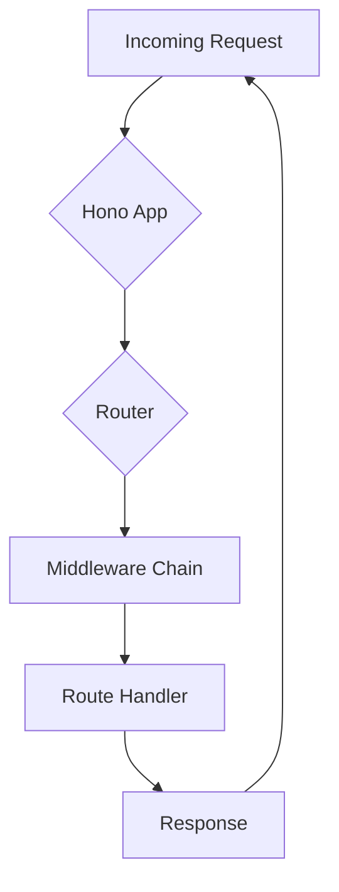
A request is received by the Hono instance, dispatched by the router, processed through any configured middleware, and finally fulfilled by a route handler that generates the response.
Sources: [README.md:43, 46]()

## Multi-Runtime Support

A key design goal of Hono is to be platform-agnostic. By exclusively using Web Standard APIs, the same Hono application can be deployed across numerous JavaScript environments without code modification.
Sources: [README.md:22, 45]()

Supported runtimes include:
- Cloudflare Workers
- Fastly Compute
- Deno
- Bun
- Vercel
- AWS Lambda & Lambda@Edge
- Node.js

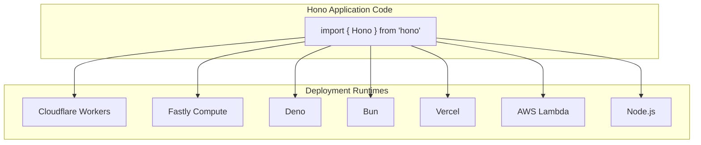
This diagram visualizes how a single Hono codebase can target a variety of serverless and traditional server environments.
Sources: [README.md:22, 45]()

## Community and Contribution

The Hono project has an active community and welcomes contributions.

### Communication Channels
- **X (formerly Twitter):** [@honojs](https://x.com/honojs)
- **Discord:** A [Discord channel](https://discord.gg/KMh2eNSdxV) is available for community discussion and support.
Sources: [README.md:59](https://github.com/honojs/hono/blob/24547a6ed5e175f9326063efb657540162287973/README.md#L59)

### How to Contribute
Contributions are encouraged through several methods:
- **Issues:** Propose new features or report bugs.
- **Pull Requests:** Submit fixes for bugs, typos, or code refactoring.
- **Middleware:** Create and share third-party middleware.
- **Advocacy:** Share your experience with Hono through blogs or social media.
- **Usage:** Build applications using Hono.

For more detailed information, see the project's contributing guide.
Sources: [README.md:62-71](https://github.com/honojs/hono/blob/24547a6ed5e175f9326063efb657540162287973/README.md#L62-L71)

## License

Hono is open-source software distributed under the MIT License.
Sources: [README.md:84-85](https://github.com/honojs/hono/blob/24547a6ed5e175f9326063efb657540162287973/README.md#L84-L85)

# Page: Getting Started

<details>
<summary>Relevant source files</summary>

The following files were used as context for generating this wiki page:

- [README.md](https://github.com/honojs/hono/blob/24547a6ed5e175f9326063efb657540162287973/README.md)
- [src/index.ts](https://github.com/honojs/hono/blob/24547a6ed5e175f9326063efb657540162287973/src/index.ts)
- [src/types.test.ts](https://github.com/honojs/hono/blob/24547a6ed5e175f9326063efb657540162287973/src/types.test.ts)
- [src/types.ts](https://github.com/honojs/hono/blob/24547a6ed5e175f9326063efb657540162287973/src/types.ts)
</details>

# Getting Started

Hono is a small, simple, and ultrafast web framework built on Web Standards, designed to run on any JavaScript runtime including Cloudflare Workers, Fastly Compute, Deno, Bun, Vercel, and Node.js. Its name means "flame" (🔥) in Japanese, reflecting its focus on performance. Hono is lightweight, with zero dependencies, and offers a delightful developer experience through clean APIs and first-class TypeScript support.

This guide provides an overview of the fundamental concepts for building applications with Hono, including creating an app, defining routes, and leveraging its powerful type-safety features to create robust, well-defined APIs.

Sources: [README.md:22-24, 41-48]()

## The Basics

### Creating an Application

A Hono application is created by instantiating the `Hono` class. Routes are then defined using methods that correspond to HTTP verbs, such as `app.get()`. The handler function for a route receives a `Context` object, which is used to process the request and generate a response.

```ts
import { Hono } from 'hono'
const app = new Hono()

app.get('/', (c) => c.text('Hono!'))

export default app
```

Sources: [README.md:27-32](https://github.com/honojs/hono/blob/24547a6ed5e175f9326063efb657540162287973/README.md#L27-L32), [src/index.ts:17](https://github.com/honojs/hono/blob/24547a6ed5e175f9326063efb657540162287973/src/index.ts#L17)

### The Context Object

The `Context` object, conventionally named `c`, is the core of a Hono handler. It provides access to the incoming request (`c.req`) and methods for creating a response, such as `c.text()` for plain text or `c.json()` for JSON data. It also holds middleware variables and validated data.

The basic flow of a request involves the Hono app receiving a request, the router matching it to a registered handler, and the handler using the context to return a response.

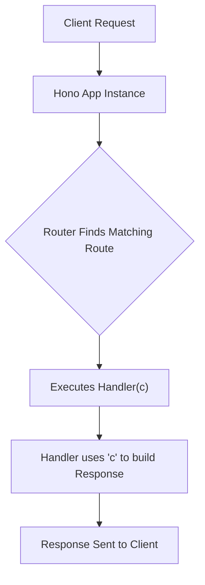

Sources: [src/types.ts:7, 76-82](), [src/types.test.ts:41-42](https://github.com/honojs/hono/blob/24547a6ed5e175f9326063efb657540162287973/src/types.test.ts#L41-L42)

## Type-Safe by Design

Hono's primary feature is its comprehensive type system, which enables developers to build fully type-safe web applications and APIs.

### Environment and Variables (`Env`)

You can provide a generic type to the `Hono` constructor to define the application's environment. The `Env` type can specify `Bindings` for runtime-specific values (like secrets in Cloudflare Workers) and `Variables` for data passed between middleware.

| Property    | Description                               | Source                  |
|-------------|-------------------------------------------|-------------------------|
| `Bindings`  | For platform-specific environment bindings. | `src/types.ts:31`       |
| `Variables` | For type-safe values passed via `c.set` and `c.get`. | `src/types.ts:32`       |

In this example, the application is typed with `Variables` for `foo` and `Bindings` for `FLAG`. These are then accessible in a type-safe manner within the handler.

```typescript
type E = {
  Variables: {
    foo: string
  }
  Bindings: {
    FLAG: boolean
  }
}
const app = new Hono<E>()

app.get('/', (c) => {
  const foo = c.get('foo') // Type is string
  const FLAG = c.env.FLAG   // Type is boolean
  return c.text('foo')
})
```

Sources: [src/types.ts:30-33](https://github.com/honojs/hono/blob/24547a6ed5e175f9326063efb657540162287973/src/types.ts#L30-L33), [src/types.test.ts:31-47](https://github.com/honojs/hono/blob/24547a6ed5e175f9326063efb657540162287973/src/types.test.ts#L31-L47)

### Handler Schemas

Handlers can be strongly typed using an `Input` schema, which defines the shape of incoming (`in`) and outgoing (`out`) data. This includes types for `json`, `form`, `query`, and `param`. The validated input is then available via `c.req.valid()`.

```typescript
type Payload = { foo: string; bar: boolean }

const middleware: MiddlewareHandler<
  Env,
  '/',
  {
    in: { json: Payload }
    out: { json: Payload }
  }
> = async (_c, next) => {
  await next()
}

app.get(middleware, (c) => {
  const data = c.req.valid('json') // Type is Payload
  return c.json({
    message: 'Hello!',
  })
})
```

Sources: [src/types.ts:42-46](https://github.com/honojs/hono/blob/24547a6ed5e175f9326063efb657540162287973/src/types.ts#L42-L46), [src/types.test.ts:54, 58-64, 84-85]()

### Typed Responses

The `TypedResponse` utility type allows you to define a response with a specific data shape, status code, and format (`json`, `text`, etc.). This information is used by Hono's type system to automatically infer the API schema, which is useful for creating type-safe clients.

```typescript
// Definition of TypedResponse
export type TypedResponse<
  T = unknown,
  U extends StatusCode = StatusCode,
  F extends ResponseFormat = /* ... */,
> = {
  _data: T
  _status: U
  _format: F
}
```

When a handler returns different responses based on logic, the resulting schema becomes a union of all possible `TypedResponse` shapes.

Sources: [src/types.ts:2635-2647](https://github.com/honojs/hono/blob/24547a6ed5e175f9326063efb657540162287973/src/types.ts#L2635-L2647), [src/types.test.ts:1099-1153](https://github.com/honojs/hono/blob/24547a6ed5e175f9326063efb657540162287973/src/types.test.ts#L1099-L1153)

The relationship between Hono's core classes and types can be visualized as follows:

```mermaid
classDiagram
    direction TD
    class Hono {
        +get(path, ...handlers)
        +post(path, ...handlers)
        +use(path, ...handlers)
        +on(method, path, ...handlers)
    }
    class Context {
        +req: HonoRequest
        +env: E["Bindings"]
        +var: E["Variables"]
        +json(data, status)
        +text(text, status)
    }
    class Handler {
        <<(E, P, I, R)>>
        (c: Context, next: Next) => R
    }
    class TypedResponse {
        <<T, U, F>>
        _data: T
        _status: U
        _format: F
    }
    Hono "1" -- "many" Handler : registers
    Handler "1" -- "1" Context : receives
    Handler "1" -- "1" TypedResponse : returns
```

Sources: [src/types.ts:7, 76-82, 2635-2647](), [src/index.ts:17](https://github.com/honojs/hono/blob/24547a6ed5e175f9326063efb657540162287973/src/index.ts#L17)

## Routing and Middleware

### Path Parameters

Hono supports dynamic path parameters, which are defined with a colon (`:`). Optional parameters can be specified by adding a question mark (`?`). The types for these parameters are automatically inferred from the path string and are available on `c.req.param()`.

-   `/post/:id` -> `id` is `string`
-   `/api/:a/:b?` -> `a` is `string`, `b` is `string | undefined`

The `ParamKeys` and `ParamKeyToRecord` utility types are used internally to achieve this.

Sources: [src/types.ts:2698-2713](https://github.com/honojs/hono/blob/24547a6ed5e175f9326063efb657540162287973/src/types.ts#L2698-L2713), [src/types.test.ts:150-175, 687-704]()

### Middleware

Middleware are handlers that execute before the final handler. They can modify the context, perform validation, or terminate the request early. To pass control to the next handler in the chain, a middleware function must call `await next()`.

The `MiddlewareHandler` type is used for functions that are intended to be middleware.

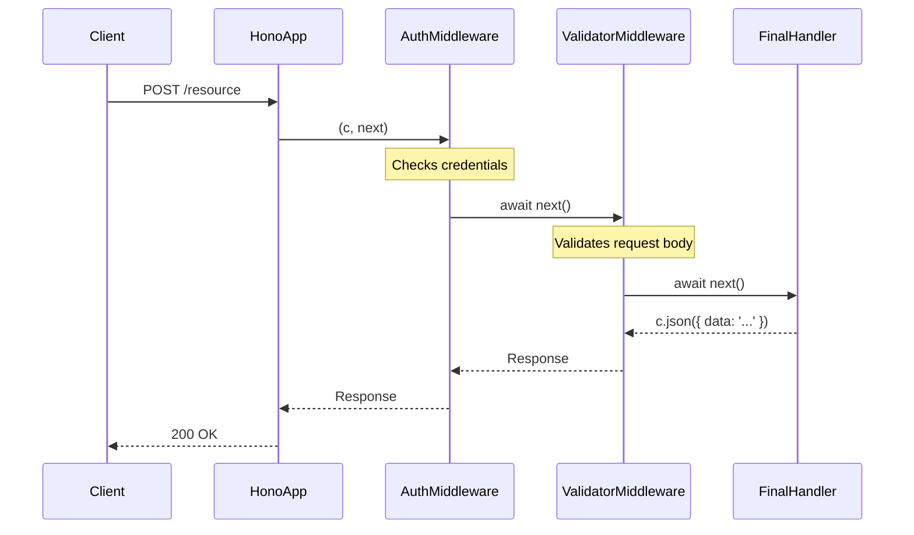

Sources: [src/types.ts:35, 83-89]()

### Chaining Handlers

Hono's routing methods accept multiple handler functions, allowing you to chain middleware and a final handler concisely. The types from each middleware (e.g., `Variables` or validated data) are merged and made available to subsequent handlers in the chain. The `HandlerInterface` provides overloads for up to 10 handlers.

```typescript
// Example with two middleware and a final handler
app.get(
  mw1, // Adds `c.var.foo1`
  mw2, // Adds `c.var.foo2`
  (c) => {
    c.var.foo1 // string
    c.var.foo2 // string
    return c.json(0)
  }
)
```

Sources: [src/types.ts:127-1072](https://github.com/honojs/hono/blob/24547a6ed5e175f9326063efb657540162287973/src/types.ts#L127-L1072), [src/types.test.ts:1382-1386](https://github.com/honojs/hono/blob/24547a6ed5e175f9326063efb657540162287973/src/types.test.ts#L1382-L1386)

### The `.on()` Method

For more advanced routing, the `.on()` method can register a handler for multiple HTTP methods or multiple paths simultaneously.

```typescript
// Register a handler for both GET and POST
app.on(['GET', 'POST'], '/multi-method', (c) => {
  return c.json({ success: true })
})

// Register a handler for multiple paths
app.on('GET', ['/a', '/b'], (c) => {
  return c.json({ ok: true })
})
```

Sources: [src/types.ts:1457-2475](https://github.com/honojs/hono/blob/24547a6ed5e175f9326063efb657540162287973/src/types.ts#L1457-L2475), [src/types.test.ts:323-350, 361-403]()

## Input Validation

Hono provides a mechanism to validate incoming request data. The `validator` middleware is a common way to implement this. Validated data is then accessed via `c.req.valid(target)`.

| Target   | Description                               |
|----------|-------------------------------------------|
| `json`   | The JSON request body.                    |
| `form`   | The parsed form data (`multipart/form-data` or `x-www-form-urlencoded`). |
| `query`  | The URL query parameters.                 |
| `param`  | The URL path parameters.                  |
| `header` | The request headers.                      |
| `cookie` | The request cookies.                      |

This table outlines the available targets for validation.

Sources: [src/types.ts:2683-2690](https://github.com/honojs/hono/blob/24547a6ed5e175f9326063efb657540162287973/src/types.ts#L2683-L2690)

Here is an example where query parameters are validated. The type of the validated data is inferred and available in both the middleware and the final handler.

```typescript
app.get(
  '/',
  validator('query', () => {
    return {
      test: 'hello',
    }
  }),
  async (c, next) => {
    const { test } = c.req.valid('query') // test is string
    await next()
  },
  async (c) => {
    const { test } = c.req.valid('query') // test is string
    return c.json({ ok: true })
  }
)
```

Sources: [src/types.test.ts:2043-2063](https://github.com/honojs/hono/blob/24547a6ed5e175f9326063efb657540162287973/src/types.test.ts#L2043-L2063)

# Page: Philosophy and Design Principles

<details>
<summary>Relevant source files</summary>

The following files were used as context for generating this wiki page:

- [README.md](https://github.com/honojs/hono/blob/24547a6ed5e175f9326063efb657540162287973/README.md)
- [package.json](https://github.com/honojs/hono/blob/24547a6ed5e175f9326063efb657540162287973/package.json)
</details>

# Philosophy and Design Principles

Hono (meaning "flame" 🔥 in Japanese) is a web framework designed to be small, simple, and ultrafast. Its core philosophy is rooted in leveraging Web Standards to provide a versatile and performant tool for developers. The framework is architected to be runtime-agnostic, enabling the same codebase to run across a multitude of JavaScript environments, from edge computing platforms like Cloudflare Workers and Fastly Compute to traditional Node.js servers.

Sources: [README.md:22](https://github.com/honojs/hono/blob/24547a6ed5e175f9326063efb657540162287973/README.md#L22)

## Core Principles

Hono's design is guided by a set of core principles that prioritize performance, size, portability, and developer experience. These principles are reflected in the framework's features and architecture.

Sources: [README.md:41-48](https://github.com/honojs/hono/blob/24547a6ed5e175f9326063efb657540162287973/README.md#L41-L48)

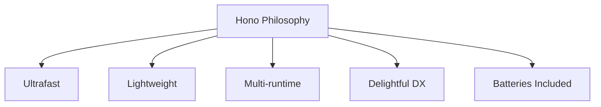
*This diagram summarizes the main features highlighted in the project's README file.*

Sources: [README.md:41-48](https://github.com/honojs/hono/blob/24547a6ed5e175f9326063efb657540162287973/README.md#L41-L48)

### Ultrafast 🚀

Performance is a primary design goal. Hono achieves its speed through efficient router implementations, such as `RegExpRouter`, which avoids slow linear loops for route matching. The project also includes several other specialized routers, indicating a deep focus on optimized routing solutions.

Sources: [README.md:43, 81]()

The following router implementations are credited to Taku Amano:

| Router Name |
| :------------ |
| `RegExpRouter` |
| `SmartRouter` |
| `LinearRouter` |
| `PatternRouter` |

Sources: [README.md:81](https://github.com/honojs/hono/blob/24547a6ed5e175f9326063efb657540162287973/README.md#L81), [package.json:289-313](https://github.com/honojs/hono/blob/24547a6ed5e175f9326063efb657540162287973/package.json#L289-L313)

### Lightweight 🪶

The framework is designed to be minimal. The `hono/tiny` preset has a bundle size of under 12kB. This is achieved by having zero production dependencies and building exclusively on Web Standard APIs, which are already provided by modern JavaScript runtimes. This approach minimizes the overhead added to an application.

Sources: [README.md:44](https://github.com/honojs/hono/blob/24547a6ed5e175f9326063efb657540162287973/README.md#L44)

### Multi-runtime 🌍

A key tenet of Hono's philosophy is portability. It is engineered to run on any JavaScript runtime that supports Web Standards. This allows developers to write code once and deploy it across various platforms without modification.

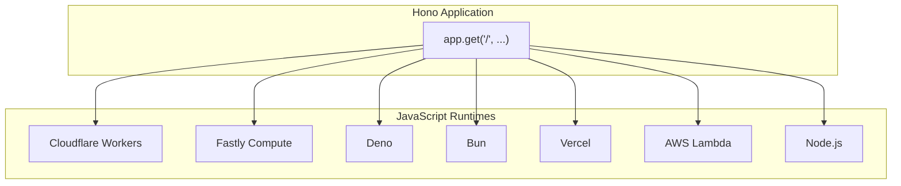
*This diagram illustrates the "write once, run anywhere" capability of Hono.*

Sources: [README.md:22, 45]()

The officially supported runtimes include:

| Platform | Category |
| :--- | :--- |
| Cloudflare Workers | Edge |
| Fastly Compute | Edge |
| Deno | Runtime |
| Bun | Runtime |
| Vercel | Serverless |
| AWS Lambda | Serverless |
| Lambda@Edge | Edge |
| Node.js | Server |

Sources: [README.md:22, 45]()

### Delightful DX 😃

Hono aims to provide a great developer experience (DX). This is achieved through:

-   **Clean APIs:** The framework's methods are designed to be intuitive and simple, as shown in the basic usage example.
-   **First-class TypeScript support:** Strong typing is a core feature, helping developers catch errors early and understand the API surface.

Sources: [README.md:26-33, 47]()

### Batteries Included 🔋

While the core is lightweight, Hono provides a rich ecosystem of built-in and third-party middleware. This allows developers to extend the framework's functionality as needed, covering common use cases like authentication, CORS, caching, and more without bloating the core library. The `package.json` `exports` map reveals a wide array of available middleware and helpers that can be imported individually.

Sources: [README.md:46](https://github.com/honojs/hono/blob/24547a6ed5e175f9326063efb657540162287973/README.md#L46), [package.json:38-413](https://github.com/honojs/hono/blob/24547a6ed5e175f9326063efb657540162287973/package.json#L38-L413)

A basic request-response flow in Hono involves the Hono instance, a registered route handler, and the context object (`c`).

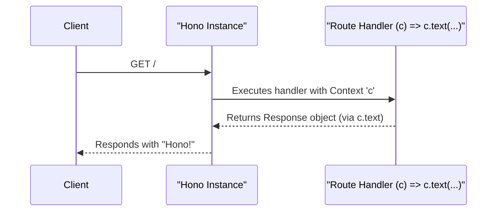
*This sequence diagram shows the interaction for a simple GET request.*

Sources: [README.md:26-33](https://github.com/honojs/hono/blob/24547a6ed5e175f9326063efb657540162287973/README.md#L26-L33)

## Modular Architecture

The project is structured into many distinct modules that can be imported on-demand. This modularity is evident in the `exports` field of `package.json`, which defines numerous entry points for different features. This design allows users to import only the parts of the framework they need, further contributing to the lightweight principle.

Key module categories include:
-   **Core:** `hono`, `hono-base`
-   **Presets:** `tiny`, `quick`
-   **Middleware:** `basic-auth`, `cors`, `jwt`, `logger`, etc.
-   **Helpers:** `cookie`, `html`, `ssg`, `streaming`
-   **Routers:** `reg-exp-router`, `smart-router`, `trie-router`
-   **Adapters:** `cloudflare-workers`, `deno`, `bun`, `aws-lambda`
-   **JSX:** `jsx`, `jsx-renderer`

This structure ensures that features like JSX support, specific middleware, or adapters for different runtimes do not increase the bundle size for users who do not need them.

Sources: [package.json:38-413](https://github.com/honojs/hono/blob/24547a6ed5e175f9326063efb657540162287973/package.json#L38-L413)

## Conclusion

Hono's design philosophy is centered on creating a fast, minimal, and highly portable web framework. By adhering to Web Standards, maintaining zero dependencies, and offering a modular architecture, it provides a flexible foundation for building modern web applications and APIs that can run anywhere. The emphasis on a strong developer experience with clean APIs and excellent TypeScript support makes it an approachable yet powerful tool.

Sources: [README.md](https://github.com/honojs/hono/blob/24547a6ed5e175f9326063efb657540162287973/README.md), [package.json](https://github.com/honojs/hono/blob/24547a6ed5e175f9326063efb657540162287973/package.json)

# Page: Hono vs. Other Frameworks

<details>
<summary>Relevant source files</summary>

The following files were used as context for generating this wiki page:

- [benchmarks/handle-event/index.js](https://github.com/honojs/hono/blob/24547a6ed5e175f9326063efb657540162287973/benchmarks/handle-event/index.js)
- [benchmarks/http-server/benchmark.ts](https://github.com/honojs/hono/blob/24547a6ed5e175f9326063efb657540162287973/benchmarks/http-server/benchmark.ts)
- [benchmarks/handle-event/package.json](https://github.com/honojs/hono/blob/24547a6ed5e175f9326063efb657540162287973/benchmarks/handle-event/package.json)
- [benchmarks/jsx/package.json](https://github.com/honojs/hono/blob/24547a6ed5e175f9326063efb657540162287973/benchmarks/jsx/package.json)
- [benchmarks/jsx/src/react-jsx/tsconfig.json](https://github.com/honojs/hono/blob/24547a6ed5e175f9326063efb657540162287973/benchmarks/jsx/src/react-jsx/tsconfig.json)
- [benchmarks/jsx/tsconfig.json](https://github.com/honojs/hono/blob/24547a6ed5e175f9326063efb657540162287973/benchmarks/jsx/tsconfig.json)
- [benchmarks/query-param/package.json](https://github.com/honojs/hono/blob/24547a6ed5e175f9326063efb657540162287973/benchmarks/query-param/package.json)
- [benchmarks/routers-deno/deno.json](https://github.com/honojs/hono/blob/24547a6ed5e175f9326063efb657540162287973/benchmarks/routers-deno/deno.json)
- [benchmarks/routers/package.json](https://github.com/honojs/hono/blob/24547a6ed5e175f9326063efb657540162287973/benchmarks/routers/package.json)
- [benchmarks/routers/tsconfig.json](https://github.com/honojs/hono/blob/24547a6ed5e175f9326063efb657540162287973/benchmarks/routers/tsconfig.json)
- [benchmarks/utils/package.json](https://github.com/honojs/hono/blob/24547a6ed5e175f9326063efb657540162287973/benchmarks/utils/package.json)
- [benchmarks/webapp/package.json](https://github.com/honojs/hono/blob/24547a6ed5e175f9326063efb657540162287973/benchmarks/webapp/package.json)
</details>

# Hono vs. Other Frameworks

The Hono repository includes a comprehensive set of benchmarks to measure and compare its performance against other popular web frameworks and libraries. These benchmarks cover various aspects, including routing, request handling, JSX rendering, and query parameter parsing. The primary goal is to ensure Hono remains a high-performance choice for web applications, particularly in edge computing environments.

The benchmarks are organized into different directories, each focusing on a specific feature. They utilize tools like `Benchmark.js`, `mitata`, and `bombardier` to conduct performance tests and provide quantitative comparisons.

## Performance Benchmarking

Hono employs several benchmark suites to evaluate its performance against competitors. These suites are designed to test different scenarios, from basic request handling to more complex HTTP server performance under load.

### Request Handling (`handle-event`)

This benchmark compares the request handling performance of Hono with `itty-router`, `sunder`, and `worktop`. It sets up an identical set of routes for each framework and measures the operations per second for handling a specific request.

The benchmark defines a series of routes, including static paths, paths with parameters, and different HTTP methods.

```javascript
// Hono route setup
const initHono = (hono) => {
  hono.get('/user', (c) => c.text('User'))
  hono.get('/user/comments', (c) => c.text('User Comments'))
  // ... more routes
  hono.get('/user/lookup/username/:username', (c) => {
    return c.text(`Hello ${c.req.param('username')}`)
  })
  return hono
}
```
*Sources: [benchmarks/handle-event/index.js:13-27](https://github.com/honojs/hono/blob/24547a6ed5e175f9326063efb657540162287973/benchmarks/handle-event/index.js#L13-L27)*

The `Benchmark.js` suite then executes the request handling function for each framework (`hono.fetch`, `ittyRouter.handle`, `sunderApp.handle`, `worktopRouter.run`) and logs the results.

```javascript
// Benchmark.js suite setup
suite
  .add('Hono', async () => {
    await hono.fetch(event.request)
  })
  .add('itty-router', async () => {
    await ittyRouter.handle(event.request)
  })
  .add('sunder', async () => {
    await sunderApp.handle(event)
  })
  .add('worktop', async () => {
    await worktopRouter.run(event)
  })
```
*Sources: [benchmarks/handle-event/index.js:134-145](https://github.com/honojs/hono/blob/24547a6ed5e175f9326063efb657540162287973/benchmarks/handle-event/index.js#L134-L145)*

The following diagram illustrates the sequence of operations in this benchmark.

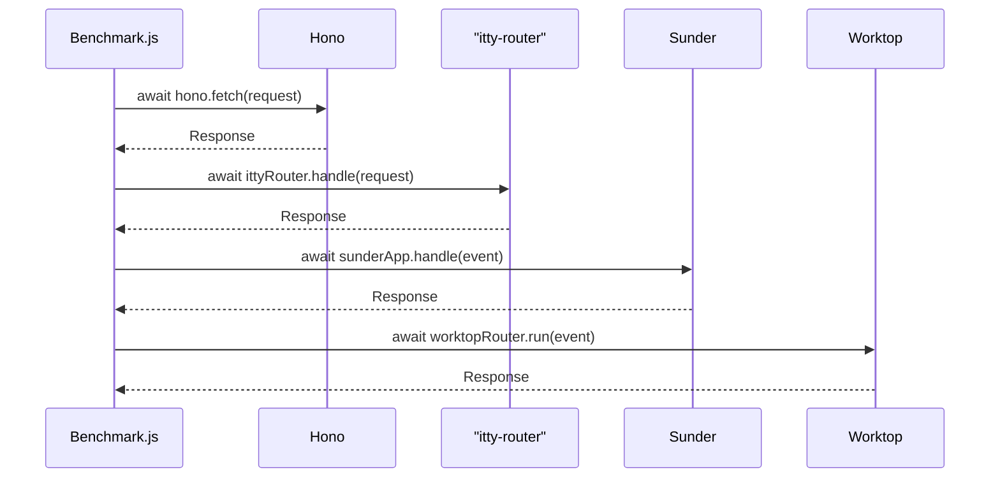
*Sources: [benchmarks/handle-event/index.js:134-145](https://github.com/honojs/hono/blob/24547a6ed5e175f9326063efb657540162287973/benchmarks/handle-event/index.js#L134-L145)*

### HTTP Server Performance

A more advanced benchmark script measures Hono's HTTP server performance, primarily designed to compare two different git versions (a `baseline` and a `target`). This allows for tracking performance regressions or improvements over time. It uses `bombardier`, a high-performance HTTP benchmarking tool.

*Sources: [benchmarks/http-server/benchmark.ts:2-5](https://github.com/honojs/hono/blob/24547a6ed5e175f9326063efb657540162287973/benchmarks/http-server/benchmark.ts#L2-L5)*

The benchmark process is as follows:
1.  **Setup**: A temporary directory is created.
2.  **Build Versions**: The script checks out the specified git references (`baseline` and `target`), installs dependencies, and creates a test application instance for each version.
3.  **Endpoint Validation**: It optionally runs a quick test to ensure the server endpoints are working correctly.
4.  **Run Benchmark**: It uses `bombardier` to send a high volume of requests to three different endpoints for a specified duration.
5.  **Report Results**: It calculates the average requests per second for each endpoint and overall, then presents the results in a markdown table comparing the baseline and target versions.

*Sources: [benchmarks/http-server/benchmark.ts:234-324](https://github.com/honojs/hono/blob/24547a6ed5e175f9326063efb657540162287973/benchmarks/http-server/benchmark.ts#L234-L324)*

The test application for this benchmark defines three endpoints:

| Method | Path | Description |
| :--- | :--- | :--- |
| `GET` | `/` | Returns a static text response "Hi". |
| `GET` | `/id/:id` | Reads a path parameter and a query parameter, sets a header, and returns a text response. |
| `POST` | `/json` | Reads a JSON body from the request and echoes it back as a JSON response. |
*Sources: [benchmarks/http-server/benchmark.ts:43-50](https://github.com/honojs/hono/blob/24547a6ed5e175f9326063efb657540162287973/benchmarks/http-server/benchmark.ts#L43-L50)*

The overall workflow can be visualized as follows:

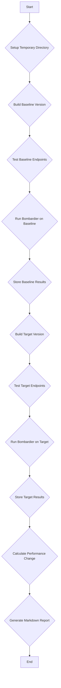
*Sources: [benchmarks/http-server/benchmark.ts:245-316](https://github.com/honojs/hono/blob/24547a6ed5e175f9326063efb657540162287973/benchmarks/http-server/benchmark.ts#L245-L316)*

## Compared Libraries and Frameworks

Hono is benchmarked against a wide array of libraries, each specializing in different areas such as routing, JSX rendering, or general web framework capabilities.

### Web Frameworks

These are full-featured or minimalist web frameworks similar to Hono.

| Framework | Benchmark Location | Source |
| :--- | :--- | :--- |
| `itty-router` | `handle-event`, `webapp` | `[benchmarks/handle-event/package.json:16](https://github.com/honojs/hono/blob/24547a6ed5e175f9326063efb657540162287973/benchmarks/handle-event/package.json#L16)`, `[benchmarks/webapp/package.json:12](https://github.com/honojs/hono/blob/24547a6ed5e175f9326063efb657540162287973/benchmarks/webapp/package.json#L12)` |
| `sunder` | `handle-event`, `webapp` | `[benchmarks/handle-event/package.json:18](https://github.com/honojs/hono/blob/24547a6ed5e175f9326063efb657540162287973/benchmarks/handle-event/package.json#L18)`, `[benchmarks/webapp/package.json:13](https://github.com/honojs/hono/blob/24547a6ed5e175f9326063efb657540162287973/benchmarks/webapp/package.json#L13)` |
| `worktop` | `handle-event` | `[benchmarks/handle-event/package.json:19](https://github.com/honojs/hono/blob/24547a6ed5e175f9326063efb657540162287973/benchmarks/handle-event/package.json#L19)` |

### Routing Libraries

Hono's router is a key component for performance. It is benchmarked against many popular and specialized routing libraries.

| Library | Source |
| :--- | :--- |
| `@medley/router` | `[benchmarks/routers/package.json:13](https://github.com/honojs/hono/blob/24547a6ed5e175f9326063efb657540162287973/benchmarks/routers/package.json#L13)` |
| `find-my-way` | `[benchmarks/routers/package.json:15](https://github.com/honojs/hono/blob/24547a6ed5e175f9326063efb657540162287973/benchmarks/routers/package.json#L15)` |
| `koa-router` | `[benchmarks/routers/package.json:16](https://github.com/honojs/hono/blob/24547a6ed5e175f9326063efb657540162287973/benchmarks/routers/package.json#L16)` |
| `radix3` | `[benchmarks/routers/package.json:20](https://github.com/honojs/hono/blob/24547a6ed5e175f9326063efb657540162287973/benchmarks/routers/package.json#L20)` |
| `rou3` | `[benchmarks/routers/package.json:21](https://github.com/honojs/hono/blob/24547a6ed5e175f9326063efb657540162287973/benchmarks/routers/package.json#L21)` |
| `trek-router` | `[benchmarks/routers/package.json:22](https://github.com/honojs/hono/blob/24547a6ed5e175f9326063efb657540162287973/benchmarks/routers/package.json#L22)` |
| `express` (router) | `[benchmarks/routers/package.json:14](https://github.com/honojs/hono/blob/24547a6ed5e175f9326063efb657540162287973/benchmarks/routers/package.json#L14)` |

### JSX and Rendering

Hono's JSX implementation is benchmarked for performance against other rendering libraries.

| Library | Source |
| :--- | :--- |
| `react` / `react-dom` | `[benchmarks/jsx/package.json:25-26](https://github.com/honojs/hono/blob/24547a6ed5e175f9326063efb657540162287973/benchmarks/jsx/package.json#L25-L26)` |
| `preact` / `preact-render-to-string` | `[benchmarks/jsx/package.json:23-24](https://github.com/honojs/hono/blob/24547a6ed5e175f9326063efb657540162287973/benchmarks/jsx/package.json#L23-L24)` |
| `nano-jsx` | `[benchmarks/jsx/package.json:22](https://github.com/honojs/hono/blob/24547a6ed5e175f9326063efb657540162287973/benchmarks/jsx/package.json#L22)` |

### Utility Libraries

Performance of utility functions like query parameter parsing is also compared.

| Library | Purpose | Source |
| :--- | :--- | :--- |
| `fast-querystring` | Query Param Parsing | `[benchmarks/query-param/package.json:12](https://github.com/honojs/hono/blob/24547a6ed5e175f9326063efb657540162287973/benchmarks/query-param/package.json#L12)` |
| `qs` | Query Param Parsing | `[benchmarks/query-param/package.json:14](https://github.com/honojs/hono/blob/24547a6ed5e175f9326063efb657540162287973/benchmarks/query-param/package.json#L14)` |

## Benchmark Scripts

The benchmarks can be executed using scripts defined in the `package.json` file of each benchmark directory.

| Directory | Script | Description |
| :--- | :--- | :--- |
| `handle-event` | `npm start` | Runs the request handling benchmark using Node.js. |
| `http-server` | `bun run benchmark.ts` | Runs the HTTP server performance comparison. |
| `jsx` | `npm run bench:bun` | Runs the JSX rendering benchmark using Bun. |
| `routers` | `npm run bench:bun` | Runs the router performance benchmark using Bun. |
| `query-param` | `npm run bench:bun` | Runs the query parameter parsing benchmark using Bun. |

*Sources: [benchmarks/handle-event/package.json:8](https://github.com/honojs/hono/blob/24547a6ed5e175f9326063efb657540162287973/benchmarks/handle-event/package.json#L8), [benchmarks/http-server/benchmark.ts:7](https://github.com/honojs/hono/blob/24547a6ed5e175f9326063efb657540162287973/benchmarks/http-server/benchmark.ts#L7), [benchmarks/jsx/package.json:7](https://github.com/honojs/hono/blob/24547a6ed5e175f9326063efb657540162287973/benchmarks/jsx/package.json#L7), [benchmarks/routers/package.json:4](https://github.com/honojs/hono/blob/24547a6ed5e175f9326063efb657540162287973/benchmarks/routers/package.json#L4), [benchmarks/query-param/package.json:4](https://github.com/honojs/hono/blob/24547a6ed5e175f9326063efb657540162287973/benchmarks/query-param/package.json#L4)*

## Conclusion

The extensive benchmarking suite within the Hono project is a critical tool for maintaining its performance edge. By continuously comparing against a diverse set of established and specialized libraries, the Hono team can validate performance improvements, prevent regressions, and provide clear evidence of its speed and efficiency. These benchmarks cover the entire lifecycle of a request, from routing and handling to rendering, ensuring that Hono is optimized across its feature set.

# Page: The Hono Class

<details>
<summary>Relevant source files</summary>

The following files were used as context for generating this wiki page:

- [src/hono.ts](https://github.com/honojs/hono/blob/24547a6ed5e175f9326063efb657540162287973/src/hono.ts)
- [src/hono.test.ts](https://github.com/honojs/hono/blob/24547a6ed5e175f9326063efb657540162287973/src/hono.test.ts)
</details>

# The Hono Class

The `Hono` class is the main entry point for creating a web application with the Hono framework. It extends the `HonoBase` class, providing a high-level API for routing, middleware, and request/response handling. It is designed to be lightweight, fast, and flexible, running on various JavaScript runtimes including Cloudflare Workers, Deno, and Node.js.

The class is generic, allowing developers to specify types for the application's environment (`Env`), schema (`Schema`), and base path (`BasePath`) for enhanced type-safety.

Sources: [src/hono.ts:16-20](https://github.com/honojs/hono/blob/24547a6ed5e175f9326063efb657540162287973/src/hono.ts#L16-L20)

## Instantiation and Configuration

A new Hono application is created by instantiating the `Hono` class. The constructor accepts an optional `options` object to configure its behavior.

```typescript
import { Hono } from 'hono'

// Basic instantiation
const app = new Hono()

// Instantiation with options
const appWithOptions = new Hono({
  strict: false,
  router: new RegExpRouter(),
})
```
Sources: [src/hono.ts:26-33](https://github.com/honojs/hono/blob/24547a6ed5e175f9326063efb657540162287973/src/hono.ts#L26-L33), [src/hono.test.ts:346-346](https://github.com/honojs/hono/blob/24547a6ed5e175f9326063efb657540162287973/src/hono.test.ts#L346-L346)

### Constructor Options

The `HonoOptions` object allows for customization of the application instance.

| Option | Type | Description | Default |
| --- | --- | --- | --- |
| `router` | `Router` | The router instance to be used for matching requests to handlers. | `SmartRouter` |
| `strict` | `boolean` | If `false`, paths with and without a trailing slash are treated as the same. | `true` |
| `getPath` | `(req: Request, options?: { env?: E }) => string` | A function to customize how the request path is extracted. | Internal default |

Sources: [src/hono.ts:26-33](https://github.com/honojs/hono/blob/24547a6ed5e175f9326063efb657540162287973/src/hono.ts#L26-L33), [src/hono.test.ts:346-346, 363-366]()

### Router Configuration

By default, Hono uses `SmartRouter`, which intelligently combines `RegExpRouter` and `TrieRouter` for optimal performance.

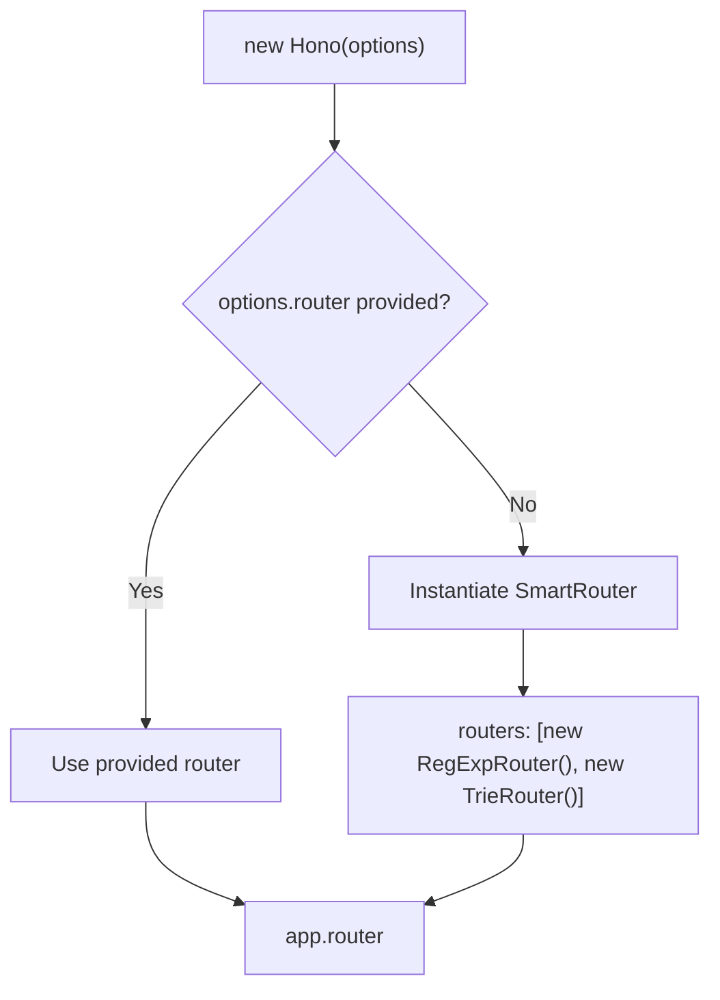
*Diagram illustrating the router selection logic in the Hono constructor.*
Sources: [src/hono.ts:28-33](https://github.com/honojs/hono/blob/24547a6ed5e175f9326063efb657540162287973/src/hono.ts#L28-L33)

A different router can be specified during instantiation. For example, to use only the `RegExpRouter`:

```typescript
import { Hono } from './hono'
import { RegExpRouter } from './router/reg-exp-router'

const app = new Hono({
  router: new RegExpRouter(),
})
```
Sources: [src/hono.test.ts:303-306](https://github.com/honojs/hono/blob/24547a6ed5e175f9326063efb657540162287973/src/hono.test.ts#L303-L306)

## Routing

Hono provides a fluent API for defining routes. It supports standard HTTP methods, path parameters, and complex routing patterns.

### Basic Routing

Routes are registered using methods that correspond to HTTP verbs, such as `app.get()`, `app.post()`, etc. These methods accept a path pattern and one or more handler functions.

```typescript
const app = new Hono()

app.get('/hello', (c) => {
  return c.text('Hello Hono!')
})

app.post('/posts', (c) => {
  return c.json({ message: 'Created' }, 201)
})
```
Sources: [src/hono.test.ts:55-60, 1718-1718]()

### Route Chaining

Multiple HTTP methods can be chained for the same route path.

```typescript
app
  .get('/chained/:abc', (c) => {
    const abc = c.req.param('abc')
    return c.text(`GET for ${abc}`)
  })
  .post((c) => {
    const abc = c.req.param('abc')
    return c.text(`POST for ${abc}`)
  })
```
Sources: [src/hono.test.ts:766-774](https://github.com/honojs/hono/blob/24547a6ed5e175f9326063efb657540162287973/src/hono.test.ts#L766-L774)

### Path Parameters

Dynamic segments in a path are defined with a colon (`:`). These parameters can be accessed via `c.req.param()`. Optional parameters are denoted with a `?`.

| Pattern | Example Request | `c.req.param('id')` | `c.req.param('type')` |
| --- | --- | --- | --- |
| `/users/:id` | `/users/123` | `'123'` | `undefined` |
| `/animal/:type?` | `/animal/dog` | `undefined` | `'dog'` |
| `/animal/:type?` | `/animal` | `undefined` | `undefined` |

Sources: [src/hono.test.ts:856-859, 2522-2532]()

### `app.on()` for Custom Methods

The `app.on()` method allows registering handlers for any HTTP method, including custom ones, or for multiple methods at once.

```typescript
// Register a handler for a custom PURGE method
app.on('PURGE', '/purge', (c) => c.text('Accepted', 202))

// Register a handler for both PUT and DELETE
app.on(['PUT', 'DELETE'], '/posts/:id', (c) => {
  return c.json({
    postId: c.req.param('id'),
    method: c.req.method,
  })
})
```
Sources: [src/hono.test.ts:2016-2016, 2042-2047]()

### Sub-routing

Hono supports organizing routes into logical groups using `basePath()` and `route()`.

#### `basePath()`

The `basePath()` method creates a new `Hono` instance with a prepended path for all its routes.

```typescript
const app = new Hono()

const book = app.basePath('/book')
book.get('/', (c) => c.text('get /book'))
book.get('/:id', (c) => {
  return c.text('get /book/' + c.req.param('id'))
})
```
This will create routes for `GET /book` and `GET /book/:id`.
Sources: [src/hono.test.ts:428-432](https://github.com/honojs/hono/blob/24547a6ed5e175f9326063efb657540162287973/src/hono.test.ts#L428-L432)

#### `route()`

The `route()` method mounts another `Hono` instance onto a specified path, effectively namespacing its routes.

```typescript
const app = new Hono()
const api = new Hono()

api.get('/posts', (c) => c.text('List Posts'))
api.get('/posts/:id', (c) => c.text(`Post ${c.req.param('id')}`))

// All routes from 'api' will be prefixed with '/api'
app.route('/api', api)
```
This creates routes for `GET /api/posts` and `GET /api/posts/:id`.
Sources: [src/hono.test.ts:1717-1720, 1727-1727]()

## Middleware

Middleware are functions that can process a request before and after the main handler. They are added using `app.use()`.

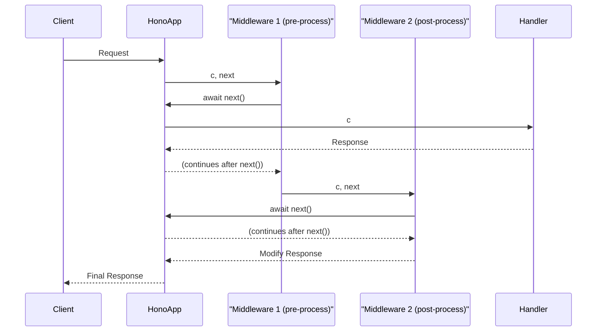
*Sequence diagram showing a request flowing through middleware and a handler.*
Sources: [src/hono.test.ts:1035-1044](https://github.com/honojs/hono/blob/24547a6ed5e175f9326063efb657540162287973/src/hono.test.ts#L1035-L1044)

### Middleware Registration

Middleware can be applied to all routes or to specific path patterns.

```typescript
const app = new Hono()

// Middleware for all routes
app.use('*', async (c, next) => {
  console.log(`${c.req.method} : ${c.req.url}`)
  await next()
  c.res.headers.append('x-custom', 'root')
})

// Middleware for routes under /hello
app.use('/hello/*', async (c, next) => {
  await next()
  c.res.headers.append('x-message', 'hello-middleware')
})

app.get('/hello/world', (c) => c.text('Hello World'))
```
Sources: [src/hono.test.ts:1035-1044, 1051-1054]()

Middleware can also be provided directly to a route handler.

```typescript
const customHeader = async (c: Context, next: Next) => {
  c.req.raw.headers.append('x-custom-foo', 'bar')
  await next()
}

app.get('/abc', customHeader, (c) => {
  const foo = c.req.header('x-custom-foo') || ''
  return c.text(foo)
})
```
Sources: [src/hono.test.ts:1243-1246, 1254-1257]()

## Context

The `Context` object, conventionally named `c`, is passed to every handler. It provides methods for accessing request data and constructing responses.

### Key Context Methods

| Method | Description | Example |
| --- | --- | --- |
| `c.req.param('name')` | Gets a path parameter. | `c.req.param('id')` |
| `c.req.query('name')` | Gets the first value of a query parameter. | `c.req.query('search')` |
| `c.req.queries('name')` | Gets all values of a query parameter as an array. | `c.req.queries('tags')` |
| `c.req.header('name')` | Gets a request header value. | `c.req.header('User-Agent')` |
| `c.req.parseBody()` | Parses the request body (JSON, form-data, etc.). | `const body = await c.req.parseBody()` |
| `c.text(text, status?)` | Creates a `text/plain` response. | `c.text('Hello')` |
| `c.json(data, status?)` | Creates an `application/json` response. | `c.json({ ok: true })` |
| `c.html(html, status?)` | Creates a `text/html` response. | `c.html('<h1>Hi</h1>')` |
| `c.redirect(location, status?)` | Creates a redirect response. | `c.redirect('/login')` |
| `c.header(name, value)` | Sets a response header. | `c.header('X-Powered-By', 'Hono')` |
| `c.status(code)` | Sets the response status code. | `c.status(201)` |
| `c.set('key', value)` | Stores a variable in the context. | `c.set('userId', 123)` |
| `c.get('key')` | Retrieves a variable from the context. | `const userId = c.get('userId')` |

Sources: [src/hono.test.ts:62-66, 856-859, 866-869, 2293-2295, 2396-2418]()

## Error Handling

Hono provides hooks for handling exceptions and "not found" errors.

### `onError`

A global error handler can be registered with `app.onError()`. This handler is invoked when an exception is thrown from any middleware or route handler.

```typescript
app.onError((err, c) => {
  console.error(`${err}`)
  return c.text('Custom Error Message', 500)
})

app.get('/error', () => {
  throw new Error('This is an Error')
})
```
Sources: [src/hono.test.ts:1412-1414, 1424-1427]()

### `notFound`

A custom handler for requests that do not match any route can be set with `app.notFound()`.

```typescript
app.notFound((c) => {
  return c.text('Custom 404 Not Found', 404)
})
```
Sources: [src/hono.test.ts:1294-1296](https://github.com/honojs/hono/blob/24547a6ed5e175f9326063efb657540162287973/src/hono.test.ts#L1294-L1296)

# Page: The Context Object

<details>
<summary>Relevant source files</summary>

The following files were used as context for generating this wiki page:

- [src/context.ts](https://github.com/honojs/hono/blob/24547a6ed5e175f9326063efb657540162287973/src/context.ts)
- [src/context.test.ts](https://github.com/honojs/hono/blob/24547a6ed5e175f9326063efb657540162287973/src/context.test.ts)
</details>

# The Context Object

The `Context` object is the central component for handling requests and generating responses within a Hono application. It is passed as the first argument to all handlers and middleware. The `Context` provides access to the incoming request, methods for creating various types of responses (HTML, JSON, text), and a mechanism for sharing data between middleware. It also exposes environment-specific features like bindings and execution context in serverless environments.

The `Context` class is instantiated with a `Request` object and optional configuration, including environment bindings and a `notFoundHandler`.

Sources: [src/context.ts:293-361](https://github.com/honojs/hono/blob/24547a6ed5e175f9326063efb657540162287973/src/context.ts#L293-L361)

## Core Properties

The `Context` object holds several key properties that provide information about the current request-response cycle.

| Property | Type | Description |
| --- | --- | --- |
| `req` | `HonoRequest` | An instance of `HonoRequest`, which extends the standard `Request` object with additional helpers for handling paths, parameters, and body parsing. It is lazily initialized on first access. `Sources: [src/context.ts:364-369](https://github.com/honojs/hono/blob/24547a6ed5e175f9326063efb657540162287973/src/context.ts#L364-L369)` |
| `env` | `E['Bindings']` | An object containing environment bindings, such as secrets, KV namespaces, or D1 databases, commonly used in Cloudflare Workers. `Sources: [src/context.ts:302-315](https://github.com/honojs/hono/blob/24547a6ed5e175f9326063efb657540162287973/src/context.ts#L302-L315)` |
| `res` | `Response` | The `Response` object for the current request. It is lazily initialized with a `null` body and empty `Headers` if not already set. `Sources: [src/context.ts:399-407](https://github.com/honojs/hono/blob/24547a6ed5e175f9326063efb657540162287973/src/context.ts#L399-L407)` |
| `error` | `Error \| undefined` | Holds an `Error` object if a subsequent handler or middleware throws one, allowing for centralized error handling. `Sources: [src/context.ts:318-333](https://github.com/honojs/hono/blob/24547a6ed5e175f9326063efb657540162287973/src/context.ts#L318-L333)` |
| `finalized` | `boolean` | A flag that becomes `true` after a `Response` has been explicitly assigned to `c.res`, indicating that the response is considered complete. `Sources: [src/context.ts:317, 433]()` |
| `event` | `FetchEventLike` | The `FetchEvent` associated with the request in environments that support it. Accessing this property will throw an error if no `FetchEvent` is available. `Sources: [src/context.ts:371-383](https://github.com/honojs/hono/blob/24547a6ed5e175f9326063efb657540162287973/src/context.ts#L371-L383)` |
| `executionCtx` | `ExecutionContext` | The `ExecutionContext` for the request, used for tasks like `waitUntil` in serverless environments. Accessing this will throw an error if no `ExecutionContext` is available. `Sources: [src/context.ts:385-397](https://github.com/honojs/hono/blob/24547a6ed5e175f9326063efb657540162287973/src/context.ts#L385-L397)` |

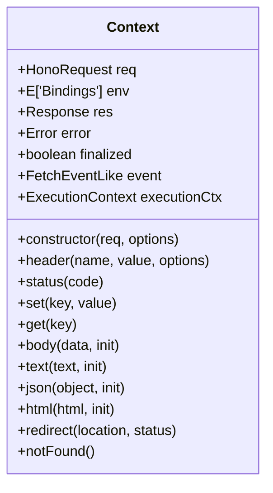
Sources: [src/context.ts:293-780](https://github.com/honojs/hono/blob/24547a6ed5e175f9326063efb657540162287973/src/context.ts#L293-L780)

## State Management

The Context provides a key-value store for sharing data between middleware functions, which is essential for passing processed data, user authentication status, or other request-scoped information through the handler chain.

### `c.set()` and `c.get()`

The `c.set(key, value)` method stores a value, and `c.get(key)` retrieves it. This allows upstream middleware to provide data to downstream handlers.

*   `set<Key extends keyof E['Variables']>(key: Key, value: E['Variables'][Key]): void` `Sources: [src/context.ts:105-108, 546-556]()`
*   `get<Key extends keyof E['Variables']>(key: Key): E['Variables'][Key]` `Sources: [src/context.ts:95-98, 571-580]()`

If `get()` is called for a key that has not been set, it returns `undefined`.

Sources: [src/context.test.ts:147-152](https://github.com/honojs/hono/blob/24547a6ed5e175f9326063efb657540162287973/src/context.test.ts#L147-L152)

### `c.var`

The `c.var` property provides a read-only, object-style accessor to the variables set via `c.set()`. This is a convenient alternative to `c.get()`. If no variables have been set, it returns an empty object.

```typescript
// Instead of c.get('user')
const user = c.var.user;
```
Sources: [src/context.ts:582-602](https://github.com/honojs/hono/blob/24547a6ed5e175f9326063efb657540162287973/src/context.ts#L582-L602), [src/context.test.ts:154-159](https://github.com/honojs/hono/blob/24547a6ed5e175f9326063efb657540162287973/src/context.test.ts#L154-L159)

The following diagram illustrates the data flow using `set` and `get` between two middleware functions.

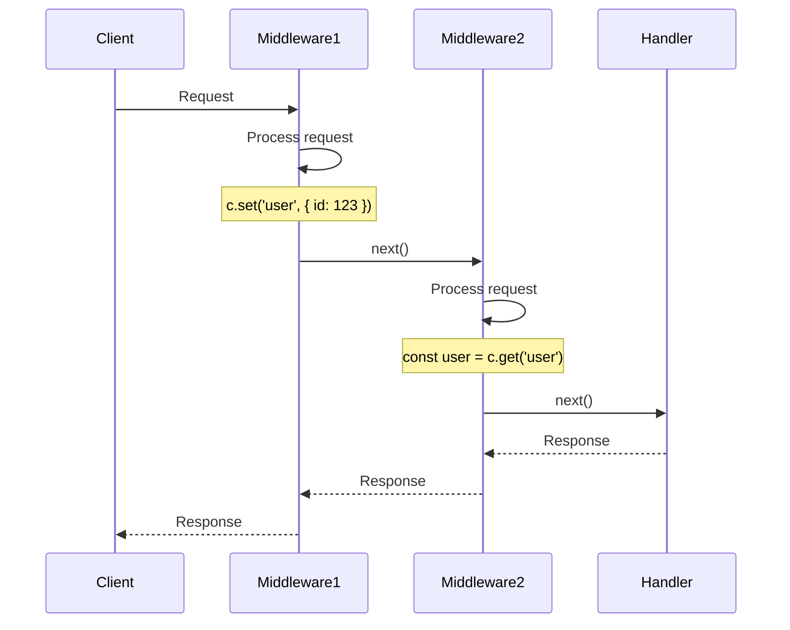

## Response Generation

The `Context` object provides several helper methods to simplify the creation of `Response` objects with common `Content-Type` headers and status codes.

| Method | Description | Default `Content-Type` |
| --- | --- | --- |
| `body()` | Sends a response with a raw body (`string`, `ArrayBuffer`, `ReadableStream`, etc.). `Sources: [src/context.ts:664-668](https://github.com/honojs/hono/blob/24547a6ed5e175f9326063efb657540162287973/src/context.ts#L664-L668)` | None |
| `text()` | Sends a `text/plain` response. `Sources: [src/context.ts:682-694](https://github.com/honojs/hono/blob/24547a6ed5e175f9326063efb657540162287973/src/context.ts#L682-L694)` | `text/plain; charset=UTF-8` |
| `json()` | Sends an `application/json` response. The input object is automatically stringified. `Sources: [src/context.ts:708-721](https://github.com/honojs/hono/blob/24547a6ed5e175f9326063efb657540162287973/src/context.ts#L708-L721)` | `application/json` |
| `html()` | Sends a `text/html` response. Can handle both `string` and `Promise<string>`. `Sources: [src/context.ts:723-733](https://github.com/honojs/hono/blob/24547a6ed5e175f9326063efb657540162287973/src/context.ts#L723-L733)` | `text/html; charset=UTF-8` |
| `redirect()` | Performs a redirect. The default status code is `302`. It automatically URI-encodes multi-byte characters in the location URL. `Sources: [src/context.ts:750-762](https://github.com/honojs/hono/blob/24547a6ed5e175f9326063efb657540162287973/src/context.ts#L750-L762)` | None |
| `notFound()` | Invokes the configured `notFoundHandler` to generate a 404 response. `Sources: [src/context.ts:776-779](https://github.com/honojs/hono/blob/24547a6ed5e175f9326063efb657540162287973/src/context.ts#L776-L779)` | Varies |

These methods internally use a private `#newResponse` method, which consolidates logic for setting the status, headers, and body.

Sources: [src/context.ts:604-639](https://github.com/honojs/hono/blob/24547a6ed5e175f9326063efb657540162287973/src/context.ts#L604-L639)

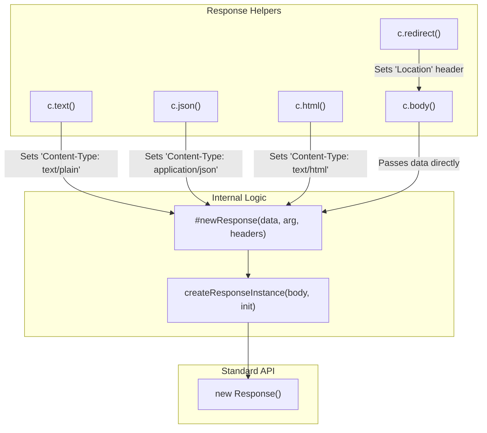
This diagram shows that high-level response methods like `c.text()` and `c.json()` configure headers and then delegate to the internal `#newResponse` method, which ultimately uses the standard `Response` constructor.

## Header and Status Manipulation

The `Context` allows for fine-grained control over the response headers and status code before the response is finalized.

### `c.header(name, value, options)`

This method sets a response header.

*   **Setting a header:** `c.header('X-Message', 'Hello!')`
*   **Deleting a header:** `c.header('X-Message', undefined)` `Sources: [src/context.test.ts:184-193](https://github.com/honojs/hono/blob/24547a6ed5e175f9326063efb657540162287973/src/context.test.ts#L184-L193)`
*   **Appending a header:** `c.header('X-Foo', 'Bar', { append: true })` `Sources: [src/context.ts:522-523](https://github.com/honojs/hono/blob/24547a6ed5e175f9326063efb657540162287973/src/context.ts#L522-L523), [src/context.test.ts:139-145](https://github.com/honojs/hono/blob/24547a6ed5e175f9326063efb657540162287973/src/context.test.ts#L139-L145)`

The `header` method can be called multiple times. The headers are stored on a private `#preparedHeaders` property until a `Response` object is created, at which point they are transferred to `c.res.headers`.

Sources: [src/context.ts:515-527](https://github.com/honojs/hono/blob/24547a6ed5e175f9326063efb657540162287973/src/context.ts#L515-L527)

### `c.status(statusCode)`

This method sets the HTTP status code for the response. The status is stored in a private `#status` property and applied when a response is generated via methods like `c.body()` or `c.json()`.

```typescript
c.status(201);
return c.body('Created');
```
Sources: [src/context.ts:529-531](https://github.com/honojs/hono/blob/24547a6ed5e175f9326063efb657540162287973/src/context.ts#L529-L531), [src/context.test.ts:232-236](https://github.com/honojs/hono/blob/24547a6ed5e175f9326063efb657540162287973/src/context.test.ts#L232-L236)

If a status is provided directly to a response method (e.g., `c.text('Not Found', 404)`), it takes precedence over a status set by `c.status()`.

Sources: [src/context.ts:637](https://github.com/honojs/hono/blob/24547a6ed5e175f9326063efb657540162287973/src/context.ts#L637), [src/context.test.ts:247-258](https://github.com/honojs/hono/blob/24547a6ed5e175f9326063efb657540162287973/src/context.test.ts#L247-L258)

## Rendering and Layouts

Hono provides a flexible rendering system that can be customized with middleware.

### `c.render()` and `c.setRenderer()`

The `c.render()` method is the primary way to generate an HTML response, often in conjunction with a layout system. By default, `c.render()` is an alias for `c.html()`.

Sources: [src/context.ts:448-451](https://github.com/honojs/hono/blob/24547a6ed5e175f9326063efb657540162287973/src/context.ts#L448-L451)

A custom renderer can be defined using `c.setRenderer()`. This is typically done in a middleware to apply a consistent layout to all responses. The renderer function receives the content and any additional properties passed to `c.render()`.

```typescript
// In a middleware
app.use('*', async (c, next) => {
  c.setRenderer((content, props) => {
    return c.html(
      <html>
        <head><title>{props.title}</title></head>
        <body>{content}</body>
      </html>
    )
  })
  await next()
})

// In a handler
app.get('/', (c) => {
  return c.render('<h1>Hello!</h1>', { title: 'Home' })
})
```
Sources: [src/context.ts:475-497](https://github.com/honojs/hono/blob/24547a6ed5e175f9326063efb657540162287973/src/context.ts#L475-L497), [src/context.test.ts:588-596](https://github.com/honojs/hono/blob/24547a6ed5e175f9326063efb657540162287973/src/context.test.ts#L588-L596)

### `c.setLayout()` and `c.getLayout()`

These methods provide an alternative way to manage layouts, allowing a handler to explicitly set or retrieve a layout function. This is less common than using `setRenderer` but offers more granular control.

Sources: [src/context.ts:459-472](https://github.com/honojs/hono/blob/24547a6ed5e175f9326063efb657540162287973/src/context.ts#L459-L472)

## Conclusion

The `Context` object is a powerful and versatile API that serves as the backbone of Hono's request handling. It provides a clean and efficient interface for accessing request data, managing state across middleware, and constructing precise HTTP responses. Its design, combining lazy property initialization with a rich set of response helpers, makes it both performant and developer-friendly. Understanding the `Context` object is fundamental to effectively building applications with Hono.

# Page: The HonoRequest Object

<details>
<summary>Relevant source files</summary>

The following files were used as context for generating this wiki page:

- [src/request.ts](https://github.com/honojs/hono/blob/24547a6ed5e175f9326063efb657540162287973/src/request.ts)
- [src/request.test.ts](https://github.com/honojs/hono/blob/24547a6ed5e175f9326063efb657540162287973/src/request.test.ts)
</details>

# The HonoRequest Object

The `HonoRequest` class is a Hono-specific wrapper around the standard Web `Request` object. It provides a convenient and powerful API for accessing all parts of an incoming HTTP request, including URL parameters, query strings, headers, and the request body. It is designed to be immutable and offers features like intelligent body caching to prevent common "body already consumed" errors. The `HonoRequest` instance is accessible within Hono handlers via the `c.req` property.

Sources: [src/request.ts:36-443](https://github.com/honojs/hono/blob/24547a6ed5e175f9326063efb657540162287973/src/request.ts#L36-L443)

## Class Overview

The `HonoRequest` class encapsulates the raw `Request` and provides methods to access its data in a structured way.

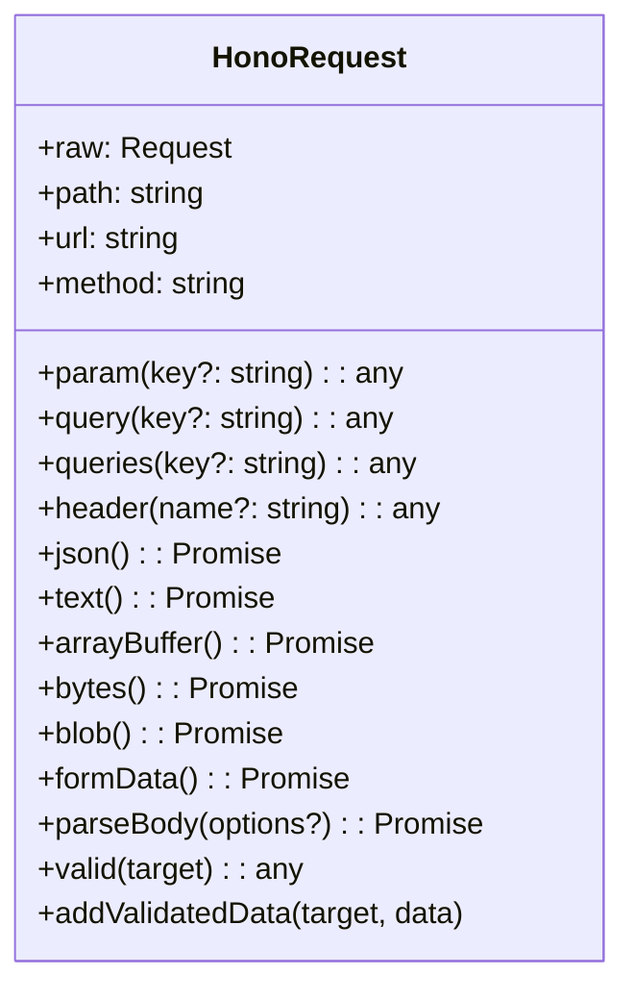
Sources: [src/request.ts:36-443](https://github.com/honojs/hono/blob/24547a6ed5e175f9326063efb657540162287973/src/request.ts#L36-L443)

## Core Properties

`HonoRequest` exposes several fundamental properties of the incoming request.

| Property | Type | Description |
| --- | --- | --- |
| `raw` | `Request` | The original, underlying Web `Request` object. Useful for accessing platform-specific features, like `cf` properties in Cloudflare Workers. `Sources: [src/request.ts:51](https://github.com/honojs/hono/blob/24547a6ed5e175f9326063efb657540162287973/src/request.ts#L51)` |
| `path` | `string` | The pathname of the request URL (e.g., `/about/me`). `Sources: [src/request.ts:68](https://github.com/honojs/hono/blob/24547a6ed5e175f9326063efb657540162287973/src/request.ts#L68)` |
| `url` | `string` | The full URL of the request (e.g., `http://localhost:8787/about/me`). `Sources: [src/request.ts:369-371](https://github.com/honojs/hono/blob/24547a6ed5e175f9326063efb657540162287973/src/request.ts#L369-L371)` |
| `method` | `string` | The HTTP method of the request (e.g., `GET`, `POST`). `Sources: [src/request.ts:385-387](https://github.com/honojs/hono/blob/24547a6ed5e175f9326063efb657540162287973/src/request.ts#L385-L387)` |

## Accessing Request Data

`HonoRequest` provides a suite of methods for accessing URL parameters, headers, and the request body.

### URL and Header Data

These methods are used to parse data from the request's URL and headers.

| Method | Description |
| --- | --- |
| `param(key?: string)` | Retrieves path parameters defined in the route pattern. When called with a key, it returns the value as a string. When called without arguments, it returns an object containing all parameters. `Sources: [src/request.ts:94-104](https://github.com/honojs/hono/blob/24547a6ed5e175f9326063efb657540162287973/src/request.ts#L94-L104)` |
| `query(key?: string)` | Retrieves a single query string parameter. If a key is specified, it returns the first value associated with that key. Without a key, it returns an object of all query parameters. `Sources: [src/request.ts:148-152](https://github.com/honojs/hono/blob/24547a6ed5e175f9326063efb657540162287973/src/request.ts#L148-L152)` |
| `queries(key?: string)` | Retrieves query string parameters that may have multiple values (e.g., `?tags=A&tags=B`). If a key is specified, it returns an array of all values. Without a key, it returns an object where each value is an array of strings. `Sources: [src/request.ts:167-171](https://github.com/honojs/hono/blob/24547a6ed5e175f9326063efb657540162287973/src/request.ts#L167-L171)` |
| `header(name?: string)` | Retrieves a request header value. Header names are case-insensitive. If a name is provided, it returns the corresponding value. Without a name, it returns an object of all request headers. `Sources: [src/request.ts:185-198](https://github.com/honojs/hono/blob/24547a6ed5e175f9326063efb657540162287973/src/request.ts#L185-L198)` |

The tests demonstrate how `param()` works with different route indices and match results to extract the correct values.

Sources: [src/request.test.ts:41-90](https://github.com/honojs/hono/blob/24547a6ed5e175f9326063efb657540162287973/src/request.test.ts#L41-L90), [src/request.test.ts:9-39](https://github.com/honojs/hono/blob/24547a6ed5e175f9326063efb657540162287973/src/request.test.ts#L9-L39), [src/request.test.ts:226-238](https://github.com/honojs/hono/blob/24547a6ed5e175f9326063efb657540162287973/src/request.test.ts#L226-L238)

### Request Body Parsing

A key feature of `HonoRequest` is its intelligent body caching. When a body-parsing method is called for the first time, the result is cached. Subsequent calls to other body-parsing methods use the cached data, converting it to the requested format without re-reading the request stream. This prevents "body already consumed" errors.

The internal `#cachedBody` method manages this logic. If a specific body format (e.g., `text`) is requested and not in the cache, it checks if any other format has been cached. If so, it reconstructs the requested format from the cached data. If the cache is empty, it reads the body from the raw request and populates the cache.

Sources: [src/request.ts:220-239](https://github.com/honojs/hono/blob/24547a6ed5e175f9326063efb657540162287973/src/request.ts#L220-L239), [src/request.test.ts:245-365](https://github.com/honojs/hono/blob/24547a6ed5e175f9326063efb657540162287973/src/request.test.ts#L245-L365)

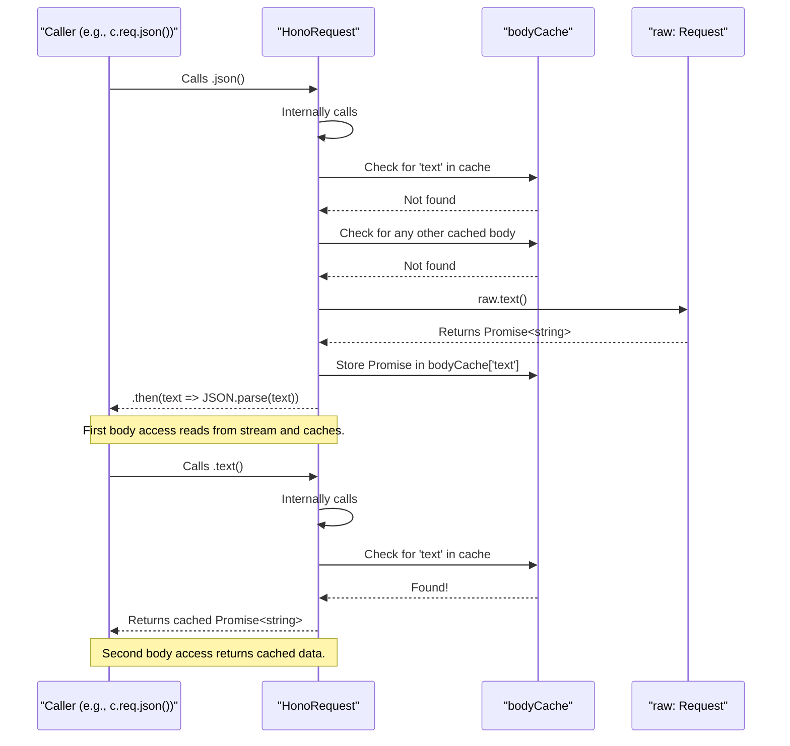

The following methods are available for parsing the request body:

| Method | Description | Return Type |
| --- | --- | --- |
| `json<T>(): Promise<T>` | Parses the body as JSON. `Sources: [src/request.ts:253-255](https://github.com/honojs/hono/blob/24547a6ed5e175f9326063efb657540162287973/src/request.ts#L253-L255)` | `Promise<any>` |
| `text(): Promise<string>` | Parses the body as plain text. `Sources: [src/request.ts:269-271](https://github.com/honojs/hono/blob/24547a6ed5e175f9326063efb657540162287973/src/request.ts#L269-L271)` | `Promise<string>` |
| `arrayBuffer(): Promise<ArrayBuffer>` | Parses the body as an `ArrayBuffer`. `Sources: [src/request.ts:285-287](https://github.com/honojs/hono/blob/24547a6ed5e175f9326063efb657540162287973/src/request.ts#L285-L287)` | `Promise<ArrayBuffer>` |
| `bytes(): Promise<Uint8Array>` | Parses the body as a `Uint8Array`. This is a convenience method over `arrayBuffer()`. `Sources: [src/request.ts:301-303](https://github.com/honojs/hono/blob/24547a6ed5e175f9326063efb657540162287973/src/request.ts#L301-L303)` | `Promise<Uint8Array>` |
| `blob(): Promise<Blob>` | Parses the body as a `Blob`. `Sources: [src/request.ts:315-317](https://github.com/honojs/hono/blob/24547a6ed5e175f9326063efb657540162287973/src/request.ts#L315-L317)` | `Promise<Blob>` |
| `formData(): Promise<FormData>` | Parses the body as `FormData`. `Sources: [src/request.ts:329-331](https://github.com/honojs/hono/blob/24547a6ed5e175f9326063efb657540162287973/src/request.ts#L329-L331)` | `Promise<FormData>` |
| `parseBody(options?)` | Parses `multipart/form-data` or `application/x-www-form-urlencoded` content. It delegates to an external `parseBody` utility. `Sources: [src/request.ts:212-218](https://github.com/honojs/hono/blob/24547a6ed5e175f9326063efb657540162287973/src/request.ts#L212-L218)` | `Promise<BodyData>` |

### Validated Data

`HonoRequest` provides a mechanism for middleware to pass validated and typed data to subsequent handlers. This is commonly used with validation middleware.

-   `addValidatedData(target, data)`: Adds data to an internal store, keyed by a validation target (e.g., 'json', 'form', 'query').
    Sources: [src/request.ts:339-341](https://github.com/honojs/hono/blob/24547a6ed5e175f9326063efb657540162287973/src/request.ts#L339-L341)
-   `valid(target)`: Retrieves the validated data for a given target.
    Sources: [src/request.ts:351-354](https://github.com/honojs/hono/blob/24547a6ed5e175f9326063efb657540162287973/src/request.ts#L351-L354)

Example flow:
1.  A validation middleware parses and validates `c.req.json()`.
2.  It calls `c.req.addValidatedData('json', validatedDataObject)`.
3.  The main route handler calls `c.req.valid('json')` to get the strongly-typed, validated data without re-parsing the body.

Sources: [src/request.test.ts:182-217](https://github.com/honojs/hono/blob/24547a6ed5e175f9326063efb657540162287973/src/request.test.ts#L182-L217)

## Utility Functions

### `cloneRawRequest()`

This standalone utility function safely clones a `HonoRequest`'s underlying raw `Request` object. It is essential when a request needs to be processed multiple times or forwarded to another service after its body has been read.

The function's logic is as follows:
1.  If the raw request body has not been consumed (`req.raw.bodyUsed` is `false`), it uses the native `req.raw.clone()` method.
2.  If the body has been consumed, it checks the `req.bodyCache`.
3.  If the cache is populated, it reconstructs a new `Request` object using the cached body data and other properties from the original request (headers, method, etc.).
4.  If the body was consumed directly via `req.raw` (bypassing Hono's caching), the cache will be empty, and the function will throw an `HTTPException` with a 500 status code.

Sources: [src/request.ts:476-505](https://github.com/honojs/hono/blob/24547a6ed5e175f9326063efb657540162287973/src/request.ts#L476-L505), [src/request.test.ts:479-600](https://github.com/honojs/hono/blob/24547a6ed5e175f9326063efb657540162287973/src/request.test.ts#L479-L600)

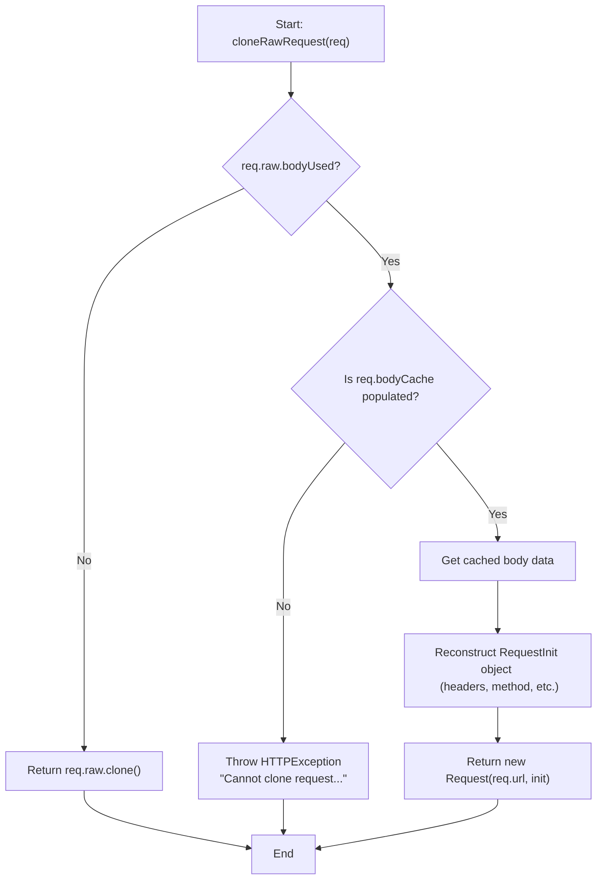

## Deprecated Properties

The following properties are deprecated and their functionality has been moved to dedicated helper functions in `hono/route` to improve tree-shaking.

-   `matchedRoutes`: An array of all routes that were matched for the current request.
    Sources: [src/request.ts:420-422](https://github.com/honojs/hono/blob/24547a6ed5e175f9326063efb657540162287973/src/request.ts#L420-L422)
-   `routePath`: The path pattern of the currently executing route handler (e.g., `/users/:id`).
    Sources: [src/request.ts:440-442](https://github.com/honojs/hono/blob/24547a6ed5e175f9326063efb657540162287973/src/request.ts#L440-L442)

# Page: Creating Responses

<details>
<summary>Relevant source files</summary>

The following files were used as context for generating this wiki page:

- [src/context.ts](https://github.com/honojs/hono/blob/24547a6ed5e175f9326063efb657540162287973/src/context.ts)
</details>

# Creating Responses

In Hono, all response generation is handled through the `Context` object, conventionally named `c` in handlers. This object provides a suite of methods for creating and manipulating HTTP responses, from setting headers and status codes to returning structured data like JSON or HTML. The core principle is to provide a flexible yet convenient API that covers both low-level response construction and high-level, content-aware helpers.

The `Context` class encapsulates the incoming `Request`, environment bindings, and the outgoing `Response`. Handlers interact with the `Context` to build a response, which is ultimately finalized and sent to the client.

Sources: [src/context.ts:293-780](https://github.com/honojs/hono/blob/24547a6ed5e175f9326063efb657540162287973/src/context.ts#L293-L780)

## The `Context` Class and Response Lifecycle

The `Context` class is the central hub for managing the state of a single request-response cycle. When a request is received, a `Context` instance is created, containing the raw `Request` object and other environment-specific details.

A handler's primary responsibility is to use the methods on the `Context` instance to construct a `Response`. This can be done by either directly returning the result of a response method (e.g., `return c.text('hello')`) or by manipulating the context's state (`c.status(201)`, `c.header(...)`) and then returning a body (`return c.body(...)`).

The `finalized` property on the context tracks whether a response has been set, which influences how subsequent modifications are handled.

Sources: [src/context.ts:293-361](https://github.com/honojs/hono/blob/24547a6ed5e175f9326063efb657540162287973/src/context.ts#L293-L361), [src/context.ts:414-434](https://github.com/honojs/hono/blob/24547a6ed5e175f9326063efb657540162287973/src/context.ts#L414-L434)

### Response Generation Flow

The following diagram illustrates the general flow of how a response is created within a Hono handler using the `Context` object.

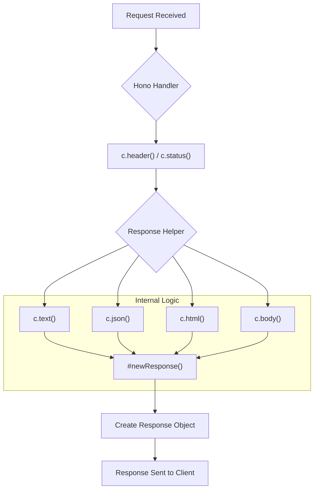

This flow shows that helper methods like `c.text()` and `c.json()` are convenient wrappers around the internal `#newResponse` method, which is responsible for assembling the final `Response` object.

Sources: [src/context.ts:604-639](https://github.com/honojs/hono/blob/24547a6ed5e175f9326063efb657540162287973/src/context.ts#L604-L639)

## Core Response Methods

These are the fundamental methods for creating a `Response`.

### `c.newResponse(data, init?, headers?)`

This is the primary internal method for creating `Response` objects. It consolidates headers from various sources (pre-set headers, headers in the `init` object, and explicit `headers` argument) and constructs a new `Response`. It is exposed publicly as `c.newResponse`.

The method intelligently merges headers. It respects `Set-Cookie` headers by appending them rather than overwriting, ensuring multiple cookies can be set.

Sources: [src/context.ts:604-642](https://github.com/honojs/hono/blob/24547a6ed5e175f9326063efb657540162287973/src/context.ts#L604-L642)

### `c.body(data, init?, headers?)`

This is the most generic public method for sending a response. It accepts `Data`, which can be a `string`, `ArrayBuffer`, `ReadableStream`, or `Uint8Array`. It's a direct wrapper around `c.newResponse`. This method is useful when you have already set the status and headers and just need to provide the response body.

```typescript
// Example usage
app.get('/welcome', (c) => {
  c.status(201)
  c.header('Content-Type', 'text/plain')
  return c.body('Thank you for coming')
})
```

Sources: [src/context.ts:26](https://github.com/honojs/hono/blob/24547a6ed5e175f9326063efb657540162287973/src/context.ts#L26), [src/context.ts:664-668](https://github.com/honojs/hono/blob/24547a6ed5e175f9326063efb657540162287973/src/context.ts#L664-L668)

## Content-Type Helpers

Hono provides several helper methods that simplify creating responses for common content types. These methods automatically set the `Content-Type` header and handle data serialization.

| Method | Description | `Content-Type` Header |
| --- | --- | --- |
| `c.text()` | Responds with plain text. | `text/plain; charset=UTF-8` |
| `c.json()` | Responds with a JSON object. | `application/json` |
| `c.html()` | Responds with an HTML string or a `Promise<string>`. | `text/html; charset=UTF-8` |

Sources: [src/context.ts:682-733](https://github.com/honojs/hono/blob/24547a6ed5e175f9326063efb657540162287973/src/context.ts#L682-L733)

### `c.text(text, init?, headers?)`

This method is for sending plain text responses. It includes an optimization to create a `new Response(text)` directly if no other response properties (like status or headers) have been modified on the context, which improves performance for simple cases.

Sources: [src/context.ts:682-694](https://github.com/honojs/hono/blob/24547a6ed5e175f9326063efb657540162287973/src/context.ts#L682-L694)

### `c.json(object, init?, headers?)`

This method serializes a JavaScript object to a JSON string using `JSON.stringify()` and sets the appropriate `Content-Type` header.

Sources: [src/context.ts:708-721](https://github.com/honojs/hono/blob/24547a6ed5e175f9326063efb657540162287973/src/context.ts#L708-L721)

### `c.html(html, init?, headers?)`

The `html` method can handle both a synchronous `string` and an asynchronous `Promise<string>`. This is particularly useful for template engines that render asynchronously. It uses the `resolveCallback` utility to await the promise before creating the response.

Sources: [src/context.ts:723-733](https://github.com/honojs/hono/blob/24547a6ed5e175f9326063efb657540162287973/src/context.ts#L723-L733), [src/utils/html.ts:13](https://github.com/honojs/hono/blob/24547a6ed5e175f9326063efb657540162287973/src/utils/html.ts#L13)

## Redirects and Other Responses

The context also provides helpers for common HTTP actions like redirects and "not found" errors.

### `c.redirect(location, status?)`

This method creates a redirect response. It sets the `Location` header to the provided URL.
- The default status code is `302` (Found).
- A different `RedirectStatusCode` (like `301`) can be provided as the second argument.
- It automatically handles URI encoding for multi-byte characters in the location URL.

Sources: [src/context.ts:750-762](https://github.com/honojs/hono/blob/24547a6ed5e175f9326063efb657540162287973/src/context.ts#L750-L762), [src/utils/http-status.ts:14](https://github.com/honojs/hono/blob/24547a6ed5e175f9326063efb657540162287973/src/utils/http-status.ts#L14)

### `c.notFound()`

This method executes the configured `notFoundHandler` for the application to generate a 404 Not Found response. If no custom handler is defined, it defaults to creating an empty `Response`.

Sources: [src/context.ts:776-779](https://github.com/honojs/hono/blob/24547a6ed5e175f9326063efb657540162287973/src/context.ts#L776-L779), [src/types.ts:8](https://github.com/honojs/hono/blob/24547a6ed5e175f9326063efb657540162287973/src/types.ts#L8)

## Modifying Response State

Before a response body is sent, its status and headers can be modified.

### `c.header(name, value?, options?)`

This method sets, appends, or deletes a response header.
- `c.header('X-Foo', 'bar')`: Sets the header.
- `c.header('X-Foo', 'baz', { append: true })`: Appends a value to an existing header.
- `c.header('X-Foo', undefined)`: Deletes the header.

If the response has already been partially constructed (`c.finalized` is true), this method will clone the existing response to ensure headers can still be modified.

Sources: [src/context.ts:515-527](https://github.com/honojs/hono/blob/24547a6ed5e175f9326063efb657540162287973/src/context.ts#L515-L527)

### `c.status(statusCode)`

This method sets the HTTP status code for the response. The status is stored on the context and applied when `c.newResponse` is called.

Sources: [src/context.ts:529-531](https://github.com/honojs/hono/blob/24547a6ed5e175f9326063efb657540162287973/src/context.ts#L529-L531), [src/utils/http-status.ts:15](https://github.com/honojs/hono/blob/24547a6ed5e175f9326063efb657540162287973/src/utils/http-status.ts#L15)

### Sequence of Operations

The following diagram shows the sequence of a handler setting headers and status before creating the final response body.

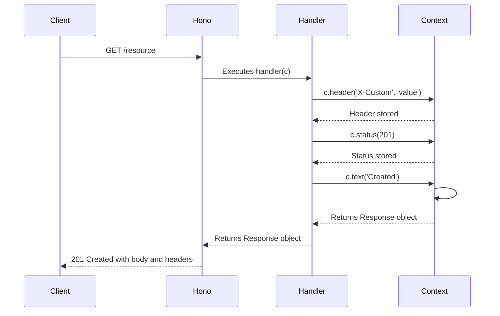
Sources: [src/context.ts](https://github.com/honojs/hono/blob/24547a6ed5e175f9326063efb657540162287973/src/context.ts)

## Rendering with Layouts

Hono's context includes a simple but powerful rendering mechanism.

-   **`c.setRenderer(renderer)`**: Middleware can use this to define a template rendering function. The renderer typically wraps content in a common layout, like a site-wide HTML shell.
-   **`c.render(content, props?)`**: In a handler, this method invokes the configured renderer. If no renderer is set, it defaults to `c.html(content)`.

This system allows for a separation of concerns, where layouts are defined in middleware and page-specific content is generated in the route handler.

Sources: [src/context.ts:448-451](https://github.com/honojs/hono/blob/24547a6ed5e175f9326063efb657540162287973/src/context.ts#L448-L451), [src/context.ts:495-497](https://github.com/honojs/hono/blob/24547a6ed5e175f9326063efb657540162287973/src/context.ts#L495-L497)

# Page: Error Handling

<details>
<summary>Relevant source files</summary>

The following files were used as context for generating this wiki page:

- [src/http-exception.ts](https://github.com/honojs/hono/blob/24547a6ed5e175f9326063efb657540162287973/src/http-exception.ts)
- [src/hono-base.ts](https://github.com/honojs/hono/blob/24547a6ed5e175f9326063efb657540162287973/src/hono-base.ts)
- [src/http-exception.test.ts](https://github.com/honojs/hono/blob/24547a6ed5e175f9326063efb657540162287973/src/http-exception.test.ts)
</details>

# Error Handling

Hono provides a robust and customizable error handling system. It is designed around a special `HTTPException` class for signaling HTTP errors and a configurable error handler on the main application instance. By default, Hono catches exceptions, logs non-HTTP errors to the console, and returns appropriate HTTP responses. This behavior can be completely overridden to implement custom error logging, formatting, and reporting.

The core components of the error handling system are the `HTTPException` class for structured HTTP errors, the default `errorHandler` for general-purpose error management, and the `.onError()` method for registering custom error handling logic.

## `HTTPException` Class

The `HTTPException` class is a custom `Error` subclass designed for handling fatal HTTP errors, such as authentication failures or invalid requests. When an `HTTPException` is thrown within a handler, Hono's error handling middleware intercepts it and uses its properties to generate an appropriate HTTP response.

Sources: [src/http-exception.ts:21-45](https://github.com/honojs/hono/blob/24547a6ed5e175f9326063efb657540162287973/src/http-exception.ts#L21-L45)

### Class Structure

The `HTTPException` class extends the standard `Error` class and adds properties for an HTTP status code and an optional `Response` object.

```mermaid
classDiagram
  direction TD
  class Error {
    <<JavaScript Built-in>>
    +message: string
    +cause: unknown
  }
  class HTTPException {
    +res: Response | undefined
    +status: ContentfulStatusCode
    +constructor(status, options)
    +getResponse(): Response
  }
  Error <|-- HTTPException
```
*Diagram illustrating the inheritance of `HTTPException` from `Error`.*
Sources: [src/http-exception.ts:46-78](https://github.com/honojs/hono/blob/24547a6ed5e175f9326063efb657540162287973/src/http-exception.ts#L46-L78)

### Constructor

The constructor initializes an `HTTPException` instance.

```typescript
constructor(status: ContentfulStatusCode = 500, options?: HTTPExceptionOptions)
```

| Parameter | Type | Description |
|-----------|------|-------------|
| `status` | `ContentfulStatusCode` | The HTTP status code for the exception. Defaults to `500`. |
| `options` | `HTTPExceptionOptions` | An optional object containing `message`, `cause`, or a `res` (Response) object. |

The `HTTPExceptionOptions` type is defined as:
```typescript
type HTTPExceptionOptions = {
  res?: Response
  message?: string
  cause?: unknown
}
```
The `message` and `cause` properties are passed directly to the `Error` superclass constructor.

Sources: [src/http-exception.ts:14-18](https://github.com/honojs/hono/blob/24547a6ed5e175f9326063efb657540162287973/src/http-exception.ts#L14-L18), [src/http-exception.ts:55-59](https://github.com/honojs/hono/blob/24547a6ed5e175f9326063efb657540162287973/src/http-exception.ts#L55-L59)

### `getResponse()` Method

This method generates a `Response` object from the exception's properties.

- If the exception was created with a `res` object in its options, a new `Response` is created using the body and headers of the original response, but with the status code of the exception. This ensures the exception's status code takes precedence.
- Otherwise, a new `Response` is created with the exception's `message` as the body and `status` as the status code.

```mermaid
graph TD
    A["call getResponse()"] --> B{Has this.res?};
    B -- Yes --> C["Create new Response from this.res body/headers"];
    C --> D["Set status from this.status"];
    B -- No --> E["Create new Response from this.message"];
    E --> D;
    D --> F[Return Response];
```
*Flowchart for the `getResponse()` logic.*
Sources: [src/http-exception.ts:66-78](https://github.com/honojs/hono/blob/24547a6ed5e175f9326063efb657540162287973/src/http-exception.ts#L66-L78), [src/http-exception.test.ts:35-44](https://github.com/honojs/hono/blob/24547a6ed5e175f9326063efb657540162287973/src/http-exception.test.ts#L35-L44)

## Hono Error Handling Mechanism

The `HonoBase` class orchestrates error handling during the request lifecycle. It has a default error handler that can be replaced with a custom one.

Sources: [src/hono-base.ts](https://github.com/honojs/hono/blob/24547a6ed5e175f9326063efb657540162287973/src/hono-base.ts)

### Default `errorHandler`

Hono provides a built-in `errorHandler`. This function is the default handler for any errors that occur during request processing.

Its logic is as follows:
1.  It checks if the thrown error `err` has a `getResponse` method (duck-typing for `HTTPException`).
2.  If `true`, it calls `err.getResponse()` and returns the result.
3.  If `false`, it treats the error as an unexpected server error. It logs the error to the console via `console.error(err)` and returns a generic "Internal Server Error" response with a 500 status code.

```typescript
const errorHandler: ErrorHandler = (err, c) => {
  if ('getResponse' in err) {
    const res = err.getResponse()
    return c.newResponse(res.body, res)
  }
  console.error(err)
  return c.text('Internal Server Error', 500)
}
```
Sources: [src/hono-base.ts:35-42](https://github.com/honojs/hono/blob/24547a6ed5e175f9326063efb657540162287973/src/hono-base.ts#L35-L42)

### Custom Error Handling with `.onError()`

You can override the default error handling behavior by using the `.onError()` method on a Hono instance. This method registers a custom `ErrorHandler` function.

```typescript
app.onError((err, c) => {
  console.error(`${err}`)
  return c.text('Custom Error Message', 500)
})
```

The `.onError()` method accepts a handler of type `ErrorHandler<E>` and assigns it to the instance's internal `errorHandler` property, replacing the default.

Sources: [src/hono-base.ts:256-274](https://github.com/honojs/hono/blob/24547a6ed5e175f9326063efb657540162287973/src/hono-base.ts#L256-L274)

### Request Dispatch and Error Flow

Errors are caught within the `#dispatch` method of the `HonoBase` class, which is the main entry point for processing a request.

The following sequence diagram illustrates how an error thrown by a route handler is processed:

```mermaid
sequenceDiagram
    participant Client
    participant Hono as "Hono#dispatch()"
    participant Handler as "Route Handler"
    participant ErrorHandler as "errorHandler()"

    Client->>Hono: Request
    Hono->>Handler: c.req
    Handler->>xHono: throws Error
    Hono->>ErrorHandler: #handleError(err, c)
    ErrorHandler-->>Hono: Response
    Hono-->>Client: Response
```
*Sequence of events during an error.*

1.  The `#dispatch` method finds and executes the appropriate route handler.
2.  Execution is wrapped in `try...catch` blocks.
3.  If a handler throws an error, the `catch` block calls the internal `#handleError(err, c)` method.
4.  `#handleError` checks if the error is an `instanceof Error`. If so, it passes the error and the current `Context` to the configured `errorHandler` (either the default or a custom one).
5.  The `errorHandler` is responsible for creating and returning the final `Response`.

Sources: [src/hono-base.ts:399-404](https://github.com/honojs/hono/blob/24547a6ed5e175f9326063efb657540162287973/src/hono-base.ts#L399-L404), [src/hono-base.ts:436-438](https://github.com/honojs/hono/blob/24547a6ed5e175f9326063efb657540162287973/src/hono-base.ts#L436-L438), [src/hono-base.ts:446](https://github.com/honojs/hono/blob/24547a6ed5e175f9326063efb657540162287973/src/hono-base.ts#L446), [src/hono-base.ts:462-464](https://github.com/honojs/hono/blob/24547a6ed5e175f9326063efb657540162287973/src/hono-base.ts#L462-L464)

### Not Found Handling

Related to error handling is "not found" handling. If the router does not find a match for an incoming request, a `notFoundHandler` is invoked. Like the `errorHandler`, Hono provides a default and allows for customization via the `.notFound()` method.

The default `notFoundHandler` returns a simple "404 Not Found" message with a 404 status code.

```typescript
const notFoundHandler: NotFoundHandler = (c) => {
  return c.text('404 Not Found', 404)
}
```
This handler is passed to the `Context` object during its creation and is called when the middleware chain completes without producing a response.

Sources: [src/hono-base.ts:31-33](https://github.com/honojs/hono/blob/24547a6ed5e175f9326063efb657540162287973/src/hono-base.ts#L31-L33), [src/hono-base.ts:186](https://github.com/honojs/hono/blob/24547a6ed5e175f9326063efb657540162287973/src/hono-base.ts#L186), [src/hono-base.ts:277-294](https://github.com/honojs/hono/blob/24547a6ed5e175f9326063efb657540162287973/src/hono-base.ts#L277-L294)

# Page: Presets (Tiny and Quick)

<details>
<summary>Relevant source files</summary>

The following files were used as context for generating this wiki page:

- [src/preset/tiny.ts](https://github.com/honojs/hono/blob/24547a6ed5e175f9326063efb657540162287973/src/preset/tiny.ts)
- [src/preset/quick.ts](https://github.com/honojs/hono/blob/24547a6ed5e175f9326063efb657540162287973/src/preset/quick.ts)
- [src/preset/quick.test.ts](https://github.com/honojs/hono/blob/24547a6ed5e175f9326063efb657540162287973/src/preset/quick.test.ts)
- [src/preset/tiny.test.ts](https://github.com/honojs/hono/blob/24547a6ed5e175f9326063efb657540162287973/src/preset/tiny.test.ts)
</details>

# Presets (Tiny and Quick)

Hono provides presets that determine the underlying router implementation used by the application. These presets allow developers to choose between a minimal, lightweight version and a faster, more feature-rich version depending on the application's needs. The two primary presets are "Tiny" and "Quick".

Both presets extend the same `HonoBase` class, ensuring a consistent API for defining routes and middleware. The main difference lies in the `router` property, which is initialized with a specific router instance in the constructor of each preset's `Hono` class.

## Overview

The choice between the Tiny and Quick presets is a trade-off between bundle size and routing performance.

| Preset | Router Implementation | Description |
| :--- | :--- | :--- |
| **Tiny** | `PatternRouter` | A minimal preset designed for the smallest possible bundle size. |
| **Quick** | `SmartRouter` (with `LinearRouter` and `TrieRouter`) | A fast and flexible preset that combines multiple routers for optimal performance. |

## Tiny Preset

The Tiny preset is optimized for a minimal footprint. It uses the `PatternRouter` as its sole routing engine.

Sources: [src/preset/tiny.ts:3](https://github.com/honojs/hono/blob/24547a6ed5e175f9326063efb657540162287973/src/preset/tiny.ts#L3)

### Architecture

The `Hono` class in the `tiny` preset extends `HonoBase` and, in its constructor, instantiates and assigns `PatternRouter` to the `this.router` property.

```typescript
// src/preset/tiny.ts
export class Hono<
  E extends Env = BlankEnv,
  S extends Schema = BlankSchema,
  BasePath extends string = '/',
> extends HonoBase<E, S, BasePath> {
  constructor(options: HonoOptions<E> = {}) {
    super(options)
    this.router = new PatternRouter()
  }
}
```
Sources: [src/preset/tiny.ts:11-20](https://github.com/honojs/hono/blob/24547a6ed5e175f9326063efb657540162287973/src/preset/tiny.ts#L11-L20)

The following diagram illustrates the class structure for the Tiny preset.

```mermaid
classDiagram
  direction TD
  class HonoBase
  class Hono_Tiny {
    <<preset>>
    +router: PatternRouter
  }
  class PatternRouter

  HonoBase <|-- Hono_Tiny
  Hono_Tiny o-- PatternRouter : uses
```

Tests confirm that an application instantiated from this preset correctly uses the `PatternRouter`.

Sources: [src/preset/tiny.test.ts:5-8](https://github.com/honojs/hono/blob/24547a6ed5e175f9326063efb657540162287973/src/preset/tiny.test.ts#L5-L8)

## Quick Preset

The Quick preset is designed for high performance and flexibility. It utilizes `SmartRouter`, which is a composite router that delegates routing logic to a collection of other routers.

Sources: [src/preset/quick.ts:3](https://github.com/honojs/hono/blob/24547a6ed5e175f9326063efb657540162287973/src/preset/quick.ts#L3)

### Architecture

The `Hono` class in the `quick` preset also extends `HonoBase`. Its constructor initializes a `SmartRouter` with an array containing instances of `LinearRouter` and `TrieRouter`. This composition allows `SmartRouter` to leverage the strengths of each sub-router.

```typescript
// src/preset/quick.ts
export class Hono<
  E extends Env = BlankEnv,
  S extends Schema = BlankSchema,
  BasePath extends string = '/',
> extends HonoBase<E, S, BasePath> {
  constructor(options: HonoOptions<E> = {}) {
    super(options)
    this.router = new SmartRouter({
      routers: [new LinearRouter(), new TrieRouter()],
    })
  }
}
```
Sources: [src/preset/quick.ts:13-24](https://github.com/honojs/hono/blob/24547a6ed5e175f9326063efb657540162287973/src/preset/quick.ts#L13-L24)

The diagram below shows the relationship between the classes in the Quick preset.

```mermaid
classDiagram
  direction TD
  class HonoBase
  class Hono_Quick {
    <<preset>>
    +router: SmartRouter
  }
  class SmartRouter
  class LinearRouter
  class TrieRouter

  HonoBase <|-- Hono_Quick
  Hono_Quick o-- SmartRouter : uses
  SmartRouter o-- LinearRouter : contains
  SmartRouter o-- TrieRouter : contains
```

Tests for the Quick preset verify that the resulting router identifies as `SmartRouter + LinearRouter`, reflecting the composite nature of the implementation.

Sources: [src/preset/quick.test.ts:5-8](https://github.com/honojs/hono/blob/24547a6ed5e175f9326063efb657540162287973/src/preset/quick.test.ts#L5-L8)

## Architectural Comparison

The primary architectural difference is the router instantiation logic within the constructor of each preset.

```mermaid
graph TD
    subgraph Hono App Initialization
        A["new Hono()"] --> B{Preset?}
    end

    subgraph "Tiny Preset"
        B -- Tiny --> C["new PatternRouter()"]
        C --> D[app.router = PatternRouter]
    end

    subgraph "Quick Preset"
        B -- Quick --> E["new LinearRouter()"]
        E --> G["new SmartRouter({ routers: [...] })"]
        F["new TrieRouter()"] --> G
        G --> H[app.router = SmartRouter]
    end
```
Sources: [src/preset/tiny.ts:16-19](https://github.com/honojs/hono/blob/24547a6ed5e175f9326063efb657540162287973/src/preset/tiny.ts#L16-L19), [src/preset/quick.ts:18-23](https://github.com/honojs/hono/blob/24547a6ed5e175f9326063efb657540162287973/src/preset/quick.ts#L18-L23)

## Type Safety and Generics

Both presets inherit the same generic type support from `HonoBase`, allowing for strong type-safety for environment variables (`Bindings`) and route schemas (`Schema`). This ensures a consistent developer experience regardless of the chosen preset.

The `Hono` class in both presets accepts generics for `Env`, `Schema`, and `BasePath`.

```typescript
// src/preset/tiny.ts
export class Hono<
  E extends Env = BlankEnv,
  S extends Schema = BlankSchema,
  BasePath extends string = '/',
> extends HonoBase<E, S, BasePath>
```
Sources: [src/preset/tiny.ts:11-15](https://github.com/honojs/hono/blob/24547a6ed5e175f9326063efb657540162287973/src/preset/tiny.ts#L11-L15)

Developers can provide a `Bindings` interface to get type-safe access to environment variables via the context object (`c.env`).

```typescript
// Example from tests
interface CloudflareBindings {
  MY_VARIABLE: string
}

const appWithInterface = new Hono<{
  Bindings: CloudflareBindings
}>()

appWithInterface.get('/', (c) => {
  // c.env.MY_VARIABLE is of type string
  expectTypeOf(c.env.MY_VARIABLE).toMatchTypeOf<string>()
  return c.text('/')
})
```
Sources: [src/preset/tiny.test.ts:12-29](https://github.com/honojs/hono/blob/24547a6ed5e175f9326063efb657540162287973/src/preset/tiny.test.ts#L12-L29), [src/preset/quick.test.ts:12-30](https://github.com/honojs/hono/blob/24547a6ed5e175f9326063efb657540162287973/src/preset/quick.test.ts#L12-L30)

# Page: Routing Overview

<details>
<summary>Relevant source files</summary>

The following files were used as context for generating this wiki page:

- [src/hono-base.ts](https://github.com/honojs/hono/blob/24547a6ed5e175f9326063efb657540162287973/src/hono-base.ts)
- [src/router.ts](https://github.com/honojs/hono/blob/24547a6ed5e175f9326063efb657540162287973/src/router.ts)
</details>

# Routing Overview

Hono's routing system is responsible for mapping incoming HTTP requests to the appropriate handler functions. This is primarily managed by the `HonoBase` class, which acts as the main application object. It uses a pluggable `Router` instance to perform the actual matching of request paths and methods against registered routes. When a request is received, the `HonoBase` class dispatches it to the router, which returns the matching handlers. These handlers are then executed in sequence, often composed as a middleware stack.

The system is designed to be flexible, allowing for different routing strategies, route grouping, and integration with other frameworks. Key features include defining routes for specific HTTP methods, using middleware, setting base paths, and nesting applications.

## Core Components

The routing mechanism in Hono is built upon a few key components that work together to handle requests.

```mermaid
classDiagram
  direction TD
  class HonoBase {
    +router: Router
    +routes: RouterRoute[]
    +getPath: GetPath
    +fetch(request, env, ctx)
    +route(path, app)
    +basePath(path)
    +use(path, handler)
    +on(method, path, handler)
    +get(path, handler)
    +post(path, handler)
    #addRoute(method, path, handler)
    #dispatch(request, ctx, env, method)
  }
  class Router {
    <<interface>>
    +name: string
    +add(method, path, handler)
    +match(method, path): Result
  }
  class Context {
    +req: Request
    +res: Response
    +env: E["Bindings"]
    +path: string
    +matchResult: Result
  }
  HonoBase o-- Router : uses
  HonoBase --> Context : creates
```
*Diagram illustrating the relationship between `HonoBase`, the `Router` interface, and the `Context` object.*
Sources: [src/hono-base.ts:98-543](https://github.com/honojs/hono/blob/24547a6ed5e175f9326063efb657540162287973/src/hono-base.ts#L98-L543), [src/router.ts:29-52](https://github.com/honojs/hono/blob/24547a6ed5e175f9326063efb657540162287973/src/router.ts#L29-L52), [src/context.ts](https://github.com/honojs/hono/blob/24547a6ed5e175f9326063efb657540162287973/src/context.ts)

### HonoBase Class

The `HonoBase` class is the central part of the application. It provides methods for defining routes (e.g., `.get()`, `.post()`, `.use()`) and manages the overall request lifecycle.

- **Route Registration**: It exposes methods for all standard HTTP verbs, plus `.all()` and `.use()`, to register handlers for specific paths. These methods ultimately call the internal `#addRoute` function.
- **Router Instance**: Each `HonoBase` instance holds a `router` property, which is an implementation of the `Router` interface. This router is responsible for storing routes and matching them against incoming requests. The router can be specified in the `Hono` constructor options.
- **Request Dispatching**: The `.fetch()` method is the main entry point for handling requests. It calls the internal `#dispatch` method, which orchestrates the process of path extraction, route matching, context creation, and handler execution.

Sources: [src/hono-base.ts:98-543](https://github.com/honojs/hono/blob/24547a6ed5e175f9326063efb657540162287973/src/hono-base.ts#L98-L543)

### Router Interface

The `Router` is a pluggable component that handles the core logic of matching a request's method and path to a set of registered handlers. Hono can work with different router implementations (e.g., RegExpRouter, TrieRouter).

The interface defines two primary methods:
- `add(method, path, handler)`: Adds a new route to the router's internal storage. This is called by `HonoBase`'s `#addRoute` method.
- `match(method, path)`: Finds all handlers that match the given HTTP method and path. It returns a `Result` object containing the handlers and any extracted path parameters.

Sources: [src/router.ts:29-52](https://github.com/honojs/hono/blob/24547a6ed5e175f9326063efb657540162287973/src/router.ts#L29-L52)

### Routing Configuration

When instantiating a `Hono` application, several routing-related options can be provided.

| Option | Type | Description | Default |
| --- | --- | --- | --- |
| `strict` | `boolean` | If `true` (default), distinguishes between paths with and without a trailing slash. If `false`, treats them as the same. | `true` |
| `router` | `Router<[H, RouterRoute]>` | An instance of a router class (e.g., `RegExpRouter`, `TrieRouter`) to use for matching. | `TrieRouter` (not shown in files, but is the project default) |
| `getPath` | `(request: Request, options?: { env?: E['Bindings'] }) => string` | A custom function to extract the routing path from the request. Useful for routing based on hostnames or other headers. | A function that returns `request.url`'s pathname. |

Sources: [src/hono-base.ts:46-87](https://github.com/honojs/hono/blob/24547a6ed5e175f9326063efb657540162287973/src/hono-base.ts#L46-L87)

## Route Definition

Routes are defined by chaining methods on a `Hono` instance. All route definition methods ultimately delegate to the private `#addRoute` method.

```mermaid
graph TD
    subgraph "User-facing API"
        A["app.get('/users', ...)"]
        B["app.post('/users', ...)"]
        C["app.use('/admin', ...)"]
        D["app.on('GET', '/posts', ...)"]
    end
    
    subgraph "HonoBase Internals"
        E["Constructor Loop (for .get, .post, etc.)"]
        F[".use() Implementation"]
        G[".on() Implementation"]
        H["#addRoute(method, path, handler)"]
        I["router.add(method, path, [handler, route])"]
    end
    
    A --> E
    B --> E
    E --> H
    C --> F --> H
    D --> G --> H
    H --> I
```
*Flowchart showing how different route definition methods converge on the internal `#addRoute` method.*
Sources: [src/hono-base.ts:128-168](https://github.com/honojs/hono/blob/24547a6ed5e175f9326063efb657540162287973/src/hono-base.ts#L128-L168), [src/hono-base.ts:385-397](https://github.com/honojs/hono/blob/24547a6ed5e175f9326063efb657540162287973/src/hono-base.ts#L385-L397)

### HTTP Method Handlers

The most common way to define routes is through methods named after HTTP verbs, such as `.get()`, `.post()`, `.put()`, etc. These are dynamically created in the `HonoBase` constructor.

```typescript
// Example from hono-base.ts constructor
allMethods.forEach((method) => {
  this[method] = (args1: string | H, ...args: H[]) => {
    if (typeof args1 === 'string') {
      this.#path = args1
    } else {
      this.#addRoute(method, this.#path, args1)
    }
    args.forEach((handler) => {
      this.#addRoute(method, this.#path, handler)
    })
    return this as any
  }
})
```
Sources: [src/hono-base.ts:128-141](https://github.com/honojs/hono/blob/24547a6ed5e175f9326063efb657540162287973/src/hono-base.ts#L128-L141)

### Middleware with `.use()`

The `.use()` method registers middleware. If a path is provided, the middleware applies only to that path and its children. If no path is provided, it applies to all paths. Internally, middleware is registered as a handler for the special `ALL` method.

Sources: [src/hono-base.ts:157-168](https://github.com/honojs/hono/blob/24547a6ed5e175f9326063efb657540162287973/src/hono-base.ts#L157-L168), [src/router.ts:9](https://github.com/honojs/hono/blob/24547a6ed5e175f9326063efb657540162287973/src/router.ts#L9)

### Internal Route Addition

The `#addRoute` method is the final step in registering a route. It performs several key actions:
1.  Converts the method name to uppercase (e.g., 'get' -> 'GET').
2.  Merges the application's `_basePath` with the route's specific path using `mergePath`.
3.  Creates a `RouterRoute` object containing the final path, method, handler, and base path.
4.  Calls `this.router.add()` to register the handler and route data with the router instance.
5.  Pushes the `RouterRoute` object to the `this.routes` array for record-keeping.

Sources: [src/hono-base.ts:385-397](https://github.com/honojs/hono/blob/24547a6ed5e175f9326063efb657540162287973/src/hono-base.ts#L385-L397), [src/utils/url.ts](https://github.com/honojs/hono/blob/24547a6ed5e175f9326063efb657540162287973/src/utils/url.ts)

## Request Dispatching Flow

When the application receives a request via the `.fetch()` method, it triggers the dispatching process to find and execute the correct handlers.

```mermaid
sequenceDiagram
    participant Client
    participant App as "HonoApp (.fetch)"
    participant Dispatch as "#dispatch()"
    participant Router
    participant Composer as "compose()"
    participant Handler
    
    Client->>App: Request
    App->>Dispatch: Dispatches request
    Dispatch->>Router: router.match(method, path)
    Router-->>Dispatch: Returns matchResult (handlers, params)
    Dispatch->>Composer: compose(handlers, errorHandler, notFoundHandler)
    Composer-->>Dispatch: Returns composed handler function
    Dispatch->>Handler: Executes composed handler(c)
    Handler-->>Dispatch: Returns Response
    Dispatch-->>App: Returns Response
    App-->>Client: Response
```
*Sequence diagram of the request handling and routing process.*
Sources: [src/hono-base.ts:406-466](https://github.com/honojs/hono/blob/24547a6ed5e175f9326063efb657540162287973/src/hono-base.ts#L406-L466), [src/compose.ts](https://github.com/honojs/hono/blob/24547a6ed5e175f9326063efb657540162287973/src/compose.ts)

The `#dispatch` method is the core of this flow:
1.  **Entry**: The `.fetch()` method is the public API that receives the `Request` object and passes it to `#dispatch`.
2.  **HEAD Method Handling**: If the method is `HEAD`, it is internally handled by dispatching a `GET` request and returning a `Response` with a `null` body.
3.  **Path Extraction**: It calls `this.getPath(request)` to determine the path to be used for routing. This allows for customization, such as routing by hostname.
4.  **Route Matching**: It calls `this.router.match(method, path)` to get the matching handlers and parameters.
5.  **Context Creation**: A new `Context` object is created, containing the request, environment variables, and the `matchResult` from the router.
6.  **Handler Execution**:
    - If only one handler matches, it is invoked directly for performance.
    - If multiple handlers match (e.g., several middleware and a final handler), the `compose` function is used to create a single composed handler that executes them in sequence.
7.  **Error Handling**: Any errors thrown during handler execution are caught and passed to the configured `errorHandler`.
8.  **Response**: The final `Response` object is returned.

Sources: [src/hono-base.ts:406-466](https://github.com/honojs/hono/blob/24547a6ed5e175f9326063efb657540162287973/src/hono-base.ts#L406-L466), [src/context.ts](https://github.com/honojs/hono/blob/24547a6ed5e175f9326063efb657540162287973/src/context.ts)

## Advanced Features

### Grouping with `.route()`

The `.route()` method allows for nesting another `Hono` instance under a specific path prefix. This is useful for organizing an application into smaller, modular sub-applications. It iterates through the routes of the provided sub-app and adds them to the main app's router, prefixed with the specified path.

Sources: [src/hono-base.ts:208-232](https://github.com/honojs/hono/blob/24547a6ed5e175f9326063efb657540162287973/src/hono-base.ts#L208-L232)

### Base Path with `.basePath()`

The `.basePath()` method creates a new `Hono` instance where all subsequent route definitions are automatically prefixed with the given base path. This is achieved by cloning the current instance and setting the `_basePath` property.

Sources: [src/hono-base.ts:235-253](https://github.com/honojs/hono/blob/24547a6ed5e175f9326063efb657540162287973/src/hono-base.ts#L235-L253)

### Mounting External Applications

The `.mount()` method provides a way to integrate applications built with other frameworks (or any function that handles a `Request`) into a Hono application. It registers a middleware on a given path that forwards the request to the external application handler. It can also modify the request URL to strip the mount path prefix before forwarding.

Sources: [src/hono-base.ts:297-383](https://github.com/honojs/hono/blob/24547a6ed5e175f9326063efb657540162287973/src/hono-base.ts#L297-L383)

# Page: Basic Routing

<details>
<summary>Relevant source files</summary>

The following files were used as context for generating this wiki page:

- [src/hono-base.ts](https://github.com/honojs/hono/blob/24547a6ed5e175f9326063efb657540162287973/src/hono-base.ts)
- [src/hono.test.ts](https://github.com/honojs/hono/blob/24547a6ed5e175f9326063efb657540162287973/src/hono.test.ts)
</details>

# Basic Routing

Hono provides a powerful and flexible routing system that is central to its operation. The `Hono` class serves as the primary interface for defining routes, which map HTTP methods and URL paths to specific handler functions. The routing mechanism is designed to be fast and efficient, supporting static paths, dynamic paths with parameters, wildcards, and even complex matching logic based on regular expressions or request properties like hostnames.

The core of the routing system involves registering routes on a `Hono` instance, which are then added to an underlying router. When a request is received, the router matches the request's method and path against the registered routes to find the appropriate handlers. These handlers are then executed, often in a chain if middleware is used, to process the request and generate a response. Hono also supports advanced patterns like grouping routes under a common base path and mounting entire sub-applications, enabling modular and organized application architecture.

## Route Registration

Routes are defined by associating an HTTP method and a path pattern with one or more handler functions. The `Hono` class provides several methods for this purpose.

### HTTP Method Helpers

The most common way to register routes is by using the convenience methods named after HTTP methods, such as `app.get()`, `app.post()`, `app.put()`, etc. These methods are dynamically created in the `Hono` class constructor.

`Sources: [src/hono-base.ts:128-141](https://github.com/honojs/hono/blob/24547a6ed5e175f9326063efb657540162287973/src/hono-base.ts#L128-L141)`

These methods can be used in several ways:
1.  **With a path and handlers**: `app.get('/hello', (c) => c.text('Hello'))`
2.  **Chaining handlers for the same path**: `app.get('/user', middleware1, handler)`
3.  **Chaining methods for the same path**: `app.get('/book', getHandler).post(postHandler)`

```typescript
// Example of defining a simple GET route
const app = new Hono<Env>()

app.get('/hello', async () => {
  return new Response('hello', {
    status: 200,
    statusText: 'Hono is OK',
  })
})
```
`Sources: [src/hono.test.ts:53-60](https://github.com/honojs/hono/blob/24547a6ed5e175f9326063efb657540162287973/src/hono.test.ts#L53-L60)`

When a method like `.get()` is called with a path, it sets the internal path for subsequent chained calls that do not specify a path.

```typescript
// Example of chained route definitions
const app = new Hono()

app
  .get('/chained/:abc', (c) => {
    const abc = c.req.param('abc')
    return c.text(`GET for ${abc}`)
  })
  .post((c) => {
    const abc = c.req.param('abc')
    return c.text(`POST for ${abc}`)
  })
```
`Sources: [src/hono.test.ts:765-774](https://github.com/honojs/hono/blob/24547a6ed5e175f9326063efb657540162287973/src/hono.test.ts#L765-L774)`

### The `on` Method

For more flexibility, the `app.on()` method allows registering a route for any custom HTTP method or for multiple methods at once.

`Sources: [src/hono-base.ts:144-154](https://github.com/honojs/hono/blob/24547a6ed5e175f9326063efb657540162287973/src/hono-base.ts#L144-L154)`

```typescript
// Registering a handler for both PUT and DELETE methods
const app = new Hono()
app.on(['PUT', 'DELETE'], '/posts/:id', (c) => {
  return c.json({
    postId: c.req.param('id'),
    method: c.req.method,
  })
})
```
`Sources: [src/hono.test.ts:2042-2047](https://github.com/honojs/hono/blob/24547a6ed5e175f9326063efb657540162287973/src/hono.test.ts#L2042-L2047)`

It can also register handlers for multiple paths simultaneously.

```typescript
const app = new Hono()

const paths = ['/hello', '/ja/hello', '/en/hello']
app.on('GET', paths, (c) => {
  return c.json({
    path: c.req.path,
    routePath: c.req.routePath,
  })
})
```
`Sources: [src/hono.test.ts:2085-2091](https://github.com/honojs/hono/blob/24547a6ed5e175f9326063efb657540162287973/src/hono.test.ts#L2085-L2091)`

### Internal Route Addition

All registration methods ultimately call the internal `#addRoute` method. This method standardizes the HTTP method to uppercase, merges the provided path with any `_basePath`, and adds the handler to the configured router instance.

```typescript
#addRoute(method: string, path: string, handler: H, baseRoutePath?: string): void {
  method = method.toUpperCase()
  path = mergePath(this._basePath, path)
  const r: RouterRoute = {
    basePath:
      baseRoutePath !== undefined ? mergePath(this._basePath, baseRoutePath) : this._basePath,
    path,
    method,
    handler,
  }
  this.router.add(method, path, [handler, r])
  this.routes.push(r)
}
```
`Sources: [src/hono-base.ts:385-397](https://github.com/honojs/hono/blob/24547a6ed5e175f9326063efb657540162287973/src/hono-base.ts#L385-L397)`

The following diagram illustrates the registration flow:

```mermaid
graph TD
    A["app.get('/path', handler)"] --> B["Hono constructor loop"]
    B --> C{"Internal #path = '/path'"}
    C --> D["#addRoute('GET', '/path', handler)"]
    D --> E["this.router.add(...)"]
    D --> F["this.routes.push(...)"]
```
`Sources: [src/hono-base.ts:129-141](https://github.com/honojs/hono/blob/24547a6ed5e175f9326063efb657540162287973/src/hono-base.ts#L129-L141), [src/hono-base.ts:385-397](https://github.com/honojs/hono/blob/24547a6ed5e175f9326063efb657540162287973/src/hono-base.ts#L385-L397)`

## Path Matching

Hono's router supports various path patterns for flexible route definitions.

| Pattern Type | Example | Description |
| :--- | :--- | :--- |
| **Static** | `/users` | Matches the exact path. |
| **Parameter** | `/users/:id` | Matches a path segment and captures its value in `c.req.param('id')`. |
| **Optional Parameter** | `/api/:version?` | The `version` parameter is optional. Matches both `/api/v1` and `/api`. |
| **Regex** | `/:id{[0-9]+}` | Matches a parameter only if it conforms to the specified regular expression. |
| **Wildcard** | `/assets/*` | Matches any path that starts with `/assets/`. |

`Sources: [src/hono.test.ts:856-859](https://github.com/honojs/hono/blob/24547a6ed5e175f9326063efb657540162287973/src/hono.test.ts#L856-L859), [src/hono.test.ts:861-864](https://github.com/honojs/hono/blob/24547a6ed5e175f9326063efb657540162287973/src/hono.test.ts#L861-L864), [src/hono.test.ts:1046-1049](https://github.com/honojs/hono/blob/24547a6ed5e175f9326063efb657540162287973/src/hono.test.ts#L1046-L1049), [src/hono.test.ts:2522-2532](https://github.com/honojs/hono/blob/24547a6ed5e175f9326063efb657540162287973/src/hono.test.ts#L2522-L2532)`

### Strict Mode

The `strict` option in the `Hono` constructor controls how trailing slashes are handled.

| `strict` value | Behavior |
| :--- | :--- |
| `true` (default) | A path with a trailing slash is considered different from one without. `/hello` and `/hello/` are distinct routes. |
| `false` | Trailing slashes are ignored. `/hello` and `/hello/` are treated as the same route. |

This behavior is configured during `Hono` instantiation. The `getPath` property is set to either `getPath` (strict) or `getPathNoStrict` (non-strict).

`Sources: [src/hono-base.ts:48-54](https://github.com/honojs/hono/blob/24547a6ed5e175f9326063efb657540162287973/src/hono-base.ts#L48-L54), [src/hono-base.ts:172](https://github.com/honojs/hono/blob/24547a6ed5e175f9326063efb657540162287973/src/hono-base.ts#L172), [src/hono.test.ts:310-360](https://github.com/honojs/hono/blob/24547a6ed5e175f9326063efb657540162287973/src/hono.test.ts#L310-L360)`

```typescript
// Strict mode is the default
const app = new Hono() // strict: true
app.get('/hello', (c) => c.text('/hello'))

// A request to '/hello' will succeed, but '/hello/' will result in a 404 Not Found.
// new Request('http://localhost/hello')  //=> 200 OK
// new Request('http://localhost/hello/') //=> 404 Not Found
```
`Sources: [src/hono.test.ts:312-325](https://github.com/honojs/hono/blob/24547a6ed5e175f9326063efb657540162287973/src/hono.test.ts#L312-L325)`

```typescript
// Disabling strict mode
const app = new Hono({ strict: false })
app.get('/hello', (c) => c.text('/hello'))

// Both '/hello' and '/hello/' will match the route.
// new Request('http://localhost/hello')  //=> 200 OK
// new Request('http://localhost/hello/') //=> 200 OK
```
`Sources: [src/hono.test.ts:346-359](https://github.com/honojs/hono/blob/24547a6ed5e175f9326063efb657540162287973/src/hono.test.ts#L346-L359)`

## Route Grouping

Hono provides methods to organize routes by grouping them under a common path prefix or by composing applications.

### `basePath()`

The `basePath()` method allows you to define a common prefix for a set of routes. It returns a new, cloned `Hono` instance with the `_basePath` property set. Any routes defined on this new instance will be automatically prefixed with the base path.

`Sources: [src/hono-base.ts:247-253](https://github.com/honojs/hono/blob/24547a6ed5e175f9326063efb657540162287973/src/hono-base.ts#L247-L253)`

```typescript
const app = new Hono()

const book = app.basePath('/book')
book.get('/', (c) => c.text('get /book')) // Matches GET /book
book.get('/:id', (c) => {                // Matches GET /book/:id
  return c.text('get /book/' + c.req.param('id'))
})
```
`Sources: [src/hono.test.ts:428-432](https://github.com/honojs/hono/blob/24547a6ed5e175f9326063efb657540162287973/src/hono.test.ts#L428-L432)`

### `route()`

The `route()` method is used to mount an entire `Hono` instance on a specific path. This is useful for splitting a large application into smaller, modular sub-applications. The routes from the sub-application are merged into the main application's routing table, prefixed with the mount path.

`Sources: [src/hono-base.ts:208-232](https://github.com/honojs/hono/blob/24547a6ed5e175f9326063efb657540162287973/src/hono-base.ts#L208-L232)`

```typescript
const app = new Hono()
const book = new Hono().basePath('/book')
book.get('/', (c) => c.text('get /book'))

// Mounts the 'book' app under '/api'
// A request to GET /api/book will be handled by the 'book' app.
app.route('/api', book)
```
`Sources: [src/hono.test.ts:477-480](https://github.com/honojs/hono/blob/24547a6ed5e175f9326063efb657540162287973/src/hono.test.ts#L477-L480)`

The `route()` method correctly merges base paths from both the mounting point and the sub-application itself.

`Sources: [src/hono.test.ts:522-536](https://github.com/honojs/hono/blob/24547a6ed5e175f9326063efb657540162287973/src/hono.test.ts#L522-L536)`

## Advanced Routing with `getPath`

For highly dynamic routing scenarios, the `getPath` option can be provided to the `Hono` constructor. This function receives the `Request` object and returns the string that should be used as the path for routing purposes. This enables patterns like routing based on the `Host` header or other request properties.

`Sources: [src/hono-base.ts:67-86](https://github.com/honojs/hono/blob/24547a6ed5e175f9326063efb657540162287973/src/hono-base.ts#L67-L86)`

### Hostname-based Routing

By using `getPath`, you can prepend the hostname to the URL's pathname, allowing you to define routes for specific domains.

```typescript
// Example of routing based on hostname
const app = new Hono({
  getPath: (req) =>
    '/' + req.headers.get('host') + req.url.replace(/^https?:\/\/[^/]+(\/[^?]*)/, '$1'),
})

app.get('/www1.example.com/hello', () => new Response('hello www1'))
app.get('/www2.example.com/hello', () => new Response('hello www2'))

// A request to 'http://www1.example.com/hello' with host header 'www1.example.com'
// will match the first route.
```
`Sources: [src/hono.test.ts:674-684](https://github.com/honojs/hono/blob/24547a6ed5e175f9326063efb657540162287973/src/hono.test.ts#L674-L684)`

## Request Dispatching

When a request is received via `app.fetch()`, it triggers the internal `#dispatch` method, which orchestrates the routing and handler execution process.

`Sources: [src/hono-base.ts:479-485](https://github.com/honojs/hono/blob/24547a6ed5e175f9326063efb657540162287973/src/hono-base.ts#L479-L485), [src/hono-base.ts:406-466](https://github.com/honojs/hono/blob/24547a6ed5e175f9326063efb657540162287973/src/hono-base.ts#L406-L466)`

The dispatch flow is as follows:
1.  The `HEAD` method is handled as a special case, by internally dispatching a `GET` request and returning a `Response` with a `null` body.
2.  The routing path is determined using `this.getPath()`.
3.  The router's `match()` method is called with the request method and path to find matching handlers.
4.  A new `Context` object is created with the request details and match results.
5.  If only one handler is found, it is executed directly for performance.
6.  If multiple handlers (e.g., middleware) are found, the `compose` function is used to create a single composed handler that executes them in sequence.
7.  The result is returned as a `Response`. Error handling and "not found" scenarios are managed within this process.

The following sequence diagram illustrates the dispatch process:

```mermaid
sequenceDiagram
    participant Client
    participant HonoApp as "app.fetch()"
    participant Dispatch as "#dispatch()"
    participant Router as "app.router"
    participant Handlers as "compose(handlers)"

    Client->>HonoApp: Request
    HonoApp->>Dispatch: (request, env, ctx)
    Dispatch->>Dispatch: getPath(request)
    Dispatch->>Router: match(method, path)
    Router-->>Dispatch: [handlers]
    Dispatch->>Dispatch: new Context(request, matchResult)
    alt Single Handler
        Dispatch->>Handlers: Execute handler(c, next)
    else Multiple Handlers
        Dispatch->>Handlers: compose(handlers)
        Handlers-->>Dispatch: composedHandler
        Dispatch->>Handlers: composedHandler(c)
    end
    Handlers-->>Dispatch: Response or Promise<Response>
    Dispatch-->>HonoApp: Response
    HonoApp-->>Client: Response
```
`Sources: [src/hono-base.ts:406-466](https://github.com/honojs/hono/blob/24547a6ed5e175f9326063efb657540162287973/src/hono-base.ts#L406-L466)`

# Page: Dynamic Routing

<details>
<summary>Relevant source files</summary>

The following files were used as context for generating this wiki page:

- [src/router/reg-exp-router/router.test.ts](https://github.com/honojs/hono/blob/24547a6ed5e175f9326063efb657540162287973/src/router/reg-exp-router/router.test.ts)
- [src/request.ts](https://github.com/honojs/hono/blob/24547a6ed5e175f9326063efb657540162287973/src/request.ts)
- [src/router/common.case.test.ts](https://github.com/honojs/hono/blob/24547a6ed5e175f9326063efb657540162287973/src/router/common.case.test.ts)
- [src/router/reg-exp-router/index.ts](https://github.com/honojs/hono/blob/24547a6ed5e175f9326063efb657540162287973/src/router/reg-exp-router/index.ts)
- [src/router/reg-exp-router/matcher.ts](https://github.com/honojs/hono/blob/24547a6ed5e175f9326063efb657540162287973/src/router/reg-exp-router/matcher.ts)
- [src/router/reg-exp-router/node.ts](https://github.com/honojs/hono/blob/24547a6ed5e175f9326063efb657540162287973/src/router/reg-exp-router/node.ts)
- [src/router/reg-exp-router/prepared-router.test.ts](https://github.com/honojs/hono/blob/24547a6ed5e175f9326063efb657540162287973/src/router/reg-exp-router/prepared-router.test.ts)
- [src/router/reg-exp-router/prepared-router.ts](https://github.com/honojs/hono/blob/24547a6ed5e175f9326063efb657540162287973/src/router/reg-exp-router/prepared-router.ts)
- [src/router/reg-exp-router/trie.ts](https://github.com/honojs/hono/blob/24547a6ed5e175f9326063efb657540162287973/src/router/reg-exp-router/trie.ts)
</details>

# Dynamic Routing

Hono's dynamic routing is powered by the `RegExpRouter`, a high-performance router that supports a wide range of path patterns, including named parameters, wildcards, and regular expression constraints. It uses a trie data structure to efficiently store and match routes. When a route is added, its path is parsed into tokens and inserted into the trie. This trie is then used to generate a single, optimized regular expression for each HTTP method, which allows for fast matching of incoming requests.

For applications where all route paths are known at build time, Hono provides the `PreparedRegExpRouter`. This router pre-compiles the routing logic, separating the expensive task of building the trie and regular expressions from the runtime process of associating handlers with routes. This results in faster application startup and request handling.

## Key Components

| Component | Description | Source File |
| --- | --- | --- |
| `RegExpRouter` | The default router implementation that builds the routing trie and regex dynamically as routes are added. | `src/router/reg-exp-router/router.ts` |
| `PreparedRegExpRouter` | An optimized router that uses pre-built routing information for faster handler registration and matching. | `src/router/reg-exp-router/prepared-router.ts` |
| `Trie` | A class that manages the trie data structure, handling path insertion and regex generation. | `src/router/reg-exp-router/trie.ts` |
| `Node` | Represents a node in the trie, corresponding to a segment of a path. | `src/router/reg-exp-router/node.ts` |
| `match` | The core matching function that uses the generated regex to find handlers for a request. | `src/router/reg-exp-router/matcher.ts` |
| `HonoRequest` | The request object that provides access to matched route parameters via the `.param()` method. | `src/request.ts` |

## Path Parsing and Trie Structure

When a route is added via `router.add()`, its path is processed by the `Trie.insert` method. This method tokenizes the path string into static segments, parameter placeholders, and wildcards. These tokens are then inserted into a tree of `Node` objects, forming a trie.

The trie is then traversed by `Node.buildRegExpStr` to construct a single, large regular expression that can match all registered paths for a given HTTP method. This approach allows the router to check a request path against many route patterns in a single regex operation.

Sources: [`src/router/reg-exp-router/trie.ts:10-47`](), [`src/router/reg-exp-router/node.ts:50-133`](), [`src/router/reg-exp-router/node.ts:135-161`]()

The following diagram illustrates this process:

```mermaid
graph TD
    subgraph Path Processing
        A["router.add('GET', '/users/:id', handler)"] --> B{"Trie.insert('/users/:id')"}
        B --> C{"Tokenize path: ['/users', '/:id']"}
        C --> D{Insert into Node tree}
    end
    subgraph Trie Structure
        D --> E(Root Node)
        E --> F["/users"]
        F --> G[":id -> ([^/]+)"]
        G --> H["Handler Index"]
    end
    subgraph RegExp Generation
        D --> I{"Trie.buildRegExp()"}
        I --> J["Node.buildRegExpStr()"]
        J --> K["RegExp: /^\\/users\\/([^/]+)$/"]
    end
```
*This diagram shows how a path string is converted into a trie structure, which is then used to generate a single regular expression for matching.*
Sources: [`src/router/reg-exp-router/trie.ts`](), [`src/router/reg-exp-router/node.ts`]()

## Route Matching and Parameter Extraction

The `match` function is the heart of the routing process. For a given request method and path, it first attempts to find a match in a pre-computed map of static routes for maximum performance. If no static match is found, it executes the main regular expression against the request path.

If the regex matches, the captured groups contain the values for any dynamic parameters. The `match` function returns an array of matched handlers along with a `stash` containing the captured parameter values.

Sources: [`src/router/reg-exp-router/matcher.ts:10-33`]()

```mermaid
sequenceDiagram
    participant C as Client
    participant R as RegExpRouter
    participant M as Matcher
    participant S as StaticMap
    participant RE as RegExp

    C->>R: match('GET', '/users/123')
    R->>M: match('GET', '/users/123')
    M->>S: Check for '/users/123'
    S-->>M: No static match
    M->>RE: path.match(/^\\/users\\/([^/]+)$/)
    RE-->>M: Match found, captures: ['123']
    M-->>R: Result: [[handler, {id: 1}]], ['/users/123', '123']
    R-->>C: Return matched handlers and params
```
*Sequence diagram of the route matching process.*
Sources: [`src/router/reg-exp-router/matcher.ts`]()

The `HonoRequest` object, available in handlers, uses this result to provide easy access to path parameters. The `c.req.param('id')` method retrieves the value '123' by looking up the parameter's index in the match result and extracting the corresponding value from the stash.

Sources: [`src/request.ts:94-104`](), [`src/request.ts:106-128`]()

## Supported Routing Patterns

The `RegExpRouter` supports a variety of patterns, demonstrated in the common test cases.

| Pattern Type | Example | Description |
| --- | --- | --- |
| Named Parameter | `/entry/:id` | Matches a URL segment and captures its value as `id`. |
| Optional Parameter | `/api/animals/:type?` | The `:type` parameter is optional. Matches `/api/animals` and `/api/animals/dog`. |
| Wildcard (Single Segment) | `/wild/*/card` | Matches any single segment between `wild/` and `/card`. |
| Wildcard (Trailing) | `/api/*` | Matches `/api` and any path that starts with `/api/`. |
| Wildcard (All) | `*` | A fallback route that matches any path. |
| Regex Constraint | `/post/:date{[0-9]+}` | Matches only if the `date` parameter consists of digits. |
| Multi-Segment Regex | `/files/:name{.*}` | Captures multiple path segments, including slashes, into the `name` parameter. |

Sources: [`src/router/common.case.test.ts`]()

## Optimized Routing with `PreparedRegExpRouter`

For applications with a known set of routes, the `PreparedRegExpRouter` offers a significant performance advantage. It performs the computationally intensive work of building the routing trie and regular expressions at build time.

The `buildInitParams` function takes a list of all application paths and generates the necessary `matchers` and a `relocateMap`. This output can be serialized to a string using `serializeInitParams` and included in the application bundle. At runtime, the `PreparedRegExpRouter` is instantiated with this pre-compiled data. Its `add` method then becomes a very fast operation, simply placing the handler into the correct slot within the pre-built data structures.

Sources: [`src/router/reg-exp-router/prepared-router.ts:9-17`](), [`src/router/reg-exp-router/prepared-router.ts:95-165`]()

```mermaid
graph TD
    A["List of all paths"] --> B{"buildInitParams(paths)"}
    B --> C{Internally uses RegExpRouter to build a trie}
    C --> D{Generates Matchers & RelocateMap}
    D --> E{"serializeInitParams(...)"}
    E --> F["Stringified JS code for bundle"]
    subgraph Runtime
        G["eval(Stringified JS code)"] --> H{Instantiate PreparedRegExpRouter}
        H --> I["router.add(method, path, handler)"]
        I --> J["Fast handler association using RelocateMap"]
    end
```
*The build-time and runtime flow for the `PreparedRegExpRouter`.*
Sources: [`src/router/reg-exp-router/prepared-router.ts`](), [`src/router/reg-exp-router/prepared-router.test.ts`]()

## Error Handling

The router enforces strict rules to prevent ambiguity. If two or more registered routes could match the same URL path, the router will throw an `UnsupportedPathError`. This ensures that routing behavior is always predictable.

Common causes for this error include:
- **Ambiguous dynamic segments:** Registering `/:user/entries` and `/entry/:name` is ambiguous because the path `/entry/entries` matches both.
- **Conflicting parameter names:** Registering `/:type/:id` and `/:class/:id` is not allowed as it's unclear which parameter name (`type` or `class`) should be used for the first segment.
- **Unsupported regex patterns:** Using complex capturing groups like `ba(r|z)` within a parameter regex (`:capture{ba(r|z)}`) is not supported and will cause an error.

These checks are performed during the trie insertion process within the `Node` class.

Sources: [`src/router/reg-exp-router/router.test.ts:40-67`](), [`src/router/reg-exp-router/router.test.ts:130-138`](), [`src/router/reg-exp-router/node.ts:PATH_ERROR`]()

# Page: Advanced Routing

<details>
<summary>Relevant source files</summary>

The following files were used as context for generating this wiki page:

- [src/router/reg-exp-router/router.test.ts](https://github.com/honojs/hono/blob/24547a6ed5e175f9326063efb657540162287973/src/router/reg-exp-router/router.test.ts)
</details>

# Advanced Routing

Hono provides multiple routing solutions to fit different needs. The `RegExpRouter` is a powerful option that leverages regular expressions to handle complex routing patterns. Unlike simpler routers, it can define routes with intricate matching logic. However, this flexibility comes with certain limitations, particularly regarding ambiguous or overlapping route definitions. When such ambiguities are detected, the `RegExpRouter` will throw an `UnsupportedPathError` to prevent unpredictable routing behavior.

This document details the functionality, return values, and known limitations of the `RegExpRouter`, based on its test suite.

## `RegExpRouter` Implementation

The `RegExpRouter` is a class-based router that can be instantiated and used to add and match routes. It is designed to be used as part of Hono's routing system.

Sources: [src/router/reg-exp-router/router.test.ts:4](https://github.com/honojs/hono/blob/24547a6ed5e175f9326063efb657540162287973/src/router/reg-exp-router/router.test.ts#L4), [src/router/reg-exp-router/router.test.ts:25](https://github.com/honojs/hono/blob/24547a6ed5e175f9326063efb657540162287973/src/router/reg-exp-router/router.test.ts#L25)

### Route Matching and Return Value

The primary method for the router is `match(method, path)`. When a successful match is found, it returns a tuple containing two elements:
1.  An array of matched handlers. Each element is a tuple `[handler, paramIndexMap]`, where `handler` is the registered handler (e.g., a string in the tests) and `paramIndexMap` is an object mapping parameter names to their captured values.
2.  A `ParamStash` object, which is an internal structure holding the raw captured parameter values.

The following diagram illustrates the `match` process.

```mermaid
graph TD
    A["Request: #quot;GET /posts/1#quot;"] --> B{"RegExpRouter.match(#quot;GET#quot;, #quot;/posts/1#quot;)"};
    B --> C{Find matching route};
    C -- Yes --> D["Return [[handler, params], stash]"];
    C -- No --> E[Return null/empty];
    B -- Ambiguous Route Definition --> F[Throw UnsupportedPathError];
```

A test case demonstrates this specific return structure:

```typescript
const router = new RegExpRouter<string>()
router.add('GET', '/posts/:id', 'get post')

const [res, stash] = router.match('GET', '/posts/1')
expect(res).toEqual([['get post', { id: 1 }]])
expect((stash as ParamStash)[1]).toBe('1')
```

This shows that for the path `/posts/1`, the parameter `id` is correctly captured as `1`, and the `ParamStash` holds the raw value `'1'`.

Sources: [src/router/reg-exp-router/router.test.ts:28-38](https://github.com/honojs/hono/blob/24547a6ed5e175f9326063efb657540162287973/src/router/reg-exp-router/router.test.ts#L28-L38), [src/router.ts:1](https://github.com/honojs/hono/blob/24547a6ed5e175f9326063efb657540162287973/src/router.ts#L1)

## Unsupported Path Scenarios

The `RegExpRouter` enforces strict rules to avoid ambiguity. If routes are defined in a way that could lead to multiple potential matches for a single path, it will throw an `UnsupportedPathError`. This is a design choice to ensure routing is deterministic.

Sources: [src/router/reg-exp-router/router.test.ts:2](https://github.com/honojs/hono/blob/24547a6ed5e175f9326063efb657540162287973/src/router/reg-exp-router/router.test.ts#L2), [src/router/reg-exp-router/router.test.ts:40-140](https://github.com/honojs/hono/blob/24547a6ed5e175f9326063efb657540162287973/src/router/reg-exp-router/router.test.ts#L40-L140)

### General Limitations

A set of common routing scenarios are explicitly not supported by `RegExpRouter`. These are skipped in the common test suite for this router.

| Reason | Unsupported Test Cases |
| :--- | :--- |
| `UnsupportedPath` | Duplicate param name (parent/child), Complex capturing groups, Parameter with `{.*}` regexp, Capturing complex multiple directories. |
| Ambiguity | Including slashes in a parameter, e.g., `/js/:filename` where `filename` could be `main.js`. |

Sources: [src/router/reg-exp-router/router.test.ts:8-24](https://github.com/honojs/hono/blob/24547a6ed5e175f9326063efb657540162287973/src/router/reg-exp-router/router.test.ts#L8-L24), [src/router/common.case.test.ts:3](https://github.com/honojs/hono/blob/24547a6ed5e175f9326063efb657540162287973/src/router/common.case.test.ts#L3)

### Ambiguous Route Definitions

Ambiguity arises when a single request path could theoretically match multiple distinct route patterns.

#### Example 1: Overlapping Dynamic Segments

If two routes have dynamic segments in the same position, it can create ambiguity. Consider the following routes:

- `GET /:user/entries`
- `GET /entry/:name`

A request to `GET /entry/entries` could match both patterns:
1.  It could match `/:user/entries` with `user` = `entry`.
2.  It could match `/entry/:name` with `name` = `entries`.

Because of this ambiguity, the router throws an error.

```mermaid
sequenceDiagram
    participant Client
    participant Router as RegExpRouter

    Client->>Router: Add route: GET /:user/entries
    Router-->>Client: OK
    Client->>Router: Add route: GET /entry/:name
    Router-->>Client: OK

    Client->>Router: Match path: GET /entry/entries
    Router->>Router: Path could match /:user/entries
    Router->>Router: Path could also match /entry/:name
    Router-->>Client: Throw UnsupportedPathError
```
Sources: [src/router/reg-exp-router/router.test.ts:41-53](https://github.com/honojs/hono/blob/24547a6ed5e175f9326063efb657540162287973/src/router/reg-exp-router/router.test.ts#L41-L53)

#### Example 2: Multiple Handlers with Different Parameter Names

Defining multiple routes where only the parameter name differs for the same path structure is also considered ambiguous.

- `GET /:type/:id`
- `GET /:class/:id`
- `GET /:model/:id`

A request to `GET /entry/123` would match all three routes, but the router cannot determine which parameter name (`type`, `class`, or `model`) should be used for the value `entry`. This results in an `UnsupportedPathError`.

Sources: [src/router/reg-exp-router/router.test.ts:55-68](https://github.com/honojs/hono/blob/24547a6ed5e175f9326063efb657540162287973/src/router/reg-exp-router/router.test.ts#L55-L68)

### Static vs. Dynamic Route Conflicts

The router may throw an error if static and dynamic routes are defined in a way that creates an unsolvable conflict, regardless of the order of definition.

- `GET /reg-exp/router` (static)
- `GET /reg-exp/:id` (dynamic)

In this case, even though a request to `/reg-exp/router` would clearly match the static route, the router's internal structure cannot handle the potential overlap, leading to an `UnsupportedPathError` during the matching phase. This behavior is consistent whether the static or dynamic route is added first.

Sources: [src/router/reg-exp-router/router.test.ts:88-118](https://github.com/honojs/hono/blob/24547a6ed5e175f9326063efb657540162287973/src/router/reg-exp-router/router.test.ts#L88-L118)

### Complex Regular Expressions

The router has limitations on the complexity of regular expressions used within path segments.

- **Conflicting Regex**: Defining two routes with the same path structure but different regular expression constraints for a parameter is not allowed.
  - `GET /:id/:action{create|update}`
  - `GET /:id/:action{delete}`
  
  This configuration is invalid and will cause an error.
  Sources: [src/router/reg-exp-router/router.test.ts:120-127](https://github.com/honojs/hono/blob/24547a6ed5e175f9326063efb657540162287973/src/router/reg-exp-router/router.test.ts#L120-L127)

- **Complex Capturing Groups**: Using complex capturing groups within a parameter's regular expression is unsupported.
  - `GET /foo/:capture{ba(r|z)}`
  
  This route definition will lead to an `UnsupportedPathError` when a match is attempted.
  Sources: [src/router/reg-exp-router/router.test.ts:129-139](https://github.com/honojs/hono/blob/24547a6ed5e175f9326063efb657540162287973/src/router/reg-exp-router/router.test.ts#L129-L139)

## Summary

The `RegExpRouter` offers advanced routing capabilities for Hono applications by using regular expressions. Its key feature is the ability to handle complex URL patterns. However, developers must be mindful of its strict ambiguity-checking, which prevents the registration of overlapping or conflicting route patterns by throwing an `UnsupportedPathError`. Understanding these limitations is crucial for effectively using this router. The router's `match` method provides a detailed return value, including handlers and captured parameters, for successful matches.

# Page: Grouping Routes

<details>
<summary>Relevant source files</summary>

The following files were used as context for generating this wiki page:

- [src/hono-base.ts](https://github.com/honojs/hono/blob/24547a6ed5e175f9326063efb657540162287973/src/hono-base.ts)
- [src/hono.test.ts](https://github.com/honojs/hono/blob/24547a6ed5e175f9326063efb657540162287973/src/hono.test.ts)
</details>

# Grouping Routes

Grouping routes in Hono allows for the logical organization of endpoints by mounting a `Hono` instance onto a specific path of another `Hono` instance. This is useful for modularizing an application, such as separating API versions or resource domains. The primary methods for achieving this are `.basePath()` and `.route()`.

The `.basePath()` method creates a new `Hono` instance with a specified path prefix, which can then be used to define routes relative to that base. The `.route()` method is the core of grouping; it mounts an entire `Hono` application (a sub-app) onto a parent app at a given path, effectively namespacing all of the sub-app's routes.

## Core Mechanisms

Grouping is primarily managed by two methods within the `HonoBase` class: `.basePath()` and `.route()`.

### `basePath()`

The `.basePath()` method is used to create a new `Hono` instance with a predefined base path. All routes defined on this new instance will be prefixed with this path.

```typescript
basePath<SubPath extends string>(
  path: SubPath
): Hono<E, S, MergePath<BasePath, SubPath>, MergePath<BasePath, SubPath>> {
  const subApp = this.#clone()
  subApp._basePath = mergePath(this._basePath, path)
  return subApp
}
```
*Sources: [src/hono-base.ts:247-253](https://github.com/honojs/hono/blob/24547a6ed5e175f9326063efb657540162287973/src/hono-base.ts#L247-L253)*

This method works by:
1.  Cloning the current `Hono` instance using the private `#clone()` method, which preserves the router, error handlers, and not-found handlers (`src/hono-base.ts:175-184`).
2.  Setting the `_basePath` property on the new instance by merging the parent's base path with the new path segment (`src/hono-base.ts:251`).
3.  Returning the new, cloned instance.

This allows for a chained, fluent API for defining route groups, as seen in tests:
```typescript
const app = new Hono()
const book = app.basePath('/book')
book.get('/', (c) => c.text('get /book'))
book.get('/:id', (c) => {
  return c.text('get /book/' + c.req.param('id'))
})
```
*Sources: [src/hono.test.ts:426-432](https://github.com/honojs/hono/blob/24547a6ed5e175f9326063efb657540162287973/src/hono.test.ts#L426-L432)*

### `route()`

The `.route()` method allows one `Hono` instance to be mounted inside another. It takes a path prefix and a sub-app instance as arguments.

```typescript
route<
  SubPath extends string,
  SubEnv extends Env,
  SubSchema extends Schema,
  SubBasePath extends string,
  SubCurrentPath extends string,
>(
  path: SubPath,
  app: Hono<SubEnv, SubSchema, SubBasePath, SubCurrentPath>
): Hono<E, MergeSchemaPath<SubSchema, MergePath<BasePath, SubPath>> | S, BasePath, CurrentPath> {
  const subApp = this.basePath(path)
  app.routes.map((r) => {
    // ... handler composition logic
    subApp.#addRoute(r.method, r.path, handler, r.basePath)
  })
  return this
}
```
*Sources: [src/hono-base.ts:208-232](https://github.com/honojs/hono/blob/24547a6ed5e175f9326063efb657540162287973/src/hono-base.ts#L208-L232)*

The process for mounting a sub-app is as follows:

1.  A new `Hono` instance (`subApp`) is created with its base path set to the provided `path` argument by calling `this.basePath(path)` (`src/hono-base.ts:218`).
2.  It iterates through all existing routes (`app.routes`) on the provided sub-app (`src/hono-base.ts:219`).
3.  For each route from the sub-app, it calls the private `#addRoute` method on the `subApp` instance. This registers the sub-app's route with the parent's router, automatically prepending the group's path prefix (`src/hono-base.ts:229`).
4.  The method returns the original `Hono` instance (`this`), allowing for chaining multiple `.route()` calls.

The following diagram illustrates the internal flow of the `.route()` method.

```mermaid
graph TD
    A["app.route('/api', subApp)"] --> B{Create sub-app with base path '/api'};
    B --> C{Iterate over `subApp.routes`};
    C --> D{For each route `r` in `subApp.routes`};
    D --> E{"Determine handler (with error handling wrapper if needed)"};
    E --> F["Call #addRoute(r.method, r.path, handler)"];
    F --> G{Add route to main router with merged path};
    G --> C;
    C --> H[Return `app` instance];
```
*Sources: [src/hono-base.ts:208-232](https://github.com/honojs/hono/blob/24547a6ed5e175f9326063efb657540162287973/src/hono-base.ts#L208-L232)*

## Implementation Details

### Route Registration

The private `#addRoute` method is the final step in registering a route with the router.

```typescript
#addRoute(method: string, path: string, handler: H, baseRoutePath?: string): void {
  method = method.toUpperCase()
  path = mergePath(this._basePath, path)
  const r: RouterRoute = {
    basePath:
      baseRoutePath !== undefined ? mergePath(this._basePath, baseRoutePath) : this._basePath,
    path,
    method,
    handler,
  }
  this.router.add(method, path, [handler, r])
  this.routes.push(r)
}
```
*Sources: [src/hono-base.ts:385-397](https://github.com/honojs/hono/blob/24547a6ed5e175f9326063efb657540162287973/src/hono-base.ts#L385-L397)*

Key actions performed by `#addRoute`:
-   **Path Merging**: It combines the instance's `_basePath` with the handler's `path` (`src/hono-base.ts:387`). When called from `.route()`, the `_basePath` is already the group path (e.g., `/api`), and the `path` is the sub-app's route path (e.g., `/users`), resulting in a final path like `/api/users`.
-   **Base Path Tracking**: The `RouterRoute` object stores the final merged `basePath` for the route. This is important for nested grouping, as it accumulates the path prefixes (`src/hono-base.ts:388-390`). Tests confirm this behavior, where a route `/:sub1/:sub2/posts/:id` has a `basePath` of `/:sub1/:sub2` (`src/hono.test.ts:504-519`).
-   **Router and Route List**: The handler is added to the router, and the `RouterRoute` object is pushed to the instance's `routes` array for tracking (`src/hono-base.ts:395-396`).

### Error Handling Propagation

When a sub-app with a custom `onError` handler is mounted, the `.route()` method ensures that errors originating from that sub-app are handled by its specific error handler, not the parent's.

This is achieved by wrapping the sub-app's route handler in a `compose` function that includes the sub-app's `errorHandler`.

```typescript
if (app.errorHandler === errorHandler) {
  handler = r.handler
} else {
  handler = async (c: Context, next: Next) =>
    (await compose([], app.errorHandler)(c, () => r.handler(c, next))).res
  ;(handler as any)[COMPOSED_HANDLER] = r.handler
}
```
*Sources: [src/hono-base.ts:221-227](https://github.com/honojs/hono/blob/24547a6ed5e175f9326063efb657540162287973/src/hono-base.ts#L221-L227)*

If the sub-app uses the default error handler, its handlers are added directly. Otherwise, they are wrapped to ensure its custom error handler is invoked first for any exceptions. Tests demonstrate this separation of concerns, where an error in a sub-route is caught by the sub-app's `onError` handler (`src/hono.test.ts:1921-1925`).

## Usage Patterns and Examples

### Basic and Multiple Grouping

A common use case is to group related API endpoints. Multiple groups can be chained on the same `Hono` instance.

```typescript
// sub-app for books
const book = new Hono()
book.get('/hello', (c) => c.text('get /book/hello'))

// sub-app for users
const user = new Hono()
user.get('/hello', (c) => c.text('get /user/hello'))

// main app
const app = new Hono()
app.route('/book', book).route('/user', user)

// GET /book/hello -> "get /book/hello"
// GET /user/hello -> "get /user/hello"
```
*Sources: [src/hono.test.ts:539-557](https://github.com/honojs/hono/blob/24547a6ed5e175f9326063efb657540162287973/src/hono.test.ts#L539-L557)*

### Nested Grouping

Route grouping can be nested to create complex API structures, such as for versioning and resource management.

```typescript
const app = new Hono()
const api = new Hono()
const book = new Hono()

book.get('/', (c) => c.text('list books'))
book.get('/:id', (c) => c.text(`book ${c.req.param('id')}`))

api.get('/', (c) => c.text('this is API'))
api.route('/book', book)

app.get('/', (c) => c.text('root'))
app.route('/v2', api)

// GET /v2/book/123 -> "book 123"
```
*Sources: [src/hono.test.ts:1835-1872](https://github.com/honojs/hono/blob/24547a6ed5e175f9326063efb657540162287973/src/hono.test.ts#L1835-L1872)*

The following diagram shows the resulting route structure from the nested example.

```mermaid
graph TD
    subgraph Main App
        R["/"]
    end
    subgraph /v2
        A["/"]
        subgraph /book
            B["/"]
            C["/:id"]
        end
    end
    R -- route("/") --> app
    app -- route("/v2") --> A
    A -- route("/book") --> B
```

### Order of Operations

When nesting `Hono` instances, the routes must be defined on the sub-app *before* the sub-app is mounted to the parent via `.route()`. Because `.route()` iterates over the sub-app's existing `routes` array at the moment it is called, any routes added to the sub-app afterward will not be registered on the parent.

**Correct Order:**
```typescript
const one = new Hono()
const two = new Hono()
const three = new Hono()

three.get('/hi', (c) => c.text('hi')) // 1. Define innermost route
two.route('/three', three)            // 2. Mount 'three' into 'two'
one.route('/two', two)                // 3. Mount 'two' into 'one'

// Request to /two/three/hi will succeed (200 OK)
```
*Sources: [src/hono.test.ts:577-584](https://github.com/honojs/hono/blob/24547a6ed5e175f9326063efb657540162287973/src/hono.test.ts#L577-L584)*

**Incorrect Order:**
```typescript
const one = new Hono()
const two = new Hono()
const three = new Hono()

one.route('/two', two)                // 1. Mount 'two' (which is empty)
two.route('/three', three)            // 2. Mount 'three' (which is empty)
three.get('/hi', (c) => c.text('hi')) // 3. Define route (too late)

// Request to /two/three/hi will fail (404 Not Found)
```
*Sources: [src/hono.test.ts:623-629](https://github.com/honojs/hono/blob/24547a6ed5e175f9326063efb657540162287973/src/hono.test.ts#L623-L629)*

# Page: Router Implementations

<details>
<summary>Relevant source files</summary>

The following files were used as context for generating this wiki page:

- [src/router.ts](https://github.com/honojs/hono/blob/24547a6ed5e175f9326063efb657540162287973/src/router.ts)
- [package.json](https://github.com/honojs/hono/blob/24547a6ed5e175f9326063efb657540162287973/package.json)
</details>

# Router Implementations

Hono's routing system is designed to be flexible, providing a core interface that can be satisfied by multiple routing strategies. This allows developers to choose the router that best fits their application's needs, balancing performance and features. The system is defined by a generic `Router<T>` interface, and the Hono package exposes several concrete implementations.

## Core `Router<T>` Interface

All Hono routers must implement the `Router<T>` interface. This ensures a consistent API for adding and matching routes regardless of the underlying implementation. The generic type `T` represents the handler associated with a route.

Sources: [src/router.ts:29-52](https://github.com/honojs/hono/blob/24547a6ed5e175f9326063efb657540162287973/src/router.ts#L29-L52)

```mermaid
classDiagram
    direction TD
    class Router~T~ {
        <<interface>>
        +name: string
        +add(method: string, path: string, handler: T): void
        +match(method: string, path: string): Result~T~
    }
```

The interface specifies the following members:

| Member | Type | Description |
| --- | --- | --- |
| `name` | `string` | The name of the router implementation. |
| `add()` | `(method: string, path: string, handler: T) => void` | Adds a new route with its corresponding handler to the router. |
| `match()` | `(method: string, path: string) => Result<T>` | Finds matching handlers for a given HTTP method and path. |

Sources: [src/router.ts:33-51](https://github.com/honojs/hono/blob/24547a6ed5e175f9326063efb657540162287973/src/router.ts#L33-L51)

## Routing Data Structures

The routing process involves several key data types for managing parameters and match results.

Sources: [src/router.ts:57-98](https://github.com/honojs/hono/blob/24547a6ed5e175f9326063efb657540162287973/src/router.ts#L57-L98)

### Parameter Types

-   `Params`: An object mapping parameter names to their string values (e.g., `{ id: '123' }`).
-   `ParamIndexMap`: An object mapping parameter names to their numerical index in a `ParamStash` array.
-   `ParamStash`: An array of captured parameter values from the URL path.

```typescript
export type ParamIndexMap = Record<string, number>
export type ParamStash = string[]
export type Params = Record<string, string>
```

Sources: [src/router.ts:57-65](https://github.com/honojs/hono/blob/24547a6ed5e175f9326063efb657540162287973/src/router.ts#L57-L65)

### Match Result Type

The `match` method returns a `Result<T>` type, which can have one of two structures. This union type accommodates different strategies for returning matched handlers and their captured parameters.

```typescript
export type Result<T> = [[T, ParamIndexMap][], ParamStash] | [[T, Params][]]
```

Sources: [src/router.ts:98](https://github.com/honojs/hono/blob/24547a6ed5e175f9326063efb657540162287973/src/router.ts#L98)

1.  **Stashed Parameters Format**: An array containing two elements:
    *   An array of `[handler, paramIndexMap]` tuples.
    *   A `ParamStash` array containing the actual parameter values.

    ```typescript
    // Example: [[handler, paramIndexMap][], paramArray]
    [
      [
        [middlewareA, {}],                     // '*'
        [funcA,       {'id': 0}],              // '/user/:id/*'
        [funcB,       {'id': 0, 'action': 1}], // '/user/:id/:action'
      ],
      ['123', 'abc']
    ]
    ```

2.  **Direct Parameters Format**: An array containing a single element:
    *   An array of `[handler, params]` tuples, where `params` is a direct map of parameter names to values.

    ```typescript
    // Example: [[handler, params][]]
    [
      [
        [middlewareA, {}],                             // '*'
        [funcA,       {'id': '123'}],                  // '/user/:id/*'
        [funcB,       {'id': '123', 'action': 'abc'}], // '/user/:id/:action'
      ]
    ]
    ```

Sources: [src/router.ts:67-97](https://github.com/honojs/hono/blob/24547a6ed5e175f9326063efb657540162287973/src/router.ts#L67-L97)

The following diagram illustrates the two possible structures for a `Result<T>`.

```mermaid
graph TD
    subgraph "Result<T>"
        direction TD
        A["[[T, ParamIndexMap][], ParamStash]"]
        B["[[T, Params][]]"]
    end

    Result_Type("Result<T>")
    Result_Type -- "Option 1" --> A
    Result_Type -- "Option 2" --> B
```

## Available Router Implementations

Hono provides several router implementations that can be imported and used. The choice of router can impact performance, especially for applications with a large number of routes.

The following routers are exposed as sub-packages:

| Router Name | Export Path |
| :--- | :--- |
| RegExpRouter | `hono/router/reg-exp-router` |
| SmartRouter | `hono/router/smart-router` |
| TrieRouter | `hono/router/trie-router` |
| PatternRouter | `hono/router/pattern-router` |
| LinearRouter | `hono/router/linear-router` |

Sources: [package.json:289-313](https://github.com/honojs/hono/blob/24547a6ed5e175f9326063efb657540162287973/package.json#L289-L313)

A detailed analysis of each implementation's algorithm is not possible as their source files were not provided in the context. However, their availability as distinct modules indicates a pluggable architecture.

```mermaid
graph TD
    App["Hono App"] -->|uses| IRouter("Router<T> Interface")
    subgraph Implementations
        direction TD
        RegExpRouter["RegExpRouter"]
        SmartRouter["SmartRouter"]
        TrieRouter["TrieRouter"]
        PatternRouter["PatternRouter"]
        LinearRouter["LinearRouter"]
    end
    IRouter -->|implemented by| RegExpRouter
    IRouter -->|implemented by| SmartRouter
    IRouter -->|implemented by| TrieRouter
    IRouter -->|implemented by| PatternRouter
    IRouter -->|implemented by| LinearRouter
```

## Constants and Error Handling

The router module defines several constants and a custom error type.

### Constants

| Constant | Value | Description |
| :--- | :--- | :--- |
| `METHOD_NAME_ALL` | `'ALL'` | Represents all HTTP methods for wildcard matching. |
| `METHOD_NAME_ALL_LOWERCASE` | `'all'` | Lowercase version of `METHOD_NAME_ALL`. |
| `METHODS` | `['get', 'post', ...]` | An array of all supported HTTP methods. |
| `MESSAGE_MATCHER_IS_ALREADY_BUILT` | `string` | Error message for when a route is added after the matcher is built. |

Sources: [src/router.ts:9-22](https://github.com/honojs/hono/blob/24547a6ed5e175f9326063efb657540162287973/src/router.ts#L9-L22)

### Error Types

-   `UnsupportedPathError`: This error is thrown when an operation encounters a path that is not supported by the router implementation.

Sources: [src/router.ts:103](https://github.com/honojs/hono/blob/24547a6ed5e175f9326063efb657540162287973/src/router.ts#L103)

# Page: RegExpRouter

<details>
<summary>Relevant source files</summary>

The following files were used as context for generating this wiki page:

- [src/router/reg-exp-router/router.ts](https://github.com/honojs/hono/blob/24547a6ed5e175f9326063efb657540162287973/src/router/reg-exp-router/router.ts)
- [src/router/reg-exp-router/router.test.ts](https://github.com/honojs/hono/blob/24547a6ed5e175f9326063efb657540162287973/src/router/reg-exp-router/router.test.ts)
</details>

# RegExpRouter

The `RegExpRouter` is a router implementation for Hono that converts registered routes into a single, large regular expression for each HTTP method. This approach leverages a Trie data structure to efficiently build the regular expression, enabling fast path matching. The router distinguishes between static and dynamic paths, compiling them into separate lookup maps and a combined regular expression, respectively.

The compilation of routes into matchers is deferred until the first call to the `match` method. After compilation, the original route and middleware definitions are discarded to free up memory.

Sources: [src/router/reg-exp-router/router.ts:122-130](https://github.com/honojs/hono/blob/24547a6ed5e175f9326063efb657540162287973/src/router/reg-exp-router/router.ts#L122-L130), [src/router/reg-exp-router/router.ts:208-222](https://github.com/honojs/hono/blob/24547a6ed5e175f9326063efb657540162287973/src/router/reg-exp-router/router.ts#L208-L222)

## Architecture

The `RegExpRouter` class manages route and middleware registration and orchestrates the compilation of these routes into efficient `Matcher` objects.

Sources: [src/router/reg-exp-router/router.ts:122-252](https://github.com/honojs/hono/blob/24547a6ed5e175f9326063efb657540162287973/src/router/reg-exp-router/router.ts#L122-L252)

```mermaid
classDiagram
  direction TD
  class RegExpRouter {
    +name: string
    -middleware: Record<string, Record<string, HandlerWithMetadata[]>>
    -routes: Record<string, Record<string, HandlerWithMetadata[]>>
    +add(method, path, handler)
    +match(method, path)
    #buildAllMatchers(): MatcherMap
    -buildMatcher(method): Matcher | null
  }
```

### Key Components

| Component                       | Description |
| ------------------------------- | ------------------------------------------------------------------------------------------------------------------------------------------------------------------------------------------------------------------------------------------------------------------ |
| `RegExpRouter<T>`               | The main router class. It implements the `Router<T>` interface and provides methods to add routes and match paths. Sources: [src/router/reg-exp-router/router.ts:122](https://github.com/honojs/hono/blob/24547a6ed5e175f9326063efb657540162287973/src/router/reg-exp-router/router.ts#L122)                                                                                             |
| `#routes`                       | A private property storing handlers for specific routes, organized by HTTP method and path. Sources: [src/router/reg-exp-router/router.ts:125](https://github.com/honojs/hono/blob/24547a6ed5e175f9326063efb657540162287973/src/router/reg-exp-router/router.ts#L125)                                                                                                                   |
| `#middleware`                   | A private property storing middleware handlers, organized similarly to `#routes`. Middleware is applied to routes that match its path pattern. Sources: [src/router/reg-exp-router/router.ts:124](https://github.com/honojs/hono/blob/24547a6ed5e175f9326063efb657540162287973/src/router/reg-exp-router/router.ts#L124)                                                                 |
| `buildMatcherFromPreprocessedRoutes` | A core function that takes an array of routes and builds a `Matcher` object. It uses a `Trie` to process dynamic paths and generate a single regular expression. Sources: [src/router/reg-exp-router/router.ts:34-103](https://github.com/honojs/hono/blob/24547a6ed5e175f9326063efb657540162287973/src/router/reg-exp-router/router.ts#L34-L103)                                     |
| `Trie`                          | A data structure used internally by `buildMatcherFromPreprocessedRoutes` to efficiently store and process dynamic path segments, and to build the final regular expression. Sources: [src/router/reg-exp-router/router.ts:37](https://github.com/honojs/hono/blob/24547a6ed5e175f9326063efb657540162287973/src/router/reg-exp-router/router.ts#L37), [src/router/reg-exp-router/router.ts:62](https://github.com/honojs/hono/blob/24547a6ed5e175f9326063efb657540162287973/src/router/reg-exp-router/router.ts#L62) |
| `Matcher`                       | A tuple `[RegExp, HandlerData[], StaticMap]` that contains the compiled regular expression, an array of handler data, and a map for fast static path lookups. Sources: [src/router/reg-exp-router/router.ts:8](https://github.com/honojs/hono/blob/24547a6ed5e175f9326063efb657540162287973/src/router/reg-exp-router/router.ts#L8), [src/router/reg-exp-router/router.ts:102](https://github.com/honojs/hono/blob/24547a6ed5e175f9326063efb657540162287973/src/router/reg-exp-router/router.ts#L102)       |

## Route Registration

Routes are added to the router via the `add(method, path, handler)` method. This method stores the handler and associated metadata, such as the number of parameters in the path, in the internal `#routes` and `#middleware` maps.

Sources: [src/router/reg-exp-router/router.ts:132-204](https://github.com/honojs/hono/blob/24547a6ed5e175f9326063efb657540162287973/src/router/reg-exp-router/router.ts#L132-L204)

### Path Handling

The `add` method handles different types of paths:

*   **Standard Paths**: Paths with parameters (e.g., `/users/:id`) are stored directly. The number of parameters is counted and stored with the handler. Sources: [src/router/reg-exp-router/router.ts:153](https://github.com/honojs/hono/blob/24547a6ed5e175f9326063efb657540162287973/src/router/reg-exp-router/router.ts#L153)
*   **Optional Parameters**: Paths with optional parameters (e.g., `/api/posts/:id?`) are expanded into multiple concrete paths by the `checkOptionalParameter` utility. For the example path, this would generate `/api/posts` and `/api/posts/:id`. Sources: [src/router/reg-exp-router/router.ts:189-203](https://github.com/honojs/hono/blob/24547a6ed5e175f9326063efb657540162287973/src/router/reg-exp-router/router.ts#L189-L203)
*   **Wildcard Paths**: Paths ending in `*` (or the special case `/*`) are treated as middleware. A regular expression is generated for the wildcard path using `buildWildcardRegExp` to apply the handler to any matching routes or other middleware. Sources: [src/router/reg-exp-router/router.ts:149-151](https://github.com/honojs/hono/blob/24547a6ed5e175f9326063efb657540162287973/src/router/reg-exp-router/router.ts#L149-L151), [src/router/reg-exp-router/router.ts:155-187](https://github.com/honojs/hono/blob/24547a6ed5e175f9326063efb657540162287973/src/router/reg-exp-router/router.ts#L155-L187)

The following diagram illustrates the logic within the `add` method.

```mermaid
graph TD
    A["add(method, path, handler)"] --> B{Is path a wildcard?};
    B -- Yes --> C[Build wildcard RegExp];
    C --> D[Apply handler as middleware to all matching existing routes];
    D --> E[End];
    B -- No --> F[Check for optional parameters];
    F --> G[Generate multiple paths if optional];
    G --> H[For each path];
    H --> I[Find and associate middleware];
    I --> J["Store handler with param count in #routes"];
    J --> E;
```

## Matcher Compilation

The `RegExpRouter` performs a lazy compilation of routes. The process is initiated by the first call to `match()`, which in turn calls `buildAllMatchers()`. This method then cleans up the original route definitions to conserve memory.

Sources: [src/router/reg-exp-router/router.ts:208-222](https://github.com/honojs/hono/blob/24547a6ed5e175f9326063efb657540162287973/src/router/reg-exp-router/router.ts#L208-L222)

```mermaid
sequenceDiagram
    participant Client
    participant Router as RegExpRouter
    participant MatcherBuilder as "buildAllMatchers()"
    participant MethodBuilder as "#buildMatcher(method)"
    participant Preprocessor as "buildMatcherFromPreprocessedRoutes()"

    Client->>Router: match(method, path)
    Note over Router: First call, matchers not built yet
    Router->>MatcherBuilder: buildAllMatchers()
    MatcherBuilder->>MethodBuilder: #buildMatcher("GET")
    MethodBuilder->>Preprocessor: buildMatcherFromPreprocessedRoutes(routes)
    Preprocessor-->>MethodBuilder: Matcher for "GET"
    MatcherBuilder->>MethodBuilder: #buildMatcher("POST")
    MethodBuilder->>Preprocessor: buildMatcherFromPreprocessedRoutes(routes)
    Preprocessor-->>MethodBuilder: Matcher for "POST"
    Note over MatcherBuilder: ...and so on for all methods
    MatcherBuilder-->>Router: MatcherMap
    Note over Router: Discards #routes and #middleware
    Router->>Client: MatchResult
```

### `buildMatcherFromPreprocessedRoutes`

This function is the core of the compilation process. It takes all routes for a given method and produces a `Matcher`.

1.  **Sorting**: Routes are sorted to handle static paths separately and to process dynamic paths by length. This helps in constructing an efficient Trie. Sources: [src/router/reg-exp-router/router.ts:43-49](https://github.com/honojs/hono/blob/24547a6ed5e175f9326063efb657540162287973/src/router/reg-exp-router/router.ts#L43-L49)
2.  **Static Map Population**: Routes without any parameters or wildcards are added to a `staticMap` for O(1) lookups. Sources: [src/router/reg-exp-router/router.ts:51-56](https://github.com/honojs/hono/blob/24547a6ed5e175f9326063efb657540162287973/src/router/reg-exp-router/router.ts#L51-L56)
3.  **Trie Insertion**: Dynamic paths are inserted into a `Trie` data structure. The trie insertion process also identifies parameter names and their positions. Sources: [src/router/reg-exp-router/router.ts:62](https://github.com/honojs/hono/blob/24547a6ed5e175f9326063efb657540162287973/src/router/reg-exp-router/router.ts#L62)
4.  **RegExp Generation**: The `Trie` is used to build a single, optimized regular expression that can match all dynamic routes. Sources: [src/router/reg-exp-router/router.ts:82](https://github.com/honojs/hono/blob/24547a6ed5e175f9326063efb657540162287973/src/router/reg-exp-router/router.ts#L82)
5.  **Handler Mapping**: The handlers are re-indexed to align with the capture groups in the generated regular expression. Sources: [src/router/reg-exp-router/router.ts:96-100](https://github.com/honojs/hono/blob/24547a6ed5e175f9326063efb657540162287973/src/router/reg-exp-router/router.ts#L96-L100)

The final result is a `Matcher` tuple: `[regexp, handlerMap, staticMap]`.

Sources: [src/router/reg-exp-router/router.ts:34-103](https://github.com/honojs/hono/blob/24547a6ed5e175f9326063efb657540162287973/src/router/reg-exp-router/router.ts#L34-L103)

## Path Matching

The `match(method, path)` method is responsible for finding the correct handlers for a given request. After the initial compilation, this method uses the generated `Matcher` for the corresponding HTTP method to perform the lookup. The actual matching logic is delegated to the `match` function imported from `./matcher.ts`.

The method returns a tuple containing the matched handlers and a "stash" for parameter values. The handlers are returned in an array, where each element is a tuple of `[handler, paramIndexMap]`.

Sources: [src/router/reg-exp-router/router.ts:206](https://github.com/honojs/hono/blob/24547a6ed5e175f9326063efb657540162287973/src/router/reg-exp-router/router.ts#L206), [src/router/reg-exp-router/router.test.ts:28-38](https://github.com/honojs/hono/blob/24547a6ed5e175f9326063efb657540162287973/src/router/reg-exp-router/router.test.ts#L28-L38)

```typescript
// Example return value from router.match('GET', '/posts/1')
// for a route defined as router.add('GET', '/posts/:id', 'get post')

const [res, stash] = router.match('GET', '/posts/1');
// res: [['get post', { id: 1 }]]
// stash: [undefined, '1']
```
Sources: [src/router/reg-exp-router/router.test.ts:33-36](https://github.com/honojs/hono/blob/24547a6ed5e175f9326063efb657540162287973/src/router/reg-exp-router/router.test.ts#L33-L36)

## Error Handling: `UnsupportedPathError`

The router will throw an `UnsupportedPathError` during the matching phase if it detects ambiguous route definitions that cannot be resolved into a deterministic regular expression. This occurs when two or more route patterns could match the same URL path but have conflicting parameter names at the same position.

The test suite provides several examples of configurations that will trigger this error.

| Scenario                                | Example Paths                                       | Reason for Error                                                                                             |
| --------------------------------------- | --------------------------------------------------- | ------------------------------------------------------------------------------------------------------------ |
| Ambiguous Sibling Routes                | `/:user/entries` and `/entry/:name`                 | A request to `/entry/entries` is ambiguous; it could match either pattern.                                   |
| Multiple Handlers with Different Labels | `/:type/:id`, `/:class/:id`, `/:model/:id`          | The parameter name in the first segment (`type`, `class`, `model`) is different, creating an ambiguity.      |
| Ambiguous Parent/Child                  | `/:id/:action` and `/posts/:id`                     | The patterns conflict, making it impossible to build a single RegExp to differentiate them.                  |
| Static and Dynamic Conflict             | `/reg-exp/router` and `/reg-exp/:id`                | A static segment conflicts with a dynamic parameter at the same position.                                    |
| Different Regex in Parameter            | `/:id/:action{create\|update}` and `/:id/:action{delete}` | The router cannot handle different regular expression constraints on the same named parameter in the trie. |

Sources: [src/router/reg-exp-router/router.ts:64](https://github.com/honojs/hono/blob/24547a6ed5e175f9326063efb657540162287973/src/router/reg-exp-router/router.ts#L64), [src/router/reg-exp-router/router.test.ts:40-140](https://github.com/honojs/hono/blob/24547a6ed5e175f9326063efb657540162287973/src/router/reg-exp-router/router.test.ts#L40-L140)

# Page: SmartRouter

<details>
<summary>Relevant source files</summary>

The following files were used as context for generating this wiki page:

- [src/router/smart-router/router.ts](https://github.com/honojs/hono/blob/24547a6ed5e175f9326063efb657540162287973/src/router/smart-router/router.ts)
- [src/router/smart-router/router.test.ts](https://github.com/honojs/hono/blob/24547a6ed5e175f9326063efb657540162287973/src/router/smart-router/router.test.ts)
- [src/router/smart-router/index.ts](https://github.com/honojs/hono/blob/24547a6ed5e175f9326063efb657540162287973/src/router/smart-router/index.ts)
</details>

# SmartRouter

The `SmartRouter` is a meta-router that dynamically selects the most suitable underlying router implementation at runtime. It is initialized with an ordered list of different router implementations (e.g., `RegExpRouter`, `TrieRouter`). When the first request is matched, `SmartRouter` iterates through its list of routers, attempting to add all registered routes to each one. The first router that successfully processes the routes without throwing an `UnsupportedPathError` is chosen as the "active" router. Subsequently, `SmartRouter` delegates all matching operations directly to this active router, optimizing performance by avoiding the selection process on future requests.

Sources: [src/router/smart-router/router.ts:4-70](https://github.com/honojs/hono/blob/24547a6ed5e175f9326063efb657540162287973/src/router/smart-router/router.ts#L4-L70), [src/router/smart-router/router.test.ts:9-11](https://github.com/honojs/hono/blob/24547a6ed5e175f9326063efb657540162287973/src/router/smart-router/router.test.ts#L9-L11)

## Architecture

`SmartRouter` acts as a stateful wrapper around a collection of other routers. Its primary goal is to determine and lock in a single, performant router based on the types of route paths that have been added.

Sources: [src/router/smart-router/router.ts:4-11](https://github.com/honojs/hono/blob/24547a6ed5e175f9326063efb657540162287973/src/router/smart-router/router.ts#L4-L11)

```mermaid
classDiagram
  direction TD
  class Router {
    <<interface>>
    add(method, path, handler)
    match(method, path) Result
  }
  class SmartRouter {
    +name: string
    -routers: Router[]
    -routes: [string, string, T][]
    +constructor(init)
    +add(method, path, handler)
    +match(method, path) Result
    +activeRouter: Router
  }
  class RegExpRouter {
    +name: string
    +add(method, path, handler)
    +match(method, path) Result
  }
  class TrieRouter {
    +name: string
    +add(method, path, handler)
    +match(method, path) Result
  }

  Router <|.. SmartRouter
  Router <|.. RegExpRouter
  Router <|.. TrieRouter
  SmartRouter o-- "1..*" Router : contains
```
This diagram illustrates that `SmartRouter` implements the `Router` interface and holds a collection of other `Router` implementations, which it uses to find an active one.

Sources: [src/router/smart-router/router.ts:4](https://github.com/honojs/hono/blob/24547a6ed5e175f9326063efb657540162287973/src/router/smart-router/router.ts#L4), [src/router/smart-router/router.test.ts:2-3](https://github.com/honojs/hono/blob/24547a6ed5e175f9326063efb657540162287973/src/router/smart-router/router.test.ts#L2-L3)

### Initialization

A `SmartRouter` instance is created by passing an object with a `routers` property, which is an array of `Router` instances. The order of routers in this array is significant, as it dictates the order in which they are tested.

**Example Instantiation:**
```typescript
// From src/router/smart-router/router.test.ts
new SmartRouter({
  routers: [new RegExpRouter(), new TrieRouter()],
})
```
In this example, `SmartRouter` will first attempt to use `RegExpRouter`. If it fails with an `UnsupportedPathError`, it will then try `TrieRouter`.

Sources: [src/router/smart-router/router.ts:9-11](https://github.com/honojs/hono/blob/24547a6ed5e175f9326063efb657540162287973/src/router/smart-router/router.ts#L9-L11), [src/router/smart-router/router.test.ts:8-12](https://github.com/honojs/hono/blob/24547a6ed5e175f9326063efb657540162287973/src/router/smart-router/router.test.ts#L8-L12)

### Core Properties

| Property | Type | Description |
| --- | --- | --- |
| `name` | `string` | Initially `'SmartRouter'`. After a router is selected, it's updated to reflect the active router, e.g., `'SmartRouter + RegExpRouter'`. `Sources: [src/router/smart-router/router.ts:5](https://github.com/honojs/hono/blob/24547a6ed5e175f9326063efb657540162287973/src/router/smart-router/router.ts#L5), [src/router/smart-router/router.ts:58](https://github.com/honojs/hono/blob/24547a6ed5e175f9326063efb657540162287973/src/router/smart-router/router.ts#L58)` |
| `#routers` | `Router<T>[]` | The private list of candidate routers provided during construction. After selection, this array is replaced with a single-element array containing only the active router. `Sources: [src/router/smart-router/router.ts:6](https://github.com/honojs/hono/blob/24547a6ed5e175f9326063efb657540162287973/src/router/smart-router/router.ts#L6), [src/router/smart-router/router.ts:47](https://github.com/honojs/hono/blob/24547a6ed5e175f9326063efb657540162287973/src/router/smart-router/router.ts#L47)` |
| `#routes` | `[string, string, T][]` | A private temporary buffer for routes. Routes are stored here until the first `match()` call. After a router is selected, this is set to `undefined`. `Sources: [src/router/smart-router/router.ts:7](https://github.com/honojs/hono/blob/24547a6ed5e175f9326063efb657540162287973/src/router/smart-router/router.ts#L7), [src/router/smart-router/router.ts:48](https://github.com/honojs/hono/blob/24547a6ed5e175f9326063efb657540162287973/src/router/smart-router/router.ts#L48)` |

## Routing Logic

The logic of `SmartRouter` is split into two distinct phases: a pre-selection phase where routes are buffered, and a selection phase that occurs on the first `match` call.

### 1. Route Buffering (`add`)

When the `add` method is called, it does not immediately register the route with a specific router. Instead, it pushes the method, path, and handler into the internal `#routes` array.

```typescript
add(method: string, path: string, handler: T) {
  if (!this.#routes) {
    throw new Error(MESSAGE_MATCHER_IS_ALREADY_BUILT)
  }

  this.#routes.push([method, path, handler])
}
```
This buffering continues until `match()` is called. If `add()` is called after a router has been selected (i.e., `#routes` is `undefined`), it throws an error.

Sources: [src/router/smart-router/router.ts:13-19](https://github.com/honojs/hono/blob/24547a6ed5e175f9326063efb657540162287973/src/router/smart-router/router.ts#L13-L19), [src/router/smart-router/router.ts:2](https://github.com/honojs/hono/blob/24547a6ed5e175f9326063efb657540162287973/src/router/smart-router/router.ts#L2)

### 2. First Match and Router Selection (`match`)

The `match` method contains the core logic for selecting the active router. This complex logic is only executed on the very first call to `match`.

```mermaid
graph TD
    A["Start: match(method, path) called"] --> B{Is this the first call?};
    B -- Yes --> C[Iterate through candidate routers];
    C --> D{Try next router};
    D --> E[Add all buffered routes to it];
    E --> F{Did router throw UnsupportedPathError?};
    F -- Yes --> D;
    F -- No --> G{Did it throw another error?};
    G -- Yes --> H[Re-throw error];
    G -- No --> I["Call match() on the router"];
    I --> J[Success! Router is selected];
    J --> K["Set this.match to active router's match()"];
    J --> L["Set this.#routers = [activeRouter]"];
    J --> M["Set this.#routes = undefined"];
    J --> N[Update this.name property];
    N --> O[Return match result];
    C --> P{No suitable router found?};
    P -- Yes --> Q["Throw #quot;Fatal error#quot;"];
    B -- No (already selected) --> R["Directly call active router's match()"];
    R --> O;
```
This flowchart shows the decision process. The router iterates through its candidates. If a candidate router cannot handle the syntax of one of the paths (e.g., a `TrieRouter` encountering a regex path), it throws an `UnsupportedPathError`. `SmartRouter` catches this specific error and proceeds to the next candidate. Any other error is considered fatal and is re-thrown.

Sources: [src/router/smart-router/router.ts:21-61](https://github.com/honojs/hono/blob/24547a6ed5e175f9326063efb657540162287973/src/router/smart-router/router.ts#L21-L61)

The following sequence diagram illustrates the interaction during the first `match` call.

```mermaid
sequenceDiagram
  participant Client
  participant SmartRouter
  participant RouterA as RegExpRouter
  participant RouterB as TrieRouter

  Client->>SmartRouter: add('GET', '/user/:id', handler)
  Note over SmartRouter: Buffers route in #routes array
  SmartRouter-->>Client: void

  Client->>SmartRouter: add('GET', '/about', handler)
  Note over SmartRouter: Buffers route in #routes array
  SmartRouter-->>Client: void

  Client->>SmartRouter: match('GET', '/user/123')
  Note over SmartRouter: Starts router selection process
  SmartRouter->>RouterA: add('GET', '/user/:id', handler)
  RouterA-->>SmartRouter: void
  SmartRouter->>RouterA: add('GET', '/about', handler)
  RouterA-->>SmartRouter: void
  SmartRouter->>RouterA: match('GET', '/user/123')
  alt RouterA supports all paths
    RouterA-->>SmartRouter: Result
    Note over SmartRouter: RouterA is selected as active router
    SmartRouter-->>Client: Result
  else RouterA throws UnsupportedPathError
    RouterA-->>xSmartRouter: UnsupportedPathError
    SmartRouter->>RouterB: add('GET', '/user/:id', handler)
    RouterB-->>SmartRouter: void
    SmartRouter->>RouterB: add('GET', '/about', handler)
    RouterB-->>SmartRouter: void
    SmartRouter->>RouterB: match('GET', '/user/123')
    RouterB-->>SmartRouter: Result
    Note over SmartRouter: RouterB is selected as active router
    SmartRouter-->>Client: Result
  end
```
Sources: [src/router/smart-router/router.ts:32-50](https://github.com/honojs/hono/blob/24547a6ed5e175f9326063efb657540162287973/src/router/smart-router/router.ts#L32-L50)

### 3. Post-Selection Behavior

Once a router is successfully selected:
1.  The `SmartRouter`'s `match` method is replaced with the `match` method of the chosen router (`this.match = router.match.bind(router)`). This is a significant optimization, as all subsequent calls will bypass the selection logic entirely.
2.  The `#routers` array is replaced with a new array containing only the active router.
3.  The `#routes` buffer is cleared by setting it to `undefined`.
4.  The `name` property is updated to reflect the composition, e.g., `SmartRouter + TrieRouter`.

Sources: [src/router/smart-router/router.ts:46-49](https://github.com/honojs/hono/blob/24547a6ed5e175f9326063efb657540162287973/src/router/smart-router/router.ts#L46-L49), [src/router/smart-router/router.ts:58](https://github.com/honojs/hono/blob/24547a6ed5e175f9326063efb657540162287973/src/router/smart-router/router.ts#L58)

## API and Usage

The public API of `SmartRouter` conforms to the `Router` interface.

### `activeRouter` Property

This getter provides access to the underlying router instance *after* it has been determined.

```typescript
get activeRouter(): Router<T> {
  if (this.#routes || this.#routers.length !== 1) {
    throw new Error('No active router has been determined yet.')
  }

  return this.#routers[0]
}
```
Calling this property before the first `match` call (when `#routes` is still an array) will result in an error.

Sources: [src/router/smart-router/router.ts:63-69](https://github.com/honojs/hono/blob/24547a6ed5e175f9326063efb657540162287973/src/router/smart-router/router.ts#L63-L69)

The module is exported for use within the Hono framework.
Sources: [src/router/smart-router/index.ts:6](https://github.com/honojs/hono/blob/24547a6ed5e175f9326063efb657540162287973/src/router/smart-router/index.ts#L6)

# Page: TrieRouter

<details>
<summary>Relevant source files</summary>

The following files were used as context for generating this wiki page:

- [src/router/trie-router/router.ts](https://github.com/honojs/hono/blob/24547a6ed5e175f9326063efb657540162287973/src/router/trie-router/router.ts)
- [src/router/trie-router/router.test.ts](https://github.com/honojs/hono/blob/24547a6ed5e175f9326063efb657540162287973/src/router/trie-router/router.test.ts)
- [src/router/trie-router/index.ts](https://github.com/honojs/hono/blob/24547a6ed5e175f9326063efb657540162287973/src/router/trie-router/index.ts)
- [src/router/trie-router/node.test.ts](https://github.com/honojs/hono/blob/24547a6ed5e175f9326063efb657540162287973/src/router/trie-router/node.test.ts)
- [src/router/trie-router/node.ts](https://github.com/honojs/hono/blob/24547a6ed5e175f9326063efb657540162287973/src/router/trie-router/node.ts)
</details>

# TrieRouter

The `TrieRouter` is a routing implementation for Hono that utilizes a trie data structure for efficient path matching. It is designed to handle static paths, named parameters, wildcards, and regular expression-based routes. A key feature of the `TrieRouter` is its ability to return multiple matching handlers for a single request, with a predictable execution order based on the sequence of route registration.

The main entry point for this module is the `TrieRouter` class, which is exported from `src/router/trie-router/index.ts`.

Sources: [src/router/trie-router/router.ts](https://github.com/honojs/hono/blob/24547a6ed5e175f9326063efb657540162287973/src/router/trie-router/router.ts), [src/router/trie-router/index.ts:6](https://github.com/honojs/hono/blob/24547a6ed5e175f9326063efb657540162287973/src/router/trie-router/index.ts#L6)

## Architecture

The `TrieRouter` system is composed of two primary classes: `TrieRouter` and `Node`.

*   **`TrieRouter<T>`**: This is the public-facing router class that implements the generic `Router<T>` interface. It serves as the main entry point for adding and matching routes. Its primary responsibility is to manage the root of the trie, which is an instance of the `Node<T>` class.
    Sources: [src/router/trie-router/router.ts:5-28](https://github.com/honojs/hono/blob/24547a6ed5e175f9326063efb657540162287973/src/router/trie-router/router.ts#L5-L28)

*   **`Node<T>`**: This class represents a single node within the trie. Each node can contain children corresponding to path segments, a list of handlers for various HTTP methods, and definitions for dynamic patterns like named parameters or wildcards. The entire routing logic, including insertion and searching, is implemented within this class.
    Sources: [src/router/trie-router/node.ts:25-234](https://github.com/honojs/hono/blob/24547a6ed5e175f9326063efb657540162287973/src/router/trie-router/node.ts#L25-L234)

The relationship between these classes can be visualized as follows:

```mermaid
classDiagram
    direction TD
    class Router_T_ {
        <<interface>>
        +add(method, path, handler)
        +match(method, path) Result_T_
    }
    class TrieRouter_T_ {
        -node: Node_T_
        +add(method, path, handler)
        +match(method, path) Result_T_
    }
    class Node_T_ {
        -methods: Record~string, HandlerSet_T_~[]
        -children: Record~string, Node_T_~
        -patterns: Pattern[]
        -order: number
        +insert(method, path, handler) Node_T_
        +search(method, path) [[T, Params][]]
    }
    class HandlerSet_T_ {
        +handler: T
        +possibleKeys: string[]
        +score: number
    }

    Router_T_ <|-- TrieRouter_T_
    TrieRouter_T_ o-- "1" Node_T_ : has root
    Node_T_ *-- "*" Node_T_ : has children
    Node_T_ o-- "*" HandlerSet_T_ : has handlers
```
Sources: [src/router/trie-router/router.ts:5](https://github.com/honojs/hono/blob/24547a6ed5e175f9326063efb657540162287973/src/router/trie-router/router.ts#L5), [src/router/trie-router/node.ts:25](https://github.com/honojs/hono/blob/24547a6ed5e175f9326063efb657540162287973/src/router/trie-router/node.ts#L25)

## Route Registration

Routes are added to the router via the `TrieRouter.add()` method. This method delegates the core logic to the `Node.insert()` method.

Sources: [src/router/trie-router/router.ts:13-23](https://github.com/honojs/hono/blob/24547a6ed5e175f9326063efb657540162287973/src/router/trie-router/router.ts#L13-L23)

### Registration Flow

The process of registering a new route follows these steps:

1.  **Optional Parameters**: The `TrieRouter.add` method first checks for optional parameters in the path (e.g., `/api/users/:id?`). If found, it generates all possible path variations and inserts each one into the trie individually.
    Sources: [src/router/trie-router/router.ts:14-20](https://github.com/honojs/hono/blob/24547a6ed5e175f9326063efb657540162287973/src/router/trie-router/router.ts#L14-L20)
2.  **Path Splitting**: The `Node.insert` method splits the routing path into segments. For example, `/users/:id` becomes `['users', ':id']`.
    Sources: [src/router/trie-router/node.ts:49](https://github.com/honojs/hono/blob/24547a6ed5e175f9326063efb657540162287973/src/router/trie-router/node.ts#L49)
3.  **Trie Traversal**: The method traverses the trie, creating new `Node` instances for path segments that do not yet exist.
    Sources: [src/router/trie-router/node.ts:53-74](https://github.com/honojs/hono/blob/24547a6ed5e175f9326063efb657540162287973/src/router/trie-router/node.ts#L53-L74)
4.  **Pattern Detection**: During traversal, each segment is analyzed to determine if it's a static path, a named parameter (`:id`), a parameter with a regex (`:id{[0-9]+}`), or a wildcard (`*`). This information is stored in the `#patterns` array of the parent node.
    Sources: [src/router/trie-router/node.ts:56, 69-71]()
5.  **Handler Storage**: Once the terminal node for the path is reached, the handler is stored in its `#methods` array. This is an array to allow multiple handlers for the same path and method. Each handler is stored in a `HandlerSet` object, which includes the handler itself, a list of parameter keys (`possibleKeys`), and a `score` based on insertion order.
    Sources: [src/router/trie-router/node.ts:76-82](https://github.com/honojs/hono/blob/24547a6ed5e175f9326063efb657540162287973/src/router/trie-router/node.ts#L76-L82)

```mermaid
sequenceDiagram
    participant C as Client
    participant TR as "TrieRouter"
    participant N as "Node (root)"

    C->>TR: add("GET", "/users/:id", handler)
    TR->>TR: checkOptionalParameter("/users/:id")
    TR->>N: insert("GET", "/users/:id", handler)
    N->>N: splitRoutingPath("/users/:id")
    Note right of N: Returns ['users', ':id']
    N->>N: Create child node for 'users'
    N->>N: Traverse to 'users' node
    N->>N: Create child node for ':id'
    N->>N: Traverse to ':id' node
    N->>N: Store handler, score, and keys in #methods
    N-->>TR: returns terminal Node
    TR-->>C:
```
Sources: [src/router/trie-router/router.ts:13-23](https://github.com/honojs/hono/blob/24547a6ed5e175f9326063efb657540162287973/src/router/trie-router/router.ts#L13-L23), [src/router/trie-router/node.ts:44-85](https://github.com/honojs/hono/blob/24547a6ed5e175f9326063efb657540162287973/src/router/trie-router/node.ts#L44-L85)

## Route Matching

Route matching is initiated by the `TrieRouter.match()` method, which calls the `Node.search()` method on the root node. The search algorithm is designed to find all possible handlers that match a given path, not just the first one.

Sources: [src/router/trie-router/router.ts:25-27](https://github.com/honojs/hono/blob/24547a6ed5e175f9326063efb657540162287973/src/router/trie-router/router.ts#L25-L27), [src/router/trie-router/node.ts:114-233](https://github.com/honojs/hono/blob/24547a6ed5e175f9326063efb657540162287973/src/router/trie-router/node.ts#L114-L233)

### Matching Logic

The matching process is a depth-first traversal of the trie.

```mermaid
graph TD
    A["Start: search(method, path)"] --> B{Split path into parts};
    B --> C{"Initialize curNodes = [root]"};
    C --> D{Loop through each path part};
    D --> E{For each node in curNodes};
    E --> F{Check for static child matching part};
    F --> G{Found? Add to next iteration's nodes};
    E --> H{"Check for pattern children (param, regex, wildcard)"};
    H --> I{Match?};
    I -- Yes --> J{Extract params};
    J --> K{Add handler to results};
    K --> L{Add child node to next iteration's nodes};
    I -- No --> M{Continue};
    G --> M;
    L --> M;
    M --> N{End of inner loop};
    N --> O{Any parts left?};
    O -- Yes --> D;
    O -- No --> P{Sort all found handlers by score};
    P --> Q[End: Return sorted handlers and params];
```
Sources: [src/router/trie-router/node.ts:114-233](https://github.com/honojs/hono/blob/24547a6ed5e175f9326063efb657540162287973/src/router/trie-router/node.ts#L114-L233)

Key aspects of the matching algorithm include:
- **Multi-Match**: It collects all matching routes. For example, a request to `/api/posts/123` can match `*`, `/api/*`, `/api/:type/:id`, and `/api/posts/:id`.
  Sources: [src/router/trie-router/node.test.ts:621-645](https://github.com/honojs/hono/blob/24547a6ed5e175f9326063efb657540162287973/src/router/trie-router/node.test.ts#L621-L645)
- **Parameter Extraction**: As it traverses through nodes with named parameters or regex patterns, it extracts the corresponding values from the path and stores them.
  Sources: [src/router/trie-router/node.ts:202, 187]()
- **`ALL` Method**: If a node has a handler for the special `ALL` method, it is considered a match regardless of the request's HTTP method.
  Sources: [src/router/trie-router/node.ts:96](https://github.com/honojs/hono/blob/24547a6ed5e175f9326063efb657540162287973/src/router/trie-router/node.ts#L96), [src/router/trie-router/node.test.ts:236-247](https://github.com/honojs/hono/blob/24547a6ed5e175f9326063efb657540162287973/src/router/trie-router/node.test.ts#L236-L247)
- **Sorting**: After collecting all potential handlers, the final list is sorted in ascending order based on the `score` assigned during insertion. This ensures a stable and predictable execution order for middleware and handlers.
  Sources: [src/router/trie-router/node.ts:226-230](https://github.com/honojs/hono/blob/24547a6ed5e175f9326063efb657540162287973/src/router/trie-router/node.ts#L226-L230)

## Supported Path Patterns

The `TrieRouter` supports a variety of path patterns, demonstrated extensively in the test suite.

| Pattern Type | Example | Description | Source |
| --- | --- | --- | --- |
| **Static** | `/users/profile` | Matches the exact path. | [`node.test.ts:40-65`]() |
| **Named Parameter** | `/users/:id` | Matches a segment and captures its value as `id`. | [`node.test.ts:67-151`]() |
| **Regex Parameter** | `/users/:id{[0-9]+}` | Matches a segment against a regex and captures the value. | [`node.test.ts:216-234`]() |
| **Wildcard** | `/assets/*` | Matches any sequence of characters in a single segment. | [`node.test.ts:200-214`]() |
| **Deep Wildcard** | `/files/*` | Matches the base path and anything that follows. e.g., `/files` and `/files/foo/bar.txt`. | [`node.test.ts:270-283`]() |
| **Match-All** | `*` | Matches any path. Often used for global middleware. | [`node.test.ts:249-268`]() |

Sources: [src/router/trie-router/node.test.ts](https://github.com/honojs/hono/blob/24547a6ed5e175f9326063efb657540162287973/src/router/trie-router/node.test.ts)

## Precedence and Sorting

When multiple routes match a request path, the `TrieRouter` returns all of them. The order is determined not by path specificity, but by the order in which the routes were registered.

- Each call to `insert()` increments a global `#order` counter (`src/router/trie-router/node.ts:45`).
- This order value is stored as the `score` in the `HandlerSet` (`src/router/trie-router/node.ts:80`).
- The final list of matched handlers is sorted by this `score` in ascending order (`src/router/trie-router/node.ts:227-229`).

**Example:**
If routes are registered in this order:
1. `node.insert('get', '*', 'wildcard')`
2. `node.insert('get', '/page', 'static')`
3. `node.insert('get', '/:slug', 'param')`

A `GET` request to `/page` will match all three and return handlers in the exact order they were registered: `['wildcard', 'static', 'param']`.

Sources: [src/router/trie-router/node.test.ts:559-573](https://github.com/honojs/hono/blob/24547a6ed5e175f9326063efb657540162287973/src/router/trie-router/node.test.ts#L559-L573)

This behavior is consistent across different pattern types, including static paths, named parameters, and wildcards, making the execution flow predictable for developers.

Sources: [src/router/trie-router/node.test.ts:575-605](https://github.com/honojs/hono/blob/24547a6ed5e175f9326063efb657540162287973/src/router/trie-router/node.test.ts#L575-L605)

# Page: PatternRouter

<details>
<summary>Relevant source files</summary>

The following files were used as context for generating this wiki page:

- [src/router/pattern-router/router.ts](https://github.com/honojs/hono/blob/24547a6ed5e175f9326063efb657540162287973/src/router/pattern-router/router.ts)
- [src/router/pattern-router/router.test.ts](https://github.com/honojs/hono/blob/24547a6ed5e175f9326063efb657540162287973/src/router/pattern-router/router.test.ts)
- [src/router/pattern-router/index.ts](https://github.com/honojs/hono/blob/24547a6ed5e175f9326063efb657540162287973/src/router/pattern-router/index.ts)
</details>

# PatternRouter

The `PatternRouter` is a routing implementation for Hono that uses regular expressions to match incoming request paths. It implements the generic `Router<T>` interface. Its primary function is to convert user-friendly path strings, which can include parameters and wildcards, into `RegExp` objects for efficient matching. The router stores these compiled regular expressions along with their corresponding HTTP methods and handlers. When a request is received, it iterates through its registered routes, executes the regular expressions against the request path, and returns all matching handlers along with any captured path parameters. The `PatternRouter` is the sole export of its module.
Sources: [src/router/pattern-router/router.ts:8-8](https://github.com/honojs/hono/blob/24547a6ed5e175f9326063efb657540162287973/src/router/pattern-router/router.ts#L8-L8), [src/router/pattern-router/index.ts:6-6](https://github.com/honojs/hono/blob/24547a6ed5e175f9326063efb657540162287973/src/router/pattern-router/index.ts#L6-L6)

## Class Architecture

The `PatternRouter<T>` class is the central component of this routing system. It manages the registration and matching of routes.
Sources: [src/router/pattern-router/router.ts:8-60](https://github.com/honojs/hono/blob/24547a6ed5e175f9326063efb657540162287973/src/router/pattern-router/router.ts#L8-L60)

```mermaid
classDiagram
  direction TD
  class Router_T_ {
    <<interface>>
    add(method, path, handler)
    match(method, path) Result~T~
  }
  class PatternRouter_T_ {
    +name: string
    -#routes: Route~T~[]
    +add(method: string, path: string, handler: T) void
    +match(method: string, path: string): Result~T~
  }
  Router_T_ <|-- PatternRouter_T_
```
This diagram illustrates that `PatternRouter` implements the `Router` interface.
Sources: [src/router/pattern-router/router.ts:8-8](https://github.com/honojs/hono/blob/24547a6ed5e175f9326063efb657540162287973/src/router/pattern-router/router.ts#L8-L8)

### Properties
-   `name`: A public string property identifying the router, hardcoded to `'PatternRouter'`.
    Sources: [src/router/pattern-router/router.ts:9-9](https://github.com/honojs/hono/blob/24547a6ed5e175f9326063efb657540162287973/src/router/pattern-router/router.ts#L9-L9)
-   `#routes`: A private instance property that stores the collection of routes. Each route is a tuple `[RegExp, string, T]`, representing the compiled pattern, the HTTP method, and the handler, respectively.
    Sources: [src/router/pattern-router/router.ts:4-4, 10-10]()

## Route Registration
The `add` method is responsible for parsing a path string, converting it into a `RegExp`, and storing it along with its method and handler.
Sources: [src/router/pattern-router/router.ts:12-42](https://github.com/honojs/hono/blob/24547a6ed5e175f9326063efb657540162287973/src/router/pattern-router/router.ts#L12-L42)

### Path-to-Regex Conversion Flow
The conversion process follows several steps to handle different path syntaxes.

```mermaid
graph TD
    A["Start: add(method, path, handler)"] --> B{Ends with `*`?};
    B -- Yes --> C[Remove `/*` from path];
    C --> D{Ends with `?`?};
    B -- No --> D;
    D -- Yes --> E[Remove `?` and recursively call `add` for parent path];
    E --> F[Split path into parts];
    D -- No --> F;
    F --> G[For each part];
    G --> H{"Is part a parameter `/:name{...}`?"};
    H -- Yes --> I["Convert to named capture group `/(?<name>...)`"];
    H -- No --> J{Is part a wildcard `/*`?};
    J -- Yes --> K["Convert to `/[^/]+`"];
    J -- No --> L[Escape special characters];
    I --> M[Collect converted part];
    K --> M;
    L --> M;
    M --> G;
    G -- Done --> N[Join parts into a regex string];
    N --> O["Create new RegExp(`^...` + (ends with `*` ? '' : `/?$`) )"];
    O --> P{Valid RegExp?};
    P -- Yes --> Q["Push `[RegExp, method, handler]` to `#routes`"];
    P -- No --> R[Throw `UnsupportedPathError`];
    Q --> S[End];
    R --> S;
```
This flowchart details the logic within the `add` method for transforming a path string into a regular expression.
Sources: [src/router/pattern-router/router.ts:12-42](https://github.com/honojs/hono/blob/24547a6ed5e175f9326063efb657540162287973/src/router/pattern-router/router.ts#L12-L42)

### Supported Path Patterns
The conversion logic supports several common path patterns:

| Pattern Type | Example | Resulting Regex Component | Description |
| :--- | :--- | :--- | :--- |
| Static | `/users` | `/users` | Matches a literal string. |
| Parameter | `/:id` | `/(?<id>[^/]+)` | Captures a segment into the `id` parameter. |
| Parameter with Regex | `/:id{\d+}` | `/(?<id>\d+)` | Captures a segment matching a custom regex. |
| Wildcard Segment | `/posts/*` | `/posts/[^/]+` | Matches a single path segment. |
| Suffix Wildcard | `/assets/*` | `^/assets` | Matches `/assets` and anything that follows. The regex ends with the joined parts without a trailing `/?$`. |
| Optional Segment | `/api/v1?` | Two routes: `/api/v1` and `/api` | The `?` creates an additional route for the parent path. |

Sources: [src/router/pattern-router/router.ts:13-31](https://github.com/honojs/hono/blob/24547a6ed5e175f9326063efb657540162287973/src/router/pattern-router/router.ts#L13-L31)

## Route Matching
The `match` method finds all handlers that correspond to a given HTTP method and request path.
Sources: [src/router/pattern-router/router.ts:44-59](https://github.com/honojs/hono/blob/24547a6ed5e175f9326063efb657540162287973/src/router/pattern-router/router.ts#L44-L59)

### Matching Logic
The matching process is a linear scan of all registered routes.

```mermaid
sequenceDiagram
    participant Client
    participant PatternRouter
    participant RouteStore as "#routes"

    Client->>PatternRouter: match(method, path)
    PatternRouter->>PatternRouter: Initialize empty `handlers` array
    loop For each route in #routes
        PatternRouter->>RouteStore: Get next route [pattern, routeMethod, handler]
        alt Method matches (request method or ALL)
            PatternRouter->>PatternRouter: pattern.exec(path)
            alt Path matches pattern
                PatternRouter->>PatternRouter: Extract named groups as `params`
                PatternRouter->>PatternRouter: Add [handler, params] to `handlers`
            end
        end
    end
    PatternRouter-->>Client: Return [handlers]
```
This diagram shows the sequence of operations when `match` is called.
Sources: [src/router/pattern-router/router.ts:47-56](https://github.com/honojs/hono/blob/24547a6ed5e175f9326063efb657540162287973/src/router/pattern-router/router.ts#L47-L56)

The method returns a `Result<T>` object, which is a tuple containing a single element: an array of `[T, Params]` tuples. Each inner tuple consists of a matched handler and an object containing the extracted path parameters. If no routes match, it returns an array with an empty `handlers` array (`[[]]`).
Sources: [src/router/pattern-router/router.ts:45-45, 58-58]()

## Behavior and Limitations

### Trailing Slashes
The router is generally lenient with trailing slashes. For any route that does not end with a wildcard (`*`), the generated regular expression is appended with `/?$`. This makes `/book` and `/book/` match the same route, as confirmed by tests.
Sources: [src/router/pattern-router/router.ts:35-35](https://github.com/honojs/hono/blob/24547a6ed5e175f9326063efb657540162287973/src/router/pattern-router/router.ts#L35-L35), [src/router/pattern-router/router.test.ts:36-40](https://github.com/honojs/hono/blob/24547a6ed5e175f9326063efb657540162287973/src/router/pattern-router/router.test.ts#L36-L40)

### Duplicate Parameter Names
The router does not support duplicate parameter names within the same path string (e.g., `/:id/:id`). Attempting to add such a path will cause the `new RegExp()` constructor to fail due to duplicate named capture groups, which is caught and re-thrown as an `UnsupportedPathError`. This behavior is explicitly tested.
Sources: [src/router/pattern-router/router.ts:33-41](https://github.com/honojs/hono/blob/24547a6ed5e175f9326063efb657540162287973/src/router/pattern-router/router.ts#L33-L41), [src/router/pattern-router/router.test.ts:20-27](https://github.com/honojs/hono/blob/24547a6ed5e175f9326063efb657540162287973/src/router/pattern-router/router.test.ts#L20-L27)

# Page: LinearRouter

<details>
<summary>Relevant source files</summary>

The following files were used as context for generating this wiki page:

- [src/router/linear-router/router.ts](https://github.com/honojs/hono/blob/24547a6ed5e175f9326063efb657540162287973/src/router/linear-router/router.ts)
- [src/router/linear-router/router.test.ts](https://github.com/honojs/hono/blob/24547a6ed5e175f9326063efb657540162287973/src/router/linear-router/router.test.ts)
- [src/router/linear-router/index.ts](https://github.com/honojs/hono/blob/24547a6ed5e175f9326063efb657540162287973/src/router/linear-router/index.ts)
</details>

# LinearRouter

The `LinearRouter` is a routing implementation for the Hono web framework. It provides a straightforward, sequential approach to route matching. Routes are stored in an array and are checked one by one in the order they were added. This router supports static paths, parameterized paths (with optional regex constraints), and wildcard paths. However, it does not support combining parameters and wildcards within the same route path.

Its name, `LinearRouter`, reflects its O(n) complexity, where `n` is the number of registered routes. For each incoming request, it performs a linear scan of all routes until it finds all possible matches.

Sources: [src/router/linear-router/router.ts:11-13](https://github.com/honojs/hono/blob/24547a6ed5e175f9326063efb657540162287973/src/router/linear-router/router.ts#L11-L13), [src/router/linear-router/router.ts:27](https://github.com/honojs/hono/blob/24547a6ed5e175f9326063efb657540162287973/src/router/linear-router/router.ts#L27)

## Core Architecture

The `LinearRouter` class implements the generic `Router<T>` interface, where `T` is the type of the handler associated with a route. Its primary internal data structure is a private array named `#routes`. Each element in this array is a tuple containing the HTTP method, the route path, and the handler.

`#routes: [string, string, T][]`

Sources: [src/router/linear-router/router.ts:11](https://github.com/honojs/hono/blob/24547a6ed5e175f9326063efb657540162287973/src/router/linear-router/router.ts#L11), [src/router/linear-router/router.ts:13](https://github.com/honojs/hono/blob/24547a6ed5e175f9326063efb657540162287973/src/router/linear-router/router.ts#L13)

```mermaid
classDiagram
  direction TD
  interface Router {
    <<interface>>
    +add(method, path, handler) void
    +match(method, path) Result
  }
  class LinearRouter {
    -routes: [string, string, T][]
    +name: string
    +add(method, path, handler) void
    +match(method, path) Result
  }
  Router <|.. LinearRouter
```
This diagram illustrates the `LinearRouter` implementing the `Router` interface, a contract defined in the core router module.

Sources: [src/router/linear-router/router.ts:1](https://github.com/honojs/hono/blob/24547a6ed5e175f9326063efb657540162287973/src/router/linear-router/router.ts#L1), [src/router/linear-router/router.ts:11](https://github.com/honojs/hono/blob/24547a6ed5e175f9326063efb657540162287973/src/router/linear-router/router.ts#L11)

## Route Registration

Routes are added to the router via the `add` method. This method is responsible for processing the path and storing it along with the HTTP method and handler.

### The `add` Method

The `add` method takes a `method`, `path`, and `handler` as arguments. It utilizes the `checkOptionalParameter` utility to handle paths with optional parameters (e.g., `/api/posts/:id?`). This can result in multiple route paths being generated from a single `add` call, each of which is then pushed into the internal `#routes` array.

Sources: [src/router/linear-router/router.ts:15-23](https://github.com/honojs/hono/blob/24547a6ed5e175f9326063efb657540162287973/src/router/linear-router/router.ts#L15-L23), [src/router/linear-router/router.ts:3](https://github.com/honojs/hono/blob/24547a6ed5e175f9326063efb657540162287973/src/router/linear-router/router.ts#L3)

```mermaid
graph TD
    A["Start: add(method, path, handler)"] --> B{"Path has optional parameters?"};
    B -- Yes --> C["checkOptionalParameter(path)"];
    C --> D[Iterate through generated paths];
    B -- No --> E[Use original path];
    E --> D;
    D --> F["#routes.push([method, path, handler])"];
    F --> G[End];
```
This flowchart shows the logic for adding a new route. The `checkOptionalParameter` function is imported from `src/utils/url.ts`.

Sources: [src/router/linear-router/router.ts:3](https://github.com/honojs/hono/blob/24547a6ed5e175f9326063efb657540162287973/src/router/linear-router/router.ts#L3), [src/router/linear-router/router.ts:17](https://github.com/honojs/hono/blob/24547a6ed5e175f9326063efb657540162287973/src/router/linear-router/router.ts#L17)

## Route Matching

The core logic of the router resides in the `match` method, which identifies handlers corresponding to an incoming request's method and path.

### The `match` Method

The `match(method, path)` method iterates through the `#routes` array sequentially. For each route, it first checks if the HTTP method matches the request method (or if the route's method is `METHOD_NAME_ALL`). If the method matches, it proceeds to evaluate the path. The method returns an array of `[handler, params]` tuples for all matching routes.

Sources: [src/router/linear-router/router.ts:25-143](https://github.com/honojs/hono/blob/24547a6ed5e175f9326063efb657540162287973/src/router/linear-router/router.ts#L25-L143)

The overall flow of the `match` method is as follows:

```mermaid
graph TD
    subgraph "match(method, path)"
        A[Start] --> B[Initialize empty handlers array];
        B --> C{Loop through all registered routes};
        C -- Route available --> D{"Method matches or is 'ALL'?"};
        C -- No more routes --> E[Return handlers array];
        D -- Yes --> F[Process Path Matching Logic];
        F -- Match found --> G["Add [handler, params] to array"];
        G --> C;
        F -- No match --> C;
        D -- No --> C;
    end
    E --> H[End];
```
Sources: [src/router/linear-router/router.ts:26-29](https://github.com/honojs/hono/blob/24547a6ed5e175f9326063efb657540162287973/src/router/linear-router/router.ts#L26-L29), [src/router/linear-router/router.ts:142](https://github.com/honojs/hono/blob/24547a6ed5e175f9326063efb657540162287973/src/router/linear-router/router.ts#L142)

### Path Matching Logic

The router categorizes paths based on whether they contain labels (`:`) or wildcards (`*`) and applies a specific matching strategy for each.

| Path Pattern Example | `hasStar` | `hasLabel` | Logic Branch | Description |
| :--- | :--- | :--- | :--- | :--- |
| `/users/123` | `false` | `false` | Static | Direct string comparison. Also matches with a trailing slash (e.g., `/users/123/`). |
| `/static/*` | `true` | `false` | Wildcard | Splits route path by `*` and matches the static segments against the request path. |
| `/users/:id` | `false` | `true` | Parameterized | Extracts the value for `:id` from the corresponding URL path segment. |
| `/users/:id{\d+}` | `false` | `true` | Parameterized | Extracts the value for `:id` and validates it against the `\d+` regex. |
| `/users/:id/*` | `true` | `true` | Unsupported | Throws `UnsupportedPathError`. |

**Static Paths (`!hasStar && !hasLabel`)**
For paths without parameters or wildcards, a simple string comparison is performed. The router also handles optional trailing slashes, meaning a route for `/book` will match a request for `/book/`.

Sources: [src/router/linear-router/router.ts:37-40](https://github.com/honojs/hono/blob/24547a6ed5e175f9326063efb657540162287973/src/router/linear-router/router.ts#L37-L40), [src/router/linear-router/router.test.ts:50-54](https://github.com/honojs/hono/blob/24547a6ed5e175f9326063efb657540162287973/src/router/linear-router/router.test.ts#L50-L54)

**Wildcard Paths (`hasStar && !hasLabel`)**
Paths with a wildcard but no parameters are split by the `*` character. The resulting static parts are then searched for within the request path in sequential order to confirm a match.

Sources: [src/router/linear-router/router.ts:41-69](https://github.com/honojs/hono/blob/24547a6ed5e175f9326063efb657540162287973/src/router/linear-router/router.ts#L41-L69)

**Parameterized Paths (`hasLabel && !hasStar`)**
This is the most complex case. The route path is split into segments.
- For simple parameters like `/:id`, the router captures the string between slashes.
- For parameters with regex constraints like `/:id{pattern}`, it constructs a `RegExp` from the pattern to match and capture the corresponding part of the request path. The `'d'` flag is used with the RegExp to get the start and end indices of the match.

Sources: [src/router/linear-router/router.ts:70-135](https://github.com/honojs/hono/blob/24547a6ed5e175f9326063efb657540162287973/src/router/linear-router/router.ts#L70-L135)

## Limitations

The `LinearRouter` has specific limitations dictated by its design.

### Unsupported Path Combination

The router explicitly disallows paths that contain both a parameter label (`:`) and a wildcard (`*`). Attempting to add or match such a route will result in an `UnsupportedPathError`.

```typescript
// This will throw an UnsupportedPathError during matching
router.add('GET', '/entry/:id/*', 'handler')
```

Sources: [src/router/linear-router/router.ts:136-138](https://github.com/honojs/hono/blob/24547a6ed5e175f9326063efb657540162287973/src/router/linear-router/router.ts#L136-L138), [src/router/linear-router/router.test.ts:30-38](https://github.com/honojs/hono/blob/24547a6ed5e175f9326063efb657540162287973/src/router/linear-router/router.test.ts#L30-L38)

### Skipped Test Cases

The test suite for `LinearRouter` skips several tests that pass for other, more advanced routers. These skipped tests highlight its limitations, including:
- Complex multi-match scenarios where different handlers capture different parameters from the same URL.
- Certain complex regex patterns in parameterized routes.

Sources: [src/router/linear-router/router.test.ts:7-15](https://github.com/honojs/hono/blob/24547a6ed5e175f9326063efb657540162287973/src/router/linear-router/router.test.ts#L7-L15)

## Module Export

The `LinearRouter` class is the sole export of its module, making it the public interface for consumers within the Hono framework.

Sources: [src/router/linear-router/index.ts:6](https://github.com/honojs/hono/blob/24547a6ed5e175f9326063efb657540162287973/src/router/linear-router/index.ts#L6)

# Page: Understanding Middleware

<details>
<summary>Relevant source files</summary>

The following files were used as context for generating this wiki page:

- [src/hono-base.ts](https://github.com/honojs/hono/blob/24547a6ed5e175f9326063efb657540162287973/src/hono-base.ts)
- [src/compose.ts](https://github.com/honojs/hono/blob/24547a6ed5e175f9326063efb657540162287973/src/compose.ts)
- [src/compose.test.ts](https://github.com/honojs/hono/blob/24547a6ed5e175f9326063efb657540162287973/src/compose.test.ts)
</details>

# Understanding Middleware

In Hono, middleware are functions that process an incoming request before the final route handler. They can perform a wide variety of tasks, such as logging, authentication, data parsing, and header manipulation. Middleware functions are organized in a stack and executed sequentially. Each middleware has the ability to modify the request and response context, and critically, to pass control to the next middleware in the chain.

The core of Hono's middleware system is the `compose` function, which takes an array of handlers and chains them together into a single executable function. This creates the characteristic "onion" structure, where a request flows through each middleware layer to the center (the main handler), and the response flows back out through the same layers. This allows middleware to perform actions both before and after the main request processing.

## The `compose` Function

The `compose` function is the engine that powers Hono's middleware execution. It takes an array of middleware handlers and returns a single function that, when executed, processes the request through the entire middleware chain.

Sources: [src/compose.ts:15-20](https://github.com/honojs/hono/blob/24547a6ed5e175f9326063efb657540162287973/src/compose.ts#L15-L20)

### Key Parameters

The `compose` function accepts three main arguments:

| Parameter    | Type                               | Description                                                                                             | Source                               |
|--------------|------------------------------------|---------------------------------------------------------------------------------------------------------|--------------------------------------|
| `middleware` | `[[Function, unknown], unknown][]` | An array of middleware functions to be executed in sequence.                                            | [src/compose.ts:16](https://github.com/honojs/hono/blob/24547a6ed5e175f9326063efb657540162287973/src/compose.ts#L16)                |
| `onError`    | `ErrorHandler<E>`                  | An optional handler that is invoked when an error is thrown within any middleware.                      | [src/compose.ts:17](https://github.com/honojs/hono/blob/24547a6ed5e175f9326063efb657540162287973/src/compose.ts#L17), [src/types.ts:114-117](https://github.com/honojs/hono/blob/24547a6ed5e175f9326063efb657540162287973/src/types.ts#L114-L117) |
| `onNotFound` | `NotFoundHandler<E>`               | An optional handler that is invoked if the middleware stack completes without generating a response. | [src/compose.ts:18](https://github.com/honojs/hono/blob/24547a6ed5e175f9326063efb657540162287973/src/compose.ts#L18), [src/types.ts:123-126](https://github.com/honojs/hono/blob/24547a6ed5e175f9326063efb657540162287973/src/types.ts#L123-L126) |

This function is invoked within the `HonoBase#dispatch` method when a route matches more than one handler.

Sources: [src/hono-base.ts:450](https://github.com/honojs/hono/blob/24547a6ed5e175f9326063efb657540162287973/src/hono-base.ts#L450)

### Execution Flow

The `compose` function creates a `dispatch` function internally, which is responsible for calling each middleware in order. Each middleware receives the `Context` object and a `next` function. Calling `await next()` invokes the next middleware in the stack.

The following diagram illustrates the internal logic of the `dispatch` function.

```mermaid
sequenceDiagram
    participant C as "compose(context)"
    participant D as "dispatch(i)"
    participant H as "handler(context, next)"
    participant E as "onError(err, context)"
    participant N as "onNotFound(context)"

    C->>D: dispatch(0)
    D->>H: res = await handler(context, () => dispatch(1))
    H-->>D: returns Promise<Response | undefined>
    Note right of D: If handler throws...
    D->>E: res = await onError(err, context)
    E-->>D: returns Response
    D-->>C: return context (with res)
    
    Note over C,N: If all handlers run and no response...
    D->>N: res = await onNotFound(context)
    N-->>D: returns Response
    D-->>C: return context (with res)
```
This flow is managed by recursively calling `dispatch` with an incremented index `i`. A check is in place to prevent `next()` from being called multiple times within the same middleware, which would disrupt the execution chain.

Sources: [src/compose.ts:32-71](https://github.com/honojs/hono/blob/24547a6ed5e175f9326063efb657540162287973/src/compose.ts#L32-L71), [src/compose.ts:33-35](https://github.com/honojs/hono/blob/24547a6ed5e175f9326063efb657540162287973/src/compose.ts#L33-L35)

## The Middleware "Onion" Model

Middleware in Hono follows the "onion model," where requests pass through layers of middleware to the core handler, and responses travel back out through the same layers in reverse order. This allows a middleware to execute code both before and after the subsequent middleware and the main handler have run.

The test case in `compose.test.ts` provides a clear example of this model.

```javascript
// A simplified example based on the test
const middlewareStack = [
  async (c, next) => { // Middleware 1
    console.log('1: Request In');
    await next();
    console.log('6: Response Out');
  },
  async (c, next) => { // Middleware 2
    console.log('2: Request In');
    await next();
    console.log('5: Response Out');
  },
  async (c, next) => { // Handler
    console.log('3: Processing Request');
    c.res = new Response('Hello');
    console.log('4: Response Generated');
    await next(); // This call is optional in the final handler
  }
];
```
Sources: [src/compose.test.ts:363-401](https://github.com/honojs/hono/blob/24547a6ed5e175f9326063efb657540162287973/src/compose.test.ts#L363-L401)

The execution order for the above example would be `1, 2, 3, 4, 5, 6`.

```mermaid
graph TD
    subgraph "Request Flow"
        direction TB
        A[Request] --> B["Middleware 1 (pre-next)"];
        B --> C["Middleware 2 (pre-next)"];
        C --> D["Route Handler"];
    end
    subgraph "Response Flow"
        direction BT
        G[Response] --> F["Middleware 1 (post-next)"];
        F --> E["Middleware 2 (post-next)"];
        E --> D;
    end
```

## Registering Middleware

Middleware is registered on a Hono application instance, either for all routes or for specific paths and HTTP methods.

### `app.use()`

The primary method for registering middleware is `app.use()`. It can be used in two ways:

1.  **Path-specific Middleware**: `app.use(path, ...handlers)` applies the middleware to any request whose path matches the provided pattern.
2.  **Global Middleware**: `app.use(...handlers)` applies the middleware to all incoming requests, regardless of their path.

Internally, `app.use()` adds a route that matches all HTTP methods. This is achieved by using the special `METHOD_NAME_ALL` constant when calling the internal `#addRoute` method. For path-specific middleware, a `/*` wildcard is appended to the path to match all sub-routes.

Sources: [src/hono-base.ts:157-168](https://github.com/honojs/hono/blob/24547a6ed5e175f9326063efb657540162287973/src/hono-base.ts#L157-L168)

```mermaid
graph TD
    A["app.use('/api/*', myMiddleware)"] --> B{"#addRoute('ALL', '/api/*', myMiddleware)"};
    B --> C["this.router.add('ALL', '/api/*', [myMiddleware, route])"];
    C --> D{Router stores handler for all methods};
```

### Method-based Handlers

Middleware can also be registered for specific HTTP methods like `app.get()`, `app.post()`, etc. These methods can accept multiple handler functions. The first handlers act as middleware for the final handler.

```typescript
app.get(
  '/user/:id',
  // This is middleware for this specific route
  async (c, next) => {
    // authentication logic...
    await next()
  },
  // This is the final handler
  (c) => {
    const id = c.req.param('id')
    return c.json({ id: id, name: 'John Doe' })
  }
)
```
This is implemented in the `Hono` class constructor, where all HTTP methods are dynamically assigned a function that can register multiple handlers for a given path.

Sources: [src/hono-base.ts:128-141](https://github.com/honojs/hono/blob/24547a6ed5e175f9326063efb657540162287973/src/hono-base.ts#L128-L141)

## Error and Not Found Handling

The middleware chain includes built-in support for error and not-found scenarios, which can be customized.

### Error Handling

If any middleware function throws an `Error`, the execution of the normal middleware chain is halted. The `compose` function's internal `dispatch` catches the error and, if an `onError` handler is provided, invokes it.

The `onError` handler receives the `error` and the current `context` as arguments and is responsible for generating an appropriate error `Response`.

-   **Registration**: `app.onError((err, c) => { ... })`
-   **Execution**: The `errorHandler` is passed from `HonoBase#dispatch` to `compose`. The `dispatch` function wraps each handler call in a `try...catch` block.

Sources: [src/hono-base.ts:271-274](https://github.com/honojs/hono/blob/24547a6ed5e175f9326063efb657540162287973/src/hono-base.ts#L271-L274), [src/hono-base.ts:450](https://github.com/honojs/hono/blob/24547a6ed5e175f9326063efb657540162287973/src/hono-base.ts#L450), [src/compose.ts:53-57](https://github.com/honojs/hono/blob/24547a6ed5e175f9326063efb657540162287973/src/compose.ts#L53-L57)

### Not Found Handling

If the entire middleware stack is executed but no `Response` is generated (i.e., `context.finalized` remains `false`), the `onNotFound` handler is invoked. This typically happens when a request does not match any specific route handler that returns a response.

-   **Registration**: `app.notFound((c) => { ... })`
-   **Execution**: After the last middleware is executed, `dispatch` checks if a response has been set. If not, it calls the `onNotFound` handler.

Sources: [src/hono-base.ts:291-294](https://github.com/honojs/hono/blob/24547a6ed5e175f9326063efb657540162287973/src/hono-base.ts#L291-L294), [src/hono-base.ts:450](https://github.com/honojs/hono/blob/24547a6ed5e175f9326063efb657540162287973/src/hono-base.ts#L450), [src/compose.ts:62-64](https://github.com/honojs/hono/blob/24547a6ed5e175f9326063efb657540162287973/src/compose.ts#L62-L64)

## Summary

Hono's middleware system is a powerful and flexible mechanism for processing HTTP requests. It is built around the `compose` function, which enables the "onion" execution model. Middleware can be registered globally with `app.use()` or for specific routes and methods. The system also provides robust, customizable hooks for handling errors and "not found" cases, ensuring predictable behavior across the application.

# Page: src/middleware: module reference (part 1)

<details>
<summary>Relevant source files</summary>

The following files were used as context for generating this wiki page:

- [src/middleware/basic-auth/index.test.ts](https://github.com/honojs/hono/blob/24547a6ed5e175f9326063efb657540162287973/src/middleware/basic-auth/index.test.ts)
- [src/middleware/basic-auth/index.ts](https://github.com/honojs/hono/blob/24547a6ed5e175f9326063efb657540162287973/src/middleware/basic-auth/index.ts)
- [src/middleware/bearer-auth/index.test.ts](https://github.com/honojs/hono/blob/24547a6ed5e175f9326063efb657540162287973/src/middleware/bearer-auth/index.test.ts)
- [src/middleware/bearer-auth/index.ts](https://github.com/honojs/hono/blob/24547a6ed5e175f9326063efb657540162287973/src/middleware/bearer-auth/index.ts)
- [src/middleware/body-limit/index.test.ts](https://github.com/honojs/hono/blob/24547a6ed5e175f9326063efb657540162287973/src/middleware/body-limit/index.test.ts)
- [src/middleware/body-limit/index.ts](https://github.com/honojs/hono/blob/24547a6ed5e175f9326063efb657540162287973/src/middleware/body-limit/index.ts)
- [src/middleware/cache/index.test.ts](https://github.com/honojs/hono/blob/24547a6ed5e175f9326063efb657540162287973/src/middleware/cache/index.test.ts)
- [src/middleware/cache/index.ts](https://github.com/honojs/hono/blob/24547a6ed5e175f9326063efb657540162287973/src/middleware/cache/index.ts)
- [src/middleware/combine/index.test.ts](https://github.com/honojs/hono/blob/24547a6ed5e175f9326063efb657540162287973/src/middleware/combine/index.test.ts)
- [src/middleware/combine/index.ts](https://github.com/honojs/hono/blob/24547a6ed5e175f9326063efb657540162287973/src/middleware/combine/index.ts)
- [src/middleware/compress/index.test.ts](https://github.com/honojs/hono/blob/24547a6ed5e175f9326063efb657540162287973/src/middleware/compress/index.test.ts)
- [src/middleware/compress/index.ts](https://github.com/honojs/hono/blob/24547a6ed5e175f9326063efb657540162287973/src/middleware/compress/index.ts)
</details>
# src/middleware: module reference (part 1)

This document provides a technical reference for a selection of built-in middleware modules in the Hono framework. Middleware are functions that intercept and process requests before they reach the final handler, and can also process responses on their way back to the client. The modules covered here provide common functionalities such as authentication, request body limiting, response caching, middleware composition, and content compression.

## Basic Authentication (`basicAuth`)

The `basicAuth` middleware implements HTTP Basic Authentication, protecting routes by requiring a valid username and password. It can be configured with static credentials, multiple sets of credentials, or a dynamic verification function.

### Configuration

The middleware is initialized with an options object. It must contain either `username` and `password` for static validation, or a `verifyUser` function for dynamic validation.

| Option | Type | Description | Default |
| --- | --- | --- | --- |
| `username` | `string` | The username for authentication. | - |
| `password` | `string` | The password for authentication. | - |
| `verifyUser` | `(user, pass, c) => boolean \| Promise<boolean>` | A function to dynamically verify user credentials. | - |
| `realm` | `string` | The realm for the `WWW-Authenticate` header. | `"Secure Area"` |
| `hashFunction` | `Function` | A hash function for timing-safe comparison of credentials. | - |
| `invalidUserMessage` | `string \| object \| MessageFunction` | The response body to send on authorization failure. | `"Unauthorized"` |
| `onAuthSuccess` | `(c, username) => void \| Promise<void>` | A callback executed on successful authentication. | - |

*Sources: [src/middleware/basic-auth/index.ts:14-29](https://github.com/honojs/hono/blob/24547a6ed5e175f9326063efb657540162287973/src/middleware/basic-auth/index.ts#L14-L29), [src/middleware/basic-auth/index.ts:93-99](https://github.com/honojs/hono/blob/24547a6ed5e175f9326063efb657540162287973/src/middleware/basic-auth/index.ts#L93-L99)*

### Logic Flow

The middleware extracts credentials from the `Authorization` header. It then validates them using either the provided `verifyUser` function or by comparing them against a list of static user credentials. If validation is successful, it calls the next middleware in the chain; otherwise, it returns a `401 Unauthorized` response.

```mermaid
graph TD
    A[Start basicAuth] --> B{Authorization Header Present?};
    B -- No --> F[Return 401 Unauthorized];
    B -- Yes --> C{Parse Credentials};
    C --> D{Validation Mode?};
    D -- verifyUser --> E["verifyUser(user, pass, c)"];
    D -- static --> G["timingSafeEqual(user, pass)"];
    E --> H{Valid?};
    G --> H;
    H -- Yes --> I{onAuthSuccess callback?};
    I -- Yes --> J[Execute onAuthSuccess];
    J --> K["await next()"];
    I -- No --> K;
    H -- No --> F;
    F --> Z[End];
    K --> Z;
```
*Sources: [src/middleware/basic-auth/index.ts:105-131](https://github.com/honojs/hono/blob/24547a6ed5e175f9326063efb657540162287973/src/middleware/basic-auth/index.ts#L105-L131)*

### Features

-   **Multiple Credentials**: The middleware can be configured with multiple sets of static credentials by passing additional objects after the main options object.
    *Sources: [src/middleware/basic-auth/index.ts:81-83](https://github.com/honojs/hono/blob/24547a6ed5e175f9326063efb657540162287973/src/middleware/basic-auth/index.ts#L81-L83), [src/middleware/basic-auth/index.test.ts:46-57](https://github.com/honojs/hono/blob/24547a6ed5e175f9326063efb657540162287973/src/middleware/basic-auth/index.test.ts#L46-L57)*
-   **Dynamic Verification**: The `verifyUser` function allows for complex validation logic, such as checking credentials against a database.
    *Sources: [src/middleware/basic-auth/index.ts:24-24](https://github.com/honojs/hono/blob/24547a6ed5e175f9326063efb657540162287973/src/middleware/basic-auth/index.ts#L24-L24), [src/middleware/basic-auth/index.test.ts:73-84](https://github.com/honojs/hono/blob/24547a6ed5e175f9326063efb657540162287973/src/middleware/basic-auth/index.test.ts#L73-L84)*
-   **Custom Error Response**: The `invalidUserMessage` option can be a string, an object (for a JSON response), or a function to generate a dynamic response.
    *Sources: [src/middleware/basic-auth/index.ts:137-151](https://github.com/honojs/hono/blob/24547a6ed5e175f9326063efb657540162287973/src/middleware/basic-auth/index.ts#L137-L151), [src/middleware/basic-auth/index.test.ts:87-120](https://github.com/honojs/hono/blob/24547a6ed5e175f9326063efb657540162287973/src/middleware/basic-auth/index.test.ts#L87-L120)*
-   **Success Callback**: The `onAuthSuccess` callback can be used to perform actions after successful authentication, such as setting user information in the context.
    *Sources: [src/middleware/basic-auth/index.ts:21-21](https://github.com/honojs/hono/blob/24547a6ed5e175f9326063efb657540162287973/src/middleware/basic-auth/index.ts#L21-L21), [src/middleware/basic-auth/index.test.ts:323-356](https://github.com/honojs/hono/blob/24547a6ed5e175f9326063efb657540162287973/src/middleware/basic-auth/index.test.ts#L323-L356)*

## Bearer Authentication (`bearerAuth`)

The `bearerAuth` middleware implements Bearer Token Authentication, commonly used for API authorization. It validates a token from the `Authorization` header.

### Configuration

The middleware requires either a static `token` (or an array of tokens) or a `verifyToken` function.

| Option | Type | Description | Default |
| --- | --- | --- | --- |
| `token` | `string \| string[]` | A static token or list of tokens to validate against. | - |
| `verifyToken` | `(token, c) => boolean \| Promise<boolean>` | A function to dynamically verify the token. | - |
| `realm` | `string` | The realm for the `WWW-Authenticate` header. | `""` |
| `prefix` | `string` | The prefix for the token in the header. | `"Bearer"` |
| `headerName` | `string` | The name of the header containing the token. | `"Authorization"` |
| `hashFunction` | `Function` | A hash function for timing-safe token comparison. | - |
| `noAuthenticationHeader` | `CustomizedErrorResponseOptions` | Custom response for when the auth header is missing. | - |
| `invalidAuthenticationHeader` | `CustomizedErrorResponseOptions` | Custom response for a malformed auth header. | - |
| `invalidToken` | `CustomizedErrorResponseOptions` | Custom response for an invalid token. | - |

*Sources: [src/middleware/bearer-auth/index.ts:22-66](https://github.com/honojs/hono/blob/24547a6ed5e175f9326063efb657540162287973/src/middleware/bearer-auth/index.ts#L22-L66), [src/middleware/bearer-auth/index.ts:110-115](https://github.com/honojs/hono/blob/24547a6ed5e175f9326063efb657540162287973/src/middleware/bearer-auth/index.ts#L110-L115)*

### Logic Flow

The middleware processes the request to extract and validate the bearer token.

```mermaid
sequenceDiagram
    participant Client
    participant Middleware as bearerAuth
    participant Handler

    Client->>Middleware: Request with token
    Middleware->>Middleware: Get header (e.g., "Authorization")
    alt Header is missing
        Middleware-->>Client: 401 Unauthorized (noAuthenticationHeader)
    else Header is present
        Middleware->>Middleware: Parse header for prefix and token
        alt Header is malformed
            Middleware-->>Client: 400 Bad Request (invalidAuthenticationHeader)
        else Token is extracted
            alt verifyToken function provided
                Middleware->>Middleware: equal = await verifyToken(token, c)
            else Static token(s) provided
                Middleware->>Middleware: equal = await timingSafeEqual(token, providedToken)
            end
            alt Token is valid (equal is true)
                Middleware->>Handler: await next()
                Handler-->>Middleware: Response
                Middleware-->>Client: Response
            else Token is invalid (equal is false)
                Middleware-->>Client: 401 Unauthorized (invalidToken)
            end
        end
    end
```
*Sources: [src/middleware/bearer-auth/index.ts:156-220](https://github.com/honojs/hono/blob/24547a6ed5e175f9326063efb657540162287973/src/middleware/bearer-auth/index.ts#L156-L220)*

### Features

-   **Flexible Token Location**: The `headerName` and `prefix` options allow for customization. Setting `prefix` to an empty string (`''`) expects the token to be the entire header value.
    *Sources: [src/middleware/bearer-auth/index.ts:48-48](https://github.com/honojs/hono/blob/24547a6ed5e175f9326063efb657540162287973/src/middleware/bearer-auth/index.ts#L48-L48), [src/middleware/bearer-auth/index.test.ts:34-38](https://github.com/honojs/hono/blob/24547a6ed5e175f9326063efb657540162287973/src/middleware/bearer-auth/index.test.ts#L34-L38)*
-   **Multiple Static Tokens**: An array of strings can be provided to the `token` option to allow multiple valid tokens.
    *Sources: [src/middleware/bearer-auth/index.ts:24-24](https://github.com/honojs/hono/blob/24547a6ed5e175f9326063efb657540162287973/src/middleware/bearer-auth/index.ts#L24-L24), [src/middleware/bearer-auth/index.test.ts:49-53](https://github.com/honojs/hono/blob/24547a6ed5e175f9326063efb657540162287973/src/middleware/bearer-auth/index.test.ts#L49-L53)*
-   **Custom Error Handling**: The middleware provides detailed options (`noAuthenticationHeader`, `invalidAuthenticationHeader`, `invalidToken`) to customize the `WWW-Authenticate` header and the response body for different failure scenarios.
    *Sources: [src/middleware/bearer-auth/index.ts:17-20](https://github.com/honojs/hono/blob/24547a6ed5e175f9326063efb657540162287973/src/middleware/bearer-auth/index.ts#L17-L20), [src/middleware/bearer-auth/index.test.ts:74-441](https://github.com/honojs/hono/blob/24547a6ed5e175f9326063efb657540162287973/src/middleware/bearer-auth/index.test.ts#L74-L441)*

## Body Size Limiting (`bodyLimit`)

This middleware restricts the size of incoming request bodies, returning a `413 Payload Too Large` error if the limit is exceeded. This is crucial for preventing denial-of-service attacks via large payloads.

### Configuration

| Option | Type | Description |
| --- | --- | --- |
| `maxSize` | `number` | The maximum allowed body size in bytes. |
| `onError` | `(c: Context) => Response \| Promise<Response>` | A custom error handler for when the size limit is exceeded. |

*Sources: [src/middleware/body-limit/index.ts:13-16](https://github.com/honojs/hono/blob/24547a6ed5e175f9326063efb657540162287973/src/middleware/body-limit/index.ts#L13-L16)*

### Logic Flow

The middleware's behavior depends on the request headers.

1.  **No Body**: If the request has no body (e.g., GET, HEAD), the middleware does nothing.
2.  **`Content-Length` Header**: If only a `Content-Length` header is present, its value is checked against `maxSize`. This is an efficient check that avoids reading the body.
3.  **`Transfer-Encoding` Header**: If `Transfer-Encoding` is present (typically `chunked`), the middleware must read the entire request stream, counting the bytes as they arrive. If the total size exceeds `maxSize`, the stream is terminated, and an error is returned. The consumed stream is then replaced with a new stream containing the buffered chunks for the next handler.

```mermaid
graph TD
    A[Start bodyLimit] --> B{Request has body?};
    B -- No --> C["next()"];
    B -- Yes --> D{Transfer-Encoding header?};
    D -- Yes --> G[Stream body and count bytes];
    D -- No --> E{"Content-Length > maxSize?"};
    E -- Yes --> F["onError(c)"];
    E -- No --> C;
    G --> H{"bytes > maxSize?"};
    H -- Yes --> F;
    H -- No --> I[Re-create request with buffered body];
    I --> C;
    C --> Z[End];
    F --> Z;
```
*Sources: [src/middleware/body-limit/index.ts:61-110](https://github.com/honojs/hono/blob/24547a6ed5e175f9326063efb657540162287973/src/middleware/body-limit/index.ts#L61-L110)*

The middleware is designed to be robust against bypass attempts where a small `Content-Length` is sent along with a large chunked body, as `Transfer-Encoding` takes precedence.

*Sources: [src/middleware/body-limit/index.ts:67-70](https://github.com/honojs/hono/blob/24547a6ed5e175f9326063efb657540162287973/src/middleware/body-limit/index.ts#L67-L70), [src/middleware/body-limit/index.test.ts:134-169](https://github.com/honojs/hono/blob/24547a6ed5e175f9326063efb657540162287973/src/middleware/body-limit/index.test.ts#L134-L169)*

## Caching (`cache`)

The `cache` middleware provides server-side response caching using the global Cache API, which is common in environments like Cloudflare Workers.

### Configuration

| Option | Type | Description | Default |
| --- | --- | --- | --- |
| `cacheName` | `string \| (c) => string \| Promise<string>` | The name of the cache store. | - |
| `wait` | `boolean` | If `true`, waits for `cache.put` to resolve. | `false` |
| `cacheControl` | `string` | Directives to add to the `Cache-Control` response header. | - |
| `vary` | `string \| string[]` | Request headers to use for cache key variation. Sets the `Vary` response header. | - |
| `keyGenerator` | `(c) => string \| Promise<string>` | A function to generate a custom cache key. | Request URL |
| `cacheableStatusCodes` | `StatusCode[]` | An array of status codes that are eligible for caching. | `[200]` |
| `onCacheNotAvailable` | `(() => void) \| false` | Callback for when `caches` API is not available. | Logs a message |

*Sources: [src/middleware/cache/index.ts:64-72](https://github.com/honojs/hono/blob/24547a6ed5e175f9326063efb657540162287973/src/middleware/cache/index.ts#L64-L72), [src/middleware/cache/index.ts:101-103](https://github.com/honojs/hono/blob/24547a6ed5e175f9326063efb657540162287973/src/middleware/cache/index.ts#L101-L103)*

### Logic Flow

The middleware intercepts `GET` requests to serve cached responses or store new ones.

```mermaid
sequenceDiagram
    participant Client
    participant Middleware as cache
    participant CacheAPI as "caches.open()"
    participant Handler

    Client->>Middleware: GET Request
    alt Request is not GET or has Authorization header
        Middleware->>Handler: await next()
        Handler-->>Middleware: Response
        Middleware-->>Client: Response
    else
        Middleware->>Middleware: Generate cache key (URL + vary + keyGenerator)
        Middleware->>CacheAPI: cache.match(key)
        CacheAPI-->>Middleware: Cached Response or null
        alt Cache Hit
            Middleware-->>Client: Return Cached Response
        else Cache Miss
            Middleware->>Handler: await next()
            Handler-->>Middleware: Original Response
            alt Response is cacheable
                Middleware->>Middleware: Clone response
                Middleware->>Middleware: Add Cache-Control/Vary headers
                opt wait=true
                    Middleware->>CacheAPI: await cache.put(key, clonedResponse)
                    CacheAPI-->>Middleware:
                else
                    Middleware-)CacheAPI: waitUntil(cache.put(key, clonedResponse))
                end
            end
            Middleware-->>Client: Original Response
        end
    end
```
*Sources: [src/middleware/cache/index.ts:138-179](https://github.com/honojs/hono/blob/24547a6ed5e175f9326063efb657540162287973/src/middleware/cache/index.ts#L138-L179)*

### Cache Skipping Conditions

Caching is skipped under several conditions:
- The request method is not `GET`.
- The request has an `Authorization` header.
- The response status code is not in `cacheableStatusCodes`.
- The response has a `Set-Cookie` header.
- The response `Cache-Control` header contains `private`, `no-store`, or `no-cache`.
- The response `Vary` header contains values not specified in the middleware's `vary` option, or `*`.

*Sources: [src/middleware/cache/index.ts:32-36](https://github.com/honojs/hono/blob/24547a6ed5e175f9326063efb657540162287973/src/middleware/cache/index.ts#L32-L36), [src/middleware/cache/index.ts:139-142](https://github.com/honojs/hono/blob/24547a6ed5e175f9326063efb657540162287973/src/middleware/cache/index.ts#L139-L142), [src/middleware/cache/index.ts:164-166](https://github.com/honojs/hono/blob/24547a6ed5e175f9326063efb657540162287973/src/middleware/cache/index.ts#L164-L166), [src/middleware/cache/index.ts:170-172](https://github.com/honojs/hono/blob/24547a6ed5e175f9326063efb657540162287973/src/middleware/cache/index.ts#L170-L172), [src/middleware/cache/index.test.ts:454-529](https://github.com/honojs/hono/blob/24547a6ed5e175f9326063efb657540162287973/src/middleware/cache/index.test.ts#L454-L529)*

## Middleware Combination (`combine`)

The `combine` module provides higher-order functions to create complex middleware logic by composing simpler middleware.

### `some(...middleware)`

`some` creates a middleware that executes a list of handlers sequentially until one of them "succeeds." Success means the handler either returns a response, calls `next()`, or returns `true`. If a handler throws an error or returns `false`, `some` proceeds to the next handler in the list. If all handlers fail, the error from the last one is thrown.

*Sources: [src/middleware/combine/index.ts:38-69](https://github.com/honojs/hono/blob/24547a6ed5e175f9326063efb657540162287973/src/middleware/combine/index.ts#L38-L69), [src/middleware/combine/index.test.ts:7-136](https://github.com/honojs/hono/blob/24547a6ed5e175f9326063efb657540162287973/src/middleware/combine/index.test.ts#L7-L136)*

### `every(...middleware)`

`every` creates a middleware that executes all provided handlers in sequence. It is functionally similar to how Hono chains multiple `.use()` calls. If any handler in the sequence throws an error or returns `false`, the execution is halted, and subsequent handlers are not called.

*Sources: [src/middleware/combine/index.ts:99-117](https://github.com/honojs/hono/blob/24547a6ed5e175f9326063efb657540162287973/src/middleware/combine/index.ts#L99-L117), [src/middleware/combine/index.test.ts:138-227](https://github.com/honojs/hono/blob/24547a6ed5e175f9326063efb657540162287973/src/middleware/combine/index.test.ts#L138-L227)*

### `except(condition, ...middleware)`

`except` applies the given middleware *unless* the specified condition is met. The condition can be a URL path pattern (string), an array of patterns, or a function that returns `true` to skip the middleware. Internally, it uses a `TrieRouter` for efficient path matching.

*Sources: [src/middleware/combine/index.ts:141-165](https://github.com/honojs/hono/blob/24547a6ed5e175f9326063efb657540162287973/src/middleware/combine/index.ts#L141-L165), [src/middleware/combine/index.test.ts:229-337](https://github.com/honojs/hono/blob/24547a6ed5e175f9326063efb657540162287973/src/middleware/combine/index.test.ts#L229-L337)*

## Response Compression (`compress`)

The `compress` middleware automatically compresses response bodies with `gzip` or `deflate` based on the client's `Accept-Encoding` header, helping to reduce bandwidth usage.

### Configuration

| Option | Type | Description | Default |
| --- | --- | --- | --- |
| `encoding` | `'gzip' \| 'deflate'` | The specific encoding to use. If omitted, both are supported. | `undefined` |
| `threshold` | `number` | The minimum response size in bytes to trigger compression. | `1024` |
| `contentTypeFilter` | `RegExp \| (type) => boolean` | A filter to determine which `Content-Type`s should be compressed. | `COMPRESSIBLE_CONTENT_TYPE_REGEX` |

*Sources: [src/middleware/compress/index.ts:18-22](https://github.com/honojs/hono/blob/24547a6ed5e175f9326063efb657540162287973/src/middleware/compress/index.ts#L18-L22), [src/middleware/compress/index.ts:70-74](https://github.com/honojs/hono/blob/24547a6ed5e175f9326063efb657540162287973/src/middleware/compress/index.ts#L70-L74)*

### Logic Flow

The middleware inspects the response and request headers to decide whether to apply compression.

```mermaid
graph TD
    A[Start compress] --> B["await next()"];
    B --> C{Should compress?};
    C -- No --> Z[End];
    C -- Yes --> D{Select encoding from Accept-Encoding};
    D --> E{Encoding supported?};
    E -- No --> Z;
    E -- Yes --> F[Pipe response body through CompressionStream];
    F --> G[Create new Response with compressed body];
    G --> H[Update headers];
    H --> I["- Delete Content-Length<br>- Set Content-Encoding<br>- Weaken ETag"];
    I --> Z;

    subgraph "Should compress?"
        direction TB
        S1{Content-Encoding set?} -- Yes --> S_NO;
        S1 -- No --> S2{Transfer-Encoding set?};
        S2 -- Yes --> S_NO;
        S2 -- No --> S3{Method is HEAD?};
        S3 -- Yes --> S_NO;
        S3 -- No --> S4{"Content-Length < threshold?"};
        S4 -- Yes --> S_NO;
        S4 -- No --> S5{Content-Type compressible?};
        S5 -- No --> S_NO;
        S5 -- Yes --> S6{Cache-Control: no-transform?};
        S6 -- Yes --> S_NO;
        S6 -- No --> S_YES[Yes];
        S_NO[No]
    end
```
*Sources: [src/middleware/compress/index.ts:86-120](https://github.com/honojs/hono/blob/24547a6ed5e175f9326063efb657540162287973/src/middleware/compress/index.ts#L86-L120)*

### Key Features

-   **Content Negotiation**: It correctly parses the `Accept-Encoding` header, respecting quality values (`q`) and prioritizing `gzip` over `deflate` by default when both are available.
    *Sources: [src/middleware/compress/index.ts:24-44](https://github.com/honojs/hono/blob/24547a6ed5e175f9326063efb657540162287973/src/middleware/compress/index.ts#L24-L44), [src/middleware/compress/index.test.ts:349-427](https://github.com/honojs/hono/blob/24547a6ed5e175f9326063efb657540162287973/src/middleware/compress/index.test.ts#L349-L427)*
-   **ETag Handling**: When a response with a strong `ETag` (e.g., `"abc"`) is compressed, the middleware converts it to a weak `ETag` (e.g., `W/"abc"`) because the payload is no longer byte-for-byte identical to the original resource.
    *Sources: [src/middleware/compress/index.ts:115-119](https://github.com/honojs/hono/blob/24547a6ed5e175f9326063efb657540162287973/src/middleware/compress/index.ts#L115-L119), [src/middleware/compress/index.test.ts:196-246](https://github.com/honojs/hono/blob/24547a6ed5e175f9326063efb657540162287973/src/middleware/compress/index.test.ts#L196-L246)*
-   **Safety Checks**: Compression is automatically skipped for already-compressed content, small payloads, non-compressible content types (like images), and responses with `Cache-Control: no-transform`.
    *Sources: [src/middleware/compress/index.ts:91-99](https://github.com/honojs/hono/blob/24547a6ed5e175f9326063efb657540162287973/src/middleware/compress/index.ts#L91-L99)*

# Page: src/middleware: module reference (part 2)

<details>
<summary>Relevant source files</summary>

The following files were used as context for generating this wiki page:

- [src/middleware/context-storage/index.test.ts](https://github.com/honojs/hono/blob/24547a6ed5e175f9326063efb657540162287973/src/middleware/context-storage/index.test.ts)
- [src/middleware/context-storage/index.ts](https://github.com/honojs/hono/blob/24547a6ed5e175f9326063efb657540162287973/src/middleware/context-storage/index.ts)
- [src/middleware/cors/index.test.ts](https://github.com/honojs/hono/blob/24547a6ed5e175f9326063efb657540162287973/src/middleware/cors/index.test.ts)
- [src/middleware/cors/index.ts](https://github.com/honojs/hono/blob/24547a6ed5e175f9326063efb657540162287973/src/middleware/cors/index.ts)
- [src/middleware/csrf/index.test.ts](https://github.com/honojs/hono/blob/24547a6ed5e175f9326063efb657540162287973/src/middleware/csrf/index.test.ts)
- [src/middleware/csrf/index.ts](https://github.com/honojs/hono/blob/24547a6ed5e175f9326063efb657540162287973/src/middleware/csrf/index.ts)
- [src/middleware/etag/digest.ts](https://github.com/honojs/hono/blob/24547a6ed5e175f9326063efb657540162287973/src/middleware/etag/digest.ts)
- [src/middleware/etag/index.test.ts](https://github.com/honojs/hono/blob/24547a6ed5e175f9326063efb657540162287973/src/middleware/etag/index.test.ts)
- [src/middleware/etag/index.ts](https://github.com/honojs/hono/blob/24547a6ed5e175f9326063efb657540162287973/src/middleware/etag/index.ts)
- [src/middleware/ip-restriction/index.test.ts](https://github.com/honojs/hono/blob/24547a6ed5e175f9326063efb657540162287973/src/middleware/ip-restriction/index.test.ts)
- [src/middleware/ip-restriction/index.ts](https://github.com/honojs/hono/blob/24547a6ed5e175f9326063efb657540162287973/src/middleware/ip-restriction/index.ts)
- [src/middleware/jsx-renderer/index.test.tsx](https://github.com/honojs/hono/blob/24547a6ed5e175f9326063efb657540162287973/src/middleware/jsx-renderer/index.test.tsx)
</details>

# src/middleware: module reference (part 2)

This document provides a technical reference for a selection of built-in middleware modules in the Hono framework. Middleware in Hono are functions that process a `Request` and `Response` within the application's lifecycle. The modules covered here include context management, security enhancements, caching, and server-side rendering.

## Context Storage

The Context Storage middleware uses Node.js's `AsyncLocalStorage` to make the Hono `Context` object accessible anywhere in the application, even outside of the middleware chain. This is particularly useful for utility functions or services that need access to request-specific data without explicit dependency injection.

Sources: [src/middleware/context-storage/index.ts](https://github.com/honojs/hono/blob/24547a6ed5e175f9326063efb657540162287973/src/middleware/context-storage/index.ts), [src/middleware/context-storage/index.test.ts](https://github.com/honojs/hono/blob/24547a6ed5e175f9326063efb657540162287973/src/middleware/context-storage/index.test.ts)

### API

-   `contextStorage()`: The middleware handler that must be registered with the Hono app. It wraps the subsequent middleware execution in an `asyncLocalStorage.run()` call, making the context available for the duration of the request.
    Sources: [src/middleware/context-storage/index.ts:43-47](https://github.com/honojs/hono/blob/24547a6ed5e175f9326063efb657540162287973/src/middleware/context-storage/index.ts#L43-L47)
-   `getContext<E>()`: Retrieves the current `Context` from the async local storage. It throws an `Error` if the context is not available (i.e., called outside of a request handled by the `contextStorage` middleware).
    Sources: [src/middleware/context-storage/index.ts:53-59](https://github.com/honojs/hono/blob/24547a6ed5e175f9326063efb657540162287973/src/middleware/context-storage/index.ts#L53-L59)
-   `tryGetContext<E>()`: A non-throwing alternative to `getContext`. It returns the `Context` object if available, or `undefined` otherwise.
    Sources: [src/middleware/context-storage/index.ts:49-51](https://github.com/honojs/hono/blob/24547a6ed5e175f9326063efb657540162287973/src/middleware/context-storage/index.ts#L49-L51)

### Data Flow

The following diagram illustrates how the context is stored and retrieved during a request.

```mermaid
sequenceDiagram
    participant Client
    participant HonoApp
    participant contextStorage as "contextStorage()"
    participant Handler
    participant UtilFunction as "Utility Function (e.g., getMessage)"

    Client->>HonoApp: GET /
    HonoApp->>contextStorage: c, next
    contextStorage->>contextStorage: asyncLocalStorage.run(c, next)
    contextStorage->>Handler: c, next
    Handler->>UtilFunction: getMessage()
    UtilFunction->>UtilFunction: getContext()
    Note right of UtilFunction: Calls asyncLocalStorage.getStore()
    UtilFunction-->>Handler: returns context.var.message
    Handler-->>contextStorage: Response
    contextStorage-->>HonoApp: Response
    HonoApp-->>Client: Response
```

Sources: [src/middleware/context-storage/index.ts:44-46](https://github.com/honojs/hono/blob/24547a6ed5e175f9326063efb657540162287973/src/middleware/context-storage/index.ts#L44-L46), [src/middleware/context-storage/index.test.ts:18-20, 26-28]()

## CORS

The CORS (Cross-Origin Resource Sharing) middleware simplifies the process of setting the required HTTP headers to allow or restrict cross-origin requests. It handles both simple and pre-flight (`OPTIONS`) requests.

Sources: [src/middleware/cors/index.ts](https://github.com/honojs/hono/blob/24547a6ed5e175f9326063efb657540162287973/src/middleware/cors/index.ts), [src/middleware/cors/index.test.ts](https://github.com/honojs/hono/blob/24547a6ed5e175f9326063efb657540162287973/src/middleware/cors/index.test.ts)

### Configuration

The `cors` middleware is configured via a `CORSOptions` object.

| Option          | Type                                                                                             | Default                                                 | Description -
| --------------- | ------------------------------------------------------------------------------------------------ | ------------------------------------------------------- | ------------------------------------------------------------------------------------------------------------------------------------------------------------------------------------------------------------------------------------------------------------------------------------------------------------------------------------------------------------------------------------------------------------------------------------------------------------------------------------------------------------------------------------------------------------------------------------------------------------------------------------------------------------------------------------------------------------------------------------------------------------------------------------------------------------------------------------------------------------------------------------------------------------------------------------------------------------------------------------------------------------------------------------------------------------------------------------------------------------------------------------------------------------------------------------------------------------------------------------------------------------------------------------------------------------------------------------------------------------------------------------------------------------------------------------------------------------------------------------------------------------------------------------------------------------------------------------------------------------------------------------------------------------------------------------------------------------------------------------------------------------------------------------------------------------------------------------------------------------------------------------------------------------------------------------------------------------------------------------------------------------------------------------------------------------------------------------------------------------------------------------------------------------------------------------------------------------------------------------------------------------------------------------------------------------------------------------------------------------------------------------------------------------------------------------------------------------------------------------------------------------------------------------------------------------------------------------------------------------------------------------------------------------------------------------------------------------------------------------------------------------------------------------------------------------------------------------------------------------------------------------------------------------------------------------------------------------------------------------------------------------------------------------------------------------------------------------------------------------------------------------------------------------------------------------------------------------------------------------------------------------------------------------------------------------------------------------------------------------------------------------------------------------------------------------------------------------------------------------------------------------------------------------------------------------------------------------------------------------------------------------------------------------------------------------------------------------------------------------------------------------------------------------------------------------------------------------------------------------------------------------------------------------------------------------------------------------------------------------------------------------------------------------------------------------------------------------------------------------------------------------------------------------------------------------------------------------------------------------------------------------------------------------------------------------------------------------------------------------------------------------------------------------------------------------------------------------------------------------------------------------------------------------------------------------------------------------------------------------------------------------------------------------------------------------------------------------------------------------------------------------------------------------------------------------------------------------------------------------------------------------------------------------------------------------------------------------------------------------------------------------------------------------------------------------------------------------------------------------------------------------------------------------------------------------------------------------------------------------------------------------------------------------------------------------------------------------------------------------------------------------------------------------------------------------------------------------------------------------------------------------------------------------------------------------------------------------------------------------------------------------------------------------------------------------------------------------------------------------------------------------------------------------------------------------------------------------------------------------------------------------------------------------------------------------------------------------------------------------------------------------------------------------------------------------------------------------------------------------------------------------------------------------------------------------------------------------------------------------------------------------------------------------------------------------------------------------------------------------------------------------------------------------------------------------------------------------------------------------------------------------------------------------------------------------------------------------------------------------------------------------------------------------------------------------------------------------------------------------------------------------------------------------------------------------------------------------------------------------------------------------------------------------------------------------------------------------------------------------------------------------------------------------------------------------------------------------------------------------------------------------------------------------------------------------------------------------------------------------------------------------------------------------------------------------------------------------------------------------------------------------------------------------------------------------------------------------------------------------------------------------------------------------------------------------------------------------------------------------------------------------------------------------------------------------------------------------------------------------------------------------------------------------------------------------------------------------------------------------------------------------------------------------------------------------------------------------------------------------------------------------------------------------------------------------------------------------------------------------------------------------------------------------------------------------------------------------------------------------------------------------------------------------------------------------------------------------------------------------------------------------------------------------------------------------------------------------------------------------------------------------------------------------------------------------------------------------------------------------------------------------------------------------------------------------------------------------------------------------------------------------------------------------------------------------------------------------------------------------------------------------------------------------------------------------------------------------------------------------------------------------------------------------------------------------------------------------------------------------------------------------------------------------------------------------------------------------------------------------------------------------------------------------------------------------------------------------------------------------------------------------------------------------------------------------------------------------------------------------------------------------------------------------------------------------------------------------------------------------------------------------------------------------------------------------------------------------------------------------------------------------------------------------------------------------------------------------------------------------------------------------------------------------------------------------------------------------------------------------------------------------------------------------------------------------------------------------------------------------------------------------------------------------------------------------------------------------------------------------------------------------------------------------------------------------------------------------------------------------------------------------------------------------------------------------------------------------------------------------------------------------------------------------------------------------------------------------------------------------------------------------------------------------------------------------------------------------------------------------------------------------------------------------------------------------------------------------------------------------------------------------------------------------------------------------------------------------------------------------------------------------------------------------------------------------------------------------------------------------------------------------------------------------------------------------------------------------------------------------------------------------------------------------------------------------------------------------------------------------------------------------------------------------------------------------------------------------------------------------------------------------------------------------------------------------------------------------------------------------------------------------------------------------------------------------------------------------------------------------------------------------------------------------------------------------------------------------------------------------------------------------------------------------------------------------------------------------------------------------------------------------------------------------------------------------------------------------------------------------------------------------------------------------------------------------------------------------------------------------------------------------------------------------------------------------------------------------------------------------------------------------------------- |
| `origin`        | `string` \| `string[]` \| `(origin, c) => ...`                                                  | `'*'`                                                   | The value for the `Access-Control-Allow-Origin` header. Can be a wildcard, a single origin, an array of allowed origins, or a sync/async function for dynamic validation. -
| `allowMethods`  | `string[]` \| `(origin, c) => ...`                                                               | `['GET', 'HEAD', 'PUT', 'POST', 'DELETE', 'PATCH']` | The value for the `Access-Control-Allow-Methods` header, used in pre-flight responses. Can be a static array or a sync/async function. -
| `allowHeaders`  | `string[]`                                                                                       | `[]`                                                    | The value for the `Access--Control-Allow-Headers` header. If empty, it reflects the `Access-Control-Request-Headers` from the request. -
| `maxAge`        | `number`                                                                                         | `undefined`                                             | The value for the `Access-Control-Max-Age` header, indicating how long the results of a pre-flight request can be cached. -
| `credentials`   | `boolean`                                                                                        | `undefined`                                             | The value for the `Access-Control-Allow-Credentials` header. 

# Page: src/middleware: module reference (part 3)

<details>
<summary>Relevant source files</summary>

The following files were used as context for generating this wiki page:

- [src/middleware/jsx-renderer/index.ts](https://github.com/honojs/hono/blob/24547a6ed5e175f9326063efb657540162287973/src/middleware/jsx-renderer/index.ts)
- [src/middleware/jwk/index.test.ts](https://github.com/honojs/hono/blob/24547a6ed5e175f9326063efb657540162287973/src/middleware/jwk/index.test.ts)
- [src/middleware/jwk/index.ts](https://github.com/honojs/hono/blob/24547a6ed5e175f9326063efb657540162287973/src/middleware/jwk/index.ts)
- [src/middleware/jwk/jwk.ts](https://github.com/honojs/hono/blob/24547a6ed5e175f9326063efb657540162287973/src/middleware/jwk/jwk.ts)
- [src/middleware/jwt/index.test.ts](https://github.com/honojs/hono/blob/24547a6ed5e175f9326063efb657540162287973/src/middleware/jwt/index.test.ts)
- [src/middleware/jwt/index.ts](https://github.com/honojs/hono/blob/24547a6ed5e175f9326063efb657540162287973/src/middleware/jwt/index.ts)
- [src/middleware/jwt/jwt.ts](https://github.com/honojs/hono/blob/24547a6ed5e175f9326063efb657540162287973/src/middleware/jwt/jwt.ts)
- [src/middleware/language/index.test.ts](https://github.com/honojs/hono/blob/24547a6ed5e175f9326063efb657540162287973/src/middleware/language/index.test.ts)
- [src/middleware/language/index.ts](https://github.com/honojs/hono/blob/24547a6ed5e175f9326063efb657540162287973/src/middleware/language/index.ts)
- [src/middleware/language/language.ts](https://github.com/honojs/hono/blob/24547a6ed5e175f9326063efb657540162287973/src/middleware/language/language.ts)
- [src/middleware/logger/index.test.ts](https://github.com/honojs/hono/blob/24547a6ed5e175f9326063efb657540162287973/src/middleware/logger/index.test.ts)
- [src/middleware/logger/index.ts](https://github.com/honojs/hono/blob/24547a6ed5e175f9326063efb657540162287973/src/middleware/logger/index.ts)
</details>

# src/middleware: module reference (part 3)

This document provides a technical reference for a selection of Hono's built-in middleware modules, covering server-side JSX rendering, JSON Web Token (JWT) authentication, internationalization (i18n) language detection, and request logging. Each middleware is designed to be a modular and efficient component for building web applications.

## JSX Renderer

The JSX Renderer middleware enables server-side rendering of JSX components within Hono applications. It integrates with Hono's context to provide a `c.render()` method for rendering components and supports features like layouts, streaming, and context propagation.

Sources: [src/middleware/jsx-renderer/index.ts](https://github.com/honojs/hono/blob/24547a6ed5e175f9326063efb657540162287973/src/middleware/jsx-renderer/index.ts)

### Core Concepts

The middleware is initialized via the `jsxRenderer` function, which typically takes a layout component as an argument. This function registers a renderer on the Hono context (`c.setRenderer`) that can be invoked later in the request lifecycle by `c.render()`.

The renderer wraps the content provided to `c.render()` within the specified layout component. It also provides a `RequestContext` using JSX's `createContext`, which allows components to access the Hono context via the `useRequestContext` hook.

Sources: [src/middleware/jsx-renderer/index.ts:116-129](https://github.com/honojs/hono/blob/24547a6ed5e175f9326063efb657540162287973/src/middleware/jsx-renderer/index.ts#L116-L129), [src/middleware/jsx-renderer/index.ts:15-16](https://github.com/honojs/hono/blob/24547a6ed5e175f9326063efb657540162287973/src/middleware/jsx-renderer/index.ts#L15-L16), [src/middleware/jsx-renderer/index.ts:155-165](https://github.com/honojs/hono/blob/24547a6ed5e175f9326063efb657540162287973/src/middleware/jsx-renderer/index.ts#L155-L165)

### Rendering Flow

The following diagram illustrates the sequence of operations when a request is handled by the JSX renderer.

```mermaid
sequenceDiagram
    participant Client
    participant HonoApp as "Hono App"
    participant jsxRenderer as "jsxRenderer Middleware"
    participant RouteHandler as "Route Handler"
    participant Renderer
    
    Client->>HonoApp: GET /page
    HonoApp->>jsxRenderer: Process request
    jsxRenderer->>jsxRenderer: c.setRenderer(createRenderer(...))
    jsxRenderer-->>HonoApp: next()
    HonoApp->>RouteHandler: /page
    RouteHandler->>Renderer: c.render(<h1>Page Content</h1>)
    Renderer->>Renderer: Wrap content in layout
    Renderer-->>RouteHandler: Returns Response (HTML or Stream)
    RouteHandler-->>HonoApp: Returns Response
    HonoApp-->>Client: Sends HTML Response
```
Sources: [src/middleware/jsx-renderer/index.ts:120-128](https://github.com/honojs/hono/blob/24547a6ed5e175f9326063efb657540162287973/src/middleware/jsx-renderer/index.ts#L120-L128), [src/middleware/jsx-renderer/index.ts:40-80](https://github.com/honojs/hono/blob/24547a6ed5e175f9326063efb657540162287973/src/middleware/jsx-renderer/index.ts#L40-L80)

### Configuration Options

The `jsxRenderer` middleware can be configured with several options to control its behavior.

| Option    | Type                               | Default | Description                                                                                                                              |
| :-------- | :--------------------------------- | :------ | :--------------------------------------------------------------------------------------------------------------------------------------- |
| `docType` | `boolean` \| `string`              | `true`  | Specifies the DOCTYPE. `true` uses `<!DOCTYPE html>`, `false` adds none, and a string uses the provided value.                            |
| `stream`  | `boolean` \| `Record<string, any>` | `false` | If `true`, enables streaming with default `Transfer-Encoding: chunked` header. If an object, uses it to set custom response headers. |

Sources: [src/middleware/jsx-renderer/index.ts:18-21](https://github.com/honojs/hono/blob/24547a6ed5e175f9326063efb657540162287973/src/middleware/jsx-renderer/index.ts#L18-L21), [src/middleware/jsx-renderer/index.ts:42-47](https://github.com/honojs/hono/blob/24547a6ed5e175f9326063efb657540162287973/src/middleware/jsx-renderer/index.ts#L42-L47), [src/middleware/jsx-renderer/index.ts:66-76](https://github.com/honojs/hono/blob/24547a6ed5e175f9326063efb657540162287973/src/middleware/jsx-renderer/index.ts#L66-L76)

### `useRequestContext`

This hook allows JSX components to access the current Hono `Context` object, enabling them to read request data like headers, URL, or environment variables directly. It uses `useContext` on the `RequestContext` provider that the renderer wraps around the component tree.

```typescript
export const useRequestContext = <
  E extends Env = any,
  P extends string = any,
  I extends Input = {},
>(): Context<E, P, I> => {
  const c = useContext(RequestContext)
  if (!c) {
    throw new Error('RequestContext is not provided.')
  }
  return c
}
```
Sources: [src/middleware/jsx-renderer/index.ts:155-165](https://github.com/honojs/hono/blob/24547a6ed5e175f9326063efb657540162287973/src/middleware/jsx-renderer/index.ts#L155-L165)

## JWT Middleware

The `jwt` middleware provides authentication based on JSON Web Tokens. It verifies incoming tokens from headers or cookies against a configured secret and algorithm.

Sources: [src/middleware/jwt/jwt.ts](https://github.com/honojs/hono/blob/24547a6ed5e175f9326063efb657540162287973/src/middleware/jwt/jwt.ts)

### Core Functionality

The middleware is configured with a `secret` and a required `alg` (algorithm). On each request, it attempts to extract a token, verifies its signature and claims, and if successful, stores the decoded payload in the context at `c.get('jwtPayload')`.

The `alg` option is mandatory to prevent algorithm confusion attacks. The middleware will throw an error at startup if it is not provided.

Sources: [src/middleware/jwt/jwt.ts:53-61](https://github.com/honojs/hono/blob/24547a6ed5e175f9326063efb657540162287973/src/middleware/jwt/jwt.ts#L53-L61), [src/middleware/jwt/jwt.ts:68-70](https://github.com/honojs/hono/blob/24547a6ed5e175f9326063efb657540162287973/src/middleware/jwt/jwt.ts#L68-L70), [src/middleware/jwt/index.test.ts:677-683](https://github.com/honojs/hono/blob/24547a6ed5e175f9326063efb657540162287973/src/middleware/jwt/index.test.ts#L677-L683)

### Token Extraction and Verification Flow

The middleware follows a specific order to find and validate the JWT.

```mermaid
graph TD
    A[Start] --> B{"Get header (default: 'Authorization')"};
    B --> C{Header exists?};
    C -- Yes --> D["Parse 'Bearer <token>'"];
    D --> E{Valid structure?};
    E -- No --> F[Throw 401];
    C -- No --> G{Cookie option set?};
    G -- No --> H[No token found];
    H --> F;
    G -- Yes --> I[Get token from cookie];
    I --> J{Token found?};
    J -- No --> H;
    J -- Yes --> K[Token from Cookie];
    E -- Yes --> L[Token from Header];
    L --> M{Verify token with secret and alg};
    K --> M;
    M --> N{Verification successful?};
    N -- Yes --> O["Set c.set('jwtPayload', payload)"];
    O --> P["Call next()"];
    P --> Q[End];
    N -- No --> F;
```
Sources: [src/middleware/jwt/jwt.ts:76-117](https://github.com/honojs/hono/blob/24547a6ed5e175f9326063efb657540162287973/src/middleware/jwt/jwt.ts#L76-L117), [src/middleware/jwt/jwt.ts:131-152](https://github.com/honojs/hono/blob/24547a6ed5e175f9326063efb657540162287973/src/middleware/jwt/jwt.ts#L131-L152)

### Configuration Options

| Option         | Type                                                                         | Default         | Description                                                                                                                            |
| :------------- | :--------------------------------------------------------------------------- | :-------------- | :------------------------------------------------------------------------------------------------------------------------------------- |
| `secret`       | `SignatureKey`                                                               | **Required**    | The secret key for verifying the token signature.                                                                                      |
| `alg`          | `SignatureAlgorithm`                                                         | **Required**    | The expected signing algorithm (e.g., 'HS256', 'RS256'). This is mandatory for security.                                                |
| `cookie`       | `string` \| `{ key: string; secret?: string; prefixOptions?: ... }`           | `undefined`     | If set, the token is read from a cookie with the specified name. Can also handle signed cookies.                                       |
| `headerName`   | `string`                                                                     | `'Authorization'` | The name of the HTTP header to look for the token.                                                                                     |
| `verification` | `VerifyOptions`                                                              | `{}`            | Additional options for payload verification, such as `iss` (issuer) or `aud` (audience).                                               |

Sources: [src/middleware/jwt/jwt.ts:53-61](https://github.com/honojs/hono/blob/24547a6ed5e175f9326063efb657540162287973/src/middleware/jwt/jwt.ts#L53-L61)

### Context Typing

The middleware exposes a `JwtVariables` type to strongly type the `jwtPayload` in the Hono context.

```typescript
// In your app setup
import type { JwtVariables } from 'hono/jwt'

type MyPayload = {
  userId: string;
  // ... other claims
}

const app = new Hono<{ Variables: JwtVariables<MyPayload> }>()

// In your handler
app.get('/profile', (c) => {
  const payload = c.get('jwtPayload') // payload is of type MyPayload
  // ...
})
```
Sources: [src/middleware/jwt/jwt.ts:17-20](https://github.com/honojs/hono/blob/24547a6ed5e175f9326063efb657540162287973/src/middleware/jwt/jwt.ts#L17-L20), [src/middleware/jwt/index.ts:1-3](https://github.com/honojs/hono/blob/24547a6ed5e175f9326063efb657540162287973/src/middleware/jwt/index.ts#L1-L3), [src/middleware/jwt/index.test.ts:720-735](https://github.com/honojs/hono/blob/24547a6ed5e175f9326063efb657540162287973/src/middleware/jwt/index.test.ts#L720-L735)

## JWK Middleware

The `jwk` middleware is an extension of JWT authentication that uses a JSON Web Key Set (JWKS) for token verification. This is common in systems like OAuth 2.0 and OpenID Connect, where the signing keys are public and discoverable via a URL.

Sources: [src/middleware/jwk/jwk.ts](https://github.com/honojs/hono/blob/24547a6ed5e175f9326063efb657540162287973/src/middleware/jwk/jwk.ts)

### Core Functionality

This middleware verifies JWTs using public keys provided either directly via the `keys` option or fetched from a `jwks_uri`. It matches the `kid` (Key ID) from the JWT header with a key in the JWKS to select the correct public key for verification. Like the `jwt` middleware, it requires an explicit list of allowed algorithms (`alg`).

Sources: [src/middleware/jwk/jwk.ts:48-64](https://github.com/honojs/hono/blob/24547a6ed5e175f9326063efb657540162287973/src/middleware/jwk/jwk.ts#L48-L64), [src/middleware/jwk/jwk.ts:136-143](https://github.com/honojs/hono/blob/24547a6ed5e175f9326063efb657540162287973/src/middleware/jwk/jwk.ts#L136-L143)

### Key Retrieval and Verification Flow

The `jwk` middleware can fetch keys from a remote endpoint, which adds a network step to the verification process.

```mermaid
sequenceDiagram
    participant Client
    participant HonoApp as "Hono App"
    participant jwk as "jwk Middleware"
    participant JwksEndpoint as "JWKS Endpoint"

    Client->>HonoApp: Request with JWT
    HonoApp->>jwk: Process request
    jwk->>jwk: Extract token from header or cookie
    alt Token not found
        alt allow_anon is true
            jwk-->>HonoApp: next()
        else
            jwk-->>Client: 401 Unauthorized
        end
    end
    jwk->>jwk: Decode JWT header to get 'kid'
    opt jwks_uri is configured
        jwk->>JwksEndpoint: GET /.well-known/jwks.json
        JwksEndpoint-->>jwk: JWKS response
    end
    jwk->>jwk: Find key in local/remote keys matching 'kid'
    alt Key not found or verification fails
        jwk-->>Client: 401 Unauthorized
    else
        jwk->>jwk: Verify token signature
        jwk->>jwk: Set c.set('jwtPayload', payload)
        jwk-->>HonoApp: next()
    end
    HonoApp-->>Client: Response
```
Sources: [src/middleware/jwk/jwk.ts:75-168](https://github.com/honojs/hono/blob/24547a6ed5e175f9326063efb657540162287973/src/middleware/jwk/jwk.ts#L75-L168), [src/middleware/jwk/index.test.ts:399-408](https://github.com/honojs/hono/blob/24547a6ed5e175f9326063efb657540162287973/src/middleware/jwk/index.test.ts#L399-L408)

### Configuration Options

| Option         | Type                                                                  | Default         | Description                                                                                                                            |
| :------------- | :-------------------------------------------------------------------- | :-------------- | :------------------------------------------------------------------------------------------------------------------------------------- |
| `alg`          | `AsymmetricAlgorithm[]`                                               | **Required**    | An array of allowed asymmetric algorithms (e.g., `['RS256']`).                                                                         |
| `keys`         | `HonoJsonWebKey[]` \| `(c) => Promise<HonoJsonWebKey[]>`               | `undefined`     | An array of public keys or a function that returns them.                                                                               |
| `jwks_uri`     | `string` \| `(c) => Promise<string>`                                  | `undefined`     | A URL to fetch the JWKS from. Keys from here are merged with `keys`.                                                                   |
| `allow_anon`   | `boolean`                                                             | `false`         | If `true`, allows requests without a token to pass through without authentication.                                                     |
| `cookie`       | `string` \| `{ key: string; secret?: string; prefixOptions?: ... }`   | `undefined`     | Configuration for reading the token from a cookie.                                                                                     |
| `headerName`   | `string`                                                              | `'Authorization'` | The name of the HTTP header to look for the token.                                                                                     |
| `verification` | `VerifyOptions`                                                       | `{}`            | Additional options for JWT payload verification (e.g., `iss`).                                                                         |

Sources: [src/middleware/jwk/jwk.ts:48-64](https://github.com/honojs/hono/blob/24547a6ed5e175f9326063efb657540162287973/src/middleware/jwk/jwk.ts#L48-L64)

## Language Detector

The `languageDetector` middleware identifies the user's preferred language from the incoming request based on a configurable set of detection strategies. It sets the detected language in the context at `c.get('language')`.

Sources: [src/middleware/language/language.ts](https://github.com/honojs/hono/blob/24547a6ed5e175f9326063efb657540162287973/src/middleware/language/language.ts)

### Detection Logic

The middleware attempts to detect the language by iterating through a series of detectors defined in the `order` option. The first detector that successfully finds a supported language wins. If no language is detected, it falls back to `fallbackLanguage`.

```mermaid
graph TD
    A[Start] --> B{For each detector in `order` array};
    B --> C["Run detector (e.g., querystring)"];
    C --> D{Language found?};
    D -- Yes --> E{Language supported?};
    E -- Yes --> F[Language Detected!];
    D -- No --> G[Try next detector];
    E -- No --> G;
    G --> B;
    B -- Loop finished --> H{Any language detected?};
    H -- No --> I[Use `fallbackLanguage`];
    H -- Yes --> F;
    I --> J["Set `c.set('language', lang)`"];
    F --> K{Caching enabled?};
    K -- Yes --> L[Cache language in cookie];
    L --> J;
    K -- No --> J;
    J --> M["Call next()"];
    M --> Z[End];
```
Sources: [src/middleware/language/language.ts:229-258](https://github.com/honojs/hono/blob/24547a6ed5e175f9326063efb657540162287973/src/middleware/language/language.ts#L229-L258)

### Configuration Options

The behavior is controlled by `DetectorOptions`.

| Option                  | Type                                   | Default                               | Description                                                                                                                            |
| :---------------------- | :------------------------------------- | :------------------------------------ | :------------------------------------------------------------------------------------------------------------------------------------- |
| `supportedLanguages`    | `string[]`                             | `['en']`                              | A list of language codes the application supports.                                                                                     |
| `fallbackLanguage`      | `string`                               | `'en'`                                | The default language to use if detection fails. Must be in `supportedLanguages`.                                                       |
| `order`                 | `DetectorType[]`                       | `['querystring', 'cookie', 'header']` | The order in which to run detectors. Available: `querystring`, `cookie`, `header`, `path`.                                             |
| `caches`                | `CacheType[]` \| `false`               | `['cookie']`                          | How to cache the detected language. Currently, only `'cookie'` is supported.                                                           |
| `lookupQueryString`     | `string`                               | `'lang'`                              | The query parameter name for language detection.                                                                                       |
| `lookupCookie`          | `string`                               | `'language'`                          | The cookie name for language detection and caching.                                                                                    |
| `lookupFromHeaderKey`   | `string`                               | `'accept-language'`                   | The request header to inspect for language detection.                                                                                  |
| `lookupFromPathIndex`   | `number`                               | `0`                                   | The index of the path segment (slash-separated) to check for a language code.                                                          |
| `ignoreCase`            | `boolean`                              | `true`                                | Whether to perform case-insensitive matching for language codes.                                                                       |
| `convertDetectedLanguage` | `(lang: string) => string`             | `undefined`                           | An optional function to transform a detected language code before validation (e.g., `'en-US' -> 'en'`).                                |
| `debug`                 | `boolean`                              | `false`                               | If `true`, logs detection details and errors to the console.                                                                           |

Sources: [src/middleware/language/language.ts:13-45](https://github.com/honojs/hono/blob/24547a6ed5e175f9326063efb657540162287973/src/middleware/language/language.ts#L13-L45), [src/middleware/language/language.ts:51-68](https://github.com/honojs/hono/blob/24547a6ed5e175f9326063efb657540162287973/src/middleware/language/language.ts#L51-L68)

## Logger

The `logger` middleware provides simple, colored, and human-readable logging for HTTP requests. It logs incoming requests and their corresponding outgoing responses with status codes and response times.

Sources: [src/middleware/logger/index.ts](https://github.com/honojs/hono/blob/24547a6ed5e175f9326063efb657540162287973/src/middleware/logger/index.ts)

### Log Format

The logger prints two lines per request:
1.  **Incoming Request:** `--> METHOD /path`
2.  **Outgoing Response:** `--> METHOD /path <status> <response_time>`

The status code in the outgoing log is color-coded based on its family (2xx, 3xx, 4xx, 5xx) to improve readability. This coloring is automatically disabled if the `NO_COLOR` environment variable is set.

Sources: [src/middleware/logger/index.ts:9-13](https://github.com/honojs/hono/blob/24547a6ed5e175f9326063efb657540162287973/src/middleware/logger/index.ts#L9-L13), [src/middleware/logger/index.ts:50-63](https://github.com/honojs/hono/blob/24547a6ed5e175f9326063efb657540162287973/src/middleware/logger/index.ts#L50-L63), [src/middleware/logger/index.test.ts:129-134](https://github.com/honojs/hono/blob/24547a6ed5e175f9326063efb657540162287973/src/middleware/logger/index.test.ts#L129-L134)

### Status Code Coloring

| Status Range | Color  | Meaning   |
| :----------- | :----- | :-------- |
| `100-199`    | None   | Info      |
| `200-299`    | Green  | Success   |
| `300-399`    | Cyan   | Redirect  |
| `400-499`    | Yellow | Client Error |
| `500-599`    | Red    | Server Error |

Sources: [src/middleware/logger/index.ts:28-46](https://github.com/honojs/hono/blob/24547a6ed5e175f9326063efb657540162287973/src/middleware/logger/index.ts#L28-L46)

### Customization

The `logger` function accepts an optional `PrintFunc` argument, which is a function that takes a string and logs it. The default is `console.log`. This allows for redirecting logs to a different destination or formatting them further.

```typescript
import { Hono } from 'hono'
import { logger } from 'hono/logger'

// Custom log function
const myLog = (message: string) => {
  // Send to a logging service, write to a file, etc.
  console.log(`[MY_APP_LOG] ${message}`)
}

const app = new Hono()
app.use(logger(myLog))
```
Sources: [src/middleware/logger/index.ts:81-95](https://github.com/honojs/hono/blob/24547a6ed5e175f9326063efb657540162287973/src/middleware/logger/index.ts#L81-L95)

# Page: src/middleware: module reference (part 4)

<details>
<summary>Relevant source files</summary>

The following files were used as context for generating this wiki page:

- [src/middleware/method-override/index.test.ts](https://github.com/honojs/hono/blob/24547a6ed5e175f9326063efb657540162287973/src/middleware/method-override/index.test.ts)
- [src/middleware/method-override/index.ts](https://github.com/honojs/hono/blob/24547a6ed5e175f9326063efb657540162287973/src/middleware/method-override/index.ts)
- [src/middleware/powered-by/index.test.ts](https://github.com/honojs/hono/blob/24547a6ed5e175f9326063efb657540162287973/src/middleware/powered-by/index.test.ts)
- [src/middleware/powered-by/index.ts](https://github.com/honojs/hono/blob/24547a6ed5e175f9326063efb657540162287973/src/middleware/powered-by/index.ts)
- [src/middleware/pretty-json/index.test.ts](https://github.com/honojs/hono/blob/24547a6ed5e175f9326063efb657540162287973/src/middleware/pretty-json/index.test.ts)
- [src/middleware/pretty-json/index.ts](https://github.com/honojs/hono/blob/24547a6ed5e175f9326063efb657540162287973/src/middleware/pretty-json/index.ts)
- [src/middleware/request-id/index.test.ts](https://github.com/honojs/hono/blob/24547a6ed5e175f9326063efb657540162287973/src/middleware/request-id/index.test.ts)
- [src/middleware/request-id/index.ts](https://github.com/honojs/hono/blob/24547a6ed5e175f9326063efb657540162287973/src/middleware/request-id/index.ts)
- [src/middleware/request-id/request-id.ts](https://github.com/honojs/hono/blob/24547a6ed5e175f9326063efb657540162287973/src/middleware/request-id/request-id.ts)
- [src/middleware/secure-headers/index.test.ts](https://github.com/honojs/hono/blob/24547a6ed5e175f9326063efb657540162287973/src/middleware/secure-headers/index.test.ts)
- [src/middleware/secure-headers/index.ts](https://github.com/honojs/hono/blob/24547a6ed5e175f9326063efb657540162287973/src/middleware/secure-headers/index.ts)
- [src/middleware/secure-headers/permissions-policy.ts](https://github.com/honojs/hono/blob/24547a6ed5e175f9326063efb657540162287973/src/middleware/secure-headers/permissions-policy.ts)
</details>

# src/middleware: module reference (part 4)

This document provides a technical reference for a selection of built-in middleware available in the Hono framework. Middleware are functions that can process a request and response, and can be chained together to perform tasks like logging, authentication, and header manipulation. This page covers the `method-override`, `powered-by`, `pretty-json`, `request-id`, and `secure-headers` middleware.

## `methodOverride` Middleware

The `methodOverride` middleware allows clients to override the HTTP method of a request. This is particularly useful for HTML forms, which only support `GET` and `POST` methods, to be able to submit requests as `PUT`, `DELETE`, `PATCH`, etc. The middleware requires the Hono application instance to be passed in its options to dispatch the new, modified request.

Sources: [src/middleware/method-override/index.ts](https://github.com/honojs/hono/blob/24547a6ed5e175f9326063efb657540162287973/src/middleware/method-override/index.ts), [src/middleware/method-override/index.test.ts](https://github.com/honojs/hono/blob/24547a6ed5e175f9326063efb657540162287973/src/middleware/method-override/index.test.ts)

### Override Mechanisms

The middleware supports three ways to specify the new method, which are mutually exclusive:

1.  **Form Field**: A hidden input field in a form body (`multipart/form-data` or `application/x-www-form-urlencoded`).
2.  **Header**: A custom HTTP request header.
3.  **Query Parameter**: A URL query parameter.

The middleware does not process `GET` requests; it calls `next()` immediately for them.

Sources: [src/middleware/method-override/index.ts:62-64](https://github.com/honojs/hono/blob/24547a6ed5e175f9326063efb657540162287973/src/middleware/method-override/index.ts#L62-L64)

### Configuration

The `methodOverride` function accepts an options object to configure its behavior.

| Option   | Type                               | Description                                                                                             |
| :------- | :--------------------------------- | :------------------------------------------------------------------------------------------------------ |
| `app`    | `Hono<any, any, any>`              | **Required.** The Hono application instance. Used to re-dispatch the request with the overridden method. |
| `form`   | `string`                           | The name of the form field that contains the method. Defaults to `_method`.                             |
| `header` | `string`                           | The name of the HTTP header that contains the method.                                                   |
| `query`  | `string`                           | The name of the query parameter that contains the method.                                               |

Sources: [src/middleware/method-override/index.ts:11-31](https://github.com/honojs/hono/blob/24547a6ed5e175f9326063efb657540162287973/src/middleware/method-override/index.ts#L11-L31)

### Logic Flow

The middleware's logic changes based on the configured override mechanism. When an override is successful, it creates a new `Request` object with the intended method and a cleaned-up body/URL, then uses `app.fetch` to handle it. The original override indicator (form field, header, or query) is removed before dispatching.

```mermaid
graph TD
    A[Request Received] --> B{Method is GET?};
    B -->|Yes| C["next()"];
    B -->|No| D{Override Mode?};
    D -->|Form| E{Content-Type?};
    E -->|multipart/form-data<br/>x-www-form-urlencoded| F[Parse Body];
    F --> G{Method field found?};
    G -->|Yes| H["Create new Request<br/>(new method, cleaned body)"];
    H --> I["app.fetch(newRequest)"];
    G -->|No| C;
    D -->|Header| J[Read Header];
    J --> K{Method header found?};
    K -->|Yes| L["Create new Request<br/>(new method, cleaned headers)"];
    L --> I;
    K -->|No| C;
    D -->|Query| M[Read Query Param];
    M --> N{Method param found?};
    N -->|Yes| O["Create new Request<br/>(new method, cleaned URL)"];
    O --> I;
    N -->|No| C;
    C --> Z[End];
    I --> Z;
```

Sources: [src/middleware/method-override/index.ts:61-136](https://github.com/honojs/hono/blob/24547a6ed5e175f9326063efb657540162287973/src/middleware/method-override/index.ts#L61-L136)

## `poweredBy` Middleware

This is a simple middleware that adds the `X-Powered-By` header to the response. It runs after the downstream handlers by calling `next()` first, then modifying the response headers.

Sources: [src/middleware/powered-by/index.ts](https://github.com/honojs/hono/blob/24547a6ed5e175f9326063efb657540162287973/src/middleware/powered-by/index.ts), [src/middleware/powered-by/index.test.ts](https://github.com/honojs/hono/blob/24547a6ed5e175f9326063efb657540162287973/src/middleware/powered-by/index.test.ts)

### Configuration

| Option       | Type     | Description                                         |
| :----------- | :------- | :-------------------------------------------------- |
| `serverName` | `string` | The value for the `X-Powered-By` header. Defaults to `Hono`. |

Sources: [src/middleware/powered-by/index.ts:7-13](https://github.com/honojs/hono/blob/24547a6ed5e175f9326063efb657540162287973/src/middleware/powered-by/index.ts#L7-L13)

### Behavior

The middleware sets the header using `c.res.headers.set()`. If the middleware is used multiple times in the same chain, it will not create duplicate headers; the last one will simply overwrite the previous value.

Sources: [src/middleware/powered-by/index.ts:31-34](https://github.com/honojs/hono/blob/24547a6ed5e175f9326063efb657540162287973/src/middleware/powered-by/index.ts#L31-L34), [src/middleware/powered-by/index.test.ts:10-12,24-29]()

## `prettyJSON` Middleware

The `prettyJSON` middleware formats JSON responses with indentation to make them more human-readable. This is typically used for development and debugging.

Sources: [src/middleware/pretty-json/index.ts](https://github.com/honojs/hono/blob/24547a6ed5e175f9326063efb657540162287973/src/middleware/pretty-json/index.ts), [src/middleware/pretty-json/index.test.ts](https://github.com/honojs/hono/blob/24547a6ed5e175f9326063efb657540162287973/src/middleware/pretty-json/index.test.ts)

### Configuration

| Option  | Type      | Description                                                                                             |
| :------ | :-------- | :------------------------------------------------------------------------------------------------------ |
| `space` | `number`  | The number of spaces to use for indentation. Defaults to `2`.                                           |
| `query` | `string`  | The name of the query parameter that triggers pretty-printing. Defaults to `pretty`.                    |
| `force` | `boolean` | If `true`, all JSON responses will be pretty-printed, regardless of the query parameter. Defaults to `false`. |

Sources: [src/middleware/pretty-json/index.ts:8-26](https://github.com/honojs/hono/blob/24547a6ed5e175f9326063efb657540162287973/src/middleware/pretty-json/index.ts#L8-L26)

### Logic Flow

The middleware first determines if a response should be pretty-printed based on its configuration. It then calls `next()` to allow the response to be generated. After the response is ready, it checks if pretty-printing is enabled for the request and if the response `Content-Type` is `application/json`. If both are true, it parses the JSON body, re-serializes it with formatting, and replaces the original response.

```mermaid
graph TD
    A[Request Received] --> B{"Check options.force OR<br>c.req.query(targetQuery) exists"};
    B -->|True| C[Set pretty = true];
    B -->|False| D[Set pretty = false];
    C --> E["await next()"];
    D --> E;
    E --> F{"pretty is true AND<br>Content-Type is application/json?"};
    F -->|Yes| G["await c.res.json()"];
    G --> H["JSON.stringify(obj, null, space)"];
    H --> I["c.res = new Response(...)"];
    F -->|No| J[End];
    I --> J;
```

Sources: [src/middleware/pretty-json/index.ts:48-55](https://github.com/honojs/hono/blob/24547a6ed5e175f9326063efb657540162287973/src/middleware/pretty-json/index.ts#L48-L55)

## `requestId` Middleware

This middleware generates or retrieves a unique ID for each incoming request. This ID is useful for logging, tracing, and debugging. The ID is added to the response headers and is also available in the Hono context.

Sources: [src/middleware/request-id/request-id.ts](https://github.com/honojs/hono/blob/24547a6ed5e175f9326063efb657540162287973/src/middleware/request-id/request-id.ts), [src/middleware/request-id/index.test.ts](https://github.com/honojs/hono/blob/24547a6ed5e175f9326063efb657540162287973/src/middleware/request-id/index.test.ts)

### Configuration

| Option        | Type                 | Description                                                                                             |
| :------------ | :------------------- | :------------------------------------------------------------------------------------------------------ |
| `limitLength` | `number`             | The maximum allowed length for a request ID from an incoming header. Defaults to `255`.                 |
| `headerName`  | `string`             | The name of the header to check for an incoming ID and to set on the response. Defaults to `X-Request-Id`. |
| `generator`   | `(c: Context) => string` | A function to generate a new request ID. Defaults to `() => crypto.randomUUID()`.                       |

Sources: [src/middleware/request-id/request-id.ts:13-17,41-45]()

### Logic Flow

1.  The middleware attempts to read a request ID from the incoming request header specified by `headerName`.
2.  It validates the retrieved ID. A new ID is generated if the incoming ID is:
    *   Not present.
    *   Longer than `limitLength`.
    *   Contains characters other than word characters (`a-z`, `A-Z`, `0-9`, `_`), hyphens (`-`), or equals signs (`=`).
3.  The final ID (either from the header or newly generated) is stored in the context via `c.set('requestId', reqId)`.
4.  The ID is also set as a response header using the `headerName`.
5.  It then calls `next()`.

Sources: [src/middleware/request-id/request-id.ts:46-58](https://github.com/honojs/hono/blob/24547a6ed5e175f9326063efb657540162287973/src/middleware/request-id/request-id.ts#L46-L58)

### Accessing the Request ID

The request ID can be accessed in subsequent middleware or in the final handler using `c.get('requestId')`.

```typescript
// To get type safety, declare the variable
type Variables = {
  requestId: string
}

const app = new Hono<{ Variables: Variables }>()

app.use(requestId())
app.get('/', (c) => {
  const id = c.get('requestId')
  console.log(`Request ID: ${id}`)
  return c.text('OK')
})
```

Sources: [src/middleware/request-id/request-id.ts:9-11,30-39](), [src/middleware/request-id/index.ts:5-7](https://github.com/honojs/hono/blob/24547a6ed5e175f9326063efb657540162287973/src/middleware/request-id/index.ts#L5-L7)

## `secureHeaders` Middleware

The `secureHeaders` middleware automatically sets several security-related HTTP headers to provide a baseline of protection against common web vulnerabilities. It is highly configurable, allowing developers to enable, disable, or customize each header.

Sources: [src/middleware/secure-headers/index.test.ts](https://github.com/honojs/hono/blob/24547a6ed5e175f9326063efb657540162287973/src/middleware/secure-headers/index.test.ts), [src/middleware/secure-headers/index.ts](https://github.com/honojs/hono/blob/24547a6ed5e175f9326063efb657540162287973/src/middleware/secure-headers/index.ts)

### Default Headers

By default, the middleware sets the following headers with sensible defaults.

| Header                            | Default Value                          |
| :-------------------------------- | :------------------------------------- |
| `Cross-Origin-Opener-Policy`      | `same-origin`                          |
| `Cross-Origin-Resource-Policy`    | `same-origin`                          |
| `Origin-Agent-Cluster`            | `?1`                                   |
| `Referrer-Policy`                 | `no-referrer`                          |
| `Strict-Transport-Security`       | `max-age=15552000; includeSubDomains`  |
| `X-Content-Type-Options`          | `nosniff`                              |
| `X-DNS-Prefetch-Control`          | `off`                                  |
| `X-Download-Options`              | `noopen`                               |
| `X-Frame-Options`                 | `SAMEORIGIN`                           |
| `X-Permitted-Cross-Domain-Policies` | `none`                                 |
| `X-XSS-Protection`                | `0`                                    |

The middleware also removes the `X-Powered-By` header by default.

Sources: [src/middleware/secure-headers/index.test.ts:14-41,207]()

### Configuration

The middleware can be configured by passing an options object. Each key corresponds to a header, and setting its value to `false` will disable that header.

Example:
```typescript
app.use('*', secureHeaders({
  xFrameOptions: 'DENY', // Override default
  xXssProtection: false, // Disable header
}))
```
Sources: [src/middleware/secure-headers/index.test.ts:88-92,152-156]()

### Content Security Policy (CSP)

The middleware provides robust support for `Content-Security-Policy` and `Content-Security-Policy-Report-Only` headers.

-   **`contentSecurityPolicy`**: Configures the `Content-Security-Policy` header.
-   **`contentSecurityPolicyReportOnly`**: Configures the `Content-Security-Policy-Report-Only` header.
-   **`reportUri`**: A deprecated CSP directive for reporting violations. It can be a string or an array of strings.
-   **`reportTo`**: A newer directive that references a reporting group configured via the `Report-To` or `Reporting-Endpoints` header.

Sources: [src/middleware/secure-headers/index.test.ts:48-53,307-310,491-494]()

#### CSP Nonce Generation

The middleware supports automatic nonce generation for CSP directives like `script-src` and `style-src`. To use this feature, add the `NONCE` export to the directive's value array. The generated nonce is then available in the context via `c.get('secureHeadersNonce')`.

```typescript
import { NONCE, secureHeaders } from 'hono/secure-headers'

app.use('*', secureHeaders({
  contentSecurityPolicy: {
    scriptSrc: ["'self'", NONCE],
  }
}))

app.get('/', (c) => {
  const nonce = c.get('secureHeadersNonce')
  return c.html(`<script nonce="${nonce}">...</script>`)
})
```

A custom nonce generation function can also be provided.

Sources: [src/middleware/secure-headers/index.test.ts:408-428,454-481](), [src/middleware/secure-headers/index.ts:2](https://github.com/honojs/hono/blob/24547a6ed5e175f9326063efb657540162287973/src/middleware/secure-headers/index.ts#L2)

### Permissions Policy

The `permissionsPolicy` option configures the `Permissions-Policy` header, which controls which browser features can be used. The configuration object maps feature directives to their allowed origins.

```typescript
app.use('/test', secureHeaders({
  permissionsPolicy: {
    fullscreen: ['self'],
    camera: [], // equivalent to 'none'
    payment: ['self', 'example.com'],
    microphone: true, // equivalent to '*'
    geolocation: false // equivalent to 'none'
  },
}))
```
The available directives are defined by the `PermissionsPolicyDirective` type, which includes standardized, proposed, and experimental features.

Sources: [src/middleware/secure-headers/index.test.ts:167-195](https://github.com/honojs/hono/blob/24547a6ed5e175f9326063efb657540162287973/src/middleware/secure-headers/index.test.ts#L167-L195), [src/middleware/secure-headers/permissions-policy.ts:3-86](https://github.com/honojs/hono/blob/24547a6ed5e175f9326063efb657540162287973/src/middleware/secure-headers/permissions-policy.ts#L3-L86)

# Page: src/middleware: module reference (part 5)

<details>
<summary>Relevant source files</summary>

The following files were used as context for generating this wiki page:

- [src/middleware/secure-headers/secure-headers.ts](https://github.com/honojs/hono/blob/24547a6ed5e175f9326063efb657540162287973/src/middleware/secure-headers/secure-headers.ts)
- [src/middleware/serve-static/index.test.ts](https://github.com/honojs/hono/blob/24547a6ed5e175f9326063efb657540162287973/src/middleware/serve-static/index.test.ts)
- [src/middleware/serve-static/index.ts](https://github.com/honojs/hono/blob/24547a6ed5e175f9326063efb657540162287973/src/middleware/serve-static/index.ts)
- [src/middleware/serve-static/path.test.ts](https://github.com/honojs/hono/blob/24547a6ed5e175f9326063efb657540162287973/src/middleware/serve-static/path.test.ts)
- [src/middleware/serve-static/path.ts](https://github.com/honojs/hono/blob/24547a6ed5e175f9326063efb657540162287973/src/middleware/serve-static/path.ts)
- [src/middleware/timeout/index.test.ts](https://github.com/honojs/hono/blob/24547a6ed5e175f9326063efb657540162287973/src/middleware/timeout/index.test.ts)
- [src/middleware/timeout/index.ts](https://github.com/honojs/hono/blob/24547a6ed5e175f9326063efb657540162287973/src/middleware/timeout/index.ts)
- [src/middleware/timing/index.test.ts](https://github.com/honojs/hono/blob/24547a6ed5e175f9326063efb657540162287973/src/middleware/timing/index.test.ts)
- [src/middleware/timing/index.ts](https://github.com/honojs/hono/blob/24547a6ed5e175f9326063efb657540162287973/src/middleware/timing/index.ts)
- [src/middleware/timing/timing.ts](https://github.com/honojs/hono/blob/24547a6ed5e175f9326063efb657540162287973/src/middleware/timing/timing.ts)
- [src/middleware/trailing-slash/index.test.ts](https://github.com/honojs/hono/blob/24547a6ed5e175f9326063efb657540162287973/src/middleware/trailing-slash/index.test.ts)
- [src/middleware/trailing-slash/index.ts](https://github.com/honojs/hono/blob/24547a6ed5e175f9326063efb657540162287973/src/middleware/trailing-slash/index.ts)
</details>

# src/middleware: module reference (part 5)

This document provides a technical reference for a selection of Hono's built-in middleware, including `secureHeaders`, `serveStatic`, `timeout`, `timing`, and `trailingSlash`. These modules offer functionality for enhancing security, serving static assets, managing request lifecycles, performance monitoring, and URL normalization.

## Secure Headers Middleware

The `secureHeaders` middleware automatically sets various security-related HTTP headers to protect applications from common web vulnerabilities. It is highly configurable, allowing developers to enable, disable, or customize each header.

Sources: [src/middleware/secure-headers/secure-headers.ts](https://github.com/honojs/hono/blob/24547a6ed5e175f9326063efb657540162287973/src/middleware/secure-headers/secure-headers.ts)

### Configuration

The middleware is initialized with a `SecureHeadersOptions` object. Most options are of type `overridableHeader`, which can be a `boolean` to enable/disable the default value or a `string` to provide a custom value.

| Option | Type | Default Value | Description |
| --- | --- | --- | --- |
| `contentSecurityPolicy` | `ContentSecurityPolicyOptions` | `undefined` | Sets the `Content-Security-Policy` header. |
| `contentSecurityPolicyReportOnly` | `ContentSecurityPolicyOptions` | `undefined` | Sets the `Content-Security-Policy-Report-Only` header. |
| `crossOriginEmbedderPolicy` | `overridableHeader` | `false` | Sets `Cross-Origin-Embedder-Policy`. Default is `'require-corp'`. |
| `crossOriginResourcePolicy` | `overridableHeader` | `true` | Sets `Cross-Origin-Resource-Policy`. Default is `'same-origin'`. |
| `crossOriginOpenerPolicy` | `overridableHeader` | `true` | Sets `Cross-Origin-Opener-Policy`. Default is `'same-origin'`. |
| `originAgentCluster` | `overridableHeader` | `true` | Sets `Origin-Agent-Cluster`. Default is `'?1'`. |
| `referrerPolicy` | `overridableHeader` | `true` | Sets `Referrer-Policy`. Default is `'no-referrer'`. |
| `reportingEndpoints` | `ReportingEndpointOptions[]` | `undefined` | Sets the `Reporting-Endpoints` header. |
| `reportTo` | `ReportToOptions[]` | `undefined` | Sets the `Report-To` header. |
| `strictTransportSecurity` | `overridableHeader` | `true` | Sets `Strict-Transport-Security`. Default is `'max-age=15552000; includeSubDomains'`. |
| `xContentTypeOptions` | `overridableHeader` | `true` | Sets `X-Content-Type-Options`. Default is `'nosniff'`. |
| `xDnsPrefetchControl` | `overridableHeader` | `true` | Sets `X-DNS-Prefetch-Control`. Default is `'off'`. |
| `xDownloadOptions` | `overridableHeader` | `true` | Sets `X-Download-Options`. Default is `'noopen'`. |
| `xFrameOptions` | `overridableHeader` | `true` | Sets `X-Frame-Options`. Default is `'SAMEORIGIN'`. |
| `xPermittedCrossDomainPolicies` | `overridableHeader` | `true` | Sets `X-Permitted-Cross-Domain-Policies`. Default is `'none'`. |
| `xXssProtection` | `overridableHeader` | `true` | Sets `X-XSS-Protection`. Default is `'0'`. |
| `removePoweredBy` | `boolean` | `true` | Removes the `X-Powered-By` header. |
| `permissionsPolicy` | `PermissionsPolicyOptions` | `{}` | Sets the `Permissions-Policy` header. |

Sources: [src/middleware/secure-headers/secure-headers.ts:69-88](https://github.com/honojs/hono/blob/24547a6ed5e175f9326063efb657540162287973/src/middleware/secure-headers/secure-headers.ts#L69-L88), [src/middleware/secure-headers/secure-headers.ts:94-107](https://github.com/honojs/hono/blob/24547a6ed5e175f9326063efb657540162287973/src/middleware/secure-headers/secure-headers.ts#L94-L107), [src/middleware/secure-headers/secure-headers.ts:109-124](https://github.com/honojs/hono/blob/24547a6ed5e175f9326063efb657540162287973/src/middleware/secure-headers/secure-headers.ts#L109-L124)

### Dynamic CSP with `NONCE`

The middleware provides a `NONCE` helper to generate and inject a cryptographic nonce into `Content-Security-Policy` headers. This is useful for allowing inline scripts and styles securely. The nonce is generated once per request and stored in the context.

```typescript
export const NONCE: ContentSecurityPolicyOptionHandler = (ctx) => {
  const key = 'secureHeadersNonce'
  const init = ctx.get(key)
  const nonce = init || generateNonce()
  if (init == null) {
    ctx.set(key, nonce)
  }
  return `'nonce-${nonce}'`
}
```
Sources: [src/middleware/secure-headers/secure-headers.ts:137-145](https://github.com/honojs/hono/blob/24547a6ed5e175f9326063efb657540162287973/src/middleware/secure-headers/secure-headers.ts#L137-L145)

### Execution Flow

The middleware operates by preparing a list of headers to set during initialization. For dynamic headers like CSP with a nonce, it also prepares callback functions. These callbacks are executed just before the `next()` function is called, allowing them to modify headers based on the request context. After the downstream handlers have executed, the final set of headers is applied to the response.

```mermaid
sequenceDiagram
    participant Client
    participant Middleware as secureHeaders()
    participant Hono as "Hono App"

    Client->>Middleware: Request
    Middleware->>Middleware: Prepare static headers
    Middleware->>Middleware: Prepare dynamic header callbacks (e.g., CSP nonce)
    Middleware->>Hono: await next()
    Hono-->>Middleware: Response processing complete
    Middleware->>Middleware: Apply all headers to c.res
    opt removePoweredBy is true
        Middleware->>Middleware: Delete 'X-Powered-By' header
    end
    Middleware-->>Client: Response with secure headers
```
Sources: [src/middleware/secure-headers/secure-headers.ts:215-228](https://github.com/honojs/hono/blob/24547a6ed5e175f9326063efb657540162287973/src/middleware/secure-headers/secure-headers.ts#L215-L228)

## Serve Static Middleware

The `serveStatic` middleware is a generic handler for serving static files. It requires a runtime-specific `getContent` function to be provided, making it adaptable to various environments like Node.js, Deno, Bun, or Cloudflare Workers.

Sources: [src/middleware/serve-static/index.ts](https://github.com/honojs/hono/blob/24547a6ed5e175f9326063efb657540162287973/src/middleware/serve-static/index.ts)

### Configuration

The behavior of `serveStatic` is controlled by the `ServeStaticOptions` object.

| Option | Type | Description |
| --- | --- | --- |
| `root` | `string` | The root directory to serve files from. Defaults to `./`. |
| `path` | `string` | A fixed file path to serve, ignoring the request path. |
| `precompressed` | `boolean` | If `true`, attempts to serve pre-compressed files (`.br`, `.zst`, `.gz`) based on the `Accept-Encoding` header. |
| `mimes` | `Record<string, string>` | A map of file extensions to custom MIME types. |
| `rewriteRequestPath` | `(path: string) => string` | A function to rewrite the request path before resolving the file. |
| `onFound` | `(path: string, c: Context<E>) => void` | A callback executed when a file is found. |
| `onNotFound` | `(path: string, c: Context<E>) => void` | A callback executed when a file is not found. |
| `getContent` | `(path: string, c: Context<E>) => Promise<Data | Response | null>` | **Required.** A function that fetches the content of a file at a given path. |
| `join` | `(...paths: string[]) => string` | A path joining function. Defaults to a POSIX-style join. |
| `isDir` | `(path: string) => boolean` | A function to check if a path is a directory. If it is, the middleware will look for `index.html`. |

Sources: [src/middleware/serve-static/index.ts:13-21](https://github.com/honojs/hono/blob/24547a6ed5e175f9326063efb657540162287973/src/middleware/serve-static/index.ts#L13-L21), [src/middleware/serve-static/index.ts:36-48](https://github.com/honojs/hono/blob/24547a6ed5e175f9326063efb657540162287973/src/middleware/serve-static/index.ts#L36-L48)

### Path Resolution and Security

The middleware decodes the request path and joins it with the configured `root`. It includes checks to prevent directory traversal attacks by rejecting paths containing `..`, `\`, or multiple slashes.

A custom `defaultJoin` function is provided for environments that lack a native path joining utility. It normalizes paths, resolves `.` and `..` segments, and consistently uses `/` as a separator, mimicking `node:path/posix.join`.

Sources: [src/middleware/serve-static/index.ts:65-79](https://github.com/honojs/hono/blob/24547a6ed5e175f9326063efb657540162287973/src/middleware/serve-static/index.ts#L65-L79), [src/middleware/serve-static/path.ts:5-25](https://github.com/honojs/hono/blob/24547a6ed5e175f9326063efb657540162287973/src/middleware/serve-static/path.ts#L5-L25), [src/middleware/serve-static/index.test.ts:87-104](https://github.com/honojs/hono/blob/24547a6ed5e175f9326063efb657540162287973/src/middleware/serve-static/index.test.ts#L87-L104)

### Pre-compressed Asset Serving

When `precompressed` is `true`, the middleware checks the `Accept-Encoding` request header. It then attempts to find and serve a compressed version of the requested file by appending `.br`, `.zst`, or `.gz` to the path, in that order of preference. If a compressed file is found, it is served with the appropriate `Content-Encoding` and `Vary` headers.

```mermaid
graph TD
    A[Request received] --> B{precompressed: true?};
    B -->|No| G["getContent(path)"];
    B -->|Yes| C["Check Accept-Encoding header"];
    C --> D{Has 'br'?};
    D -->|Yes| E["getContent(path + '.br')"];
    D -->|No| F{Has 'zstd'?};
    E --> H{Content found?};
    F -->|Yes| I["getContent(path + '.zst')"];
    F -->|No| J{Has 'gzip'?};
    I --> H;
    J -->|Yes| K["getContent(path + '.gz')"];
    J -->|No| G;
    K --> H;
    H -->|Yes| L["Serve compressed content with Content-Encoding"];
    H -->|No| G;
    G --> M{Content found?};
    M -->|Yes| N[Serve original content];
    M -->|No| O[Not Found];
```
Sources: [src/middleware/serve-static/index.ts:96-117](https://github.com/honojs/hono/blob/24547a6ed5e175f9326063efb657540162287973/src/middleware/serve-static/index.ts#L96-L117), [src/middleware/serve-static/index.test.ts:106-164](https://github.com/honojs/hono/blob/24547a6ed5e175f9326063efb657540162287973/src/middleware/serve-static/index.test.ts#L106-L164)

## Timeout Middleware

The `timeout` middleware aborts requests that exceed a specified duration, preventing long-running processes from holding up server resources.

Sources: [src/middleware/timeout/index.ts](https://github.com/honojs/hono/blob/24547a6ed5e175f9326063efb657540162287973/src/middleware/timeout/index.ts)

### Usage

The middleware takes two arguments:
1.  `duration`: The timeout duration in milliseconds.
2.  `exception` (optional): An `HTTPException` object or a function `(context: Context) => HTTPException` that returns one. If not provided, it defaults to a `504 Gateway Timeout` error.

Sources: [src/middleware/timeout/index.ts:16-21](https://github.com/honojs/hono/blob/24547a6ed5e175f9326063efb657540162287973/src/middleware/timeout/index.ts#L16-L21), [src/middleware/timeout/index.ts:38-41](https://github.com/honojs/hono/blob/24547a6ed5e175f9326063efb657540162287973/src/middleware/timeout/index.ts#L38-L41)

### Implementation

The middleware uses `Promise.race` to run the downstream middleware (`next()`) and a `setTimeout` promise concurrently. If the `next()` promise resolves first, the timeout is cleared. If the `setTimeout` promise rejects first, it throws the configured `HTTPException`, which is then caught by Hono's error handler.

```mermaid
sequenceDiagram
    participant Middleware as timeout()
    participant Hono as "Downstream Handlers"
    participant Timer

    Middleware->>Hono: Promise.race([next(), timeoutPromise])
    Middleware->>Timer: setTimeout(reject, duration)
    
    alt Request finishes in time
        Hono-->>Middleware: next() resolves
        Middleware->>Timer: clearTimeout()
    else Request times out
        Timer-->>Middleware: timeoutPromise rejects
        Middleware->>Middleware: throw HTTPException
    end
```
Sources: [src/middleware/timeout/index.ts:42-57](https://github.com/honojs/hono/blob/24547a6ed5e175f9326063efb657540162287973/src/middleware/timeout/index.ts#L42-L57)

## Timing Middleware

The `timing` middleware adds the `Server-Timing` header to responses, providing performance metrics that can be viewed in browser developer tools. It allows for tracking total response time as well as custom application-specific metrics.

Sources: [src/middleware/timing/timing.ts](https://github.com/honojs/hono/blob/24547a6ed5e175f9326063efb657540162287973/src/middleware/timing/timing.ts)

### Configuration

The middleware is configured via the `TimingOptions` object.

| Option | Type | Default | Description |
| --- | --- | --- | --- |
| `total` | `boolean` | `true` | Whether to automatically track and include the total response time. |
| `enabled` | `boolean` \| `(c: Context) => boolean` | `true` | Conditionally enables or disables the middleware. |
| `totalDescription` | `string` | `'Total Response Time'` | The description for the total response time metric. |
| `autoEnd` | `boolean` | `true` | If `true`, any timers started with `startTime` that are not explicitly ended will be automatically ended before the response is sent. |
| `crossOrigin` | `boolean` \| `string` \| `(c: Context) => boolean \| string` | `false` | Sets the `Timing-Allow-Origin` header to allow cross-origin domains to read the timing information. `true` sets it to `*`. |

Sources: [src/middleware/timing/timing.ts:22-28](https://github.com/honojs/hono/blob/24547a6ed5e175f9326063efb657540162287973/src/middleware/timing/timing.ts#L22-L28), [src/middleware/timing/timing.ts:77-84](https://github.com/honojs/hono/blob/24547a6ed5e175f9326063efb657540162287973/src/middleware/timing/timing.ts#L77-L84)

### API

The `timing` module exports several helper functions to be used within route handlers.

*   `setMetric(c, name, value, description)`: Adds a metric with a specific duration.
*   `setMetric(c, name, description)`: Adds a value-less metric (a flag with a description).
*   `startTime(c, name, description)`: Starts a timer with a given name.
*   `endTime(c, name)`: Stops a timer and records its duration as a metric.
*   `wrapTime(c, name, promise)`: Wraps a promise, automatically starting and ending a timer around its execution.

Sources: [src/middleware/timing/timing.ts:128-257](https://github.com/honojs/hono/blob/24547a6ed5e175f9326063efb657540162287973/src/middleware/timing/timing.ts#L128-L257)

### Execution Flow

The middleware initializes a `metric` object in the context. Helper functions like `startTime` and `setMetric` populate this object. Before sending the response, the middleware finalizes any open timers, compiles all metrics into a single string, and appends it to the `Server-Timing` header.

```mermaid
sequenceDiagram
    participant Middleware as timing()
    participant Handler as "Route Handler"

    Middleware->>Middleware: Initialize `metric` object in context
    Middleware->>Handler: await next()

    Handler->>Handler: setMetric(c, 'region', 'us-east-1')
    Handler->>Handler: startTime(c, 'db')
    Handler->>Handler: ... database query ...
    Handler->>Handler: endTime(c, 'db')

    Handler-->>Middleware: Return response

    Middleware->>Middleware: Auto-end any unfinished timers
    Middleware->>Middleware: Format all metrics into a header string
    Middleware->>Middleware: Append "Server-Timing" header to response
    opt crossOrigin is set
        Middleware->>Middleware: Append "Timing-Allow-Origin" header
    end
```
Sources: [src/middleware/timing/timing.ts:85-125](https://github.com/honojs/hono/blob/24547a6ed5e175f9326063efb657540162287973/src/middleware/timing/timing.ts#L85-L125)

## Trailing Slash Middleware

This module provides two middleware functions, `trimTrailingSlash` and `appendTrailingSlash`, to enforce a consistent URL structure regarding trailing slashes. They work by issuing a `301 Moved Permanently` redirect when the request path does not match the desired convention.

Sources: [src/middleware/trailing-slash/index.ts](https://github.com/honojs/hono/blob/24547a6ed5e175f9326063efb657540162287973/src/middleware/trailing-slash/index.ts)

### `trimTrailingSlash`

This middleware removes a trailing slash from the request path. For example, a request to `/about/` would be redirected to `/about`.

**Options:**
*   `alwaysRedirect` (`boolean`, default `false`): If `false`, it only redirects if the original request with the slash results in a 404. If `true`, it always redirects immediately for paths with a trailing slash (except for the root `/`). This is useful for wildcard routes.

Sources: [src/middleware/trailing-slash/index.ts:8-17](https://github.com/honojs/hono/blob/24547a6ed5e175f9326063efb657540162287973/src/middleware/trailing-slash/index.ts#L8-L17), [src/middleware/trailing-slash/index.ts:44-74](https://github.com/honojs/hono/blob/24547a6ed5e175f9326063efb657540162287973/src/middleware/trailing-slash/index.ts#L44-L74)

### `appendTrailingSlash`

This middleware adds a trailing slash to the request path if one is missing. For example, `/contact` would be redirected to `/contact/`.

**Options:**
*   `alwaysRedirect` (`boolean`, default `false`): Similar to `trimTrailingSlash`, this forces an immediate redirect for paths without a slash, rather than waiting for a 404.
*   `skip` (`(path: string) => boolean`): A function that, if it returns `true`, will prevent the middleware from adding a slash. This is commonly used to avoid adding slashes to paths that look like filenames (e.g., `style.css`).

Sources: [src/middleware/trailing-slash/index.ts:76-101](https://github.com/honojs/hono/blob/24547a6ed5e175f9326063efb657540162287973/src/middleware/trailing-slash/index.ts#L76-L101), [src/middleware/trailing-slash/index.ts:128-158](https://github.com/honojs/hono/blob/24547a6ed5e175f9326063efb657540162287973/src/middleware/trailing-slash/index.ts#L128-L158), [src/middleware/trailing-slash/index.test.ts:258-278](https://github.com/honojs/hono/blob/24547a6ed5e175f9326063efb657540162287973/src/middleware/trailing-slash/index.test.ts#L258-L278)

### Logic Flow (`alwaysRedirect: false`)

The default behavior for both middlewares is to first attempt to find a matching route. Only if no route is found (resulting in a 404 status) will it check if a redirect is applicable.

```mermaid
graph TD
    A[Request /path/] --> B{Route for /path/ exists?};
    B -->|Yes| C[Handler executes];
    B -->|No| D[Response status is 404];
    D --> E{Middleware checks path};
    E -->|Path has trailing slash| F["trimTrailingSlash redirects to /path"];
    E -->|Path lacks trailing slash| G["appendTrailingSlash redirects to /path/"];
```
Sources: [src/middleware/trailing-slash/index.ts:61-73](https://github.com/honojs/hono/blob/24547a6ed5e175f9326063efb657540162287973/src/middleware/trailing-slash/index.ts#L61-L73), [src/middleware/trailing-slash/index.ts:145-157](https://github.com/honojs/hono/blob/24547a6ed5e175f9326063efb657540162287973/src/middleware/trailing-slash/index.ts#L145-L157)

# Page: src/adapter: module reference (part 1)

<details>
<summary>Relevant source files</summary>

The following files were used as context for generating this wiki page:

- [src/adapter/aws-lambda/conninfo.test.ts](https://github.com/honojs/hono/blob/24547a6ed5e175f9326063efb657540162287973/src/adapter/aws-lambda/conninfo.test.ts)
- [src/adapter/aws-lambda/conninfo.ts](https://github.com/honojs/hono/blob/24547a6ed5e175f9326063efb657540162287973/src/adapter/aws-lambda/conninfo.ts)
- [src/adapter/aws-lambda/handler.test.ts](https://github.com/honojs/hono/blob/24547a6ed5e175f9326063efb657540162287973/src/adapter/aws-lambda/handler.test.ts)
- [src/adapter/aws-lambda/handler.ts](https://github.com/honojs/hono/blob/24547a6ed5e175f9326063efb657540162287973/src/adapter/aws-lambda/handler.ts)
- [src/adapter/aws-lambda/index.ts](https://github.com/honojs/hono/blob/24547a6ed5e175f9326063efb657540162287973/src/adapter/aws-lambda/index.ts)
- [src/adapter/aws-lambda/types.ts](https://github.com/honojs/hono/blob/24547a6ed5e175f9326063efb657540162287973/src/adapter/aws-lambda/types.ts)
- [src/adapter/bun/conninfo.test.ts](https://github.com/honojs/hono/blob/24547a6ed5e175f9326063efb657540162287973/src/adapter/bun/conninfo.test.ts)
- [src/adapter/bun/conninfo.ts](https://github.com/honojs/hono/blob/24547a6ed5e175f9326063efb657540162287973/src/adapter/bun/conninfo.ts)
- [src/adapter/bun/index.ts](https://github.com/honojs/hono/blob/24547a6ed5e175f9326063efb657540162287973/src/adapter/bun/index.ts)
- [src/adapter/bun/serve-static.ts](https://github.com/honojs/hono/blob/24547a6ed5e175f9326063efb657540162287973/src/adapter/bun/serve-static.ts)
- [src/adapter/bun/server.test.ts](https://github.com/honojs/hono/blob/24547a6ed5e175f9326063efb657540162287973/src/adapter/bun/server.test.ts)
- [src/adapter/bun/server.ts](https://github.com/honojs/hono/blob/24547a6ed5e175f9326063efb657540162287973/src/adapter/bun/server.ts)
</details>

# src/adapter: module reference (part 1)

The `src/adapter` directory contains modules that allow a Hono application to run on various serverless platforms and JavaScript runtimes. These adapters bridge the gap between Hono's standard Request/Response API and the specific event formats and APIs of each environment. This document covers the adapters for AWS Lambda and Bun.

## AWS Lambda Adapter

The AWS Lambda adapter enables Hono applications to be deployed as Lambda functions. It supports multiple event sources, including API Gateway (v1/REST and v2/HTTP), Application Load Balancer (ALB), and VPC Lattice. The primary exports are `handle`, `streamHandle`, and `getConnInfo`.

Sources: [src/adapter/aws-lambda/index.ts:6-7](https://github.com/honojs/hono/blob/24547a6ed5e175f9326063efb657540162287973/src/adapter/aws-lambda/index.ts#L6-L7)

### Core Functionality: `handle`

The `handle` function is the main entry point for the adapter. It takes a Hono application instance and returns an AWS Lambda handler function. This handler processes incoming Lambda events, converts them to standard `Request` objects for Hono, and then converts Hono's `Response` objects back into the format required by the specific Lambda trigger.

The overall data flow is as follows:

```mermaid
graph TD
    A[Lambda Invocation] --> B["Lambda Event (e.g., APIGatewayProxyEvent)"];
    B --> C["handle(app)"];
    C --> D{"getProcessor(event)"};
    D -- ALB --> E["ALBProcessor"];
    D -- API GW v2 --> F["EventV2Processor"];
    D -- Lattice v2 --> G["LatticeV2Processor"];
    D -- API GW v1 --> H["EventV1Processor"];
    subgraph "Event Processor"
        E --> I["createRequest(event)"];
        F --> I;
        G --> I;
        H --> I;
    end
    I --> J["Standard Request Object"];
    J --> K["app.fetch(req)"];
    K --> L["Standard Response Object"];
    L --> M["processor.createResult(res)"];
    M --> N["APIGatewayProxyResult"];
    N --> O[Lambda Response];
```

This flow ensures that the core Hono application remains platform-agnostic, while the adapter handles all the platform-specific data transformations.

Sources: [src/adapter/aws-lambda/handler.ts:239-276](https://github.com/honojs/hono/blob/24547a6ed5e175f9326063efb657540162287973/src/adapter/aws-lambda/handler.ts#L239-L276)

### Event Processors

To handle the different event structures from API Gateway, ALB, and Lattice, the adapter uses a strategy pattern with an abstract `EventProcessor` class. A specific processor is chosen at runtime based on the incoming event's structure.

Sources: [src/adapter/aws-lambda/handler.ts:278-290](https://github.com/honojs/hono/blob/24547a6ed5e175f9326063efb657540162287973/src/adapter/aws-lambda/handler.ts#L278-L290)

The class hierarchy is as follows:

```mermaid
classDiagram
    direction TD
    class EventProcessor {
        <<abstract>>
        +createRequest(event) Request
        +createResult(event, res) Promise~APIGatewayProxyResult~
        #getPath(event) string
        #getMethod(event) string
        #getHeaders(event) Headers
    }
    EventProcessor <|-- EventV1Processor
    EventProcessor <|-- EventV2Processor
    EventProcessor <|-- ALBProcessor
    EventProcessor <|-- LatticeV2Processor
```

The following table summarizes the available processors:

| Processor Class      | Event Source               | Key Identifiers                                                              |
| -------------------- | -------------------------- | ---------------------------------------------------------------------------- |
| `EventV1Processor`   | API Gateway v1 (REST API)  | Default processor if others don't match.                                     |
| `EventV2Processor`   | API Gateway v2 (HTTP API)  | Event has `rawPath` and `requestContext.http` properties.                    |
| `ALBProcessor`       | Application Load Balancer  | `requestContext` object has an `elb` key.                                    |
| `LatticeV2Processor` | VPC Lattice                | `requestContext` object has a `serviceArn` key.                              |

Sources: [src/adapter/aws-lambda/handler.ts:443-624](https://github.com/honojs/hono/blob/24547a6ed5e175f9326063efb657540162287973/src/adapter/aws-lambda/handler.ts#L443-L624), [src/adapter/aws-lambda/handler.ts:639-658](https://github.com/honojs/hono/blob/24547a6ed5e175f9326063efb657540162287973/src/adapter/aws-lambda/handler.ts#L639-L658)

### Event Source Detection

The `getProcessor` function is responsible for inspecting the Lambda event and selecting the appropriate processor.

```mermaid
graph TD
    A[Lambda Event] --> B{"isProxyEventALB(event)?"};
    B -- Yes --> C[Return albProcessor];
    B -- No --> D{"isProxyEventV2(event)?"};
    D -- Yes --> E[Return v2Processor];
    D -- No --> F{"isLatticeEventV2(event)?"};
    F -- Yes --> G[Return latticeV2Processor];
    F -- No --> H["Return v1Processor (default)"];
```

-   `isProxyEventALB`: Checks for the existence of `event.requestContext.elb`.
-   `isProxyEventV2`: Checks for `event.rawPath` and `event.requestContext.http`. Both are required because some V1 events can also have a `rawPath`.
-   `isLatticeEventV2`: Checks for `event.requestContext.serviceArn`.

Sources: [src/adapter/aws-lambda/handler.ts:625-658](https://github.com/honojs/hono/blob/24547a6ed5e175f9326063efb657540162287973/src/adapter/aws-lambda/handler.ts#L625-L658)

### Binary Content Handling

The adapter automatically handles binary responses by Base64-encoding the response body and setting the `isBase64Encoded` flag to `true` in the result. This is determined by two functions:

1.  `defaultIsContentTypeBinary(contentType)`: A default function that checks if a `Content-Type` header indicates binary content. It returns `false` for common text-based types like `text/*`, `*/json`, and `*/xml`.
2.  `isContentEncodingBinary(contentEncoding)`: Checks if the `Content-Encoding` header contains values like `gzip`, `deflate`, or `br`.

Users can provide a custom `isContentTypeBinary` function in the `handle` options to override the default behavior.

Sources: [src/adapter/aws-lambda/handler.ts:344-359](https://github.com/honojs/hono/blob/24547a6ed5e175f9326063efb657540162287973/src/adapter/aws-lambda/handler.ts#L344-L359), [src/adapter/aws-lambda/handler.ts:666-677](https://github.com/honojs/hono/blob/24547a6ed5e175f9326063efb657540162287973/src/adapter/aws-lambda/handler.ts#L666-L677)

### Connection Information (`getConnInfo`)

The `getConnInfo` utility extracts connection information, specifically the client's remote IP address, from the Lambda event context. The source of the IP address depends on the invocation source:

| Event Source        | IP Address Location                      |
| ------------------- | ---------------------------------------- |
| API Gateway v1      | `requestContext.identity.sourceIp`       |
| API Gateway v2      | `requestContext.http.sourceIp`           |
| Application Load Balancer (ALB) | The last IP in the `x-forwarded-for` header |

This function provides a unified way to access client information regardless of the underlying AWS service.

Sources: [src/adapter/aws-lambda/conninfo.ts:45-66](https://github.com/honojs/hono/blob/24547a6ed5e175f9326063efb657540162287973/src/adapter/aws-lambda/conninfo.ts#L45-L66), [src/adapter/aws-lambda/conninfo.test.ts:5-117](https://github.com/honojs/hono/blob/24547a6ed5e175f9326063efb657540162287973/src/adapter/aws-lambda/conninfo.test.ts#L5-L117)

## Bun Adapter

The Bun adapter provides utilities to integrate Hono with the Bun runtime, leveraging Bun's specific APIs for performance improvements and added functionality.

Sources: [src/adapter/bun/index.ts](https://github.com/honojs/hono/blob/24547a6ed5e175f9326063efb657540162287973/src/adapter/bun/index.ts)

### Connection Information (`getConnInfo`)

Similar to the Lambda adapter, `getConnInfo` for Bun provides details about the remote connection. It relies on the `server.requestIP()` method, which is a Bun-specific API.

The function performs the following steps:
1.  Retrieves the Bun server object from the Hono context using `getBunServer(c)`.
2.  Verifies that `server.requestIP` is a function.
3.  Calls `server.requestIP(c.req.raw)` to get the connection details.
4.  If `requestIP` returns `null` (e.g., for a closed request), it returns an empty remote object.
5.  Otherwise, it populates the `remote` object with the address, port, and address type (`IPv4` or `IPv6`).

```mermaid
sequenceDiagram
    participant C as Hono Context
    participant GCI as getConnInfo
    participant GBS as getBunServer
    participant Server as Bun Server
    
    C->>GCI: getConnInfo(c)
    GCI->>GBS: getBunServer(c)
    GBS-->>GCI: server object
    GCI->>Server: requestIP(c.req.raw)
    Server-->>GCI: { address, family, port }
    GCI-->>C: ConnInfo object
```

For this to work, the Bun server instance must be passed in the `env` when calling `app.fetch`.

Sources: [src/adapter/bun/conninfo.ts:10-43](https://github.com/honojs/hono/blob/24547a6ed5e175f9326063efb657540162287973/src/adapter/bun/conninfo.ts#L10-L43), [src/adapter/bun/conninfo.test.ts:58-70](https://github.com/honojs/hono/blob/24547a6ed5e175f9326063efb657540162287973/src/adapter/bun/conninfo.test.ts#L58-L70)

### Serving Static Files (`serveStatic`)

The Bun adapter provides a specialized `serveStatic` middleware. While it shares options with the generic `serve-static` middleware, its implementation is optimized for Bun. It uses `Bun.file(path)` to get file content, which is a highly efficient, native way to handle files in the Bun runtime. It also uses Node.js's `fs/promises` and `path` modules for directory checks and path joining.

Sources: [src/adapter/bun/serve-static.ts:8-32](https://github.com/honojs/hono/blob/24547a6ed5e175f9326063efb657540162287973/src/adapter/bun/serve-static.ts#L8-L32)

### Server Object Access (`getBunServer`)

The `getBunServer` is a small utility function used by other parts of the Bun adapter, like `getConnInfo`. It retrieves the Bun server instance from the Hono context's environment (`c.env`). It checks for the server instance at both `c.env.server` and `c.env` to provide flexibility.

Sources: [src/adapter/bun/server.ts:13-14](https://github.com/honojs/hono/blob/24547a6ed5e175f9326063efb657540162287973/src/adapter/bun/server.ts#L13-L14), [src/adapter/bun/server.test.ts:5-14](https://github.com/honojs/hono/blob/24547a6ed5e175f9326063efb657540162287973/src/adapter/bun/server.test.ts#L5-L14)

# Page: src/adapter: module reference (part 2)

<details>
<summary>Relevant source files</summary>

The following files were used as context for generating this wiki page:

- [src/adapter/bun/ssg.ts](https://github.com/honojs/hono/blob/24547a6ed5e175f9326063efb657540162287973/src/adapter/bun/ssg.ts)
- [src/adapter/bun/websocket.test.ts](https://github.com/honojs/hono/blob/24547a6ed5e175f9326063efb657540162287973/src/adapter/bun/websocket.test.ts)
- [src/adapter/bun/websocket.ts](https://github.com/honojs/hono/blob/24547a6ed5e175f9326063efb657540162287973/src/adapter/bun/websocket.ts)
- [src/adapter/cloudflare-pages/conninfo.test.ts](https://github.com/honojs/hono/blob/24547a6ed5e175f9326063efb657540162287973/src/adapter/cloudflare-pages/conninfo.test.ts)
- [src/adapter/cloudflare-pages/conninfo.ts](https://github.com/honojs/hono/blob/24547a6ed5e175f9326063efb657540162287973/src/adapter/cloudflare-pages/conninfo.ts)
- [src/adapter/cloudflare-pages/handler.test.ts](https://github.com/honojs/hono/blob/24547a6ed5e175f9326063efb657540162287973/src/adapter/cloudflare-pages/handler.test.ts)
- [src/adapter/cloudflare-pages/handler.ts](https://github.com/honojs/hono/blob/24547a6ed5e175f9326063efb657540162287973/src/adapter/cloudflare-pages/handler.ts)
- [src/adapter/cloudflare-pages/index.ts](https://github.com/honojs/hono/blob/24547a6ed5e175f9326063efb657540162287973/src/adapter/cloudflare-pages/index.ts)
- [src/adapter/cloudflare-workers/conninfo.test.ts](https://github.com/honojs/hono/blob/24547a6ed5e175f9326063efb657540162287973/src/adapter/cloudflare-workers/conninfo.test.ts)
- [src/adapter/cloudflare-workers/conninfo.ts](https://github.com/honojs/hono/blob/24547a6ed5e175f9326063efb657540162287973/src/adapter/cloudflare-workers/conninfo.ts)
- [src/adapter/cloudflare-workers/index.ts](https://github.com/honojs/hono/blob/24547a6ed5e175f9326063efb657540162287973/src/adapter/cloudflare-workers/index.ts)
- [src/adapter/cloudflare-workers/serve-static-module.ts](https://github.com/honojs/hono/blob/24547a6ed5e175f9326063efb657540162287973/src/adapter/cloudflare-workers/serve-static-module.ts)
</details>

# src/adapter: module reference (part 2)

This document details platform-specific adapters for Bun, Cloudflare Pages, and Cloudflare Workers. These adapters provide specialized functionality such as Static Site Generation (SSG), WebSocket handling, request processing, and connection information retrieval, enabling Hono applications to integrate seamlessly with these environments.

## Bun Adapter

The Bun adapter provides utilities for Static Site Generation and WebSocket support, leveraging Bun's native APIs.

### Static Site Generation (Experimental)

The Bun adapter includes experimental support for SSG. The `toSSG` function generates static files from a Hono application, using a file system module tailored for the Bun runtime.

*   **`bunFileSystemModule`**: An implementation of the `FileSystemModule` interface. It uses `Bun.write` to write files to disk. The `mkdir` function is a no-op.
    `Sources: [src/adapter/bun/ssg.ts:13-18](https://github.com/honojs/hono/blob/24547a6ed5e175f9326063efb657540162287973/src/adapter/bun/ssg.ts#L13-L18)`
*   **`toSSG`**: An adapter-specific interface that wraps the base `toSSG` helper, pre-configuring it with `bunFileSystemModule`.
    `Sources: [src/adapter/bun/ssg.ts:25-27](https://github.com/honojs/hono/blob/24547a6ed5e175f9326063efb657540162287973/src/adapter/bun/ssg.ts#L25-L27)`

Both features are marked as experimental, and their APIs may change in the future.
`Sources: [src/adapter/bun/ssg.ts:9-12](https://github.com/honojs/hono/blob/24547a6ed5e175f9326063efb657540162287973/src/adapter/bun/ssg.ts#L9-L12), [src/adapter/bun/ssg.ts:21-24](https://github.com/honojs/hono/blob/24547a6ed5e175f9326063efb657540162287973/src/adapter/bun/ssg.ts#L21-L24)`

### WebSocket Handling

The adapter provides a comprehensive solution for managing WebSockets in a Bun server environment.

#### Core Components

| Component          | Description                                                                                                                                                                                           |
| ------------------ | ----------------------------------------------------------------------------------------------------------------------------------------------------------------------------------------------------- |
| `upgradeWebSocket` | A helper function that handles the HTTP upgrade request. It uses the Bun server's native `upgrade()` method. Throws an error if the server instance is not available in the context environment. `Sources: [src/adapter/bun/websocket.ts:48-74](https://github.com/honojs/hono/blob/24547a6ed5e175f9326063efb657540162287973/src/adapter/bun/websocket.ts#L48-L74)` |
| `websocket`        | A `BunWebSocketHandler` object with `open`, `close`, and `message` methods. These methods are called by the Bun server and translate native Bun WebSocket events into Hono's `WSEvents`. `Sources: [src/adapter/bun/websocket.ts:76-104](https://github.com/honojs/hono/blob/24547a6ed5e175f9326063efb657540162287973/src/adapter/bun/websocket.ts#L76-L104)` |
| `createWSContext`  | An internal function that wraps a native `BunServerWebSocket` instance into a Hono `WSContext`, providing a consistent API for sending data, closing the connection, and accessing its state. `Sources: [src/adapter/bun/websocket.ts:33-46](https://github.com/honojs/hono/blob/24547a6ed5e175f9326063efb657540162287973/src/adapter/bun/websocket.ts#L33-L46)` |
| `BunWebSocketData` | An interface defining the data associated with a WebSocket connection, including the registered `WSEvents`, the request `URL`, and the negotiated `protocol`. `Sources: [src/adapter/bun/websocket.ts:24-28](https://github.com/honojs/hono/blob/24547a6ed5e175f9326063efb657540162287973/src/adapter/bun/websocket.ts#L24-L28)` |

The `createBunWebSocket` function is deprecated and exports `upgradeWebSocket` and `websocket` for backward compatibility.
`Sources: [src/adapter/bun/websocket.ts:107-113](https://github.com/honojs/hono/blob/24547a6ed5e175f9326063efb657540162287973/src/adapter/bun/websocket.ts#L107-L113)`

#### WebSocket Upgrade and Event Flow

The following diagram illustrates the process of upgrading an HTTP request to a WebSocket connection and handling subsequent events.

```mermaid
sequenceDiagram
    participant Client
    participant HonoApp as "Hono App"
    participant upgradeWebSocket as "upgradeWebSocket()"
    participant BunServer as "Bun Server"
    participant websocket as "websocket handler"

    Client->>HonoApp: GET /ws (Upgrade Request)
    HonoApp->>upgradeWebSocket: c.get('ws', handler)
    upgradeWebSocket->>BunServer: server.upgrade(req, { data })
    Note right of upgradeWebSocket: 'data' includes events, URL, and protocol
    BunServer-->>upgradeWebSocket: true (upgrade successful)
    upgradeWebSocket-->>HonoApp: new Response(null)
    HonoApp-->>Client: 101 Switching Protocols
    
    loop Event Handling
        BunServer->>websocket: open(ws)
        websocket->>websocket: calls onOpen(evt, wsCtx)
        websocket-->>BunServer: 
        
        Client->>BunServer: Sends message
        BunServer->>websocket: message(ws, msg)
        websocket->>websocket: calls onMessage(evt, wsCtx)
        websocket-->>BunServer: 
        
        Client->>BunServer: Closes connection
        BunServer->>websocket: close(ws, code, reason)
        websocket->>websocket: calls onClose(evt, wsCtx)
        websocket-->>BunServer: 
    end
```
`Sources: [src/adapter/bun/websocket.ts:48-104](https://github.com/honojs/hono/blob/24547a6ed5e175f9326063efb657540162287973/src/adapter/bun/websocket.ts#L48-L104), [src/adapter/bun/websocket.test.ts:107-157](https://github.com/honojs/hono/blob/24547a6ed5e175f9326063efb657540162287973/src/adapter/bun/websocket.test.ts#L107-L157)`

## Cloudflare Pages Adapter

This adapter allows Hono applications and middleware to run on Cloudflare Pages Functions.

### Request Handling

The primary entry point for running a Hono application on Cloudflare Pages is the `handle` function.

*   **`handle`**: This function takes a Hono app instance and returns a `PagesFunction`. The returned function calls `app.fetch()` with the request and environment details from the `EventContext`.
    `Sources: [src/adapter/cloudflare-pages/handler.ts:32-46](https://github.com/honojs/hono/blob/24547a6ed5e175f9326063efb657540162287973/src/adapter/cloudflare-pages/handler.ts#L32-L46)`
*   **`EventContext`**: A type specific to Cloudflare Pages that encapsulates the request, environment variables (`env`), execution controls (`waitUntil`, `passThroughOnException`), and other platform-specific data. The `handle` function injects the `eventContext` itself into the `env` object passed to Hono.
    `Sources: [src/adapter/cloudflare-pages/handler.ts:12-23](https://github.com/honojs/hono/blob/24547a6ed5e175f9326063efb657540162287973/src/adapter/cloudflare-pages/handler.ts#L12-L23), [src/adapter/cloudflare-pages/handler.ts:39-39](https://github.com/honojs/hono/blob/24547a6ed5e175f9326063efb657540162287973/src/adapter/cloudflare-pages/handler.ts#L39-L39)`

The following diagram shows the request flow:

```mermaid
graph TD
    A[Cloudflare Pages Runtime] --> B{EventContext};
    B --> C["handle(app)"];
    C --> D["app.fetch(req, env, executionCtx)"];
    D --> E[Hono App Logic];
    E --> F[Response];
    C --> F;
```
`Sources: [src/adapter/cloudflare-pages/handler.ts:32-46](https://github.com/honojs/hono/blob/24547a6ed5e175f9326063efb657540162287973/src/adapter/cloudflare-pages/handler.ts#L32-L46), [src/adapter/cloudflare-pages/handler.test.ts:35-67](https://github.com/honojs/hono/blob/24547a6ed5e175f9326063efb657540162287973/src/adapter/cloudflare-pages/handler.test.ts#L35-L67)`

### Middleware Handling

The `handleMiddleware` function adapts a Hono middleware to a `PagesFunction`, allowing it to run before the main Cloudflare Pages handler (`next()`).

*   **`handleMiddleware`**: Wraps a Hono middleware. It creates a Hono `Context`, calls the middleware, and manages the call to `next()`. It includes logic to handle `HTTPException` and other errors gracefully.
    `Sources: [src/adapter/cloudflare-pages/handler.ts:49-102](https://github.com/honojs/hono/blob/24547a6ed5e175f9326063efb657540162287973/src/adapter/cloudflare-pages/handler.ts#L49-L102)`

The middleware can control the flow:
1.  Return a `Response` to intercept the request and prevent `next()` from being called.
2.  Call `await next()` to proceed to the next function and potentially modify the response.
3.  Do neither, in which case the response from `next()` is returned automatically.

`Sources: [src/adapter/cloudflare-pages/handler.test.ts:133-161](https://github.com/honojs/hono/blob/24547a6ed5e175f9326063efb657540162287973/src/adapter/cloudflare-pages/handler.test.ts#L133-L161)`

#### Middleware Execution Flow

```mermaid
sequenceDiagram
    participant PagesRuntime as "Cloudflare Pages Runtime"
    participant Adapter as "handleMiddleware()"
    participant Middleware as "Hono Middleware"
    participant Next as "next()"

    PagesRuntime->>Adapter: Invoke with EventContext
    Adapter->>Middleware: middleware(c, next)
    
    alt Middleware returns a Response
        Middleware-->>Adapter: Response
        Adapter-->>PagesRuntime: Returns middleware's Response
    else Middleware calls next()
        Middleware->>Next: await next()
        Next-->>Middleware: Response from Pages
        Middleware->>Middleware: Process response
        Middleware-->>Adapter: Returns new or original Response
        Adapter-->>PagesRuntime: Returns final Response
    else Middleware throws HTTPException
        Middleware->>xAdapter: HTTPException
        Adapter->>Adapter: error.getResponse()
        Adapter-->>PagesRuntime: Response from exception
    end
```
`Sources: [src/adapter/cloudflare-pages/handler.ts:49-102](https://github.com/honojs/hono/blob/24547a6ed5e175f9326063efb657540162287973/src/adapter/cloudflare-pages/handler.ts#L49-L102), [src/adapter/cloudflare-pages/handler.test.ts:88-234](https://github.com/honojs/hono/blob/24547a6ed5e175f9326063efb657540162287973/src/adapter/cloudflare-pages/handler.test.ts#L88-L234)`

### Static Asset Serving

The `serveStatic` middleware is designed for Cloudflare Pages' "advanced mode". It uses the `ASSETS` fetcher provided in the environment to serve static files.

*   **`serveStatic`**: A middleware handler that forwards the request to `c.env.ASSETS.fetch(c.req.raw)`. If the asset fetch returns a 404 status, it calls `c.notFound()` to allow subsequent handlers to process the request.
    `Sources: [src/adapter/cloudflare-pages/handler.ts:114-123](https://github.com/honojs/hono/blob/24547a6ed5e175f9326063efb657540162287973/src/adapter/cloudflare-pages/handler.ts#L114-L123), [src/adapter/cloudflare-pages/handler.test.ts:249-285](https://github.com/honojs/hono/blob/24547a6ed5e175f9326063efb657540162287973/src/adapter/cloudflare-pages/handler.test.ts#L249-L285)`

### Connection Information

The `getConnInfo` function provides details about the client connection.

*   **`getConnInfo`**: For Cloudflare Pages, this function retrieves the client's IP address from the `cf-connecting-ip` request header.
    `Sources: [src/adapter/cloudflare-pages/conninfo.ts:22-26](https://github.com/honojs/hono/blob/24547a6ed5e175f9326063efb657540162287973/src/adapter/cloudflare-pages/conninfo.ts#L22-L26)`

### Module Exports

The Cloudflare Pages adapter exposes the following main components:
`Sources: [src/adapter/cloudflare-pages/index.ts:6-8](https://github.com/honojs/hono/blob/24547a6ed5e175f9326063efb657540162287973/src/adapter/cloudflare-pages/index.ts#L6-L8)`
*   `handle`
*   `handleMiddleware`
*   `serveStatic`
*   `getConnInfo`
*   `EventContext` (type)

## Cloudflare Workers Adapter

The Cloudflare Workers adapter shares some functionality with the Pages adapter but is tailored for the Workers environment.

### Connection Information

Similar to the Pages adapter, the Workers adapter provides a `getConnInfo` function.

*   **`getConnInfo`**: This function retrieves the client's IP address from the `cf-connecting-ip` request header, identical to the Cloudflare Pages implementation.
    `Sources: [src/adapter/cloudflare-workers/conninfo.ts:3-7](https://github.com/honojs/hono/blob/24547a6ed5e175f9326063efb657540162287973/src/adapter/cloudflare-workers/conninfo.ts#L3-L7), [src/adapter/cloudflare-workers/conninfo.test.ts:5-18](https://github.com/honojs/hono/blob/24547a6ed5e175f9326063efb657540162287973/src/adapter/cloudflare-workers/conninfo.test.ts#L5-L18)`

### Static Asset Serving

The `serveStatic` function for Workers is designed for ES module mode.

*   **`serveStatic`**: This is a module-level function that wraps the core `serveStatic` implementation, intended for use with Workers Sites.
    `Sources: [src/adapter/cloudflare-workers/serve-static-module.ts:6-10](https://github.com/honojs/hono/blob/24547a6ed5e175f9326063efb657540162287973/src/adapter/cloudflare-workers/serve-static-module.ts#L6-L10)`

### Module Exports

The Cloudflare Workers adapter exposes the following main components:
`Sources: [src/adapter/cloudflare-workers/index.ts:6-8](https://github.com/honojs/hono/blob/24547a6ed5e175f9326063efb657540162287973/src/adapter/cloudflare-workers/index.ts#L6-L8)`
*   `serveStatic`
*   `upgradeWebSocket`
*   `getConnInfo`

# Page: src/adapter: module reference (part 3)

<details>
<summary>Relevant source files</summary>

The following files were used as context for generating this wiki page:

- [src/adapter/cloudflare-workers/serve-static.test.ts](https://github.com/honojs/hono/blob/24547a6ed5e175f9326063efb657540162287973/src/adapter/cloudflare-workers/serve-static.test.ts)
- [src/adapter/cloudflare-workers/serve-static.ts](https://github.com/honojs/hono/blob/24547a6ed5e175f9326063efb657540162287973/src/adapter/cloudflare-workers/serve-static.ts)
- [src/adapter/cloudflare-workers/utils.test.ts](https://github.com/honojs/hono/blob/24547a6ed5e175f9326063efb657540162287973/src/adapter/cloudflare-workers/utils.test.ts)
- [src/adapter/cloudflare-workers/utils.ts](https://github.com/honojs/hono/blob/24547a6ed5e175f9326063efb657540162287973/src/adapter/cloudflare-workers/utils.ts)
- [src/adapter/cloudflare-workers/websocket.test.ts](https://github.com/honojs/hono/blob/24547a6ed5e175f9326063efb657540162287973/src/adapter/cloudflare-workers/websocket.test.ts)
- [src/adapter/cloudflare-workers/websocket.ts](https://github.com/honojs/hono/blob/24547a6ed5e175f9326063efb657540162287973/src/adapter/cloudflare-workers/websocket.ts)
- [src/adapter/deno/conninfo.test.ts](https://github.com/honojs/hono/blob/24547a6ed5e175f9326063efb657540162287973/src/adapter/deno/conninfo.test.ts)
- [src/adapter/deno/conninfo.ts](https://github.com/honojs/hono/blob/24547a6ed5e175f9326063efb657540162287973/src/adapter/deno/conninfo.ts)
- [src/adapter/deno/index.ts](https://github.com/honojs/hono/blob/24547a6ed5e175f9326063efb657540162287973/src/adapter/deno/index.ts)
- [src/adapter/deno/serve-static.ts](https://github.com/honojs/hono/blob/24547a6ed5e175f9326063efb657540162287973/src/adapter/deno/serve-static.ts)
- [src/adapter/deno/ssg.ts](https://github.com/honojs/hono/blob/24547a6ed5e175f9326063efb657540162287973/src/adapter/deno/ssg.ts)
- [src/adapter/deno/websocket.test.ts](https://github.com/honojs/hono/blob/24547a6ed5e175f9326063efb657540162287973/src/adapter/deno/websocket.test.ts)
</details>

# src/adapter: module reference (part 3)

This document provides a technical reference for Hono's adapters for Cloudflare Workers and Deno. These adapters provide platform-specific implementations for functionalities like serving static files, handling WebSockets, and accessing connection information, ensuring Hono applications can leverage the native capabilities of each environment.

## Cloudflare Workers Adapter

This adapter provides middleware and utilities tailored for the Cloudflare Workers environment.

### `serveStatic`

The `serveStatic` middleware for Cloudflare Workers is designed to serve static assets from a Cloudflare KV namespace. It is a specialized version of the base `serveStatic` middleware.

**Deprecation Notice:** This function is deprecated. The recommended approach is to use Cloudflare Static Assets directly.
Sources: [src/adapter/cloudflare-workers/serve-static.ts:13-20](https://github.com/honojs/hono/blob/24547a6ed5e175f9326063efb657540162287973/src/adapter/cloudflare-workers/serve-static.ts#L13-L20)

#### Architecture

The middleware works by providing a custom `getContent` function to the generic `serve-static` middleware. This function, `getContentFromKVAsset`, is responsible for retrieving file content from a KV namespace based on a manifest file.

```mermaid
graph TD
    A[Request] --> B["serveStatic(options)"];
    B --> C{baseServeStatic};
    C --> D["getContent(path)"];
    D --> E["getContentFromKVAsset(path, options)"];
    E --> F{Resolve Manifest};
    F --> G{Resolve KV Namespace};
    G --> H["KVNamespace.get(key)"];
    H --> I[ReadableStream];
    I --> C;
    C --> J[Response];
```
*This diagram shows the control flow when a request for a static asset is made.*
Sources: [src/adapter/cloudflare-workers/serve-static.ts:24-41](https://github.com/honojs/hono/blob/24547a6ed5e175f9326063efb657540162287973/src/adapter/cloudflare-workers/serve-static.ts#L24-L41)

#### `getContentFromKVAsset`

This utility function is the core of the static file serving mechanism. It performs the following steps:
1.  **Resolves the Asset Manifest**: It looks for a manifest object, which maps request paths to versioned asset keys (e.g., `plain.txt` -> `plain.abcdef.txt`). It checks for the manifest in `options.manifest` first, then falls back to the global `__STATIC_CONTENT_MANIFEST` variable. The manifest can be a JSON string or a pre-parsed object.
2.  **Resolves the KV Namespace**: It looks for the KV namespace instance. It checks `options.namespace` first, then falls back to the global `__STATIC_CONTENT` variable, which is typically bound to the KV namespace in a Worker environment.
3.  **Retrieves Content**: It uses the resolved manifest to find the asset key for the given path. If a key is found, it calls the `.get(key, { type: 'stream' })` method on the KV namespace to retrieve the file content as a `ReadableStream`.
4.  **Handles Not Found**: If the path is not in the manifest or the key is not in the KV namespace, it returns `null`.

Sources: [src/adapter/cloudflare-workers/utils.ts:11-50](https://github.com/honojs/hono/blob/24547a6ed5e175f9326063efb657540162287973/src/adapter/cloudflare-workers/utils.ts#L11-L50)

#### Options

The `ServeStaticOptions` for Cloudflare Workers extends the base options with two additional properties.

| Option | Type | Description |
| --- | --- | --- |
| `namespace` | `unknown` (KVNamespace) | The KV namespace to fetch assets from. Defaults to `c.env.__STATIC_CONTENT`. |
| `manifest` | `object \| string` | An asset manifest mapping paths to KV keys. Defaults to the global `__STATIC_CONTENT_MANIFEST`. |

Sources: [src/adapter/cloudflare-workers/serve-static.ts:6-10](https://github.com/honojs/hono/blob/24547a6ed5e175f9326063efb657540162287973/src/adapter/cloudflare-workers/serve-static.ts#L6-L10)

### `upgradeWebSocket`

This function provides a middleware generator for handling WebSocket upgrades in the Cloudflare Workers environment. It is built upon the generic `defineWebSocketHelper`.

#### Implementation Details

The Cloudflare implementation uses the `WebSocketPair` API, which is specific to the Workers runtime.

1.  It checks for the `Upgrade: websocket` header. If not present, it skips the upgrade logic.
2.  It creates a new `WebSocketPair`.
3.  It configures the `server` side of the pair with event listeners (`onClose`, `onMessage`, `onError`) provided by the user. The `onOpen` event is not supported in this environment.
4.  It calls `server.accept()` to establish the connection.
5.  It returns a `Response` with status `101 Switching Protocols`, passing the `client` side of the pair in the `webSocket` property of the response.

```mermaid
sequenceDiagram
    participant C as Client
    participant H as "Hono App"
    participant M as "upgradeWebSocket Middleware"
    participant W as "Cloudflare Runtime"

    C->>H: Request (Upgrade: websocket)
    H->>M: c.req
    M->>W: new WebSocketPair()
    W-->>M: { client, server }
    M->>M: Add event listeners to 'server'
    M->>W: server.accept()
    M-->>H: new Response(null, { status: 101, webSocket: client })
    H-->>C: Response (101)
```
*Sequence of operations for a WebSocket upgrade on Cloudflare Workers.*
Sources: [src/adapter/cloudflare-workers/websocket.ts:10-53](https://github.com/honojs/hono/blob/24547a6ed5e175f9326063efb657540162287973/src/adapter/cloudflare-workers/websocket.ts#L10-L53)

## Deno Adapter

This adapter provides middleware and utilities for the Deno runtime. The available helpers are exported from the main entry point.
Sources: [src/adapter/deno/index.ts:6-9](https://github.com/honojs/hono/blob/24547a6ed5e175f9326063efb657540162287973/src/adapter/deno/index.ts#L6-L9)

### `serveStatic`

The `serveStatic` middleware for Deno serves files directly from the local filesystem.

#### Architecture

Similar to the Cloudflare adapter, it wraps the base `serveStatic` middleware but provides Deno-specific implementations for `getContent` and `isDir`.

-   **`getContent(path)`**: This function attempts to open a file at the given path using `Deno.open()`. If successful, it returns the file's `readable` stream. It handles `Deno.errors.NotFound` by returning `null`, allowing the request to proceed to other middleware.
-   **`isDir(path)`**: This function uses `Deno.lstatSync()` to check if a given path points to a directory.

Sources: [src/adapter/deno/serve-static.ts:8-42](https://github.com/honojs/hono/blob/24547a6ed5e175f9326063efb657540162287973/src/adapter/deno/serve-static.ts#L8-L42)

### `upgradeWebSocket`

This function handles WebSocket upgrades using Deno's native `Deno.upgradeWebSocket` API.

#### Implementation Details

1.  The middleware checks for the `Upgrade: websocket` header.
2.  It calls `Deno.upgradeWebSocket(c.req.raw, options)`, which performs the protocol switch.
3.  The `socket` and `response` are returned from the Deno API.
4.  The user-provided event handlers (`onOpen`, `onMessage`, etc.) are attached to the `socket`.
5.  The `response` from the Deno API is returned to the client.

A key feature is its handling of the `Sec-WebSocket-Protocol` header. If the header is present in the request, its first value is automatically used as the `protocol` option for `Deno.upgradeWebSocket`. However, if a `protocol` is explicitly provided in the middleware options, it takes precedence.

Sources: [src/adapter/deno/websocket.test.ts:80-101](https://github.com/honojs/hono/blob/24547a6ed5e175f9326063efb657540162287973/src/adapter/deno/websocket.test.ts#L80-L101), [src/adapter/deno/websocket.test.ts:125-146](https://github.com/honojs/hono/blob/24547a6ed5e175f9326063efb657540162287973/src/adapter/deno/websocket.test.ts#L125-L146)

### `getConnInfo`

A utility function to retrieve connection information for a request. It wraps the `remoteAddr` property available in the Deno environment via `c.env`.

The returned `ConnInfo` object has the following structure:
```typescript
{
  remote: {
    address: string, // e.g., '127.0.0.1'
    port: number,    // e.g., 8000
    transport: 'tcp' | 'udp'
  }
}
```
The `addressType` property is not available in the Deno implementation.

Sources: [src/adapter/deno/conninfo.ts:8-17](https://github.com/honojs/hono/blob/24547a6ed5e175f9326063efb657540162287973/src/adapter/deno/conninfo.ts#L8-L17), [src/adapter/deno/conninfo.test.ts:22-23](https://github.com/honojs/hono/blob/24547a6ed5e175f9326063efb657540162287973/src/adapter/deno/conninfo.test.ts#L22-L23)

### Static Site Generation (SSG)

The Deno adapter includes experimental helpers for Static Site Generation (SSG).

**Warning:** These features are experimental and their APIs may change.
Sources: [src/adapter/deno/ssg.ts:5](https://github.com/honojs/hono/blob/24547a6ed5e175f9326063efb657540162287973/src/adapter/deno/ssg.ts#L5), [src/adapter/deno/ssg.ts:21](https://github.com/honojs/hono/blob/24547a6ed5e175f9326063efb657540162287973/src/adapter/deno/ssg.ts#L21)

#### `denoFileSystemModule`

This object provides a `FileSystemModule` interface for the SSG helper, using Deno's filesystem APIs.

| Method | Description | Deno API Used |
| --- | --- | --- |
| `writeFile` | Writes data (string or ArrayBuffer) to a file. | `Deno.writeFile` |
| `mkdir` | Creates a directory. | `Deno.mkdir` |

Sources: [src/adapter/deno/ssg.ts:9-18](https://github.com/honojs/hono/blob/24547a6ed5e175f9326063efb657540162287973/src/adapter/deno/ssg.ts#L9-L18)

#### `toSSG`

This function is the Deno-specific adapter for the base `toSSG` helper. It orchestrates the process of generating static files from a Hono application by providing the `denoFileSystemModule` to the core SSG logic.

Sources: [src/adapter/deno/ssg.ts:25-27](https://github.com/honojs/hono/blob/24547a6ed5e175f9326063efb657540162287973/src/adapter/deno/ssg.ts#L25-L27)

# Page: src/adapter: module reference (part 4)

<details>
<summary>Relevant source files</summary>

The following files were used as context for generating this wiki page:

- [src/adapter/deno/websocket.ts](https://github.com/honojs/hono/blob/24547a6ed5e175f9326063efb657540162287973/src/adapter/deno/websocket.ts)
- [src/adapter/lambda-edge/conninfo.test.ts](https://github.com/honojs/hono/blob/24547a6ed5e175f9326063efb657540162287973/src/adapter/lambda-edge/conninfo.test.ts)
- [src/adapter/lambda-edge/conninfo.ts](https://github.com/honojs/hono/blob/24547a6ed5e175f9326063efb657540162287973/src/adapter/lambda-edge/conninfo.ts)
- [src/adapter/lambda-edge/handler.test.ts](https://github.com/honojs/hono/blob/24547a6ed5e175f9326063efb657540162287973/src/adapter/lambda-edge/handler.test.ts)
- [src/adapter/lambda-edge/handler.ts](https://github.com/honojs/hono/blob/24547a6ed5e175f9326063efb657540162287973/src/adapter/lambda-edge/handler.ts)
- [src/adapter/lambda-edge/index.ts](https://github.com/honojs/hono/blob/24547a6ed5e175f9326063efb657540162287973/src/adapter/lambda-edge/index.ts)
- [src/adapter/netlify/conninfo.test.ts](https://github.com/honojs/hono/blob/24547a6ed5e175f9326063efb657540162287973/src/adapter/netlify/conninfo.test.ts)
- [src/adapter/netlify/conninfo.ts](https://github.com/honojs/hono/blob/24547a6ed5e175f9326063efb657540162287973/src/adapter/netlify/conninfo.ts)
- [src/adapter/netlify/handler.ts](https://github.com/honojs/hono/blob/24547a6ed5e175f9326063efb657540162287973/src/adapter/netlify/handler.ts)
- [src/adapter/netlify/index.ts](https://github.com/honojs/hono/blob/24547a6ed5e175f9326063efb657540162287973/src/adapter/netlify/index.ts)
- [src/adapter/netlify/mod.ts](https://github.com/honojs/hono/blob/24547a6ed5e175f9326063efb657540162287973/src/adapter/netlify/mod.ts)
- [src/adapter/service-worker/handler.test.ts](https://github.com/honojs/hono/blob/24547a6ed5e175f9326063efb657540162287973/src/adapter/service-worker/handler.test.ts)
</details>

# src/adapter: module reference (part 4)

This document provides a technical reference for Hono's platform-specific adapters, focusing on AWS Lambda@Edge, Netlify, Deno, and Service Workers. These adapters provide the necessary interface to run a Hono application on these serverless and edge environments by translating platform-specific events and contexts into standard `Request` and `Response` objects that Hono can process.

The adapters handle environment-specific details such as request body parsing, header manipulation, connection information retrieval, and response formatting. This allows developers to write platform-agnostic Hono applications that can be deployed to multiple environments with minimal changes.

## AWS Lambda@Edge Adapter

The Lambda@Edge adapter allows Hono applications to run on AWS CloudFront's edge locations. It handles the `CloudFrontEdgeEvent` and converts it into a standard `Request` object for Hono, then converts the resulting `Response` back into a format CloudFront understands.

Sources: [src/adapter/lambda-edge/handler.ts](https://github.com/honojs/hono/blob/24547a6ed5e175f9326063efb657540162287973/src/adapter/lambda-edge/handler.ts), [src/adapter/lambda-edge/conninfo.ts](https://github.com/honojs/hono/blob/24547a6ed5e175f9326063efb657540162287973/src/adapter/lambda-edge/conninfo.ts)

### Handler

The primary export is the `handle` function, which takes a Hono app instance and returns an async function compatible with the Lambda@Edge runtime.

`handle(app: Hono<any>)`

This handler function can be invoked with up to three arguments: `event`, `context`, and an optional `callback`. It prioritizes the result from the `callback` if it's used, allowing for advanced use cases like forwarding the original request to the origin. If the callback is not used, it returns a formatted `CloudFrontResult` from the Hono app's response.

Sources: [src/adapter/lambda-edge/handler.ts:116-147](https://github.com/honojs/hono/blob/24547a6ed5e175f9326063efb657540162287973/src/adapter/lambda-edge/handler.ts#L116-L147), [src/adapter/lambda-edge/handler.test.ts:295-302](https://github.com/honojs/hono/blob/24547a6ed5e175f9326063efb657540162287973/src/adapter/lambda-edge/handler.test.ts#L295-L302)

The data flow for a typical request is as follows:

```mermaid
sequenceDiagram
    participant Lambda as Lambda@Edge Runtime
    participant Handler as handle(app)
    participant Hono as Hono App
    
    Lambda->>Handler: invoke(event, context, callback)
    Handler->>Handler: createRequest(event)
    Handler->>Hono: app.fetch(request, env)
    Hono-->>Handler: response
    
    alt Callback is used
        Handler->>Handler: Use callbackResult
        Handler-->>Lambda: callbackResult
    else Callback is not used
        Handler->>Handler: createResult(response)
        Handler-->>Lambda: cloudFrontResult
    end
```
This diagram illustrates the request lifecycle within the Lambda@Edge adapter. The handler first creates a standard `Request` from the `CloudFrontEdgeEvent`, passes it to the Hono application, and then formats the `Response` back into a `CloudFrontResult`, unless a `callback` provides an overriding result.

Sources: [src/adapter/lambda-edge/handler.ts:124-146](https://github.com/honojs/hono/blob/24547a6ed5e175f9326063efb657540162287973/src/adapter/lambda-edge/handler.ts#L124-L146)

### Request and Response Conversion

The adapter includes several utility functions to manage the conversion between the Lambda@Edge event format and the standard Fetch API objects.

*   **`createRequest(event)`**: Constructs a `Request` object from a `CloudFrontEdgeEvent`. It builds the URL, converts CloudFront headers to a `Headers` object, and processes the request body.
    Sources: [src/adapter/lambda-edge/handler.ts:161-193](https://github.com/honojs/hono/blob/24547a6ed5e175f9326063efb657540162287973/src/adapter/lambda-edge/handler.ts#L161-L193)
*   **`createBody(method, requestBody)`**: Extracts the request body. It returns `undefined` for `GET` and `HEAD` requests. For other methods, it decodes the body from base64 if necessary.
    Sources: [src/adapter/lambda-edge/handler.ts:195-209](https://github.com/honojs/hono/blob/24547a6ed5e175f9326063efb657540162287973/src/adapter/lambda-edge/handler.ts#L195-L209), [src/adapter/lambda-edge/handler.test.ts:25-43](https://github.com/honojs/hono/blob/24547a6ed5e175f9326063efb657540162287973/src/adapter/lambda-edge/handler.test.ts#L25-L43)
*   **`createResult(res)`**: Converts a `Response` object into a `CloudFrontResult`. It handles binary content by base64-encoding the body and setting `bodyEncoding: 'base64'`.
    Sources: [src/adapter/lambda-edge/handler.ts:149-159](https://github.com/honojs/hono/blob/24547a6ed5e175f9326063efb657540162287973/src/adapter/lambda-edge/handler.ts#L149-L159)
*   **`isContentTypeBinary(contentType)`**: A helper function that uses a regex to determine if a `Content-Type` header indicates binary data, which requires base64 encoding in the response.
    Sources: [src/adapter/lambda-edge/handler.ts:211-215](https://github.com/honojs/hono/blob/24547a6ed5e175f9326063efb657540162287973/src/adapter/lambda-edge/handler.ts#L211-L215), [src/adapter/lambda-edge/handler.test.ts:9-23](https://github.com/honojs/hono/blob/24547a6ed5e175f9326063efb657540162287973/src/adapter/lambda-edge/handler.test.ts#L9-L23)

### Connection Information

The `getConnInfo` function provides connection details from the Lambda@Edge event.

`getConnInfo(c: Context<Env>)`

It extracts the client's IP address from the `clientIp` field within the CloudFront request data.

```typescript
// Example usage
const info = getConnInfo(c)
const address = info.remote.address // e.g., '1.2.3.4'
```

The implementation directly accesses `c.env.event.Records[0].cf.request.clientIp`.

Sources: [src/adapter/lambda-edge/conninfo.ts:11-15](https://github.com/honojs/hono/blob/24547a6ed5e175f9326063efb657540162287973/src/adapter/lambda-edge/conninfo.ts#L11-L15), [src/adapter/lambda-edge/conninfo.test.ts:5-27](https://github.com/honojs/hono/blob/24547a6ed5e175f9326063efb657540162287973/src/adapter/lambda-edge/conninfo.test.ts#L5-L27)

### Data Structures

The adapter defines several interfaces to type the Lambda@Edge event structure.

| Interface           | Description                                                              | Source                                                              |
| ------------------- | ------------------------------------------------------------------------ | ------------------------------------------------------------------- |
| `CloudFrontEdgeEvent` | The top-level event object received by the Lambda function.              | `src/adapter/lambda-edge/handler.ts:77-79`  |
| `CloudFrontRequest` | Represents the incoming HTTP request from CloudFront.                    | `src/adapter/lambda-edge/handler.ts:41-54`  |
| `CloudFrontResponse`| Represents the HTTP response from CloudFront (if present in the event).  | `src/adapter/lambda-edge/handler.ts:56-60`  |
| `CloudFrontResult`  | The format for a response generated by the Lambda function.              | `src/adapter/lambda-edge/handler.ts:88-99`  |
| `Callback`          | The type for the optional callback function.                             | `src/adapter/lambda-edge/handler.ts:83-85`  |

These types are re-exported from the main module entry point.

Sources: [src/adapter/lambda-edge/index.ts:8-14](https://github.com/honojs/hono/blob/24547a6ed5e175f9326063efb657540162287973/src/adapter/lambda-edge/index.ts#L8-L14)

## Netlify Adapter

The Netlify adapter provides a simple way to run Hono applications on Netlify Functions.

Sources: [src/adapter/netlify/handler.ts](https://github.com/honojs/hono/blob/24547a6ed5e175f9326063efb657540162287973/src/adapter/netlify/handler.ts), [src/adapter/netlify/conninfo.ts](https://github.com/honojs/hono/blob/24547a6ed5e175f9326063efb657540162287973/src/adapter/netlify/conninfo.ts)

### Handler

The `handle` function is the core of the adapter. It takes a Hono app and returns a handler function compatible with Netlify's runtime.

`handle(app: Hono<any, any>)`

The returned handler accepts a `Request` and a `context` object from Netlify. It passes both to `app.fetch`, making the Netlify context available via `c.env.context`.

```typescript
export const handle = (
  app: Hono<any, any>
): ((req: Request, context: any) => Response | Promise<Response>) => {
  return (req: Request, context: any) => {
    return app.fetch(req, { context })
  }
}
```
Sources: [src/adapter/netlify/handler.ts:4-10](https://github.com/honojs/hono/blob/24547a6ed5e175f9326063efb657540162287973/src/adapter/netlify/handler.ts#L4-L10)

### Connection Information

The `getConnInfo` helper extracts connection information from the Netlify context object.

`getConnInfo(c: Context<Env>)`

It retrieves the client's IP address from `c.env.context.ip`. If the `context` or `ip` property is not available, it returns `undefined` for the address.

```mermaid
graph TD
    A[Context `c`] --> B{c.env.context?};
    B -- Yes --> C{c.env.context.ip?};
    B -- No --> D[address: undefined];
    C -- Yes --> E["address: c.env.context.ip"];
    C -- No --> D;
```
This flowchart shows the logic for retrieving the remote address.

Sources: [src/adapter/netlify/conninfo.ts:53-57](https://github.com/honojs/hono/blob/24547a6ed5e175f9326063efb657540162287973/src/adapter/netlify/conninfo.ts#L53-L57), [src/adapter/netlify/conninfo.test.ts:4-41](https://github.com/honojs/hono/blob/24547a6ed5e175f9326063efb657540162287973/src/adapter/netlify/conninfo.test.ts#L4-L41)

The adapter's exports are consolidated in `mod.ts` and re-exported by `index.ts`.

Sources: [src/adapter/netlify/mod.ts:1-2](https://github.com/honojs/hono/blob/24547a6ed5e175f9326063efb657540162287973/src/adapter/netlify/mod.ts#L1-L2), [src/adapter/netlify/index.ts:6-6](https://github.com/honojs/hono/blob/24547a6ed5e175f9326063efb657540162287973/src/adapter/netlify/index.ts#L6-L6)

## Deno WebSocket Adapter

The `upgradeWebSocket` function provides a Deno-specific implementation for handling WebSocket upgrade requests. It is built upon the generic `defineWebSocketHelper`.

`upgradeWebSocket(c, events, options)`

The process is as follows:
1.  It first checks for the `Upgrade: websocket` header in the request. If not present, it does nothing.
2.  It extracts the `sec-websocket-protocol` header to echo it back in the response, which is required by some browsers.
3.  It calls `Deno.upgradeWebSocket` with the raw request and any provided options to perform the upgrade.
4.  It wraps the native Deno `socket` in a `WSContext` object, which normalizes the WebSocket API for Hono.
5.  It maps the native socket's `onopen`, `onmessage`, `onclose`, and `onerror` events to the corresponding `onOpen`, `onMessage`, `onClose`, and `onError` handlers provided by the user.
6.  Finally, it returns the `response` object from `Deno.upgradeWebSocket`, which should be returned from the Hono handler.

Sources: [src/adapter/deno/websocket.ts:4-38](https://github.com/honojs/hono/blob/24547a6ed5e175f9326063efb657540162287973/src/adapter/deno/websocket.ts#L4-L38)

```mermaid
graph TD
    A[Hono Handler] -- "Calls upgradeWebSocket()" --> B[upgradeWebSocket];
    B --> C{"c.req.header('upgrade') === 'websocket'?"};
    C -- No --> D[Return undefined];
    C -- Yes --> E[Extract subprotocol];
    E --> F["Deno.upgradeWebSocket(c.req.raw)"];
    F --> G["{ response, socket }"];
    G --> H[Create WSContext wrapper for socket];
    H --> I[Map socket events to user handlers];
    I --> J[Return response];
    J --> A;
```
This diagram illustrates the control flow within the Deno WebSocket upgrade helper.

## Service Worker Adapter

The Service Worker adapter allows a Hono application to act as a fetch event listener in a Service Worker environment. The tests for this adapter reveal its core functionality.

The `handle` function takes a Hono app and an optional options object. It returns a listener for the `fetch` event.

`handle(app, options)`

-   The handler calls `event.respondWith()` with the result of `app.fetch()`.
-   It passes the `FetchEvent` object as the second argument to `app.fetch`, making it available as `c.executionCtx`.
-   If the Hono app returns a 404 response, the handler will attempt to fall back to the global `fetch(event.request)` to allow for cache-first or network-first strategies.
-   This fallback behavior can be disabled by passing `{ fetch: undefined }` in the options.

Sources: [src/adapter/service-worker/handler.test.ts:29-121](https://github.com/honojs/hono/blob/24547a6ed5e175f9326063efb657540162287973/src/adapter/service-worker/handler.test.ts#L29-L121)

### Summary

The Hono adapter modules provide essential bindings to run applications on various serverless and edge platforms. They abstract away platform-specific event formats and contexts, offering a consistent development experience through the standard `Request` and `Response` APIs. Each adapter is tailored to its environment, handling details like WebSocket upgrades in Deno, the `CloudFrontEdgeEvent` structure in Lambda@Edge, and the `context` object in Netlify.

# Page: src/adapter: module reference (part 5)

<details>
<summary>Relevant source files</summary>

The following files were used as context for generating this wiki page:

- [src/adapter/service-worker/handler.ts](https://github.com/honojs/hono/blob/24547a6ed5e175f9326063efb657540162287973/src/adapter/service-worker/handler.ts)
- [src/adapter/service-worker/index.ts](https://github.com/honojs/hono/blob/24547a6ed5e175f9326063efb657540162287973/src/adapter/service-worker/index.ts)
- [src/adapter/service-worker/types.ts](https://github.com/honojs/hono/blob/24547a6ed5e175f9326063efb657540162287973/src/adapter/service-worker/types.ts)
- [src/adapter/vercel/conninfo.test.ts](https://github.com/honojs/hono/blob/24547a6ed5e175f9326063efb657540162287973/src/adapter/vercel/conninfo.test.ts)
- [src/adapter/vercel/conninfo.ts](https://github.com/honojs/hono/blob/24547a6ed5e175f9326063efb657540162287973/src/adapter/vercel/conninfo.ts)
- [src/adapter/vercel/handler.test.ts](https://github.com/honojs/hono/blob/24547a6ed5e175f9326063efb657540162287973/src/adapter/vercel/handler.test.ts)
- [src/adapter/vercel/handler.ts](https://github.com/honojs/hono/blob/24547a6ed5e175f9326063efb657540162287973/src/adapter/vercel/handler.ts)
- [src/adapter/vercel/index.ts](https://github.com/honojs/hono/blob/24547a6ed5e175f9326063efb657540162287973/src/adapter/vercel/index.ts)
</details>

# src/adapter: module reference (part 5)

This document provides a technical reference for Hono's adapters for the **Service Worker** and **Vercel** runtime environments. These modules act as a compatibility layer, allowing a Hono application to process requests and send responses within these specific JavaScript contexts. They export handler functions that integrate with the platform's native event or request-handling mechanisms.

## Service Worker Adapter

The Service Worker adapter enables a Hono application to run inside a browser's service worker, intercepting network requests via the `fetch` event. The primary exports are `handle` and `fire`.

Sources: [src/adapter/service-worker/index.ts](https://github.com/honojs/hono/blob/24547a6ed5e175f9326063efb657540162287973/src/adapter/service-worker/index.ts)

### `handle` Function

The `handle` function is the core of the adapter. It creates an event handler that can be attached to a `fetch` event listener.

```typescript
export const handle = <E extends Env, S extends Schema, BasePath extends string>(
  app: Hono<E, S, BasePath>,
  opts: HandleOptions = {
    fetch: globalThis.fetch.bind(globalThis),
  }
): Handler => { ... }
```
*Sources: [src/adapter/service-worker/handler.ts:18-24](https://github.com/honojs/hono/blob/24547a6ed5e175f9326063efb657540162287973/src/adapter/service-worker/handler.ts#L18-L24)*

The function accepts a Hono app instance and an optional `HandleOptions` object. It returns a `Handler` function of type `(evt: FetchEvent) => void`.

The returned handler calls `evt.respondWith()` to provide a response to the intercepted fetch event. Internally, it invokes `app.fetch()` with the request from the event. If the Hono app returns a 404 response and a fallback `fetch` function is provided in the options, the adapter will call that function to allow the request to proceed (e.g., to the network).

Sources: [src/adapter/service-worker/handler.ts:26-35](https://github.com/honojs/hono/blob/24547a6ed5e175f9326063efb657540162287973/src/adapter/service-worker/handler.ts#L26-L35)

#### Options

The `handle` function accepts an optional `HandleOptions` object.

| Option  | Type             | Description                                                                                                                              | Default                                |
|---------|------------------|------------------------------------------------------------------------------------------------------------------------------------------|----------------------------------------|
| `fetch` | `typeof fetch`   | A fallback `fetch` implementation to call if the Hono app returns a 404 status. This allows for pass-through of unhandled requests.        | `globalThis.fetch.bind(globalThis)`    |

Sources: [src/adapter/service-worker/handler.ts:11-13](https://github.com/honojs/hono/blob/24547a6ed5e175f9326063efb657540162287973/src/adapter/service-worker/handler.ts#L11-L13), [src/adapter/service-worker/handler.ts:20-23](https://github.com/honojs/hono/blob/24547a6ed5e175f9326063efb657540162287973/src/adapter/service-worker/handler.ts#L20-L23)

#### Control Flow

The following diagram illustrates the request handling flow within the Service Worker adapter.

```mermaid
sequenceDiagram
    participant SW as Service Worker
    participant Handler as "handle(app, opts)"
    participant App as "Hono App"
    participant Fallback as "opts.fetch"

    SW->>Handler: Dispatches FetchEvent
    Note right of SW: evt.respondWith() is called
    Handler->>App: app.fetch(evt.request)
    App-->>Handler: Response
    alt Response status is 404 AND opts.fetch exists
        Handler->>Fallback: fetch(evt.request)
        Fallback-->>Handler: Fallback Response
    end
    Handler-->>SW: Provides final Response
```
*Sources: [src/adapter/service-worker/handler.ts:26-35](https://github.com/honojs/hono/blob/24547a6ed5e175f9326063efb657540162287973/src/adapter/service-worker/handler.ts#L26-L35)*

### `fire` Function

The `fire` function is a convenience utility that simplifies the process of registering the Hono application as the `fetch` event handler. It creates the handler using `handle` and attaches it to the global scope's `fetch` event listener.

```typescript
const fire = <E extends Env, S extends Schema, BasePath extends string>(
  app: Hono<E, S, BasePath>,
  options?: HandleOptions
): void => {
  // @ts-expect-error
  addEventListener('fetch', handle(app, options))
}
```
*Sources: [src/adapter/service-worker/index.ts:28-34](https://github.com/honojs/hono/blob/24547a6ed5e175f9326063efb657540162287973/src/adapter/service-worker/index.ts#L28-L34)*

### `FetchEvent` Interface

The adapter relies on the `FetchEvent` interface, which is standard in Service Worker environments. It extends the base `Event` and includes the incoming `request` and the crucial `respondWith` method used to reply to the event.

Sources: [src/adapter/service-worker/types.ts:6-14](https://github.com/honojs/hono/blob/24547a6ed5e175f9326063efb657540162287973/src/adapter/service-worker/types.ts#L6-L14)

## Vercel Adapter

The Vercel adapter allows a Hono application to be deployed as a Vercel Edge Function. It exports `handle` for request processing and `getConnInfo` for retrieving connection details.

Sources: [src/adapter/vercel/index.ts](https://github.com/honojs/hono/blob/24547a6ed5e175f9326063efb657540162287973/src/adapter/vercel/index.ts)

### `handle` Function

The Vercel `handle` function is a higher-order function that wraps a Hono app instance. It returns a standard request handler compatible with Vercel's Edge runtime.

```typescript
export const handle =
  (app: Hono<any, any, any>) =>
  (req: Request): Response | Promise<Response> => {
    return app.fetch(req)
  }
```
*Sources: [src/adapter/vercel/handler.ts:4-8](https://github.com/honojs/hono/blob/24547a6ed5e175f9326063efb657540162287973/src/adapter/vercel/handler.ts#L4-L8)*

This implementation is a direct pass-through to `app.fetch`, making the integration straightforward. Tests confirm that it correctly routes requests and propagates errors from the Hono application.

Sources: [src/adapter/vercel/handler.test.ts:4-38](https://github.com/honojs/hono/blob/24547a6ed5e175f9326063efb657540162287973/src/adapter/vercel/handler.test.ts#L4-L38)

#### Control Flow

The data flow for the Vercel handler is very direct.

```mermaid
sequenceDiagram
    participant Vercel as "Vercel Runtime"
    participant Handler as "handle(app)(req)"
    participant App as "Hono App"

    Vercel->>Handler: Invokes with Request
    Handler->>App: app.fetch(req)
    App-->>Handler: Response
    Handler-->>Vercel: Returns Response
```
*Sources: [src/adapter/vercel/handler.ts:7](https://github.com/honojs/hono/blob/24547a6ed5e175f9326063efb657540162287973/src/adapter/vercel/handler.ts#L7)*

### `getConnInfo` Function

The `getConnInfo` function provides connection information about the incoming request, specifically the client's IP address. It is an implementation of the `GetConnInfo` type.

```typescript
export const getConnInfo: GetConnInfo = (c) => ({
  remote: {
    address: c.req.header('x-real-ip'),
  },
})
```
*Sources: [src/adapter/vercel/conninfo.ts:3-8](https://github.com/honojs/hono/blob/24547a6ed5e175f9326063efb657540162287973/src/adapter/vercel/conninfo.ts#L3-L8)*

It retrieves the address from the `x-real-ip` request header, which is populated by Vercel's infrastructure. Tests verify this behavior.

Sources: [src/adapter/vercel/conninfo.ts:6](https://github.com/honojs/hono/blob/24547a6ed5e175f9326063efb657540162287973/src/adapter/vercel/conninfo.ts#L6), [src/adapter/vercel/conninfo.test.ts:5-17](https://github.com/honojs/hono/blob/24547a6ed5e175f9326063efb657540162287973/src/adapter/vercel/conninfo.test.ts#L5-L17)

#### Data Structure

The function returns an object with a specific structure.

```mermaid
graph TD
    A[Context Object] --> B["getConnInfo(c)"];
    B --> C["Reads 'x-real-ip' header"];
    C --> D["Returns ConnInfo Object"];
```

The returned object has the following shape:

| Key      | Type   | Description                               |
|----------|--------|-------------------------------------------|
| `remote` | Object | Contains information about the remote peer. |
| `remote.address` | `string` or `null` | The client's IP address. |

*Sources: [src/adapter/vercel/conninfo.ts:4-7](https://github.com/honojs/hono/blob/24547a6ed5e175f9326063efb657540162287973/src/adapter/vercel/conninfo.ts#L4-L7)*
