# Page: Introduction to Ky

<details>
<summary>Relevant source files</summary>

The following files were used as context for generating this wiki page:

- [readme.md](https://github.com/sindresorhus/ky/blob/e0fcf780de2bd69af2528e4b7b87ccae6bb727b1/readme.md)
- [package.json](https://github.com/sindresorhus/ky/blob/e0fcf780de2bd69af2528e4b7b87ccae6bb727b1/package.json)
</details>

# Introduction to Ky

Ky is a lightweight and elegant HTTP client built upon the native Fetch API. It is designed for modern environments, supporting browsers, Node.js, Bun, and Deno. With a focus on a simpler API and enhanced features, Ky provides a more convenient and powerful alternative to using `fetch` directly. Key benefits include automatic handling of non-2xx status codes as errors, request retries, timeout support, JSON processing shortcuts, and a comprehensive hooks system for modifying the request lifecycle.

The library is distributed as an ES Module with no dependencies, ensuring a small bundle size. It offers method shortcuts (e.g., `ky.post()`), instance creation with custom defaults, and strong TypeScript support.

Sources: [readme.md:34-57](https://github.com/sindresorhus/ky/blob/e0fcf780de2bd69af2528e4b7b87ccae6bb727b1/readme.md#L34-L57), [package.json:2-4](https://github.com/sindresorhus/ky/blob/e0fcf780de2bd69af2528e4b7b87ccae6bb727b1/package.json#L2-L4)

## Core API

The core of Ky is a single default export function that mirrors the `fetch` API but is augmented with additional options and convenience methods.

### Main Function: `ky(input, options?)`

The main `ky` function accepts the same `input` (URL, string, or `Request` object) and `options` as the standard `fetch` API, along with additional custom options.

It returns a `Promise` that resolves to a `Response` object. This `Response` object is extended with convenient body parsing methods: `.json()`, `.text()`, `.formData()`, `.arrayBuffer()`, `.blob()`, and `.bytes()`. Unlike native `fetch`, these methods can be called directly on the `ky` call chain without first `await`ing the response. When these methods are used, Ky automatically sets the appropriate `Accept` header and will throw an `HTTPError` if the response status is not in the 2xx range.

Sources: [readme.md:115-122](https://github.com/sindresorhus/ky/blob/e0fcf780de2bd69af2528e4b7b87ccae6bb727b1/readme.md#L115-L122)

### Method Shortcuts

For convenience, Ky provides shortcuts for common HTTP methods. These functions set the `method` option automatically.

*   `ky.get(input, options?)`
*   `ky.post(input, options?)`
*   `ky.put(input, options?)`
*   `ky.patch(input, options?)`
*   `ky.head(input, options?)`
*   `ky.delete(input, options?)`

Sources: [readme.md:170-177](https://github.com/sindresorhus/ky/blob/e0fcf780de2bd69af2528e4b7b87ccae6bb727b1/readme.md#L170-L177)

### Creating Instances

Ky allows for the creation of new instances with shared, default configurations.

*   **`ky.create(defaultOptions)`**: Creates a new, isolated Ky instance with its own set of default options. It does not inherit any configuration from the parent `ky` object.
*   **`ky.extend(defaultOptions)`**: Creates a new Ky instance that inherits and merges its configuration with the parent instance's defaults. This is useful for creating specialized API clients from a base configuration.

Sources: [readme.md:940-944](https://github.com/sindresorhus/ky/blob/e0fcf780de2bd69af2528e4b7b87ccae6bb727b1/readme.md#L940-L944), [readme.md:1026-1029](https://github.com/sindresorhus/ky/blob/e0fcf780de2bd69af2528e4b7b87ccae6bb727b1/readme.md#L1026-L1029)

## Request Options

Ky extends the standard `fetch` options with several powerful additions.

| Option | Type | Default | Description |
| --- | --- | --- | --- |
| `json` | `object` | | Shortcut for sending a JSON body. Automatically stringifies the object and sets the `Content-Type` header. |
| `searchParams` | `string \| object \| ...` | `''` | Search parameters to append to the URL. Merges with existing parameters. |
| `baseUrl` | `string \| URL` | | Base URL to resolve relative `input` URLs against, following standard URL resolution rules. |
| `prefix` | `string \| URL` | | A string prepended to the `input` path before URL resolution. Useful for API versioning. |
| `retry` | `object \| number` | See below | Configures automatic retries for failed requests. |
| `timeout` | `number \| false` | `10000` | Per-attempt timeout in milliseconds. |
| `totalTimeout` | `number \| false` | `false` | Overall timeout in milliseconds for the entire operation, including all retries. |
| `hooks` | `object` | `{...}` | An object containing arrays of hook functions to modify the request lifecycle. |
| `throwHttpErrors` | `boolean \| (status: number) => boolean` | `true` | Whether to throw an `HTTPError` for non-2xx status codes. |
| `onDownloadProgress` | `Function` | | A callback to monitor download progress. |
| `onUploadProgress` | `Function` | | A callback to monitor upload progress. |
| `parseJson` | `Function` | `JSON.parse` | A custom function to parse JSON responses. |
| `stringifyJson` | `Function` | `JSON.stringify` | A custom function to stringify the `json` option. |
| `fetch` | `Function` | `fetch` | A custom `fetch`-compatible function to use for making requests. |
| `context` | `object` | `{}` | User-defined data to be passed to all hooks. |

Sources: [readme.md:191-938](https://github.com/sindresorhus/ky/blob/e0fcf780de2bd69af2528e4b7b87ccae6bb727b1/readme.md#L191-L938)

### URL Resolution

Ky provides two options, `baseUrl` and `prefix`, for modifying the request URL. Their behavior differs in how they handle leading slashes in the `input` path.

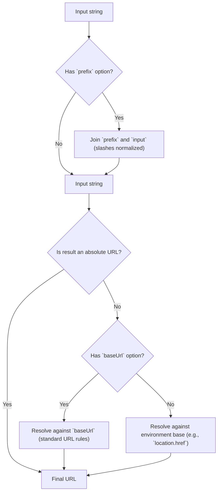
```mermaid
graph TD
    A[Input string] --> B{Has `prefix` option?};
    B -- Yes --> C["Join `prefix` and `input` (slashes normalized)"];
    B -- No --> D[Input string];
    C --> D;
    D --> E{Is result an absolute URL?};
    E -- No --> F{Has `baseUrl` option?};
    E -- Yes --> G[Final URL];
    F -- Yes --> H["Resolve against `baseUrl` (standard URL rules)"];
    F -- No --> I["Resolve against environment base (e.g., `location.href`)"];
    H --> G;
    I --> G;
```
*This diagram illustrates how `input`, `prefix`, and `baseUrl` are processed to construct the final request URL.*
Sources: [readme.md:221-274](https://github.com/sindresorhus/ky/blob/e0fcf780de2bd69af2528e4b7b87ccae6bb727b1/readme.md#L221-L274)

## Retry Mechanism

Ky can automatically retry failed requests. This behavior is configured via the `retry` option.

### Retry Configuration

The `retry` option can be a number (specifying the `limit`) or an object with the following properties:

| Property | Type | Default | Description |
| --- | --- | --- | --- |
| `limit` | `number` | `2` | Maximum number of retries. |
| `methods` | `string[]` | `['get', 'put', 'head', 'delete', 'options', 'trace']` | HTTP methods to retry on. |
| `statusCodes` | `number[]` | `[408, 413, 429, 500, 502, 503, 504]` | HTTP status codes that trigger a retry. |
| `afterStatusCodes` | `number[]` | `[413, 429, 503]` | Status codes that respect the `Retry-After` header. |
| `maxRetryAfter` | `number` | `Infinity` | Maximum delay in ms when respecting `Retry-After`. |
| `backoffLimit` | `number` | `Infinity` | Maximum backoff delay in ms between retries. |
| `delay` | `(attemptCount: number) => number` | Exponential backoff | Function to calculate the delay between retries. |
| `jitter` | `boolean \| (delay: number) => number` | `undefined` | Adds randomness to retry delays to prevent thundering herd issues. |
| `retryOnTimeout` | `boolean` | `false` | Whether to retry if the request times out. |
| `shouldRetry` | `(state: object) => boolean \| undefined` | `undefined` | A function for custom retry logic that overrides default checks. |

Sources: [readme.md:275-322](https://github.com/sindresorhus/ky/blob/e0fcf780de2bd69af2528e4b7b87ccae6bb727b1/readme.md#L275-L322)

### Retry Logic Flow

The decision to retry a failed request follows a specific sequence of checks.

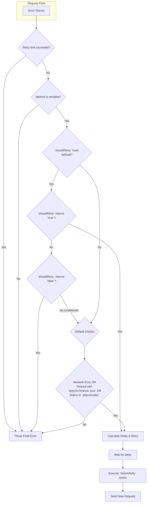
```mermaid
graph TD
    subgraph Request Fails
        A[Error Occurs]
    end
    A --> B{Retry limit exceeded?};
    B -- Yes --> C[Throw Final Error];
    B -- No --> D{Method is retriable?};
    D -- No --> C;
    D -- Yes --> E{`shouldRetry` hook defined?};
    E -- Yes --> F{`shouldRetry` returns `true`?};
    F -- Yes --> K[Calculate Delay & Retry];
    F -- No --> G{`shouldRetry` returns `false`?};
    G -- Yes --> C;
    G -- No (undefined) --> H{Default Checks};
    E -- No --> H;
    H --> I{"Network Error OR<br>Timeout with `retryOnTimeout: true` OR<br>Status in `statusCodes`"};
    I -- Yes --> K;
    I -- No --> C;
    K --> L[Wait for delay] --> M[Execute `beforeRetry` hooks] --> N[Send New Request];
```
*This flowchart shows the process Ky follows to determine whether a failed request should be retried.*
Sources: [readme.md:290-322](https://github.com/sindresorhus/ky/blob/e0fcf780de2bd69af2528e4b7b87ccae6bb727b1/readme.md#L290-L322)

## Request Lifecycle Hooks

Hooks allow for powerful modification and observation of the request/response lifecycle. They are defined in the `hooks` option object, where each key is an array of functions.

### Hooks Execution Order

The following diagram illustrates the sequence in which hooks are executed during a request that succeeds after one retry.

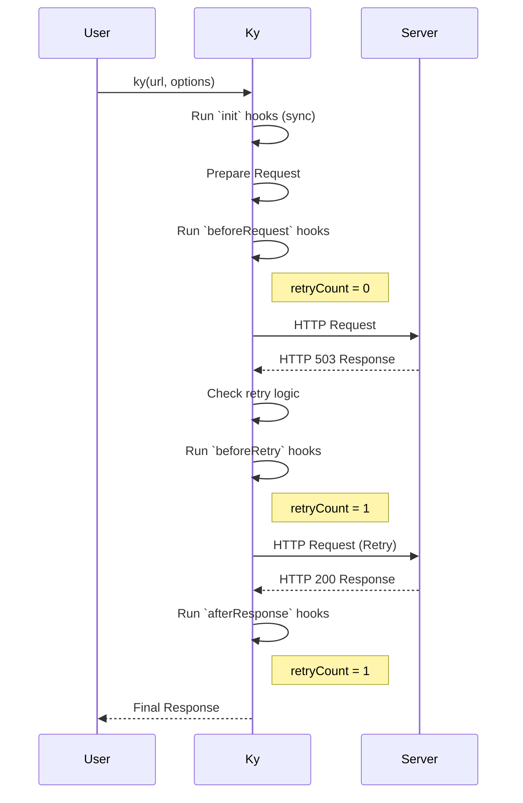
```mermaid
sequenceDiagram
    participant User
    participant Ky
    participant Server

    User->>Ky: ky(url, options)
    Ky->>Ky: Run `init` hooks (sync)
    Ky->>Ky: Prepare Request
    Ky->>Ky: Run `beforeRequest` hooks
    Note right of Ky: retryCount = 0
    Ky->>Server: HTTP Request
    Server-->>Ky: HTTP 503 Response
    Ky->>Ky: Check retry logic
    Ky->>Ky: Run `beforeRetry` hooks
    Note right of Ky: retryCount = 1
    Ky->>Server: HTTP Request (Retry)
    Server-->>Ky: HTTP 200 Response
    Ky->>Ky: Run `afterResponse` hooks
    Note right of Ky: retryCount = 1
    Ky-->>User: Final Response
```
*This sequence diagram shows the execution order of hooks for a request that is retried once.*
Sources: [readme.md:442-447](https://github.com/sindresorhus/ky/blob/e0fcf780de2bd69af2528e4b7b87ccae6bb727b1/readme.md#L442-L447)

### Hooks Summary

| Hook | When It Runs | Parameters | Can Return/Modify |
| --- | --- | --- | --- |
| `init` | Before the `Request` object is created. Synchronous. | `options` | Modifies the `options` object in place. |
| `beforeRequest` | Before the initial request is sent. | `request`, `options`, `retryCount` (is 0) | A new `Request` to replace the original, or a `Response` to skip the network call. |
| `beforeRetry` | Before a retry attempt is sent. | `request`, `options`, `error`, `retryCount` (is >= 1) | A new `Request` for the retry, a `Response` to skip the retry, or `ky.stop` to abort. |
| `beforeError` | Before any error (`HTTPError`, `TimeoutError`, etc.) is thrown. | `request`, `options`, `error`, `retryCount` | A new `Error` instance to be thrown instead. |
| `afterResponse` | After a successful response is received. | `request`, `options`, `response`, `retryCount` | A new `Response` to replace the original, or `ky.retry()` to force a retry. |

Sources: [readme.md:449-718](https://github.com/sindresorhus/ky/blob/e0fcf780de2bd69af2528e4b7b87ccae6bb727b1/readme.md#L449-L718)

## Error Handling

Ky defines a set of custom error classes to provide detailed information when requests fail. All Ky-specific errors extend the base `KyError` class, except for `SchemaValidationError`.

| Error Class | Thrown When... | Key Properties |
| --- | --- | --- |
| `HTTPError` | Response status is non-2xx (and `throwHttpErrors` is `true`). | `response`, `request`, `options`, `data` (pre-parsed body) |
| `NetworkError` | A network-level error occurs (e.g., DNS failure, connection refused). | `request`, `cause` (original error) |
| `TimeoutError` | The request exceeds the `timeout` or `totalTimeout` duration. | `request` |
| `SchemaValidationError` | Response body validation fails against a provided Standard Schema. | `issues` (validation issues) |
| `ForceRetryError` | A retry is triggered via `ky.retry()` from an `afterResponse` hook. | `request`, `options` |

Sources: [readme.md:1218-1342](https://github.com/sindresorhus/ky/blob/e0fcf780de2bd69af2528e4b7b87ccae6bb727b1/readme.md#L1218-L1342)

## Installation and Support

Ky can be installed via npm and is designed for modern environments.

```sh
npm install ky
```
Sources: [readme.md:60-62](https://github.com/sindresorhus/ky/blob/e0fcf780de2bd69af2528e4b7b87ccae6bb727b1/readme.md#L60-L62)

*   **Node.js Support**: Version 22 and later.
*   **Browser Support**: The latest versions of Chrome, Firefox, and Safari.

Sources: [package.json:21-23](https://github.com/sindresorhus/ky/blob/e0fcf780de2bd69af2528e4b7b87ccae6bb727b1/package.json#L21-L23), [readme.md:1852-1857](https://github.com/sindresorhus/ky/blob/e0fcf780de2bd69af2528e4b7b87ccae6bb727b1/readme.md#L1852-L1857)

# Page: Installation and Basic Usage

<details>
<summary>Relevant source files</summary>

The following files were used as context for generating this wiki page:

- [readme.md](https://github.com/sindresorhus/ky/blob/e0fcf780de2bd69af2528e4b7b87ccae6bb727b1/readme.md)
- [source/index.ts](https://github.com/sindresorhus/ky/blob/e0fcf780de2bd69af2528e4b7b87ccae6bb727b1/source/index.ts)
</details>

# Installation and Basic Usage

Ky is a lightweight and elegant HTTP client built upon the native Fetch API. It is designed for modern environments like browsers, Node.js, Deno, and Bun, offering a simplified API and powerful features over plain `fetch`. Key benefits include intuitive method shortcuts, automatic error handling for non-2xx status codes, request retries, timeout support, and a streamlined JSON workflow.

This document covers the installation process and the fundamental concepts required to start making requests with Ky. For more advanced topics, refer to the documentation on [Hooks](#hooks) and [Retries](#retry).

Sources: [readme.md:34-57](https://github.com/sindresorhus/ky/blob/e0fcf780de2bd69af2528e4b7b87ccae6bb727b1/readme.md#L34-L57)

## Installation

Ky can be installed via npm for use in Node.js or bundled web applications. It is also available through various CDNs for direct use in browsers or Deno.

### npm

To install Ky in your project, run the following command:

```sh
npm install ky
```

Sources: [readme.md:60-62](https://github.com/sindresorhus/ky/blob/e0fcf780de2bd69af2528e4b7b87ccae6bb727b1/readme.md#L60-L62)

### CDN

For direct browser usage or Deno, you can import Ky from a CDN like jsdelivr, unpkg, or esm.sh.

*   **jsdelivr**: `https://cdn.jsdelivr.net/npm/ky/+esm`
*   **unpkg**: `https://unpkg.com/ky`
*   **esm.sh**: `https://esm.sh/ky`

Example for Deno:
```js
import ky from 'https://esm.sh/ky';
```

Sources: [readme.md:67-71](https://github.com/sindresorhus/ky/blob/e0fcf780de2bd69af2528e4b7b87ccae6bb727b1/readme.md#L67-L71), [readme.md:107-111](https://github.com/sindresorhus/ky/blob/e0fcf780de2bd69af2528e4b7b87ccae6bb727b1/readme.md#L107-L111)

## Basic Usage

The primary export of the `ky` package is a function that can be used to make HTTP requests. It takes the same `input` (URL) and `options` as the standard `fetch` API, but provides a more convenient interface.

The following diagram illustrates the basic flow of a `ky` request.

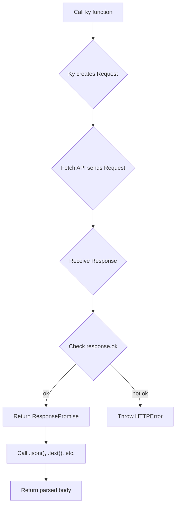
```mermaid
graph TD
    A[Call ky function] --> B{Ky creates Request};
    B --> C{Fetch API sends Request};
    C --> D{Receive Response};
    D --> E{Check response.ok};
    E -- ok --> F[Return ResponsePromise];
    E -- not ok --> G[Throw HTTPError];
    F --> H["Call .json(), .text(), etc."];
    H --> I[Return parsed body];
```
Sources: [readme.md:115-120](https://github.com/sindresorhus/ky/blob/e0fcf780de2bd69af2528e4b7b87ccae6bb727b1/readme.md#L115-L120)

### Making a Request

A simple `POST` request with a JSON body can be made as follows:

```js
import ky from 'ky';

const json = await ky.post('https://example.com', {json: {foo: true}}).json();

console.log(json);
//=> {data: '🦄'}
```

This is significantly more concise than the equivalent code using plain `fetch`, which would require manual JSON stringification, header configuration, and status code checking.

Sources: [readme.md:75-105](https://github.com/sindresorhus/ky/blob/e0fcf780de2bd69af2528e4b7b87ccae6bb727b1/readme.md#L75-L105)

### Response Handling

The `ky()` function returns a `Response` object augmented with convenient body parsing methods like `.json()`, `.text()`, `.blob()`, etc. These methods can be called directly on the returned promise, and unlike `fetch`, they will automatically throw an `HTTPError` if the response status is not in the 200-299 range.

```js
import ky from 'ky';

// The .json() method parses the response body as JSON.
const user = await ky('/api/user').json();

console.log(user);
```

Sources: [readme.md:119-129](https://github.com/sindresorhus/ky/blob/e0fcf780de2bd69af2528e4b7b87ccae6bb727b1/readme.md#L119-L129)

### TypeScript Support

Ky provides strong TypeScript support. The `.json()` method can be used with generics to get a typed response body.

```ts
import ky from 'ky';

interface User {
  name: string;
  email: string;
}

// user is of type User
const user = await ky<User>('/api/users/1').json();

// Alternatively, type the .json() call
const user2 = await ky('/api/users/2').json<User>();
```

Additionally, you can validate the response against a [Standard Schema](https://standardschema.dev) compatible validator (like Zod). This will throw a `SchemaValidationError` if the response body does not match the schema.

```ts
import ky, {SchemaValidationError} from 'ky';
import {z} from 'zod';

const userSchema = z.object({name: z.string()});

try {
	const user = await ky('/api/user').json(userSchema);
	console.log(user.name);
} catch (error) {
	if (error instanceof SchemaValidationError) {
		console.error(error.issues);
	}
}
```

Sources: [readme.md:131-162](https://github.com/sindresorhus/ky/blob/e0fcf780de2bd69af2528e4b7b87ccae6bb727b1/readme.md#L131-L162), [source/index.ts:65-68](https://github.com/sindresorhus/ky/blob/e0fcf780de2bd69af2528e4b7b87ccae6bb727b1/source/index.ts#L65-L68)

## Method Shortcuts

For convenience, Ky provides shortcuts for common HTTP methods. These functions automatically set the `method` option.

| Method Shortcut         | HTTP Method |
| ----------------------- | ----------- |
| `ky.get(input, options?)`    | `GET`       |
| `ky.post(input, options?)`   | `POST`      |
| `ky.put(input, options?)`    | `PUT`       |
| `ky.patch(input, options?)`  | `PATCH`     |
| `ky.head(input, options?)`   | `HEAD`      |
| `ky.delete(input, options?)` | `DELETE`    |

These shortcuts are created in the main entry point of the library.

Sources: [readme.md:170-177](https://github.com/sindresorhus/ky/blob/e0fcf780de2bd69af2528e4b7b87ccae6bb727b1/readme.md#L170-L177), [source/index.ts:14-17](https://github.com/sindresorhus/ky/blob/e0fcf780de2bd69af2528e4b7b87ccae6bb727b1/source/index.ts#L14-L17)

## Common Options

Ky extends the standard `fetch` options with several of its own for added functionality.

| Option         | Type                                                              | Description                                                                                             |
| -------------- | ----------------------------------------------------------------- | ------------------------------------------------------------------------------------------------------- |
| `json`         | `object`                                                          | Shortcut for sending a JSON request body. Automatically stringifies the object and sets the correct header. |
| `searchParams` | `string \| object \| URLSearchParams`                             | Search parameters to be added to the request URL.                                                       |
| `baseUrl`      | `string \| URL`                                                   | A base URL to resolve relative `input` URLs against, following standard URL resolution rules.         |
| `prefix`       | `string \| URL`                                                   | A prefix to prepend to the `input` URL before resolution. A leading slash in `input` is ignored.      |
| `timeout`      | `number \| false`                                                 | Per-attempt timeout in milliseconds. Default is `10000`.                                                |
| `throwHttpErrors` | `boolean \| (status: number) => boolean`                       | If `true` (default), throws `HTTPError` for non-2xx responses.                                          |

Sources: [readme.md:193-209, 210-219, 221-269, 410-418, 720-734]()

## Error Handling

A key feature of Ky is its automatic handling of non-successful HTTP responses. If a response has a status code outside the 2xx range, Ky rejects the promise with an `HTTPError`.

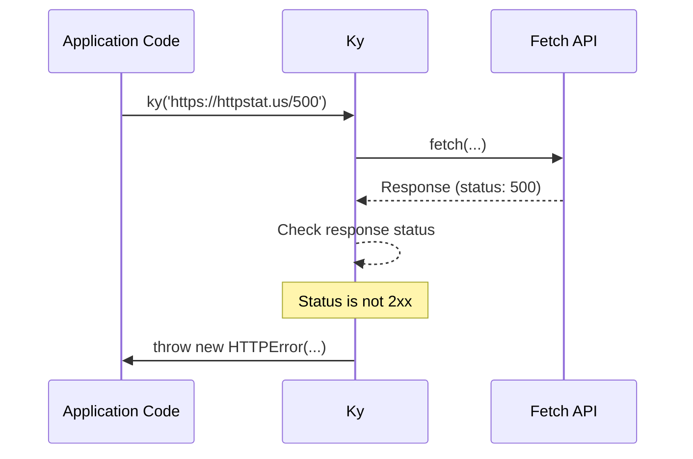
```mermaid
sequenceDiagram
    participant App as Application Code
    participant Ky
    participant Fetch as Fetch API

    App->>Ky: ky('https://httpstat.us/500')
    Ky->>Fetch: fetch(...)
    Fetch-->>Ky: Response (status: 500)
    Ky-->>Ky: Check response status
    Note over Ky: Status is not 2xx
    Ky->>App: throw new HTTPError(...)
```

The `HTTPError` instance contains the original `request` and `response` objects, allowing for detailed error inspection. It also includes a `data` property with the pre-parsed response body (if available).

```js
import ky, {isHTTPError} from 'ky';

try {
	await ky.get('https://example.com/non-existent-page');
} catch (error) {
	if (isHTTPError(error)) {
        // Access the response object
		console.error(`Fetch error: ${error.response.statusText}`);

        // Access the pre-parsed response body
        console.log(error.data);
	}
}
```

Other Ky-specific errors include:
-   `NetworkError`: For network-level failures (e.g., DNS, connection refused).
-   `TimeoutError`: When a request exceeds the configured `timeout`.
-   `SchemaValidationError`: When response body validation fails.

Sources: [readme.md:47](https://github.com/sindresorhus/ky/blob/e0fcf780de2bd69af2528e4b7b87ccae6bb727b1/readme.md#L47), [readme.md:1239-1260](https://github.com/sindresorhus/ky/blob/e0fcf780de2bd69af2528e4b7b87ccae6bb727b1/readme.md#L1239-L1260), [source/index.ts:71-83](https://github.com/sindresorhus/ky/blob/e0fcf780de2bd69af2528e4b7b87ccae6bb727b1/source/index.ts#L71-L83)

## Creating Instances

Ky allows you to create new instances with custom default options, which is useful for creating specialized API clients.

### `ky.create(defaultOptions)`

This function creates a completely new `ky` instance with its own set of defaults, without inheriting from any parent.

```js
import ky from 'ky';

const api = ky.create({baseUrl: 'https://example.com/api/'});

// Makes a request to 'https://example.com/api/users/123'
const user = await api.get('users/123').json();
```

Sources: [readme.md:1026-1039](https://github.com/sindresorhus/ky/blob/e0fcf780de2bd69af2528e4b7b87ccae6bb727b1/readme.md#L1026-L1039), [source/index.ts:19](https://github.com/sindresorhus/ky/blob/e0fcf780de2bd69af2528e4b7b87ccae6bb727b1/source/index.ts#L19)

### `ky.extend(defaultOptions)`

This function creates a new `ky` instance that inherits and merges defaults from its parent instance. This is ideal for creating more specific clients from a base client.

```js
import ky from 'ky';

const api = ky.create({prefix: 'https://example.com/api'});

// `usersApi` inherits the prefix from `api` and adds to it.
const usersApi = api.extend({prefix: `${api.defaults.options.prefix}/users`});

// Makes a request to 'https://example.com/api/users/123'
const response = await usersApi.get('123');
```

The relationship between these methods can be visualized as follows:

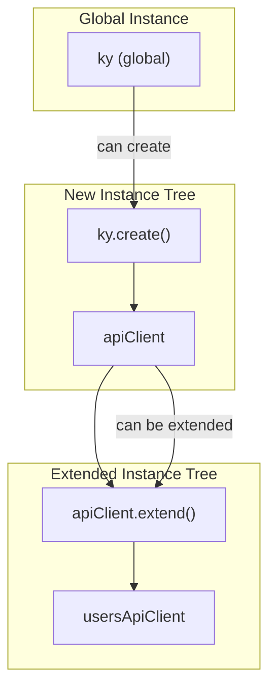
```mermaid
graph TD
    subgraph "Global Instance"
        A["ky (global)"]
    end

    subgraph "New Instance Tree"
        B["ky.create()"] --> C[apiClient]
    end

    subgraph "Extended Instance Tree"
        C --> D["apiClient.extend()"]
        D --> E[usersApiClient]
    end

    A -- can create --> B
    C -- can be extended --> D
```

Sources: [readme.md:940-1004](https://github.com/sindresorhus/ky/blob/e0fcf780de2bd69af2528e4b7b87ccae6bb727b1/readme.md#L940-L1004), [source/index.ts:20-26](https://github.com/sindresorhus/ky/blob/e0fcf780de2bd69af2528e4b7b87ccae6bb727b1/source/index.ts#L20-L26)

# Page: Request Lifecycle and Architecture

<details>
<summary>Relevant source files</summary>

The following files were used as context for generating this wiki page:

- [source/core/Ky.ts](https://github.com/sindresorhus/ky/blob/e0fcf780de2bd69af2528e4b7b87ccae6bb727b1/source/core/Ky.ts)
- [source/index.ts](https://github.com/sindresorhus/ky/blob/e0fcf780de2bd69af2528e4b7b87ccae6bb727b1/source/index.ts)
- [source/core/constants.ts](https://github.com/sindresorhus/ky/blob/e0fcf780de2bd69af2528e4b7b87ccae6bb727b1/source/core/constants.ts)
</details>

# Request Lifecycle and Architecture

The `ky` library is a powerful HTTP client based on the native `fetch` API. It enhances `fetch` by providing a more convenient and feature-rich interface, including a sophisticated request lifecycle with hooks, automatic retries, and streamlined error handling. This document details the internal architecture and the step-by-step flow of a request from its creation to the final response or error.

The entire lifecycle is managed within the `Ky` class. A request is initiated via the static `Ky.create` method, which orchestrates option processing, hook execution, the actual fetch call, retry logic, and response parsing.

## Request Initialization

The lifecycle begins when a `ky` instance is called. This can be the default instance or one created with `ky.create()` or `ky.extend()`.

Sources: [source/index.ts:10-32](https://github.com/sindresorhus/ky/blob/e0fcf780de2bd69af2528e4b7b87ccae6bb727b1/source/index.ts#L10-L32)

### Option Merging and Normalization

When a request is made, `ky` merges default options, instance-specific options, and per-request options. This process is handled by `validateAndMerge`. The `Ky` class constructor then takes these merged options and performs normalization to create a consistent internal configuration.

Key normalization steps include:
- Merging headers from a `Request` input with user-provided headers (`source/core/Ky.ts:372`).
- Merging hook definitions (`source/core/Ky.ts:373`).
- Normalizing the HTTP method to uppercase (`source/core/Ky.ts:374`).
- Processing `prefix` and `baseUrl` options to construct the final URL (`source/core/Ky.ts:389-406`).
- Normalizing `retry` options into a consistent object structure (`source/core/Ky.ts:377`).
- Setting default values for `throwHttpErrors` (true) and `timeout` (10,000ms) (`source/core/Ky.ts:378-379`).
- Serializing the `json` option into the request `body` and setting the `Content-Type` header (`source/core/Ky.ts:419-422`).

### Request Object Creation

After normalizing options, a standard `Request` object is created. This object encapsulates the URL, method, headers, and body. If `searchParams` are provided, the URL is modified, and the `Request` object is recreated with the new URL (`source/core/Ky.ts:437-476`). This `Request` instance is stored as `this.request` and is used throughout the lifecycle.

## Core Execution Flow

The main logic resides within the `Ky.create` static method and its inner `async` function. This function controls the execution of hooks, fetching, retries, and error handling.

The following diagram illustrates the high-level sequence of a successful request.

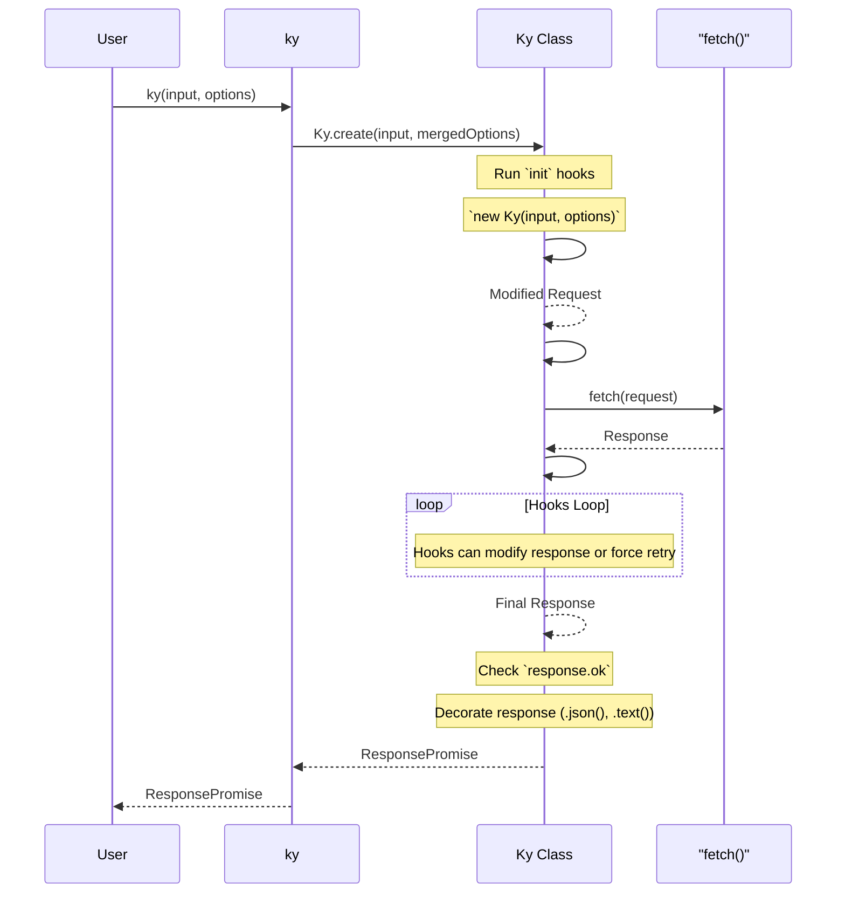
```mermaid
sequenceDiagram
    participant User
    participant ky
    participant KyClass as Ky Class
    participant FetchAPI as "fetch()"

    User->>ky: ky(input, options)
    ky->>KyClass: Ky.create(input, mergedOptions)
    Note over KyClass: Run `init` hooks
    Note over KyClass: `new Ky(input, options)`
    KyClass->>KyClass: #runBeforeRequestHooks()
    KyClass-->>KyClass: Modified Request
    KyClass->>KyClass: #retry() -> #fetch()
    KyClass->>FetchAPI: fetch(request)
    FetchAPI-->>KyClass: Response
    KyClass->>KyClass: #runAfterResponseHooks(response)
    loop Hooks Loop
        Note over KyClass: Hooks can modify response or force retry
    end
    KyClass-->>KyClass: Final Response
    Note over KyClass: Check `response.ok`
    Note over KyClass: Decorate response (.json(), .text())
    KyClass-->>ky: ResponsePromise
    ky-->>User: ResponsePromise
```
Sources: [source/core/Ky.ts:143-253](https://github.com/sindresorhus/ky/blob/e0fcf780de2bd69af2528e4b7b87ccae6bb727b1/source/core/Ky.ts#L143-L253)

## Hooks System

Hooks allow users to tap into the request lifecycle at key stages. They are defined in the `hooks` option and are executed in a specific order.

| Hook              | Trigger                                                                  | Purpose                                                                                                                                                             |
| ----------------- | ------------------------------------------------------------------------ | ------------------------------------------------------------------------------------------------------------------------------------------------------------------- |
| `init`            | Before the `Ky` instance is created.                                     | Modify options for a single request. Executed only once. `Sources: [source/core/Ky.ts:144-149](https://github.com/sindresorhus/ky/blob/e0fcf780de2bd69af2528e4b7b87ccae6bb727b1/source/core/Ky.ts#L144-L149)`                                                                    |
| `beforeRequest`   | Before the request is sent.                                              | Modify the `Request` object. Can return a `Response` to bypass the fetch entirely. `Sources: [source/core/Ky.ts:767-784](https://github.com/sindresorhus/ky/blob/e0fcf780de2bd69af2528e4b7b87ccae6bb727b1/source/core/Ky.ts#L767-L784)`                                            |
| `afterResponse`   | After a response is received, before it's processed for errors.          | Modify the `Response`. Can trigger a forced retry by returning `ky.retry()`. Runs in a loop until all hooks are processed. `Sources: [source/core/Ky.ts:786-842](https://github.com/sindresorhus/ky/blob/e0fcf780de2bd69af2528e4b7b87ccae6bb727b1/source/core/Ky.ts#L786-L842)` |
| `beforeRetry`     | Before a retry attempt is made after a delay.                            | Modify the `Request` for the next attempt, inspect the error, or stop the retry process by returning `ky.stop`. `Sources: [source/core/Ky.ts:886-922](https://github.com/sindresorhus/ky/blob/e0fcf780de2bd69af2528e4b7b87ccae6bb727b1/source/core/Ky.ts#L886-L922)`              |
| `beforeError`     | After all retries are exhausted and just before an error is thrown.      | Modify the final `Error` object that will be thrown to the caller. `Sources: [source/core/Ky.ts:270-285](https://github.com/sindresorhus/ky/blob/e0fcf780de2bd69af2528e4b7b87ccae6bb727b1/source/core/Ky.ts#L270-L285)`                                                              |

## Retry and Error Handling

`ky` provides a robust retry mechanism for transient network errors and specific HTTP status codes.

### Retry Logic

The decision to retry a failed request is handled by the `#calculateRetryDelay` method. A retry is triggered by a `NetworkError`, `TimeoutError`, a `HTTPError` with a retriable status code, or a `ForceRetryError` from an `afterResponse` hook.

The logic follows these steps:
1.  Check if the retry limit (`retry.limit`) has been exceeded. If so, the original error is thrown.
2.  If the error is a `ForceRetryError`, the retry is automatically approved.
3.  For other errors, it checks if the request method is in the allowed `retry.methods` list.
4.  The `retry.shouldRetry` function, if provided, is executed and can override the default behavior.
5.  Default checks are performed for timeout errors (`retry.retryOnTimeout`) and HTTP status codes (`retry.statusCodes`).
6.  If the response contains a `Retry-After` header and the status code is in `retry.afterStatusCodes`, `ky` will respect the server-specified delay.

Sources: [source/core/Ky.ts:504-590](https://github.com/sindresorhus/ky/blob/e0fcf780de2bd69af2528e4b7b87ccae6bb727b1/source/core/Ky.ts#L504-L590)

This flowchart visualizes the decision process within `#calculateRetryDelay`.

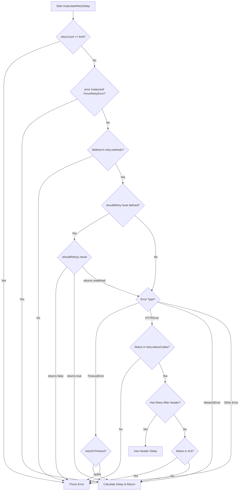
```mermaid
graph TD
    A["Start #calculateRetryDelay"] --> B{"retryCount >= limit?"};
    B -- Yes --> C[Throw Error];
    B -- No --> D{"error instanceof ForceRetryError?"};
    D -- Yes --> E[Calculate Delay & Return];
    D -- No --> F{"Method in retry.methods?"};
    F -- No --> C;
    F -- Yes --> G{"shouldRetry hook defined?"};
    G -- Yes --> H{"shouldRetry() result"};
    H -- returns false --> C;
    H -- returns true --> E;
    H -- returns undefined --> I{Error Type?};
    G -- No --> I;
    I -- TimeoutError --> J{"retryOnTimeout?"};
    J -- Yes --> E;
    J -- No --> C;
    I -- HTTPError --> K{"Status in retry.statusCodes?"};
    K -- No --> C;
    K -- Yes --> L{"Has Retry-After header?"};
    L -- Yes --> M[Use Header Delay];
    L -- No --> N{"Status is 413?"};
    N -- Yes --> C;
    N -- No --> E;
    I -- NetworkError --> E;
    I -- Other Error --> C;
```

### Forced Retries

An `afterResponse` hook can programmatically trigger a retry, even on a successful response (e.g., status 200). This is useful for handling API-specific error formats within a JSON body. This is achieved by returning `ky.retry()`.

1.  The `ky.retry()` function returns a `RetryMarker` instance (`source/core/constants.ts:244`).
2.  The main `afterResponse` loop detects this marker and throws a `ForceRetryError` (`source/core/Ky.ts:812-821`).
3.  This error is caught by the retry handler, which then initiates the retry process.

### Error Handling

If a request ultimately fails after all retries, an error is thrown.
- **`HTTPError`**: Thrown for non-successful HTTP responses (e.g., 4xx, 5xx), if `throwHttpErrors` is `true`. It contains the `request` and `response` objects.
- **`NetworkError`**: Thrown for network-level issues, such as a DNS failure or dropped connection.
- **`TimeoutError`**: Thrown if the request exceeds the configured `timeout` or `totalTimeout`.
- **`SchemaValidationError`**: Thrown if response JSON validation against a provided schema fails.

Before any error is thrown to the user, the `beforeError` hooks are executed, allowing for last-minute error modification or logging (`source/core/Ky.ts:256-288`).

## Response Processing

Once a final, successful `Response` is obtained, it is returned to the user as a `ResponsePromise`.

### ResponsePromise and Body Parsing

The returned `ResponsePromise` is augmented with convenience methods for parsing the response body, such as `.json()`, `.text()`, and `.blob()`. When one of these methods is called:
1.  The `Accept` header on the original request is set to the appropriate MIME type (e.g., `application/json`) (`source/core/Ky.ts:311`).
2.  The `ResponsePromise` resolves to the `Response` object.
3.  The corresponding body-parsing method (e.g., `response.json()`) is called.

For JSON parsing, `ky` allows a custom `parseJson` function to be provided in the options (`source/core/Ky.ts:328-330`).

### Schema Validation

If the `.json()` method is called with a `schema` argument, the parsed JSON value is validated against that schema using the `validateJsonWithSchema` function before being returned. If validation fails, a `SchemaValidationError` is thrown.

Sources: [source/core/Ky.ts:112-140](https://github.com/sindresorhus/ky/blob/e0fcf780de2bd69af2528e4b7b87ccae6bb727b1/source/core/Ky.ts#L112-L140), [source/core/Ky.ts:332](https://github.com/sindresorhus/ky/blob/e0fcf780de2bd69af2528e4b7b87ccae6bb727b1/source/core/Ky.ts#L332)

### Progress Events

`ky` supports progress events for both uploads and downloads.
- **`onUploadProgress`**: If provided, the request body is streamed to monitor its progress. This requires an environment that supports request streams (`source/core/Ky.ts:1035-1041`).
- **`onDownloadProgress`**: If provided, the response body is consumed as a stream to report download progress. The original response is cloned to enable this (`source/core/Ky.ts:238-250`).

# Page: Options and Configuration

<details>
<summary>Relevant source files</summary>

The following files were used as context for generating this wiki page:

- [source/types/options.ts](https://github.com/sindresorhus/ky/blob/e0fcf780de2bd69af2528e4b7b87ccae6bb727b1/source/types/options.ts)
- [source/utils/options.ts](https://github.com/sindresorhus/ky/blob/e0fcf780de2bd69af2528e4b7b87ccae6bb727b1/source/utils/options.ts)
- [readme.md](https://github.com/sindresorhus/ky/blob/e0fcf780de2bd69af2528e4b7b87ccae6bb727b1/readme.md)
- [source/types/common.ts](https://github.com/sindresorhus/ky/blob/e0fcf780de2bd69af2528e4b7b87ccae6bb727b1/source/types/common.ts)
- [source/types/ky.ts](https://github.com/sindresorhus/ky/blob/e0fcf780de2bd69af2528e4b7b87ccae6bb727b1/source/types/ky.ts)
- [source/types/request.ts](https://github.com/sindresorhus/ky/blob/e0fcf780de2bd69af2528e4b7b87ccae6bb727b1/source/types/request.ts)
- [source/types/response.ts](https://github.com/sindresorhus/ky/blob/e0fcf780de2bd69af2528e4b7b87ccae6bb727b1/source/types/response.ts)
- [source/utils/delay.ts](https://github.com/sindresorhus/ky/blob/e0fcf780de2bd69af2528e4b7b87ccae6bb727b1/source/utils/delay.ts)
- [source/utils/is-network-error.ts](https://github.com/sindresorhus/ky/blob/e0fcf780de2bd69af2528e4b7b87ccae6bb727b1/source/utils/is-network-error.ts)
- [source/utils/is.ts](https://github.com/sindresorhus/ky/blob/e0fcf780de2bd69af2528e4b7b87ccae6bb727b1/source/utils/is.ts)
- [source/utils/type-guards.ts](https://github.com/sindresorhus/ky/blob/e0fcf780de2bd69af2528e4b7b87ccae6bb727b1/source/utils/type-guards.ts)
- [source/utils/types.ts](https://github.com/sindresorhus/ky/blob/e0fcf780de2bd69af2528e4b7b87ccae6bb727b1/source/utils/types.ts)
</details>
# Options and Configuration

The `ky` library extends the standard Fetch API by providing a powerful and flexible options object to control request behavior. These options simplify common tasks such as handling JSON, managing retries and timeouts, and instrumenting the request lifecycle with hooks. Configuration can be applied on a per-request basis or used to create customized `ky` instances with default settings using `ky.create()` and `ky.extend()`.

The primary interface for configuration is `Options`, which merges standard `RequestInit` properties with custom features defined in `KyOptions`. This allows for a seamless and enhanced development experience over using `fetch` directly.

Sources: [source/types/options.ts:399-443](https://github.com/sindresorhus/ky/blob/e0fcf780de2bd69af2528e4b7b87ccae6bb727b1/source/types/options.ts#L399-L443), [source/types/ky.ts:72-111](https://github.com/sindresorhus/ky/blob/e0fcf780de2bd69af2528e4b7b87ccae6bb727b1/source/types/ky.ts#L72-L111)

## Core Option Types

`ky` defines several key types for handling options at different stages of the request lifecycle.

*   **`KyOptions`**: This type contains all the custom options that `ky` adds on top of the standard `fetch` options. It includes features like `json`, `retry`, `hooks`, `timeout`, and `baseUrl`.
    Sources: [source/types/options.ts:40-387](https://github.com/sindresorhus/ky/blob/e0fcf780de2bd69af2528e4b7b87ccae6bb727b1/source/types/options.ts#L40-L387)
*   **`Options`**: This is the main configuration object that developers interact with. It extends `KyOptions` and `RequestInit` (the standard `fetch` options), providing a single interface for all possible settings. It redefines `headers` to allow for more flexible input types.
    Sources: [source/types/options.ts:399-443](https://github.com/sindresorhus/ky/blob/e0fcf780de2bd69af2528e4b7b87ccae6bb727b1/source/types/options.ts#L399-L443)
*   **`InternalOptions` and `NormalizedOptions`**: These types are used internally by `ky`. `InternalOptions` represents the state after initial defaults are merged, while `NormalizedOptions` represents the final, fully resolved options that are passed to the `fetch` call and hooks.
    Sources: [source/types/options.ts:445-472](https://github.com/sindresorhus/ky/blob/e0fcf780de2bd69af2528e4b7b87ccae6bb727b1/source/types/options.ts#L445-L472)

## URL and Request Body

These options control the request's destination URL and its body content.

### `baseUrl` and `prefix`

`ky` provides two options for modifying the request URL, which behave differently:

*   **`baseUrl`**: Resolves the input URL against a base URL, following standard browser URL resolution rules. If the input URL starts with a `/`, it is treated as root-relative and replaces the entire path of the `baseUrl`.
*   **`prefix`**: Prepends a string to the input URL before it is resolved against the `baseUrl`. This is useful for treating root-relative inputs (e.g., `/users`) as page-relative, as the leading slash is effectively ignored.

In most cases, `baseUrl` is the recommended option as it aligns with web standards.

Sources: [source/types/options.ts:142-168](https://github.com/sindresorhus/ky/blob/e0fcf780de2bd69af2528e4b7b87ccae6bb727b1/source/types/options.ts#L142-L168), [readme.md:221-274](https://github.com/sindresorhus/ky/blob/e0fcf780de2bd69af2528e4b7b87ccae6bb727b1/readme.md#L221-L274), [readme.md:1660-1685](https://github.com/sindresorhus/ky/blob/e0fcf780de2bd69af2528e4b7b87ccae6bb727b1/readme.md#L1660-L1685)

### `searchParams`

This option allows for easy addition of URL query parameters. It accepts a string, an object, an array of arrays, or a `URLSearchParams` instance. When an object is provided, a value of `undefined` will remove the parameter.

Sources: [source/types/options.ts:118](https://github.com/sindresorhus/ky/blob/e0fcf780de2bd69af2528e4b7b87ccae6bb727b1/source/types/options.ts#L118), [source/types/options.ts:9](https://github.com/sindresorhus/ky/blob/e0fcf780de2bd69af2528e4b7b87ccae6bb727b1/source/types/options.ts#L9), [readme.md:210-220](https://github.com/sindresorhus/ky/blob/e0fcf780de2bd69af2528e4b7b87ccae6bb727b1/readme.md#L210-L220)

### `json`

A shortcut for sending a JSON request body. When this option is used, `ky` automatically stringifies the provided value, sets the `Content-Type` header to `application/json`, and places the result in the request `body`.

Sources: [source/types/options.ts:46](https://github.com/sindresorhus/ky/blob/e0fcf780de2bd69af2528e4b7b87ccae6bb727b1/source/types/options.ts#L46), [readme.md:204-209](https://github.com/sindresorhus/ky/blob/e0fcf780de2bd69af2528e4b7b87ccae6bb727b1/readme.md#L204-L209)

## Retries and Timeouts

`ky` includes robust mechanisms for handling transient network failures and slow responses through automatic retries and configurable timeouts.

### Retry Mechanism

The `retry` option configures how `ky` handles failed requests. It can be a number (specifying the `limit`) or an object with detailed settings. Network errors are automatically retried for idempotent HTTP methods.

The following table details the available `retry` options:

| Option           | Type                               | Default                                                              | Description                                                                                                                                                             |
| ---------------- | ---------------------------------- | -------------------------------------------------------------------- | ----------------------------------------------------------------------------------------------------------------------------------------------------------------------- |
| `limit`          | `number`                           | `2`                                                                  | The maximum number of retries.                                                                                                                                          |
| `methods`        | `string[]`                         | `['get', 'put', 'head', 'delete', 'options', 'trace']`                 | HTTP methods that are allowed to be retried.                                                                                                                            |
| `statusCodes`    | `number[]`                         | `[408, 413, 429, 500, 502, 503, 504]`                                 | HTTP status codes that should trigger a retry.                                                                                                                          |
| `afterStatusCodes` | `number[]`                         | `[413, 429, 503]`                                                    | HTTP status codes that respect the `Retry-After` header.                                                                                                                |
| `maxRetryAfter`  | `number`                           | `Infinity`                                                           | The maximum time to wait for a `Retry-After` header, in milliseconds.                                                                                                   |
| `backoffLimit`   | `number`                           | `Infinity`                                                           | The upper limit for the exponential backoff delay, in milliseconds.                                                                                                     |
| `delay`          | `(attemptCount: number) => number` | `attemptCount => 0.3 * (2 ** (attemptCount - 1)) * 1000`             | A function to calculate the delay between retries.                                                                                                                      |
| `jitter`         | `boolean \| (delay: number) => number` | `undefined`                                                          | Adds random jitter to retry delays to prevent thundering herd problems. `true` uses full jitter.                                                                        |
| `retryOnTimeout` | `boolean`                          | `false`                                                              | Whether to retry a request if it times out.                                                                                                                             |
| `shouldRetry`    | `(state: ShouldRetryState) => boolean \| undefined` | `undefined`                                                          | A function for custom retry logic that overrides default checks. Return `true` to force retry, `false` to prevent, or `undefined` to use default logic. |

Sources: [source/types/options.ts:194](https://github.com/sindresorhus/ky/blob/e0fcf780de2bd69af2528e4b7b87ccae6bb727b1/source/types/options.ts#L194), [readme.md:275-402](https://github.com/sindresorhus/ky/blob/e0fcf780de2bd69af2528e4b7b87ccae6bb727b1/readme.md#L275-L402)

The diagram below illustrates the general flow of a request with retry logic enabled.

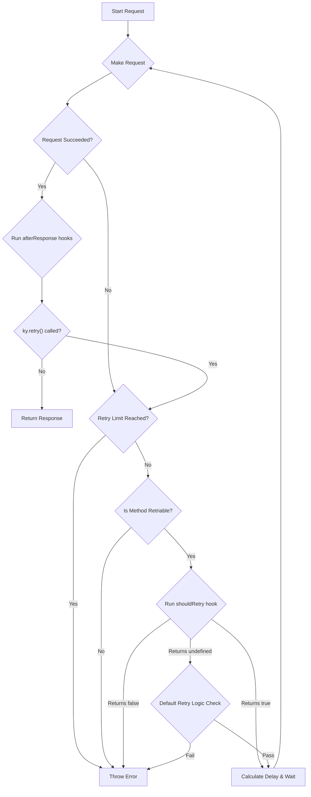
```mermaid
graph TD
    A[Start Request] --> B{Make Request};
    B --> C{Request Succeeded?};
    C -- Yes --> D{Run afterResponse hooks};
    D --> E{"ky.retry() called?"};
    E -- No --> F[Return Response];
    C -- No --> G{Retry Limit Reached?};
    G -- Yes --> H[Throw Error];
    G -- No --> I{Is Method Retriable?};
    I -- No --> H;
    I -- Yes --> J{Run shouldRetry hook};
    J -- Returns false --> H;
    J -- Returns true --> K[Calculate Delay & Wait];
    J -- Returns undefined --> L{Default Retry Logic Check};
    L -- Pass --> K;
    L -- Fail --> H;
    E -- Yes --> G;
    K --> B;
```

### Timeouts

`ky` supports two types of timeouts:

*   **`timeout`**: A per-attempt timeout in milliseconds. It applies to each individual request, including retries. The default is `10000` (10 seconds). It can be disabled by setting it to `false`.
*   **`totalTimeout`**: An overall timeout for the entire operation, including all retries and delays. If this time is exceeded, a `TimeoutError` is thrown. It is disabled by default (`false`).

Sources: [source/types/options.ts:203-227](https://github.com/sindresorhus/ky/blob/e0fcf780de2bd69af2528e4b7b87ccae6bb727b1/source/types/options.ts#L203-L227), [readme.md:410-440](https://github.com/sindresorhus/ky/blob/e0fcf780de2bd69af2528e4b7b87ccae6bb727b1/readme.md#L410-L440)

## Hooks

Hooks allow for observing and modifying requests and responses at various points in their lifecycle. Hook functions can be `async` and are executed serially.

| Hook              | Trigger                                                               | Purpose                                                                                                                                                           |
| ----------------- | --------------------------------------------------------------------- | ----------------------------------------------------------------------------------------------------------------------------------------------------------------- |
| `init`            | Before the `Request` object is created.                               | Synchronously modify the `options` object.                                                                                                                        |
| `beforeRequest`   | After the `Request` is created, just before it is sent.               | Modify the `Request`. Can return a `Response` to bypass the network call entirely.                                                                                |
| `beforeRetry`     | Before a failed request is retried.                                   | Modify the `Request` for the next attempt. Can return a `Response` to skip the retry, or `ky.stop` to abort.                                                      |
| `beforeError`     | Before an error (`HTTPError`, `TimeoutError`, etc.) is thrown.          | Modify the error object before it is thrown. Useful for augmenting error messages with context.                                                                   |
| `afterResponse`   | After a response is received, before it is returned to the caller.    | Read or modify the `Response`. Can return a new `Response` to replace the original one, or `ky.retry()` to force a retry based on the response body. |

Sources: [source/types/options.ts:232](https://github.com/sindresorhus/ky/blob/e0fcf780de2bd69af2528e4b7b87ccae6bb727b1/source/types/options.ts#L232), [readme.md:442-718](https://github.com/sindresorhus/ky/blob/e0fcf780de2bd69af2528e4b7b87ccae6bb727b1/readme.md#L442-L718)

The following sequence diagram shows how hooks integrate into the request/response flow.

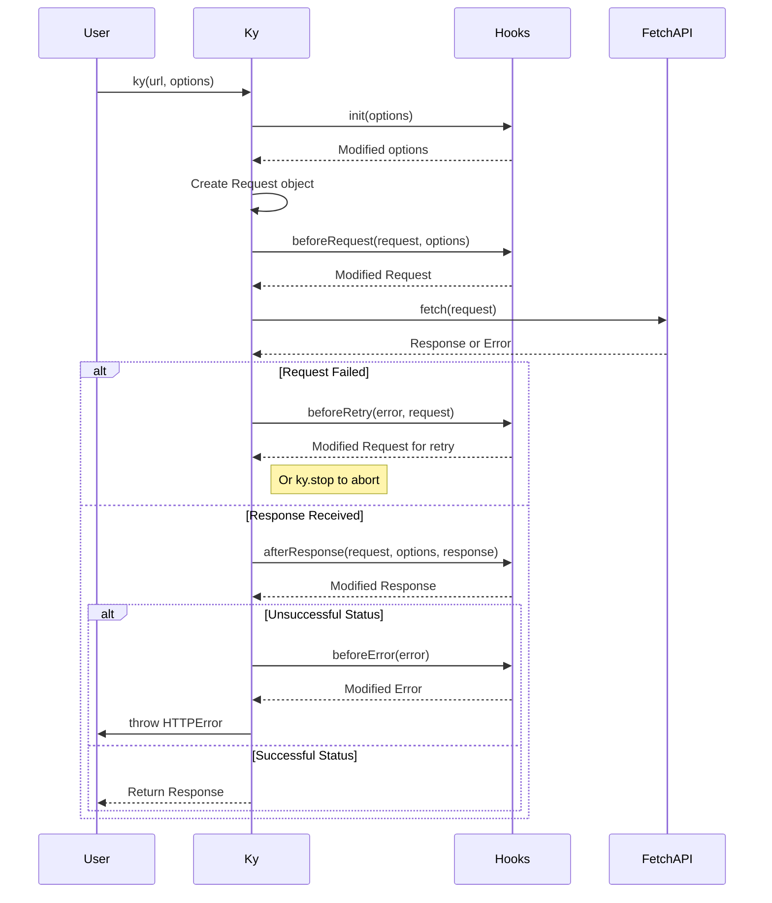
```mermaid
sequenceDiagram
    participant User
    participant Ky
    participant Hooks
    participant FetchAPI

    User->>Ky: ky(url, options)
    Ky->>Hooks: init(options)
    Hooks-->>Ky: Modified options
    Ky->>Ky: Create Request object
    Ky->>Hooks: beforeRequest(request, options)
    Hooks-->>Ky: Modified Request
    Ky->>FetchAPI: fetch(request)
    FetchAPI-->>Ky: Response or Error
    alt Request Failed
        Ky->>Hooks: beforeRetry(error, request)
        Hooks-->>Ky: Modified Request for retry
        Note right of Ky: Or ky.stop to abort
    else Response Received
        Ky->>Hooks: afterResponse(request, options, response)
        Hooks-->>Ky: Modified Response
        alt Unsuccessful Status
            Ky->>Hooks: beforeError(error)
            Hooks-->>Ky: Modified Error
            Ky->>User: throw HTTPError
        else Successful Status
            Ky-->>User: Return Response
        end
    end
```

## Summary of Ky-Specific Options

This table provides a comprehensive reference for all options specific to `ky`. Standard `fetch` options are also supported but not listed here.

| Option | Type | Default | Description |
| --- | --- | --- | --- |
| `json` | `unknown` | `undefined` | Shortcut for sending a JSON request body. |
| `parseJson` | `(text: string, context: {...}) => unknown` | `JSON.parse` | Custom function to parse a JSON response body. |
| `stringifyJson` | `(data: unknown) => string` | `JSON.stringify` | Custom function to stringify the `json` option. |
| `searchParams` | `SearchParamsOption` | `undefined` | Search parameters to include in the request URL. |
| `baseUrl` | `URL \| string` | `undefined` | A base URL to resolve the input against. |
| `prefix` | `URL \| string` | `undefined` | A prefix to prepend to the input URL before resolution. |
| `retry` | `RetryOptions \| number` | See [Retry Mechanism](#retry-mechanism) | Controls retry behavior for failed requests. |
| `timeout` | `number \| false` | `10000` | Per-attempt timeout in milliseconds. |
| `totalTimeout` | `number \| false` | `false` | Overall timeout for the entire operation, including retries. |
| `hooks` | `Hooks` | `{}` | Functions to modify the request/response lifecycle. |
| `throwHttpErrors` | `boolean \| (status: number) => boolean` | `true` | Throws an `HTTPError` for non-2xx status codes. |
| `onDownloadProgress` | `(progress: Progress, chunk: Uint8Array) => void` | `undefined` | Handler for download progress events. |
| `onUploadProgress` | `(progress: Progress, chunk: Uint8Array) => void` | `undefined` | Handler for upload progress events. |
| `fetch` | `(input: Input, init?: RequestInit) => Promise<Response>` | `globalThis.fetch` | A custom `fetch` implementation to use. |
| `context` | `Record<string, unknown>` | `{}` | User-defined data to be passed to hooks. |

Sources: [source/types/options.ts](https://github.com/sindresorhus/ky/blob/e0fcf780de2bd69af2528e4b7b87ccae6bb727b1/source/types/options.ts), [readme.md](https://github.com/sindresorhus/ky/blob/e0fcf780de2bd69af2528e4b7b87ccae6bb727b1/readme.md)

# Page: URL Management: baseUrl vs. prefix

<details>
<summary>Relevant source files</summary>

The following files were used as context for generating this wiki page:

- [source/utils/normalize.ts](https://github.com/sindresorhus/ky/blob/e0fcf780de2bd69af2528e4b7b87ccae6bb727b1/source/utils/normalize.ts)
- [readme.md](https://github.com/sindresorhus/ky/blob/e0fcf780de2bd69af2528e4b7b87ccae6bb727b1/readme.md)
</details>

# URL Management: baseUrl vs. prefix

The `ky` library provides two distinct options for managing and constructing request URLs: `baseUrl` and `prefix`. While both help in defining base paths for requests, they operate differently. `baseUrl` is the recommended option for most use cases as it adheres to standard URL resolution behavior. `prefix` offers a simpler string-joining mechanism for scenarios where standard resolution is not desired. These options are particularly powerful when creating specialized API clients using `ky.create()` or `ky.extend()`.

Sources: [readme.md:221-227](https://github.com/sindresorhus/ky/blob/e0fcf780de2bd69af2528e4b7b87ccae6bb727b1/readme.md#L221-L227), [readme.md:247-255](https://github.com/sindresorhus/ky/blob/e0fcf780de2bd69af2528e4b7b87ccae6bb727b1/readme.md#L247-L255), [readme.md:940-944](https://github.com/sindresorhus/ky/blob/e0fcf780de2bd69af2528e4b7b87ccae6bb727b1/readme.md#L940-L944), [readme.md:1026-1029](https://github.com/sindresorhus/ky/blob/e0fcf780de2bd69af2528e4b7b87ccae6bb727b1/readme.md#L1026-L1029)

## `baseUrl`

The `baseUrl` option provides a base URL against which the request `input` is resolved. This process follows the standard URL resolution rules, equivalent to `new URL(input, baseUrl)`. It is ideal for setting a common API endpoint origin and path.

Sources: [readme.md:221-226](https://github.com/sindresorhus/ky/blob/e0fcf780de2bd69af2528e4b7b87ccae6bb727b1/readme.md#L221-L226)

### Behavior

-   **Relative `input`**: If the `input` is a relative path (e.g., `'users'`), it is appended to the `baseUrl` path.
-   **Root-relative `input`**: If the `input` starts with a `/` (e.g., `'/users'`), it is treated as an origin-relative path. This means it will replace the entire path component of the `baseUrl`, resolving from the root of the origin.
-   **Absolute `input`**: If the `input` is an absolute URL (e.g., `'https://another-site.com'`), the `baseUrl` is ignored entirely.

A tip provided in the documentation is to include a trailing slash in the `baseUrl` (e.g., `'/api/'`) to ensure that page-relative inputs like `'users'` extend the path rather than replacing the last segment.

Sources: [readme.md:225-226](https://github.com/sindresorhus/ky/blob/e0fcf780de2bd69af2528e4b7b87ccae6bb727b1/readme.md#L225-L226), [readme.md:230-232](https://github.com/sindresorhus/ky/blob/e0fcf780de2bd69af2528e4b7b87ccae6bb727b1/readme.md#L230-L232), [readme.md:1662-1663](https://github.com/sindresorhus/ky/blob/e0fcf780de2bd69af2528e4b7b87ccae6bb727b1/readme.md#L1662-L1663)

### Example

Given a request made from `https://example.com`:

```js
// On https://example.com

// Relative input: extends baseUrl path
const response1 = await ky('users', {baseUrl: '/api/'});
//=> 'https://example.com/api/users'

// Root-relative input: replaces baseUrl path
const response2 = await ky('/users', {baseUrl: '/api/'});
//=> 'https://example.com/users'
```

Sources: [readme.md:233-243](https://github.com/sindresorhus/ky/blob/e0fcf780de2bd69af2528e4b7b87ccae6bb727b1/readme.md#L233-L243)

### Resolution Flow

The following diagram illustrates how `baseUrl` resolves URLs based on the `input` format.

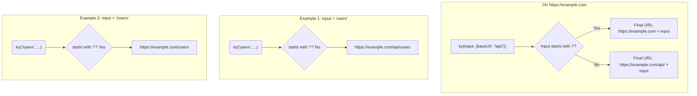
```mermaid
graph TD
    subgraph "On https://example.com"
        A["ky(input, {baseUrl: '/api/'})"] --> B{Input starts with '/'?};
        B -- Yes --> C["Final URL: <br> https://example.com + input"];
        B -- No --> D["Final URL: <br> https://example.com/api/ + input"];
    end

    subgraph "Example 1: input = 'users'"
        A1("ky('users', ...)") --> B1{starts with '/'? No};
        B1 --> D1["https://example.com/api/users"];
    end

    subgraph "Example 2: input = '/users'"
        A2("ky('/users', ...)") --> B2{starts with '/'? Yes};
        B2 --> C1["https://example.com/users"];
    end
```

Sources: [readme.md:1671-1677](https://github.com/sindresorhus/ky/blob/e0fcf780de2bd69af2528e4b7b87ccae6bb727b1/readme.md#L1671-L1677)

## `prefix`

The `prefix` option prepends a string to the `input` URL *before* any URL resolution occurs. It is a string-joining mechanism rather than a URL resolver. This is useful for cases where you want to treat origin-relative inputs (like `/users`) as if they were page-relative.

Sources: [readme.md:247-251](https://github.com/sindresorhus/ky/blob/e0fcf780de2bd69af2528e4b7b87ccae6bb727b1/readme.md#L247-L251), [readme.md:254-256](https://github.com/sindresorhus/ky/blob/e0fcf780de2bd69af2528e4b7b87ccae6bb727b1/readme.md#L254-L256)

### Behavior

-   The `prefix` and `input` are joined with a slash (`/`).
-   Leading slashes from the `input` and trailing slashes from the `prefix` are normalized at the join boundary to prevent double slashes.
-   Crucially, a leading slash on the `input` is effectively ignored, causing the `input` to always be appended to the `prefix`.
-   This option only affects string `input`s.

Sources: [readme.md:251](https://github.com/sindresorhus/ky/blob/e0fcf780de2bd69af2528e4b7b87ccae6bb727b1/readme.md#L251), [readme.md:272](https://github.com/sindresorhus/ky/blob/e0fcf780de2bd69af2528e4b7b87ccae6bb727b1/readme.md#L272), [readme.md:1664-1665](https://github.com/sindresorhus/ky/blob/e0fcf780de2bd69af2528e4b7b87ccae6bb727b1/readme.md#L1664-L1665)

### Example

Given a request made from `https://example.com`:

```js
// On https://example.com

// Relative input: appends to prefix
const response1 = await ky('users', {prefix: '/api/'});
//=> 'https://example.com/api/users'

// Root-relative input: also appends to prefix (leading '/' is ignored)
const response2 = await ky('/users', {prefix: '/api/'});
//=> 'https://example.com/api/users'
```

Sources: [readme.md:259-269](https://github.com/sindresorhus/ky/blob/e0fcf780de2bd69af2528e4b7b87ccae6bb727b1/readme.md#L259-L269)

### Resolution Flow

The diagram below shows the `prefix` string-joining logic.


```mermaid
graph TD
    subgraph "On https://example.com"
        A["ky(input, {prefix: '/api/'})"] --> B["Trim leading '/' from input"];
        B --> C["Join: '/api/' + input"];
        C --> D["Final URL: <br> https://example.com/api/ + input"];
    end

    subgraph "Example 1: input = 'users'"
        A1("ky('users', ...)") --> B1["'users'"];
        B1 --> C1["/api/users"];
        C1 --> D1["https://example.com/api/users"];
    end

    subgraph "Example 2: input = '/users'"
        A2("ky('/users', ...)") --> B2["'users'"];
        B2 --> C2["/api/users"];
        C2 --> D2["https://example.com/api/users"];
    end
```

Sources: [readme.md:1679-1685](https://github.com/sindresorhus/ky/blob/e0fcf780de2bd69af2528e4b7b87ccae6bb727b1/readme.md#L1679-L1685)

## Combined Usage of `prefix` and `baseUrl`

When both `prefix` and `baseUrl` are used, `ky` first joins the `prefix` with the `input`, and then the resulting string is resolved against the `baseUrl`.

Sources: [readme.md:273](https://github.com/sindresorhus/ky/blob/e0fcf780de2bd69af2528e4b7b87ccae6bb727b1/readme.md#L273)

### Order of Operations

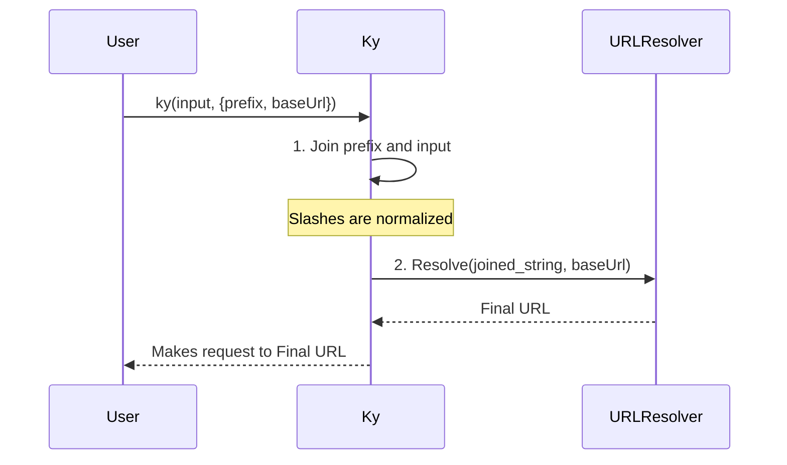
```mermaid
sequenceDiagram
    participant User
    participant Ky
    participant URLResolver

    User->>Ky: ky(input, {prefix, baseUrl})
    Ky->>Ky: 1. Join prefix and input
    Note over Ky: Slashes are normalized
    Ky->>URLResolver: 2. Resolve(joined_string, baseUrl)
    URLResolver-->>Ky: Final URL
    Ky-->>User: Makes request to Final URL
```

This flow shows that `prefix` acts as a pre-processor for the `input` before the standard `baseUrl` resolution logic is applied.

## Comparison Summary

The key difference lies in how they handle a leading slash (`/`) in the request `input`.

| Feature | `baseUrl` | `prefix` |
| :--- | :--- | :--- |
| **Mechanism** | Standard URL Resolution | String Concatenation |
| **`input: 'users'`** | Appends to `baseUrl` path | Appends to `prefix` |
| **`input: '/users'`** | Replaces `baseUrl` path (origin-relative) | Appends to `prefix` (leading `/` ignored) |
| **Order** | Applied *after* `prefix` | Applied *before* `baseUrl` |
| **Recommended Use** | Almost all cases; standard and predictable. | When origin-relative inputs (`/users`) must be treated as page-relative. |

Sources: [readme.md:1660-1685](https://github.com/sindresorhus/ky/blob/e0fcf780de2bd69af2528e4b7b87ccae6bb727b1/readme.md#L1660-L1685)

## Configuration with `ky.extend()` and `ky.create()`

Both `baseUrl` and `prefix` can be set as default options when creating a new `ky` instance, making them highly effective for building API-specific clients.

-   `ky.create(defaultOptions)`: Creates a new instance with fresh defaults.
-   `ky.extend(defaultOptions)`: Creates a new instance that inherits and merges defaults from its parent.

### Example: Creating an API Client

```javascript
import ky from 'ky';

// Create a base API client with a prefix
const api = ky.create({prefix: 'https://example.com/api'});

// Extend the client for a specific resource
const usersApi = api.extend((options) => ({prefix: `${options.prefix}/users`}));

// Makes a request to 'https://example.com/api/version'
const response1 = await api.get('version');

// Makes a request to 'https://example.com/api/users/123'
const response2 = await usersApi.get('123');
```

This example demonstrates how `prefix` can be used to build modular API clients by extending a base configuration. The same principle applies to `baseUrl`.

Sources: [readme.md:940-944](https://github.com/sindresorhus/ky/blob/e0fcf780de2bd69af2528e4b7b87ccae6bb727b1/readme.md#L940-L944), [readme.md:993-1004](https://github.com/sindresorhus/ky/blob/e0fcf780de2bd69af2528e4b7b87ccae6bb727b1/readme.md#L993-L1004), [readme.md:1026-1038](https://github.com/sindresorhus/ky/blob/e0fcf780de2bd69af2528e4b7b87ccae6bb727b1/readme.md#L1026-L1038)

# Page: Retry Mechanism

<details>
<summary>Relevant source files</summary>

The following files were used as context for generating this wiki page:

- [source/core/Ky.ts](https://github.com/sindresorhus/ky/blob/e0fcf780de2bd69af2528e4b7b87ccae6bb727b1/source/core/Ky.ts)
- [source/types/retry.ts](https://github.com/sindresorhus/ky/blob/e0fcf780de2bd69af2528e4b7b87ccae6bb727b1/source/types/retry.ts)
- [source/errors/ForceRetryError.ts](https://github.com/sindresorhus/ky/blob/e0fcf780de2bd69af2528e4b7b87ccae6bb727b1/source/errors/ForceRetryError.ts)
- [source/errors/NonError.ts](https://github.com/sindresorhus/ky/blob/e0fcf780de2bd69af2528e4b7b87ccae6bb727b1/source/errors/NonError.ts)
</details>

# Retry Mechanism

The `ky` library includes a powerful and highly configurable retry mechanism to automatically handle transient failures in network requests. This system can retry requests based on specific HTTP status codes, network errors, and timeouts. The behavior is controlled through the `retry` option and can be customized further using hooks for complex scenarios, such as modifying requests between retries or implementing custom retry logic.

The core retry loop is initiated when the initial fetch operation fails. The logic then determines whether a retry is appropriate based on the configuration and the nature of the error. If a retry is warranted, it calculates a delay, waits, and then re-executes the request.

## Configuration

The retry behavior is configured via the `retry` property in the `options` object. This can be a number (specifying the retry limit) or an object with detailed settings.

Sources: [source/core/Ky.ts:377](https://github.com/sindresorhus/ky/blob/e0fcf780de2bd69af2528e4b7b87ccae6bb727b1/source/core/Ky.ts#L377), [source/types/retry.ts:15-175](https://github.com/sindresorhus/ky/blob/e0fcf780de2bd69af2528e4b7b87ccae6bb727b1/source/types/retry.ts#L15-L175)

### `RetryOptions`

The following table details the available options within the `retry` configuration object.

| Option | Description | Default Value |
| --- | --- | --- |
| `limit` | The maximum number of retry attempts. | `2` |
| `methods` | An array of HTTP methods that are allowed to be retried. | `['get', 'put', 'head', 'delete', 'options', 'trace']` |
| `statusCodes` | An array of HTTP status codes that should trigger a retry. | `[408, 413, 429, 500, 502, 503, 504]` |
| `afterStatusCodes` | An array of status codes for which the `Retry-After` header should be respected. | `[413, 429, 503]` |
| `maxRetryAfter` | The maximum delay (in ms) to wait when respecting a `Retry-After` header. | `Infinity` |
| `backoffLimit` | The maximum delay (in ms) for a single retry attempt using the exponential backoff strategy. | `Infinity` |
| `delay` | A function that calculates the delay (in ms) before the next retry. It receives the `attemptCount` as an argument. | `attemptCount => 0.3 * (2 ** (attemptCount - 1)) * 1000` |
| `jitter` | If `true`, applies full random jitter to the delay. Can also be a custom function for specific jitter strategies. Not applied when a `Retry-After` header is present. | `undefined` (no jitter) |
| `retryOnTimeout` | A boolean indicating whether to retry if the request times out. | `false` |
| `shouldRetry` | A function that provides ultimate control over the retry decision. It receives the `error` and `retryCount`. Returning `true` forces a retry, `false` prevents it, and `undefined` falls back to the default logic. | `undefined` |

Sources: [source/types/retry.ts:15-175](https://github.com/sindresorhus/ky/blob/e0fcf780de2bd69af2528e4b7b87ccae6bb727b1/source/types/retry.ts#L15-L175)

## Retry Logic Flow

When a request fails, `ky` enters the retry process, which is primarily managed by the `#retryFromError` and `#calculateRetryDelay` methods. The decision to retry follows a specific sequence of checks.

The following diagram illustrates the decision-making process for whether to attempt a retry.

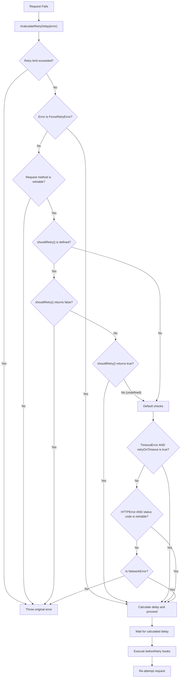
```mermaid
graph TD
    A[Request Fails] --> B["#calculateRetryDelay(error)"];
    B --> C{Retry limit exceeded?};
    C -- Yes --> D[Throw original error];
    C -- No --> E{Error is ForceRetryError?};
    E -- Yes --> F[Calculate delay and proceed];
    E -- No --> G{Request method is retriable?};
    G -- No --> D;
    G -- Yes --> H{"shouldRetry() is defined?"};
    H -- Yes --> I{"shouldRetry() returns false?"};
    I -- Yes --> D;
    I -- No --> J{"shouldRetry() returns true?"};
    J -- Yes --> F;
    J -- No (undefined) --> K[Default checks];
    H -- No --> K;
    K --> L{TimeoutError AND retryOnTimeout is true?};
    L -- Yes --> F;
    L -- No --> M{HTTPError AND status code is retriable?};
    M -- Yes --> F;
    M -- No --> N{Is NetworkError?};
    N -- Yes --> F;
    N -- No --> D;
    F --> Q[Wait for calculated delay];
    Q --> R["Execute beforeRetry hooks"];
    R --> S[Re-attempt request];
```
Sources: [source/core/Ky.ts:504-590](https://github.com/sindresorhus/ky/blob/e0fcf780de2bd69af2528e4b7b87ccae6bb727b1/source/core/Ky.ts#L504-L590), [source/core/Ky.ts:852-928](https://github.com/sindresorhus/ky/blob/e0fcf780de2bd69af2528e4b7b87ccae6bb727b1/source/core/Ky.ts#L852-L928)

### Detailed Decision Steps

The `#calculateRetryDelay` method orchestrates the retry decision logic:

1.  **Retry Limit**: The first check ensures the `retryCount` has not exceeded the configured `limit`. If it has, the original error is thrown.
    Sources: [source/core/Ky.ts:505-507](https://github.com/sindresorhus/ky/blob/e0fcf780de2bd69af2528e4b7b87ccae6bb727b1/source/core/Ky.ts#L505-L507)
2.  **`ForceRetryError`**: If the error is an instance of `ForceRetryError` (typically thrown from an `afterResponse` hook), it bypasses most other checks and proceeds directly to the delay calculation.
    Sources: [source/core/Ky.ts:513-515](https://github.com/sindresorhus/ky/blob/e0fcf780de2bd69af2528e4b7b87ccae6bb727b1/source/core/Ky.ts#L513-L515)
3.  **HTTP Method**: It verifies that the request's HTTP method is included in the `retry.methods` array.
    Sources: [source/core/Ky.ts:518-520](https://github.com/sindresorhus/ky/blob/e0fcf780de2bd69af2528e4b7b87ccae6bb727b1/source/core/Ky.ts#L518-L520)
4.  **`shouldRetry` Hook**: If the `shouldRetry` function is provided, its return value dictates the outcome:
    -   `true`: Forces a retry, skipping subsequent default checks.
    -   `false`: Prevents the retry, and the original error is thrown.
    -   `undefined`: The logic proceeds to the default checks.
    Sources: [source/core/Ky.ts:523-537](https://github.com/sindresorhus/ky/blob/e0fcf780de2bd69af2528e4b7b87ccae6bb727b1/source/core/Ky.ts#L523-L537)
5.  **Default Error Checks**: If `shouldRetry` is not used, the logic checks for specific error types:
    -   **`TimeoutError`**: A retry is attempted if the error is a `TimeoutError` and `retry.retryOnTimeout` is `true`.
        Sources: [source/core/Ky.ts:540-546](https://github.com/sindresorhus/ky/blob/e0fcf780de2bd69af2528e4b7b87ccae6bb727b1/source/core/Ky.ts#L540-L546)
    -   **`HTTPError`**: A retry is attempted if the error is an `HTTPError` and its `response.status` is in the `retry.statusCodes` array. Status code 413 is an exception and is never retried.
        Sources: [source/core/Ky.ts:548-551](https://github.com/sindresorhus/ky/blob/e0fcf780de2bd69af2528e4b7b87ccae6bb727b1/source/core/Ky.ts#L548-L551), [source/core/Ky.ts:577-579](https://github.com/sindresorhus/ky/blob/e0fcf780de2bd69af2528e4b7b87ccae6bb727b1/source/core/Ky.ts#L577-L579), [source/errors/HTTPError.ts](https://github.com/sindresorhus/ky/blob/e0fcf780de2bd69af2528e4b7b87ccae6bb727b1/source/errors/HTTPError.ts)
    -   **`NetworkError`**: Any `NetworkError` is considered retriable.
        Sources: [source/core/Ky.ts:585-589](https://github.com/sindresorhus/ky/blob/e0fcf780de2bd69af2528e4b7b87ccae6bb727b1/source/core/Ky.ts#L585-L589)
    -   **Other Errors**: Any other type of error will not be retried, and the error will be thrown.
        Sources: [source/core/Ky.ts:585-587](https://github.com/sindresorhus/ky/blob/e0fcf780de2bd69af2528e4b7b87ccae6bb727b1/source/core/Ky.ts#L585-L587)

It's important to note that any non-`Error` value thrown during the request is wrapped in a `NonError` instance to ensure consistent handling within the retry logic.
Sources: [source/core/Ky.ts:510](https://github.com/sindresorhus/ky/blob/e0fcf780de2bd69af2528e4b7b87ccae6bb727b1/source/core/Ky.ts#L510), [source/errors/NonError.ts:6-28](https://github.com/sindresorhus/ky/blob/e0fcf780de2bd69af2528e4b7b87ccae6bb727b1/source/errors/NonError.ts#L6-L28)

## Delay Calculation

Once a retry is confirmed, `ky` calculates the time to wait before the next attempt.

### Backoff and Jitter

The default delay is calculated using an exponential backoff formula: `0.3 * (2 ** (attemptCount - 1)) * 1000`. This can be overridden by providing a custom `delay` function in the `retry` options. The calculated delay is always capped by the `backoffLimit`.

To prevent a "thundering herd" problem where many clients retry simultaneously, random jitter can be added. If `retry.jitter` is `true`, the delay is randomized between 0 and the calculated backoff delay. A custom jitter function can also be provided for more control.

Sources: [source/core/Ky.ts:487-502](https://github.com/sindresorhus/ky/blob/e0fcf780de2bd69af2528e4b7b87ccae6bb727b1/source/core/Ky.ts#L487-L502), [source/types/retry.ts:57-72](https://github.com/sindresorhus/ky/blob/e0fcf780de2bd69af2528e4b7b87ccae6bb727b1/source/types/retry.ts#L57-L72), [source/types/retry.ts:107](https://github.com/sindresorhus/ky/blob/e0fcf780de2bd69af2528e4b7b87ccae6bb727b1/source/types/retry.ts#L107)

### `Retry-After` Header

If a response with a status code listed in `afterStatusCodes` (e.g., 429, 503) includes a `Retry-After` header, `ky` will use the server-provided delay instead of the calculated backoff. This delay is parsed whether it's a number of seconds or an HTTP date. The final delay is capped by `maxRetryAfter`. Jitter is not applied in this case.

Sources: [source/core/Ky.ts:553-575](https://github.com/sindresorhus/ky/blob/e0fcf780de2bd69af2528e4b7b87ccae6bb727b1/source/core/Ky.ts#L553-L575)

## Hooks Integration

Hooks provide powerful extension points to customize the retry flow.

### `afterResponse` Hook

The `afterResponse` hook can initiate a "forced" retry even for a successful response. By returning `ky.retry()`, the hook signals that the request should be retried. This action internally throws a `ForceRetryError`, which is caught by the retry handler.

The `ForceRetryError` can carry a custom delay or even a completely new `Request` object to be used for the subsequent attempt.

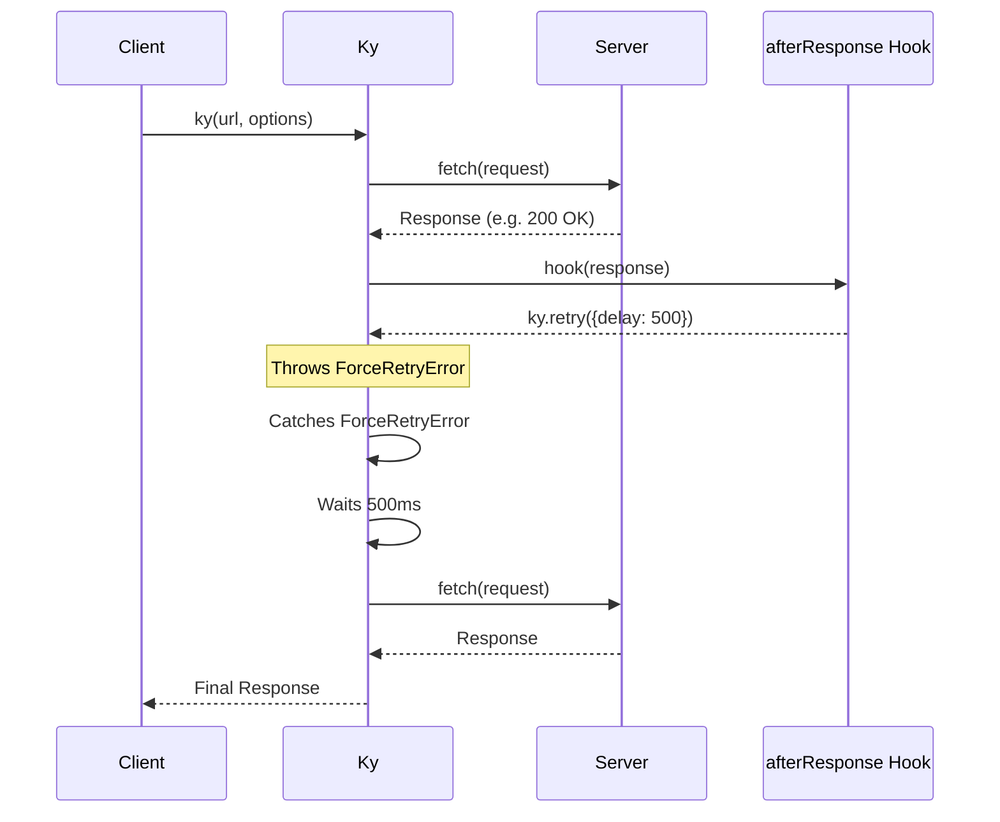
```mermaid
sequenceDiagram
    participant C as Client
    participant K as Ky
    participant S as Server
    participant H as afterResponse Hook

    C->>K: ky(url, options)
    K->>S: fetch(request)
    S-->>K: Response (e.g. 200 OK)
    K->>H: hook(response)
    H-->>K: ky.retry({delay: 500})
    Note over K: Throws ForceRetryError
    K->>K: Catches ForceRetryError
    K->>K: Waits 500ms
    K->>S: fetch(request)
    S-->>K: Response
    K-->>C: Final Response
```
Sources: [source/core/Ky.ts:812-821](https://github.com/sindresorhus/ky/blob/e0fcf780de2bd69af2528e4b7b87ccae6bb727b1/source/core/Ky.ts#L812-L821), [source/errors/ForceRetryError.ts:10-32](https://github.com/sindresorhus/ky/blob/e0fcf780de2bd69af2528e4b7b87ccae6bb727b1/source/errors/ForceRetryError.ts#L10-L32)

### `beforeRetry` Hook

The `beforeRetry` hook is executed after a retry has been approved and the delay has passed, but before the next request is sent. It receives the `request`, `options`, `error`, and the upcoming `retryCount`.

This hook can:
-   **Modify the request**: Return a new `Request` instance to be used for the retry attempt.
-   **Bypass the retry**: Return a `Response` object to stop the retry process and resolve the promise with that response.
-   **Abort the retry**: Return the special `stop` symbol to halt the retry process and let the original error propagate.

Sources: [source/core/Ky.ts:886-922](https://github.com/sindresorhus/ky/blob/e0fcf780de2bd69af2528e4b7b87ccae6bb727b1/source/core/Ky.ts#L886-L922)

# Page: Hooks System

<details>
<summary>Relevant source files</summary>

The following files were used as context for generating this wiki page:

- [source/core/Ky.ts](https://github.com/sindresorhus/ky/blob/e0fcf780de2bd69af2528e4b7b87ccae6bb727b1/source/core/Ky.ts)
- [source/types/hooks.ts](https://github.com/sindresorhus/ky/blob/e0fcf780de2bd69af2528e4b7b87ccae6bb727b1/source/types/hooks.ts)
</details>

# Hooks System

The hooks system in `ky` provides a powerful mechanism to intercept and modify the request-response lifecycle. By defining an array of hook functions for different stages, developers can inject custom logic for tasks such as modifying request options, handling authentication, logging, mocking responses, and implementing complex retry strategies.

Hooks are configured within the `hooks` property of the `Options` object. They are executed in a defined sequence, allowing for fine-grained control over the entire fetch process, from initial option processing to final error handling. The system supports both synchronous and asynchronous hooks, each with a specific signature and set of capabilities.

Sources: [source/types/hooks.ts:88](https://github.com/sindresorhus/ky/blob/e0fcf780de2bd69af2528e4b7b87ccae6bb727b1/source/types/hooks.ts#L88), [source/core/Ky.ts:373](https://github.com/sindresorhus/ky/blob/e0fcf780de2bd69af2528e4b7b87ccae6bb727b1/source/core/Ky.ts#L373)

## Hook Execution Lifecycle

The `ky` request lifecycle processes hooks in a specific order. The following diagram illustrates the flow, including the main execution path, retry loops, and error handling.

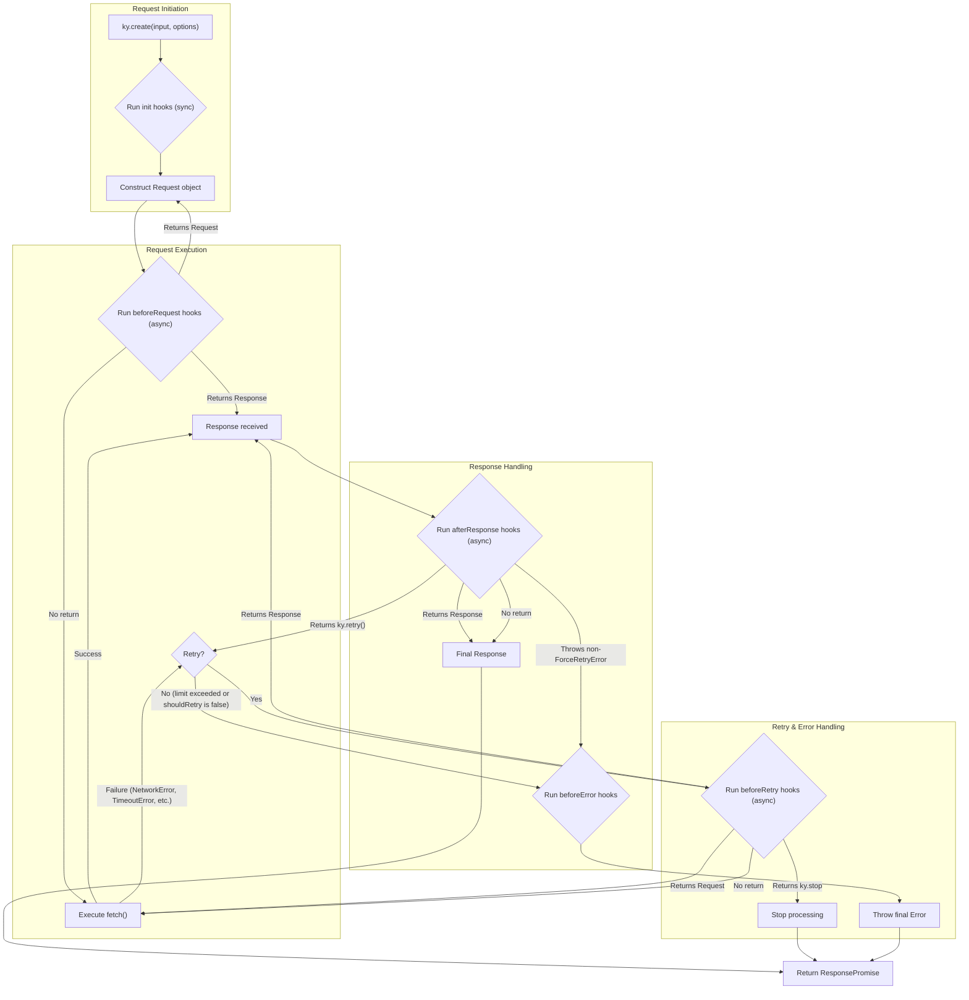
```mermaid
graph TD
    subgraph "Request Initiation"
        A["ky.create(input, options)"] --> B{"Run init hooks (sync)"};
        B --> C[Construct Request object];
    end

    subgraph "Request Execution"
        C --> D{"Run beforeRequest hooks (async)"};
        D -- "Returns Request" --> C;
        D -- "Returns Response" --> G[Response received];
        D -- "No return" --> E["Execute fetch()"];
        E -- "Success" --> G;
        E -- "Failure (NetworkError, TimeoutError, etc.)" --> I{Retry?};
    end

    subgraph "Response Handling"
        G --> H{"Run afterResponse hooks (async)"};
        H -- "Returns Response" --> J[Final Response];
        H -- "Returns ky.retry()" --> I;
        H -- "Throws non-ForceRetryError" --> K{Run beforeError hooks};
        H -- "No return" --> J;
    end

    subgraph "Retry & Error Handling"
        I -- "Yes" --> L{"Run beforeRetry hooks (async)"};
        L -- "Returns Request" --> E;
        L -- "Returns Response" --> G;
        L -- "Returns ky.stop" --> M[Stop processing];
        L -- "No return" --> E;
        I -- "No (limit exceeded or shouldRetry is false)" --> K;
        K --> N[Throw final Error];
    end

    J --> O[Return ResponsePromise];
    M --> O;
    N --> O;
```
This flow is orchestrated within the `Ky.create` static method and the internal `function_` that manages the lifecycle.

Sources: [source/core/Ky.ts:143-298](https://github.com/sindresorhus/ky/blob/e0fcf780de2bd69af2528e4b7b87ccae6bb727b1/source/core/Ky.ts#L143-L298)

## Hook Types

There are five types of hooks, each targeting a specific stage of the lifecycle.

| Hook            | Execution Stage                                                              | Purpose                                                                                             |
| --------------- | ---------------------------------------------------------------------------- | --------------------------------------------------------------------------------------------------- |
| `init`          | Synchronously, before the `Request` object is created.                       | Modify the initial `Options` object.                                                                |
| `beforeRequest` | Asynchronously, just before the request is sent.                             | Modify the final `Request` object, or short-circuit the request by returning a `Response`.          |
| `afterResponse` | Asynchronously, after a response is received but before it's returned.       | Inspect or modify the `Response`, or trigger a retry based on the response content.                 |
| `beforeRetry`   | Asynchronously, before a retry attempt is made.                              | Modify the `Request` for the retry, provide a fallback `Response`, or prevent the retry.            |
| `beforeError`   | Asynchronously, just before an error is thrown to the caller.                | Modify or replace the `Error` instance for custom error handling or logging.                        |

Sources: [source/types/hooks.ts:88-365](https://github.com/sindresorhus/ky/blob/e0fcf780de2bd69af2528e4b7b87ccae6bb727b1/source/types/hooks.ts#L88-L365)

### `init`

The `init` hooks are the only synchronous hooks. They are executed immediately after a `ky` call is made, receiving the mutable `Options` object. This allows for modifying options like `headers`, `searchParams`, or `json` before the `Request` is constructed.

-   **Signature:** `(options: Options) => void`
-   **Execution:** Called in a loop at the beginning of `Ky.create`. The options are shallow-cloned before being passed to `init` hooks to prevent mutations from leaking between requests.

```typescript
// source/core/Ky.ts:144-149
const initHooks = options.hooks?.init ?? [];
const initHookOptions = initHooks.length > 0 ? cloneInitHookOptions(options) : options;

for (const hook of initHooks) {
    hook(initHookOptions);
}
```

Sources: [source/types/hooks.ts:28](https://github.com/sindresorhus/ky/blob/e0fcf780de2bd69af2528e4b7b87ccae6bb727b1/source/types/hooks.ts#L28), [source/core/Ky.ts:96-110](https://github.com/sindresorhus/ky/blob/e0fcf780de2bd69af2528e4b7b87ccae6bb727b1/source/core/Ky.ts#L96-L110), [source/core/Ky.ts:144-149](https://github.com/sindresorhus/ky/blob/e0fcf780de2bd69af2528e4b7b87ccae6bb727b1/source/core/Ky.ts#L144-L149)

### `beforeRequest`

These asynchronous hooks run just before the `fetch` call. They receive the final `Request` object and normalized options.

-   **Signature:** `(state: BeforeRequestState) => Request | Response | void | Promise<Request | Response | void>`
-   **Key Features:**
    -   Can modify the `request` in place (e.g., `request.headers.set(...)`).
    -   Can return a new `Request` instance to completely replace the outgoing request.
    -   Can return a `Response` instance to bypass the network call entirely. The lifecycle then proceeds directly to the `afterResponse` hooks.

```typescript
// source/core/Ky.ts:776-780
if (isRequestInstance(result)) {
    this.#assignRequest(result);
} else if (isResponseInstance(result)) {
    return result;
}
```

Sources: [source/types/hooks.ts:40](https://github.com/sindresorhus/ky/blob/e0fcf780de2bd69af2528e4b7b87ccae6bb727b1/source/types/hooks.ts#L40), [source/core/Ky.ts:767-784](https://github.com/sindresorhus/ky/blob/e0fcf780de2bd69af2528e4b7b87ccae6bb727b1/source/core/Ky.ts#L767-L784)

### `afterResponse`

These asynchronous hooks run after a successful response is received. They receive a clone of the response, which can be inspected or modified.

-   **Signature:** `(state: AfterResponseState) => Response | RetryMarker | void | Promise<Response | RetryMarker | void>`
-   **Key Features:**
    -   Can return a new `Response` to replace the original one.
    -   Can trigger a retry by returning `ky.retry()`. This internally throws a `ForceRetryError`, which is caught by the retry logic. This is useful for scenarios like token refreshing or when an API indicates a recoverable error in the body of a 2xx response.

The `RetryMarker` is a special object used to signal a forced retry.

```typescript
// source/core/Ky.ts:812-821
if (modifiedResponse instanceof RetryMarker) {
    // ... (cancel response bodies)
    throw new ForceRetryError(modifiedResponse.options);
}
```

Sources: [source/types/hooks.ts:86](https://github.com/sindresorhus/ky/blob/e0fcf780de2bd69af2528e4b7b87ccae6bb727b1/source/types/hooks.ts#L86), [source/core/Ky.ts:786-842](https://github.com/sindresorhus/ky/blob/e0fcf780de2bd69af2528e4b7b87ccae6bb727b1/source/core/Ky.ts#L786-L842), [source/errors/ForceRetryError.ts](https://github.com/sindresorhus/ky/blob/e0fcf780de2bd69af2528e4b7b87ccae6bb727b1/source/errors/ForceRetryError.ts)

### `beforeRetry`

When a request fails and a retry is scheduled, these asynchronous hooks are executed before the next attempt.

-   **Signature:** `(state: BeforeRetryState) => Request | Response | typeof stop | void | Promise<Request | Response | typeof stop | void>`
-   **Key Features:**
    -   Can modify the `request` for the next attempt.
    -   Can return a new `Request` to replace the retry request.
    -   Can return a `Response` to skip the retry and use the provided response instead.
    -   Can stop the retry process by returning the `stop` symbol, preventing further attempts without throwing an error.
    -   Throwing an error from this hook will also stop retries and propagate the error.

```typescript
// source/core/Ky.ts:918-921
// If `stop` is returned from the hook, the retry process is stopped
if (hookResult === stop) {
    return;
}
```

Sources: [source/types/hooks.ts:53](https://github.com/sindresorhus/ky/blob/e0fcf780de2bd69af2528e4b7b87ccae6bb727b1/source/types/hooks.ts#L53), [source/core/Ky.ts:886-922](https://github.com/sindresorhus/ky/blob/e0fcf780de2bd69af2528e4b7b87ccae6bb727b1/source/core/Ky.ts#L886-L922), [source/core/constants.ts:35](https://github.com/sindresorhus/ky/blob/e0fcf780de2bd69af2528e4b7b87ccae6bb727b1/source/core/constants.ts#L35)

### `beforeError`

This hook runs for any error (e.g., `HTTPError`, `NetworkError`, `TimeoutError`) just before it is thrown to the user. It is the final stage for error modification.

-   **Signature:** `(state: BeforeErrorState) => Error | Promise<Error>`
-   **Key Features:**
    -   Receives the error that is about to be thrown.
    -   Must return an `Error` instance, which will be the error that the user's `await` call ultimately rejects with. This allows for augmenting errors with more context or wrapping them in custom error types.

```typescript
// source/core/Ky.ts:270-285
let processedError: Error = error;
for (const hook of ky.#options.hooks.beforeError) {
    // ...
    const hookResult: unknown = await hook({
        request: ky.request,
        options: ky.#getNormalizedOptions(),
        error: processedError,
        retryCount: ky.#retryCount,
    });

    // Only overwrite if the hook returns a valid Error instance.
    if (hookResult instanceof Error) {
        processedError = hookResult;
    }
}
```

Sources: [source/types/hooks.ts:71](https://github.com/sindresorhus/ky/blob/e0fcf780de2bd69af2528e4b7b87ccae6bb727b1/source/types/hooks.ts#L71), [source/core/Ky.ts:270-288](https://github.com/sindresorhus/ky/blob/e0fcf780de2bd69af2528e4b7b87ccae6bb727b1/source/core/Ky.ts#L270-L288)

## Token Refresh Flow Example

A common use case for hooks is transparently refreshing an authentication token upon receiving a 401 Unauthorized response. The `afterResponse` and `beforeRetry` hooks work together to achieve this.

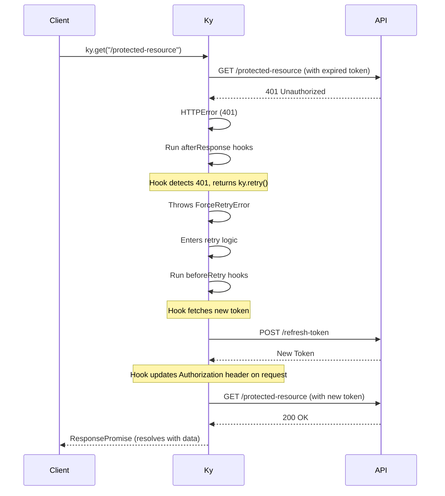
```mermaid
sequenceDiagram
    participant Client
    participant Ky
    participant API

    Client->>Ky: ky.get("/protected-resource")
    Ky->>API: GET /protected-resource (with expired token)
    API-->>Ky: 401 Unauthorized
    Ky->>Ky: HTTPError (401)
    Ky->>Ky: Run afterResponse hooks
    Note over Ky: Hook detects 401, returns ky.retry()
    Ky->>Ky: Throws ForceRetryError
    Ky->>Ky: Enters retry logic
    Ky->>Ky: Run beforeRetry hooks
    Note over Ky: Hook fetches new token
    Ky->>API: POST /refresh-token
    API-->>Ky: New Token
    Note over Ky: Hook updates Authorization header on request
    Ky->>API: GET /protected-resource (with new token)
    API-->>Ky: 200 OK
    Ky-->>Client: ResponsePromise (resolves with data)
```
This sequence demonstrates how `afterResponse` can initiate a retry for a "successful" but unauthorized response, and `beforeRetry` can perform the side-effect of refreshing the token before the next attempt.

Sources: [source/types/hooks.ts:322-335](https://github.com/sindresorhus/ky/blob/e0fcf780de2bd69af2528e4b7b87ccae6bb727b1/source/types/hooks.ts#L322-L335), [source/core/Ky.ts:176-194](https://github.com/sindresorhus/ky/blob/e0fcf780de2bd69af2528e4b7b87ccae6bb727b1/source/core/Ky.ts#L176-L194), [source/core/Ky.ts:852-928](https://github.com/sindresorhus/ky/blob/e0fcf780de2bd69af2528e4b7b87ccae6bb727b1/source/core/Ky.ts#L852-L928)

# Page: Upload and Download Progress

<details>
<summary>Relevant source files</summary>

The following files were used as context for generating this wiki page:

- [source/utils/body.ts](https://github.com/sindresorhus/ky/blob/e0fcf780de2bd69af2528e4b7b87ccae6bb727b1/source/utils/body.ts)
- [readme.md](https://github.com/sindresorhus/ky/blob/e0fcf780de2bd69af2528e4b7b87ccae6bb727b1/readme.md)
</details>

# Upload and Download Progress

Ky provides a mechanism to monitor the progress of both HTTP uploads and downloads. This is accomplished through two primary options: `onDownloadProgress` and `onUploadProgress`. These options accept a callback function that is invoked periodically as data is transferred. The underlying implementation leverages modern web APIs like `ReadableStream` and `TransformStream` to intercept and report on the data flow without significantly impacting performance.

This functionality is crucial for applications that handle large files or operate on slow networks, as it allows developers to provide real-time feedback to users, such as progress bars or transfer-rate indicators.

Sources: [readme.md:51](https://github.com/sindresorhus/ky/blob/e0fcf780de2bd69af2528e4b7b87ccae6bb727b1/readme.md#L51), [readme.md:735-737](https://github.com/sindresorhus/ky/blob/e0fcf780de2bd69af2528e4b7b87ccae6bb727b1/readme.md#L735-L737), [readme.md:761-763](https://github.com/sindresorhus/ky/blob/e0fcf780de2bd69af2528e4b7b87ccae6bb727b1/readme.md#L761-L763)

## Download Progress

Download progress is monitored by providing the `onDownloadProgress` callback in the `ky` options. This feature works by intercepting the response body stream from the server.

Sources: [readme.md:735-739](https://github.com/sindresorhus/ky/blob/e0fcf780de2bd69af2528e4b7b87ccae6bb727b1/readme.md#L735-L739)

### Implementation

When a request is made with an `onDownloadProgress` handler, Ky's internal `streamResponse` function is invoked after the response headers are received. This function checks for the existence of a response body. If a body is present, it wraps the native `response.body` `ReadableStream` with a custom progress-reporting stream created by the `withProgress` utility. The total size of the download (`totalBytes`) is determined from the `content-length` header of the response.

The `streamResponse` function then constructs a new `Response` object, replacing the original body with the wrapped stream. This allows the consumer to use the response as they normally would, while the progress callback is triggered in the background as the body is read.

Sources: [source/utils/body.ts:79-96](https://github.com/sindresorhus/ky/blob/e0fcf780de2bd69af2528e4b7b87ccae6bb727b1/source/utils/body.ts#L79-L96)

### Data Flow

The following diagram illustrates the sequence of events for tracking download progress.

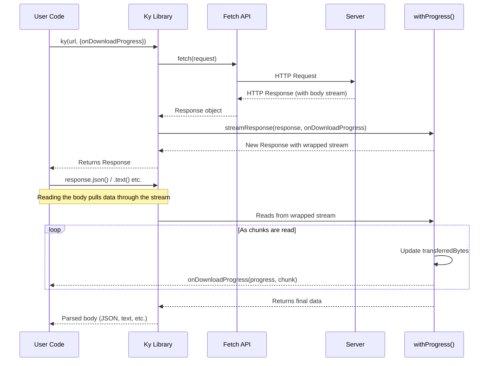
```mermaid
sequenceDiagram
    participant User as User Code
    participant Ky as Ky Library
    participant FetchAPI as Fetch API
    participant Server
    participant ProgressStream as withProgress()

    User->>Ky: ky(url, {onDownloadProgress})
    Ky->>FetchAPI: fetch(request)
    FetchAPI->>Server: HTTP Request
    Server-->>FetchAPI: HTTP Response (with body stream)
    FetchAPI-->>Ky: Response object
    Ky->>ProgressStream: streamResponse(response, onDownloadProgress)
    ProgressStream-->>Ky: New Response with wrapped stream
    Ky-->>User: Returns Response
    User->>Ky: response.json() / .text() etc.
    Note over User,Ky: Reading the body pulls data through the stream
    Ky->>ProgressStream: Reads from wrapped stream
    loop As chunks are read
        ProgressStream->>ProgressStream: Update transferredBytes
        ProgressStream-->>User: onDownloadProgress(progress, chunk)
    end
    ProgressStream-->>Ky: Returns final data
    Ky-->>User: Parsed body (JSON, text, etc.)
```
Sources: [source/utils/body.ts:79-96](https://github.com/sindresorhus/ky/blob/e0fcf780de2bd69af2528e4b7b87ccae6bb727b1/source/utils/body.ts#L79-L96)

### Progress Callback

The `onDownloadProgress` function receives two arguments: `progress` and `chunk`.

| Argument | Type | Description |
|---|---|---|
| `progress` | `object` | An object containing details about the transfer status. |
| `chunk` | `Uint8Array` | The raw data chunk that was just received. It is empty on the first call. |

The `progress` object has the following properties:

| Property | Type | Description |
|---|---|---|
| `percent` | `number` | A value between 0 and 1 representing the percentage of completion. |
| `transferredBytes` | `number` | The total number of bytes transferred so far. |
| `totalBytes` | `number` | The total expected bytes, sourced from the `Content-Length` header. May be 0 if the header is not present. |

Sources: [readme.md:741-747](https://github.com/sindresorhus/ky/blob/e0fcf780de2bd69af2528e4b7b87ccae6bb727b1/readme.md#L741-L747), [source/utils/body.ts:65](https://github.com/sindresorhus/ky/blob/e0fcf780de2bd69af2528e4b7b87ccae6bb727b1/source/utils/body.ts#L65)

## Upload Progress

Upload progress is monitored similarly to download progress, using the `onUploadProgress` callback. This feature requires browser support for request streams. In unsupported environments, the handler is ignored.

Sources: [readme.md:761-769](https://github.com/sindresorhus/ky/blob/e0fcf780de2bd69af2528e4b7b87ccae6bb727b1/readme.md#L761-L769)

### Implementation

When a request is initiated with an `onUploadProgress` handler, the `streamRequest` function is called. This function first determines the total size of the request body using the `getBodySize` helper. It then wraps the request's `ReadableStream` body using the same `withProgress` utility used for downloads. Finally, it creates a new `Request` object with the original request's properties but with the new, wrapped body stream. The `duplex: 'half'` option is also set, which is necessary for streaming request bodies.

Sources: [source/utils/body.ts:99-112](https://github.com/sindresorhus/ky/blob/e0fcf780de2bd69af2528e4b7b87ccae6bb727b1/source/utils/body.ts#L99-L112)

### Data Flow

The sequence diagram below shows the process for tracking upload progress.

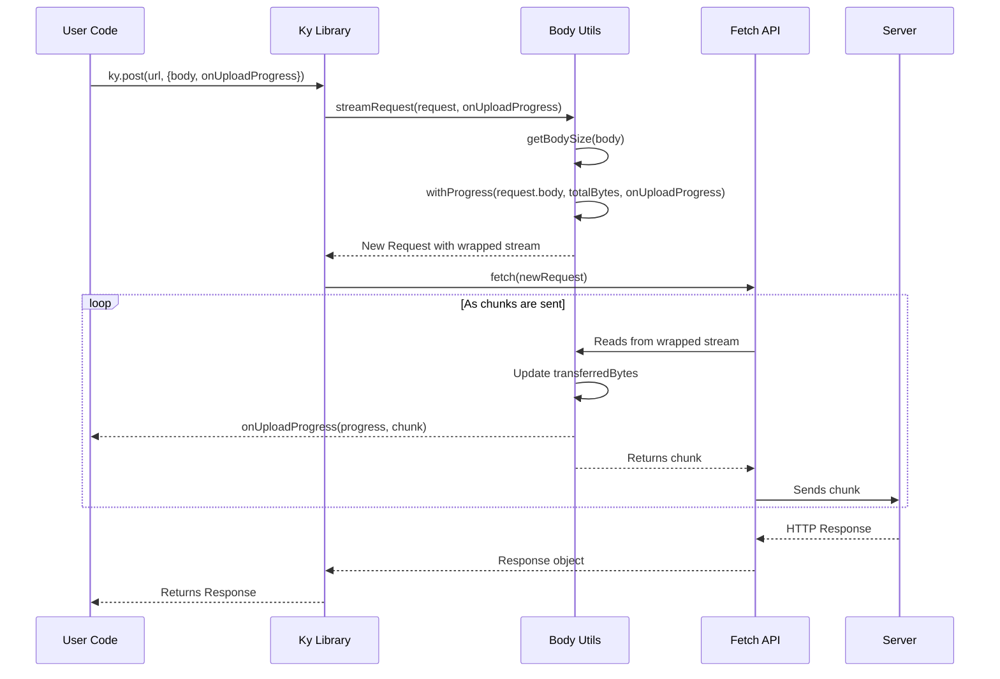
```mermaid
sequenceDiagram
    participant User as User Code
    participant Ky as Ky Library
    participant BodyUtils as Body Utils
    participant FetchAPI as Fetch API
    participant Server

    User->>Ky: ky.post(url, {body, onUploadProgress})
    Ky->>BodyUtils: streamRequest(request, onUploadProgress)
    BodyUtils->>BodyUtils: getBodySize(body)
    BodyUtils->>BodyUtils: withProgress(request.body, totalBytes, onUploadProgress)
    BodyUtils-->>Ky: New Request with wrapped stream
    Ky->>FetchAPI: fetch(newRequest)
    loop As chunks are sent
        FetchAPI->>BodyUtils: Reads from wrapped stream
        BodyUtils->>BodyUtils: Update transferredBytes
        BodyUtils-->>User: onUploadProgress(progress, chunk)
        BodyUtils-->>FetchAPI: Returns chunk
        FetchAPI->>Server: Sends chunk
    end
    Server-->>FetchAPI: HTTP Response
    FetchAPI-->>Ky: Response object
    Ky-->>User: Returns Response
```
Sources: [source/utils/body.ts:99-112](https://github.com/sindresorhus/ky/blob/e0fcf780de2bd69af2528e4b7b87ccae6bb727b1/source/utils/body.ts#L99-L112)

### Body Size Calculation

For upload progress, calculating the `totalBytes` is critical. This is handled by the `getBodySize` function, which estimates the size of the request body based on its type.

| Body Type | Size Calculation Method |
|---|---|
| `FormData` | Approximated by summing the byte length of keys, values, and standard form boundaries. |
| `Blob` | `body.size` |
| `ArrayBuffer` or `ArrayBufferView` | `body.byteLength` |
| `string` | Byte length of the UTF-8 encoded string. |
| `URLSearchParams` | Byte length of the stringified parameters. |
| `null` or `undefined` | 0 |

Sources: [source/utils/body.ts:7-44](https://github.com/sindresorhus/ky/blob/e0fcf780de2bd69af2528e4b7b87ccae6bb727b1/source/utils/body.ts#L7-L44), [source/core/constants.ts:2](https://github.com/sindresorhus/ky/blob/e0fcf780de2bd69af2528e4b7b87ccae6bb727b1/source/core/constants.ts#L2)

## Core Progress Logic

Both upload and download progress rely on a shared utility function, `withProgress`, which uses a `TransformStream` to report progress as data flows through it.

Sources: [source/utils/body.ts:46-77](https://github.com/sindresorhus/ky/blob/e0fcf780de2bd69af2528e4b7b87ccae6bb727b1/source/utils/body.ts#L46-L77)

### `withProgress` Function

This function takes a `ReadableStream`, `totalBytes`, and the `onProgress` callback as input. It returns a new `ReadableStream` that is piped through a `TransformStream`.

The stream's logic is as follows:
1.  **`transform(currentChunk, controller)`**:
    *   The incoming chunk (`currentChunk`) is immediately passed downstream using `controller.enqueue()`.
    *   The number of transferred bytes is updated by adding the size of the *previous* chunk. This ensures progress is reported for data that has been successfully processed.
    *   The completion percentage is calculated. To prevent reporting 100% before the stream is fully flushed, the value is capped at `1 - Number.EPSILON` if it reaches 1 or more.
    *   The `onProgress` callback is invoked with the current progress state and the previous chunk.
    *   The `currentChunk` is stored as `previousChunk` for the next iteration.
2.  **`flush()`**:
    *   When the stream is about to close, the `flush` method is called.
    *   It processes the very last chunk, updates `transferredBytes` one final time, and calls `onProgress` with `percent: 1` to signal completion.

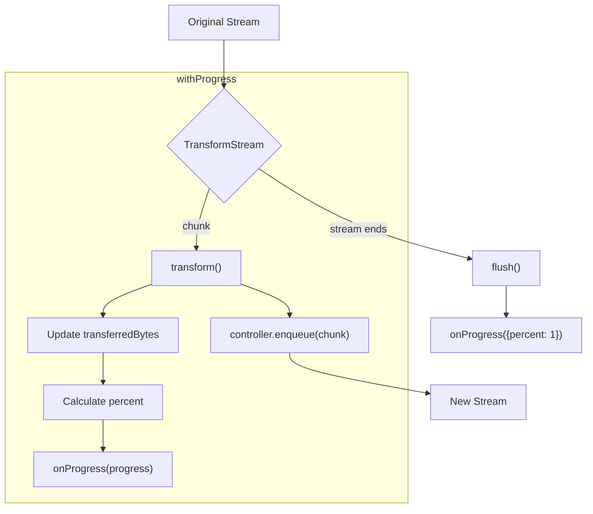
```mermaid
graph TD
    A[Original Stream] --> B{TransformStream};
    subgraph withProgress
        B -- chunk --> C["transform()"];
        C --> D["controller.enqueue(chunk)"];
        C --> E["Update transferredBytes"];
        E --> F["Calculate percent"];
        F --> G["onProgress(progress)"];
    end
    D --> H[New Stream];
    B -- stream ends --> I["flush()"];
    I --> J["onProgress({percent: 1})"];
```
Sources: [source/utils/body.ts:46-77](https://github.com/sindresorhus/ky/blob/e0fcf780de2bd69af2528e4b7b87ccae6bb727b1/source/utils/body.ts#L46-L77)

# Page: Response Schema Validation

<details>
<summary>Relevant source files</summary>

The following files were used as context for generating this wiki page:

- [source/types/ResponsePromise.ts](https://github.com/sindresorhus/ky/blob/e0fcf780de2bd69af2528e4b7b87ccae6bb727b1/source/types/ResponsePromise.ts)
- [source/errors/SchemaValidationError.ts](https://github.com/sindresorhus/ky/blob/e0fcf780de2bd69af2528e4b7b87ccae6bb727b1/source/errors/SchemaValidationError.ts)
- [source/types/standard-schema.ts](https://github.com/sindresorhus/ky/blob/e0fcf780de2bd69af2528e4b7b87ccae6bb727b1/source/types/standard-schema.ts)
</details>

# Response Schema Validation

Ky provides a powerful feature to validate the structure and types of a JSON response against a provided schema directly within the `.json()` method. This is accomplished by passing a schema object that conforms to the [Standard Schema](https://github.com/standard-schema/standard-schema) interface. When validation fails, Ky throws a specific `SchemaValidationError`, which contains detailed information about the validation issues. This allows for robust, type-safe data fetching and parsing in a single, fluent step.

This validation occurs after a successful HTTP request (i.e., with a 2xx status code) and after the response body has been parsed as JSON. The error thrown upon validation failure is distinct from HTTP-related errors, signaling that the server responded successfully but the data did not match the client's expectations.

Sources: [source/types/ResponsePromise.ts:50-54](https://github.com/sindresorhus/ky/blob/e0fcf780de2bd69af2528e4b7b87ccae6bb727b1/source/types/ResponsePromise.ts#L50-L54), [source/errors/SchemaValidationError.ts:4-7](https://github.com/sindresorhus/ky/blob/e0fcf780de2bd69af2528e4b7b87ccae6bb727b1/source/errors/SchemaValidationError.ts#L4-L7)

## API and Usage

To validate a JSON response, pass a schema object as the first argument to the `.json()` method on the `ResponsePromise`. If the response body successfully validates against the schema, the promise resolves with the parsed and validated data, correctly typed according to the schema's output type.

```typescript
import ky from 'ky';
import {z} from 'zod';

// Example schema using Zod, which is compatible with Standard Schema
const userSchema = z.object({
    name: z.string(),
    email: z.string().email(),
});

// The type of `user` will be inferred as `{name: string, email: string}`
const user = await ky.get('https://api.example.com/user/1').json(userSchema);

console.log(user.name);
```

The method signature for this functionality is defined as an overload on the `json` property of `ResponsePromise`.

```typescript
// source/types/ResponsePromise.ts

json: {
    // ... standard .json() without schema
    <Schema extends StandardSchemaV1>(schema: Schema): Promise<StandardSchemaV1InferOutput<Schema>>;
};
```

This design allows for seamless integration with any validation library that implements the Standard Schema interface, such as Zod (version 3.24+).

Sources: [source/types/ResponsePromise.ts:50-66](https://github.com/sindresorhus/ky/blob/e0fcf780de2bd69af2528e4b7b87ccae6bb727b1/source/types/ResponsePromise.ts#L50-L66)

### Validation Flow

The following diagram illustrates the process flow when `.json(schema)` is called.

```mermaid
graph TD
    A[Start] --> B["Call ky(...).json(schema)"];
    B --> C{HTTP Request Successful?};
    C -- No --> D["Throw HTTPError"];
    C -- Yes --> E[Parse Response Body as JSON];
    E --> F["Call schema.validate(parsedJson)"];
    F --> G{Validation Succeeded?};
    G -- Yes --> H["Promise resolves with validated data"];
    G -- No --> I["Throw SchemaValidationError"];
    H --> J[End];
    I --> J;
    D --> J;
```

This flow demonstrates that schema validation is the final step, occurring only after a successful network response and JSON parsing.

Sources: [source/types/ResponsePromise.ts:50-66](https://github.com/sindresorhus/ky/blob/e0fcf780de2bd69af2528e4b7b87ccae6bb727b1/source/types/ResponsePromise.ts#L50-L66), [source/errors/SchemaValidationError.ts:4-7](https://github.com/sindresorhus/ky/blob/e0fcf780de2bd69af2528e4b7b87ccae6bb727b1/source/errors/SchemaValidationError.ts#L4-L7)

## The Standard Schema Interface

Ky's validation feature is built upon a generic interface named `StandardSchemaV1`. Any validation library that provides an object conforming to this interface can be used.

Sources: [source/types/standard-schema.ts:27-37](https://github.com/sindresorhus/ky/blob/e0fcf780de2bd69af2528e4b7b87ccae6bb727b1/source/types/standard-schema.ts#L27-L37)

### `StandardSchemaV1` Structure

The core components of the `StandardSchemaV1` type are defined within a `~standard` property to avoid conflicts with properties from the validation library itself.

| Property    | Type                                                                                              | Description                                                                                                                              |
| :---------- | :------------------------------------------------------------------------------------------------ | :--------------------------------------------------------------------------------------------------------------------------------------- |
| `version`   | `1`                                                                                               | The version of the Standard Schema interface. Currently must be `1`.                                                                     |
| `vendor`    | `string`                                                                                          | A string identifying the validation library, for example, `'zod'`.                                                                       |
| `validate`  | `(value: unknown, options?: ...) => StandardSchemaV1Result<OutputType> \| Promise<...>`             | The function that performs the validation. It takes the parsed JSON as input and returns a result object, which can be synchronous or async. |
| `types`     | `{ input: InputType; output: OutputType; }`                                                       | An optional property used to provide explicit input and output types for improved type inference.                                        |

Sources: [source/types/standard-schema.ts:27-37](https://github.com/sindresorhus/ky/blob/e0fcf780de2bd69af2528e4b7b87ccae6bb727b1/source/types/standard-schema.ts#L27-L37)

### Validation Result

The `validate` function must return a `StandardSchemaV1Result` object, which is a union of a success or failure result.

```mermaid
graph TD
    subgraph StandardSchemaV1Result
        direction TD
        A["StandardSchemaV1SuccessResult<OutputType>"]
        B["StandardSchemaV1FailureResult"]
    end

    C("validate()") -- returns --> D{StandardSchemaV1Result};
    D -- "On Success" --> A;
    D -- "On Failure" --> B;

    A -- contains --> E["value: OutputType"];
    B -- contains --> F["issues: StandardSchemaV1Issue[]"];
```

-   **`StandardSchemaV1SuccessResult<OutputType>`**: Contains the validated (and possibly transformed) `value`.
-   **`StandardSchemaV1FailureResult`**: Contains an `issues` array detailing the validation errors.

Sources: [source/types/standard-schema.ts:6-16](https://github.com/sindresorhus/ky/blob/e0fcf780de2bd69af2528e4b7b87ccae6bb727b1/source/types/standard-schema.ts#L6-L16)

### Validation Issues

When validation fails, the `issues` array is populated with objects conforming to the `StandardSchemaV1Issue` type.

| Property  | Type                                                              | Description                                                              |
| :-------- | :---------------------------------------------------------------- | :----------------------------------------------------------------------- |
| `message` | `string`                                                          | A human-readable description of the validation error.                    |
| `path`    | `ReadonlyArray<PropertyKey \| {readonly key: PropertyKey}>` (optional) | The path to the property within the object that failed validation. |

Sources: [source/types/standard-schema.ts:1-4](https://github.com/sindresorhus/ky/blob/e0fcf780de2bd69af2528e4b7b87ccae6bb727b1/source/types/standard-schema.ts#L1-L4)

## Error Handling: `SchemaValidationError`

If the schema's `validate` function returns a failure result, Ky will throw a `SchemaValidationError`.

```typescript
import ky, { SchemaValidationError } from 'ky';
import { z } from 'zod';

const userSchema = z.object({ name: z.string() });

try {
    // Assuming the API returns { name: 123 } which is invalid
    const user = await ky.post('/api/user').json(userSchema);
} catch (error) {
    if (error instanceof SchemaValidationError) {
        // The request was successful, but the response body is invalid.
        console.error('Schema validation failed:');
        // error.issues is [{ message: 'Expected string, received number', path: ['name'] }]
        console.error(error.issues);
    }
}
```

Key characteristics of this error:
-   **`name`**: The `name` property is always `'SchemaValidationError'`.
-   **`issues`**: A `readonly` array of `StandardSchemaV1Issue` objects detailing each validation failure.
-   **Not a `KyError`**: It intentionally does not extend `KyError`. This is because a schema validation failure is not an HTTP or network failure; the request itself succeeded. This means it will not be caught by helpers like `isKyError()`.

Sources: [source/errors/SchemaValidationError.ts:4-33](https://github.com/sindresorhus/ky/blob/e0fcf780de2bd69af2528e4b7b87ccae6bb727b1/source/errors/SchemaValidationError.ts#L4-L33)

### Error Handling Sequence

The following sequence diagram shows how a `SchemaValidationError` is generated and thrown.

```mermaid
sequenceDiagram
    participant UserCode
    participant Ky
    participant SchemaValidator

    UserCode->>Ky: .json(schema)
    Note over Ky: Performs fetch, handles HTTP status
    Ky->>SchemaValidator: validate(responseJson)
    SchemaValidator-->>Ky: Returns FailureResult with issues
    Note over Ky: Catches failure result
    Ky->>Ky: new SchemaValidationError(issues)
    Ky-->>xUserCode: Rejects promise with SchemaValidationError
```

This illustrates the clear separation of concerns: Ky handles the HTTP lifecycle, and the schema validator handles data validation. Ky bridges the two by translating a validation failure into a `SchemaValidationError`.

Sources: [source/errors/SchemaValidationError.ts:25-33](https://github.com/sindresorhus/ky/blob/e0fcf780de2bd69af2528e4b7b87ccae6bb727b1/source/errors/SchemaValidationError.ts#L25-L33), [source/types/standard-schema.ts:11-14](https://github.com/sindresorhus/ky/blob/e0fcf780de2bd69af2528e4b7b87ccae6bb727b1/source/types/standard-schema.ts#L11-L14)

## Type Inference

Ky provides strong type inference for the validated data through the `StandardSchemaV1InferOutput<Schema>` utility type. This allows TypeScript to know the exact shape of the data returned from a successful `.json(schema)` call.

The inference logic works as follows:
1.  It first attempts to read the output type from the optional `types.output` property on the schema (`Schema['~standard']['types']['output']`).
2.  If the `types` property is not defined, it infers the output type from the return signature of the `validate` function. Specifically, it extracts the generic `OutputType` from the `StandardSchemaV1SuccessResult<OutputType>`.

This dual approach ensures that types can be inferred correctly for a wide range of schema definitions, whether they explicitly declare their output type or not.

Sources: [source/types/standard-schema.ts:39-48](https://github.com/sindresorhus/ky/blob/e0fcf780de2bd69af2528e4b7b87ccae6bb727b1/source/types/standard-schema.ts#L39-L48), [source/types/ResponsePromise.ts:65](https://github.com/sindresorhus/ky/blob/e0fcf780de2bd69af2528e4b7b87ccae6bb727b1/source/types/ResponsePromise.ts#L65)

# Page: Error Handling Overview

<details>
<summary>Relevant source files</summary>

The following files were used as context for generating this wiki page:

- [readme.md](https://github.com/sindresorhus/ky/blob/e0fcf780de2bd69af2528e4b7b87ccae6bb727b1/readme.md)
- [source/errors/KyError.ts](https://github.com/sindresorhus/ky/blob/e0fcf780de2bd69af2528e4b7b87ccae6bb727b1/source/errors/KyError.ts)
- [source/core/Ky.ts](https://github.com/sindresorhus/ky/blob/e0fcf780de2bd69af2528e4b7b87ccae6bb727b1/source/core/Ky.ts)
</details>

# Error Handling Overview

Ky simplifies the native Fetch API by providing a robust and intuitive error handling mechanism. By default, it treats all non-2xx status codes as errors, throwing specialized `Error` subclasses that contain rich contextual information about the failed request and response. This eliminates the need for manual checks like `if (!response.ok)` common with `fetch`.

The error handling system is highly customizable through options like `throwHttpErrors` and a powerful hooks system. Hooks such as `beforeError` and `beforeRetry` allow developers to intercept, modify, and react to errors during the request lifecycle, enabling complex logic like token refreshing, custom logging, and dynamic retry strategies.

Sources: [readme.md:47](https://github.com/sindresorhus/ky/blob/e0fcf780de2bd69af2528e4b7b87ccae6bb727b1/readme.md#L47), [readme.md:721-734](https://github.com/sindresorhus/ky/blob/e0fcf780de2bd69af2528e4b7b87ccae6bb727b1/readme.md#L721-L734), [readme.md:442-448](https://github.com/sindresorhus/ky/blob/e0fcf780de2bd69af2528e4b7b87ccae6bb727b1/readme.md#L442-L448)

## Core Error Philosophy

The primary design principle behind Ky's error handling is to fail fast and provide developers with actionable error objects.

### Automatic Error Throwing

By default, Ky throws an `HTTPError` if the response status code is not in the 200-299 range after all redirects are followed. This behavior is controlled by the `throwHttpErrors` option.

| Option              | Type                               | Default | Description                                                                                                                                                             |
| ------------------- | ---------------------------------- | ------- | ----------------------------------------------------------------------------------------------------------------------------------------------------------------------- |
| `throwHttpErrors`   | `boolean` \| `(status: number) => boolean` | `true`  | When `true`, throws `HTTPError` for non-2xx responses. When `false`, error responses are returned normally. A function can be provided for selective error throwing. |

Setting `throwHttpErrors` to `false` prevents Ky from throwing for bad HTTP statuses, which can be useful for scenarios where error responses are an expected part of the application flow. Note that if this is `false`, failed requests will not be retried.

Sources: [readme.md:721-734](https://github.com/sindresorhus/ky/blob/e0fcf780de2bd69af2528e4b7b87ccae6bb727b1/readme.md#L721-L734), [source/core/Ky.ts:200-204](https://github.com/sindresorhus/ky/blob/e0fcf780de2bd69af2528e4b7b87ccae6bb727b1/source/core/Ky.ts#L200-L204), [source/core/Ky.ts:378](https://github.com/sindresorhus/ky/blob/e0fcf780de2bd69af2528e4b7b87ccae6bb727b1/source/core/Ky.ts#L378)

## The `KyError` Hierarchy

All errors originating from Ky's HTTP lifecycle extend the `KyError` base class. This allows for easy identification of Ky-specific errors using `instanceof KyError` or the `isKyError()` type guard.

It is important to note that `SchemaValidationError` does not extend `KyError`, as it represents a failure in user-provided validation, not a failure of the HTTP request itself.

Sources: [source/errors/KyError.ts:1-14](https://github.com/sindresorhus/ky/blob/e0fcf780de2bd69af2528e4b7b87ccae6bb727b1/source/errors/KyError.ts#L1-L14), [readme.md:1218-1226](https://github.com/sindresorhus/ky/blob/e0fcf780de2bd69af2528e4b7b87ccae6bb727b1/readme.md#L1218-L1226)

The class hierarchy is as follows:

```mermaid
classDiagram
    direction TD
    class Error {
        <<interface>>
    }
    class KyError {
        +isKyError: true
    }
    class HTTPError {
        +request: Request
        +response: Response
        +options: NormalizedOptions
        +data: unknown
    }
    class NetworkError {
        +request: Request
        +cause: Error
    }
    class TimeoutError {
        +request: Request
    }
    class ForceRetryError {
        +customRequest?: Request
        +customDelay?: number
    }
    class SchemaValidationError {
        +issues: object[]
    }

    Error <|-- KyError
    KyError <|-- HTTPError
    KyError <|-- NetworkError
    KyError <|-- TimeoutError
    KyError <|-- ForceRetryError
    Error <|-- SchemaValidationError
```
*This diagram illustrates the inheritance structure of error classes in Ky.*

Sources: [source/errors/KyError.ts:8](https://github.com/sindresorhus/ky/blob/e0fcf780de2bd69af2528e4b7b87ccae6bb727b1/source/errors/KyError.ts#L8), [readme.md:1218-1226](https://github.com/sindresorhus/ky/blob/e0fcf780de2bd69af2528e4b7b87ccae6bb727b1/readme.md#L1218-L1226), [source/core/Ky.ts:1-6](https://github.com/sindresorhus/ky/blob/e0fcf780de2bd69af2528e4b7b87ccae6bb727b1/source/core/Ky.ts#L1-L6)

## Specific Error Types

### `HTTPError`

Thrown for responses with a non-2xx status code when `throwHttpErrors` is enabled. This is the most common error type.

**Key Properties:**
*   `request`: The final `Request` object that was sent.
*   `response`: The `Response` object received from the server.
*   `options`: The normalized Ky options used for the request.
*   `data`: The pre-parsed response body. Ky attempts to parse JSON responses and falls back to text for other content types. The body is read with a timeout and is limited to 10 MiB to prevent excessive buffering.

The response body is consumed to populate `error.data`, so methods like `error.response.json()` will not work.

Sources: [readme.md:1239-1249](https://github.com/sindresorhus/ky/blob/e0fcf780de2bd69af2528e4b7b87ccae6bb727b1/readme.md#L1239-L1249), [source/core/Ky.ts:208](https://github.com/sindresorhus/ky/blob/e0fcf780de2bd69af2528e4b7b87ccae6bb727b1/source/core/Ky.ts#L208), [source/core/Ky.ts:44](https://github.com/sindresorhus/ky/blob/e0fcf780de2bd69af2528e4b7b87ccae6bb727b1/source/core/Ky.ts#L44), [source/core/Ky.ts:609-633](https://github.com/sindresorhus/ky/blob/e0fcf780de2bd69af2528e4b7b87ccae6bb727b1/source/core/Ky.ts#L609-L633)

### `NetworkError`

Thrown when a network-level error occurs (e.g., DNS failure, connection refused). These errors are automatically retried for idempotent HTTP methods by default.

**Key Properties:**
*   `request`: The `Request` object for the failed request.
*   `cause`: The original error thrown by the underlying fetch implementation.

Sources: [readme.md:1322-1342](https://github.com/sindresorhus/ky/blob/e0fcf780de2bd69af2528e4b7b87ccae6bb727b1/readme.md#L1322-L1342), [source/core/Ky.ts:978-980](https://github.com/sindresorhus/ky/blob/e0fcf780de2bd69af2528e4b7b87ccae6bb727b1/source/core/Ky.ts#L978-L980)

### `TimeoutError`

Thrown when a request exceeds the configured `timeout` (per-attempt) or `totalTimeout` (for the entire operation including retries).

**Key Properties:**
*   `request`: The `Request` object that timed out.

Sources: [readme.md:1306-1320](https://github.com/sindresorhus/ky/blob/e0fcf780de2bd69af2528e4b7b87ccae6bb727b1/readme.md#L1306-L1320), [source/core/Ky.ts:6](https://github.com/sindresorhus/ky/blob/e0fcf780de2bd69af2528e4b7b87ccae6bb727b1/source/core/Ky.ts#L6), [source/core/Ky.ts:763](https://github.com/sindresorhus/ky/blob/e0fcf780de2bd69af2528e4b7b87ccae6bb727b1/source/core/Ky.ts#L763)

### `SchemaValidationError`

Thrown by `.json(schema)` when the response body fails validation against the provided Standard Schema.

**Key Properties:**
*   `issues`: An array of validation issues from the schema validator.

This error does not extend `KyError` and will not be handled by `beforeError` hooks in the same way as other Ky errors.

Sources: [readme.com:1284-1304](https://github.com/sindresorhus/ky/blob/e0fcf780de2bd69af2528e4b7b87ccae6bb727b1/readme.com#L1284-L1304), [source/core/Ky.ts:5](https://github.com/sindresorhus/ky/blob/e0fcf780de2bd69af2528e4b7b87ccae6bb727b1/source/core/Ky.ts#L5), [source/core/Ky.ts:136](https://github.com/sindresorhus/ky/blob/e0fcf780de2bd69af2528e4b7b87ccae6bb727b1/source/core/Ky.ts#L136)

### `ForceRetryError`

This is an internal error used to signal a retry from an `afterResponse` hook via `ky.retry()`. It is caught internally and triggers the retry flow. The error instance is then passed to `beforeRetry` hooks, allowing them to identify retries that were forced programmatically.

Sources: [readme.md:1081-1084](https://github.com/sindresorhus/ky/blob/e0fcf780de2bd69af2528e4b7b87ccae6bb727b1/readme.md#L1081-L1084), [source/core/Ky.ts:4](https://github.com/sindresorhus/ky/blob/e0fcf780de2bd69af2528e4b7b87ccae6bb727b1/source/core/Ky.ts#L4), [source/core/Ky.ts:820](https://github.com/sindresorhus/ky/blob/e0fcf780de2bd69af2528e4b7b87ccae6bb727b1/source/core/Ky.ts#L820)

## Error Handling Lifecycle and Hooks

Ky provides hooks that allow interception and modification at various points in the request and error lifecycle.

```mermaid
sequenceDiagram
    participant User
    participant Ky
    participant Fetch
    participant Hooks

    User->>Ky: ky(url, options)
    Ky->>Fetch: fetch(request)
    alt Network/Timeout Error
        Fetch->>xKy: Error
        Ky->>Hooks: beforeRetry(error)
        alt Retry allowed
            Hooks-->>Ky: Continue
            Ky-->>Ky: Wait for delay
            Ky->>Fetch: fetch(request)
        else Stop retry
            Hooks-->>Ky: Stop/Throw
            Ky->>Hooks: beforeError(error)
            Hooks-->>Ky: Modified Error
            Ky->>xUser: Throw Error
        end
    else HTTP Response
        Fetch-->>Ky: Response
        Ky->>Hooks: afterResponse(response)
        alt Force Retry
            Hooks-->>Ky: ky.retry()
            Ky->>Hooks: beforeRetry(ForceRetryError)
            note over Ky,Hooks: Retry logic continues...
        else Response OK
            Hooks-->>Ky: Response
            Ky-->>User: Return Response
        else HTTP Error
            Hooks-->>Ky: Response
            Ky->>Ky: Create HTTPError
            Ky->>Hooks: beforeRetry(HTTPError)
            note over Ky,Hooks: Retry logic continues...
        end
    end
```
*This diagram shows the sequence of events during a request, highlighting where errors can occur and when hooks are triggered.*

Sources: [source/core/Ky.ts:153-288](https://github.com/sindresorhus/ky/blob/e0fcf780de2bd69af2528e4b7b87ccae6bb727b1/source/core/Ky.ts#L153-L288), [source/core/Ky.ts:844-928](https://github.com/sindresorhus/ky/blob/e0fcf780de2bd69af2528e4b7b87ccae6bb727b1/source/core/Ky.ts#L844-L928)

### Retry Mechanism

Ky can automatically retry failed requests. The behavior is configured via the `retry` option. Retries are triggered by `NetworkError`, `TimeoutError` (if `retryOnTimeout: true`), `ForceRetryError`, or `HTTPError` with a status code matching `retry.statusCodes`.

The `shouldRetry` function can be used to implement custom retry logic that overrides the default checks.

Sources: [readme.md:275-402](https://github.com/sindresorhus/ky/blob/e0fcf780de2bd69af2528e4b7b87ccae6bb727b1/readme.md#L275-L402), [source/core/Ky.ts:504-590](https://github.com/sindresorhus/ky/blob/e0fcf780de2bd69af2528e4b7b87ccae6bb727b1/source/core/Ky.ts#L504-L590)

### `hooks.beforeRetry`

This hook is executed after a failure has been deemed retriable but before the next attempt is made. It receives the error that caused the failure and can be used to modify the request for the next attempt, for example, by refreshing an authentication token.

A `beforeRetry` hook can prevent further retries by throwing an error or returning the `ky.stop` symbol.

Sources: [readme.md:527-543](https://github.com/sindresorhus/ky/blob/e0fcf780de2bd69af2528e4b7b87ccae6bb727b1/readme.md#L527-L543), [source/core/Ky.ts:886-922](https://github.com/sindresorhus/ky/blob/e0fcf780de2bd69af2528e4b7b87ccae6bb727b1/source/core/Ky.ts#L886-L922)

### `hooks.beforeError`

This is the final hook in the error-handling chain. It runs just before an error is thrown to the user, after all retry attempts have been exhausted or if a non-retriable error occurs. It allows for last-minute modification of the error object, such as adding custom context or re-formatting the error message.

```javascript
import ky, {isHTTPError} from 'ky';

await ky('https://example.com', {
	hooks: {
		beforeError: [
			({error}) => {
				if (isHTTPError(error)) {
                    // Add parsed error data to the message
					if (error.data?.message) {
						error.message = `${error.message}: ${error.data.message}`;
					}
				}
				return error;
			}
		]
	}
});
```
*Example of using `beforeError` to enhance an `HTTPError` message.*

Sources: [readme.md:607-645](https://github.com/sindresorhus/ky/blob/e0fcf780de2bd69af2528e4b7b87ccae6bb727b1/readme.md#L607-L645), [source/core/Ky.ts:270-285](https://github.com/sindresorhus/ky/blob/e0fcf780de2bd69af2528e4b7b87ccae6bb727b1/source/core/Ky.ts#L270-L285)

## General Error Flow

The following flowchart illustrates the complete error handling and retry process within Ky.

```mermaid
graph TD
    A[Start Request] --> B{Run beforeRequest hooks};
    B --> C{Execute fetch};
    C --> D{Error?};
    D -- Yes --> E["Create Error (Network/Timeout)"];
    D -- No --> F[Response Received];
    F --> G{Run afterResponse hooks};
    G --> H{"Hook returned ky.retry()?"};
    H -- Yes --> I[Create ForceRetryError];
    H -- No --> J{"Response OK? (2xx)"};
    J -- No --> K{throwHttpErrors enabled?};
    J -- Yes --> Z[Return Response];
    K -- Yes --> L[Create HTTPError];
    K -- No --> Z;
    
    subgraph Retry Logic
        E --> M;
        I --> M;
        L --> M{Calculate Retry Delay};
        M --> N{"Retryable? (method, status, shouldRetry)"};
        N -- No --> X[Run beforeError hooks];
        N -- Yes --> P{Retry limit exceeded?};
        P -- Yes --> X;
        P -- No --> Q[Wait for delay];
        Q --> R{Run beforeRetry hooks};
        R --> S{Hook stopped retry?};
        S -- Yes --> Y[Throw Error / Return undefined];
        S -- No --> C;
    end

    X --> Y;
    Y --> Z;
    Z[End];
```

Sources: [source/core/Ky.ts](https://github.com/sindresorhus/ky/blob/e0fcf780de2bd69af2528e4b7b87ccae6bb727b1/source/core/Ky.ts)

# Page: Custom Error Types

<details>
<summary>Relevant source files</summary>

The following files were used as context for generating this wiki page:

- [source/errors/HTTPError.ts](https://github.com/sindresorhus/ky/blob/e0fcf780de2bd69af2528e4b7b87ccae6bb727b1/source/errors/HTTPError.ts)
- [source/errors/NetworkError.ts](https://github.com/sindresorhus/ky/blob/e0fcf780de2bd69af2528e4b7b87ccae6bb727b1/source/errors/NetworkError.ts)
- [source/errors/TimeoutError.ts](https://github.com/sindresorhus/ky/blob/e0fcf780de2bd69af2528e4b7b87ccae6bb727b1/source/errors/TimeoutError.ts)
- [source/errors/SchemaValidationError.ts](https://github.com/sindresorhus/ky/blob/e0fcf780de2bd69af2528e4b7b87ccae6bb727b1/source/errors/SchemaValidationError.ts)
- [source/errors/KyError.ts](https://github.com/sindresorhus/ky/blob/e0fcf780de2bd69af2528e4b7b87ccae6bb727b1/source/errors/KyError.ts)
</details>

# Custom Error Types

The `ky` library provides a set of custom error classes to offer detailed, actionable information when requests fail. These errors are designed to clearly distinguish between different failure modes, such as network issues, non-successful HTTP status codes, and timeouts. All errors related to the HTTP request lifecycle inherit from a common `KyError` base class, allowing for easy identification and handling.

A special error, `SchemaValidationError`, is thrown for data validation failures and intentionally does not inherit from `KyError`, as it represents a successful request followed by a data-level rejection by the user's schema, not a failure in the HTTP transaction itself. This distinction helps in routing error handling logic appropriately.

Sources: [`source/errors/KyError.ts:2-7`]()

## Error Class Hierarchy

The error types in `ky` form a clear inheritance structure, with most custom errors extending the `KyError` base class, which in turn extends the standard JavaScript `Error`. `SchemaValidationError` is a notable exception, extending `Error` directly.

```mermaid
classDiagram
	direction TD
	class Error {
		<<JavaScript Built-in>>
	}
	class KyError {
		+isKyError: true
	}
	class HTTPError {
		+response: KyResponse
		+request: KyRequest
		+options: NormalizedOptions
		+data: T | string | undefined
	}
	class NetworkError {
		+request: KyRequest
	}
	class TimeoutError {
		+request: KyRequest
	}
	class SchemaValidationError {
		+issues: readonly StandardSchemaV1Issue[]
	}

	Error <|-- KyError
	Error <|-- SchemaValidationError
	KyError <|-- HTTPError
	KyError <|-- NetworkError
	KyError <|-- TimeoutError
```
*This diagram illustrates the inheritance relationships between the standard `Error` class and Ky's custom error types.*

Sources: [`source/errors/KyError.ts:8`](), [`source/errors/HTTPError.ts:15`](), [`source/errors/NetworkError.ts:11`](), [`source/errors/TimeoutError.ts:7`](), [`source/errors/SchemaValidationError.ts:25`]()

## The `KyError` Base Class

`KyError` serves as the base class for all errors originating from the `ky` HTTP request lifecycle. This includes `HTTPError`, `NetworkError`, and `TimeoutError`. Its primary purpose is to provide a reliable way to check if an error originated from `ky`.

You can check for this using `instanceof KyError` or by accessing the `isKyError` getter property, which always returns `true`. This is particularly useful for type-guarding in TypeScript.

Sources: [`source/errors/KyError.ts:2-5`](), [`source/errors/KyError.ts:11-13`]()

## HTTP Lifecycle Errors

These errors represent failures that occur during the network request, response, or timeout phases. They all extend `KyError`.

### `HTTPError`

This is the most common error, thrown when a response is received with a non-2xx status code and the `throwHttpErrors` option is enabled. It contains rich context about both the request and the response.

The `HTTPError` constructor builds a descriptive message, for example: `Request failed with status code 404 Not Found: GET https://example.com/foo`.

Sources: [`source/errors/HTTPError.ts:7`](), [`source/errors/HTTPError.ts:22-28`]()

**Properties**

| Property  | Type                               | Description - |
| `response`  | `KyResponse<T>`                    | The `Response` object. Note that its body is already consumed to populate the `data` property. - |
- `request`   | `KyRequest`                        | The `Request` object that initiated the call.                                                                                                                                                           -
- `options`   | `NormalizedOptions`                | The normalized `ky` options used for the request. -
- `data`      | `T | string | undefined`          | The pre-parsed response body. It is parsed as JSON if the `Content-Type` indicates it, otherwise it's plain text. It will be `undefined` if the body is empty or parsing fails. The population of this property is bounded by the request timeout and a 10 MiB size limit. |

Sources: [`source/errors/HTTPError.ts:9-11`](), [`source/-errors/HTTPError.ts:17-20`]()

### `NetworkError`

A `NetworkError` is thrown when a request fails due to a network-level issue, such as a DNS failure, a refused connection, or the client being offline. These errors are automatically retried for retriable HTTP methods.

The original error that caused the network failure is available via the standard `cause` property on the error instance.

Sources: [`source/errors/NetworkError.ts:5-7`](), [`source/errors/NetworkError.ts:11-18`]()

### `TimeoutError`

A `TimeoutError` is thrown when a request does not complete within the specified `timeout` duration in the `ky` options. It contains the original `Request` object for context.

Sources: [`source/errors/TimeoutError.ts:5`](), [`source/errors/TimeoutError.ts:7-14`]()

## Data Validation Errors

### `SchemaValidationError`

This error is unique because it signals that the HTTP request itself was successful (i.e., a response was received), but the response body failed to validate against a user-provided schema. This occurs when using the `.json(schema)` method.

Key characteristics:
- It extends the standard `Error` class, **not** `KyError`.
- It is not matched by `isKyError()` or `instanceof KyError`.
- It contains an `issues` property, which is an array of validation issues reported by the schema validator.

Sources: [`source/errors/SchemaValidationError.ts:4-7`](), [`source/errors/SchemaValidationError.ts:25-32`]()

Here is an example of how to catch and handle this specific error:
```typescript
import ky, {SchemaValidationError} from 'ky';
import {z} from 'zod';

const userSchema = z.object({name: z.string()});

try {
	const user = await ky('/api/user').json(userSchema);
	console.log(user.name);
} catch (error) {
	if (error instanceof SchemaValidationError) {
		console.error(error.issues);
	}
}
```
Sources: [`source/errors/SchemaValidationError.ts:9-23`]()

## Error Handling Flow

The following diagram illustrates the process by which `ky` determines which error to throw during a request's lifecycle.

```mermaid
graph TD
    A[Start Request] --> B{Request in flight};
    B --> C{Timeout?};
    C -- Yes --> D[Throw TimeoutError];
    C -- No --> E{Network issue?};
    E -- Yes --> F[Throw NetworkError];
    E -- No --> G{Response received};
    G --> H{Status is 2xx?};
    H -- No --> I[Throw HTTPError];
    H -- Yes --> J{"Using .json(schema)?"};
    J -- No --> K[Success];
    J -- Yes --> L{Schema validation fails?};
    L -- Yes --> M[Throw SchemaValidationError];
    L -- No --> K;
```
*This flowchart shows the decision points in the `ky` request lifecycle that can lead to one of the custom error types being thrown.*

# Page: Creating Instances: create vs. extend

<details>
<summary>Relevant source files</summary>

The following files were used as context for generating this wiki page:

- [source/index.ts](https://github.com/sindresorhus/ky/blob/e0fcf780de2bd69af2528e4b7b87ccae6bb727b1/source/index.ts)
- [source/utils/merge.ts](https://github.com/sindresorhus/ky/blob/e0fcf780de2bd69af2528e4b7b87ccae6bb727b1/source/utils/merge.ts)
</details>

# Creating Instances: create vs. extend

The `ky` library provides the flexibility to create customized instances with predefined default options. This is useful for creating API clients or service-specific configurations. Two primary methods facilitate this: `ky.create()` and `ky.extend()`. While both methods produce a new `KyInstance`, they differ in how they handle default options. `ky.create()` generates a new instance with a completely fresh set of defaults, whereas `ky.extend()` creates a new instance that inherits and merges defaults from its parent.

All instance creation logic is centralized in the `createInstance` function, which configures a new `ky` object with the appropriate methods and merged default options.

Sources: [source/index.ts:10-32](https://github.com/sindresorhus/ky/blob/e0fcf780de2bd69af2528e4b7b87ccae6bb727b1/source/index.ts#L10-L32)

## Instance Creation Flow

Both `create` and `extend` ultimately call the internal `createInstance` function, but they provide different sets of default options to it.

```mermaid
graph TD
    subgraph "User Action"
        A["ky.create(newDefaults)"]
        B["ky.extend(newDefaults)"]
    end

    subgraph "Instance Creation Logic"
        C["createInstance(defaults)"]
        D[ky instance]
    end
    
    subgraph "Option Merging"
        E["validateAndMerge(parentDefaults, newDefaults)"]
        F["validateAndMerge(newDefaults)"]
    end

    A --> F
    B --> E
    E --> C
    F --> C
    C --> D
```
This diagram shows that `extend` merges new defaults with parent defaults before creating the instance, while `create` uses only the new defaults.

Sources: [source/index.ts:19-26](https://github.com/sindresorhus/ky/blob/e0fcf780de2bd69af2528e4b7b87ccae6bb727b1/source/index.ts#L19-L26)

## `ky.create()`

The `ky.create()` method is used to generate a new `ky` instance with a specified set of default options. If called on an existing instance, it does *not* inherit any defaults from that instance. It effectively creates a new, independent instance.

The implementation calls `createInstance` with the result of `validateAndMerge`, passing only the `newDefaults`.

```typescript
// source/index.ts:19
ky.create = (newDefaults?: Partial<Options>) => createInstance(validateAndMerge(newDefaults));
```

This makes `create` ideal for defining completely separate client configurations.

Sources: [source/index.ts:19](https://github.com/sindresorhus/ky/blob/e0fcf780de2bd69af2528e4b7b87ccae6bb727b1/source/index.ts#L19)

## `ky.extend()`

The `ky.extend()` method creates a new `ky` instance that inherits and deep-merges options from its parent instance. This is the primary method for creating specialized clients from a base configuration.

```typescript
// source/index.ts:20-26
ky.extend = (newDefaults?: Partial<Options> | ((parentDefaults: Partial<Options>) => Partial<Options>)) => {
    if (typeof newDefaults === 'function') {
        newDefaults = newDefaults(defaults ?? {});
    }

    return createInstance(validateAndMerge(defaults, newDefaults));
};
```

The key difference from `create` is in the call to `validateAndMerge`: it passes the parent's `defaults` first, followed by the `newDefaults`. This ensures that options are merged on top of the parent's configuration. It also accepts a function to dynamically compute the new defaults based on the parent's defaults.

Sources: [source/index.ts:20-26](https://github.com/sindresorhus/ky/blob/e0fcf780de2bd69af2528e4b7b87ccae6bb727b1/source/index.ts#L20-L26)

### Option Merging Logic

The merging of options is handled by the `validateAndMerge` and `deepMerge` functions. `validateAndMerge` first ensures all provided options are valid objects and then calls `deepMerge` to perform the actual combination.

Sources: [source/utils/merge.ts:54-62](https://github.com/sindresorhus/ky/blob/e0fcf780de2bd69af2528e4b7b87ccae6bb727b1/source/utils/merge.ts#L54-L62)

The `deepMerge` function iterates through sources and combines their properties. It has special handling for several key options:

```mermaid
sequenceDiagram
    participant E as ky.extend()
    participant V as validateAndMerge()
    participant D as deepMerge()
    participant H as mergeHooks()
    participant M as mergeHeaderContainers()
    participant A as appendSearchParameters()

    E->>V: (parentDefaults, newDefaults)
    V->>D: ({}, parentDefaults, newDefaults)
    
    loop For each source
        D->>D: Iterate over properties
        alt key is 'hooks'
            D->>H: (existingHooks, newHooks)
            H-->>D: Merged hooks
        else key is 'headers'
            D->>M: (existingHeaders, newHeaders)
            M-->>D: Merged headers
        else key is 'searchParams'
            D->>A: (existingParams, newParams)
            A-->>D: Merged searchParams
        else key is 'context'
            D->>D: Shallow merge context
        else key is 'signal'
            D->>D: Collect AbortSignals
        else other keys
            D->>D: Deep merge recursively
        end
    end
    
    D-->>V: Merged options object
    V-->>E: Final options
```

Sources: [source/utils/merge.ts:207-312](https://github.com/sindresorhus/ky/blob/e0fcf780de2bd69af2528e4b7b87ccae6bb727b1/source/utils/merge.ts#L207-L312)

### Merging Behavior Summary

The `deepMerge` function applies different strategies for specific `Options` properties.

| Option | Merging Behavior | Source |
| --- | --- | --- |
| `hooks` | Arrays of hooks are concatenated. `undefined` in a source clears the array. | `[source/utils/merge.ts:130-144](https://github.com/sindresorhus/ky/blob/e0fcf780de2bd69af2528e4b7b87ccae6bb727b1/source/utils/merge.ts#L130-L144), [source/utils/merge.ts:274-281](https://github.com/sindresorhus/ky/blob/e0fcf780de2bd69af2528e4b7b87ccae6bb727b1/source/utils/merge.ts#L274-L281)` |
| `headers` | Header objects or `Headers` instances are merged. Values in later sources overwrite earlier ones. `undefined` values delete the header. | `[source/utils/merge.ts:64-78](https://github.com/sindresorhus/ky/blob/e0fcf780de2bd69af2528e4b7b87ccae6bb727b1/source/utils/merge.ts#L64-L78), [source/utils/merge.ts:122-128](https://github.com/sindresorhus/ky/blob/e0fcf780de2bd69af2528e4b7b87ccae6bb727b1/source/utils/merge.ts#L122-L128), [source/utils/merge.ts:283-290](https://github.com/sindresorhus/ky/blob/e0fcf780de2bd69af2528e4b7b87ccae6bb727b1/source/utils/merge.ts#L283-L290)` |
| `searchParams` | Values are appended. Supports `URLSearchParams`, objects, arrays of tuples, and strings. `undefined` values delete the parameter. | `[source/utils/merge.ts:148-204](https://github.com/sindresorhus/ky/blob/e0fcf780de2bd69af2528e4b7b87ccae6bb727b1/source/utils/merge.ts#L148-L204), [source/utils/merge.ts:252-262](https://github.com/sindresorhus/ky/blob/e0fcf780de2bd69af2528e4b7b87ccae6bb727b1/source/utils/merge.ts#L252-L262)` |
| `context` | A shallow merge is performed. The property is always a new object to prevent mutation. | `[source/utils/merge.ts:234-249](https://github.com/sindresorhus/ky/blob/e0fcf780de2bd69af2528e4b7b87ccae6bb727b1/source/utils/merge.ts#L234-L249)` |
| `signal` | Multiple `AbortSignal` instances are collected. If `AbortSignal.any` is supported, they are combined; otherwise, the last signal provided is used. | `[source/utils/merge.ts:224-227](https://github.com/sindresorhus/ky/blob/e0fcf780de2bd69af2528e4b7b87ccae6bb727b1/source/utils/merge.ts#L224-L227), [source/utils/merge.ts:298-309](https://github.com/sindresorhus/ky/blob/e0fcf780de2bd69af2528e4b7b87ccae6bb727b1/source/utils/merge.ts#L298-L309)` |
| Other properties | A recursive deep merge is performed. | `[source/utils/merge.ts:267-269](https://github.com/sindresorhus/ky/blob/e0fcf780de2bd69af2528e4b7b87ccae6bb727b1/source/utils/merge.ts#L267-L269)` |

### Overriding Merging with `replaceOption`

In cases where deep merging is not desired (e.g., for `hooks`), `ky` provides a `replaceOption` utility. This function wraps a value, signaling to `deepMerge` that it should completely replace the existing value from the parent instance instead of merging with it.

It works by wrapping the value in an object with a unique symbol property.

```typescript
// source/utils/merge.ts:6
const replaceSymbol: unique symbol = Symbol('replaceOption');

// source/utils/merge.ts:49-52
export const replaceOption = <T>(value: T): T => {
	const markedValue: ReplaceMarked<T> = {[replaceSymbol]: true, value};
	return markedValue as unknown as T;
};
```

The `deepMerge` function checks for this symbol using `getReplaceState` and, if present, bypasses the merge logic for that property.

```typescript
// source/utils/merge.ts:229-231
const replaceState = getReplaceState(value);
const {isReplace} = replaceState;
value = replaceState.value;
```

This is applied to `hooks`, `headers`, `searchParams`, and `context`.

Sources: [source/utils/merge.ts:6-27](https://github.com/sindresorhus/ky/blob/e0fcf780de2bd69af2528e4b7b87ccae6bb727b1/source/utils/merge.ts#L6-L27), [source/utils/merge.ts:49-52](https://github.com/sindresorhus/ky/blob/e0fcf780de2bd69af2528e4b7b87ccae6bb727b1/source/utils/merge.ts#L49-L52), [source/utils/merge.ts:229-231](https://github.com/sindresorhus/ky/blob/e0fcf780de2bd69af2528e4b7b87ccae6bb727b1/source/utils/merge.ts#L229-L231)

## Summary

Both `ky.create()` and `ky.extend()` are powerful tools for configuring `ky` instances.
- Use `ky.create()` to define a new, standalone client configuration that does not depend on any prior defaults.
- Use `ky.extend()` to build upon an existing configuration, inheriting and selectively overriding options from a parent instance. The deep-merging logic provides granular control, and `replaceOption` offers an escape hatch for when a full replacement is necessary.

# Page: Customizing Fetch and JSON Parsing

<details>
<summary>Relevant source files</summary>

The following files were used as context for generating this wiki page:

- [source/types/options.ts](https://github.com/sindresorhus/ky/blob/e0fcf780de2bd69af2528e4b7b87ccae6bb727b1/source/types/options.ts)
- [readme.md](https://github.com/sindresorhus/ky/blob/e0fcf780de2bd69af2528e4b7b87ccae6bb727b1/readme.md)
</details>

# Customizing Fetch and JSON Parsing

The `ky` library, while providing a simplified interface over the native Fetch API, offers powerful customization options that allow developers to control core aspects of the request and response lifecycle. This includes the ability to substitute the underlying `fetch` implementation and to define custom logic for JSON serialization and deserialization. These features are crucial for advanced use-cases like server-side rendering (SSR), custom instrumentation, enhanced security, and tailored data handling.

Sources: [readme.md:34](https://github.com/sindresorhus/ky/blob/e0fcf780de2bd69af2528e4b7b87ccae6bb727b1/readme.md#L34), [source/types/options.ts:37-38](https://github.com/sindresorhus/ky/blob/e0fcf780de2bd69af2528e4b7b87ccae6bb727b1/source/types/options.ts#L37-L38)

## Overriding the `fetch` Function

Ky allows you to provide a custom `fetch` function via the `fetch` option. This function must be fully compatible with the standard Fetch API. By default, `ky` uses the globally available `fetch` function.

This option is particularly useful for:
1.  Integrating with frameworks that use a `fetch` wrapper for server-side rendering (SSR).
2.  Adding custom instrumentation, metrics, or logging to all outgoing requests.

Sources: [source/types/options.ts:297-304](https://github.com/sindresorhus/ky/blob/e0fcf780de2bd69af2528e4b7b87ccae6bb727b1/source/types/options.ts#L297-L304), [readme.md:855-860](https://github.com/sindresorhus/ky/blob/e0fcf780de2bd69af2528e4b7b87ccae6bb727b1/readme.md#L855-L860)

### Configuration

The `fetch` option is defined in `KyOptions` as follows:

| Option | Type Signature | Default |
| :--- | :--- | :--- |
| `fetch` | `(input: Input, init?: RequestInit) => Promise<Response>` | global `fetch` |

Sources: [source/types/options.ts:304](https://github.com/sindresorhus/ky/blob/e0fcf780de2bd69af2528e4b7b87ccae6bb727b1/source/types/options.ts#L304), [source/types/options.ts:323](https://github.com/sindresorhus/ky/blob/e0fcf780de2bd69af2528e4b7b87ccae6bb727b1/source/types/options.ts#L323)

### Example: Request Logging

A common use-case is to wrap the native `fetch` call to log request duration and status. This can be achieved when creating a `ky` instance.

```javascript
import ky from 'ky';

const api = ky.create({
	fetch: async (request, init) => {
		const start = performance.now();
		const response = await fetch(request, init);
		const duration = performance.now() - start;
		console.log(`${request.method} ${request.url} - ${response.status} (${Math.round(duration)}ms)`);
		return response;
	}
});

const json = await api('https://example.com').json();
```
Sources: [readme.md:863-876](https://github.com/sindresorhus/ky/blob/e0fcf780de2bd69af2528e4b7b87ccae6bb727b1/readme.md#L863-L876)

### Request Flow with Custom Fetch

The following diagram illustrates how a `ky` request is processed when a custom `fetch` function is provided.

```mermaid
sequenceDiagram
    participant UserApp as "User Application"
    participant KyInstance as "ky Instance"
    participant CustomFetch as "Custom fetch()"
    participant NativeFetch as "Native fetch()"

    UserApp->>KyInstance: api('https://example.com').json()
    KyInstance->>CustomFetch: fetch(request, init)
    Note over CustomFetch: Logs start time
    CustomFetch->>NativeFetch: fetch(request, init)
    NativeFetch-->>CustomFetch: Response
    Note over CustomFetch: Logs duration and status
    CustomFetch-->>KyInstance: Response
    KyInstance-->>UserApp: Parsed JSON
```
Sources: [readme.md:865-873](https://github.com/sindresorhus/ky/blob/e0fcf780de2bd69af2528e4b7b87ccae6bb727b1/readme.md#L865-L873)

## Custom JSON Parsing

The `parseJson` option allows for replacing the default `JSON.parse()` behavior with a user-defined function. This provides a hook to process the raw response text before it is returned as a JSON object.

Key use-cases include:
*   Parsing JSON with a security-focused library like `bourne` to prevent prototype pollution.
*   Utilizing the `reviver` option of `JSON.parse()` for data transformation.
*   Implementing custom logging or error handling for JSON parsing failures, with access to the original request and response context.

Sources: [source/types/options.ts:49-57](https://github.com/sindresorhus/ky/blob/e0fcf780de2bd69af2528e4b7b87ccae6bb727b1/source/types/options.ts#L49-L57), [readme.md:800-803](https://github.com/sindresorhus/ky/blob/e0fcf780de2bd69af2528e4b7b87ccae6bb727b1/readme.md#L800-L803)

### Configuration

The `parseJson` function receives the response text and a context object.

| Option | Type Signature | Default |
| :--- | :--- | :--- |
| `parseJson` | `(text: string, context: {request: Request; response: Response}) => unknown` | `JSON.parse()` |

Sources: [source/types/options.ts:58](https://github.com/sindresorhus/ky/blob/e0fcf780de2bd69af2528e4b7b87ccae6bb727b1/source/types/options.ts#L58), [source/types/options.ts:83](https://github.com/sindresorhus/ky/blob/e0fcf780de2bd69af2528e4b7b87ccae6bb727b1/source/types/options.ts#L83)

### Response Flow with `parseJson`

When `.json()` is called on a `ky` response, the library internally uses the `parseJson` function if one is provided.

```mermaid
graph TD
    A["ky(...).json()"] --> B{Response Received};
    B --> C[Read response body as text];
    C --> D{`parseJson` option provided?};
    D -- Yes --> E["Call custom parseJson(text, context)"];
    D -- No --> F["Call JSON.parse(text)"];
    E --> G[Return parsed object];
    F --> G;
```
Sources: [source/types/options.ts:49-58](https://github.com/sindresorhus/ky/blob/e0fcf780de2bd69af2528e4b7b87ccae6bb727b1/source/types/options.ts#L49-L58)

### Example: Secure Parsing with Bourne

To protect against prototype pollution vulnerabilities, the `bourne` library can be used as a drop-in replacement for `JSON.parse`.

```javascript
import ky from 'ky';
import bourne from '@hapijs/bourne';

const json = await ky('https://example.com', {
	parseJson: text => bourne(text)
}).json();
```
Sources: [readme.md:806-812](https://github.com/sindresorhus/ky/blob/e0fcf780de2bd69af2528e4b7b87ccae6bb727b1/readme.md#L806-L812)

### Example: Contextual Logging

The context object passed to `parseJson` is useful for logging, providing details about the request that led to the JSON payload.

```javascript
import ky from 'ky';

const json = await ky('https://example.com', {
	parseJson: (text, {request, response}) => {
		console.log(`Parsing JSON from ${request.url} (status: ${response.status})`);
		return JSON.parse(text);
	}
}).json();
```
Sources: [readme.md:814-823](https://github.com/sindresorhus/ky/blob/e0fcf780de2bd69af2528e4b7b87ccae6bb727b1/readme.md#L814-L823)

## Custom JSON Serialization

Symmetrically to `parseJson`, the `stringifyJson` option allows for overriding the default `JSON.stringify()` behavior when sending JSON data. This is primarily used when you need to customize the serialization process, for example, by providing a `replacer` function.

Sources: [source/types/options.ts:86-90](https://github.com/sindresorhus/ky/blob/e0fcf780de2bd69af2528e4b7b87ccae6bb727b1/source/types/options.ts#L86-L90), [readme.md:830-833](https://github.com/sindresorhus/ky/blob/e0fcf780de2bd69af2528e4b7b87ccae6bb727b1/readme.md#L830-L833)

### Configuration

| Option | Type Signature | Default |
| :--- | :--- | :--- |
| `stringifyJson` | `(data: unknown) => string` | `JSON.stringify()` |

Sources: [source/types/options.ts:91](https://github.com/sindresorhus/ky/blob/e0fcf780de2bd69af2528e4b7b87ccae6bb727b1/source/types/options.ts#L91), [source/types/options.ts:109](https://github.com/sindresorhus/ky/blob/e0fcf780de2bd69af2528e4b7b87ccae6bb727b1/source/types/options.ts#L109)

### Example: Custom Serialization with a Replacer

This example demonstrates using `stringifyJson` to convert `DateTime` objects from the `luxon` library into Unix timestamps before sending the request.

```javascript
import ky from 'ky';
import {DateTime} from 'luxon';

const json = await ky('https://example.com', {
	stringifyJson: data => JSON.stringify(data, (key, value) => {
		if (key.endsWith('_at')) {
			return DateTime.fromISO(value).toSeconds();
		}

		return value;
	})
}).json();
```
Sources: [readme.md:836-848](https://github.com/sindresorhus/ky/blob/e0fcf780de2bd69af2528e4b7b87ccae6bb727b1/readme.md#L836-L848)

## Summary

Ky's architecture provides flexible extension points for fundamental operations. By leveraging the `fetch`, `parseJson`, and `stringifyJson` options, developers can adapt `ky` to various environments and requirements. These options enable seamless integration with SSR frameworks, facilitate robust logging and instrumentation, and allow for customized and secure handling of JSON data, all while maintaining the simple and elegant API that `ky` is known for.

Sources: [readme.md:34-35](https://github.com/sindresorhus/ky/blob/e0fcf780de2bd69af2528e4b7b87ccae6bb727b1/readme.md#L34-L35), [source/types/options.ts:40](https://github.com/sindresorhus/ky/blob/e0fcf780de2bd69af2528e4b7b87ccae6bb727b1/source/types/options.ts#L40)

# Page: Authentication and Token Refresh

<details>
<summary>Relevant source files</summary>

The following files were used as context for generating this wiki page:

- [readme.md](https://github.com/sindresorhus/ky/blob/e0fcf780de2bd69af2528e4b7b87ccae6bb727b1/readme.md)
- [source/types/hooks.ts](https://github.com/sindresorhus/ky/blob/e0fcf780de2bd69af2528e4b7b87ccae6bb727b1/source/types/hooks.ts)
</details>

# Authentication and Token Refresh

The `ky` HTTP client provides a flexible hook system that allows for the implementation of custom authentication and token refresh logic. While `ky` does not have built-in authentication mechanisms, its lifecycle hooks, particularly `beforeRequest`, `beforeRetry`, and `afterResponse`, offer the necessary extension points to manage credentials and handle token expiration seamlessly.

This document outlines the common patterns for injecting authentication headers into outgoing requests and for automatically refreshing and retrying requests when an authentication token expires.

Sources: [readme.md:442-718](https://github.com/sindresorhus/ky/blob/e0fcf780de2bd69af2528e4b7b87ccae6bb727b1/readme.md#L442-L718), [source/types/hooks.ts](https://github.com/sindresorhus/ky/blob/e0fcf780de2bd69af2528e4b7b87ccae6bb727b1/source/types/hooks.ts)

## Initial Authentication

The most common approach for authentication is to add an `Authorization` header to every outgoing request. The `hooks.beforeRequest` hook is the ideal place to implement this, as it runs just before each request is sent.

Sources: [readme.md:477-489](https://github.com/sindresorhus/ky/blob/e0fcf780de2bd69af2528e4b7b87ccae6bb727b1/readme.md#L477-L489), [readme.md:1691-1705](https://github.com/sindresorhus/ky/blob/e0fcf780de2bd69af2528e4b7b87ccae6bb727b1/readme.md#L1691-L1705)

### Using the `beforeRequest` Hook

You can create a `ky` instance with a `beforeRequest` hook that retrieves the current authentication token and sets it on the request's headers. This ensures all requests made with this instance are authenticated.

```javascript
import ky from 'ky';

const api = ky.create({
	hooks: {
		beforeRequest: [
			({request}) => {
				// Assuming getToken() retrieves the token from storage
				const token = getToken(); 
				request.headers.set('Authorization', `Bearer ${token}`);
			}
		]
	}
});

// All requests with `api` will now have the Authorization header
await api.get('https://example.com/api/protected-resource');
```
Sources: [readme.md:490-504](https://github.com/sindresorhus/ky/blob/e0fcf780de2bd69af2528e4b7b87ccae6bb727b1/readme.md#L490-L504), [readme.md:1696-1704](https://github.com/sindresorhus/ky/blob/e0fcf780de2bd69af2528e4b7b87ccae6bb727b1/readme.md#L1696-L1704)

The `beforeRequest` hook receives a state object containing the `request`, `options`, and `retryCount`. The `request` object is mutable within the hook.

| Parameter    | Type                | Description                                                              |
|--------------|---------------------|--------------------------------------------------------------------------|
| `request`    | `KyRequest`         | The mutable `Request` object before it is sent.                          |
| `options`    | `NormalizedOptions` | The normalized `ky` options for the request.                             |
| `retryCount` | `0`                 | Always `0`, as this hook runs before any retry logic.                    |

Sources: [source/types/hooks.ts:30-38](https://github.com/sindresorhus/ky/blob/e0fcf780de2bd69af2528e4b7b87ccae6bb727b1/source/types/hooks.ts#L30-L38), [readme.md:482-484](https://github.com/sindresorhus/ky/blob/e0fcf780de2bd69af2528e4b7b87ccae6bb727b1/readme.md#L482-L484)

The following diagram illustrates the flow of adding an authentication header.

```mermaid
sequenceDiagram
    participant Client
    participant KyInstance as "ky Instance"
    participant Hooks as "beforeRequest Hook"
    participant API

    Client->>KyInstance: api.get("/resource")
    KyInstance->>Hooks: Execute hook
    Hooks->>Hooks: getToken()
    Hooks->>KyInstance: request.headers.set(...)
    KyInstance-->>Hooks: 
    KyInstance->>API: GET /resource (with Auth header)
    API-->>KyInstance: 200 OK
    KyInstance-->>Client: Response
```

## Token Refresh Strategies

When an access token expires, APIs typically respond with a `401 Unauthorized` status. `ky` can be configured to automatically handle this by refreshing the token and retrying the original request. There are two primary strategies for this, using either the `afterResponse` or `beforeRetry` hook.

### Strategy 1: Using `afterResponse` Hook (Recommended)

The `afterResponse` hook is executed after a response is received but before it is returned to the caller. This hook can inspect the response and, if it's a `401` error, trigger a token refresh and then force a retry of the original request using `ky.retry()`.

This method is robust because it directly handles the response status and can prevent retries if the refresh fails or if the error is not a `401`.

Sources: [readme.md:652-655](https://github.com/sindresorhus/ky/blob/e0fcf780de2bd69af2528e4b7b87ccae6bb727b1/readme.md#L652-L655), [readme.md:677-691](https://github.com/sindresorhus/ky/blob/e0fcf780de2bd69af2528e4b7b87ccae6bb727b1/readme.md#L677-L691)

#### Implementation

```javascript
import ky from 'ky';

const api = ky.extend({
	hooks: {
		afterResponse: [
			async ({request, response, retryCount}) => {
				// Only attempt to refresh on the first 401, not on subsequent retries
				if (response.status === 401 && retryCount === 0) {
					// 1. Refresh the token
					const {token} = await ky.post('https://example.com/auth/refresh').json();

					// 2. Create a new request with the refreshed token
					const headers = new Headers(request.headers);
					headers.set('Authorization', `Bearer ${token}`);

					// 3. Force a retry with the new request
					return ky.retry({
						request: new Request(request, {headers}),
						code: 'TOKEN_REFRESHED'
					});
				}
			},
		]
	}
});
```
Sources: [readme.md:678-691](https://github.com/sindresorhus/ky/blob/e0fcf780de2bd69af2528e4b7b87ccae6bb727b1/readme.md#L678-L691)

#### Control Flow

The `afterResponse` hook receives a state object with the `request`, `options`, `response`, and `retryCount`.

| Parameter    | Type                | Description                                                              |
|--------------|---------------------|--------------------------------------------------------------------------|
| `request`    | `KyRequest`         | The original `Request` object.                                           |
| `options`    | `NormalizedOptions` | The normalized `ky` options for the request.                             |
| `response`   | `KyResponse`        | A clone of the `Response` object.                                        |
| `retryCount` | `number`            | `0` for the initial request, increments with each retry.                 |

Sources: [source/types/hooks.ts:73-84](https://github.com/sindresorhus/ky/blob/e0fcf780de2bd69af2528e4b7b87ccae6bb727b1/source/types/hooks.ts#L73-L84)

The diagram below shows the sequence of events for this token refresh strategy.

```mermaid
sequenceDiagram
    autonumber
    participant Client
    participant KyInstance as "ky Instance"
    participant Hooks as "afterResponse Hook"
    participant AuthAPI as "Auth API"
    participant ResourceAPI as "Resource API"

    Client->>KyInstance: api.get("/resource")
    KyInstance->>ResourceAPI: GET /resource (with expired token)
    ResourceAPI-->>KyInstance: 401 Unauthorized
    
    KyInstance->>Hooks: Execute hook with 401 response
    Note over Hooks: response.status === 401
    Hooks->>AuthAPI: POST /auth/refresh
    AuthAPI-->>Hooks: 200 OK (new token)
    
    Hooks->>Hooks: Create new Request with fresh token
    Hooks-->>KyInstance: return ky.retry({request: newRequest})
    
    KyInstance->>ResourceAPI: GET /resource (with new token)
    ResourceAPI-->>KyInstance: 200 OK
    KyInstance-->>Client: Response
    
```
Sources: [readme.md:678-691](https://github.com/sindresorhus/ky/blob/e0fcf780de2bd69af2528e4b7b87ccae6bb727b1/readme.md#L678-L691)

### Strategy 2: Using `beforeRetry` Hook

An alternative strategy is to use the `beforeRetry` hook. This requires configuring `ky` to automatically retry on `401` status codes. When a `401` response is received, `ky`'s retry mechanism is triggered, which in turn executes the `beforeRetry` hook. Inside this hook, you can refresh the token and update the headers of the request that is about to be retried.

Sources: [readme.md:531-534](https://github.com/sindresorhus/ky/blob/e0fcf780de2bd69af2528e4b7b87ccae6bb727b1/readme.md#L531-L534), [readme.md:1709-1723](https://github.com/sindresorhus/ky/blob/e0fcf780de2bd69af2528e4b7b87ccae6bb727b1/readme.md#L1709-L1723)

#### Implementation

```javascript
const api = ky.create({
	// 1. Configure ky to retry on 401 status codes
	retry: {
		statusCodes: [401]
	},
	hooks: {
		beforeRetry: [
			// 2. This hook will run before the request is retried
			async ({request}) => {
				// 3. Refresh the token
				const token = await refreshToken();
				// 4. Update the header on the request to be retried
				request.headers.set('Authorization', `Bearer ${token}`);
			}
		]
	}
});
```
Sources: [readme.md:1712-1722](https://github.com/sindresorhus/ky/blob/e0fcf780de2bd69af2528e4b7b87ccae6bb727b1/readme.md#L1712-L1722)

#### Control Flow

The `beforeRetry` hook is called after a request fails and before a retry attempt is made. It receives a state object containing the `request`, `options`, `error`, and `retryCount`.

| Parameter    | Type                | Description                                                              |
|--------------|---------------------|--------------------------------------------------------------------------|
| `request`    | `KyRequest`         | The mutable `Request` object for the upcoming retry.                     |
| `options`    | `NormalizedOptions` | The normalized `ky` options for the request.                             |
| `error`      | `Error`             | The error that triggered the retry (e.g., `HTTPError`).                  |
| `retryCount` | `number`            | The number of the retry attempt, starting at `1`.                        |

Sources: [source/types/hooks.ts:42-51](https://github.com/sindresorhus/ky/blob/e0fcf780de2bd69af2528e4b7b87ccae6bb727b1/source/types/hooks.ts#L42-L51)

The flow is slightly different from the `afterResponse` strategy, as `ky`'s core retry logic initiates the process.

```mermaid
sequenceDiagram
    autonumber
    participant Client
    participant KyInstance as "ky Instance"
    participant Hooks as "beforeRetry Hook"
    participant AuthAPI as "Auth API"
    participant ResourceAPI as "Resource API"

    Client->>KyInstance: api.get("/resource")
    KyInstance->>ResourceAPI: GET /resource (with expired token)
    ResourceAPI-->>KyInstance: 401 Unauthorized
    
    Note over KyInstance: 401 is in retry.statusCodes. Triggering retry.
    
    KyInstance->>Hooks: Execute hook before retrying
    Hooks->>AuthAPI: refreshToken()
    AuthAPI-->>Hooks: 200 OK (new token)
    Hooks->>KyInstance: request.headers.set(...)
    
    KyInstance->>ResourceAPI: GET /resource (with new token)
    ResourceAPI-->>KyInstance: 200 OK
    KyInstance-->>Client: Response
```
Sources: [readme.md:1712-1722](https://github.com/sindresorhus/ky/blob/e0fcf780de2bd69af2528e4b7b87ccae6bb727b1/readme.md#L1712-L1722)

### Comparison of Strategies

| Feature                  | `afterResponse` Strategy                                                              | `beforeRetry` Strategy                                                                   |
|--------------------------|---------------------------------------------------------------------------------------|------------------------------------------------------------------------------------------|
| **Trigger**              | Runs on every successful response. Logic must check `response.status`.                | Runs only when a retry is about to occur. Requires `retry.statusCodes` to include `401`. |
| **Control**              | More explicit control. Can decide whether to retry or not via `ky.retry()`.           | Relies on `ky`'s built-in retry logic. Less direct control over the retry decision.      |
| **Request Modification** | Creates and returns a completely new `Request` object for the retry.                  | Modifies the existing `Request` object in-place before it is sent again.                 |
| **Complexity**           | Slightly more verbose as it involves constructing a new request and calling `ky.retry`. | More concise, as it integrates directly with the standard retry flow.                    |

Both approaches are valid and well-supported. The `afterResponse` strategy is generally recommended for its explicitness and greater control over the retry process.

Sources: [readme.md:527-543](https://github.com/sindresorhus/ky/blob/e0fcf780de2bd69af2528e4b7b87ccae6bb727b1/readme.md#L527-L543), [readme.md:652-662](https://github.com/sindresorhus/ky/blob/e0fcf780de2bd69af2528e4b7b87ccae6bb727b1/readme.md#L652-L662)

# Page: Cancellation and Timeouts

<details>
<summary>Relevant source files</summary>

The following files were used as context for generating this wiki page:

- [source/utils/timeout.ts](https://github.com/sindresorhus/ky/blob/e0fcf780de2bd69af2528e4b7b87ccae6bb727b1/source/utils/timeout.ts)
- [readme.md](https://github.com/sindresorhus/ky/blob/e0fcf780de2bd69af2528e4b7b87ccae6bb727b1/readme.md)
</details>

# Cancellation and Timeouts

The `ky` HTTP client provides robust mechanisms for controlling the lifecycle of a request through cancellation and timeouts. Cancellation is achieved using the standard `AbortController` API, giving developers explicit control to terminate a request. Timeouts can be configured on a per-attempt basis or for the entire request lifecycle, including retries, to prevent requests from hanging indefinitely.

When a request is aborted or times out, `ky` throws a specific error. Manual cancellation results in an `AbortError`, while a timeout results in a `TimeoutError`. These distinct error types allow for precise error handling in application code.

## Request Cancellation

`ky` supports request cancellation via the web-standard [`AbortController` API](https://developer.mozilla.org/en-US/docs/Web/API/AbortController). This allows a `fetch` request to be aborted if it has not yet completed.

To implement cancellation, you create an instance of `AbortController`, pass its `signal` property in the `ky` options, and then call `controller.abort()` when you want to cancel the request.

### Example Usage

```javascript
import ky from 'ky';

const controller = new AbortController();
const {signal} = controller;

// Abort the request after 5 seconds
setTimeout(() => {
	controller.abort();
}, 5000);

try {
	console.log(await ky(url, {signal}).text());
} catch (error) {
	if (error.name === 'AbortError') {
		console.log('Fetch aborted');
	} else {
		console.error('Fetch error:', error);
	}
}
```

When `controller.abort()` is called, the promise returned by `ky` will reject with a `DOMException` named `AbortError`.

Sources: [readme.md:1441-1466](https://github.com/sindresorhus/ky/blob/e0fcf780de2bd69af2528e4b7b87ccae6bb727b1/readme.md#L1441-L1466)

## Timeouts

`ky` offers two distinct timeout configurations to manage request duration: a per-attempt timeout and a total operation timeout.

### Per-Attempt Timeout

The `timeout` option sets a time limit in milliseconds for each individual request attempt, including the initial request and each subsequent retry. If a response is not received within this period, the attempt is aborted and a `TimeoutError` is thrown. If retries are configured, a new attempt will be made, and the timeout timer will reset for that attempt.

| Option | Type | Default | Description |
| :--- | :--- | :--- | :--- |
| `timeout` | `number` \| `false` | `10000` | Timeout in milliseconds for each attempt. Set to `false` to disable. |

The maximum value is `2147483647`.

Sources: [readme.md:410-418](https://github.com/sindresorhus/ky/blob/e0fcf780de2bd69af2528e4b7b87ccae6bb727b1/readme.md#L410-L418)

#### Implementation Details

The per-attempt timeout is implemented in the `timeout` utility function. It uses a `Promise` to race the `fetch` call against a `setTimeout` timer.

1.  A `setTimeout` is scheduled for the duration specified in `options.timeout`.
2.  The `fetch` request is initiated.
3.  If the `setTimeout` callback executes before the `fetch` completes, it aborts the request using the provided `AbortController` and rejects the promise with a `TimeoutError`.
4.  If the `fetch` call resolves or rejects first, the `setTimeout` timer is cleared to prevent it from firing.

This approach serves as a workaround for the lack of a built-in timeout in the `Promise.race()` specification.

```mermaid
sequenceDiagram
    participant C as Caller
    participant T as timeout()
    participant ST as setTimeout()
    participant F as fetch()

    C->>T: Call timeout(request, options)
    T->>ST: setTimeout(..., options.timeout)
    T->>F: fetch(request)

    alt Timeout Occurs First
        ST-->>T: Timer fires
        T->>T: abortController.abort()
        T-->>C: reject(new TimeoutError())
        F-->>T: (fetch eventually fails due to abort)
        T->>ST: clearTimeout()
    else Fetch Completes First
        F-->>T: Response received
        T->>ST: clearTimeout()
        T-->>C: resolve(response)
    end
```

Sources: [source/utils/timeout.ts:9-32](https://github.com/sindresorhus/ky/blob/e0fcf780de2bd69af2528e4b7b87ccae6bb727b1/source/utils/timeout.ts#L9-L32)

### Total Operation Timeout

The `totalTimeout` option defines an overall time limit in milliseconds for the entire operation, which includes the initial request, all retries, and any delays between retries. If the total time exceeds this value, the operation is terminated and a `TimeoutError` is thrown.

This is useful for ensuring that a request, even with multiple retries and backoff delays, does not exceed a total acceptable duration.

| Option | Type | Default | Description |
| :--- | :--- | :--- | :--- |
| `totalTimeout` | `number` \| `false` | `false` | Overall timeout in milliseconds for the entire operation. |

The maximum value is `2147483647`.

Sources: [readme.md:419-427](https://github.com/sindresorhus/ky/blob/e0fcf780de2bd69af2528e4b7b87ccae6bb727b1/readme.md#L419-L427)

### `TimeoutError`

When a request is terminated due to either the `timeout` or `totalTimeout` option, `ky` throws a `TimeoutError`. This error class is exposed for `instanceof` checks and contains a `request` property holding the original `Request` object.

```javascript
import ky, {isTimeoutError} from 'ky';

try {
	await ky('https://example.com', {timeout: 100}).json();
} catch (error) {
	if (isTimeoutError(error)) {
		console.log('Request timed out');
        // error.request contains the Request object
	}
}
```

Sources: [readme.md:1306-1320](https://github.com/sindresorhus/ky/blob/e0fcf780de2bd69af2528e4b7b87ccae6bb727b1/readme.md#L1306-L1320), [source/utils/timeout.ts:1](https://github.com/sindresorhus/ky/blob/e0fcf780de2bd69af2528e4b7b87ccae6bb727b1/source/utils/timeout.ts#L1), [source/utils/timeout.ts:21](https://github.com/sindresorhus/ky/blob/e0fcf780de2bd69af2528e4b7b87ccae6bb727b1/source/utils/timeout.ts#L21)

## Interaction with Retries

By default, `ky` does not retry a request that has timed out. This behavior can be changed by setting the `retryOnTimeout` option to `true` within the `retry` configuration object.

When `retryOnTimeout` is `true`, a `TimeoutError` on one attempt will trigger a retry, provided the retry limit has not been reached.

### Example: Retrying on Timeout

The following example configures `ky` to make up to 3 retry attempts if a request times out. Each attempt has an individual timeout of 5 seconds, and the entire operation must complete within 30 seconds.

```javascript
import ky from 'ky';

const json = await ky('https://example.com', {
	timeout: 5000,
	totalTimeout: 30_000,
	retry: {
		limit: 3,
		retryOnTimeout: true,
	}
}).json();
```

Sources: [readme.md:287](https://github.com/sindresorhus/ky/blob/e0fcf780de2bd69af2528e4b7b87ccae6bb727b1/readme.md#L287), [readme.md:310-311](https://github.com/sindresorhus/ky/blob/e0fcf780de2bd69af2528e4b7b87ccae6bb727b1/readme.md#L310-L311), [readme.md:338-350](https://github.com/sindresorhus/ky/blob/e0fcf780de2bd69af2528e4b7b87ccae6bb727b1/readme.md#L338-L350), [readme.md:428-440](https://github.com/sindresorhus/ky/blob/e0fcf780de2bd69af2528e4b7b87ccae6bb727b1/readme.md#L428-L440)

# Page: Development and Testing Setup

<details>
<summary>Relevant source files</summary>

The following files were used as context for generating this wiki page:

- [package.json](https://github.com/sindresorhus/ky/blob/e0fcf780de2bd69af2528e4b7b87ccae6bb727b1/package.json)
- [.github/workflows/main.yml](https://github.com/sindresorhus/ky/blob/e0fcf780de2bd69af2528e4b7b87ccae6bb727b1/.github/workflows/main.yml)
- [test/main.ts](https://github.com/sindresorhus/ky/blob/e0fcf780de2bd69af2528e4b7b87ccae6bb727b1/test/main.ts)
- [test/helpers/create-http-test-server.ts](https://github.com/sindresorhus/ky/blob/e0fcf780de2bd69af2528e4b7b87ccae6bb727b1/test/helpers/create-http-test-server.ts)
- [.github/funding.yml](https://github.com/sindresorhus/ky/blob/e0fcf780de2bd69af2528e4b7b87ccae6bb727b1/.github/funding.yml)
- [test/base-url.ts](https://github.com/sindresorhus/ky/blob/e0fcf780de2bd69af2528e4b7b87ccae6bb727b1/test/base-url.ts)
- [test/body-size.ts](https://github.com/sindresorhus/ky/blob/e0fcf780de2bd69af2528e4b7b87ccae6bb727b1/test/body-size.ts)
- [test/browser.ts](https://github.com/sindresorhus/ky/blob/e0fcf780de2bd69af2528e4b7b87ccae6bb727b1/test/browser.ts)
- [test/bytes.ts](https://github.com/sindresorhus/ky/blob/e0fcf780de2bd69af2528e4b7b87ccae6bb727b1/test/bytes.ts)
- [test/context.ts](https://github.com/sindresorhus/ky/blob/e0fcf780de2bd69af2528e4b7b87ccae6bb727b1/test/context.ts)
- [test/fetch.ts](https://github.com/sindresorhus/ky/blob/e0fcf780de2bd69af2528e4b7b87ccae6bb727b1/test/fetch.ts)
- [test/formdata-searchparams.ts](https://github.com/sindresorhus/ky/blob/e0fcf780de2bd69af2528e4b7b87ccae6bb727b1/test/formdata-searchparams.ts)
</details>

# Development and Testing Setup

The `ky` project is a TypeScript-based module that requires a Node.js version of 22 or greater (`package.json:22`). The development workflow relies on a set of scripts for building, testing, and linting. Testing is comprehensive, covering Node.js environments via `ava` and multiple browsers using `playwright`. Continuous integration is handled by GitHub Actions, which automates the testing process across different Node.js versions.

## Project Dependencies

The project's development dependencies are managed in `package.json` and support the entire development lifecycle, from type-checking and building to testing and linting.

| Package | Version | Purpose |
|---|---|---|
| `typescript` | `^5.9.3` | The language used for the project's source code. |
| `ava` | `^6.4.1` | The test runner for Node.js environments. |
| `playwright` | `^1.58.2` | Used for end-to-end testing in real browser environments (Chromium, Firefox, WebKit). |
| `xo` | `^1.2.3` | JavaScript/TypeScript linter for maintaining code quality. |
| `express` | `^5.2.1` | Used to create a local HTTP server for testing `ky`'s functionality against a live server. |
| `tsx` | `^4.21.0` | A high-performance TypeScript executor used to run tests without a separate compilation step. |
| `del-cli` | `^7.0.0` | Used to clean the `distribution` directory before a new build. |
| `np` | - | A tool for managing the package release process. |

Sources: [package.json:56-72](https://github.com/sindresorhus/ky/blob/e0fcf780de2bd69af2528e4b7b87ccae6bb727b1/package.json#L56-L72)

## Scripts and Workflows

The `package.json` file defines several scripts to streamline development tasks.

| Script | Command | Description |
|---|---|---|
| `test` | `xo && npm run build && ava` | Runs the linter, builds the project, and then executes the test suite. This is the main command for validation. |
| `debug` | `PWDEBUG=1 ava --timeout=2m` | Runs the `ava` tests in debug mode using Playwright's debugger. |
| `release` | `np` | Manages the release process, including versioning and publishing to npm. |
| `build` | `del-cli distribution && tsc --project tsconfig.dist.json` | Cleans the output directory and compiles the TypeScript source code into JavaScript in the `distribution` folder. |
| `prepare` | `npm run build` | An npm lifecycle script that automatically runs the build process before the package is packed for publishing. |

Sources: [package.json:24-30](https://github.com/sindresorhus/ky/blob/e0fcf780de2bd69af2528e4b7b87ccae6bb727b1/package.json#L24-L30)

## Continuous Integration

The project uses GitHub Actions for its Continuous Integration (CI) pipeline, defined in `.github/workflows/main.yml`. The CI process ensures that code quality and functionality are maintained for every push and pull request.

The workflow consists of a single job, `test`, which runs on a matrix of Node.js versions to ensure compatibility.

```mermaid
graph TD
    A[Push or Pull Request] --> B{CI Workflow Triggered};
    B --> C["Test Job (macos-latest)"];
    C --> D{Node.js Matrix};
    D --> E["Node.js latest"];
    D --> F["Node.js 24"];
    D --> G["Node.js 22"];
    E --> H[Run Steps];
    F --> H;
    G --> H;
    subgraph Steps
        H --> I[actions/checkout@v6];
        I --> J[actions/setup-node@v6];
        J --> K["npm install"];
        K --> L["npx playwright install --with-deps"];
        L --> M["npm test"];
    end
```

**Workflow Details:**
-   **Triggers**: The workflow runs on `push` and `pull_request` events (`.github/workflows/main.yml:2-4`).
-   **Runner**: All tests are executed on `macos-latest` (`.github/workflows/main.yml:8`).
-   **Node.js Matrix**: The test job is run against Node.js versions `latest`, `24`, and `22` (`.github/workflows/main.yml:12-15`).
-   **Key Steps**:
    1.  Code is checked out.
    2.  The specified Node.js version is set up.
    3.  Dependencies are installed with `npm install`.
    4.  Playwright browsers are installed to support browser testing.
    5.  The full test suite is executed with `npm test`.

Sources: [.github/workflows/main.yml](https://github.com/sindresorhus/ky/blob/e0fcf780de2bd69af2528e4b7b87ccae6bb727b1/.github/workflows/main.yml)

## Testing Strategy

The project employs a multi-faceted testing strategy that includes unit tests for utility functions, integration tests against a mock server, and end-to-end tests in real browsers.

### Test Runner Configuration

The primary test runner is **Ava**. Its configuration is located in `package.json`.

-   **TypeScript Support**: Tests are written in TypeScript (`.ts` files) and are executed as ES modules (`"ts": "module"`) (`package.json:91-93`).
-   **Execution**: The `tsx` module is used to execute TypeScript test files directly without a pre-compilation step (`package.json:94-96`).
-   **Concurrency**: Worker threads are disabled (`"workerThreads": false`) (`package.json:97`).

Sources: [package.json:90-98](https://github.com/sindresorhus/ky/blob/e0fcf780de2bd69af2528e4b7b87ccae6bb727b1/package.json#L90-L98)

### Test Server Helper

A crucial component of the testing setup is the `createHttpTestServer` helper function. This utility creates an `express` server instance for each test that requires it, allowing `ky` to make requests to a controlled environment.

-   **Functionality**: It sets up an `http.Server` with an `express` application (`test/helpers/create-http-test-server.ts:29-30`).
-   **Body Parsing**: By default, it includes middleware to parse JSON, text, URL-encoded, and raw request bodies (`test/helpers/create-http-test-server.ts:36-41`).
-   **Lifecycle Management**: The server is automatically shut down after the test completes by leveraging Ava's `t.teardown` hook (`test/helpers/create-http-test-server.ts:54-56`).

The following diagram illustrates a typical test flow using this helper.

```mermaid
sequenceDiagram
    participant Test as "Test Function (e.g., test/main.ts)"
    participant Helper as "createHttpTestServer"
    participant Server as "Express Server"
    participant Ky as "ky HTTP Client"

    Test->>Helper: createHttpTestServer(t)
    Helper->>Server: new express()
    Helper->>Server: http.createServer()
    Helper->>Server: server.listen()
    Helper-->>Test: Returns server instance (url, port, etc.)

    Test->>Ky: ky(server.url)
    Ky->>Server: HTTP GET /
    Server-->>Ky: HTTP 200 OK
    Ky-->>Test: Returns Response Promise

    Test->>Test: Assertions pass

    Note right of Test: Ava's t.teardown automatically calls server.close()
```

Sources: [test/helpers/create-http-test-server.ts](https://github.com/sindresorhus/ky/blob/e0fcf780de2bd69af2528e4b7b87ccae6bb727b1/test/helpers/create-http-test-server.ts), [test/main.ts:50-57](https://github.com/sindresorhus/ky/blob/e0fcf780de2bd69af2528e4b7b87ccae6bb727b1/test/main.ts#L50-L57)

### Browser Testing

In addition to Node.js tests, the project runs tests in real browser environments using **Playwright**.

-   **Setup**: The `test/browser.ts` file contains the setup for browser testing. A test server is created to serve the built `ky` distribution files (`test/browser.ts:24-32`).
-   **Execution**: Before each test, a helper function injects the `ky` module into the browser page (`test/browser.ts:41-44`).
-   **Test Logic**: Test logic is executed within the browser's context using `page.evaluate()` (`test/browser.ts:71-81`).
-   **CI Integration**: The CI workflow includes a dedicated step to install Playwright's browser dependencies (`.github/workflows/main.yml:22-23`).

Sources: [test/browser.ts](https://github.com/sindresorhus/ky/blob/e0fcf780de2bd69af2528e4b7b87ccae6bb727b1/test/browser.ts), [.github/workflows/main.yml:22-23](https://github.com/sindresorhus/ky/blob/e0fcf780de2bd69af2528e4b7b87ccae6bb727b1/.github/workflows/main.yml#L22-L23)

### Test Suites

Tests are organized by feature into separate files within the `test/` directory. This modular structure makes it easy to locate tests for specific functionalities. Examples include:
-   `test/main.ts`: Core functionality, HTTP methods, JSON handling.
-   `test/base-url.ts`: `baseUrl` and `prefix` options.
-   `test/browser.ts`: Browser-specific behaviors and features like `onDownloadProgress`.
-   `test/fetch.ts`: Custom `fetch` implementation handling.
-   `test/context.ts`: `context` option and its behavior in hooks.
-   `test/formdata-searchparams.ts`: Interaction between `FormData` bodies and `searchParams`.

## Code Quality and Linting

Code style and quality are enforced using **XO**, a wrapper around ESLint.

-   **Integration**: The linter is run as the first step of the `npm test` command, ensuring that no tests are run if the code does not adhere to the style guide (`package.json:25`).
-   **Configuration**: The configuration is defined in the `xo` property of `package.json`. The project disables several rules to fit its specific coding style, such as `unicorn/filename-case` and various `@typescript-eslint` rules related to type safety (`package.json:73-89`).

Sources: [package.json:25, 73-89]()

# Page: test: module reference (part 1)

<details>
<summary>Relevant source files</summary>

The following files were used as context for generating this wiki page:

- [test/headers.ts](https://github.com/sindresorhus/ky/blob/e0fcf780de2bd69af2528e4b7b87ccae6bb727b1/test/headers.ts)
- [test/helpers/create-large-file.ts](https://github.com/sindresorhus/ky/blob/e0fcf780de2bd69af2528e4b7b87ccae6bb727b1/test/helpers/create-large-file.ts)
- [test/helpers/index.ts](https://github.com/sindresorhus/ky/blob/e0fcf780de2bd69af2528e4b7b87ccae6bb727b1/test/helpers/index.ts)
- [test/helpers/parse-body.ts](https://github.com/sindresorhus/ky/blob/e0fcf780de2bd69af2528e4b7b87ccae6bb727b1/test/helpers/parse-body.ts)
- [test/helpers/with-page.ts](https://github.com/sindresorhus/ky/blob/e0fcf780de2bd69af2528e4b7b87ccae6bb727b1/test/helpers/with-page.ts)
- [test/helpers/with-performance.ts](https://github.com/sindresorhus/ky/blob/e0fcf780de2bd69af2528e4b7b87ccae6bb727b1/test/helpers/with-performance.ts)
- [test/hooks.ts](https://github.com/sindresorhus/ky/blob/e0fcf780de2bd69af2528e4b7b87ccae6bb727b1/test/hooks.ts)
- [test/http-error.ts](https://github.com/sindresorhus/ky/blob/e0fcf780de2bd69af2528e4b7b87ccae6bb727b1/test/http-error.ts)
- [test/memory-leak.ts](https://github.com/sindresorhus/ky/blob/e0fcf780de2bd69af2528e4b7b87ccae6bb727b1/test/memory-leak.ts)
- [test/methods.ts](https://github.com/sindresorhus/ky/blob/e0fcf780de2bd69af2528e4b7b87ccae6bb727b1/test/methods.ts)
- [test/prefix.ts](https://github.com/sindresorhus/ky/blob/e0fcf780de2bd69af2528e4b7b87ccae6bb727b1/test/prefix.ts)
- [test/retry.ts](https://github.com/sindresorhus/ky/blob/e0fcf780de2bd69af2528e4b7b87ccae6bb727b1/test/retry.ts)
</details>

# test: module reference (part 1)

This document provides a technical reference for a portion of the `ky` test suite.
Error with google API: None Stream removed (Unwrap failed (TSI_DATA_CORRUPTED))

# Page: test: module reference (part 2)

<details>
<summary>Relevant source files</summary>

The following files were used as context for generating this wiki page:

- [test/stream.ts](https://github.com/sindresorhus/ky/blob/e0fcf780de2bd69af2528e4b7b87ccae6bb727b1/test/stream.ts)
- [test/with-page.ts](https://github.com/sindresorhus/ky/blob/e0fcf780de2bd69af2528e4b7b87ccae6bb727b1/test/with-page.ts)
</details>

# test: module reference (part 2)

This document details the test suite for stream-related features in `ky`, focusing on upload and download progress reporting. It covers the intricate interactions between progress events and other `ky` features like hooks and retry mechanisms. The tests ensure that progress tracking is accurate, reliable, and behaves predictably even when the request is modified dynamically or re-sent. Additionally, it covers asynchronous test utilities used to handle time-sensitive operations.

## Upload and Download Progress Tracking

The tests in `test/stream.ts` validate the functionality of `onUploadProgress` and `onDownloadProgress` callbacks across a wide range of scenarios. These tests use a helper, `createHttpTestServer`, to mock server responses and analyze incoming requests.

Sources: [test/stream.ts](https://github.com/sindresorhus/ky/blob/e0fcf780de2bd69af2528e4b7b87ccae6bb727b1/test/stream.ts), [test/helpers/create-http-test-server.js](https://github.com/sindresorhus/ky/blob/e0fcf780de2bd69af2528e4b7b87ccae6bb727b1/test/helpers/create-http-test-server.js)

### Basic Progress Events

The fundamental behavior of `onUploadProgress` is to report on the status of an upload. The tests confirm several key aspects:
- At least one progress event is emitted for an upload.
- The `progress` object contains `percent`, `transferredBytes`, and `totalBytes`.
- The `percent` and `transferredBytes` values are monotonically increasing throughout the upload.
- The final progress event reports a `percent` of `1`, with `transferredBytes` equal to `totalBytes`.
- The raw `chunk` of data being transferred is provided as the second argument to the callback.

This is demonstrated in the `POST JSON with upload progress` test, which uploads a simple JSON object and inspects the series of progress events.

Sources: [test/stream.ts:7-70](https://github.com/sindresorhus/ky/blob/e0fcf780de2bd69af2528e4b7b87ccae6bb727b1/test/stream.ts#L7-L70)

### Interaction with Hooks

A significant portion of the test suite is dedicated to ensuring that `beforeRequest` hooks do not interfere with upload progress reporting.

#### Hook Execution and Event Duplication

When multiple `beforeRequest` hooks are present, they are executed in sequence. The tests verify that even if hooks return a new `Request` object, the upload progress events are emitted only once for the final request. This is crucial for preventing incorrect or duplicated progress reports. The same guarantee applies during retries, where hooks are re-executed for each attempt.

- **Without Retries**: Multiple hooks run, but `onUploadProgress` completes only once.
  Sources: [test/stream.ts:72-107](https://github.com/sindresorhus/ky/blob/e0fcf780de2bd69af2528e4b7b87ccae6bb727b1/test/stream.ts#L72-L107)
- **With Retries**: Hooks run for each attempt, and `onUploadProgress` completes once per attempt.
  Sources: [test/stream.ts:109-163](https://github.com/sindresorhus/ky/blob/e0fcf780de2bd69af2528e4b7b87ccae6bb727b1/test/stream.ts#L109-L163)

#### Body Modification in `beforeRequest`

Hooks can modify the request, including replacing its body. The tests confirm that `ky` correctly recalculates the upload size and reports progress against the *new* body.

The following diagram illustrates the control flow when a `beforeRequest` hook modifies the request body.

```mermaid
graph TD
    A["ky.post() called"] --> B{Execute beforeRequest hooks};
    B --> C{Hook modifies request body?};
    C -- Yes --> D["Recalculate body size for progress tracking"];
    C -- No --> E["Use original body size"];
    D --> F[Create Request with new body];
    E --> G[Create Request with original body];
    F --> H{"Initiate fetch()"};
    G --> H;
    H --> I["Stream body to server"];
    I --> J["Trigger onUploadProgress with correct totalBytes"];
    J --> K[Request completes];
```
*This diagram shows how `ky` adapts its upload progress calculation based on modifications made within `beforeRequest` hooks.*
Sources: [test/stream.ts:212-372](https://github.com/sindresorhus/ky/blob/e0fcf780de2bd69af2528e4b7b87ccae6bb727b1/test/stream.ts#L212-L372)

The test suite covers several body replacement scenarios to ensure progress reporting remains accurate:

| Scenario | Original Body | Replacement Body | Expected Outcome | Source |
| --- | --- | --- | --- | --- |
| Size Preservation | Large Blob | Same Blob (new `Request`) | Progress is calculated based on the original blob size. | [test/stream.ts:165-210](https://github.com/sindresorhus/ky/blob/e0fcf780de2bd69af2528e4b7b87ccae6bb727b1/test/stream.ts#L165-L210) |
| Size Increase | Small JSON | Large Blob | Progress is calculated based on the new, larger blob size. | [test/stream.ts:212-248](https://github.com/sindresorhus/ky/blob/e0fcf780de2bd69af2528e4b7b87ccae6bb727b1/test/stream.ts#L212-L248) |
| Size Decrease | Large Blob | Small String | Progress is calculated based on the new, smaller string size and completes correctly. | [test/stream.ts:292-332](https://github.com/sindresorhus/ky/blob/e0fcf780de2bd69af2528e4b7b87ccae6bb727b1/test/stream.ts#L292-L332) |
| Monotonicity | Tiny String | Large Blob | Progress `percent` and `transferredBytes` remain monotonic despite the initial size being smaller. | [test/stream.ts:334-372](https://github.com/sindresorhus/ky/blob/e0fcf780de2bd69af2528e4b7b87ccae6bb727b1/test/stream.ts#L334-L372) |
| Header Modification | Large Blob | Same Blob (new `Request`) | A subsequent hook can modify headers without affecting the body or progress tracking. | [test/stream.ts:374-416](https://github.com/sindresorhus/ky/blob/e0fcf780de2bd69af2528e4b7b87ccae6bb727b1/test/stream.ts#L374-L416) |

Additionally, if a `beforeRequest` hook removes the `content-length` header, `ky` still correctly uses the known size of the original body to calculate progress percentages.

Sources: [test/stream.ts:250-290](https://github.com/sindresorhus/ky/blob/e0fcf780de2bd69af2528e4b7b87ccae6bb727b1/test/stream.ts#L250-L290)

### Interaction with Retries

`ky`'s retry mechanism can be combined with hooks, and the tests ensure progress is tracked correctly for each attempt.

#### Per-Attempt Progress Tracking

When a request fails and is retried, `onUploadProgress` is triggered again for the new attempt. The `beforeRetry` hook can be used to modify the request before it's re-sent. The test suite verifies that if the body is changed in a `beforeRetry` hook, the subsequent upload progress events correctly reflect the size of the new body.

The following sequence diagram shows a request that fails once and is retried, with hooks modifying the request at different stages.

```mermaid
sequenceDiagram
    participant C as Client
    participant K as ky
    participant S as Server

    C->>K: ky.post(url, {hooks, onUploadProgress})
    K->>K: Run beforeRequest hooks
    Note over K: Body changed to "first-attempt"
    K->>S: POST / (Attempt 1)
    loop Upload
        K-->>C: onUploadProgress (for Attempt 1)
    end
    S-->>K: 500 Server Error
    K->>K: Run beforeRetry hooks
    Note over K: Body changed to "second-attempt-body"
    K->>S: POST / (Attempt 2)
    loop Upload
        K-->>C: onUploadProgress (for Attempt 2)
    end
    S-->>K: 200 OK
    K-->>C: Successful Response
```
*This diagram illustrates how `onUploadProgress` is tied to each specific request attempt, including changes made by `beforeRetry` hooks.*
Sources: [test/stream.ts:418-476](https://github.com/sindresorhus/ky/blob/e0fcf780de2bd69af2528e4b7b87ccae6bb727b1/test/stream.ts#L418-L476), [test/stream.ts:683-756](https://github.com/sindresorhus/ky/blob/e0fcf780de2bd69af2528e4b7b87ccae6bb727b1/test/stream.ts#L683-L756)

#### Forced Retries

A retry can also be triggered programmatically from an `afterResponse` hook by returning `ky.retry()`. The tests confirm that this scenario also correctly handles upload progress. If the new `Request` passed to `ky.retry()` has a different body, the progress for the second attempt will be based on the new body's size. This ensures that even complex, programmatic retry logic has accurate upload tracking.

Sources: [test/stream.ts:558-629](https://github.com/sindresorhus/ky/blob/e0fcf780de2bd69af2528e4b7b87ccae6bb727b1/test/stream.ts#L558-L629), [test/stream.ts:758-839](https://github.com/sindresorhus/ky/blob/e0fcf780de2bd69af2528e4b7b87ccae6bb727b1/test/stream.ts#L758-L839)

### Support for Different Body Types

The progress tracking feature is tested with various body types to ensure broad compatibility.

- **`ReadableStream`**: When a `ReadableStream` is used as a request body, `ky` emits non-final progress events where `percent` is between 0 and 1, and a single final event upon completion. Since the total size of a stream is not always known in advance, the `totalBytes` may not be present in intermediate events.
  Sources: [test/stream.ts:478-518](https://github.com/sindresorhus/ky/blob/e0fcf780de2bd69af2528e4b7b87ccae6bb727b1/test/stream.ts#L478-L518)
- **`FormData`**: Uploading `FormData` containing large files (created with `createLargeBlob`) also triggers progress events. The tests verify that progress is reported smoothly from 0% to 100% for multi-megabyte file uploads.
  Sources: [test/stream.ts:841-907](https://github.com/sindresorhus/ky/blob/e0fcf780de2bd69af2528e4b7b87ccae6bb727b1/test/stream.ts#L841-L907), [test/helpers/create-large-file.js](https://github.com/sindresorhus/ky/blob/e0fcf780de2bd69af2528e4b7b87ccae6bb727b1/test/helpers/create-large-file.js)

### Download Progress

The `onDownloadProgress` callback is also tested. A key behavior verified is that using this callback consumes the original response body. `ky` creates a new stream to report progress, which makes the `body` of the original `Response` object inaccessible (`bodyUsed` becomes `true`).

Sources: [test/stream.ts:520-556](https://github.com/sindresorhus/ky/blob/e0fcf780de2bd69af2528e4b7b87ccae6bb727b1/test/stream.ts#L520-L556)

## Asynchronous Test Utilities

The file `test/with-page.ts` contains helper functions for managing asynchronous operations in tests, particularly for handling potential timeouts.

Sources: [test/with-page.ts](https://github.com/sindresorhus/ky/blob/e0fcf780de2bd69af2528e4b7b87ccae6bb727b1/test/with-page.ts)

### `promiseWithTimeout`

This utility function wraps a `Promise` and rejects it if it doesn't resolve within a specified time limit.

```mermaid
graph TD
    A["promiseWithTimeout(promise, timeout)"] --> B{Start promise and timer};
    B --> C{Promise resolves first?};
    C -- Yes --> D[Return promise's result];
    C -- No --> E{Timer finishes first?};
    E -- Yes --> F[Throw timeout error];
```
*Logic flow for the `promiseWithTimeout` helper.*
Sources: [test/with-page.ts:3-3](https://github.com/sindresorhus/ky/blob/e0fcf780de2bd69af2528e4b7b87ccae6bb727b1/test/with-page.ts#L3-L3)

The tests for this function confirm two outcomes:
1.  **Success**: If the input promise resolves before the timeout, its result is returned.
    Sources: [test/with-page.ts:5-13](https://github.com/sindresorhus/ky/blob/e0fcf780de2bd69af2528e4b7b87ccae6bb727b1/test/with-page.ts#L5-L13)
2.  **Timeout**: If the timeout is reached before the promise resolves, the function throws an error with a custom message.
    Sources: [test/with-page.ts:15-28](https://github.com/sindresorhus/ky/blob/e0fcf780de2bd69af2528e4b7b87ccae6bb727b1/test/with-page.ts#L15-L28)

# Page: Repository root: module reference

<details>
<summary>Relevant source files</summary>

The following files were used as context for generating this wiki page:

- [tsconfig.json](https://github.com/sindresorhus/ky/blob/e0fcf780de2bd69af2528e4b7b87ccae6bb727b1/tsconfig.json)
</details>

# Repository root: module reference

This document outlines the root-level configuration and structure of the `ky` project. It covers the TypeScript compilation settings, project dependencies, and source code organization as defined by the configuration files in the repository's root directory. The primary configuration establishes a TypeScript project with source files located in the `source` directory.

Sources: [tsconfig.json:6-8](https://github.com/sindresorhus/ky/blob/e0fcf780de2bd69af2528e4b7b87ccae6bb727b1/tsconfig.json#L6-L8)

## Project Configuration Overview

The `ky` repository utilizes a set of standard configuration files to manage its development environment, dependencies, and build process. The following diagram illustrates the relationship between the core configuration files and the source code.

```mermaid
graph TD
    subgraph "Configuration"
        A["@sindresorhus/tsconfig"]
        B["tsconfig.json"]
        C["package.json"]
    end

    subgraph "Build Process"
        D["TypeScript Compiler (tsc)"]
        E["Compiled JavaScript"]
    end

    subgraph "Source Code"
        F["source/"]
    end

    A --> B;
    B --> D;
    C --> D;
    F --> D;
    D --> E;
```

This flow shows that the local `tsconfig.json` extends a shared configuration, and together with `package.json`, it instructs the TypeScript compiler on how to process files from the `source/` directory.

## Core Configuration Files

### TypeScript Configuration (`tsconfig.json`)

The `tsconfig.json` file configures the TypeScript compiler (`tsc`) for the project. It defines the compiler options and specifies which files to include in the compilation process.

Sources: [tsconfig.json](https://github.com/sindresorhus/ky/blob/e0fcf780de2bd69af2528e4b7b87ccae6bb727b1/tsconfig.json)

#### Configuration Inheritance

The project's TypeScript configuration extends a base configuration provided by the `@sindresorhus/tsconfig` package. This allows for centralized and reusable configuration across multiple projects.

```json
{
	"extends": "@sindresorhus/tsconfig"
}
```
Sources: [tsconfig.json:2-2](https://github.com/sindresorhus/ky/blob/e0fcf780de2bd69af2528e4b7b87ccae6bb727b1/tsconfig.json#L2-L2)

#### Compiler Options

The `compilerOptions` section overrides or adds to the settings from the extended configuration.

| Option | Value | Description | Source |
| --- | --- | --- | --- |
| `exactOptionalPropertyTypes` | `true` | Enforces a strict distinction between properties that are `undefined` and properties that are not present on an object. | [tsconfig.json:4-4](https://github.com/sindresorhus/ky/blob/e0fcf780de2bd69af2528e4b7b87ccae6bb727b1/tsconfig.json#L4-L4) |

#### Included Source Files

The `include` array specifies the set of files to be included in the TypeScript compilation. For this project, it is configured to include all files within the `source` directory.

```json
"include": [
	"source"
]
```
Sources: [tsconfig.json:6-8](https://github.com/sindresorhus/ky/blob/e0fcf780de2bd69af2528e4b7b87ccae6bb727b1/tsconfig.json#L6-L8)

### Package Management (`package.json`)

The `package.json` file is central to the Node.js ecosystem. It contains metadata about the project (name, version, license), lists project dependencies (`dependencies`, `devDependencies`), and defines scripts for common tasks like testing, building, and linting.

The contents of `package.json` were not available for analysis.

Sources: [package.json](https://github.com/sindresorhus/ky/blob/e0fcf780de2bd69af2528e4b7b87ccae6bb727b1/package.json)

### Source Code Entry (`source/index.ts`)

Based on the `include` path in `tsconfig.json`, the `source` directory is the location for all TypeScript source code. A file named `source/index.ts` is conventionally the main entry point for a TypeScript library.

The contents of `source/index.ts` were not available for analysis.

Sources: [tsconfig.json:6-8](https://github.com/sindresorhus/ky/blob/e0fcf780de2bd69af2528e4b7b87ccae6bb727b1/tsconfig.json#L6-L8), [source/index.ts](https://github.com/sindresorhus/ky/blob/e0fcf780de2bd69af2528e4b7b87ccae6bb727b1/source/index.ts)

### Node.js Version Management (`.nvmrc`)

The `.nvmrc` file is used by Node Version Manager (nvm) to specify the exact version of Node.js that should be used for the project. This ensures a consistent development environment for all contributors.

The contents of `.nvmrc` were not available for analysis.

Sources: [.nvmrc]()

### Continuous Integration (`.github/workflows/main.yml`)

This file defines the project's continuous integration (CI) pipeline using GitHub Actions. It typically includes jobs for installing dependencies, running tests, linting code, and building the project on every push or pull request to ensure code quality and correctness.

The contents of `.github/workflows/main.yml` were not available for analysis.

Sources: [.github/workflows/main.yml](https://github.com/sindresorhus/ky/blob/e0fcf780de2bd69af2528e4b7b87ccae6bb727b1/.github/workflows/main.yml)
