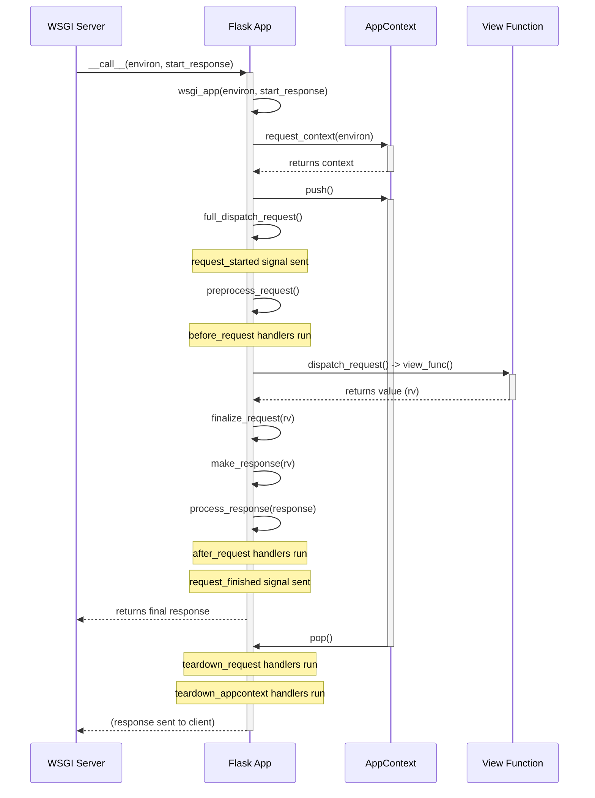
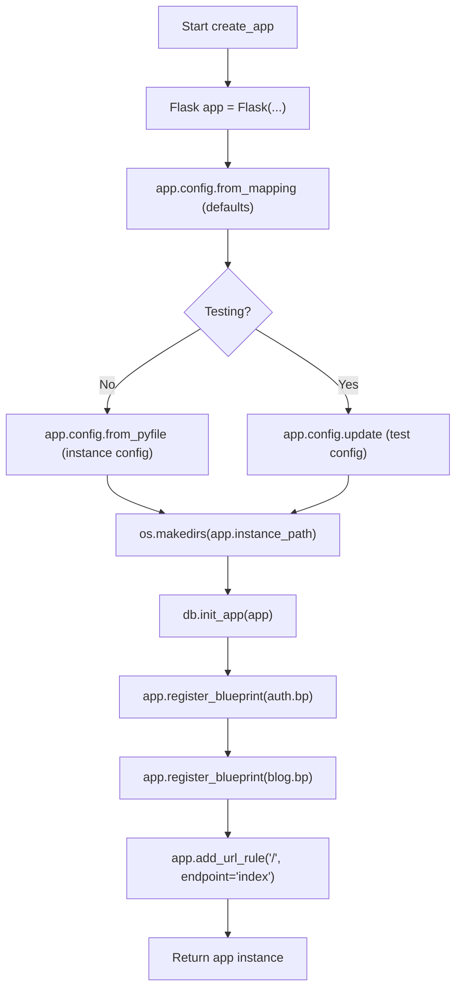
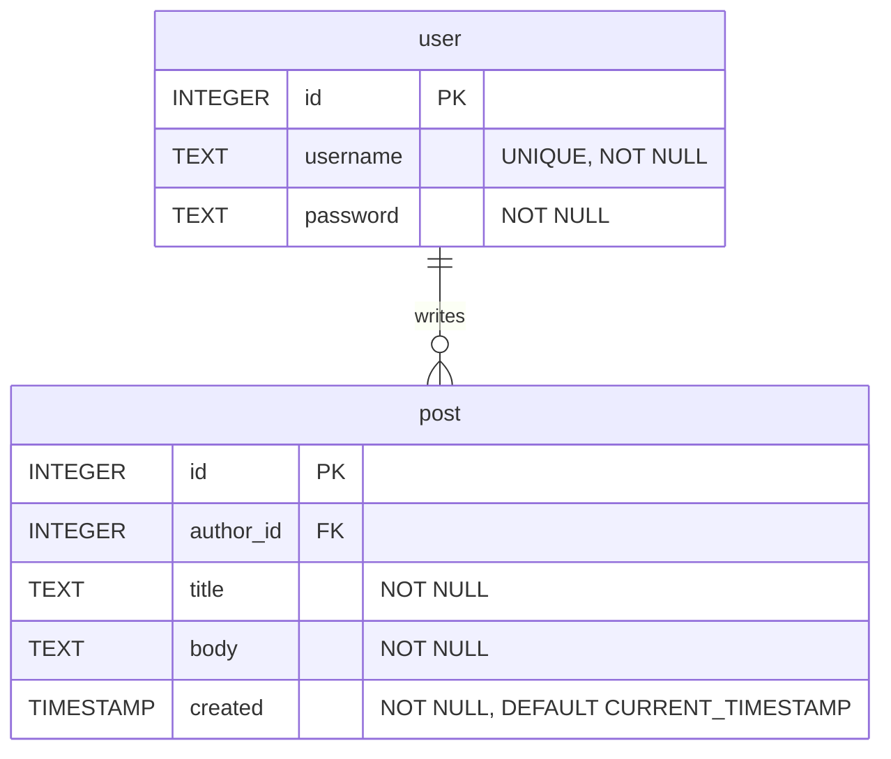
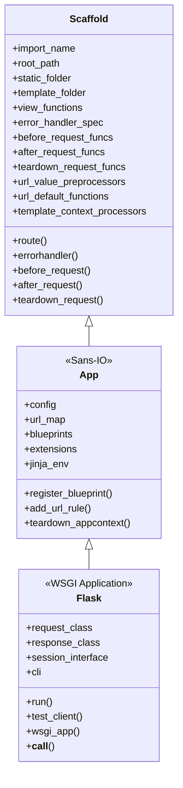
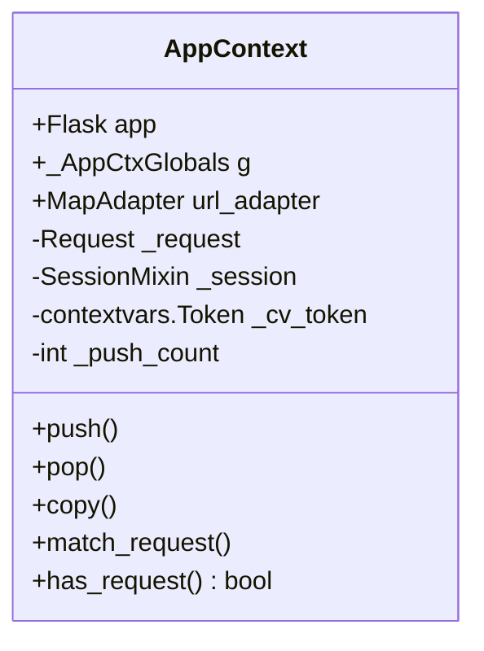
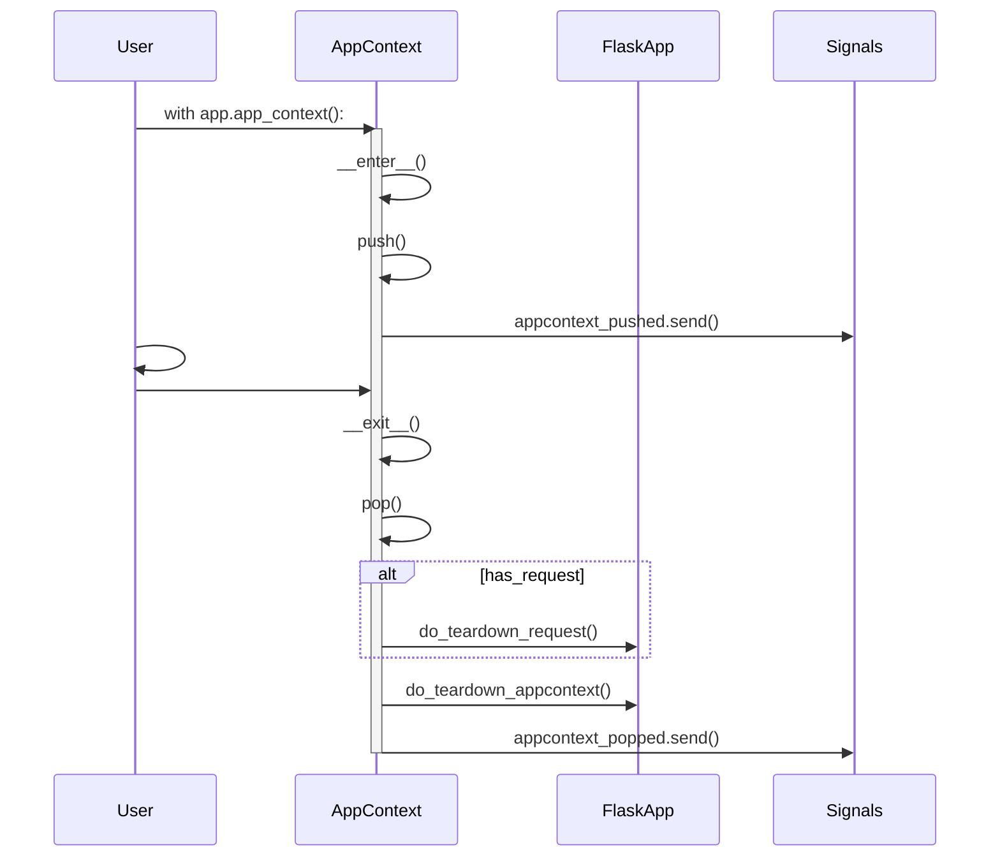
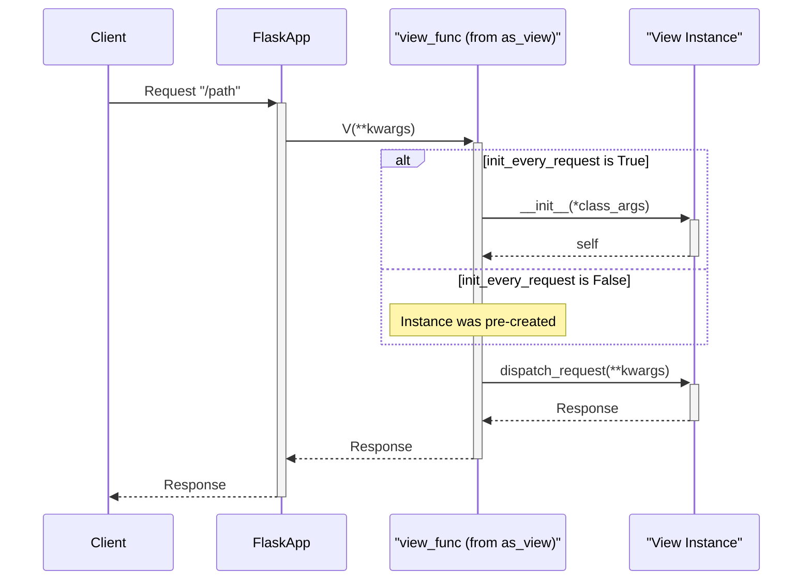
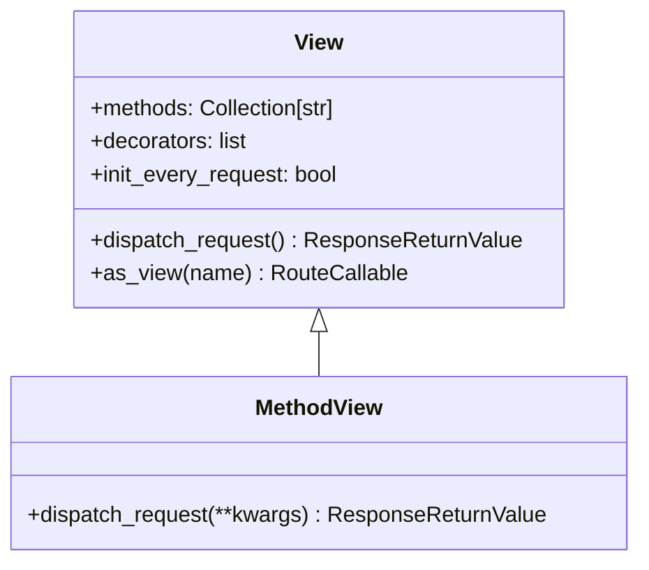
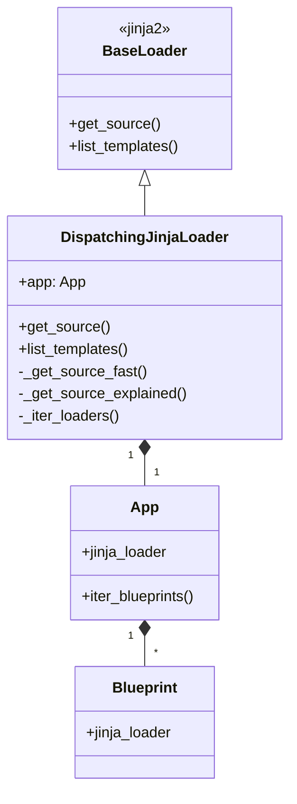
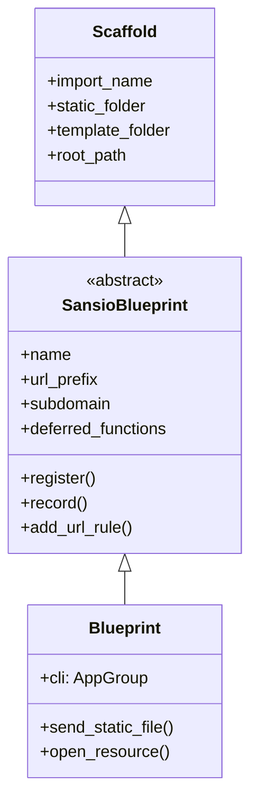

# Page: Welcome to Flask

<details>
<summary>Relevant source files</summary>

The following files were used as context for generating this wiki page:

- [README.md](https://github.com/pallets/flask/blob/HEAD/README.md)
- [src/flask/app.py](https://github.com/pallets/flask/blob/HEAD/src/flask/app.py)
</details>

# Welcome to Flask

Flask is a lightweight WSGI web application framework written in Python. It is designed to be easy to get started with, yet capable of scaling to complex applications. Based on the Werkzeug WSGI toolkit and the Jinja templating engine, Flask provides a solid foundation without enforcing a specific project layout or dependencies. This flexibility allows developers to choose the tools and libraries they prefer, with a rich ecosystem of community-provided extensions available to add functionality.

The central component of any Flask application is an instance of the `Flask` class. This object acts as the main registry for view functions, URL routing rules, template configurations, and more. It is the core of the WSGI application that communicates with the web server.

Sources: [README.md:5-14](https://github.com/pallets/flask/blob/HEAD/README.md#L5-L14), [src/flask/app.py:109-113](https://github.com/pallets/flask/blob/HEAD/src/flask/app.py#L109-L113)

## A Simple Example

Getting started with Flask requires only a few lines of code. The following example demonstrates a minimal web application.

```python
# save this as app.py
from flask import Flask

app = Flask(__name__)

@app.route("/")
def hello():
    return "Hello, World!"
```

To run this application, you can use the `flask` command-line tool:

```
$ flask run
  * Running on http://127.0.0.1:5000/ (Press CTRL+C to quit)
```

In this example:
1.  `app = Flask(__name__)` creates an instance of the Flask application. The `__name__` argument helps Flask locate resources like templates and static files.
2.  `@app.route("/")` is a decorator that registers the `hello()` function as the view handler for the root URL (`/`).

Sources: [README.md:22-36](https://github.com/pallets/flask/blob/HEAD/README.md#L22-L36), [src/flask/app.py:122-126](https://github.com/pallets/flask/blob/HEAD/src/flask/app.py#L122-L126)

## The `Flask` Application Object

The `Flask` class is the heart of the application, orchestrating all its parts.

Sources: [src/flask/app.py:109-113](https://github.com/pallets/flask/blob/HEAD/src/flask/app.py#L109-L113)

### Initialization

When creating a `Flask` instance, several parameters can be configured to control the application's behavior, particularly regarding file paths.

```python
app = Flask(
    import_name,
    static_folder="static",
    template_folder="templates",
    instance_path=None,
    # ... and more
)
```

-   **`import_name`**: This is the most important parameter. It's used to determine the application's `root_path`, which is essential for finding resources on the filesystem. Using `__name__` is standard for single-module applications. For applications structured as Python packages, it's recommended to hardcode the package name (e.g., `'yourapplication'`).
-   **`static_folder`**: The directory containing static files (CSS, JavaScript, images) that will be served to the client. Defaults to a folder named `static` in the application's root path.
-   **`template_folder`**: The directory where Jinja templates are stored. Defaults to `templates`.
-   **`instance_path`**: A path to the "instance folder," which is designed to hold configuration files, databases, or other files that are specific to this instance of the application and not part of version control.

Sources: [src/flask/app.py:110-204](https://github.com/pallets/flask/blob/HEAD/src/flask/app.py#L110-L204), [src/flask/app.py:310-322](https://github.com/pallets/flask/blob/HEAD/src/flask/app.py#L310-L322)

### Default Configuration

The `Flask` application object holds configuration values in its `config` attribute, which is a dictionary-like object. Flask comes with a set of default configuration values that can be overridden by the developer.

| Key | Default Value | Description |
| :-- | :--- | :--- |
| `DEBUG` | `None` | Enables or disables debug mode. |
| `TESTING` | `False` | Enables or disables testing mode. |
| `SECRET_KEY` | `None` | A secret key for signing session cookies and other security needs. |
| `PERMANENT_SESSION_LIFETIME` | `timedelta(days=31)` | The lifetime of a permanent session. |
| `SERVER_NAME` | `None` | The name and port number of the server. Required for subdomain support. |
| `APPLICATION_ROOT` | `/` | The root path of the application on the server. |
| `SESSION_COOKIE_NAME` | `session` | The name of the session cookie. |
| `MAX_CONTENT_LENGTH` | `None` | The maximum size of incoming request data, in bytes. |
| `TEMPLATES_AUTO_RELOAD` | `None` | Whether to check for template modifications and reload them. |

Sources: [src/flask/app.py:206-238](https://github.com/pallets/flask/blob/HEAD/src/flask/app.py#L206-L238)

## Request Handling Lifecycle

When a request is received from a client, Flask processes it through a well-defined sequence of steps. This lifecycle involves creating contexts, dispatching to the correct view function, and tearing down the contexts after the response is sent.



1.  **WSGI Server Call**: The process begins when a WSGI server calls the Flask application object via `app(environ, start_response)`. This is implemented in the `__call__` method.
2.  **Context Creation**: The `wsgi_app` method creates a request context (`AppContext`) from the WSGI `environ` data.
3.  **Context Push**: The context is "pushed," making global objects like `request` and `session` available to the thread.
4.  **Request Dispatching**: `full_dispatch_request` orchestrates the core request handling.
    -   It first calls `preprocess_request`, which executes any functions registered with `@before_request`.
    -   If no preprocessor returns a response, `dispatch_request` is called. This matches the URL to a registered route and calls the associated view function.
5.  **Response Generation**: The view function's return value is passed to `finalize_request`.
    -   `make_response` converts the return value (e.g., a string, dict, or tuple) into a `Response` object.
    -   `process_response` executes any functions registered with `@after_request`, allowing for modification of the response object before it's sent. It also saves the session.
6.  **Context Teardown**: In a `finally` block, the request context is "popped." This triggers teardown functions registered with `@teardown_request` and `@teardown_appcontext`, which are used for cleanup tasks like closing database connections.

Sources: [src/flask/app.py:1566-1625](https://github.com/pallets/flask/blob/HEAD/src/flask/app.py#L1566-L1625), [src/flask/app.py:992-1020](https://github.com/pallets/flask/blob/HEAD/src/flask/app.py#L992-L1020), [src/flask/app.py:1021-1052](https://github.com/pallets/flask/blob/HEAD/src/flask/app.py#L1021-L1052), [src/flask/app.py:1420-1480](https://github.com/pallets/flask/blob/HEAD/src/flask/app.py#L1420-L1480)

## Exception Handling

Flask has a robust system for handling exceptions that occur during request processing. The flow depends on the type of exception and the application's configuration.

```mermaid
graph TD
    A[Exception 'e' raised] --> B{isinstance(e, HTTPException)?};
    B -- No --> C["handle_user_exception(e)"];
    B -- Yes --> D{trap_http_exception(e)?};
    D -- Yes --> C;
    D -- No --> E[handle_http_exception(e)];
    E --> F{_find_error_handler(e)};
    C --> F;
    F --> G{Handler found?};
    G -- No --> H[Reraise 'e'];
    G -- Yes --> I[Execute handler(e)];
    H --> J[handle_exception(e)];
    J --> K{PROPAGATE_EXCEPTIONS?};
    K -- Yes --> L[Reraise 'e' for debugger];
    K -- No --> M[log_exception(e)];
    M --> N[Find handler for InternalServerError];
    N --> O{Handler found?};
    O -- Yes --> P[Execute handler(InternalServerError)];
    O -- No --> Q[Return default InternalServerError response];
    I --> R[Return handler response];
    P --> R;
    Q --> R;
```

-   **`handle_user_exception`**: This is the primary entry point for exceptions raised by user code (like view functions). It distinguishes between `HTTPException` (like a 404 Not Found) and other standard exceptions.
-   **`handle_http_exception`**: This method specifically deals with `HTTPException` instances. It looks for a user-registered error handler for that exception's status code (e.g., `@app.errorhandler(404)`). If no specific handler is found, the exception itself is returned as the response.
-   **`handle_exception`**: If an exception is not an `HTTPException`, or if it's an `HTTPException` that was not handled, this method is called. It's the final fallback.
    -   It logs the exception.
    -   If `PROPAGATE_EXCEPTIONS` is true (as in debug or testing mode), the exception is re-raised to be caught by a debugger.
    -   Otherwise, it creates a generic `InternalServerError` (500) and attempts to find an error handler for it. If no handler is found, a default 500 error page is shown.

Sources: [src/flask/app.py:830-864](https://github.com/pallets/flask/blob/HEAD/src/flask/app.py#L830-L864), [src/flask/app.py:865-896](https://github.com/pallets/flask/blob/HEAD/src/flask/app.py#L865-L896), [src/flask/app.py:897-949](https://github.com/pallets/flask/blob/HEAD/src/flask/app.py#L897-L949)

## Application and Request Contexts

Flask uses contexts to make certain objects globally accessible to a thread during the life of a request without polluting the function's namespace.

-   **Application Context**: Pushed using `app.app_context()`. It makes `current_app` (the active application instance) and `g` (a general-purpose object for storing data during the context) available. It's used for tasks that are tied to the application but not to a specific request, such as in CLI commands or background jobs.
-   **Request Context**: Pushed automatically during a request or manually with `app.test_request_context()`. It provides all the objects from the application context, plus the `request` object (containing all incoming request data) and the `session` object for user session management.

Using a context manager (`with` statement) is the standard way to work with contexts manually:

```python
with app.app_context():
    # You can now access current_app and g
    init_db()

with app.test_request_context('/?name=Flask'):
    # You can now access request, session, etc.
    assert request.args['name'] == 'Flask'
```

Sources: [src/flask/app.py:1481-1500](https://github.com/pallets/flask/blob/HEAD/src/flask/app.py#L1481-L1500), [src/flask/app.py:1517-1565](https://github.com/pallets/flask/blob/HEAD/src/flask/app.py#L1517-L1565)

# Page: Tutorial: Building a Blog with Flaskr

<details>
<summary>Relevant source files</summary>

The following files were used as context for generating this wiki page:

- [examples/tutorial/README.rst](https://github.com/pallets/flask/blob/HEAD/examples/tutorial/README.rst)
- [examples/tutorial/flaskr/__init__.py](https://github.com/pallets/flask/blob/HEAD/examples/tutorial/flaskr/__init__.py)
- [examples/tutorial/flaskr/blog.py](https://github.com/pallets/flask/blob/HEAD/examples/tutorial/flaskr/blog.py)
- [examples/tutorial/flaskr/auth.py](https://github.com/pallets/flask/blob/HEAD/examples/tutorial/flaskr/auth.py)
</details>

# Tutorial: Building a Blog with Flaskr

Flaskr is a basic blog application that serves as the official tutorial for the Flask framework. It demonstrates core Flask concepts including project structure, application factories, blueprints, database integration, user authentication, and view logic. The application allows users to register, log in, and create, edit, or delete their own blog posts.

The project is structured into modular components using Blueprints for authentication (`auth`) and blog features (`blog`). It uses an application factory pattern to create and configure the Flask app instance, making it more testable and reusable. Data is stored in a SQLite database, managed through custom `flask` CLI commands.

Sources: [examples/tutorial/README.rst:4](https://github.com/pallets/flask/blob/HEAD/examples/tutorial/README.rst#L4), [examples/tutorial/flaskr/__init__.py:6-8](https://github.com/pallets/flask/blob/HEAD/examples/tutorial/flaskr/__init__.py#L6-L8)

## Project Setup and Execution

The Flaskr application is run from the command line after setting up a Python virtual environment and installing the necessary dependencies.

### Installation

1.  **Create and activate a virtual environment:**
    ```bash
    $ python3 -m venv .venv
    $ . .venv/bin/activate
    ```
2.  **Install the application in editable mode:** This command installs the project and its dependencies.
    ```bash
    $ pip install -e .
    ```

Sources: [examples/tutorial/README.rst:24-36](https://github.com/pallets/flask/blob/HEAD/examples/tutorial/README.rst#L24-L36)

### Running the Application

The application is managed via the `flask` command-line interface.

1.  **Initialize the database:** This command runs the `init-db` command registered with the application.
    ```bash
    $ flask --app flaskr init-db
    ```
2.  **Run the development server:** The `--debug` flag enables debug mode.
    ```bash
    $ flask --app flaskr run --debug
    ```
The application will be available at `http://127.0.0.1:5000`.

Sources: [examples/tutorial/README.rst:50-53](https://github.com/pallets/flask/blob/HEAD/examples/tutorial/README.rst#L50-L53)

## Application Architecture

Flaskr uses the application factory pattern to create and configure the Flask application instance. This approach improves modularity and is essential for testing.

Sources: [examples/tutorial/flaskr/__init__.py](https://github.com/pallets/flask/blob/HEAD/examples/tutorial/flaskr/__init__.py)

### Application Factory (`create_app`)

The core of the application is the `create_app` function in `flaskr/__init__.py`. This function sets up the application instance, configures it, initializes extensions, and registers blueprints.

Key steps in the factory:
1.  An instance of `Flask` is created with `instance_relative_config=True` to load configuration from the `instance` folder.
2.  Default configuration is set using `app.config.from_mapping()`, including a `SECRET_KEY` for development and the `DATABASE` path.
3.  Instance-specific configuration is loaded from `config.py` in the instance folder, which can override the defaults.
4.  The instance folder is created if it doesn't exist.
5.  Database commands are registered with the application via `db.init_app(app)`.
6.  The `auth` and `blog` blueprints are imported and registered with the application.
7.  A URL rule is added to map the root URL `/` to the `index` endpoint, which corresponds to the blog index.

The following diagram illustrates the application initialization flow:


Sources: [examples/tutorial/flaskr/__init__.py:6-48](https://github.com/pallets/flask/blob/HEAD/examples/tutorial/flaskr/__init__.py#L6-L48)

### Blueprints

The application is divided into two main modules using Flask Blueprints:

| Blueprint | URL Prefix | Description                                                              | Source File                                                                                             |
| :-------- | :--------- | :----------------------------------------------------------------------- | :------------------------------------------------------------------------------------------------------ |
| `auth`    | `/auth`    | Handles user registration, login, and logout.                            | [`examples/tutorial/flaskr/auth.py:16`]()                                                               |
| `blog`    | `/`        | Handles creating, viewing, updating, and deleting blog posts.            | [`examples/tutorial/flaskr/blog.py:13`](), [`examples/tutorial/flaskr/__init__.py:46`]() |

These blueprints are registered on the application instance within the `create_app` factory.

Sources: [examples/tutorial/flaskr/__init__.py:35-41](https://github.com/pallets/flask/blob/HEAD/examples/tutorial/flaskr/__init__.py#L35-L41)

## Authentication System

The authentication system manages user identity and access control. It is encapsulated within the `auth` blueprint.

Sources: [examples/tutorial/flaskr/auth.py](https://github.com/pallets/flask/blob/HEAD/examples/tutorial/flaskr/auth.py)

### User Session Management

User sessions are managed using Flask's secure cookie-based session.

1.  **Login:** Upon successful login, the user's `id` is stored in the `session` dictionary.
2.  **Request Handling:** Before each request, the `@bp.before_app_request` decorator triggers the `load_logged_in_user` function. This function checks for a `user_id` in the session and fetches the corresponding user data from the database, storing it in `g.user`. `g` is a special object that is unique for each request.
3.  **Logout:** When a user logs out, the `session` is cleared.

```mermaid
sequenceDiagram
    participant Client
    participant FlaskApp
    participant Session
    participant Database

    Client->>+FlaskApp: POST /auth/login (username, password)
    FlaskApp->>Database: SELECT * FROM user WHERE username = ?
    Database-->>FlaskApp: User record (with hashed password)
    alt User exists and password is correct
        FlaskApp->>FlaskApp: check_password_hash()
        FlaskApp->>Session: session.clear()
        FlaskApp->>Session: session["user_id"] = user["id"]
        FlaskApp-->>-Client: Redirect to / (index)
    else Incorrect credentials
        FlaskApp-->>-Client: Render login page with error
    end

    Client->>+FlaskApp: GET / (or any other page)
    Note over FlaskApp: @before_app_request runs load_logged_in_user
    FlaskApp->>Session: user_id = session.get("user_id")
    alt user_id exists
        FlaskApp->>Database: SELECT * FROM user WHERE id = ?
        Database-->>FlaskApp: User record
        Note over FlaskApp: g.user = user record
    else user_id is None
        Note over FlaskApp: g.user = None
    end
    Note over FlaskApp: Proceed to requested view function
    FlaskApp-->>-Client: Render page
```
Sources: [examples/tutorial/flaskr/auth.py:32-44](https://github.com/pallets/flask/blob/HEAD/examples/tutorial/flaskr/auth.py#L32-L44), [examples/tutorial/flaskr/auth.py:84-105](https://github.com/pallets/flask/blob/HEAD/examples/tutorial/flaskr/auth.py#L84-L105)

### Access Control

The `login_required` decorator is used to protect views that require an authenticated user. This decorator checks if `g.user` has been set. If not, it redirects the user to the login page. It is applied to all blog views except the main index.

```python
# examples/tutorial/flaskr/auth.py:19-29
def login_required(view):
    """View decorator that redirects anonymous users to the login page."""

    @functools.wraps(view)
    def wrapped_view(**kwargs):
        if g.user is None:
            return redirect(url_for("auth.login"))

        return view(**kwargs)

    return wrapped_view
```
Sources: [examples/tutorial/flaskr/auth.py:19-29](https://github.com/pallets/flask/blob/HEAD/examples/tutorial/flaskr/auth.py#L19-L29), [examples/tutorial/flaskr/blog.py:61](https://github.com/pallets/flask/blob/HEAD/examples/tutorial/flaskr/blog.py#L61), [examples/tutorial/flaskr/blog.py:87](https://github.com/pallets/flask/blob/HEAD/examples/tutorial/flaskr/blog.py#L87), [examples/tutorial/flaskr/blog.py:114](https://github.com/pallets/flask/blob/HEAD/examples/tutorial/flaskr/blog.py#L114)

### Endpoints

| Method       | Path             | Endpoint        | Description                               |
| :----------- | :--------------- | :-------------- | :---------------------------------------- |
| `GET`, `POST` | `/auth/register` | `auth.register` | Registers a new user.                     |
| `GET`, `POST` | `/auth/login`    | `auth.login`    | Logs in an existing user.                 |
| `GET`        | `/auth/logout`   | `auth.logout`   | Logs out the current user.                |

Sources: [examples/tutorial/flaskr/auth.py:46](https://github.com/pallets/flask/blob/HEAD/examples/tutorial/flaskr/auth.py#L46), [examples/tutorial/flaskr/auth.py:84](https://github.com/pallets/flask/blob/HEAD/examples/tutorial/flaskr/auth.py#L84), [examples/tutorial/flaskr/auth.py:112](https://github.com/pallets/flask/blob/HEAD/examples/tutorial/flaskr/auth.py#L112)

## Blog Functionality

The `blog` blueprint contains all the logic for managing blog posts, including creating, reading, updating, and deleting (CRUD) them.

Sources: [examples/tutorial/flaskr/blog.py](https://github.com/pallets/flask/blob/HEAD/examples/tutorial/flaskr/blog.py)

### Post Management

The core of the blog functionality is provided by a set of views that handle post manipulation. A helper function, `get_post`, is used to fetch a post by its ID and optionally verify that the current user is the author.

-   **`index()` (`/`):** Displays a list of all posts, ordered from most recent to oldest. It performs a `JOIN` with the `user` table to display the author's username for each post.
-   **`create()` (`/create`):** A `login_required` view that displays a form to create a new post on `GET` and processes the form to insert a new post into the database on `POST`.
-   **`update()` (`/<int:id>/update`):** A `login_required` view that fetches an existing post using `get_post`. It ensures the current user is the author. It displays a form to edit the post on `GET` and processes the form to update the post in the database on `POST`.
-   **`delete()` (`/<int:id>/delete`):** A `login_required` view that only accepts `POST` requests. It uses `get_post` to verify the post exists and the current user is the author, then deletes the post from the database.

The workflow for creating a new post is as follows:

```mermaid
flowchart TD
    A[User navigates to /create] --> B{User Logged In?};
    B -- No --> C[Redirect to /auth/login];
    B -- Yes --> D["Display create.html form"];
    D --> E{User submits form (POST)};
    E --> F[Validate form data (title is required)];
    F --> G{Is valid?};
    G -- No --> H["Re-render create.html with error"];
    G -- Yes --> I[Insert post into database];
    I --> J[Commit transaction];
    J --> K[Redirect to blog index];
```
Sources: [examples/tutorial/flaskr/blog.py:60-83](https://github.com/pallets/flask/blob/HEAD/examples/tutorial/flaskr/blog.py#L60-L83)

### Authorization

Authorization is handled within the views and the `get_post` helper function.
-   The `create`, `update`, and `delete` views are protected by the `@login_required` decorator.
-   The `get_post` function has a `check_author` parameter (defaulting to `True`). When enabled, it compares the post's `author_id` with the logged-in user's ID (`g.user['id']`). If they do not match, it raises a 403 Forbidden error. This prevents users from modifying or deleting posts they did not create.

Sources: [examples/tutorial/flaskr/blog.py:28-57](https://github.com/pallets/flask/blob/HEAD/examples/tutorial/flaskr/blog.py#L28-L57), [examples/tutorial/flaskr/blog.py:90](https://github.com/pallets/flask/blob/HEAD/examples/tutorial/flaskr/blog.py#L90), [examples/tutorial/flaskr/blog.py:121](https://github.com/pallets/flask/blob/HEAD/examples/tutorial/flaskr/blog.py#L121)

### Endpoints

| Method       | Path                 | Endpoint      | Description                                      |
| :----------- | :------------------- | :------------ | :----------------------------------------------- |
| `GET`        | `/`                  | `blog.index`  | Shows all posts.                                 |
| `GET`, `POST` | `/create`            | `blog.create` | Creates a new post.                              |
| `GET`, `POST` | `/<int:id>/update`   | `blog.update` | Updates an existing post.                        |
| `POST`       | `/<int:id>/delete`   | `blog.delete` | Deletes an existing post.                        |

Sources: [examples/tutorial/flaskr/blog.py:16](https://github.com/pallets/flask/blob/HEAD/examples/tutorial/flaskr/blog.py#L16), [examples/tutorial/flaskr/blog.py:60](https://github.com/pallets/flask/blob/HEAD/examples/tutorial/flaskr/blog.py#L60), [examples/tutorial/flaskr/blog.py:86](https://github.com/pallets/flask/blob/HEAD/examples/tutorial/flaskr/blog.py#L86), [examples/tutorial/flaskr/blog.py:113](https://github.com/pallets/flask/blob/HEAD/examples/tutorial/flaskr/blog.py#L113)

## Database Schema

The database schema is implicitly defined by the SQL queries within the `auth` and `blog` modules. It consists of two tables: `user` and `post`, with a one-to-many relationship between them.


-   The `user` table stores user credentials. The `username` is unique.
-   The `post` table stores blog post content. The `author_id` is a foreign key referencing `user.id`.

Sources: [examples/tutorial/flaskr/auth.py:66-69](https://github.com/pallets/flask/blob/HEAD/examples/tutorial/flaskr/auth.py#L66-L69), [examples/tutorial/flaskr/auth.py:92-94](https://github.com/pallets/flask/blob/HEAD/examples/tutorial/flaskr/auth.py#L92-L94), [examples/tutorial/flaskr/blog.py:20-24](https://github.com/pallets/flask/blob/HEAD/examples/tutorial/flaskr/blog.py#L20-L24), [examples/tutorial/flaskr/blog.py:76-78](https://github.com/pallets/flask/blob/HEAD/examples/tutorial/flaskr/blog.py#L76-L78)

## Summary

The Flaskr tutorial application provides a practical example of building a web application with Flask. It effectively demonstrates key design patterns such as the application factory for flexible configuration and testing, and blueprints for organizing a project into modular components. The application covers fundamental web development features, including user authentication with session management, CRUD operations for a primary data model (blog posts), and robust authorization to ensure users can only modify their own content.

# Page: Architecture Overview (Diagram Recommended)

<details>
<summary>Relevant source files</summary>

The following files were used as context for generating this wiki page:

- [src/flask/app.py](https://github.com/pallets/flask/blob/HEAD/src/flask/app.py)
- [src/flask/sansio/app.py](https://github.com/pallets/flask/blob/HEAD/src/flask/sansio/app.py)
- [src/flask/wrappers.py](https://github.com/pallets/flask/blob/HEAD/src/flask/wrappers.py)
</details>

# Architecture Overview (Diagram Recommended)

The core of a Flask application is the `Flask` object, which acts as the central registry for view functions, URL rules, template configurations, and extensions. It is a WSGI (Web Server Gateway Interface) application, responsible for handling the entire request-response lifecycle. The architecture separates the core application logic from the I/O-specific implementation, allowing for a clean and extensible design.

The `Flask` class itself inherits from `flask.sansio.app.App`, a "Sans-IO" base class that contains the majority of the application setup and configuration logic, independent of the web server protocol. This design makes the core framework more adaptable. The `Flask` class in `src/flask/app.py` adds the WSGI-specific functionality, such as handling the `environ` and `start_response` callables.

## Class Hierarchy

The application object's structure is based on inheritance from a `Scaffold` class, which provides the basic structure for both the main application and Blueprints. The `App` class builds on this, and the `Flask` class provides the final WSGI-compliant layer.


*   **Scaffold**: Provides the basic functionality for routing and registering callbacks (e.g., `before_request`, `after_request`). Both `App` and `Blueprint` are scaffolds.
*   **App**: The Sans-IO application class. It manages configuration, URL rules via a `url_map`, blueprints, and the Jinja2 environment. It does not handle I/O. Sources: [src/flask/sansio/app.py:59-1010](https://github.com/pallets/flask/blob/HEAD/src/flask/sansio/app.py#L59-L1010)
*   **Flask**: The main application class that developers instantiate. It inherits all the setup logic from `App` and adds WSGI-specific methods like `wsgi_app` and `run` for the development server. Sources: [src/flask/app.py:109-1625](https://github.com/pallets/flask/blob/HEAD/src/flask/app.py#L109-L1625)

## Core Components

The `Flask` instance holds several key components that manage the application's state and behavior.

| Component | Description | Default Class/Value | Source File |
| --- | --- | --- | --- |
| `config` | A dictionary-like object holding the application's configuration. It can be loaded from files or environment variables. | `flask.Config` | `src/flask/sansio/app.py:193` |
| `url_map` | A `werkzeug.routing.Map` instance that stores all the URL routing rules. | `werkzeug.routing.Map` | `src/flask/sansio/app.py:260`, `src/flask/sansio/app.py:402` |
| `view_functions` | A dictionary mapping endpoint names (strings) to the view functions that handle them. | `dict` | `src/flask/sansio/app.py:652-658` |
| `request_class` | The class used to create request objects for each incoming request. | `flask.wrappers.Request` | `src/flask/app.py:242` |
| `response_class` | The class used to create response objects from view return values. | `flask.wrappers.Response` | `src/flask/app.py:246` |
| `session_interface` | An object that handles loading and saving session data. | `SecureCookieSessionInterface` | `src/flask/app.py:252` |
| `jinja_env` | The Jinja2 `Environment` instance used for template rendering. | `flask.templating.Environment` | `src/flask/sansio/app.py:169`, `src/flask/sansio/app.py:467` |
| `blueprints` | A dictionary of registered `Blueprint` objects, which help organize larger applications. | `dict` | `src/flask/sansio/app.py:374` |

### Configuration

The application's configuration is stored in the `app.config` attribute, which is an instance of `app.config_class` (defaults to `flask.Config`). The initial default configuration is defined in `Flask.default_config`.

Sources: [src/flask/app.py:206-238](https://github.com/pallets/flask/blob/HEAD/src/flask/app.py#L206-L238), [src/flask/sansio/app.py:479-494](https://github.com/pallets/flask/blob/HEAD/src/flask/sansio/app.py#L479-L494)

### Request and Response Wrappers

Flask uses custom subclasses of Werkzeug's `Request` and `Response` objects to add application-specific information.

*   **`flask.wrappers.Request`**: This class adds attributes like `url_rule`, `view_args`, `endpoint`, and `blueprint` which become available after the URL routing has been resolved. It also sources configuration for `max_content_length` from the application config.
    Sources: [src/flask/wrappers.py:18-220](https://github.com/pallets/flask/blob/HEAD/src/flask/wrappers.py#L18-L220)
*   **`flask.wrappers.Response`**: This class defaults the mimetype to `text/html` and sources the `max_cookie_size` from the application config.
    Sources: [src/flask/wrappers.py:222-257](https://github.com/pallets/flask/blob/HEAD/src/flask/wrappers.py#L222-L257)

## Request Lifecycle

The processing of a single HTTP request follows a well-defined sequence, managed primarily by the `Flask.wsgi_app` method. This involves creating contexts, dispatching to a view function, processing the response, and tearing down the contexts.

```mermaid
sequenceDiagram
    participant WSGI as WSGI Server
    participant Flask as Flask App
    participant Ctx as AppContext
    participant View as View Function

    WSGI->>+Flask: __call__(environ, start_response)
    Flask->>Flask: wsgi_app(environ, start_response)
    Flask->>+Ctx: request_context(environ)
    Ctx->>Ctx: push()
    Note over Ctx: current_app, request, g, session are now available
    Flask->>Flask: full_dispatch_request(ctx)
    Flask->>Flask: preprocess_request(ctx)
    Note right of Flask: Runs before_request handlers
    Flask->>Flask: dispatch_request(ctx)
    Note right of Flask: Matches URL rule to find view
    Flask->>+View: view_func(**view_args)
    View-->>-Flask: returns value (rv)
    Flask->>Flask: finalize_request(ctx, rv)
    Flask->>Flask: make_response(rv)
    Note right of Flask: Converts rv to Response object
    Flask->>Flask: process_response(ctx, response)
    Note right of Flask: Runs after_request handlers
    Flask-->>-WSGI: response(environ, start_response)
    deactivate Flask
    
    Note over Ctx,View: In a finally block
    Ctx->>Ctx: pop()
    Ctx->>Flask: do_teardown_request()
    Ctx->>Flask: do_teardown_appcontext()
    deactivate Ctx
```
This sequence is orchestrated within the `wsgi_app` method, which wraps the request handling in a `try...finally` block to ensure that context teardown functions are always executed.

Sources: [src/flask/app.py:1566-1617](https://github.com/pallets/flask/blob/HEAD/src/flask/app.py#L1566-L1617)

### Key Methods in the Lifecycle

1.  **`wsgi_app`**: The main entry point for a WSGI server. It creates the request context, pushes it, calls `full_dispatch_request`, and pops the context in a `finally` block.
    Sources: [src/flask/app.py:1566-1617](https://github.com/pallets/flask/blob/HEAD/src/flask/app.py#L1566-L1617)
2.  **`full_dispatch_request`**: Manages the main dispatch flow. It calls preprocessing functions, the main request dispatch, and handles any exceptions that occur, passing them to `handle_user_exception`. The result is then passed to `finalize_request`.
    Sources: [src/flask/app.py:992-1020](https://github.com/pallets/flask/blob/HEAD/src/flask/app.py#L992-L1020)
3.  **`dispatch_request`**: The core of routing. It inspects the matched URL rule from `request.url_rule` and calls the associated view function from `self.view_functions` with the URL arguments from `request.view_args`.
    Sources: [src/flask/app.py:966-991](https://github.com/pallets/flask/blob/HEAD/src/flask/app.py#L966-L991)
4.  **`make_response`**: Converts the return value from a view function into a true `response_class` instance. It can handle various return types, including strings, bytes, dictionaries (which are converted to JSON), tuples `(body, status, headers)`, and existing response objects.
    Sources: [src/flask/app.py:1224-1364](https://github.com/pallets/flask/blob/HEAD/src/flask/app.py#L1224-L1364)
5.  **`do_teardown_request` / `do_teardown_appcontext`**: These methods are called when a context is popped. They execute all registered teardown functions, which are commonly used for cleanup tasks like closing database connections.
    Sources: [src/flask/app.py:1420-1452](https://github.com/pallets/flask/blob/HEAD/src/flask/app.py#L1420-L1452), [src/flask/app.py:1453-1479](https://github.com/pallets/flask/blob/HEAD/src/flask/app.py#L1453-L1479)

## Error Handling

Flask has a robust error handling system that can catch exceptions during request processing. The flow distinguishes between `HTTPException` and other exceptions.

```mermaid
graph TD
    A[Exception raised during request] --> B{handle_user_exception};
    B --> C{Is it an HTTPException?};
    C -- Yes --> D{trap_http_exception?};
    D -- No --> E[handle_http_exception];
    D -- Yes --> F[Re-raise exception];
    C -- No --> G[Find handler for exception class];
    E --> G;
    G -- Handler Found --> H[Call handler(e)];
    G -- No Handler --> I{handle_exception};
    I --> J[Log exception];
    J --> K[Create InternalServerError(500)];
    K --> L[Find handler for 500 error];
    L -- Handler Found --> M[Call handler(500_error)];
    L -- No Handler --> N[Return default 500 response];
    H --> O[finalize_request];
    M --> O;
    N --> O;
```
This logic allows developers to register custom error handlers for specific HTTP status codes or exception types using the `@app.errorhandler()` decorator.

-   **`handle_user_exception`**: The first point of contact for exceptions from a view. It decides whether to treat it as a standard exception or an HTTP exception.
    Sources: [src/flask/app.py:865-896](https://github.com/pallets/flask/blob/HEAD/src/flask/app.py#L865-L896)
-   **`handle_http_exception`**: Looks for a registered handler for a specific HTTP status code or a parent `HTTPException` class. If none is found, the exception itself is returned as the response.
    Sources: [src/flask/app.py:830-863](https://github.com/pallets/flask/blob/HEAD/src/flask/app.py#L830-L863)
-   **`handle_exception`**: The final fallback for unhandled exceptions. It logs the error and always generates a 500 Internal Server Error response, potentially using a custom handler for `500` if one is registered.
    Sources: [src/flask/app.py:897-949](https://github.com/pallets/flask/blob/HEAD/src/flask/app.py#L897-L949)
-   **`_find_error_handler`**: The internal method used to look up the most appropriate handler, checking blueprint-specific handlers before application-wide ones.
    Sources: [src/flask/sansio/app.py:865-888](https://github.com/pallets/flask/blob/HEAD/src/flask/sansio/app.py#L865-L888)

# Page: The Application and Request Context (Diagram Recommended)

<details>
<summary>Relevant source files</summary>

The following files were used as context for generating this wiki page:

- [src/flask/ctx.py](https://github.com/pallets/flask/blob/HEAD/src/flask/ctx.py)
- [src/flask/globals.py](https://github.com/pallets/flask/blob/HEAD/src/flask/globals.py)
- [tests/test_appctx.py](https://github.com/pallets/flask/blob/HEAD/tests/test_appctx.py)
- [tests/test_reqctx.py](https://github.com/pallets/flask/blob/HEAD/tests/test_reqctx.py)
</details>

# The Application and Request Context (Diagram Recommended)

Flask's context mechanism allows parts of an application, such as view functions, to access objects like the current application instance or the incoming HTTP request without having them passed as arguments. This is achieved by making these objects available as thread-safe global proxies that are only valid within a specific context.

There are two conceptual types of contexts: the *application context* and the *request context*. The application context provides access to the application instance (`current_app`) and a general-purpose storage object (`g`). The request context provides everything the application context does, plus access to the specific request (`request`) and user session (`session`).

Since Flask 3.2, the `RequestContext` has been merged into `AppContext`. A single `AppContext` object is now pushed for every request and CLI command, simplifying the internal logic. An `AppContext` that contains request information is considered a "request context"; otherwise, it is an "app context".

Sources: [src/flask/ctx.py:260-266](https://github.com/pallets/flask/blob/HEAD/src/flask/ctx.py#L260-L266), [src/flask/ctx.py:287-293](https://github.com/pallets/flask/blob/HEAD/src/flask/ctx.py#L287-L293), [src/flask/globals.py:33-56](https://github.com/pallets/flask/blob/HEAD/src/flask/globals.py#L33-L56)

## The `AppContext` Class

The `flask.ctx.AppContext` class is the core of the context system. It encapsulates all the state for either an application or a request context. It is not intended to be instantiated directly but rather through `app.app_context()` or `app.test_request_context()`.

The class manages its lifecycle through `push()` and `pop()` methods, which make the context active or inactive. It also implements the context manager protocol (`__enter__` and `__exit__`), making the `with` statement the standard way to handle contexts.

Sources: [src/flask/ctx.py:260-298](https://github.com/pallets/flask/blob/HEAD/src/flask/ctx.py#L260-L298), [src/flask/ctx.py:416-427](https://github.com/pallets/flask/blob/HEAD/src/flask/ctx.py#L416-L427), [src/flask/ctx.py:446-464](https://github.com/pallets/flask/blob/HEAD/src/flask/ctx.py#L446-L464), [src/flask/ctx.py:506-517](https://github.com/pallets/flask/blob/HEAD/src/flask/ctx.py#L506-L517)

The following diagram shows the key components of the `AppContext` class.


Sources: [src/flask/ctx.py:260-526](https://github.com/pallets/flask/blob/HEAD/src/flask/ctx.py#L260-L526)

## Context-Local Proxies

Flask exposes context-bound objects through global proxies defined in `flask.globals`. These proxies are instances of `werkzeug.local.LocalProxy` and dynamically resolve to the correct object on the currently active context. This allows code like `from flask import request` to work seamlessly within a view function without passing the request object around.

Sources: [src/flask/globals.py:6](https://github.com/pallets/flask/blob/HEAD/src/flask/globals.py#L6)

| Proxy | Target Attribute on `AppContext` | Availability | Description |
| :--- | :--- | :--- | :--- |
| `current_app` | `app` | App & Request | The active `Flask` application instance. |
| `g` | `g` | App & Request | A namespace object (`_AppCtxGlobals`) for storing temporary data. |
| `request` | `request` | Request Only | The current `Request` object, containing incoming request data. |
| `session` | `session` | Request Only | The current user `SessionMixin` object for storing session data. |

Sources: [src/flask/globals.py:44-62](https://github.com/pallets/flask/blob/HEAD/src/flask/globals.py#L44-L62), [src/flask/ctx.py:307-313](https://github.com/pallets/flask/blob/HEAD/src/flask/ctx.py#L307-L313), [src/flask/ctx.py:371-379](https://github.com/pallets/flask/blob/HEAD/src/flask/ctx.py#L371-L379), [src/flask/ctx.py:396-403](https://github.com/pallets/flask/blob/HEAD/src/flask/ctx.py#L396-L403)

The diagram below illustrates how accessing a proxy triggers a lookup on the active context.

```mermaid
graph TD
    subgraph "User Code"
        A["from flask import request"]
        B["view_func():<br>method = request.method"]
    end
    subgraph "Flask Internals"
        C["request (LocalProxy)"]
        D["_cv_app.get()"]
        E["current_app_context"]
        F["current_app_context.request"]
        G["Actual Request Object"]
    end
    A --> B
    B -- "Access .method" --> C
    C -- "_get_current_object()" --> D
    D -- "Returns" --> E
    E -- "Access .request" --> F
    F -- "Returns" --> G
    G -- "Returns method" -->> B
```
This diagram shows that accessing an attribute on the `request` proxy triggers a lookup via the `_cv_app` context variable to find the current `AppContext` and retrieve the actual request object from it.

Sources: [src/flask/globals.py:40-43](https://github.com/pallets/flask/blob/HEAD/src/flask/globals.py#L40-L43), [src/flask/globals.py:57-59](https://github.com/pallets/flask/blob/HEAD/src/flask/globals.py#L57-L59)

## Context Lifecycle and Management

A context becomes active when it is "pushed" and inactive when "popped". The `AppContext` uses a `contextvars.Token` to manage its state in the current execution context (e.g., thread or async task).

Sources: [src/flask/ctx.py:433](https://github.com/pallets/flask/blob/HEAD/src/flask/ctx.py#L433), [src/flask/ctx.py:498](https://github.com/pallets/flask/blob/HEAD/src/flask/ctx.py#L498)

### Pushing the Context

The `push()` method:
1.  Increments a `_push_count` to handle nested pushes of the same context.
2.  If it's the first push, it sets the `_cv_app` context variable to itself, making it the active context.
3.  Sends the `appcontext_pushed` signal.
4.  If it's a request context, it opens the session and matches the URL rule.

Sources: [src/flask/ctx.py:416-445](https://github.com/pallets/flask/blob/HEAD/src/flask/ctx.py#L416-L445), [tests/test_appctx.py:172-195](https://github.com/pallets/flask/blob/HEAD/tests/test_appctx.py#L172-L195)

### Popping the Context

The `pop()` method:
1.  Decrements the `_push_count`.
2.  If the count reaches zero, it triggers the teardown process.
3.  Teardown functions for requests (`teardown_request`) are executed first, followed by application teardown functions (`teardown_appcontext`).
4.  The `appcontext_popped` signal is sent.
5.  The context variable is reset, deactivating the context.

Sources: [src/flask/ctx.py:446-505](https://github.com/pallets/flask/blob/HEAD/src/flask/ctx.py#L446-L505), [tests/test_appctx.py:46-57](https://github.com/pallets/flask/blob/HEAD/tests/test_appctx.py#L46-L57), [tests/test_reqctx.py:16-28](https://github.com/pallets/flask/blob/HEAD/tests/test_reqctx.py#L16-L28)

The following sequence diagram shows the typical lifecycle of a context managed by a `with` statement.


Sources: [src/flask/ctx.py:506-517](https://github.com/pallets/flask/blob/HEAD/src/flask/ctx.py#L506-L517), [src/flask/ctx.py:488-502](https://github.com/pallets/flask/blob/HEAD/src/flask/ctx.py#L488-L502)

## Distinguishing Application vs. Request Contexts

The same `AppContext` class is used for both types of contexts. The distinction is whether it was initialized with a request object.

-   An **Application Context** is created without request data, typically via `app.app_context()`. It is used for tasks that need access to the application but are not tied to a specific HTTP request, such as running CLI commands.
-   A **Request Context** is created with request data, either by the WSGI server for an incoming request or manually for testing with `app.test_request_context()`.

The `has_request` property on the context object returns `True` if it is a request context. The helper functions `has_app_context()` and `has_request_context()` can be used to check for active contexts from anywhere in the code.

Sources: [src/flask/ctx.py:209-232](https://github.com/pallets/flask/blob/HEAD/src/flask/ctx.py#L209-L232), [src/flask/ctx.py:235-257](https://github.com/pallets/flask/blob/HEAD/src/flask/ctx.py#L235-L257), [src/flask/ctx.py:351-353](https://github.com/pallets/flask/blob/HEAD/src/flask/ctx.py#L351-L353), [tests/test_reqctx.py:123-133](https://github.com/pallets/flask/blob/HEAD/tests/test_reqctx.py#L123-L133)

| Feature | Application Context | Request Context |
| :--- | :---: | :---: |
| `current_app` available | Yes | Yes |
| `g` available | Yes | Yes |
| `request` available | No | Yes |
| `session` available | No | Yes |
| Created via | `app.app_context()` | WSGI / `app.test_request_context()` |
| `has_request` returns | `False` | `True` |

Sources: [src/flask/globals.py](https://github.com/pallets/flask/blob/HEAD/src/flask/globals.py), [src/flask/ctx.py:351-353](https://github.com/pallets/flask/blob/HEAD/src/flask/ctx.py#L351-L353)

## The `g` Object

The `flask.g` proxy points to an instance of `_AppCtxGlobals`. This object acts as a temporary, per-context namespace. It is a place to store data that might be needed by multiple functions during the life of a single context, such as a database connection or the current user object. The data stored in `g` is cleared when the application context is popped.

Sources: [src/flask/ctx.py:30-36](https://github.com/pallets/flask/blob/HEAD/src/flask/ctx.py#L30-L36), [src/flask/ctx.py:312](https://github.com/pallets/flask/blob/HEAD/src/flask/ctx.py#L312), [src/flask/globals.py:47-49](https://github.com/pallets/flask/blob/HEAD/src/flask/globals.py#L47-L49)

It provides standard dictionary-like methods for data manipulation:
-   `get(name, default=None)`
-   `pop(name, default=...)`
-   `setdefault(name, default=None)`
-   It also supports `in` checks, iteration, and attribute access (`g.user = ...`).

Sources: [src/flask/ctx.py:68-109](https://github.com/pallets/flask/blob/HEAD/src/flask/ctx.py#L68-L109), [tests/test_appctx.py:139-160](https://github.com/pallets/flask/blob/HEAD/tests/test_appctx.py#L139-L160)

## Advanced Context Handling

### `copy_current_request_context`

This decorator is used to capture the current request context and make it available inside a function that will be executed later, for example in a background thread or greenlet.

Sources: [src/flask/ctx.py:154-191](https://github.com/pallets/flask/blob/HEAD/src/flask/ctx.py#L154-L191)

When the decorated function is called, it pushes a *copy* of the original context, making `request`, `session`, etc., available. This is useful for tasks that need the context of the request that spawned them. The implementation works by creating a copy of the current `AppContext` and wrapping the target function in a new function that enters the copied context before execution.

Sources: [src/flask/ctx.py:200-206](https://github.com/pallets/flask/blob/HEAD/src/flask/ctx.py#L200-L206), [src/flask/ctx.py:355-368](https://github.com/pallets/flask/blob/HEAD/src/flask/ctx.py#L355-L368), [tests/test_reqctx.py:179-203](https://github.com/pallets/flask/blob/HEAD/tests/test_reqctx.py#L179-L203)

## Conclusion

Flask's application and request contexts are a fundamental mechanism for providing controlled access to application- and request-level state. They enable the use of convenient global proxies like `current_app` and `request` in a safe, thread-local manner. Understanding the

# Page: Routing and Views

<details>
<summary>Relevant source files</summary>

The following files were used as context for generating this wiki page:

- [src/flask/sansio/app.py](https://github.com/pallets/flask/blob/HEAD/src/flask/sansio/app.py)
- [src/flask/views.py](https://github.com/pallets/flask/blob/HEAD/src/flask/views.py)
- [tests/type_check/typing_route.py](https://github.com/pallets/flask/blob/HEAD/tests/type_check/typing_route.py)
</details>

# Routing and Views

Routing in Flask is the mechanism that maps incoming request URLs to the specific Python functions or classes that should handle them. This is a core function of the `App` object, which maintains a mapping of URL rules to "view" functions. The primary method for this is `add_url_rule()`, which registers a given URL path with a view function and associated HTTP methods.

Flask supports both simple function-based views and more structured class-based views. Class-based views, implemented through the `View` and `MethodView` classes, provide better organization, reusability through inheritance, and a natural way to structure code for features like REST APIs.

Sources: [src/flask/sansio/app.py](https://github.com/pallets/flask/blob/HEAD/src/flask/sansio/app.py), [src/flask/views.py](https://github.com/pallets/flask/blob/HEAD/src/flask/views.py)

## URL Rule Registration

The fundamental method for defining a route is `App.add_url_rule()`. This method binds a URL rule string to a view function and configures its behavior. Decorators like `@app.route()` are convenient shortcuts that call `add_url_rule()` internally.

Sources: [src/flask/sansio/app.py:602-659](https://github.com/pallets/flask/blob/HEAD/src/flask/sansio/app.py#L602-L659)

### `add_url_rule()`

This method adds a new rule to the application's `url_map`, which is an instance of `werkzeug.routing.Map`.

| Parameter | Description |
| --- | --- |
| `rule` | The URL rule as a string, which can include variable parts like `<username>`. |
| `endpoint` | The unique name for the rule. If omitted, it's automatically derived from the `view_func`'s name. |
| `view_func` | The function or callable to execute when the rule is matched. |
| `methods` | A list of HTTP methods the view supports (e.g., `["GET", "POST"]`). Defaults to `("GET",)`. |
| `provide_automatic_options` | If `True`, automatically adds the `OPTIONS` method and handles it. |

The following diagram illustrates the internal logic of `add_url_rule()` when registering a new view.

```mermaid
graph TD
    A["call app.add_url_rule()"] --> B{endpoint provided?};
    B -- No --> C["_endpoint_from_view_func(view_func)"];
    B -- Yes --> D[Use provided endpoint];
    C --> D;
    D --> E{methods provided?};
    E -- No --> F{view_func.methods exists?};
    F -- No --> G["Default to ('GET',)"];
    F -- Yes --> H[Use view_func.methods];
    E -- Yes --> I[Use provided methods];
    G --> J[Process methods];
    H --> J;
    I --> J;
    J --> K{provide_automatic_options?};
    K -- Yes --> L[Add "OPTIONS" to methods];
    K -- No --> M[Keep methods as is];
    L --> M;
    M --> N["Create Rule object"];
    N --> O["app.url_map.add(rule_obj)"];
    O --> P{view_func provided?};
    P -- Yes --> Q[Add to app.view_functions];
    P -- No --> R[End];
    Q --> R;
```
*Diagram illustrating the logic flow within `add_url_rule`.*
Sources: [src/flask/sansio/app.py:602-659](https://github.com/pallets/flask/blob/HEAD/src/flask/sansio/app.py#L602-L659)

## View Functions and Responses

A view function is a Python callable that receives request data as arguments and must return a response. Flask is flexible about the return value, which can be a string, a tuple, or a `Response` object.

The following return types are supported:

| Return Type | Flask's Handling | Example |
| --- | --- | --- |
| `str` | The string is converted into a response body with a `200 OK` status and `text/html` mimetype. | `return "<p>Hello</p>"` |
| `bytes` | The bytes are converted into a response body with a `200 OK` status and `text/html` mimetype. | `return b"<p>Hello</p>"` |
| `dict` or `list` | The object is serialized to JSON using `jsonify()` and returned with `application/json` mimetype. | `return {"status": "ok"}` |
| `Response` | The `Response` object is used directly. | `return jsonify({"message": "ok"})` |
| `tuple` | Can be `(body, status)`, `(body, headers)`, or `(body, status, headers)`. | `return "Not Found", 404` |
| `Iterator` or `Generator` | Used for streaming responses. The iterator should yield strings or bytes. | `return (f"data:{x}" for x in range(10))` |

Sources: [tests/type_check/typing_route.py](https://github.com/pallets/flask/blob/HEAD/tests/type_check/typing_route.py)

## Class-Based Views

Class-based views provide an alternative to function-based views, allowing for better structure and reusability. They are defined by subclassing `flask.views.View` or `flask.views.MethodView`.

Sources: [src/flask/views.py](https://github.com/pallets/flask/blob/HEAD/src/flask/views.py)

### The Base `View` Class

The `View` class is the simplest class-based view. It requires subclasses to implement the `dispatch_request()` method, which contains the logic to handle a request and return a response. The class is converted into a view function using the `as_view()` class method.

Key class attributes can be set to configure the view:

| Attribute | Description |
| --- | --- |
| `methods` | A collection of HTTP methods this view supports. |
| `decorators` | A list of decorators to apply to the generated view function. |
| `init_every_request` | If `True` (default), a new instance of the view class is created for each request. If `False`, a single instance is used for all requests. |
| `provide_automatic_options` | Controls automatic handling of the `OPTIONS` method. |

Sources: [src/flask/views.py:16-77](https://github.com/pallets/flask/blob/HEAD/src/flask/views.py#L16-L77)

The following diagram shows the lifecycle of a request handled by a `View`.


*Sequence diagram for a request to a class-based `View`.*
Sources: [src/flask/views.py:86-135](https://github.com/pallets/flask/blob/HEAD/src/flask/views.py#L86-L135)

### `MethodView` for REST APIs

`MethodView` is a subclass of `View` designed to simplify writing RESTful APIs. It dispatches incoming requests to methods on the class that match the HTTP request method name in lowercase (e.g., `GET` requests are handled by a `get()` method).

The `methods` attribute is automatically populated based on the HTTP-related methods defined in the class (e.g., `get`, `post`, `put`). If a `head()` method is not defined, `MethodView` will automatically fall back to using the `get()` method for `HEAD` requests.

Sources: [src/flask/views.py:138-191](https://github.com/pallets/flask/blob/HEAD/src/flask/views.py#L138-L191)

The relationship between `View` and `MethodView` is a simple inheritance structure.


*Class diagram showing `MethodView` inheriting from `View`.*
Sources: [src/flask/views.py](https://github.com/pallets/flask/blob/HEAD/src/flask/views.py)

## Underlying Routing Engine

Flask's routing system is built on top of the powerful Werkzeug routing library. The `App` object holds the routing configuration in its `url_map` attribute, which is an instance of `werkzeug.routing.Map`. Each rule added via `add_url_rule()` is an instance of a class specified by `url_rule_class`, which defaults to `werkzeug.routing.Rule`. This architecture allows for advanced routing features like converters, subdomains, and build error handling.

Sources: [src/flask/sansio/app.py:250-260, 402]()

# Page: Templating with Jinja2

<details>
<summary>Relevant source files</summary>

The following files were used as context for generating this wiki page:

- [src/flask/templating.py](https://github.com/pallets/flask/blob/HEAD/src/flask/templating.py)
- [tests/test_templating.py](https://github.com/pallets/flask/blob/HEAD/tests/test_templating.py)
</details>

# Templating with Jinja2

Flask utilizes the Jinja2 template engine to render dynamic HTML pages. The integration is designed to be seamless, automatically making application and request context variables like `config`, `request`, `g`, and `session` available within templates. The system provides functions for rendering templates from files or strings, supports streaming responses, and offers a powerful mechanism for discovering templates across a main application and its associated blueprints.

The templating engine is highly extensible. Developers can add custom filters, tests, and global variables to the Jinja environment using simple decorators. Furthermore, signals like `before_render_template` and `template_rendered` provide hooks into the rendering process, allowing for advanced customizations and monitoring.

## Core Rendering Functions

Flask provides four main functions for template rendering, located in the `flask.templating` module. These functions handle both standard and streaming rendering from either files or strings.

| Function                 | Description                                                                                             | Return Type        |
| ------------------------ | ------------------------------------------------------------------------------------------------------- | ------------------ |
| `render_template()`      | Renders a template from a file. Can take a list of names and will use the first one that exists.        | `str`              |
| `render_template_string()` | Renders a template directly from a source string.                                                       | `str`              |
| `stream_template()`      | Renders a template from a file as a stream, returning an iterator of strings. Added in version 2.2.     | `t.Iterator[str]`  |
| `stream_template_string()` | Renders a template from a source string as a stream, returning an iterator of strings. Added in v2.2. | `t.Iterator[str]`  |

Sources: [src/flask/templating.py:136-212](https://github.com/pallets/flask/blob/HEAD/src/flask/templating.py#L136-L212)

### Rendering Flow

The rendering process begins when a view calls a function like `render_template`. The function retrieves the current application context, uses the application's Jinja environment to load the template, and then calls an internal `_render` or `_stream` function to complete the process.

```mermaid
sequenceDiagram
    participant View
    participant render_template()
    participant app_ctx
    participant jinja_env
    participant _render()
    participant Template

    View->>+render_template(): Call with template name and context
    render_template()->>app_ctx: _get_current_object()
    render_template()->>jinja_env: get_or_select_template(name)
    jinja_env-->>render_template(): Template object
    render_template()->>+_render(): Call with template and context
    _render()->>_render(): Update context with processors
    _render()->>_render(): Send "before_render_template" signal
    _render()->>+Template: render(context)
    Template-->>-_render(): Rendered string (HTML)
    _render()->>_render(): Send "template_rendered" signal
    _render()-->>-render_template(): Return rendered string
    render_template()-->>-View: Return rendered string
```
*This diagram illustrates the sequence for `render_template`. The flow for `stream_template` is analogous but uses `_stream` and `template.generate()`.*

Sources: [src/flask/templating.py:136-149](https://github.com/pallets/flask/blob/HEAD/src/flask/templating.py#L136-L149), [src/flask/templating.py:123-133](https://github.com/pallets/flask/blob/HEAD/src/flask/templating.py#L123-L133)

## Template Loading

Flask uses a sophisticated loader to find templates, which is crucial in applications that use Blueprints.

### `DispatchingJinjaLoader`

The `DispatchingJinjaLoader` is the default loader used by Flask. It is responsible for searching for templates in both the main application's template folder and the template folders of all registered blueprints.


*Class relationships in the template loading system.*

Sources: [src/flask/templating.py:49-52](https://github.com/pallets/flask/blob/HEAD/src/flask/templating.py#L49-L52)

The loader's search strategy is implemented in the `_iter_loaders` method. It first yields the loader for the main application, and then iterates through all registered blueprints and yields their respective loaders.

```mermaid
graph TD
    A[get_source("template.html")] --> B{_iter_loaders};
    B --> C{Try app.jinja_loader};
    C --> D{Template Found?};
    D -- Yes --> E[Return source];
    D -- No --> F{Iterate app.iter_blueprints()};
    F --> G{For each blueprint...};
    G --> H{Try blueprint.jinja_loader};
    H --> I{Template Found?};
    I -- Yes --> E;
    I -- No --> G;
    G -- End of Blueprints --> J[Raise TemplateNotFound];
```
*The search path for the `DispatchingJinjaLoader`.*

Sources: [src/flask/templating.py:91-107](https://github.com/pallets/flask/blob/HEAD/src/flask/templating.py#L91-L107)

### Debugging Template Loading

To help debug issues with template resolution, Flask provides a configuration flag `EXPLAIN_TEMPLATE_LOADING`. When set to `True`, the `DispatchingJinjaLoader` will log a detailed report of the loaders it tried, which ones failed, and which one succeeded.

Sources: [src/flask/templating.py:60-87](https://github.com/pallets/flask/blob/HEAD/src/flask/templating.py#L60-L87), [tests/test_templating.py:488-522](https://github.com/pallets/flask/blob/HEAD/tests/test_templating.py#L488-L522)

## Jinja Environment

Flask configures a Jinja2 `Environment` instance to manage templates. Flask uses a custom subclass, `flask.templating.Environment`, which is aware of the application instance.

Key aspects of the environment configuration:
- **Loader**: By default, it's configured with a `DispatchingJinjaLoader` instance. This can be customized by overriding the `app.create_global_jinja_loader()` method.
- **Auto-reloading**: The `jinja_env.auto_reload` attribute is automatically enabled if the application is in debug mode (`app.debug is True`) or if `TEMPLATES_AUTO_RELOAD` is explicitly set to `True` in the app config.
- **Customization**: An application can provide its own Jinja environment class by setting the `jinja_environment` attribute on a custom `Flask` subclass.

```python
# Example of a custom environment
class CustomEnvironment(flask.templating.Environment):
    pass

class CustomFlask(flask.Flask):
    jinja_environment = CustomEnvironment

app = CustomFlask(__name__)
assert isinstance(app.jinja_env, CustomEnvironment)
```
Sources: [src/flask/templating.py:36-47](https://github.com/pallets/flask/blob/HEAD/src/flask/templating.py#L36-L47), [tests/test_templating.py:443-473](https://github.com/pallets/flask/blob/HEAD/tests/test_templating.py#L443-L473), [tests/test_templating.py:524-532](https://github.com/pallets/flask/blob/HEAD/tests/test_templating.py#L524-L532)

## Context Processing

Every rendered template has access to a context dictionary. Flask automatically populates this context with several useful objects and provides mechanisms for users to inject their own variables.

### Default Context

The `_default_template_ctx_processor` function runs for every template rendering. It adds the following objects to the context:
- `g`: The application-global `g` object from the current app context.
- `request`: The current `request` object, if a request context is active.

This is done to replace the context proxies with the concrete objects for faster access within the template.

Sources: [src/flask/templating.py:21-34](https://github.com/pallets/flask/blob/HEAD/src/flask/templating.py#L21-L34)

### Custom Context Processors

Developers can inject custom variables into the context of all templates using the `@app.context_processor` decorator. A context processor is a function that returns a dictionary of items to be merged into the template context.

```python
@app.context_processor
def inject_user():
    return dict(user=g.user)
```
In a test case, this is demonstrated by injecting a static value:
```python
# tests/test_templating.py:12-15
@app.context_processor
def context_processor():
    return {"injected_value": 42}
```
Sources: [tests/test_templating.py:11-22](https://github.com/pallets/flask/blob/HEAD/tests/test_templating.py#L11-L22)

## Extending the Environment

Flask provides decorators to easily add custom filters, tests, and globals to the Jinja environment.

| Decorator / Method                   | Purpose                               | Example Usage                                    |
| ------------------------------------ | ------------------------------------- | ------------------------------------------------ |
| `@app.template_filter(name=None)`    | Registers a new template filter.      | `@app.template_filter("reverse")`                |
| `app.add_template_filter(f, name=None)` | Registers a new template filter.      | `app.add_template_filter(my_func, "reverse")`    |
| `@app.template_test(name=None)`      | Registers a new template test.        | `@app.template_test("even")`                     |
| `app.add_template_test(f, name=None)`   | Registers a new template test.        | `app.add_template_test(is_even_func, "even")`    |
| `@app.template_global(name=None)`    | Registers a new global function/var.  | `@app.template_global()`                         |

Sources: [tests/test_templating.py:123-403](https://github.com/pallets/flask/blob/HEAD/tests/test_templating.py#L123-L403)

### Example: Custom Filter

A custom filter can be added to transform variables within a template.

```python
# tests/test_templating.py:167-170
@app.template_filter("strrev")
def my_reverse(s):
    return s[::-1]
```
This filter can then be used in a template as `{{ my_variable|strrev }}`.

Sources: [tests/test_templating.py:167-175](https://github.com/pallets/flask/blob/HEAD/tests/test_templating.py#L167-L175)

### Example: Custom Test

A custom test is a function that returns `True` or `False` and can be used with the `is` operator in templates.

```python
# tests/test_templating.py:242-245
@app.template_test()
def boolean(value):
    return isinstance(value, bool)
```
This test can be used in a template as ``.

Sources: [tests/test_templating.py:241-249](https://github.com/pallets/flask/blob/HEAD/tests/test_templating.py#L241-L249)

## Signals

The templating system emits two signals during the rendering process, allowing other parts of the application to react.

1.  **`before_render_template`**: This signal is sent just before the template's `render()` or `generate()` method is called. Listeners receive the `app`, `template`, and `context` as arguments and can modify the context in place.
2.  **`template_rendered`**: This signal is sent immediately after the template has been rendered. Listeners receive the same arguments.

Both signals are dispatched from the internal `_render` and `_stream` helper functions.

Sources: [src/flask/templating.py:126-132](https://github.com/pallets/flask/blob/HEAD/src/flask/templating.py#L126-L132), [src/flask/templating.py:168-176](https://github.com/pallets/flask/blob/HEAD/src/flask/templating.py#L168-L176)

# Page: Modular Applications with Blueprints (Diagram Recommended)

<details>
<summary>Relevant source files</summary>

The following files were used as context for generating this wiki page:

- [src/flask/blueprints.py](https://github.com/pallets/flask/blob/HEAD/src/flask/blueprints.py)
- [src/flask/sansio/blueprints.py](https://github.com/pallets/flask/blob/HEAD/src/flask/sansio/blueprints.py)
- [tests/test_blueprints.py](https://github.com/pallets/flask/blob/HEAD/tests/test_blueprints.py)
</details>

# Modular Applications with Blueprints (Diagram Recommended)

Blueprints are a core feature in Flask for organizing an application into smaller, reusable components. A `Blueprint` object allows for the definition of application functions—such as routes, error handlers, and template filters—without requiring an application instance upfront. It acts as a template for application features, recording operations that are executed when the blueprint is registered with a Flask application. This approach is fundamental for building large, maintainable, and scalable applications by promoting a clean separation of concerns.

The blueprint concept is split into two main classes: `SansioBlueprint`, which contains the core logic independent of any web server gateway interface (WSGI/ASGI), and `Blueprint`, which inherits from it to add WSGI/ASGI-specific functionality like serving static files and integrating with the command-line interface (CLI).

Sources: [src/flask/sansio/blueprints.py:119-133](https://github.com/pallets/flask/blob/HEAD/src/flask/sansio/blueprints.py#L119-L133), [src/flask/blueprints.py:18](https://github.com/pallets/flask/blob/HEAD/src/flask/blueprints.py#L18)

## Core Concepts and Architecture

A `Blueprint` is initialized with parameters that define its behavior and resources, such as its name, associated URL prefix, and paths to static files or templates.


This diagram shows the inheritance structure. `Blueprint` builds upon the abstract `SansioBlueprint` and the base `Scaffold` class, which provides foundational functionalities for locating resources.

Sources: [src/flask/sansio/blueprints.py:119](https://github.com/pallets/flask/blob/HEAD/src/flask/sansio/blueprints.py#L119), [src/flask/blueprints.py:18](https://github.com/pallets/flask/blob/HEAD/src/flask/blueprints.py#L18)

### Initialization Parameters

When creating a `Blueprint` instance, several parameters can be configured:

| Parameter | Type | Description |
| --- | --- | --- |
| `name` | `str` | The name of the blueprint. It is used to prefix endpoint names. Cannot contain a dot (`.`). |
| `import_name` | `str` | The name of the blueprint's package or module, typically `__name__`. Used to locate the `root_path`. |
| `static_folder` | `str \| os.PathLike[str] \| None` | The folder for static files, relative to the blueprint's root path. |
| `static_url_path` | `str \| None` | The URL path to serve static files from. Defaults to the `static_folder` name. |
| `template_folder` | `str \| os.PathLike[str] \| None` | The folder for templates, relative to the blueprint's root path. |
| `url_prefix` | `str \| None` | A URL path that is prepended to all routes defined on the blueprint. |
| `subdomain` | `str \| None` | A subdomain that all blueprint routes will match on by default. |
| `url_defaults` | `dict[str, Any] \| None` | A dictionary of default values for URL variables in the blueprint's routes. |
| `cli_group` | `str \| None` | The name of the Click group for CLI commands registered on the blueprint. |

Sources: [src/flask/blueprints.py:19-31](https://github.com/pallets/flask/blob/HEAD/src/flask/blueprints.py#L19-L31), [src/flask/sansio/blueprints.py:174-186](https://github.com/pallets/flask/blob/HEAD/src/flask/sansio/blueprints.py#L174-L186), [src/flask/sansio/blueprints.py:195-200](https://github.com/pallets/flask/blob/HEAD/src/flask/sansio/blueprints.py#L195-L200)

## The Registration Lifecycle

A blueprint is inactive until it is registered on a Flask application using the `app.register_blueprint()` method. This registration process executes all the "deferred functions" that were recorded on the blueprint, such as those created by `@bp.route()` decorators.

The registration process is managed by the `Blueprint.register()` method, which creates a `BlueprintSetupState` object. This temporary object holds the registration context (the application, the blueprint, and any options passed during registration) and provides helper methods like `add_url_rule` to apply the blueprint's configurations to the application.

```mermaid
sequenceDiagram
    participant App
    participant Blueprint as bp
    participant BlueprintSetupState as state

    App->>+bp: register(app, options)
    bp->>bp: make_setup_state(app, options)
    bp-->>state: create
    state-->>-bp: return state
    loop for each deferred function
        bp->>state: deferred_function(state)
    end
    bp->>App: _merge_blueprint_funcs(app, name)
    loop for each nested blueprint
        bp->>bp: register(app, bp_options)
    end
```
This sequence illustrates how the `register` method orchestrates the setup, applying deferred functions and registering any nested blueprints.

Sources: [src/flask/sansio/blueprints.py:273-378](https://github.com/pallets/flask/blob/HEAD/src/flask/sansio/blueprints.py#L273-L378), [src/flask/sansio/blueprints.py:34-86](https://github.com/pallets/flask/blob/HEAD/src/flask/sansio/blueprints.py#L34-L86)

### Deferred Functions

Decorators like `@bp.route()` do not immediately modify the application. Instead, they register a function to be called later using `Blueprint.record()`. This function receives the `BlueprintSetupState` instance when the blueprint is registered, allowing it to configure the application with the correct context (e.g., applying the `url_prefix`).

The `record_once()` method is a variant that ensures the deferred function is only executed during the very first registration of the blueprint with an application instance, which is useful for application-wide setup that should not be repeated.

Sources: [src/flask/sansio/blueprints.py:223-245](https://github.com/pallets/flask/blob/HEAD/src/flask/sansio/blueprints.py#L223-L245)

### Unique Registration

A blueprint can be registered multiple times on the same application, but each registration must have a unique name. If you register the same blueprint object again, you must provide a different `name` in the `register_blueprint` call. Attempting to register a different blueprint with a name that is already in use will also raise a `ValueError`.

```python
# tests/test_blueprints.py:1070-1080
app.register_blueprint(bp)

with pytest.raises(ValueError):
    app.register_blueprint(bp)  # same bp, same name, error

app.register_blueprint(bp, name="again")  # same bp, different name, ok

with pytest.raises(ValueError):
    app.register_blueprint(bp2)  # different bp, same name, error

app.register_blueprint(bp2, name="alt")  # different bp, different name, ok
```

Sources: [src/flask/sansio/blueprints.py:306-314](https://github.com/pallets/flask/blob/HEAD/src/flask/sansio/blueprints.py#L306-L314), [tests/test_blueprints.py:1066-1081](https://github.com/pallets/flask/blob/HEAD/tests/test_blueprints.py#L1066-L1081)

## Defining Behavior

Blueprints provide decorators to define routes, request hooks, error handlers, and template helpers, mirroring the API of the main `Flask` application object.

### Routes and URL Rules

Routes are defined using the `@bp.route()` decorator or the `bp.add_url_rule()` method. When registered, the blueprint's `url_prefix` is prepended to the route's rule. The endpoint for a view function is automatically namespaced with the blueprint's name, separated by a dot (e.g., `url_for('admin.index')`).

```mermaid
graph TD
    A["@bp.route('/view')"] --> B{"Blueprint registered with url_prefix='/admin'?"};
    B -- Yes --> C["Final URL: /admin/view"];
    B -- No --> D["Final URL: /view"];
    C --> E["Endpoint for url_for(): 'admin.view'"];
    D --> E;
```
This diagram shows how a final URL and endpoint are constructed based on the blueprint's `url_prefix`.

Sources: [src/flask/sansio/blueprints.py:413-441](https://github.com/pallets/flask/blob/HEAD/src/flask/sansio/blueprints.py#L413-L441), [src/flask/sansio/blueprints.py:87-116](https://github.com/pallets/flask/blob/HEAD/src/flask/sansio/blueprints.py#L87-L116), [tests/test_blueprints.py:286-316](https://github.com/pallets/flask/blob/HEAD/tests/test_blueprints.py#L286-L316)

### Request Hooks and Error Handlers

Blueprints can have their own request hooks and error handlers that apply only to requests routed to that blueprint. They also provide decorators to register application-wide hooks.

| Blueprint-Specific | Application-Wide | Description |
| --- | --- | --- |
| `@bp.before_request` | `@bp.before_app_request` | Runs before each request handled by the blueprint vs. any request. |
| `@bp.after_request` | `@bp.after_app_request` | Runs after each request handled by the blueprint vs. any request. |
| `@bp.teardown_request` | `@bp.teardown_app_request` | Runs at the end of a request handled by the blueprint vs. any request. |
| `@bp.context_processor` | `@bp.app_context_processor` | Injects variables into templates for blueprint views vs. all views. |
| `@bp.errorhandler` | `@bp.app_errorhandler` | Handles errors that occur in blueprint views vs. any view. |
| `@bp.url_defaults` | `@bp.app_url_defaults` | Injects default values into `url_for` calls for blueprint endpoints vs. all endpoints. |
| `@bp.url_value_preprocessor` | `@bp.app_url_value_preprocessor` | Pre-processes URL values for blueprint routes vs. all routes. |

For example, an error handler registered with `@bp.errorhandler` will only be triggered for errors raised from that blueprint's views. If a request matches a blueprint route, its error handler takes precedence over an application-level handler for the same error code.

Sources: [src/flask/sansio/blueprints.py:613-692](https://github.com/pallets/flask/blob/HEAD/src/flask/sansio/blueprints.py#L613-L692), [tests/test_blueprints.py:8-44](https://github.com/pallets/flask/blob/HEAD/tests/test_blueprints.py#L8-L44), [tests/test_blueprints.py:768-863](https://github.com/pallets/flask/blob/HEAD/tests/test_blueprints.py#L768-L863)

### Template and Static File Management

A blueprint can be configured with its own `template_folder` and `static_folder`.
- **Static Files**: If `static_folder` is set, a route is automatically created to serve its contents from `static_url_path`. The `send_static_file` method handles serving these files.
- **Resources**: The `open_resource()` method allows opening files relative to the blueprint's `root_path`, which is useful for reading configuration or data files bundled with the blueprint.

Sources: [src/flask/blueprints.py:82-128](https://github.com/pallets/flask/blob/HEAD/src/flask/blueprints.py#L82-L128), [src/flask/sansio/blueprints.py:323-328](https://github.com/pallets/flask/blob/HEAD/src/flask/sansio/blueprints.py#L323-L328), [tests/test_blueprints.py:176-212](https://github.com/pallets/flask/blob/HEAD/tests/test_blueprints.py#L176-L212)

## Advanced Usage

### Nesting Blueprints

Blueprints can be registered on other blueprints to create a hierarchical, modular structure. When a parent blueprint is registered on an application, it will also register all of its child blueprints.

```mermaid
graph TD
    A["app.register_blueprint(parent, url_prefix='/api')"]
    B["parent.register_blueprint(child, url_prefix='/v1')"]
    C["@child.route('/users')"]
    D["Final URL: /api/v1/users"]
    E["Endpoint: parent.child.users"]

    A --> B --> C --> D
    C --> E
```

When nesting, `url_prefix` and `subdomain` values are combined. For example, if a parent has `url_prefix="/parent"` and a child has `url_prefix="/child"`, the child's routes will be available under `/parent/child`. Request hooks are executed in order from the application down to the most deeply nested blueprint. Error handlers from a more specific blueprint (a child or grandchild) take precedence over those from a parent.

Sources: [src/flask/sansio/blueprints.py:256-272](https://github.com/pallets/flask/blob/HEAD/src/flask/sansio/blueprints.py#L256-L272), [src/flask/sansio/blueprints.py:349-378](https://github.com/pallets/flask/blob/HEAD/src/flask/sansio/blueprints.py#L349-L378), [tests/test_blueprints.py:865-1065](https://github.com/pallets/flask/blob/HEAD/tests/test_blueprints.py#L865-L1065)

### CLI Integration

Each `Blueprint` instance has a `cli` attribute, which is a Click `AppGroup`. You can add CLI commands to this group. When the blueprint is registered with the application, these commands are added to the main `flask` command-line tool. The `cli_group` parameter in the blueprint's constructor can be used to specify a name for the command group, otherwise it defaults to the blueprint's name.

Sources: [src/flask/blueprints.py:45-54](https://github.com/pallets/flask/blob/HEAD/src/flask/blueprints.py#L45-L54), [src/flask/sansio/blueprints.py:337-347](https://github.com/pallets/flask/blob/HEAD/src/flask/sansio/blueprints.py#L337-L347)

# Page: Configuration Management

<details>
<summary>Relevant source files</summary>

The following files were used as context for generating this wiki page:

- [src/flask/config.py](https://github.com/pallets/flask/blob/HEAD/src/flask/config.py)
- [tests/test_config.py](https://github.com/pallets/flask/blob/HEAD/tests/test_config.py)
- [tests/test_instance_config.py](https://github.com/pallets/flask/blob/HEAD/tests/test_instance_config.py)
</details>

# Configuration Management

Flask provides a flexible and powerful configuration management system centered around the `Config` object, available as `app.config`. This object behaves like a standard Python dictionary but includes methods for loading configuration values from various sources. This design allows developers to manage settings for different environments (development, testing, production) efficiently. The system is designed to load only uppercase variables, which helps distinguish configuration keys from other variables in source files.

The configuration object is initialized with a `root_path`, which serves as a base for resolving relative paths to configuration files. This is particularly important for locating files like instance-specific configurations or Python-based config files.

## The `Config` Class

The core of Flask's configuration is the `flask.Config` class. It is a subclass of `dict` and is the central repository for all application settings.

Sources: [src/flask/config.py:50-54](https://github.com/pallets/flask/blob/HEAD/src/flask/config.py#L50-L54)

### Initialization

A `Config` object is created with a `root_path` and an optional dictionary of default values. The `root_path` is typically the application's root path and is used to resolve relative file paths for configuration files.

```python
# src/flask/config.py:94-101

    def __init__(
        self,
        root_path: str | os.PathLike[str],
        defaults: dict[str, t.Any] | None = None,
    ) -> None:
        super().__init__(defaults or {})
        self.root_path = root_path
```

### `ConfigAttribute`

The `ConfigAttribute` is a descriptor class that provides a convenient way to forward attribute access on an application object directly to a key in its `config` dictionary. This allows for cleaner access to common configuration values. For example, `app.secret_key` is a proxy for `app.config['SECRET_KEY']`.

```mermaid
classDiagram
    direction TD
    class App {
        +config: Config
        +secret_key: ConfigAttribute
    }
    class Config {
        <<dict>>
        +from_pyfile()
        +from_object()
        +from_envvar()
    }
    class ConfigAttribute {
        +__get__(obj, owner) T
        +__set__(obj, value) None
    }
    App o-- Config
    App ..> ConfigAttribute : uses
```
*Diagram illustrating the relationship between the App, Config, and ConfigAttribute.*

Sources: [src/flask/config.py:20-48](https://github.com/pallets/flask/blob/HEAD/src/flask/config.py#L20-L48)

## Loading Configuration

The `Config` object can be populated from multiple sources, and the methods are designed to be chained, allowing for a layered configuration approach where defaults can be overridden by environment-specific settings.

The following diagram shows the common ways to load configuration into a Flask application.

```mermaid
graph TD
    subgraph "Configuration Sources"
        A[Object or Class]
        B[Python File ".py/.cfg"]
        C[Environment Variable]
        D[Data File ".json/.toml"]
        E[Environment Variables with Prefix]
        F[Dictionary or Mapping]
    end

    subgraph "Flask App"
        App(app.config)
    end

    A -- "from_object()" --> App
    B -- "from_pyfile()" --> App
    C -- "from_envvar()" --> App
    D -- "from_file()" --> App
    E -- "from_prefixed_env()" --> App
    F -- "from_mapping()" --> App
```

### Loading Methods Summary

| Method | Source | Description |
| --- | --- | --- |
| `from_object()` | Python object, class, or import string | Loads uppercase attributes from the given object. |
| `from_pyfile()` | Python file (`.py`, `.cfg`) | Executes a Python file and imports its uppercase variables. |
| `from_envvar()` | Environment variable | Reads a file path from an environment variable and loads it using `from_pyfile()`. |
| `from_prefixed_env()` | Environment variables | Loads all environment variables with a specific prefix (e.g., `FLASK_`). |
| `from_file()` | Generic data file | Loads from a data file (e.g., JSON, TOML) using a provided loading function. |
| `from_mapping()` | `dict` or other mapping | Loads uppercase key-value pairs from a mapping or keyword arguments. |

Sources: [src/flask/config.py](https://github.com/pallets/flask/blob/HEAD/src/flask/config.py)

### From Python Files (`from_pyfile`)

This method executes a Python file and loads any top-level variables with uppercase names into the config. The filename can be absolute or relative to the application's `root_path`.

- **Usage**: `app.config.from_pyfile('yourconfig.cfg')`
- **Silent Mode**: The `silent=True` parameter can be used to prevent an `OSError` from being raised if the file does not exist. This is useful for optional configuration files, such as those in an instance folder.

Sources: [src/flask/config.py:187-217](https://github.com/pallets/flask/blob/HEAD/src/flask/config.py#L187-L217), [tests/test_config.py:19-23](https://github.com/pallets/flask/blob/HEAD/tests/test_config.py#L19-L23), [tests/test_config.py:174-184](https://github.com/pallets/flask/blob/HEAD/tests/test_config.py#L174-L184)

### From an Object (`from_object`)

This method loads configuration from a Python object. The object can be specified by its import string (e.g., `'yourapp.default_config'`) or by passing the object directly. Only uppercase attributes of the object are stored in the config. This is commonly used for loading default configurations from a module within the application package.

- **Usage**: `app.config.from_object(__name__)` or `app.config.from_object('your_app.settings.DevelopmentConfig')`

Sources: [src/flask/config.py:218-255](https://github.com/pallets/flask/blob/HEAD/src/flask/config.py#L218-L255), [tests/test_config.py:25-29](https://github.com/pallets/flask/blob/HEAD/tests/test_config.py#L25-L29), [tests/test_config.py:132-142](https://github.com/pallets/flask/blob/HEAD/tests/test_config.py#L132-L142)

### From an Environment Variable (`from_envvar`)

This is a convenience method that reads a file path from a specified environment variable and then calls `from_pyfile()` with that path. It provides clearer error messages if the environment variable is not set.

- **Usage**: `app.config.from_envvar('YOURAPPLICATION_SETTINGS')`
- **Silent Mode**: If `silent=True`, the method will return `False` without raising an exception if the environment variable is not set.

Sources: [src/flask/config.py:102-125](https://github.com/pallets/flask/blob/HEAD/src/flask/config.py#L102-L125), [tests/test_config.py:144-159](https://github.com/pallets/flask/blob/HEAD/tests/test_config.py#L144-L159)

### From Prefixed Environment Variables (`from_prefixed_env`)

This method allows loading configuration directly from environment variables, which is a common practice in containerized environments. It scans all environment variables for those that start with a given prefix (defaulting to `FLASK_`).

- The prefix is stripped from the environment variable name to form the config key.
- Values are parsed using a `loads` function, which defaults to `json.loads`. This automatically converts strings like `"true"`, `"123"`, or `'[1, 2]'` into their corresponding Python types (`True`, `123`, `[1, 2]`). If parsing fails, the value remains a string.
- Nested dictionary values can be set using a double underscore (`__`) separator in the environment variable name (e.g., `FLASK_DATABASE__PORT=5432` sets `config['DATABASE']['PORT']`).

```mermaid
sequenceDiagram
    participant User as User/Environment
    participant App as Flask App
    participant Config as app.config
    participant OS as os.environ

    User->>OS: Set FLASK_DEBUG="true"
    User->>OS: Set FLASK_DB__HOST="localhost"
    App->>+Config: from_prefixed_env()
    Config->>OS: Iterate through sorted keys
    OS-->>Config: "FLASK_DEBUG"
    Config->>Config: key = "DEBUG", value = "true"
    Config->>Config: loads("true") -> True
    Config->>Config: self["DEBUG"] = True
    OS-->>Config: "FLASK_DB__HOST"
    Config->>Config: key = "DB__HOST", value = "localhost"
    Config->>Config: Traverse/create nested dict for "DB"
    Config->>Config: self["DB"]["HOST"] = "localhost"
    Config-->>-App: return True
```
*Sequence of operations for `from_prefixed_env`.*

Sources: [src/flask/config.py:126-185](https://github.com/pallets/flask/blob/HEAD/src/flask/config.py#L126-L185), [tests/test_config.py:48-108](https://github.com/pallets/flask/blob/HEAD/tests/test_config.py#L48-L108)

### From Data Files (`from_file`)

For non-Python configuration files like JSON or TOML, the `from_file()` method provides a generic loading mechanism. It requires the path to the file and a `load` function that can parse the file's content into a mapping.

- **Usage**:
  - `app.config.from_file("config.json", load=json.load)`
  - `app.config.from_file("config.toml", load=tomllib.load, text=False)`
- The `text` parameter specifies whether to open the file in text (`"r"`) or binary (`"rb"`) mode.

Sources: [src/flask/config.py:256-303](https://github.com/pallets/flask/blob/HEAD/src/flask/config.py#L256-L303), [tests/test_config.py:31-46](https://github.com/pallets/flask/blob/HEAD/tests/test_config.py#L31-L46)

### From a Mapping (`from_mapping`)

This method updates the configuration from any mapping object (like a dictionary) or from keyword arguments. Similar to other methods, it only considers keys that are uppercase.

- **Usage**:
  - `app.config.from_mapping({'SECRET_KEY': '...'})`
  - `app.config.from_mapping(SECRET_KEY='...')`

Sources: [src/flask/config.py:304-322](https://github.com/pallets/flask/blob/HEAD/src/flask/config.py#L304-L322), [tests/test_config.py:110-131](https://github.com/pallets/flask/blob/HEAD/tests/test_config.py#L110-L131)

## Accessing and Organizing Configuration

### `get_namespace()`

The `get_namespace()` method is a utility for extracting a group of related configuration variables that share a common prefix. This is useful for configuring extensions or components that take their own set of options.

| Parameter | Type | Default | Description |
| --- | --- | --- | --- |
| `namespace` | `str` | | The prefix to filter keys by (e.g., `'IMAGE_STORE_'`). |
| `lowercase` | `bool` | `True` | If `True`, the keys in the returned dictionary are lowercased. |
| `trim_namespace` | `bool` | `True` | If `True`, the prefix is removed from the keys in the returned dictionary. |

For example, given `app.config['FOO_OPTION_1'] = 'value'`, `app.config.get_namespace('FOO_')` would return `{'option_1': 'value'}`.

Sources: [src/flask/config.py:323-364](https://github.com/pallets/flask/blob/HEAD/src/flask/config.py#L323-L364), [tests/test_config.py:217-241](https://github.com/pallets/flask/blob/HEAD/tests/test_config.py#L217-L241)

## Instance Folder

Flask has a concept of an "instance folder," which is a directory outside the application package designed to hold files that are local to a specific deployment, such as configuration files with secrets, database files, or user-uploaded content. The path to this folder is available at `app.instance_path`.

The primary benefit is that the instance folder is not under version control, separating code from configuration and instance-specific data.

### Instance Path Resolution

The location of the instance folder is determined automatically based on how the application is loaded.

```mermaid
graph TD
    A{Application Loaded} --> B{Is it an installed package?};
    B -- Yes --> C["Instance folder is in a system-wide 'var' directory<br/>e.g., /var/app-name-instance"];
    B -- No (uninstalled module/package) --> D["Instance folder is a directory named 'instance'<br/>next to the package or module file"];
```
*Logic for determining the `app.instance_path`.*

- **Explicit Path**: An absolute path can be provided explicitly during application creation: `app = Flask(__name__, instance_path='/path/to/instance')`. Relative paths are not allowed.
  Sources: [tests/test_instance_config.py:8-14](https://github.com/pallets/flask/blob/HEAD/tests/test_instance_config.py#L8-L14)
- **Uninstalled Package/Module**: If you run your application directly from its source tree, the instance folder is created in a directory named `instance` adjacent to your main module or package directory.
  Sources: [tests/test_instance_config.py:16-44](https://github.com/pallets/flask/blob/HEAD/tests/test_instance_config.py#L16-L44)
- **Installed Package**: When the application is installed into a Python environment (e.g., via `pip`), the instance folder is located in a prefix-dependent directory, often a `var` folder alongside `sys.prefix`. For example, it might be `/usr/local/var/your-app-instance`.
  Sources: [tests/test_instance_config.py:65-111](https://github.com/pallets/flask/blob/HEAD/tests/test_instance_config.py#L65-L111)

# Page: Testing Flask Applications

<details>
<summary>Relevant source files</summary>

The following files were used as context for generating this wiki page:

- [src/flask/testing.py](https://github.com/pallets/flask/blob/HEAD/src/flask/testing.py)
- [tests/conftest.py](https://github.com/pallets/flask/blob/HEAD/tests/conftest.py)
- [tests/test_appctx.py](https://github.com/pallets/flask/blob/HEAD/tests/test_appctx.py)
</details>

# Testing Flask Applications

Flask provides a dedicated suite of utilities for testing applications, enabling developers to simulate requests, interact with application contexts, and test command-line interface (CLI) commands without requiring a live server. The core components of Flask's testing framework are the `FlaskClient`, which acts as a test web client, and the `FlaskCliRunner`, for invoking CLI commands. These tools are designed to integrate seamlessly with testing frameworks like `pytest`.

## The Test Client (`FlaskClient`)

The `FlaskClient` class is the primary tool for testing a Flask application by simulating requests to its endpoints. It is a subclass of `werkzeug.test.Client`, extended with Flask-specific functionalities.

Sources: [src/flask/testing.py:109-121](https://github.com/pallets/flask/blob/HEAD/src/flask/testing.py#L109-L121)

### Instantiation and Usage

A test client is typically created by calling `app.test_client()`. This is often done within a test fixture, as shown in the project's own test suite.

```python
# tests/conftest.py:67-68
@pytest.fixture
def client(app):
    return app.test_client()
```

Once created, the client's `open`, `get`, `post`, etc., methods can be used to make requests to the application.

### Request Flow

When a method like `client.get()` is called, the `FlaskClient` uses an `EnvironBuilder` to construct a WSGI environment based on the provided arguments and the application's configuration. This environment is then used to process the request through the application's WSGI stack.

```mermaid
sequenceDiagram
    participant Test as Test Code
    participant Client as FlaskClient
    participant Builder as EnvironBuilder
    participant App as Flask App

    Test->>+Client: open("/")
    Client->>Client: _request_from_builder_args()
    Client->>+Builder: __init__(app, path="/")
    Builder-->>-Client: builder instance
    Client->>+Builder: get_request()
    Builder-->>-Client: request object
    Client->>+App: super().open(request)
    App-->>-Client: response
    Client->>Client: Manage context stack
    Client-->>-Test: TestResponse
```
This diagram illustrates the internal process of making a request with the test client. The response object is an instance of `werkzeug.test.TestResponse`, with the application's JSON module attached for easier decoding of JSON responses.

Sources: [src/flask/testing.py:204-248](https://github.com/pallets/flask/blob/HEAD/src/flask/testing.py#L204-L248)

### Context Preservation

The `FlaskClient` can be used as a context manager (`with client:`). When used this way, the `preserve_context` flag is set to `True`. This keeps the request context and application context from the last request active even after the request has completed. This is useful for testing things that happen after a request, or for inspecting context-bound objects like `g` or `session`.

The context stack is cleared when the `with` block is exited.

Sources: [src/flask/testing.py:249-263](https://github.com/pallets/flask/blob/HEAD/src/flask/testing.py#L249-L263), [src/flask/testing.py:188-190](https://github.com/pallets/flask/blob/HEAD/src/flask/testing.py#L188-L190)

### Session Transactions

To test and modify user sessions, the client provides the `session_transaction` method. This method, used as a context manager, opens the session, allows modifications, and saves it back once the block is complete. It works by creating a temporary test request context to access the session interface.

```python
# src/flask/testing.py:146-147
with client.session_transaction() as session:
    session['value'] = 42
```

This requires the client to be created with cookie support (`use_cookies=True`).

Sources: [src/flask/testing.py:135-184](https://github.com/pallets/flask/blob/HEAD/src/flask/testing.py#L135-L184)

## Environment Building (`EnvironBuilder`)

The `flask.testing.EnvironBuilder` is a specialized version of `werkzeug.test.EnvironBuilder`. Its main purpose is to create a WSGI environment dictionary for a test request, automatically pulling default values from the associated Flask application's configuration.

Key configuration values used include:
- `SERVER_NAME`
- `APPLICATION_ROOT`
- `PREFERRED_URL_SCHEME`

This integration simplifies test setup, as seen in tests for URL generation which rely on these config values being present in the context.

Sources: [src/flask/testing.py:27-87](https://github.com/pallets/flask/blob/HEAD/src/flask/testing.py#L27-L87), [tests/test_appctx.py:10-21](https://github.com/pallets/flask/blob/HEAD/tests/test_appctx.py#L10-L21)

The builder also provides a `json_dumps` method that respects the application's JSON configuration, ensuring that data serialization in tests matches the application's behavior.

Sources: [src/flask/testing.py:88-94](https://github.com/pallets/flask/blob/HEAD/src/flask/testing.py#L88-L94)

## Testing CLI Commands (`FlaskCliRunner`)

For applications that define custom CLI commands, Flask provides `FlaskCliRunner`, a subclass of `click.testing.CliRunner`. It is typically created via `app.test_cli_runner()`.

The primary enhancement is in its `invoke` method. If the `obj` argument is not provided, it automatically creates and passes a `flask.cli.ScriptInfo` instance. This `ScriptInfo` object is configured with a factory function that returns the application under test, ensuring commands run against the correct app instance.

Sources: [src/flask/testing.py:265-298](https://github.com/pallets/flask/blob/HEAD/src/flask/testing.py#L265-L298)

## Managing Test Contexts

Many Flask features, like `url_for`, `current_app`, and `g`, require an active application or request context. Tests must create these contexts before using such features.

### Context Creation

- `app.app_context()`: Pushes an application context, making `current_app` and `g` available.
- `app.test_request_context()`: Pushes a request context, which also implicitly pushes an application context. This makes `request` and `session` available in addition to `current_app` and `g`.

The relationship between these contexts is illustrated below.

```mermaid
graph TD
    A["Flask App"]
    A --> B["app.app_context()"]
    A --> C["app.test_request_context()"]
    subgraph "Application Context"
        B
        D["g (globals)"]
        E["current_app"]
    end
    subgraph "Request Context"
        C
        F["request"]
        G["session"]
    end
    C --> B
```
Sources: [tests/test_appctx.py:34-44](https://github.com/pallets/flask/blob/HEAD/tests/test_appctx.py#L34-L44)

### Teardown Behavior

Tests must also account for teardown functions registered with `@app.teardown_appcontext` or `@app.teardown_request`. These functions are guaranteed to run when their respective contexts are popped, even in the presence of exceptions. The test suite includes extensive tests to verify this behavior under various conditions, such as handled and unhandled exceptions.

Sources: [tests/test_appctx.py:46-137](https://github.com/pallets/flask/blob/HEAD/tests/test_appctx.py#L46-L137)

## Common Pytest Fixtures

The Flask repository itself uses `pytest` for testing and defines a set of reusable fixtures in `tests/conftest.py` to streamline test setup.

| Fixture | Description | Source |
|---|---|---|
| `app` | Creates a new Flask application instance for testing, with `TESTING=True` and a `SECRET_KEY`. | [tests/conftest.py:44-51](https://github.com/pallets/flask/blob/HEAD/tests/conftest.py#L44-L51) |
| `app_ctx` | Pushes and yields an application context for the test `app`. | [tests/conftest.py:54-58](https://github.com/pallets/flask/blob/HEAD/tests/conftest.py#L54-L58) |
| `req_ctx` | Pushes and yields a test request context for the test `app`. | [tests/conftest.py:60-64](https://github.com/pallets/flask/blob/HEAD/tests/conftest.py#L60-L64) |
| `client` | Returns a `FlaskClient` instance for the test `app`. | [tests/conftest.py:66-69](https://github.com/pallets/flask/blob/HEAD/tests/conftest.py#L66-L69) |
| `leak_detector` | An `autouse` fixture that runs after each test to ensure no application contexts were left on the stack, preventing state leakage between tests. | [tests/conftest.py:84-97](https://github.com/pallets/flask/blob/HEAD/tests/conftest.py#L84-L97) |

These fixtures provide a clean, isolated environment for each test function.

Sources: [tests/conftest.py](https://github.com/pallets/flask/blob/HEAD/tests/conftest.py)

# Page: The Flask Command-Line Interface

<details>
<summary>Relevant source files</summary>

The following files were used as context for generating this wiki page:

- [src/flask/cli.py](https://github.com/pallets/flask/blob/HEAD/src/flask/cli.py)
- [src/flask/__main__.py](https://github.com/pallets/flask/blob/HEAD/src/flask/__main__.py)
- [tests/test_cli.py](https://github.com/pallets/flask/blob/HEAD/tests/test_cli.py)
</details>

# The Flask Command-Line Interface

The Flask Command-Line Interface (CLI) provides a set of tools for developing and managing Flask applications. It is built on top of the [Click](https://click.palletsprojects.com/) library and is extensible, allowing developers to add custom commands through the application, blueprints, or plugins. The primary entry point for the CLI is the `flask` command, which can be invoked directly or via `python -m flask`.

The CLI's core responsibilities include discovering and loading the Flask application, managing the application context for commands, and providing a set of built-in commands for common development tasks like running a development server, opening an interactive shell, and inspecting routes.

Sources: [src/flask/cli.py:1110-1119](https://github.com/pallets/flask/blob/HEAD/src/flask/cli.py#L1110-L1119), [src/flask/__main__.py:1-3](https://github.com/pallets/flask/blob/HEAD/src/flask/__main__.py#L1-L3)

## Core Architecture

The CLI is orchestrated by the `FlaskGroup` class, a specialized `click.Group` that handles application loading and context management. It uses a `ScriptInfo` helper object to encapsulate the logic for finding and loading the Flask application instance.

Sources: [src/flask/cli.py:531-536](https://github.com/pallets/flask/blob/HEAD/src/flask/cli.py#L531-L536), [src/flask/cli.py:293-300](https://github.com/pallets/flask/blob/HEAD/src/flask/cli.py#L293-L300)

### Key Classes

| Class | Description | Source File |
| :--- | :--- | :--- |
| `FlaskGroup` | The main entry point for the `flask` command. It manages application loading, context, default commands (run, shell, routes), and plugin commands. | `src/flask/cli.py` |
| `AppGroup` | A `click.Group` subclass that automatically wraps all registered commands with an application context, ensuring `current_app` is available. `FlaskGroup` inherits from this. | `src/flask/cli.py` |
| `ScriptInfo` | A helper object passed through the Click context (`ctx.obj`) that holds information about how to find and load the application, such as the import path or a factory function. | `src/flask/cli.py` |
| `NoAppException` | A custom `click.UsageError` raised when the CLI cannot find or load a Flask application. | `src/flask/cli.py` |

Sources: [src/flask/cli.py:531](https://github.com/pallets/flask/blob/HEAD/src/flask/cli.py#L531), [src/flask/cli.py:405](https://github.com/pallets/flask/blob/HEAD/src/flask/cli.py#L405), [src/flask/cli.py:293](https://github.com/pallets/flask/blob/HEAD/src/flask/cli.py#L293), [src/flask/cli.py:37](https://github.com/pallets/flask/blob/HEAD/src/flask/cli.py#L37)

### Class Relationships

The following diagram illustrates the inheritance and composition relationships between the core CLI classes.

```mermaid
classDiagram
    direction TD
    class ClickGroup {
        <<library>>
        +command()
        +group()
    }
    class AppGroup {
        +command()
        +group()
    }
    class FlaskGroup {
        -create_app
        -load_dotenv
        +get_command()
        +list_commands()
        +make_context()
    }
    class ScriptInfo {
        +app_import_path
        +create_app
        +load_app()
    }

    ClickGroup <|-- AppGroup
    AppGroup <|-- FlaskGroup
    FlaskGroup o-- ScriptInfo : creates and uses
```
*   `AppGroup` extends `click.Group` to automatically provide an application context for commands.
*   `FlaskGroup` extends `AppGroup` to add Flask-specific logic like discovering the app, loading commands from the app and plugins, and adding default commands.
*   `FlaskGroup` creates a `ScriptInfo` object to manage the state and process of loading the application.

Sources: [src/flask/cli.py:405](https://github.com/pallets/flask/blob/HEAD/src/flask/cli.py#L405), [src/flask/cli.py:531](https://github.com/pallets/flask/blob/HEAD/src/flask/cli.py#L531), [src/flask/cli.py:669-674](https://github.com/pallets/flask/blob/HEAD/src/flask/cli.py#L669-L674)

## Application Discovery

A crucial feature of the Flask CLI is its ability to automatically discover the application instance. This process is handled by the `ScriptInfo.load_app` method, which follows a specific sequence of checks.

The discovery flow is triggered when a command that requires the application context is executed. The `FLASK_APP` environment variable or the `--app` command-line option provides the primary hint for locating the app.

```mermaid
graph TD
    subgraph ScriptInfo.load_app()
        A{create_app provided?} -- Yes --> B["call create_app()"]
        A -- No --> C{app_import_path provided?}
        C -- Yes --> D["parse 'module:name(args)'"]
        D --> E["prepare_import(path)"]
        E --> F["locate_app(module, name)"]
        C -- No --> G{Search for default files}
        G -- "1. wsgi.py" --> H["locate_app('wsgi', None)"]
        H -- Found --> I[Return App]
        H -- Not Found --> J["2. app.py"]
        J --> K["locate_app('app', None)"]
        K -- Found --> I
        B --> I
        F --> I
        K -- Not Found --> L((Raise NoAppException))
    end

    subgraph locate_app()
        M["__import__(module_name)"] --> N{app_name provided?}
        N -- Yes --> O["find_app_by_string(module, app_name)"]
        N -- No --> P["find_best_app(module)"]
        O --> Q[Return App]
        P --> Q
    end

    subgraph find_best_app()
        R{Look for 'app' or 'application'} -- Found --> S[Return instance]
        R -- Not Found --> T{Find single Flask instance}
        T -- Found --> S
        T -- Not Found --> U{Look for 'create_app' or 'make_app' factory}
        U -- Found --> V["call factory()"]
        V --> S
        U -- Not Found --> W((Raise NoAppException))
    end
```
This diagram shows the high-level logic for application discovery:
1.  **`ScriptInfo.load_app`**: The main orchestrator. It first checks for a `create_app` factory, then an `app_import_path` (from `--app` or `FLASK_APP`). If neither is present, it falls back to searching for `wsgi.py` and `app.py` in the current directory.
2.  **`locate_app`**: This function imports the specified module. If an `app_name` is given, it calls `find_app_by_string`; otherwise, it calls `find_best_app`.
3.  **`find_best_app`**: This function searches within a module for the application. It prioritizes variables named `app` or `application`, then looks for a unique `Flask` instance, and finally searches for factory functions named `create_app` or `make_app`.

Sources: [src/flask/cli.py:333-364](https://github.com/pallets/flask/blob/HEAD/src/flask/cli.py#L333-L364), [src/flask/cli.py:241-264](https://github.com/pallets/flask/blob/HEAD/src/flask/cli.py#L241-L264), [src/flask/cli.py:41-91](https://github.com/pallets/flask/blob/HEAD/src/flask/cli.py#L41-L91), [tests/test_cli.py:273-287](https://github.com/pallets/flask/blob/HEAD/tests/test_cli.py#L273-L287)

### Parsing Application Strings

The `--app` option and `FLASK_APP` variable can accept a string that specifies the module and an optional object name or factory call. This string is parsed by `find_app_by_string` using Python's `ast` module.

-   **Simple variable**: `mymodule:app`
-   **Factory function**: `mymodule:create_app`
-   **Factory with arguments**: `mymodule:create_app("dev", debug=True)`

The parser supports literal arguments (strings, numbers, booleans, lists, dicts).

Sources: [src/flask/cli.py:120-197](https://github.com/pallets/flask/blob/HEAD/src/flask/cli.py#L120-L197), [tests/test_cli.py:181-193](https://github.com/pallets/flask/blob/HEAD/tests/test_cli.py#L181-L193)

## Command Execution Flow

When a user runs a command like `flask run`, a sequence of events is triggered to set up the environment, load the application, and execute the command.

```mermaid
sequenceDiagram
    participant User
    participant flask (FlaskGroup)
    participant Click
    participant ScriptInfo
    participant App
    participant run_command

    User->>flask: flask --app myapp:app run --port 8000
    activate flask
    flask->>Click: main()
    activate Click
    Click->>flask: make_context()
    activate flask
    note over flask: Sets FLASK_RUN_FROM_CLI=true
    flask->>ScriptInfo: create ScriptInfo object
    deactivate flask
    Click->>flask: parse_args()
    note over Click: Eager options like --env-file and --app are processed.
    Click->>flask: get_command("run")
    activate flask
    flask->>ScriptInfo: info.load_app()
    activate ScriptInfo
    ScriptInfo-->>App: Discovers and loads app
    deactivate ScriptInfo
    note over flask: Pushes app context
    flask-->>Click: return run_command object
    deactivate flask
    Click->>run_command: invoke()
    activate run_command
    run_command->>App: Accesses app via context
    note over run_command: Starts development server
    run_command-->>Click:
    deactivate run_command
    Click-->>flask:
    deactivate Click
    deactivate flask
```
1.  **Initialization**: The `FlaskGroup` instance's `main` method is called.
2.  **Context Creation**: `make_context` is called by Click, which creates the `ScriptInfo` object. It also sets `FLASK_RUN_FROM_CLI=true` to prevent an app's `app.run()` call from starting the server during import.
3.  **Argument Parsing**: Eager options like `--env-file` and `--app` are processed first. This ensures environment variables are loaded and the app path is known before commands are looked up.
4.  **Command Loading**: `get_command` is called to find the requested command (`run`). This triggers `info.load_app()`, which discovers the application. An application context is pushed, making `current_app` available.
5.  **Invocation**: The command function (`run_command`) is invoked by Click with the parsed options.

Sources: [src/flask/cli.py:1122-1123](https://github.com/pallets/flask/blob/HEAD/src/flask/cli.py#L1122-L1123), [src/flask/cli.py:657-676](https://github.com/pallets/flask/blob/HEAD/src/flask/cli.py#L657-L676), [src/flask/cli.py:609-634](https://github.com/pallets/flask/blob/HEAD/src/flask/cli.py#L609-L634)

## Environment Variables and `.env` Files

The CLI automatically loads environment variables from `.flaskenv` and `.env` files if `python-dotenv` is installed. This allows for project-specific configuration without modifying the shell environment.

-   `.flaskenv`: Used for public variables, like `FLASK_APP`.
-   `.env`: Used for secret variables, like database credentials. It should be added to `.gitignore`.

The `load_dotenv` function handles this process. Variables in `.env` override those in `.flaskenv`, and variables already set in the environment are not overwritten. The `--env-file` option can be used to specify an additional file, which takes precedence over the default files.

Sources: [src/flask/cli.py:698-763](https://github.com/pallets/flask/blob/HEAD/src/flask/cli.py#L698-L763), [src/flask/cli.py:517](https://github.com/pallets/flask/blob/HEAD/src/flask/cli.py#L517), [tests/test_cli.py:536-558](https://github.com/pallets/flask/blob/HEAD/tests/test_cli.py#L536-L558)

## Built-in Commands

Flask includes several commands by default, which are added in the `FlaskGroup` constructor.

Sources: [src/flask/cli.py:593-596](https://github.com/pallets/flask/blob/HEAD/src/flask/cli.py#L593-L596)

### `flask run`

Starts a local development server. This command is a wrapper around `werkzeug.run_simple`.

| Option | Description | Default |
| :--- | :--- | :--- |
| `-h`, `--host` | The interface to bind to. | `127.0.0.1` |
| `-p`, `--port` | The port to bind to. | `5000` |
| `--reload` / `--no-reload` | Enable/disable the reloader. | Enabled if debug is on. |
| `--debugger` / `--no-debugger` | Enable/disable the debugger. | Enabled if debug is on. |
| `--cert` | Path to a certificate file for HTTPS, the string 'adhoc' for an ad-hoc certificate, or an import string for an `ssl.SSLContext`. | `None` |
| `--key` | Path to the private key file. Required if `--cert` is a file. | `None` |
| `--with-threads` / `--without-threads` | Enable/disable multithreading. | `True` |
| `--extra-files` | Extra files to watch for reloading. | `None` |
| `--exclude-patterns` | File patterns to ignore for reloading. | `None` |

Sources: [src/flask/cli.py:882-993](https://github.com/pallets/flask/blob/HEAD/src/flask/cli.py#L882-L993)

### `flask shell`

Starts an interactive Python shell with an active application context. The application object (`app`) and other useful variables defined in `app.make_shell_context()` are automatically available in the shell's namespace.

Sources: [src/flask/cli.py:999-1045](https://github.com/pallets/flask/blob/HEAD/src/flask/cli.py#L999-L1045)

### `flask routes`

Displays all registered URL routes in the application.

| Option | Description | Default |
| :--- | :--- | :--- |
| `-s`, `--sort` | Method to sort routes by (`endpoint`, `methods`, `domain`, `rule`, `match`). | `endpoint` |
| `--all-methods` | Show `HEAD` and `OPTIONS` methods. | `False` |

Sources: [src/flask/cli.py:1048-1108](https://github.com/pallets/flask/blob/HEAD/src/flask/cli.py#L1048-L1108), [tests/test_cli.py:446-520](https://github.com/pallets/flask/blob/HEAD/tests/test_cli.py#L446-L520)

## Custom Commands

Developers can extend the CLI with custom commands.

### Application and Blueprint Commands

Commands can be added to the application or a blueprint using the `app.cli` or `blueprint.cli` attribute, which is an instance of `AppGroup`. These commands are automatically discovered by `FlaskGroup`.

```python
# From tests/test_cli.py
custom = Blueprint("custom", __name__, cli_group="customized")

@custom.cli.command("custom")
def custom_command():
    click.echo("custom_result")

app.register_blueprint(custom)
```
When registered, this command would be available as `flask customized custom`. If `cli_group` is `None` or not provided, the command is merged into the top-level `flask` command group.

Sources: [tests/test_cli.py:649-690](https://github.com/pallets/flask/blob/HEAD/tests/test_cli.py#L649-L690), [src/flask/cli.py:642-645](https://github.com/pallets/flask/blob/HEAD/src/flask/cli.py#L642-L645)

### Plugin Commands

Packages can register commands using the `flask.commands` entry point in their `pyproject.toml` or `setup.py`. `FlaskGroup` discovers and loads these commands automatically.

Sources: [src/flask/cli.py:604-605](https://github.com/pallets/flask/blob/HEAD/src/flask/cli.py#L604-L605)
