# Page: Introduction and Philosophy

<details>
<summary>Relevant source files</summary>

The following files were used as context for generating this wiki page:

- [README.md](https://github.com/honojs/hono/blob/HEAD/README.md)
- [package.json](https://github.com/honojs/hono/blob/HEAD/package.json)
</details>

# Introduction and Philosophy

Hono, which means "flame" (🔥) in Japanese, is a web framework designed to be small, simple, and exceptionally fast. Its core philosophy is to adhere to Web Standards, enabling developers to write code once and run it on any JavaScript runtime. This includes serverless environments like Cloudflare Workers and Fastly Compute, as well as traditional platforms like Deno, Bun, and Node.js. The framework is built with zero external dependencies, ensuring it remains lightweight and performant.

Sources: [README.md:22](https://github.com/honojs/hono/blob/HEAD/README.md#L22)

## Core Principles

Hono's design is guided by a set of core principles that prioritize performance, portability, and developer experience.

### Ultrafast Performance 🚀

Performance is a primary goal. Hono achieves this through a highly optimized router, `RegExpRouter`, which avoids slow, linear loop-based matching. This focus on routing speed is a key contributor to the framework's overall performance.

Sources: [README.md:43](https://github.com/honojs/hono/blob/HEAD/README.md#L43), [README.md:81](https://github.com/honojs/hono/blob/HEAD/README.md#L81)

### Lightweight Footprint 🪶

Hono is engineered to be minimal. The `hono/tiny` preset has a bundle size under 12kB. This is achieved by having zero dependencies and leveraging the Web Standard APIs already provided by the runtime environments, such as the Fetch API's `Request` and `Response` objects.

Sources: [README.md:44](https://github.com/honojs/hono/blob/HEAD/README.md#L44)

### Multi-Runtime Compatibility 🌍

A central tenet of Hono is "write once, run anywhere." The framework is designed to be platform-agnostic, with the same codebase functioning seamlessly across a wide array of JavaScript runtimes.

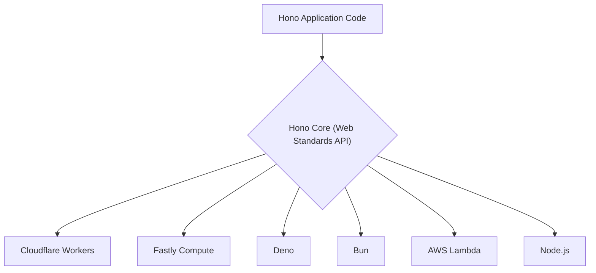
This diagram illustrates how a single Hono application can be deployed to multiple target environments without modification, thanks to its adherence to web standards.

Sources: [README.md:22](https://github.com/honojs/hono/blob/HEAD/README.md#L22), [README.md:45](https://github.com/honojs/hono/blob/HEAD/README.md#L45), [package.json:344-388](https://github.com/honojs/hono/blob/HEAD/package.json#L344-L388)

### Batteries Included 🔋

While the core is lightweight, Hono provides a rich ecosystem of built-in middleware and helpers. This allows developers to easily add common functionalities like authentication, caching, CORS, and logging without relying on a multitude of third-party packages. The modular nature of the project allows these features to be imported on-demand.

Sources: [README.md:46](https://github.com/honojs/hono/blob/HEAD/README.md#L46)

### Delightful Developer Experience (DX) 😃

Hono aims to provide a clean and intuitive API. It has first-class TypeScript support, offering strong typing and autocompletion to enhance developer productivity and reduce errors.

Sources: [README.md:47](https://github.com/honojs/hono/blob/HEAD/README.md#L47)

## Modular Architecture

The Hono package is structured into distinct, importable modules, allowing developers to include only the parts of the framework they need. This is evident in the `exports` field of its `package.json`, which defines numerous entry points for different features.

Sources: [package.json:38-414](https://github.com/honojs/hono/blob/HEAD/package.json#L38-L414)

### Key Modules

The following table summarizes some of the key modules available within the Hono package.

| Module Path | Description | Source |
|---|---|---|
| `hono` | The main entry point for the Hono framework. | [package.json:39-43](https://github.com/honojs/hono/blob/HEAD/package.json#L39-L43) |
| `hono/tiny` | A lightweight preset with minimal features for the smallest bundle size. | [package.json:59-63](https://github.com/honojs/hono/blob/HEAD/package.json#L59-L63), [README.md:44](https://github.com/honojs/hono/blob/HEAD/README.md#L44) |
| `hono/router/*` | A selection of routers, including `RegExpRouter`, `SmartRouter`, and `TrieRouter`. | [package.json:289-313](https://github.com/honojs/hono/blob/HEAD/package.json#L289-L313), [README.md:81](https://github.com/honojs/hono/blob/HEAD/README.md#L81) |
| `hono/middleware/*` | Various built-in middleware such as `basic-auth`, `cors`, `jwt`, and `logger`. | [package.json:74-268](https://github.com/honojs/hono/blob/HEAD/package.json#L74-L268) |
| `hono/helper/*` | Helper utilities for tasks like cookie handling, streaming, and SSG. | [package.json:104-108](https://github.com/honojs/hono/blob/HEAD/package.json#L104-L108), [package.json:269-278](https://github.com/honojs/hono/blob/HEAD/package.json#L269-L278) |
| `hono/adapter/*` | Adapters for specific JavaScript runtimes like Cloudflare, Deno, and AWS Lambda. | [package.json:344-388](https://github.com/honojs/hono/blob/HEAD/package.json#L344-L388) |
| `hono/jsx` | A built-in JSX runtime for server-side rendering of UI components. | [package.json:154-173](https://github.com/honojs/hono/blob/HEAD/package.json#L154-L173) |
| `hono/validator` | A helper for validating incoming data like query parameters, JSON bodies, and headers. | [package.json:279-283](https://github.com/honojs/hono/blob/HEAD/package.json#L279-L283) |

## Community and Contribution

Hono is an open-source project that encourages community involvement. Contributions are welcomed in various forms, including proposing features, reporting bugs, submitting pull requests for fixes or refactoring, and creating third-party middleware. The project maintains active communication channels on X (formerly Twitter) and Discord.

Sources: [README.md:58-71](https://github.com/honojs/hono/blob/HEAD/README.md#L58-L71)

# Page: Core Architecture

<details>
<summary>Relevant source files</summary>

The following files were used as context for generating this wiki page:

- [src/hono.ts](https://github.com/honojs/hono/blob/HEAD/src/hono.ts)
- [src/hono-base.ts](https://github.com/honojs/hono/blob/HEAD/src/hono-base.ts)
- [src/context.ts](https://github.com/honojs/hono/blob/HEAD/src/context.ts)
- [src/compose.ts](https://github.com/honojs/hono/blob/HEAD/src/compose.ts)
</details>

# Core Architecture

Hono's core architecture is designed for high performance and flexibility, centered around a minimal set of key components: the `Hono` and `HonoBase` classes for application and routing setup, a powerful `Context` object for managing the request/response lifecycle, and a `compose` function for executing middleware. This architecture allows developers to build fast web applications on various JavaScript runtimes, especially edge environments.

The request handling flow begins when the `fetch` method is called. It uses a router to match the incoming request to a set of registered handlers. These handlers, which can be middleware or endpoint handlers, are then executed sequentially via the `compose` function. The `Context` object is passed through each handler, providing an API to interact with the request and construct the response.

## Hono Class Hierarchy

The application instance is created from the `Hono` class, which extends `HonoBase` to provide a complete routing and application framework.

Sources: [src/hono.ts](https://github.com/honojs/hono/blob/HEAD/src/hono.ts), [src/hono-base.ts](https://github.com/honojs/hono/blob/HEAD/src/hono-base.ts)

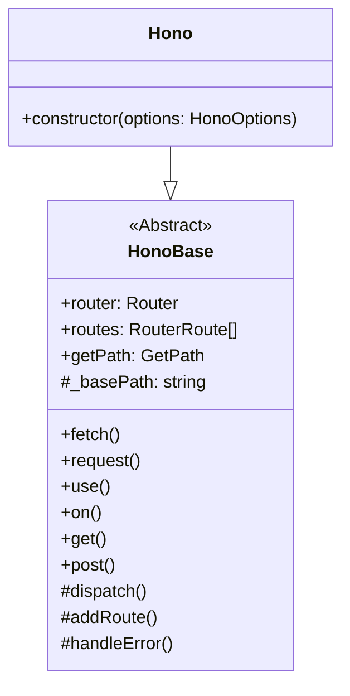
*A diagram illustrating the inheritance relationship between `Hono` and `HonoBase`.*
Sources: [src/hono.ts:16-20](https://github.com/honojs/hono/blob/HEAD/src/hono.ts#L16-L20), [src/hono-base.ts:98-103](https://github.com/honojs/hono/blob/HEAD/src/hono-base.ts#L98-L103)

### `HonoBase` Class

`HonoBase` is the foundational class that implements the core logic for the framework. It is designed to be extended and requires a `Router` implementation to be provided by the subclass.

Key responsibilities of `HonoBase` include:
- **Route Registration**: Provides methods like `.get()`, `.post()`, `.use()`, and `.on()` to register handlers for specific paths and HTTP methods. These methods internally call `#addRoute` to add the handler to the router.
- **Request Dispatching**: The `#dispatch` method is the central hub for request processing. It finds matching routes, creates the `Context` object, and invokes the handler chain.
- **Handler Management**: It manages middleware, error handlers (`onError`), and not-found handlers (`notFound`).
- **Lifecycle Methods**: Implements the main entry point `fetch()` and a testing utility `request()`.

Sources: [src/hono-base.ts:98-543](https://github.com/honojs/hono/blob/HEAD/src/hono-base.ts#L98-L543)

### `Hono` Class

The `Hono` class is the primary user-facing class. It extends `HonoBase` and provides a default router configuration in its constructor. By default, it initializes a `SmartRouter`, which intelligently uses a `RegExpRouter` and a `TrieRouter` for optimal performance.

```typescript
// file: src/hono.ts:26-33
constructor(options: HonoOptions<E> = {}) {
  super(options)
  this.router =
    options.router ??
    new SmartRouter({
      routers: [new RegExpRouter(), new TrieRouter()],
    })
}
```
Sources: [src/hono.ts:16-34](https://github.com/honojs/hono/blob/HEAD/src/hono.ts#L16-L34)

The constructor also accepts `HonoOptions` to customize its behavior.

| Option | Description | Default |
| --- | --- | --- |
| `strict` | If `true` (default), distinguishes between paths with and without a trailing slash. If `false`, treats them as the same. | `true` |
| `router` | Allows providing a custom router instance. | `SmartRouter` |
| `getPath` | A function to customize how the request path is extracted, useful for routing based on hostnames. | `getPath` function from `url.ts` |
Sources: [src/hono-base.ts:46-87](https://github.com/honojs/hono/blob/HEAD/src/hono-base.ts#L46-L87)

## Request Lifecycle and Dispatching

The request lifecycle begins with the `fetch` method and is orchestrated by the private `#dispatch` method within `HonoBase`.

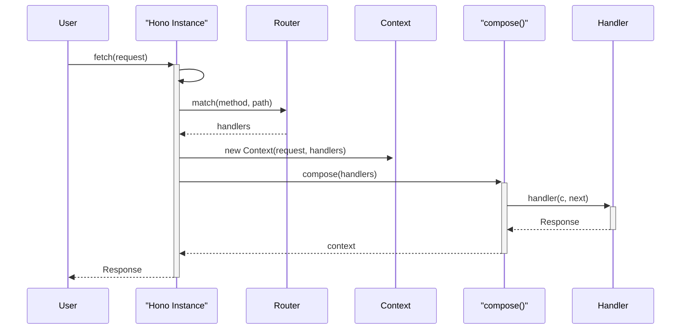
*Sequence of operations for handling a typical request.*
Sources: [src/hono-base.ts:406-466](https://github.com/honojs/hono/blob/HEAD/src/hono-base.ts#L406-L466)

The dispatching process follows these steps:
1.  **Entry Point**: The `fetch` method is called with a `Request` object. It serves as a simple wrapper around the `#dispatch` method.
2.  **Path Extraction**: `#dispatch` calls `this.getPath()` to extract the URL pathname from the request.
3.  **Route Matching**: The configured `router`'s `.match()` method is called with the request's method and path to find all matching handlers.
4.  **Context Creation**: A new `Context` instance is created, encapsulating the request, environment bindings, and the result from the router match.
5.  **Handler Execution**:
    - If only one handler matches, it is invoked directly for performance.
    - If multiple handlers match, the `compose` function is used to create a single executable function that processes the middleware chain.
6.  **Error Handling**: Any errors thrown during handler execution are caught and passed to the registered `errorHandler`.
7.  **Response Generation**: The final `Response` object, either returned from a handler or generated by the error/not-found handler, is returned from `fetch`.

Sources: [src/hono-base.ts:406-485](https://github.com/honojs/hono/blob/HEAD/src/hono-base.ts#L406-L485)

## The `Context` Object

The `Context` class is a central part of Hono. It is passed to every handler and acts as the primary interface for developers to interact with the request and response.

Key features of the `Context` object:
- **Request Access**: The `c.req` property, an instance of `HonoRequest`, provides methods to access request headers, JSON body, query parameters, and path parameters.
- **Response Helpers**: Methods like `c.json()`, `c.text()`, `c.html()`, and `c.redirect()` simplify the creation of `Response` objects with correct headers.
- **State Management**: `c.set()` and `c.get()` allow middleware to pass data to subsequent handlers. The `c.var` property provides read-only access to this data.
- **Environment Access**: `c.env` provides access to environment bindings, secrets, and other resources provided by the runtime (e.g., Cloudflare Workers).
- **Execution Context**: `c.executionCtx` provides access to runtime-specific features like `waitUntil` for extending the lifetime of a request.

```typescript
// file: src/context.ts:293-299
export class Context<
  E extends Env = any,
  P extends string = any,
  I extends Input = {},
> {
  // ...
}
```
Sources: [src/context.ts](https://github.com/honojs/hono/blob/HEAD/src/context.ts)

### Key `Context` Methods

| Method | Description |
| --- | --- |
| `req` | Provides access to the `HonoRequest` object. |
| `json(object, status?, headers?)` | Creates a JSON response with `Content-Type: application/json`. |
| `text(text, status?, headers?)` | Creates a plain text response. |
| `html(html, status?, headers?)` | Creates an HTML response with `Content-Type: text/html`. |
| `redirect(location, status?)` | Creates a redirect response with a `Location` header. |
| `header(name, value, options?)` | Sets a response header. |
| `status(code)` | Sets the HTTP status code for the response. |
| `set(key, value)` | Stores a value in the context for later use. |
| `get(key)` | Retrieves a value from the context. |
| `notFound()` | Invokes the not-found handler to generate a 404 response. |
Sources: [src/context.ts:366-779](https://github.com/honojs/hono/blob/HEAD/src/context.ts#L366-L779)

## Middleware Composition

Hono uses a `compose` function, inspired by Koa.js, to process an array of middleware and handlers. This function creates a single function that executes each handler in sequence.

```mermaid
graph TD
    A[compose(middleware)] --> B{dispatch(0)};
    B --> C{handler = middleware[0]};
    C --> D["handler(context, next)"];
    D --> E{next() called?};
    E -- Yes --> F{dispatch(1)};
    F --> G{handler = middleware[1]};
    G --> H["handler(context, next)"];
    H --> I{...};
    I --> J[Final handler returns Response];
    J --> H;
    H -- returns --> G;
    G -- returns --> F;
    F -- returns --> E;
    E -- No --> K[Handler returns Response];
    K --> D;
    D -- returns --> C;
    C -- returns --> B;
    B --> L[Return context];
```
*Flowchart of the `compose` function's execution logic.*
Sources: [src/compose.ts:15-73](https://github.com/honojs/hono/blob/HEAD/src/compose.ts#L15-L73)

The `compose` function takes an array of handlers, an optional error handler, and an optional not-found handler. It returns a function that, when called with a `Context`, executes the handlers as follows:
1.  It maintains an `index` to track the current position in the middleware chain.
2.  The `dispatch(i)` function is called recursively. It retrieves the handler at index `i`.
3.  The handler is executed with the `context` and a `next` function. The `next` function is a closure that calls `dispatch(i + 1)`.
4.  This ensures that middleware is executed in the correct order. A middleware can perform actions before and after the next middleware in the chain is called.
5.  If `next()` is called multiple times within the same handler, an error is thrown to prevent unexpected behavior.
6.  If an error is thrown by a handler, the `onError` function is invoked.
7.  If the end of the chain is reached and no response has been generated (`context.finalized` is false), the `onNotFound` handler is called.

Sources: [src/compose.ts:15-73](https://github.com/honojs/hono/blob/HEAD/src/compose.ts#L15-L73)

# Page: The Routing System

<details>
<summary>Relevant source files</summary>

The following files were used as context for generating this wiki page:

- [src/router/reg-exp-router/router.ts](https://github.com/honojs/hono/blob/HEAD/src/router/reg-exp-router/router.ts)
- [src/router/smart-router/router.ts](https://github.com/honojs/hono/blob/HEAD/src/router/smart-router/router.ts)
- [src/router/trie-router/router.ts](https://github.com/honojs/hono/blob/HEAD/src/router/trie-router/router.ts)
- [src/router.ts](https://github.com/honojs/hono/blob/HEAD/src/router.ts)
</details>

# The Routing System

The routing system in Hono is a modular and high-performance component responsible for matching incoming request paths to their corresponding handlers. It features a pluggable architecture with multiple router implementations, each optimized for different use cases. The core of the system is the `Router` interface, which defines a standard contract for adding routes and matching paths. Hono provides three main router implementations: `TrieRouter`, `RegExpRouter`, and `SmartRouter`. The `SmartRouter` acts as a meta-router, dynamically selecting the most suitable underlying router at runtime.

Sources: [src/router.ts](https://github.com/honojs/hono/blob/HEAD/src/router.ts), [src/router/trie-router/router.ts](https://github.com/honojs/hono/blob/HEAD/src/router/trie-router/router.ts), [src/router/reg-exp-router/router.ts](https://github.com/honojs/hono/blob/HEAD/src/router/reg-exp-router/router.ts), [src/router/smart-router/router.ts](https://github.com/honojs/hono/blob/HEAD/src/router/smart-router/router.ts)

## Core Routing Abstractions

The foundation of the routing system is defined in `src/router.ts`, which provides the central `Router` interface and common type definitions.

Sources: [src/router.ts](https://github.com/honojs/hono/blob/HEAD/src/router.ts)

### The `Router` Interface

All router implementations must adhere to the `Router<T>` interface, ensuring a consistent API for the Hono framework.

```typescript
export interface Router<T> {
  name: string
  add(method: string, path: string, handler: T): void
  match(method: string, path: string): Result<T>
}
```
*Sources: [src/router.ts:29-52](https://github.com/honojs/hono/blob/HEAD/src/router.ts#L29-L52)*

| Member | Description |
| --- | --- |
| `name` | A `string` identifying the router implementation (e.g., 'TrieRouter'). |
| `add(method, path, handler)` | Registers a handler for a specific HTTP method and path pattern. |
| `match(method, path)` | Finds the handlers that match a given HTTP method and request path. |

### Route Matching Result

The `match` method returns a `Result<T>` object, which contains the matched handlers and the captured path parameters. The result can be one of two formats:

1.  A tuple containing an array of `[handler, ParamIndexMap]` pairs and a `ParamStash` (an array of parameter values).
2.  An array of `[handler, Params]` pairs, where `Params` is a direct key-value map of parameter names to their values.

```typescript
// Format 1: ParamIndexMap and ParamStash
// [[handler, paramIndexMap][], paramArray]
[
  [
    [middlewareA, {}],                     // '*'
    [funcA,       {'id': 0}],              // '/user/:id/*'
    [funcB,       {'id': 0, 'action': 1}], // '/user/:id/:action'
  ],
  ['123', 'abc']
]

// Format 2: Params map
// [[handler, params][]]
[
  [
    [middlewareA, {}],                             // '*'
    [funcA,       {'id': '123'}],                  // '/user/:id/*'
    [funcB,       {'id': '123', 'action': 'abc'}], // '/user/:id/:action'
  ]
]
```
*Sources: [src/router.ts:67-99](https://github.com/honojs/hono/blob/HEAD/src/router.ts#L67-L99)*

## Router Implementations

Hono offers several router implementations, each with distinct characteristics.

### Class Diagram

The following diagram illustrates the relationship between the `Router` interface and its concrete implementations.

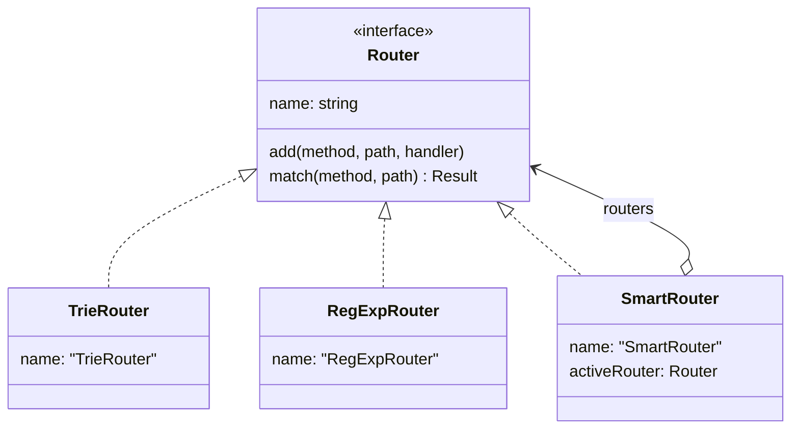
*Sources: [src/router.ts:29-52](https://github.com/honojs/hono/blob/HEAD/src/router.ts#L29-L52), [src/router/trie-router/router.ts:5-28](https://github.com/honojs/hono/blob/HEAD/src/router/trie-router/router.ts#L5-L28), [src/router/reg-exp-router/router.ts:122-252](https://github.com/honojs/hono/blob/HEAD/src/router/reg-exp-router/router.ts#L122-L252), [src/router/smart-router/router.ts:4-70](https://github.com/honojs/hono/blob/HEAD/src/router/smart-router/router.ts#L4-L70)*

### `TrieRouter`

The `TrieRouter` uses a trie data structure for efficient path matching. It is generally fast for adding routes and performs well for matching, especially with many static routes.

-   **`add(method, path, handler)`**: Inserts the handler into a `Node` (trie) structure. It supports optional parameters by using the `checkOptionalParameter` utility to generate all possible path variations and adds each one to the trie.
-   **`match(method, path)`**: Delegates the matching logic to the root `Node`'s `search` method, which traverses the trie to find the appropriate handlers.

*Sources: [src/router/trie-router/router.ts](https://github.com/honojs/hono/blob/HEAD/src/router/trie-router/router.ts)*

The diagram below shows the logic for adding a route.

```mermaid
graph TD
    A[TrieRouter.add(method, path, handler)] --> B{Path has optional parameters?};
    B -- Yes --> C["checkOptionalParameter(path)"];
    C --> D[Loop through each path variation];
    D --> E["this.#node.insert(method, variation, handler)"];
    E --> D;
    B -- No --> F["this.#node.insert(method, path, handler)"];
    F --> G[End];
    D -- End of loop --> G;
```
*Sources: [src/router/trie-router/router.ts:13-23](https://github.com/honojs/hono/blob/HEAD/src/router/trie-router/router.ts#L13-L23)*

### `RegExpRouter`

The `RegExpRouter` is designed for high-performance matching by compiling all routes for a given HTTP method into a single, large regular expression. This involves a one-time build cost, after which matching is extremely fast.

-   **`add(method, path, handler)`**: Routes and middleware are temporarily stored in internal maps (`#routes` and `#middleware`). It handles wildcards (`*`) and optional parameters.
-   **`match(method, path)`**: On the first call, it triggers the build process. It then uses the generated matcher for the given method to match the path.
-   **Build Process**: The private `buildAllMatchers` method orchestrates the compilation. For each method, it calls `#buildMatcher`, which uses `buildMatcherFromPreprocessedRoutes` to convert route paths into a trie, and then builds a single RegExp from that trie. After the build, the initial route maps are discarded to save memory.

*Sources: [src/router/reg-exp-router/router.ts](https://github.com/honojs/hono/blob/HEAD/src/router/reg-exp-router/router.ts)*

The build process is visualized below.

```mermaid
graph TD
    subgraph Build Process
        A[buildAllMatchers()] --> B{For each HTTP method};
        B --> C["#buildMatcher(method)"];
        C --> D[Collect routes and middleware];
        D --> E[buildMatcherFromPreprocessedRoutes(routes)];
        E --> F[Create Trie];
        F --> G[Insert all paths into Trie];
        G --> H["trie.buildRegExp()"];
        H --> I[Build handler and parameter maps];
        I --> J[Return Matcher];
        J --> K["Store Matcher in map"];
    end
    B -- All methods processed --> L[Clear route/middleware caches];
    L --> M[Return MatcherMap];
```
*Sources: [src/router/reg-exp-router/router.ts:208-251](https://github.com/honojs/hono/blob/HEAD/src/router/reg-exp-router/router.ts#L208-L251)*

### `SmartRouter`

The `SmartRouter` is a meta-router that benchmarks other routers to select the best one for the defined routes.

-   **Initialization**: It is initialized with an array of router instances to choose from (e.g., `[new TrieRouter(), new RegExpRouter()]`).
-   **`add(method, path, handler)`**: It simply buffers all routes in an internal array.
-   **`match(method, path)`**: On the first invocation, it performs the selection logic:
    1.  It iterates through the provided routers.
    2.  For each router, it adds all buffered routes.
    3.  It attempts to perform a match.
    4.  If a router throws an `UnsupportedPathError`, it is skipped.
    5.  The first router that successfully returns a match is selected as the `activeRouter`.
    6.  The `SmartRouter`'s `match` method is then replaced with the `activeRouter`'s `match` method, and the route buffer is cleared. All subsequent calls go directly to the chosen router.

*Sources: [src/router/smart-router/router.ts](https://github.com/honojs/hono/blob/HEAD/src/router/smart-router/router.ts)*

The router selection logic is as follows:

```mermaid
sequenceDiagram
    participant Client
    participant SmartRouter
    participant RouterA
    participant RouterB

    Client->>+SmartRouter: match(method, path)
    Note over SmartRouter: First call, selection logic runs
    SmartRouter->>SmartRouter: Loop through routers (e.g., RouterA, RouterB)
    
    SmartRouter->>+RouterA: add(all_routes)
    RouterA-->>-SmartRouter: 
    SmartRouter->>+RouterA: match(method, path)
    alt Match succeeds
        RouterA-->>-SmartRouter: Result
        SmartRouter->>SmartRouter: Set RouterA as activeRouter
        SmartRouter->>SmartRouter: Bind future calls to RouterA.match
        SmartRouter-->>-Client: Result
    else Path unsupported
        RouterA-->>xSmartRouter: UnsupportedPathError
        SmartRouter->>+RouterB: add(all_routes)
        RouterB-->>-SmartRouter: 
        SmartRouter->>+RouterB: match(method, path)
        RouterB-->>-SmartRouter: Result
        SmartRouter->>SmartRouter: Set RouterB as activeRouter
        SmartRouter-->>-Client: Result
    end
```
*Sources: [src/router/smart-router/router.ts:21-61](https://github.com/honojs/hono/blob/HEAD/src/router/smart-router/router.ts#L21-L61)*

# Page: Using and Creating Middleware

<details>
<summary>Relevant source files</summary>

The following files were used as context for generating this wiki page:

- [src/middleware/basic-auth/index.ts](https://github.com/honojs/hono/blob/HEAD/src/middleware/basic-auth/index.ts)
- [src/middleware/cors/index.ts](https://github.com/honojs/hono/blob/HEAD/src/middleware/cors/index.ts)
- [src/middleware/jwt/index.ts](https://github.com/honojs/hono/blob/HEAD/src/middleware/jwt/index.ts)
- [src/helper/factory/index.ts](https://github.com/honojs/hono/blob/HEAD/src/helper/factory/index.ts)
</details>

# Using and Creating Middleware

Middleware in Hono are functions that process a request and response. They can be chained together to perform tasks like authentication, logging, CORS handling, and data parsing. A middleware function receives the `Context` object and a `next` function. It can modify the context, return a `Response` to terminate the request-response cycle, or call `await next()` to pass control to the next middleware in the chain.

Hono provides a collection of built-in middleware for common tasks, and also offers factory helpers to facilitate the creation of custom, type-safe middleware. This allows developers to build modular and reusable logic for their applications.

## Built-in Middleware

Hono includes several pre-built middleware modules to handle common web development needs. These can be applied to all routes using `app.use('*', ...)` or to specific route patterns like `app.use('/api/*', ...)`.

### Basic Authentication

The Basic Auth middleware provides a simple way to protect routes with username and password authentication. It can be configured with static credentials or a custom verification function.

**Configuration Options**

The middleware is configured via an options object. There are two primary modes of operation.

| Option | Type | Description |
| --- | --- | --- |
| `username` | `string` | A static username for authentication. Must be used with `password`. |
| `password` | `string` | A static password for authentication. Must be used with `username`. |
| `verifyUser` | `(user, pass, c) => boolean \| Promise<boolean>` | A function to dynamically verify user credentials. |
| `realm` | `string` | The realm for the `WWW-Authenticate` header. Defaults to "Secure Area". |
| `hashFunction` | `Function` | A function used for timing-safe comparison of credentials. |
| `invalidUserMessage` | `string \| object \| MessageFunction` | The message returned on failed authentication. Defaults to "Unauthorized". |
| `onAuthSuccess` | `(c, username) => void \| Promise<void>` | A callback function executed on successful authentication. |

*Sources: [src/middleware/basic-auth/index.ts:14-29](https://github.com/honojs/hono/blob/HEAD/src/middleware/basic-auth/index.ts#L14-L29)*

**Authentication Flow**

The middleware first checks for an `Authorization` header in the request. If present, it attempts to verify the credentials using either the `verifyUser` function or by comparing against the provided `username`/`password` pairs with a timing-safe equality check. If authentication is successful, it calls `next()`. Otherwise, it throws an `HTTPException` with a 401 status and a `WWW-Authenticate` header.

```mermaid
sequenceDiagram
    participant Client
    participant Middleware as basicAuth()
    participant NextHandler as next()
    participant Hono

    Client->>+Middleware: Request with "Authorization" header
    Middleware->>Middleware: Parse credentials from header
    alt Credentials provided
        alt verifyUser option
            Middleware->>+Hono: await options.verifyUser(...)
            Hono-->>-Middleware: boolean (verification result)
        else username/password option
            loop for each user
                Middleware->>Middleware: await timingSafeEqual(...)
            end
        end
        alt Authentication successful
            opt onAuthSuccess callback
                 Middleware->>+Hono: await options.onAuthSuccess(c, username)
                 Hono-->>-Middleware: void
            end
            Middleware->>+NextHandler: await next()
            NextHandler-->>-Middleware: Response
            Middleware-->>Client: Response
        else Authentication failed
            Note right of Middleware: Authentication fails
            Middleware->>Hono: throw new HTTPException(401)
            Hono-->>-Client: 401 Unauthorized Response
        end
    else No credentials
        Note right of Middleware: No "Authorization" header
        Middleware->>Hono: throw new HTTPException(401)
        Hono-->>-Client: 401 Unauthorized Response
    end
```
*Sources: [src/middleware/basic-auth/index.ts:105-152](https://github.com/honojs/hono/blob/HEAD/src/middleware/basic-auth/index.ts#L105-L152)*

### CORS

The CORS (Cross-Origin Resource Sharing) middleware simplifies handling CORS headers, which are necessary for allowing web clients from different origins to interact with the API.

**Configuration Options**

| Option | Type | Default | Description |
| --- | --- | --- | --- |
| `origin` | `string \| string[] \| Function` | `*` | Configures the `Access-Control-Allow-Origin` header. Can be a static string, an array of allowed origins, or a function for dynamic validation. |
| `allowMethods` | `string[] \| Function` | `['GET', 'HEAD', 'PUT', 'POST', 'DELETE', 'PATCH']` | Configures the `Access-Control-Allow-Methods` header. |
| `allowHeaders` | `string[]` | `[]` | Configures the `Access-Control-Allow-Headers` header. |
| `maxAge` | `number` | `undefined` | Configures the `Access-Control-Max-Age` header. |
| `credentials` | `boolean` | `undefined` | Configures the `Access-Control-Allow-Credentials` header. |
| `exposeHeaders` | `string[]` | `[]` | Configures the `Access-Control-Expose-Headers` header. |

*Sources: [src/middleware/cors/index.ts:9-22](https://github.com/honojs/hono/blob/HEAD/src/middleware/cors/index.ts#L9-L22), [src/middleware/cors/index.ts:64-70](https://github.com/honojs/hono/blob/HEAD/src/middleware/cors/index.ts#L64-L70)*

**Request Handling Logic**

The middleware behaves differently for preflight (`OPTIONS`) requests versus actual requests. For preflight requests, it sets the appropriate `Access-Control-*` headers and returns a `204 No Content` response immediately. For other requests, it sets the `Access-Control-Allow-Origin` header and then calls `next()` to pass control to subsequent handlers.

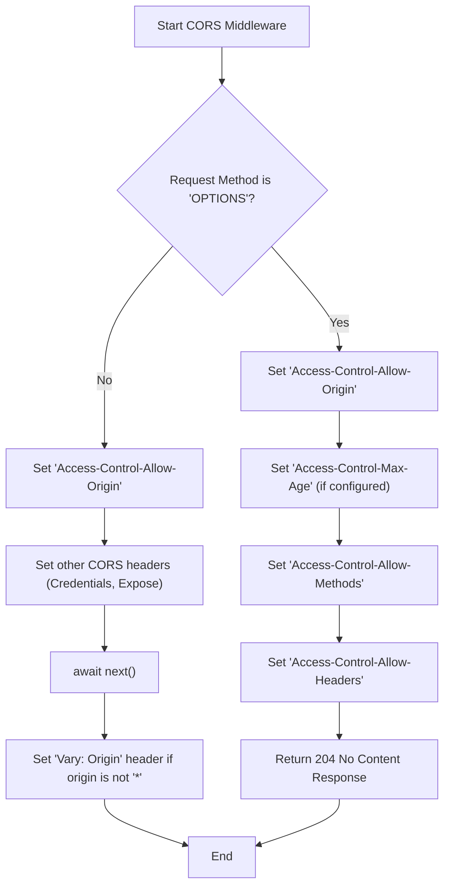
*Sources: [src/middleware/cors/index.ts:96-156](https://github.com/honojs/hono/blob/HEAD/src/middleware/cors/index.ts#L96-L156)*

### JWT

Hono provides a JWT (JSON Web Token) middleware for token-based authentication. The main index file for this middleware exports the core functions and augments the global `ContextVariableMap` to include JWT payload data.

The module exports the following key functions:
- `jwt`: The middleware function itself.
- `verify`: A function to verify a JWT.
- `decode`: A function to decode a JWT without verification.
- `sign`: A function to sign a payload and create a JWT.
- `verifyWithJwks`: A function to verify a JWT against a JSON Web Key Set (JWKS).

It also extends the Hono `Context` type, allowing authenticated token data to be available via `c.var.jwtPayload`.

*Sources: [src/middleware/jwt/index.ts:1-9](https://github.com/honojs/hono/blob/HEAD/src/middleware/jwt/index.ts#L1-L9)*

## Creating Custom Middleware

While Hono's built-in middleware is useful, applications often require custom logic. Hono provides helpers to create new, type-safe middleware.

### The `MiddlewareHandler` Type

A middleware is fundamentally a function that matches the `MiddlewareHandler` type signature. It's an async function that takes `Context` and `next` as arguments.

```typescript
// A simplified representation
type MiddlewareHandler = (c: Context, next: Next) => Promise<Response | void>
```

### Using the Factory Helper

The `factory` helper provides utilities to streamline the creation of middleware and handlers. This is particularly useful for library authors or for creating reusable components within a large application.

*Sources: [src/helper/factory/index.ts:1-4](https://github.com/honojs/hono/blob/HEAD/src/helper/factory/index.ts#L1-L4)*

**`createMiddleware()`**

The `createMiddleware` function is a simple identity function that provides strong type inference for your middleware. It ensures that the function you write conforms to the `MiddlewareHandler` signature.

```typescript
import { createMiddleware } from 'hono/factory'

export const loggingMiddleware = createMiddleware(async (c, next) => {
  console.log(`--> ${c.req.method} ${c.req.url}`)
  await next()
  console.log(`<-- ${c.res.status}`)
})
```
*Sources: [src/helper/factory/index.ts:368-375](https://github.com/honojs/hono/blob/HEAD/src/helper/factory/index.ts#L368-L375)*

**The `Factory` Class**

For more advanced use cases, you can use the `Factory` class, created via `createFactory`. This allows you to define a base configuration or initialization logic (`initApp`) that can be applied to multiple Hono app instances.

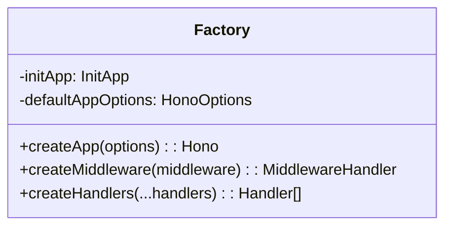
*Sources: [src/helper/factory/index.ts:332-361](https://github.com/honojs/hono/blob/HEAD/src/helper/factory/index.ts#L332-L361)*

The `createHandlers` method is a utility with multiple overloads to correctly type an array of handlers, preserving the environment and input types as they are composed. This is useful for building complex, multi-handler routes in a type-safe manner.

*Sources: [src/helper/factory/index.ts:20-330](https://github.com/honojs/hono/blob/HEAD/src/helper/factory/index.ts#L20-L330)*

## Summary

Hono's middleware system is a core feature, providing both powerful built-in utilities and a flexible architecture for creating custom logic. By understanding the `MiddlewareHandler` signature and leveraging tools like the `factory` helper, developers can create clean, modular, and type-safe applications. The built-in `basicAuth`, `cors`, and `jwt` middleware cover essential security and API functionality, serving as both practical tools and excellent examples of middleware implementation.

# Page: Runtime Adapters

<details>
<summary>Relevant source files</summary>

The following files were used as context for generating this wiki page:

- [src/adapter/cloudflare-workers/index.ts](https://github.com/honojs/hono/blob/HEAD/src/adapter/cloudflare-workers/index.ts)
- [src/adapter/deno/index.ts](https://github.com/honojs/hono/blob/HEAD/src/adapter/deno/index.ts)
- [src/adapter/bun/index.ts](https://github.com/honojs/hono/blob/HEAD/src/adapter/bun/index.ts)
- [src/adapter/aws-lambda/index.ts](https://github.com/honojs/hono/blob/HEAD/src/adapter/aws-lambda/index.ts)
- [src/helper/adapter/index.ts](https://github.com/honojs/hono/blob/HEAD/src/helper/adapter/index.ts)
</details>

# Runtime Adapters

Hono is designed to be a lightweight, fast, and runtime-agnostic web framework. The runtime adapter system is the core mechanism that enables Hono applications to run on various JavaScript environments, including serverless platforms and edge computing runtimes. Each adapter provides a compatibility layer, exporting platform-specific implementations for functionalities like serving static files, handling WebSockets, and retrieving connection information.

This system is complemented by a set of adapter helpers that provide utilities for runtime detection and unified access to environment variables, allowing developers to write portable code that can seamlessly operate across different platforms.

## Architecture Overview

The adapter architecture decouples the core Hono application logic from the underlying runtime environment. A Hono application is written using a standard API, and the appropriate adapter is used to bind the application to the specific request/response objects and features of the target platform.

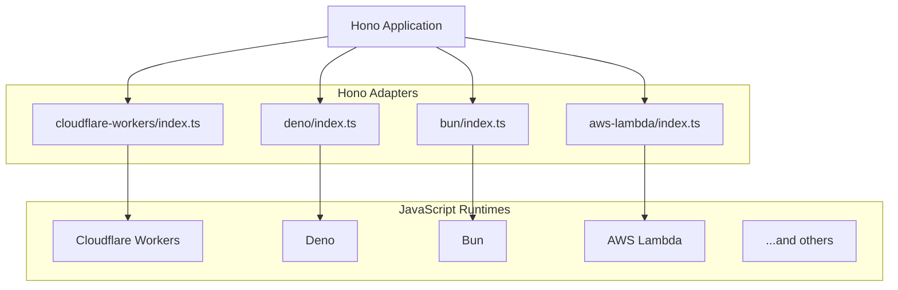
This diagram illustrates how a single Hono application can be deployed to multiple runtimes by simply using the corresponding adapter module.

Sources: [src/adapter/cloudflare-workers/index.ts](https://github.com/honojs/hono/blob/HEAD/src/adapter/cloudflare-workers/index.ts), [src/adapter/deno/index.ts](https://github.com/honojs/hono/blob/HEAD/src/adapter/deno/index.ts), [src/adapter/bun/index.ts](https://github.com/honojs/hono/blob/HEAD/src/adapter/bun/index.ts), [src/adapter/aws-lambda/index.ts](https://github.com/honojs/hono/blob/HEAD/src/adapter/aws-lambda/index.ts)

## Common Adapter Features

While each adapter is tailored to its specific runtime, several common functionalities are exposed across multiple adapters. This allows for consistent feature usage in different environments.

| Feature | Cloudflare Workers | Deno | Bun | AWS Lambda |
| :--- | :---: | :---: | :---: | :---: |
| `serveStatic` | ✅ | ✅ | ✅ | ❌ |
| `upgradeWebSocket` | ✅ | ✅ | ✅ | ❌ |
| `getConnInfo` | ✅ | ✅ | ✅ | ✅ |
| `toSSG` | ❌ | ✅ | ✅ | ❌ |
| Request Handler (`handle`) | ❌ | ❌ | ❌ | ✅ |

Sources: [src/adapter/cloudflare-workers/index.ts:6-8](https://github.com/honojs/hono/blob/HEAD/src/adapter/cloudflare-workers/index.ts#L6-L8), [src/adapter/deno/index.ts:6-9](https://github.com/honojs/hono/blob/HEAD/src/adapter/deno/index.ts#L6-L9), [src/adapter/bun/index.ts:6-11](https://github.com/honojs/hono/blob/HEAD/src/adapter/bun/index.ts#L6-L11), [src/adapter/aws-lambda/index.ts:6-8](https://github.com/honojs/hono/blob/HEAD/src/adapter/aws-lambda/index.ts#L6-L8)

## Adapter Helpers

The `src/helper/adapter/index.ts` module provides utility functions that are essential for creating portable middleware and applications. These helpers abstract away runtime-specific details.

### Runtime Identification

The `getRuntimeKey()` function detects the current JavaScript runtime. This is crucial for conditional logic that needs to behave differently based on the environment.

The detection logic follows a specific sequence:
1.  Check `navigator.userAgent` against a list of known user agent strings.
2.  If not found, check for the Vercel Edge `EdgeRuntime` global.
3.  If not found, check for the Fastly Compute `fastly` global.
4.  As a fallback for older Node.js versions, check `process.release.name`.
5.  If no runtime is identified, it returns `'other'`.

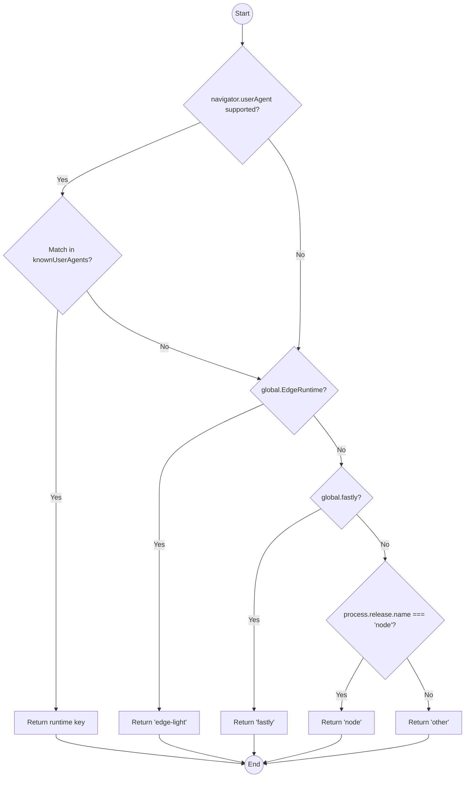
Sources: [src/helper/adapter/index.ts:50-84](https://github.com/honojs/hono/blob/HEAD/src/helper/adapter/index.ts#L50-L84)

The `knownUserAgents` object maps runtime keys to their expected `navigator.userAgent` prefix.

| Runtime Key | User Agent String |
| :--- | :--- |
| `deno` | `Deno` |
| `bun` | `Bun` |
| `workerd` | `Cloudflare-Workers` |
| `node` | `Node.js` |

Sources: [src/helper/adapter/index.ts:43-48](https://github.com/honojs/hono/blob/HEAD/src/helper/adapter/index.ts#L43-L48)

### Environment Variable Handling

The `env()` helper function provides a unified API for accessing environment variables across different runtimes. It internally calls `getRuntimeKey()` to determine the correct method for retrieving the environment object.

```mermaid
graph TD
    Start((Start env(c, runtime))) --> GetRuntime{runtime ?? getRuntimeKey()};
    GetRuntime --> SwitchRuntime{Switch on runtime};
    SwitchRuntime -- "bun, node, edge-light" --> GetGlobalEnv["return globalThis.process.env"];
    SwitchRuntime -- "deno" --> GetDenoEnv["return Deno.env.toObject()"];
    SwitchRuntime -- "workerd" --> GetContextEnv["return c.env"];
    SwitchRuntime -- "fastly, other" --> GetEmptyObj["return {}"];
    GetGlobalEnv --> End((Return env object));
    GetDenoEnv --> End;
    GetContextEnv --> End;
    GetEmptyObj --> End;
```
This abstraction allows middleware to access bindings and environment variables without needing to know if it's running on Node.js (via `process.env`), Deno (via `Deno.env`), or Cloudflare Workers (via `c.env`).

Sources: [src/helper/adapter/index.ts:10-41](https://github.com/honojs/hono/blob/HEAD/src/helper/adapter/index.ts#L10-L41)

## Platform-Specific Adapters

Each adapter module re-exports platform-specific implementations.

### Cloudflare Workers (`cloudflare-workers`)

This adapter focuses on core server functionalities relevant to the Cloudflare Workers environment.
-   `serveStatic`: Serves static assets.
-   `upgradeWebSocket`: Handles WebSocket upgrade requests.
-   `getConnInfo`: Retrieves connection information.

Sources: [src/adapter/cloudflare-workers/index.ts:6-8](https://github.com/honojs/hono/blob/HEAD/src/adapter/cloudflare-workers/index.ts#L6-L8)

### Deno (`deno`)

The Deno adapter provides utilities for serving, server-side generation, and WebSockets.
-   `serveStatic`: Serves static assets from the filesystem.
-   `toSSG`: Helper for Static Site Generation.
-   `upgradeWebSocket`: Handles WebSocket upgrade requests.
-   `getConnInfo`: Retrieves connection information.

Sources: [src/adapter/deno/index.ts:6-9](https://github.com/honojs/hono/blob/HEAD/src/adapter/deno/index.ts#L6-L9)

### Bun (`bun`)

The Bun adapter is the most feature-rich, providing extensive WebSocket support and SSG capabilities.
-   `serveStatic`: Serves static assets.
-   `toSSG`: Helper for Static Site Generation.
-   `createBunWebSocket`, `upgradeWebSocket`, `websocket`: A suite of functions for advanced WebSocket handling.
-   `getConnInfo`: Retrieves connection information.
-   `getBunServer`: Utility to get the underlying Bun server instance.

Sources: [src/adapter/bun/index.ts:6-11](https://github.com/honojs/hono/blob/HEAD/src/adapter/bun/index.ts#L6-L11)

### AWS Lambda (`aws-lambda`)

The AWS Lambda adapter is structured differently, focusing on request handlers that convert Lambda events into standard `Request` objects that Hono can process.
-   `handle`, `streamHandle`: The primary functions for processing Lambda events. `streamHandle` is for response streaming.
-   `getConnInfo`: Retrieves connection information from the Lambda event payload.
-   Exports various TypeScript types for Lambda events and contexts (`APIGatewayProxyResult`, `LambdaEvent`, etc.).

Sources: [src/adapter/aws-lambda/index.ts:6-14](https://github.com/honojs/hono/blob/HEAD/src/adapter/aws-lambda/index.ts#L6-L14)

# Page: JSX and UI Rendering

<details>
<summary>Relevant source files</summary>

The following files were used as context for generating this wiki page:

- [src/jsx/index.ts](https://github.com/honojs/hono/blob/HEAD/src/jsx/index.ts)
- [src/jsx/jsx-runtime.ts](https://github.com/honojs/hono/blob/HEAD/src/jsx/jsx-runtime.ts)
- [src/jsx/streaming.ts](https://github.com/honojs/hono/blob/HEAD/src/jsx/streaming.ts)
- [src/middleware/jsx-renderer/index.ts](https://github.com/honojs/hono/blob/HEAD/src/middleware/jsx-renderer/index.ts)
</details>

# JSX and UI Rendering

Hono includes a built-in JSX engine for server-side rendering of UI components, offering a familiar, React-like development experience. This system is designed for performance, supporting modern features like asynchronous rendering with `Suspense` and streaming responses directly from the server. The core integration is handled by the `jsxRenderer` middleware, which provides a `c.render()` method to the Hono context for rendering JSX components within request handlers. The API is highly compatible with React, providing a wide range of hooks and components like `useState`, `useEffect`, `useContext`, `Fragment`, and `ErrorBoundary`.

## JSX Runtime

Hono's JSX runtime is responsible for transforming JSX syntax into renderable output. It provides the necessary functions that a JSX transpiler (like Babel or TypeScript) calls during compilation. The primary exports for the runtime are `jsx` and `jsxs`, which are aliased from `jsxDEV` for development. These functions process the JSX elements, their properties, and children.

Sources: [src/jsx/jsx-runtime.ts:6-8](https://github.com/honojs/hono/blob/HEAD/src/jsx/jsx-runtime.ts#L6-L8)

### Attribute and Style Handling

Attributes are converted to HTML strings by the `jsxAttr` function. It handles various value types, including strings, numbers, and promises. It also contains special logic for the `style` attribute: if a style object is provided, `jsxAttr` iterates over it and converts it into a CSS string.

```typescript
// src/jsx/jsx-runtime.ts:24-33
if (key === 'style' && typeof v === 'object') {
  // object to style strings
  let styleStr = ''
  styleObjectForEach(v as Record<string, string | number>, (property, value) => {
    if (value != null) {
      styleStr += `${styleStr ? ';' : ''}${property}:${value}`
    }
  })
  escapeToBuffer(styleStr, buffer)
  buffer[0] += '"'
}
```

This function ensures that attribute names are valid using `isValidAttributeName` before processing.

Sources: [src/jsx/jsx-runtime.ts:16-49](https://github.com/honojs/hono/blob/HEAD/src/jsx/jsx-runtime.ts#L16-L49)

## React API Compatibility

Hono's JSX module provides a high degree of compatibility with the React API, allowing developers to use familiar patterns and hooks. The main entry point `src/jsx/index.ts` aggregates and exports these features.

The following table summarizes the key React-compatible APIs available in Hono:

| Feature | Export Name(s) | Description |
| :--- | :--- | :--- |
| Core | `jsx`, `createElement` | Function for creating JSX elements. |
| Fragments | `Fragment`, `StrictMode` | Renders children without a wrapper DOM element. `StrictMode` is an alias for `Fragment`. |
| Components | `memo`, `forwardRef` | Higher-order components for optimization and ref forwarding. |
| Hooks | `useState`, `useEffect`, `useContext`, `useReducer`, `useRef`, `useCallback`, `useMemo`, `useId`, etc. | A comprehensive set of standard React hooks. |
| Async | `Suspense`, `use`, `useTransition` | Support for asynchronous data fetching and rendering transitions. |
| Context | `createContext`, `useContext` | API for passing data through the component tree without prop-drilling. |
| Utilities | `isValidElement`, `cloneElement`, `Children` | Helper functions for working with JSX elements. |

Sources: [src/jsx/index.ts:36-110](https://github.com/honojs/hono/blob/HEAD/src/jsx/index.ts#L36-L110)

## Server-Side Rendering and Streaming

Hono's JSX engine is built for the server, with first-class support for streaming HTML responses. This is primarily managed by the `jsxRenderer` middleware and the `Suspense` component.

### `jsxRenderer` Middleware

This middleware is the primary integration point for using JSX in a Hono application. It configures a renderer on the context object, making `c.render()` available in subsequent handlers.

```typescript
// src/middleware/jsx-renderer/index.ts:120-129
function jsxRenderer(c, next) {
  const Layout = (c.getLayout() ?? Fragment) as FC
  if (component) {
    c.setLayout((props) => {
      return component({ ...props, Layout }, c)
    })
  }
  c.setRenderer(createRenderer(c, Layout, component, options) as any)
  return next()
}
```

The middleware can be configured with options for `docType` and `stream`. When `stream` is enabled, the renderer uses `renderToReadableStream` to send a chunked response.

```mermaid
graph TD
    A[Request arrives] --> B{jsxRenderer Middleware};
    B --> C["c.setRenderer() is called"];
    C --> D[next()];
    D --> E[Route Handler];
    E --> F["c.render(...)"];
    F --> G{createRenderer};
    G --> H{options.stream?};
    H -- Yes --> I["c.body(renderToReadableStream(...))"];
    H -- No --> J["c.html(...)"];
    I --> K[Streaming Response];
    J --> L[Complete HTML Response];
```
*Diagram: Flow of a request through the `jsxRenderer` middleware.*

Sources: [src/middleware/jsx-renderer/index.ts:82-129](https://github.com/honojs/hono/blob/HEAD/src/middleware/jsx-renderer/index.ts#L82-L129)

### Streaming with `Suspense`

Hono supports streaming rendering out-of-the-box with the `<Suspense>` component. This allows the server to send an initial HTML document with a fallback UI, and then stream the content of asynchronous components as they resolve.

When a child component of `<Suspense>` throws a `Promise` (a common pattern for data fetching), the `Suspense` boundary catches it and renders the `fallback` content. The server sends a `<template>` tag as a placeholder for the final content. Once the promise resolves, the server streams a small `<script>` that finds the template and replaces it with the resolved content.

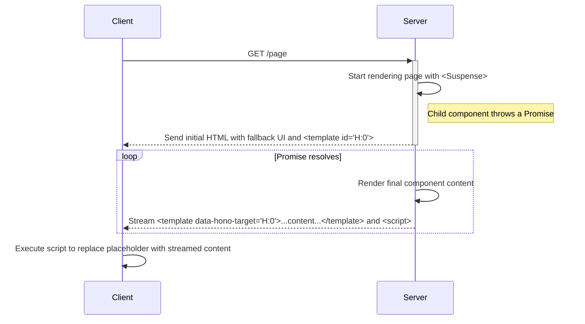
*Diagram: Server-client interaction for a component rendered with `Suspense`.*

The `Suspense` implementation manages this process by returning a raw HTML string that includes a callback. This callback is executed by the streaming renderer to send the final content once the async operations are complete.

Sources: [src/jsx/streaming.ts:41-137](https://github.com/honojs/hono/blob/HEAD/src/jsx/streaming.ts#L41-L137)

### `renderToReadableStream`

This function is the engine behind Hono's JSX streaming. It takes a JSX node and returns a `ReadableStream`. It resolves the initial part of the content and then handles any promises or callbacks embedded in the JSX tree, writing their results to the stream as they become available. The function recursively resolves callbacks, allowing for nested `Suspense` boundaries and other complex asynchronous scenarios. It also includes an `onError` callback to handle errors during the streaming process.

Sources: [src/jsx/streaming.ts:146-220](https://github.com/honojs/hono/blob/HEAD/src/jsx/streaming.ts#L146-L220)

## Accessing Request Context

Components often need access to request-specific information. The `jsxRenderer` middleware provides this by wrapping the entire rendered output in a `RequestContext.Provider`.

```typescript
// src/middleware/jsx-renderer/index.ts:60-64
const body = html`${raw(docType)}${jsx(
  RequestContext.Provider,
  { value: c },
  currentLayout as any
)}`
```

Components can then use the `useRequestContext` hook to access the Hono `Context` object (`c`).

```typescript
// src/middleware/jsx-renderer/index.ts:155-165
export const useRequestContext = <
  E extends Env = any,
  P extends string = any,
  I extends Input = {},
>(): Context<E, P, I> => {
  const c = useContext(RequestContext)
  if (!c) {
    throw new Error('RequestContext is not provided.')
  }
  return c
}
```
This enables components to read request headers, URL parameters, or perform other context-dependent actions.

Sources: [src/middleware/jsx-renderer/index.ts:15-17, 60-64, 131-165]()

# Page: Static Site Generation (SSG)

<details>
<summary>Relevant source files</summary>

The following files were used as context for generating this wiki page:

- [src/helper/ssg/ssg.ts](https://github.com/honojs/hono/blob/HEAD/src/helper/ssg/ssg.ts)
- [src/helper/ssg/middleware.ts](https://github.com/honojs/hono/blob/HEAD/src/helper/ssg/middleware.ts)
- [src/helper/ssg/utils.ts](https://github.com/honojs/hono/blob/HEAD/src/helper/ssg/utils.ts)
- [src/helper/ssg/ssg.test.tsx](https://github.com/honojs/hono/blob/HEAD/src/helper/ssg/ssg.test.tsx)
</details>

# Static Site Generation (SSG)

The Static Site Generation (SSG) feature in Hono allows for the pre-rendering of a Hono application's routes into static files. This process happens at build time, generating HTML, JSON, or other static assets that can be served directly from a CDN or static host. The primary entry point for this functionality is the `toSSG` function, which orchestrates route discovery, content fetching, and file system writing. The system is designed to be flexible, supporting dynamic routes through parameter-providing middleware and offering extensive customization via a plugin and hook system.

Sources: [src/helper/ssg/ssg.ts:368-470](https://github.com/honojs/hono/blob/HEAD/src/helper/ssg/ssg.ts#L368-L470), [src/helper/ssg/middleware.ts](https://github.com/honojs/hono/blob/HEAD/src/helper/ssg/middleware.ts)

## Core Generation Process

The SSG process is initiated by calling the `toSSG` function. This function takes the Hono application instance, a file system module, and an options object as arguments. It returns a `ToSSGResult` object indicating the success of the operation and a list of generated files.

Sources: [src/helper/ssg/ssg.ts:341-348](https://github.com/honojs/hono/blob/HEAD/src/helper/ssg/ssg.ts#L341-L348), [src/helper/ssg/ssg.ts:368-368](https://github.com/honojs/hono/blob/HEAD/src/helper/ssg/ssg.ts#L368-L368)

The overall data flow for generating static files is as follows:

```mermaid
graph TD
    subgraph toSSG
        A["toSSG(app, fs, options)"] --> B{Combine Hooks & Plugins};
        B --> C[fetchRoutesContent];
        C --> D{Iterate over content};
        D --> E[saveContentToFile];
        E --> F[Promise.all(savePromises)];
        F --> G[afterGenerateHook];
        G --> H[Return ToSSGResult];
    end

    subgraph fetchRoutesContent
        C --> C1[filterStaticGenerateRoutes];
        C1 --> C2{For each static route};
        C2 --> C3["beforeRequestHook(req)"];
        C3 --> C4["app.fetch(req) to get ssgParams"];
        C4 --> C5{For each param};
        C5 --> C6["app.request(url, ...)"];
        C6 --> C7["afterResponseHook(res)"];
        C7 --> C8[parseResponseContent];
        C8 --> C9[Yield Promise<content>];
    end

    subgraph saveContentToFile
        E --> E1[generateFilePath];
        E1 --> E2["fs.mkdir(dir)"];
        E2 --> E3["fs.writeFile(path, content)"];
    end
```
This diagram illustrates the main stages: initializing hooks, fetching content for all applicable routes, saving that content to files, and executing post-generation hooks before returning the final result.

Sources: [src/helper/ssg/ssg.ts:368-470](https://github.com/honojs/hono/blob/HEAD/src/helper/ssg/ssg.ts#L368-L470)

### Key Functions

-   **`toSSG`**: The main orchestrator. It initializes hooks, calls `fetchRoutesContent` to get route data, uses `saveContentToFile` to write files, and manages the overall process including error handling.
    Sources: [src/helper/ssg/ssg.ts:368-470](https://github.com/honojs/hono/blob/HEAD/src/helper/ssg/ssg.ts#L368-L470)
-   **`fetchRoutesContent`**: A generator function that identifies all static-generatable routes. For dynamic routes, it first fetches the `ssgParams` defined in the middleware, then generates content for each parameter set. It utilizes a concurrency pool to manage requests to the Hono app.
    Sources: [src/helper/ssg/ssg.ts:205-302](https://github.com/honojs/hono/blob/HEAD/src/helper/ssg/ssg.ts#L205-L302)
-   **`saveContentToFile`**: An async function that takes the fetched content and writes it to a file. It determines the correct file path and extension, creates necessary directories, and handles both text and binary content.
    Sources: [src/helper/ssg/ssg.ts:310-334](https://github.com/honojs/hono/blob/HEAD/src/helper/ssg/ssg.ts#L310-L334)

## Route Handling

### Route Discovery

The SSG process begins by discovering which routes to render. The `filterStaticGenerateRoutes` utility function inspects the Hono application's registered routes and selects only those that handle `GET` or `ALL` methods and are not middleware.

Sources: [src/helper/ssg/utils.ts:61-71](https://github.com/honojs/hono/blob/HEAD/src/helper/ssg/utils.ts#L61-L71)

### Dynamic Routes and `ssgParams`

By default, dynamic routes (e.g., `/posts/:id`) are skipped during the SSG process because the generator doesn't know which parameters to use. To generate pages for dynamic routes, the `ssgParams` middleware must be used.

Sources: [src/helper/ssg/ssg.ts:246-249](https://github.com/honojs/hono/blob/HEAD/src/helper/ssg/ssg.ts#L246-L249), [src/helper/ssg/ssg.test.tsx:618-647](https://github.com/honojs/hono/blob/HEAD/src/helper/ssg/ssg.test.tsx#L618-L647)

The `ssgParams` middleware can be configured with either a static array of parameter objects or a function that returns them.

```typescript
// Example from ssg.test.tsx
const postParams = [{ post: '1' }, { post: '2' }];

app.get(
  '/post/:post',
  ssgParams(() => postParams), // Using a function
  (c) => c.html(<h1>{c.req.param('post')}</h1>)
);

app.get(
  '/user/:user_id',
  ssgParams([{ user_id: '1' }, { user_id: '2' }]), // Using a static array
  (c) => c.html(<h1>{c.req.param('user_id')}</h1>)
);
```
Sources: [src/helper/ssg/ssg.test.tsx:77-87](https://github.com/honojs/hono/blob/HEAD/src/helper/ssg/ssg.test.tsx#L77-L87)

During a special "param-gathering" fetch, the `ssgParams` middleware attaches the parameters to the request object and then returns a `404 Not Found` response to prevent the actual handler from executing. The `toSSG` function then uses these parameters to make subsequent requests to generate the content for each path variation.

Sources: [src/helper/ssg/middleware.ts:43-49](https://github.com/honojs/hono/blob/HEAD/src/helper/ssg/middleware.ts#L43-L49)

The sequence diagram below shows how `fetchRoutesContent` handles a dynamic route with `ssgParams`.

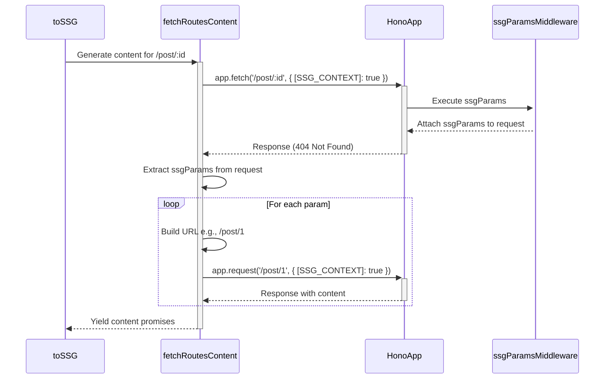
Sources: [src/helper/ssg/ssg.ts:225-301](https://github.com/honojs/hono/blob/HEAD/src/helper/ssg/ssg.ts#L225-L301), [src/helper/ssg/middleware.ts:43-49](https://github.com/honojs/hono/blob/HEAD/src/helper/ssg/middleware.ts#L43-L49)

## File System Abstraction and Operations

The SSG module does not directly depend on a specific runtime's file system API (e.g., Node.js `fs`). Instead, it requires a `FileSystemModule` to be passed to `toSSG`. This interface abstracts the necessary file operations.

```typescript
export interface FileSystemModule {
  writeFile(path: string, data: string | Uint8Array): Promise<void>
  mkdir(path: string, options: { recursive: boolean }): Promise<void | string>
}
```
Sources: [src/helper/ssg/ssg.ts:34-37](https://github.com/honojs/hono/blob/HEAD/src/helper/ssg/ssg.ts#L34-L37)

### File Path Generation

The `generateFilePath` function determines the final output path for a given route. It handles various cases:
- `/` becomes `index.html`.
- `/about/` becomes `about/index.html`.
- `/about` becomes `about.html`.
- `/style.css` remains `style.css`.

The file extension is determined by the `Content-Type` header of the response. A default map (`defaultExtensionMap`) handles common types like `text/html` -> `html`, and this can be extended via the `extensionMap` option in `toSSG`.

Sources: [src/helper/ssg/ssg.ts:50-72](https://github.com/honojs/hono/blob/HEAD/src/helper/ssg/ssg.ts#L50-L72), [src/helper/ssg/ssg.ts:90-97](https://github.com/honojs/hono/blob/HEAD/src/helper/ssg/ssg.ts#L90-L97)

### Security

To prevent path traversal attacks where a route like `/../etc/passwd` could cause files to be written outside the intended output directory, the `ensureWithinOutDir` function is used. It normalizes both the output directory and the generated file path and throws an error if the file path is not within the output directory.

Sources: [src/helper/ssg/utils.ts:77-87](https://github.com/honojs/hono/blob/HEAD/src/helper/ssg/utils.ts#L77-L87), [src/helper/ssg/ssg.test.tsx:583-598](https://github.com/honojs/hono/blob/HEAD/src/helper/ssg/ssg.test.tsx#L583-L598)

## Middleware and Generation Context

Several middleware functions are provided to control SSG behavior on a per-route basis. These rely on the "SSG context".

### SSG Context

During the generation process, `toSSG` makes requests to the Hono app with a special environment variable `[SSG_CONTEXT]: true`. The `isSSGContext` helper function can be used within handlers or middleware to detect if a request is part of an SSG build.

Sources: [src/helper/ssg/middleware.ts:5](https://github.com/honojs/hono/blob/HEAD/src/helper/ssg/middleware.ts#L5), [src/helper/ssg/middleware.ts:56-56](https://github.com/honojs/hono/blob/HEAD/src/helper/ssg/middleware.ts#L56-L56)

```typescript
// Example from ssg.test.tsx
app.get('/', (c) => c.html(<h1>{isSSGContext(c) ? 'SSG' : 'noSSG'}</h1>))
```
Sources: [src/helper/ssg/ssg.test.tsx:651-651](https://github.com/honojs/hono/blob/HEAD/src/helper/ssg/ssg.test.tsx#L651-L651)

### Control Middlewares

-   **`disableSSG()`**: This middleware prevents a route from being included in the SSG build. If `isSSGContext` is true, it returns a 404 response with a special header (`x-hono-disable-ssg`), signaling the generator to skip this route.
    Sources: [src/helper/ssg/middleware.ts:63-70](https://github.com/honojs/hono/blob/HEAD/src/helper/ssg/middleware.ts#L63-L70)
-   **`onlySSG()`**: This middleware makes a route *only* available during the SSG build. If the request is not from an SSG context, it returns a 404 response. This is useful for pages that should only exist as static files and not be served dynamically.
    Sources: [src/helper/ssg/middleware.ts:77-83](https://github.com/honojs/hono/blob/HEAD/src/helper/ssg/middleware.ts#L77-L83)

## Extensibility: Hooks and Plugins

The SSG process can be customized at various stages using hooks. These hooks can be provided directly as options to `toSSG` (deprecated) or, preferably, bundled within plugins.

Sources: [src/helper/ssg/ssg.ts:181-198](https://github.com/honojs/hono/blob/HEAD/src/helper/ssg/ssg.ts#L181-L198)

### Lifecycle Hooks

| Hook | Type | Description |
| :--- | :--- | :--- |
| `beforeRequestHook` | `(req) => Request \| false \| Promise<...>` | Runs before a request is sent to the Hono app. Can modify the request or return `false` to skip the route entirely. |
| `afterResponseHook` | `(res) => Response \| false \| Promise<...>` | Runs after a response is received from the app. Can modify the response or return `false` to skip generating a file for this response. |
| `afterGenerateHook` | `(result, fs, options) => void \| Promise<void>` | Runs after the entire generation process is complete. Can be used for post-processing, such as creating a sitemap or logging results. |
Sources: [src/helper/ssg/ssg.ts:110-116](https://github.com/honojs/hono/blob/HEAD/src/helper/ssg/ssg.ts#L110-L116)

### Plugin System

A plugin is an object that can contain any of the lifecycle hooks. Multiple plugins can be provided to `toSSG`. The hooks from all plugins are combined and executed in sequence.

```typescript
export interface SSGPlugin {
  beforeRequestHook?: BeforeRequestHook | BeforeRequestHook[]
  afterResponseHook?: AfterResponseHook | AfterResponseHook[]
  afterGenerateHook?: AfterGenerateHook | AfterGenerateHook[]
}
```
Sources: [src/helper/ssg/ssg.ts:175-179](https://github.com/honojs/hono/blob/HEAD/src/helper/ssg/ssg.ts#L175-L179)

The `combine...Hooks` functions are used internally to chain multiple hook implementations together, ensuring that hooks from options and all plugins are applied correctly.

Sources: [src/helper/ssg/ssg.ts:118-173](https://github.com/honojs/hono/blob/HEAD/src/helper/ssg/ssg.ts#L118-L173)

## Configuration

The `toSSG` function accepts an options object to configure its behavior.

| Option | Type | Default Value | Description |
| :--- | :--- | :--- | :--- |
| `dir` | `string` | `'./static'` | The output directory for the static files. |
| `concurrency` | `number` | `2` | Number of concurrent requests to process. |
| `extensionMap` | `Record<string, string>` | `defaultExtensionMap` | Maps MIME types to file extensions. |
| `plugins` | `SSGPlugin[]` | `[defaultPlugin()]` | An array of plugins to extend SSG functionality. |
| `beforeRequestHook` | `BeforeRequestHook \| ...[]` | `undefined` | **(Deprecated)** Hook to modify requests. Use plugins instead. |
| `afterResponseHook` | `AfterResponseHook \| ...[]` | `undefined` | **(Deprecated)** Hook to modify responses. Use plugins instead. |
| `afterGenerateHook` | `AfterGenerateHook \| ...[]` | `undefined` | **(Deprecated)** Hook executed after generation. Use plugins instead. |
Sources: [src/helper/ssg/ssg.ts:181-198](https://github.com/honojs/hono/blob/HEAD/src/helper/ssg/ssg.ts#L181-L198), [src/helper/ssg/ssg.ts:17](https://github.com/honojs/hono/blob/HEAD/src/helper/ssg/ssg.ts#L17), [src/helper/ssg/ssg.ts:27](https://github.com/honojs/hono/blob/HEAD/src/helper/ssg/ssg.ts#L27)

# Page: Type-Safe RPC with Hono Client

<details>
<summary>Relevant source files</summary>

The following files were used as context for generating this wiki page:

- [src/client/client.ts](https://github.com/honojs/hono/blob/HEAD/src/client/client.ts)
- [src/client/index.ts](https://github.com/honojs/hono/blob/HEAD/src/client/index.ts)
- [src/client/client.test.ts](https://github.com/honojs/hono/blob/HEAD/src/client/client.test.ts)
</details>

# Type-Safe RPC with Hono Client

The Hono Client (`hc`) is a lightweight, type-safe RPC client that enables seamless communication between a frontend application and a Hono backend. It leverages TypeScript's type inference to provide end-to-end type safety, ensuring that API calls from the client match the route definitions on the server. This eliminates a common class of bugs related to mismatched API contracts, such as incorrect parameter names, types, or response shapes.

The client is designed to be intuitive, using a proxy-based approach to mirror the server's routing structure. This allows developers to call backend endpoints as if they were local functions, with auto-completion and type-checking for request inputs (path parameters, query strings, JSON bodies, form data, headers, and cookies) and response outputs.

## Core Concepts

The Hono Client is built around a few key concepts that work together to provide its powerful type-safe RPC capabilities.

### The `hc` Function

The primary entry point for using the client is the `hc` function. It initializes a new client instance, binding it to a specific base URL of a Hono application.

```typescript
// src/client/client.ts:133-136
export const hc = <T extends Hono<any, any, any>, Prefix extends string = string>(
  baseUrl: Prefix,
  options?: ClientRequestOptions
) =>
```

-   **`baseUrl`**: The base URL of the Hono server API.
-   **`options`**: An optional configuration object (`ClientRequestOptions`) for customizing client behavior, such as setting default headers or providing a custom `fetch` implementation.
-   **Generic `T`**: This is the most critical part for type safety. You pass the type of your Hono application router (`typeof app`) to this generic, which allows the client to infer all route paths, request parameters, and response types.

*Sources: [src/client/client.ts:133-136](https://github.com/honojs/hono/blob/HEAD/src/client/client.ts#L133-L136), [src/client/client.test.ts:131](https://github.com/honojs/hono/blob/HEAD/src/client/client.test.ts#L131)*

### Proxy-Based API

The client uses a JavaScript `Proxy` to dynamically construct API paths and methods. This creates an intuitive, chainable syntax that mirrors the Hono router's definition.

For a route defined as `app.get('/api/posts/:id', ...)`, the client call would be `client.api.posts[':id'].$get(...)`.

The `createProxy` function recursively builds the path. When a terminal method like `$get` is called, a callback is executed to process the path and arguments, ultimately triggering a fetch request.

```typescript
// src/client/client.ts:15-22
const createProxy = (callback: Callback, path: string[]) => {
  const proxy: unknown = new Proxy(() => {}, {
    get(_obj, key) {
      if (typeof key !== 'string' || key === 'then') {
        return undefined
      }
      return createProxy(callback, [...path, key])
    },
//...
```

*Sources: [src/client/client.ts:15-31](https://github.com/honojs/hono/blob/HEAD/src/client/client.ts#L15-L31), [src/client/client.ts:137](https://github.com/honojs/hono/blob/HEAD/src/client/client.ts#L137)*

### End-to-End Type Inference

By providing the Hono application's type to `hc`, the client infers the complete API contract. This includes:
-   Valid route paths.
-   The shape and types of `query`, `json`, `form`, `param`, `header`, and `cookie` inputs.
-   The shape and type of the JSON response body for different status codes.

This is achieved using utility types like `InferResponseType` and `InferRequestType`, which are exported for consumer use.

*Sources: [src/client/index.ts:9-10](https://github.com/honojs/hono/blob/HEAD/src/client/index.ts#L9-L10), [src/client/client.test.ts:553-599](https://github.com/honojs/hono/blob/HEAD/src/client/client.test.ts#L553-L599)*

## Client Architecture

The client's internal architecture consists of three main components: the proxy creator, the request implementation, and the main `hc` function that ties them together.

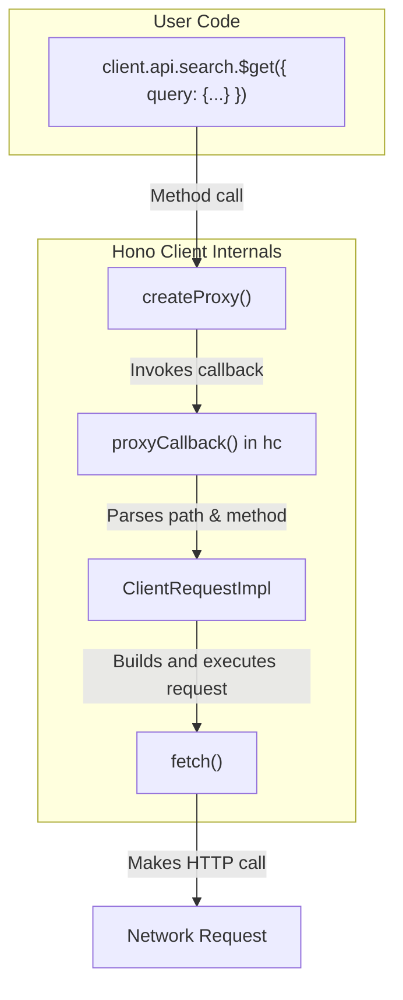
*Sources: [src/client/client.ts](https://github.com/honojs/hono/blob/HEAD/src/client/client.ts)*

### `createProxy`

This utility function is responsible for the dynamic, chainable API. It takes a callback and an initial path array. Each property access (e.g., `.api`, `.search`) creates a new proxy with an extended path. When a method is finally called (e.g., `.$get()`), the `apply` handler in the proxy is triggered, which executes the callback with the complete path and arguments.

*Sources: [src/client/client.ts:15-31](https://github.com/honojs/hono/blob/HEAD/src/client/client.ts#L15-L31)*

### `ClientRequestImpl`

This class handles the logic of building and sending an HTTP request. It receives the URL, method, and options, and its `fetch` method is responsible for:
-   Serializing `query`, `form`, and `json` data.
-   Replacing path parameters in the URL (e.g., `:id`).
-   Constructing `Headers`, including `Content-Type` and cookies.
-   Merging global and per-request headers.
-   Calling the underlying `fetch` function with the final `Request` object.

*Sources: [src/client/client.ts:33-130](https://github.com/honojs/hono/blob/HEAD/src/client/client.ts#L33-L130)*

### `hc`'s `proxyCallback`

This is the core logic that connects the proxy to the request builder. When a proxied method is called, this function:
1.  Parses the path segments to determine the API endpoint.
2.  Identifies the HTTP method from the final path segment (e.g., `$get` becomes `GET`).
3.  Handles special utility methods like `$url`, `$path`, and `$ws`.
4.  For standard HTTP methods, it instantiates `ClientRequestImpl`.
5.  It merges global options (from `hc`) with per-request options.
6.  It calls `req.fetch()` on the `ClientRequestImpl` instance, passing the user-provided arguments.

*Sources: [src/client/client.ts:137-232](https://github.com/honojs/hono/blob/HEAD/src/client/client.ts#L137-L232)*

## Making Requests

The client provides a structured way to pass different types of data with a request.

### HTTP Methods

HTTP methods are invoked by calling a function on the route chain with a `$` prefix.

| Method | Invocation |
| --- | --- |
| GET | `.$get()` |
| POST | `.$post()` |
| PUT | `.$put()` |
| DELETE | `.$delete()` |
| PATCH | `.$patch()` |
| OPTIONS | `.$options()` |
| HEAD | `.$head()` |

*Sources: [src/client/client.ts:162-166](https://github.com/honojs/hono/blob/HEAD/src/client/client.ts#L162-L166)*

### Request Parameters

All request inputs are passed as a single object to the method function. The types for these inputs are inferred from your Hono application's validators.

| Parameter | Description | Example |
| --- | --- | --- |
| `json` | The JSON request body. Automatically stringified and sets `Content-Type: application/json`. | `{ json: { title: 'Hello' } }` |
| `form` | Form data. Sent as `multipart/form-data`. Values can be strings or arrays of strings. | `{ form: { title: 'Hello', tags: ['a', 'b'] } }` |
| `query` | URL query parameters. Can be a single value or an array for multiple values. | `{ query: { q: 'hono', tags: ['js', 'ts'] } }` |
| `param` | Path parameters. Used to substitute dynamic segments in the URL. | `{ param: { id: '123' } }` |
| `header` | Custom request headers. | `{ header: { 'X-Request-Id': 'abc' } }` |
| `cookie` | Request cookies. | `{ cookie: { session: 'xyz' } }` |

*Sources: [src/client/client.test.ts:31-229](https://github.com/honojs/hono/blob/HEAD/src/client/client.test.ts#L31-L229), [src/client/client.test.ts:231-384](https://github.com/honojs/hono/blob/HEAD/src/client/client.test.ts#L231-L384)*

## Handling Responses

Client methods return a `Promise` that resolves to a standard `Response` object, but with a typed `.json()` method.

### Type-Safe `.json()`

The `res.json()` method is typed based on the return type of your Hono route handler. This allows you to access response data with full type safety and autocompletion.

```typescript
// Inferred type: { success: boolean; message: string; ... }
const data = await res.json()
console.log(data.success) // OK
// console.log(data.error) // TypeScript Error: Property 'error' does not exist
```

*Sources: [src/client/client.test.ts:148](https://github.com/honojs/hono/blob/HEAD/src/client/client.test.ts#L148), [src/client/client.test.ts:553-563](https://github.com/honojs/hono/blob/HEAD/src/client/client.test.ts#L553-L563)*

### Status Code Narrowing

The client's types are smart enough to understand routes that can return different responses based on the status code. By checking `res.status` or `res.ok`, you can narrow the type of the response body.

```mermaid
sequenceDiagram
    participant User as User Code
    participant Client as Hono Client
    participant Server as Hono Server

    User->>+Client: client.posts.$post({...})
    Client->>+Server: POST /posts
    alt 200 OK
        Server-->>-Client: Response (status: 200, body: { title: "..." })
    else 400 Bad Request
        Server-->>-Client: Response (status: 400, body: { error: "..." })
    else 401 Unauthorized
        Server-->>-Client: Response (status: 401, body: { error: "..." })
    end
    Client-->>-User: Promise<TypedResponse>

    User->>User: const res = await response
    alt if res.status === 200
        User->>User: const data = await res.json() // Type is { title: string }
    else if res.status === 400
        User->>User: const data = await res.json() // Type is { error: "Bad request" }
    end
```

This example shows how checking the status code allows TypeScript to correctly infer the shape of the JSON payload.

*Sources: [src/client/client.test.ts:923-975](https://github.com/honojs/hono/blob/HEAD/src/client/client.test.ts#L923-L975), [src/client/client.test.ts:1101-1121](https://github.com/honojs/hono/blob/HEAD/src/client/client.test.ts#L1101-L1121)*

## Utility Methods

Besides HTTP methods, the client proxy also provides special utility methods.

### `$url()` and `$path()`

These methods generate a `URL` object or a path string for a given endpoint and parameters, without actually making a network request. This is useful for creating links in a web application.

-   `$url()`: Returns a full `URL` object.
-   `$path()`: Returns a relative path string (e.g., `/api/posts/123?q=hono`).

```typescript
// Returns a URL object: http://localhost/api/posts/123
const url = client.api.posts[':id'].$url({ param: { id: '123' } });

// Returns a string: /api/posts/123
const path = client.api.posts[':id'].$path({ param: { id: '123' } });
```

*Sources: [src/client/client.ts:171-186](https://github.com/honojs/hono/blob/HEAD/src/client/client.ts#L171-L186), [src/client/client.test.ts:386-459](https://github.com/honojs/hono/blob/HEAD/src/client/client.test.ts#L386-L459)*

### `$ws()`

For WebSocket routes, the `$ws()` method constructs and returns a `WebSocket` instance. It automatically translates `http://` and `https://` base URLs to `ws://` and `wss://` respectively.

*Sources: [src/client/client.ts:187-212](https://github.com/honojs/hono/blob/HEAD/src/client/client.ts#L187-L212), [src/client/client.test.ts:1403-1531](https://github.com/honojs/hono/blob/HEAD/src/client/client.test.ts#L1403-L1531)*

## Configuration and Customization

The `hc` function accepts an `options` object to customize client behavior.

| Option | Type | Description |
| --- | --- | --- |
| `headers` | `Record<string, string> \| (() => Record<string, string> \| Promise<Record<string, string>>)` | Sets default headers for all requests. Can be an object or a function for dynamic headers. |
| `fetch` | `(request: Request) => Promise<Response>` | Provides a custom `fetch` implementation. Useful for testing or server-side rendering. |
| `init` | `RequestInit` | Provides default `RequestInit` options to be merged with every fetch call. |
| `buildSearchParams` | `(query: Record<string, unknown>) => URLSearchParams` | A custom function to serialize query parameters. |
| `webSocket` | `(url: string, options?: WebSocketOptions) => WebSocket` | A custom WebSocket constructor. |

*Sources: [src/client/client.ts:135](https://github.com/honojs/hono/blob/HEAD/src/client/client.ts#L135), [src/client/client.test.ts:853-888](https://github.com/honojs/hono/blob/HEAD/src/client/client.test.ts#L853-L888), [src/client/client.test.ts:1198-1308](https://github.com/honojs/hono/blob/HEAD/src/client/client.test.ts#L1198-L1308), [src/client/client.test.ts:1704-1782](https://github.com/honojs/hono/blob/HEAD/src/client/client.test.ts#L1704-L1782)*

## Advanced Type Helpers

The Hono client package exports several advanced type helpers for more complex scenarios.

### `ApplyGlobalResponse`

This helper allows you to add a global response type to every endpoint in your application type. This is particularly useful for handling global error middleware, where any endpoint could potentially return a standardized error response.

```typescript
// Define a global error shape
type GlobalError = {
  401: { json: { error: string; message: string } };
  500: { json: { error: string; message: string } };
};

// Apply it to the app type
type AppWithGlobalErrors = ApplyGlobalResponse<typeof app, GlobalError>;

// Now, the client will know about these possible error responses on every route
const client = hc<AppWithGlobalErrors>('http://localhost');
```

*Sources: [src/client/client.test.ts:1784-1906](https://github.com/honojs/hono/blob/HEAD/src/client/client.test.ts#L1784-L1906), [src/client/types.ts](https://github.com/honojs/hono/blob/HEAD/src/client/types.ts)*

### `PickResponseByStatusCode`

This helper filters the possible responses for all routes in an application type, keeping only those that match the provided status code(s). This can be useful if you want to create a client that only deals with success responses and treats all other statuses as exceptions.

```typescript
// Create a new app type that only includes 2xx responses
type AppSuccessOnly = PickResponseByStatusCode<typeof app, 200 | 201>;

const client = hc<AppSuccessOnly>('http://localhost');
const res = await client.api.users.$get();

// res.ok is now typed as `true`
// res.status is now typed as `200 | 201`
```

*Sources: [src/client/client.test.ts:1908-2004](https://github.com/honojs/hono/blob/HEAD/src/client/client.test.ts#L1908-L2004), [src/client/types.ts](https://github.com/honojs/hono/blob/HEAD/src/client/types.ts)*

# Page: Testing Hono Applications

<details>
<summary>Relevant source files</summary>

The following files were used as context for generating this wiki page:

- [src/helper/testing/index.ts](https://github.com/honojs/hono/blob/HEAD/src/helper/testing/index.ts)
- [runtime-tests/bun/index.test.tsx](https://github.com/honojs/hono/blob/HEAD/runtime-tests/bun/index.test.tsx)
- [runtime-tests/deno/middleware.test.tsx](https://github.com/honojs/hono/blob/HEAD/runtime-tests/deno/middleware.test.tsx)
</details>

# Testing Hono Applications

Hono applications are designed to be highly testable without needing a running server. The testing strategy primarily revolves around two approaches: direct invocation of the `app.request()` method for integration-style tests, and using the `testClient` helper for a fully-typed, RPC-like testing experience.

The repository includes comprehensive test suites that run against different JavaScript runtimes, such as Bun and Deno, ensuring consistent behavior and compatibility across environments. These tests cover core routing, various middleware implementations, and runtime-specific features like WebSockets and streaming.

## Core Testing Approaches

Hono offers two primary methods for testing application logic.

### Direct `app.request()` Method

The most direct way to test a Hono application is by using the `app.request()` method. This method takes a standard `Request` object (or a URL string) and dispatches it through the application's routing and middleware stack, returning a `Promise<Response>`. This approach is ideal for integration tests that verify the behavior of routes and middleware chains.

A typical test involves creating a `Request` object, passing it to `app.request()`, and then asserting the properties of the resulting `Response` object, such as status code, headers, and body content.

```typescript
// Example of a basic test using app.request()
import { Hono } from '../../src/index'
import { expect, it } from 'vitest'

const app = new Hono()
app.get('/a/:foo', (c) => {
  c.header('x-param', c.req.param('foo'))
  c.header('x-query', c.req.query('q'))
  return c.text('Hello Bun!')
})

it('Should return 200 Response', async () => {
  const req = new Request('http://localhost/a/foo?q=bar')
  const res = await app.request(req)
  expect(res.status).toBe(200)
  expect(await res.text()).toBe('Hello Bun!')
  expect(res.headers.get('x-param')).toBe('foo')
  expect(res.headers.get('x-query')).toBe('bar')
})
```
*Sources: [runtime-tests/bun/index.test.tsx:28-42](https://github.com/honojs/hono/blob/HEAD/runtime-tests/bun/index.test.tsx#L28-L42)*

### `testClient` Helper

For a more streamlined and type-safe testing experience, Hono provides a `testClient` helper. This function wraps a Hono app instance and returns a typed client, similar to the one generated by `hono/client`. It allows you to make requests to your application as if you were calling functions, with full type-safety for request parameters, bodies, and response payloads.

Internally, `testClient` uses `hono/client` but overrides the default `fetch` implementation with a custom function that directly calls `app.request`. This bypasses the network stack entirely, making tests fast and reliable.

*Sources: [src/helper/testing/index.ts:16-27](https://github.com/honojs/hono/blob/HEAD/src/helper/testing/index.ts#L16-L27)*

The function signature is as follows:

```typescript
export const testClient = <T extends Hono<any, Schema, string>>(
  app: T,
  Env?: ExtractEnv<T>['Bindings'] | {},
  executionCtx?: ExecutionContext,
  options?: Omit<ClientRequestOptions, 'fetch'>
): UnionToIntersection<Client<T, 'http://localhost'>>
```
*Sources: [src/helper/testing/index.ts:16-21](https://github.com/honojs/hono/blob/HEAD/src/helper/testing/index.ts#L16-L21)*

The following diagram illustrates the data flow when using `testClient`:

```mermaid
sequenceDiagram
    participant Test as Test Code
    participant Client as Typed Test Client
    participant CustomFetch as customFetch
    participant App as Hono App Instance

    Test->>+Client: client.route.$get({ param: '...', query: '...' })
    Client->>+CustomFetch: fetch(request)
    CustomFetch->>+App: app.request(input, init, Env, executionCtx)
    App-->>-CustomFetch: Response
    CustomFetch-->>-Client: Response
    Client-->>-Test: Typed Response
```
*Sources: [src/helper/testing/index.ts:22-26](https://github.com/honojs/hono/blob/HEAD/src/helper/testing/index.ts#L22-L26)*

## Testing Middleware

Middleware is a fundamental part of Hono, and the test suites provide clear patterns for verifying its behavior. Tests for middleware typically involve setting up a Hono app, applying the middleware to specific routes, and then sending requests that trigger both success and failure cases.

### Authentication Middleware

Authentication middleware like `basicAuth` and `jwt` are tested by sending requests with and without valid credentials.

*   **Unauthorized Request**: A request is sent without an `Authorization` header or with an invalid one. The test asserts that the response is a `401 Unauthorized`.
*   **Authorized Request**: A request is sent with a correctly formatted and valid `Authorization` header. The test asserts that the response is `200 OK` and that the request was passed to the next handler in the chain.

```typescript
// Example: Testing Basic Auth Middleware
const app = new Hono()
const username = 'hono-user-a'
const password = 'hono-password-a'
app.use('/auth/*', basicAuth({ username, password }))
app.get('/auth/*', () => new Response('auth'))

// Test for 401 Unauthorized
it('Should not authorize, return 401 Response', async () => {
  const req = new Request('http://localhost/auth/a')
  const res = await app.request(req)
  expect(res.status).toBe(401)
})

// Test for 200 OK
it('Should authorize, return 200 Response', async () => {
  const credential = 'aG9uby11c2VyLWE6aG9uby1wYXNzd29yZC1h' // base64('hono-user-a:hono-password-a')
  const req = new Request('http://localhost/auth/a')
  req.headers.set('Authorization', `Basic ${credential}`)
  const res = await app.request(req)
  expect(res.status).toBe(200)
})
```
*Sources: [runtime-tests/bun/index.test.tsx:58-86](https://github.com/honojs/hono/blob/HEAD/runtime-tests/bun/index.test.tsx#L58-L86), [runtime-tests/deno/middleware.test.tsx:12-47](https://github.com/honojs/hono/blob/HEAD/runtime-tests/deno/middleware.test.tsx#L12-L47)*

The interaction flow for a request handled by an authentication middleware can be visualized as follows:

```mermaid
sequenceDiagram
    participant Client
    participant HonoApp as "Hono App"
    participant AuthMiddleware as "e.g., basicAuth()"
    participant RouteHandler as "Route Handler"

    Client->>+HonoApp: GET /auth/a
    HonoApp->>+AuthMiddleware: Process request
    alt Credentials Invalid/Missing
        AuthMiddleware-->>-HonoApp: 401 Unauthorized Response
        HonoApp-->>-Client: 401 Unauthorized
    else Credentials Valid
        AuthMiddleware->>+RouteHandler: next()
        RouteHandler-->>-AuthMiddleware: 200 OK Response
        AuthMiddleware-->>-HonoApp: 200 OK Response
        HonoApp-->>-Client: 200 OK
    end
```
*Sources: [runtime-tests/bun/index.test.tsx:72-86](https://github.com/honojs/hono/blob/HEAD/runtime-tests/bun/index.test.tsx#L72-L86), [runtime-tests/deno/middleware.test.tsx:28-38](https://github.com/honojs/hono/blob/HEAD/runtime-tests/deno/middleware.test.tsx#L28-L38)*

### `serveStatic` Middleware

The `serveStatic` middleware is extensively tested to handle various scenarios, including finding files, handling missing files, and rewriting paths.

| Feature | Description | Source Files |
| :--- | :--- | :--- |
| **Root Directory** | Serves static files from a specified `root` directory. | `runtime-tests/bun/index.test.tsx:103` |
| **Specific Path** | Serves a single file from a specific `path`. | `runtime-tests/bun/index.test.tsx:92` |
| **`onNotFound` Callback** | Executes a callback function when a requested file is not found. | `runtime-tests/bun/index.test.tsx:95` |
| **`rewriteRequestPath`** | A function to modify the request path before looking up the file. | `runtime-tests/bun/index.test.tsx:112` |

The logic for serving a static file is illustrated below:

```mermaid
graph TD
    A[Request received by serveStatic] --> B{Path rewrite configured?};
    B -- Yes --> C[Rewrite path];
    B -- No --> D[Use original path];
    C --> D;
    D --> E{File exists at path?};
    E -- Yes --> F[Serve file with correct Content-Type];
    E -- No --> G{onNotFound callback provided?};
    G -- Yes --> H[Execute onNotFound callback];
    G -- No --> I[Continue to next middleware or 404];
    H --> I;
```
*Sources: [runtime-tests/bun/index.test.tsx:89-116](https://github.com/honojs/hono/blob/HEAD/runtime-tests/bun/index.test.tsx#L89-L116), [runtime-tests/deno/middleware.test.tsx:70-99](https://github.com/honojs/hono/blob/HEAD/runtime-tests/deno/middleware.test.tsx#L70-L99)*

## Runtime-Specific Testing

Hono is tested across multiple JavaScript runtimes to ensure broad compatibility. The test suites in `runtime-tests/` contain tests tailored to the features and APIs available in each environment.

| Feature | Bun | Deno |
| :--- | :---: | :---: |
| Basic Routing | ✓ | ✓ |
| Basic Auth Middleware | ✓ | ✓ |
| JWT Middleware | ✓ | ✓ |
| JSX Middleware | ✓ | ✓ |
| `serveStatic` Middleware | ✓ | ✓ |
| Streaming (`stream`, `streamSSE`) | ✓ | |
| WebSockets | ✓ | |
| Static Site Generation (`toSSG`) | ✓ | |
| Buffer Response Body | ✓ | |

*Sources: [runtime-tests/bun/index.test.tsx](https://github.com/honojs/hono/blob/HEAD/runtime-tests/bun/index.test.tsx), [runtime-tests/deno/middleware.test.tsx](https://github.com/honojs/hono/blob/HEAD/runtime-tests/deno/middleware.test.tsx)*

### Bun

The Bun test suite (`runtime-tests/bun/index.test.tsx`) covers Bun-specific features and optimizations.
- **Streaming**: Tests for `stream` and `streamSSE` helpers, including the `onAbort` functionality to handle client disconnections.
- **WebSockets**: Verifies the `createBunWebSocket` helper for managing WebSocket connections.
- **`toSSG`**: Includes tests for the Static Site Generation utility that prerenders an application's routes to static files.
- **JSX**: Confirms that JSX components are correctly rendered to HTML strings.

*Sources: [runtime-tests/bun/index.test.tsx:206-251, 253-292, 294-329, 348-447]()*

### Deno

The Deno test suite (`runtime-tests/deno/middleware.test.tsx`) validates Hono's functionality in the Deno runtime. It leverages Deno's standard library for assertions (`@std/assert`) and mocking (`@std/testing/mock`). The tests focus on ensuring that core features and middleware, such as `basicAuth`, `jwt`, `serveStatic`, and JSX rendering, work as expected within the Deno environment.

*Sources: [runtime-tests/deno/middleware.test.tsx:1-8](https://github.com/honojs/hono/blob/HEAD/runtime-tests/deno/middleware.test.tsx#L1-L8)*
