# Page: Getting Started with Ky

<details>
<summary>Relevant source files</summary>

The following files were used as context for generating this wiki page:

- [readme.md](https://github.com/sindresorhus/ky/blob/HEAD/readme.md)
- [source/index.ts](https://github.com/sindresorhus/ky/blob/HEAD/source/index.ts)
- [package.json](https://github.com/sindresorhus/ky/blob/HEAD/package.json)
</details>

# Getting Started with Ky

Ky is a lightweight and elegant HTTP client built upon the native Fetch API. It is designed for modern environments, including browsers, Node.js, Bun, and Deno, and is distributed as an ESM module with no dependencies. Ky simplifies the `fetch` API by providing a more convenient and powerful interface.

Key benefits over the standard Fetch API include a simpler API with method shortcuts, automatic handling of non-2xx status codes as errors, request retries, built-in timeout support, and advanced features like hooks for modifying the request lifecycle. It also offers enhanced TypeScript support, such as generic type parameters for JSON parsing and schema-based validation.

Sources: [readme.md:34-57](https://github.com/sindresorhus/ky/blob/HEAD/readme.md#L34-L57), [package.json:2-4,13]()

## Installation and Basic Usage

Ky can be installed via npm and imported directly into modern JavaScript projects.

**Installation**
```sh
npm install ky
```
Sources: [readme.md:60-62](https://github.com/sindresorhus/ky/blob/HEAD/readme.md#L60-L62)

**Basic Usage**

A simple POST request to send JSON data and parse the JSON response demonstrates Ky's concise API.

```javascript
import ky from 'ky';

const json = await ky.post('https://example.com', {json: {foo: true}}).json();

console.log(json);
//=> {data: '🦄'}
```
This is significantly simpler than the equivalent code using the standard `fetch` API, which requires manual serialization, header configuration, and status code checking.

Sources: [readme.md:75-82](https://github.com/sindresorhus/ky/blob/HEAD/readme.md#L75-L82), [readme.md:86-105](https://github.com/sindresorhus/ky/blob/HEAD/readme.md#L86-L105)

## Core Concepts: The Ky Instance

The primary export of the `ky` package is a pre-configured instance of the Ky client. This instance is a function that can be called directly to make a request, and it also has properties for HTTP method shortcuts.

Sources: [source/index.ts:34-36](https://github.com/sindresorhus/ky/blob/HEAD/source/index.ts#L34-L36)

### The `ky` function and Method Shortcuts

The main `ky` function accepts the same `input` and `options` arguments as the standard `fetch` function, along with additional options provided by Ky. It returns a `ResponsePromise`, which is a `Promise` that resolves to a `Response` object but also has convenience methods for parsing the body, such as `.json()`, `.text()`, and `.blob()`.

HTTP method shortcuts are also available for common verbs:
*   `ky.get(input, options?)`
*   `ky.post(input, options?)`
*   `ky.put(input, options?)`
*   `ky.patch(input, options?)`
*   `ky.head(input, options?)`
*   `ky.delete(input, options?)`

These shortcuts automatically set the `method` option for the request.

Sources: [readme.md:115-122](https://github.com/sindresorhus/ky/blob/HEAD/readme.md#L115-L122), [readme.md:170-177](https://github.com/sindresorhus/ky/blob/HEAD/readme.md#L170-L177), [source/index.ts:12-17](https://github.com/sindresorhus/ky/blob/HEAD/source/index.ts#L12-L17)

### Creating and Extending Instances

Ky allows for the creation of new instances with custom default options, which is useful for creating specialized API clients.

*   **`ky.create(defaultOptions)`**: Creates a completely new Ky instance with its own set of default options, inheriting nothing from the parent.
*   **`ky.extend(defaultOptions)`**: Creates a new Ky instance that inherits and deep-merges the defaults from its parent instance. This is the primary way to create specialized clients that build upon a base configuration.

The logic for creating instances is handled by the internal `createInstance` function, which sets up the main request function and all the method shortcuts.

```mermaid
graph TD
    A[createInstance(defaults)] --> B{"Set up ky(input, options)"};
    B --> C{"Loop through requestMethods"};
    C --> D["ky[method] = (input, options) => ..."];
    D --> C;
    C --> E{"Setup ky.create()"};
    E --> F{"Setup ky.extend()"};
    F --> G[Return ky instance];
```
*Instance creation flow*

Sources: [readme.md:940-945](https://github.com/sindresorhus/ky/blob/HEAD/readme.md#L940-L945), [readme.md:1026-1029](https://github.com/sindresorhus/ky/blob/HEAD/readme.md#L1026-L1029), [source/index.ts:10-32](https://github.com/sindresorhus/ky/blob/HEAD/source/index.ts#L10-L32)

You can also replace a deep-merged option entirely by wrapping it with `replaceOption`. This is useful for options like `hooks` or `headers` where you want to overwrite the parent configuration instead of appending to it.

Sources: [readme.md:1006-1024](https://github.com/sindresorhus/ky/blob/HEAD/readme.md#L1006-L1024), [source/index.ts:84](https://github.com/sindresorhus/ky/blob/HEAD/source/index.ts#L84)

## The Request Lifecycle & Hooks

Ky provides a powerful hook system that allows for observation and modification of requests and responses at various stages of their lifecycle. Hooks are arrays of functions that run serially and can be asynchronous.

The main stages of the lifecycle where hooks can intervene are:
1.  **Initialization**: Before the request is constructed.
2.  **Before Request**: Just before the request is sent over the network.
3.  **Before Retry**: Before a failed request is attempted again.
4.  **After Response**: After a response is received but before it is returned to the caller.
5.  **Before Error**: Just before an error is thrown.

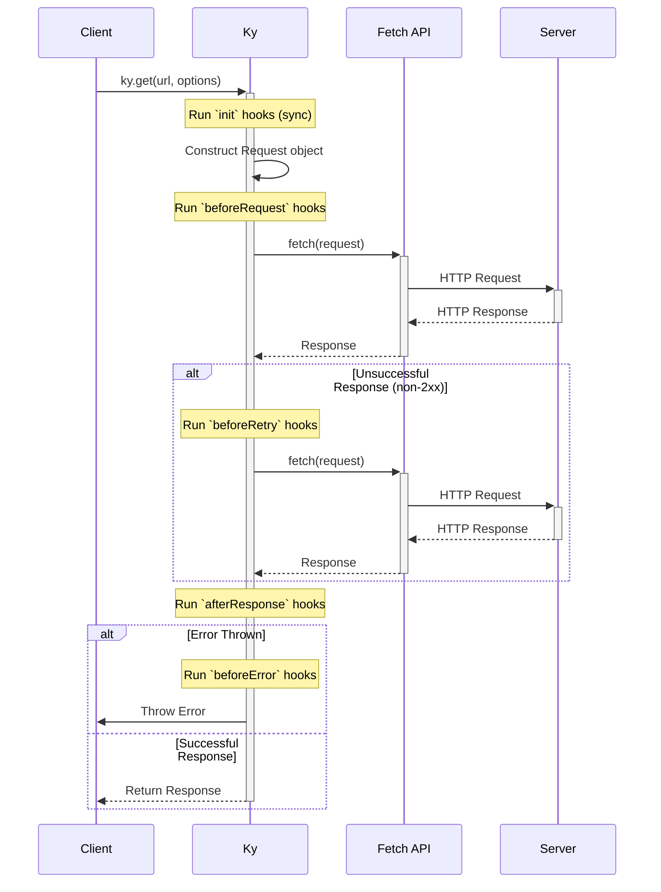
*Simplified Ky request lifecycle with hooks*

Sources: [readme.md:442-448](https://github.com/sindresorhus/ky/blob/HEAD/readme.md#L442-L448)

### Hook Details

| Hook              | Trigger                                                | Receives                                      | Can Return                                    |
| ----------------- | ------------------------------------------------------ | --------------------------------------------- | --------------------------------------------- |
| `init`            | Before request construction.                           | `options`                                     | `void` (modifies options in-place)            |
| `beforeRequest`   | After request construction, before sending.            | `request`, `options`, `retryCount`            | `Request` (to replace), `Response` (to mock)  |
| `beforeRetry`     | Before a retry attempt.                                | `request`, `options`, `error`, `retryCount`   | `Request`, `Response`, `ky.stop` (to cancel)  |
| `afterResponse`   | After a successful response is received.               | `request`, `options`, `response`, `retryCount`| `Response` (to replace), `ky.retry` (to force) |
| `beforeError`     | Before any error (`HTTPError`, `TimeoutError`) is thrown. | `request`, `options`, `error`, `retryCount`   | `Error` (to replace)                          |

Sources: [readme.com:449-718](https://github.com/sindresorhus/ky/blob/HEAD/readme.com#L449-L718), [source/index.ts:51-61](https://github.com/sindresorhus/ky/blob/HEAD/source/index.ts#L51-L61)

## Key Features & Options

Ky extends the standard `fetch` options with several powerful features.

### Retry Mechanism

By default, Ky automatically retries failed requests. This behavior is highly configurable via the `retry` option.

| `retry` Property     | Description                                                                                             | Default                                                                 |
| -------------------- | ------------------------------------------------------------------------------------------------------- | ----------------------------------------------------------------------- |
| `limit`              | Maximum number of retries.                                                                              | `2`                                                                     |
| `methods`            | HTTP methods to retry on.                                                                               | `['get', 'put', 'head', 'delete', 'options', 'trace']`                  |
| `statusCodes`        | HTTP status codes that trigger a retry.                                                                 | `[408, 413, 429, 500, 502, 503, 504]`                                   |
| `delay`              | A function to calculate the delay between retries.                                                      | Exponential backoff                                                     |
| `jitter`             | Adds randomness to retry delays to prevent thundering herd issues.                                      | `undefined`                                                             |
| `retryOnTimeout`     | Whether to retry if a request times out.                                                                | `false`                                                                 |
| `shouldRetry`        | A function for custom retry logic that overrides default checks.                                        | `undefined`                                                             |

You can also force a retry from an `afterResponse` hook using `ky.retry(options)`, which is useful for retrying based on response body content. To stop retries from a `beforeRetry` hook, you can return `ky.stop`.

Sources: [readme.md:275-402](https://github.com/sindresorhus/ky/blob/HEAD/readme.md#L275-L402), [readme.md:1048-1077](https://github.com/sindresorhus/ky/blob/HEAD/readme.md#L1048-L1077), [readme.md:1079-1108](https://github.com/sindresorhus/ky/blob/HEAD/readme.md#L1079-L1108)

### Error Handling

Ky improves upon `fetch` by rejecting promises for HTTP error responses (status codes 4xx and 5xx). This behavior can be disabled by setting `throwHttpErrors: false`. Ky provides a set of custom error classes for more granular error handling.

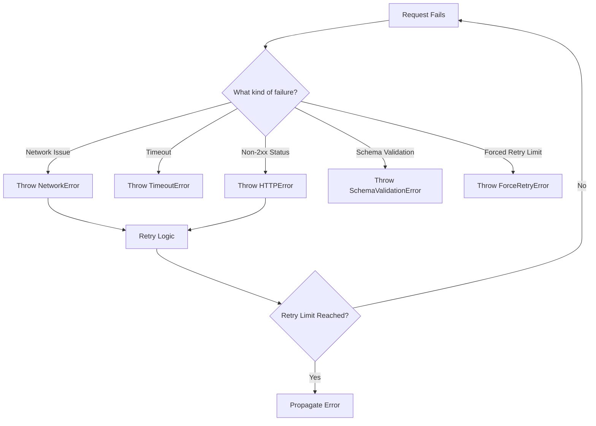
*Ky error and retry flow*

The primary error types are:

| Error Class             | Description                                                                                             |
| ----------------------- | ------------------------------------------------------------------------------------------------------- |
| `KyError`               | The base class for all Ky-specific errors.                                                              |
| `HTTPError`             | Thrown for non-2xx responses. Contains `request`, `response`, `options`, and parsed `data` properties.  |
| `NetworkError`          | Thrown for network-level failures (e.g., DNS, connection refused).                                      |
| `TimeoutError`          | Thrown when a request exceeds the configured `timeout` or `totalTimeout`.                               |
| `SchemaValidationError` | Thrown when response body validation fails against a provided schema.                                   |
| `ForceRetryError`       | The internal error used when `ky.retry()` is called, observable in `beforeRetry` hooks.                 |

These errors and their corresponding type guards (`isHTTPError`, etc.) are exported from the main package.

Sources: [readme.md:47](https://github.com/sindresorhus/ky/blob/HEAD/readme.md#L47), [readme.md:721-723](https://github.com/sindresorhus/ky/blob/HEAD/readme.md#L721-L723), [readme.md:1218-1342](https://github.com/sindresorhus/ky/blob/HEAD/readme.md#L1218-L1342), [source/index.ts:71-83](https://github.com/sindresorhus/ky/blob/HEAD/source/index.ts#L71-L83)

### TypeScript Integration

Ky is written in TypeScript and provides excellent type safety.

**Generics for JSON Parsing**
You can provide a type argument to `.json()` to get a typed response body, which defaults to `unknown` for safety.

```typescript
import ky from 'ky';

interface User {
  name: string;
  email: string;
}

// user is of type User
const user = await ky('/api/user').json<User>();
```
Sources: [readme.md:131-143](https://github.com/sindresorhus/ky/blob/HEAD/readme.md#L131-L143)

**Schema Validation**
Ky supports validation using any [Standard Schema](https://standardschema.dev) compatible library (like Zod). Pass a schema to `.json()` to validate the response body. If validation fails, a `SchemaValidationError` is thrown.

```typescript
import ky, {SchemaValidationError} from 'ky';
import {z} from 'zod';

const userSchema = z.object({name: z.string()});

try {
	const user = await ky('/api/user').json(userSchema);
	console.log(user.name);
} catch (error) {
	if (error instanceof SchemaValidationError) {
		console.error(error.issues);
	}
}
```
Sources: [readme.md:146-162](https://github.com/sindresorhus/ky/blob/HEAD/readme.md#L146-L162), [readme.md:1284-1304](https://github.com/sindresorhus/ky/blob/HEAD/readme.md#L1284-L1304), [source/index.ts:65-68](https://github.com/sindresorhus/ky/blob/HEAD/source/index.ts#L65-L68), [source/index.ts:73](https://github.com/sindresorhus/ky/blob/HEAD/source/index.ts#L73)

## Summary

Ky provides a modern, robust, and developer-friendly wrapper around the Fetch API. Its key strengths lie in its simplified API, sensible defaults like automatic error throwing and retries, and powerful customization through a comprehensive hook system and configurable options. These features make it an excellent choice for handling HTTP requests in any modern JavaScript environment.

# Page: Architecture Overview

<details>
<summary>Relevant source files</summary>

The following files were used as context for generating this wiki page:

- [source/core/Ky.ts](https://github.com/sindresorhus/ky/blob/HEAD/source/core/Ky.ts)
- [readme.md](https://github.com/sindresorhus/ky/blob/HEAD/readme.md)
</details>

# Architecture Overview

Ky is an elegant and powerful HTTP client built on top of the native Fetch API. Its architecture is centered around the `Ky` class, which encapsulates the entire request lifecycle, from options normalization to response parsing. The core design enhances `fetch` by adding features like automated retries, request/response hooks, timeout handling, and a more ergonomic API, all while maintaining a small footprint. The system is highly extensible, allowing developers to intercept and modify requests and responses at various stages.

The request lifecycle is a sophisticated pipeline involving a series of hooks, a robust retry mechanism, and comprehensive error handling. This architecture ensures that requests are resilient to transient network failures and that developers have fine-grained control over the entire HTTP communication process.

## Core Component: The `Ky` Class

The `Ky` class is the central component of the library, managing the state and execution of a single HTTP request. It is instantiated for each request initiated via the static `Ky.create` method.

Sources: [source/core/Ky.ts:142-1042](https://github.com/sindresorhus/ky/blob/HEAD/source/core/Ky.ts#L142-L1042)

### Constructor

The `Ky` constructor is responsible for initializing the request configuration. It performs several key tasks:

*   **Options Merging and Normalization**: It merges user-provided options with default values. This includes normalizing the HTTP method, setting default headers, and processing retry options.
*   **URL Resolution**: It handles URL construction by combining the `input` URL with the `prefix` and `baseUrl` options.
*   **Abort Signal Management**: It sets up an `AbortController` to manage timeouts and user-initiated cancellations, combining any user-provided `AbortSignal` with its internal signal.
*   **Request Object Creation**: It creates the initial `Request` object, which will be used and potentially cloned throughout the lifecycle. It also processes `searchParams` and applies them to the request URL.

Sources: [source/core/Ky.ts:364-485](https://github.com/sindresorhus/ky/blob/HEAD/source/core/Ky.ts#L364-L485)

### Static `create` Method

The `Ky.create` method serves as the public entry point for making a request. It orchestrates the entire lifecycle:

1.  **`init` Hooks**: It first runs synchronous `init` hooks, which can modify the request options before the `Ky` instance is created.
2.  **Instantiation**: It creates a new `Ky` instance with the finalized options.
3.  **Lifecycle Execution**: It defines and executes an async function that manages the core request pipeline, including `beforeRequest` hooks, the retry loop, `afterResponse` hooks, and final error handling via `beforeError` hooks.
4.  **Response Decoration**: It returns a `ResponsePromise`, which is a `Promise<Response>` augmented with convenient body-parsing methods like `.json()`, `.text()`, etc.

Sources: [source/core/Ky.ts:143-337](https://github.com/sindresorhus/ky/blob/HEAD/source/core/Ky.ts#L143-L337)

### Class Diagram

The following diagram illustrates the structure of the `Ky` class and its relationship with key error types.

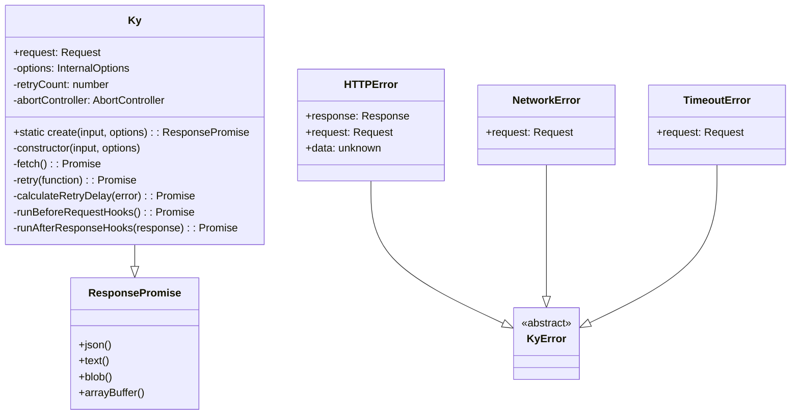
Sources: [source/core/Ky.ts](https://github.com/sindresorhus/ky/blob/HEAD/source/core/Ky.ts), [source/errors/HTTPError.ts](https://github.com/sindresorhus/ky/blob/HEAD/source/errors/HTTPError.ts)

## Request Lifecycle

The request lifecycle in Ky is a well-defined pipeline that provides multiple points for extension and control through hooks.

### High-Level Flow

This diagram shows the major stages of a Ky request, from initiation to completion.

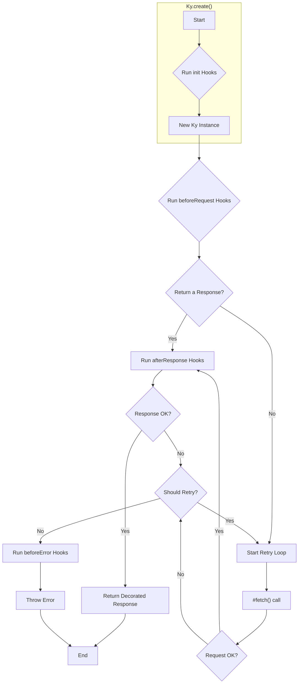
Sources: [source/core/Ky.ts:153-298](https://github.com/sindresorhus/ky/blob/HEAD/source/core/Ky.ts#L153-L298)

### Lifecycle Sequence Diagram

This diagram provides a more detailed view of the interactions between the user, Ky's internal methods, and the various hooks.

```mermaid
sequenceDiagram
    participant User
    participant Ky.create as "Ky.create()"
    participant KyInstance as "Ky Instance"
    participant Hooks
    participant FetchAPI as "fetch()"

    User->>+Ky.create: Call ky(url, options)
    Ky.create->>Hooks: Run init hooks (sync)
    Ky.create->>KyInstance: new Ky(input, options)
    Ky.create->>+KyInstance: Start async lifecycle
    KyInstance->>Hooks: Run beforeRequest hooks
    alt Hook returns a Response
        Hooks-->>-KyInstance: Mocked Response
    else
        loop Retry Loop
            KyInstance->>+FetchAPI: #fetch()
            FetchAPI-->>-KyInstance: Response
            KyInstance->>+Hooks: Run afterResponse hooks
            alt Hook returns ky.retry()
                Hooks-->>-KyInstance: ForceRetryError
                break
            end
            Hooks-->>-KyInstance: Final Response
        end
    end
    alt Successful Response
        KyInstance-->>-User: Decorated Response
    else Error
        KyInstance->>Hooks: Run beforeError hooks
        Hooks-->>KyInstance: Modified Error
        KyInstance-->>xUser: Throw Error
    end
```
Sources: [source/core/Ky.ts:143-337](https://github.com/sindresorhus/ky/blob/HEAD/source/core/Ky.ts#L143-L337)

## Error Handling and Retry Mechanism

Ky provides a sophisticated error handling and retry system that automatically manages transient failures.

### Error Types

Ky defines several custom error classes to provide detailed context about failures.

| Error Class             | Description                                                                                                                              | Key Properties                               |
| ----------------------- | ---------------------------------------------------------------------------------------------------------------------------------------- | -------------------------------------------- |
| `HTTPError`             | Thrown for non-2xx status codes.                                                                                                         | `response`, `request`, `options`, `data`     |
| `NetworkError`          | Thrown for network-level failures (e.g., DNS, connection refused).                                                                       | `request`, `cause`                           |
| `TimeoutError`          | Thrown when a request exceeds the configured `timeout` or `totalTimeout`.                                                                | `request`                                    |
| `SchemaValidationError` | Thrown when response body validation fails against a provided schema.                                                                    | `issues`                                     |
| `ForceRetryError`       | An internal error used to trigger a retry from an `afterResponse` hook. It is passed to `beforeRetry` hooks.                              | `customRequest`, `customDelay`               |

Sources: [source/core/Ky.ts:1-6](https://github.com/sindresorhus/ky/blob/HEAD/source/core/Ky.ts#L1-L6), [readme.md:1218-1343](https://github.com/sindresorhus/ky/blob/HEAD/readme.md#L1218-L1343)

### Retry Logic

The retry mechanism is governed by the `#calculateRetryDelay` method. A retry is attempted if all of the following conditions are met:
1.  The retry limit (`retry.limit`) has not been reached.
2.  The HTTP method is one of the configured `retry.methods`.
3.  The failure condition is retriable. This is determined by:
    *   The `shouldRetry` user-defined function, if provided.
    *   A `TimeoutError` if `retry.retryOnTimeout` is `true`.
    *   An `HTTPError` with a status code in `retry.statusCodes`.
    *   A `NetworkError`.
    *   A `ForceRetryError` from an `afterResponse` hook.

The delay between retries is calculated using an exponential backoff strategy, which can be customized with the `delay` option and randomized with the `jitter` option.

Sources: [source/core/Ky.ts:504-590](https://github.com/sindresorhus/ky/blob/HEAD/source/core/Ky.ts#L504-L590), [readme.md:275-402](https://github.com/sindresorhus/ky/blob/HEAD/readme.md#L275-L402)

## Key Architectural Concepts

### Immutability and State Management

To ensure that requests do not interfere with each other, Ky practices defensive state management.

*   **Options Cloning**: Before `init` hooks are run, the `options` object is shallow-cloned using `cloneInitHookOptions`. This prevents mutations within a hook from affecting subsequent requests that might share the same initial options object.
*   **Request Cloning for Retries**: When retries are enabled, the `Request` object is cloned before the first attempt using `this.request.clone()`. This ensures that the request body (if any) can be re-read on subsequent retry attempts.

Sources: [source/core/Ky.ts:96-110](https://github.com/sindresorhus/ky/blob/HEAD/source/core/Ky.ts#L96-L110), [source/core/Ky.ts:946-955](https://github.com/sindresorhus/ky/blob/HEAD/source/core/Ky.ts#L946-L955)

### Abort and Timeout Control

Ky provides robust control over request cancellation and timeouts.

*   **`timeout`**: A per-attempt timeout in milliseconds. This is managed internally by wrapping the `fetch` call in a `Promise.race` against a `setTimeout`.
*   **`totalTimeout`**: An overall timeout for the entire operation, including all retries and delays. The start time is captured when the `Ky` instance is created, and the remaining time is checked before each attempt and delay.
*   **Managed Abort Signal**: Ky creates a managed `AbortSignal` using `#createManagedSignal`. This signal combines the internal `AbortController`'s signal (used for timeouts) with any user-provided `signal`, allowing both Ky and the user to cancel the request.

Sources: [source/core/Ky.ts:408-412](https://github.com/sindresorhus/ky/blob/HEAD/source/core/Ky.ts#L408-L412), [source/core/Ky.ts:754-758](https://github.com/sindresorhus/ky/blob/HEAD/source/core/Ky.ts#L754-L758), [source/core/Ky.ts:958-974](https://github.com/sindresorhus/ky/blob/HEAD/source/core/Ky.ts#L958-L974)

### Extensibility via Hooks

Hooks are the primary mechanism for extending Ky's functionality. They allow developers to intercept the request/response lifecycle at critical points.

| Hook              | Trigger                                                              | Purpose                                                                                             |
| ----------------- | -------------------------------------------------------------------- | --------------------------------------------------------------------------------------------------- |
| `init`            | Before the `Ky` instance is created. (Sync)                          | Modify the initial `Options` object.                                                                |
| `beforeRequest`   | Before the first network request is sent.                            | Modify the `Request` object or bypass the network by returning a `Response`.                        |
| `beforeRetry`     | After a retry is confirmed, but before the next request is sent.     | Modify the `Request` for the retry attempt, or stop the retry process.                              |
| `afterResponse`   | After a network response is received but before it's processed.      | Read or modify the `Response`, or force a retry by returning `ky.retry()`.                          |
| `beforeError`     | Before any error (`HTTPError`, `TimeoutError`, etc.) is thrown.      | Modify the error object, for example, to add custom context or reformat the message.                |

Sources: [readme.md:442-718](https://github.com/sindresorhus/ky/blob/HEAD/readme.md#L442-L718), [source/core/Ky.ts:144-149](https://github.com/sindresorhus/ky/blob/HEAD/source/core/Ky.ts#L144-L149), [source/core/Ky.ts:269-287](https://github.com/sindresorhus/ky/blob/HEAD/source/core/Ky.ts#L269-L287), [source/core/Ky.ts:767-842](https://github.com/sindresorhus/ky/blob/HEAD/source/core/Ky.ts#L767-L842), [source/core/Ky.ts:886-928](https://github.com/sindresorhus/ky/blob/HEAD/source/core/Ky.ts#L886-L928)

# Page: Request and Response Handling

<details>
<summary>Relevant source files</summary>

The following files were used as context for generating this wiki page:

- [source/core/Ky.ts](https://github.com/sindresorhus/ky/blob/HEAD/source/core/Ky.ts)
- [source/utils/normalize.ts](https://github.com/sindresorhus/ky/blob/HEAD/source/utils/normalize.ts)
- [source/utils/options.ts](https://github.com/sindresorhus/ky/blob/HEAD/source/utils/options.ts)
- [source/utils/body.ts](https://github.com/sindresorhus/ky/blob/HEAD/source/utils/body.ts)
</details>

# Request and Response Handling

The `ky` library provides a sophisticated pipeline for managing HTTP requests and responses. This system is built around the `Ky` class, which encapsulates the entire lifecycle of a request, from initial configuration and hook execution to fetching, retrying, and parsing the final response. It enhances the native `fetch` API with features like request hooks, automatic retries, timeout handling, and progress tracking.

The core of this process begins with `Ky.create`, which instantiates the `Ky` class and initiates an asynchronous pipeline. This pipeline executes a series of hooks, makes the HTTP request, processes the response through another set of hooks, and handles errors or retries as needed. The final result is a `ResponsePromise`, a `Promise` that resolves to a `Response` object and is augmented with convenience methods for parsing the response body (e.g., `.json()`, `.text()`).

## Request Lifecycle

The request lifecycle in `ky` is a multi-stage process that provides numerous points for extension and modification via hooks.

Sources: [source/core/Ky.ts:143-298](https://github.com/sindresorhus/ky/blob/HEAD/source/core/Ky.ts#L143-L298)

### 1. Initialization

When `Ky.create(input, options)` is called, a new `Ky` instance is created. The constructor performs several key setup tasks:

*   **Options Merging:** User-provided options are merged with defaults. Headers are merged from the input `Request` object (if provided) and the options.
*   **URL Processing:** The `prefix` and `baseUrl` options are used to resolve the final request URL.
*   **Method Normalization:** The HTTP method is normalized to uppercase (e.g., 'get' becomes 'GET').
*   **Body Handling:** If the `json` option is provided, the object is serialized to a string, and the `Content-Type` header is set to `application/json`.
*   **Search Parameters:** The `searchParams` option is processed and appended to the request URL.
*   **Abort Signal Management:** An internal `AbortController` is created to manage timeouts and user-initiated aborts.
*   **Request Object Creation:** A native `Request` object is created using the processed input and options.

Sources: [source/core/Ky.ts:364-485](https://github.com/sindresorhus/ky/blob/HEAD/source/core/Ky.ts#L364-L485)

### 2. Execution Pipeline

The execution pipeline is an asynchronous function that orchestrates the entire request-response flow.

```mermaid
sequenceDiagram
    participant User
    participant Ky.create()
    participant Ky instance
    participant Hooks
    participant fetch()
    participant ResponsePromise

    User->>+Ky.create(): Call with input and options
    Ky.create()->>Ky instance: new Ky(input, options)
    Ky.create()->>Hooks: Run `init` hooks
    Ky.create()-->>-User: Return ResponsePromise

    Note over Ky instance, ResponsePromise: Execution starts

    Ky instance->>+Hooks: Run `beforeRequest` hooks
    alt Hook returns a Response
        Hooks-->>-Ky instance: Response
    else Hook modifies Request or does nothing
        Hooks-->>-Ky instance: Modified Request / void
        Ky instance->>+fetch(): Make network request
        fetch()-->>-Ky instance: Response
    end

    Ky instance->>+Hooks: Run `afterResponse` hooks
    alt Hook throws ForceRetryError
        Hooks-->>xKy instance: ForceRetryError
        Note right of Ky instance: Trigger retry logic
    else Hook modifies Response
        Hooks-->>-Ky instance: Modified Response
    end

    alt Response is not ok
        Ky instance->>Ky instance: Create HTTPError
        Ky instance->>Ky instance: Trigger retry logic
    else Response is ok
        Ky instance->>Ky instance: Decorate Response
        Ky instance-->>ResponsePromise: Resolve with Response
    end
```
*Diagram illustrating the high-level request and hook execution flow.*
Sources: [source/core/Ky.ts:153-253](https://github.com/sindresorhus/ky/blob/HEAD/source/core/Ky.ts#L153-L253)

The key stages are:
1.  **`init` Hooks:** Executed synchronously on the provided options before the `Ky` instance is created. This allows for dynamic modification of options.
2.  **`beforeRequest` Hooks:** Executed asynchronously before the request is sent. These hooks can modify the `Request` object or even return a `Response` object to short-circuit the network call entirely.
3.  **Fetch:** The internal `#fetch` method is called, which may be wrapped in a timeout handler.
4.  **`afterResponse` Hooks:** Executed asynchronously after a response is received. These hooks can inspect or modify the `Response`. They can also trigger a retry by throwing a `ForceRetryError`.
5.  **Error Handling:** If the response is not `ok` (e.g., status 404 or 500) and `throwHttpErrors` is true, an `HTTPError` is thrown, which may trigger the retry mechanism.
6.  **Response Decoration:** The final `Response` object is decorated with custom methods (e.g., an overridden `.json()` that uses a custom parser) before the `ResponsePromise` is resolved.

## Error Handling and Retries

`ky` provides a robust, configurable retry mechanism for transient network errors and specific HTTP status codes.

Sources: [source/core/Ky.ts:504-590](https://github.com/sindresorhus/ky/blob/HEAD/source/core/Ky.ts#L504-L590), [source/utils/normalize.ts:8-53](https://github.com/sindresorhus/ky/blob/HEAD/source/utils/normalize.ts#L8-L53)

### Retry Configuration

Retry behavior is controlled by the `retry` option, which can be a number (for the limit) or an object with detailed settings.

| Option           | Type                               | Default Value                                   | Description                                                                                             |
| ---------------- | ---------------------------------- | ----------------------------------------------- | ------------------------------------------------------------------------------------------------------- |
| `limit`          | `number`                           | `2`                                             | The maximum number of retries.                                                                          |
| `methods`        | `string[]`                         | `['get', 'put', 'head', 'delete', 'options', 'trace']` | HTTP methods that are eligible for retries.                                                             |
| `statusCodes`    | `number[]`                         | `[408, 413, 429, 500, 502, 503, 504]`            | HTTP status codes that trigger a retry.                                                                 |
| `afterStatusCodes`| `number[]`                         | `[413, 429, 503]`                               | Status codes for which the `Retry-After` header should be respected.                                    |
| `delay`          | `(attemptCount: number) => number` | Exponential backoff                               | A function that returns the delay in milliseconds before the next retry.                                |
| `jitter`         | `boolean \| (delay: number) => number` | `undefined`                                | If `true`, applies random jitter to the delay. Can also be a custom function.                           |
| `retryOnTimeout` | `boolean`                          | `false`                                         | Whether to retry on a `TimeoutError`.                                                                   |
| `shouldRetry`    | `(args) => boolean \| undefined`   | `undefined`                                     | A function to determine programmatically if a retry should occur. Overrides default checks.             |
| `maxRetryAfter`  | `number`                           | `Infinity`                                      | The maximum value for a `Retry-After` header delay.                                                     |
| `backoffLimit`   | `number`                           | `Infinity`                                      | The maximum backoff delay.                                                                              |

Sources: [source/utils/normalize.ts:16-26](https://github.com/sindresorhus/ky/blob/HEAD/source/utils/normalize.ts#L16-L26), [source/core/Ky.ts:487-502](https://github.com/sindresorhus/ky/blob/HEAD/source/core/Ky.ts#L487-L502)

### Retry Logic Flow

The retry decision process is handled by the private `#calculateRetryDelay` method.

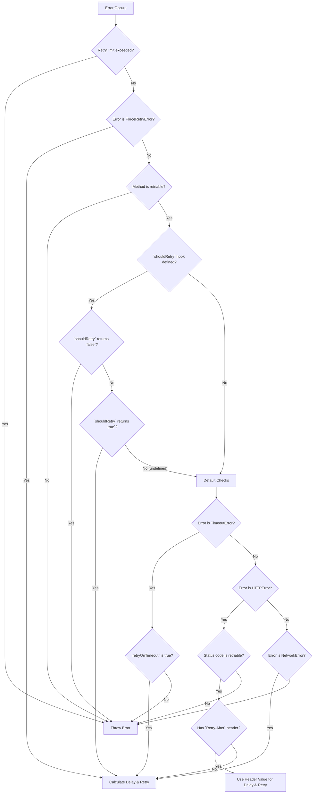
*Diagram of the retry logic flow in `#calculateRetryDelay`.*
Sources: [source/core/Ky.ts:504-590](https://github.com/sindresorhus/ky/blob/HEAD/source/core/Ky.ts#L504-L590)

## Response Body Handling

`ky` provides several mechanisms for handling response bodies, including convenience methods for parsing, schema validation, and progress streaming.

### Body Parsing and Convenience Methods

The `ResponsePromise` returned by `ky` is augmented with methods that correspond to the `Body` mixin methods (`.json()`, `.text()`, `.blob()`, etc.).

```typescript
// source/core/Ky.ts:300-334
for (const [type, mimeType] of Object.entries(responseTypes) as ObjectEntries<typeof responseTypes>) {
    // ...
    result[type] = async (schema?: StandardSchemaV1) => {
        // ...
        ky.request.headers.set('accept', ky.request.headers.get('accept') || mimeType);

        const response = await result;

        if (type !== 'json') {
            return response[type]();
        }

        const text = await response.text();
        // ... JSON parsing and schema validation logic
    };
}
```

When a method like `.json()` is called, it sets the `Accept` header on the request before it's sent. After the response is received, it calls the corresponding method on the native `Response` object. The `.json()` method has enhanced functionality:
*   It can use a custom `parseJson` function provided in the options.
*   It can validate the parsed JSON against a provided schema.

Sources: [source/core/Ky.ts:300-334](https://github.com/sindresorhus/ky/blob/HEAD/source/core/Ky.ts#L300-L334), [source/core/Ky.ts:112-140](https://github.com/sindresorhus/ky/blob/HEAD/source/core/Ky.ts#L112-L140)

### Error Response Body

When an `HTTPError` occurs, `ky` attempts to parse the response body to include it in the error object. This process is time-bound to prevent the application from stalling on a never-ending error response stream. The body is read as text, and if the `Content-Type` is JSON-like, it's parsed as JSON.

Sources: [source/core/Ky.ts:211](https://github.com/sindresorhus/ky/blob/HEAD/source/core/Ky.ts#L211), [source/core/Ky.ts:609-633](https://github.com/sindresorhus/ky/blob/HEAD/source/core/Ky.ts#L609-L633)

## Streaming and Progress Reporting

`ky` supports tracking upload and download progress by leveraging `ReadableStream` and `TransformStream`.

Sources: [source/utils/body.ts](https://github.com/sindresorhus/ky/blob/HEAD/source/utils/body.ts)

### Download Progress

When the `onDownloadProgress` option is provided, the response body is wrapped in a `TransformStream` that monitors the chunks of data as they are read.

1.  `Ky.create` checks for the `onDownloadProgress` option after the main response is received.
2.  If present, it clones the response and passes it to `streamResponse`.
3.  `streamResponse` creates a new `Response` where the body is the original body piped through the `withProgress` transform stream.
4.  The `withProgress` stream calls the `onDownloadProgress` callback with the percentage, transferred bytes, and total bytes for each chunk.

Sources: [source/core/Ky.ts:237-250](https://github.com/sindresorhus/ky/blob/HEAD/source/core/Ky.ts#L237-L250), [source/utils/body.ts:79-96](https://github.com/sindresorhus/ky/blob/HEAD/source/utils/body.ts#L79-L96)

### Upload Progress

Upload progress is handled similarly with the `onUploadProgress` option.

1.  In the `#fetch` method, before the request is sent, the `Request` object is passed to `streamRequest`.
2.  `streamRequest` creates a new `Request` where the body is the original body piped through the `withProgress` transform stream.
3.  The size of the original body is estimated using `getBodySize` to calculate the progress percentage.
4.  The `onUploadProgress` callback is invoked as the request body is being streamed to the server.

Sources: [source/core/Ky.ts:947](https://github.com/sindresorhus/ky/blob/HEAD/source/core/Ky.ts#L947), [source/core/Ky.ts:1035-1041](https://github.com/sindresorhus/ky/blob/HEAD/source/core/Ky.ts#L1035-L1041), [source/utils/body.ts:99-112](https://github.com/sindresorhus/ky/blob/HEAD/source/utils/body.ts#L99-L112)

The `getBodySize` utility provides an approximation for various body types, including `FormData`, `Blob`, `ArrayBuffer`, and `string`.

Sources: [source/utils/body.ts:7-44](https://github.com/sindresorhus/ky/blob/HEAD/source/utils/body.ts#L7-L44)

## Options Handling

`ky` distinguishes between its own options and the standard options for the `fetch` API. Non-standard options that are not specific to `ky` are passed through to the underlying `fetch` call. This allows for compatibility with environments that extend `fetch` with custom options (e.g., Next.js). The `findUnknownOptions` utility is responsible for this separation.

Sources: [source/utils/options.ts:5-27](https://github.com/sindresorhus/ky/blob/HEAD/source/utils/options.ts#L5-L27), [source/core/Ky.ts:945](https://github.com/sindresorhus/ky/blob/HEAD/source/core/Ky.ts#L945)

# Page: Retry Mechanism

<details>
<summary>Relevant source files</summary>

The following files were used as context for generating this wiki page:

- [source/core/Ky.ts](https://github.com/sindresorhus/ky/blob/HEAD/source/core/Ky.ts)
- [source/types/retry.ts](https://github.com/sindresorhus/ky/blob/HEAD/source/types/retry.ts)
- [test/retry.ts](https://github.com/sindresorhus/ky/blob/HEAD/test/retry.ts)
</details>

# Retry Mechanism

The `ky` library includes a robust, built-in retry mechanism to automatically handle transient failures, such as network errors or specific server responses. This system is highly configurable, allowing developers to control the number of retries, the conditions under which a retry should occur, and the delay between attempts. The core logic is encapsulated within the `Ky` class, primarily in the `#retry` and `#calculateRetryDelay` methods, which are invoked when a request fails.

The mechanism can be triggered by several types of errors, including `NetworkError`, `TimeoutError`, and `HTTPError` (for specific status codes). It also supports programmatic retries via a `ForceRetryError` that can be thrown from `afterResponse` hooks, providing fine-grained control over the retry process.

## Configuration

The entire retry behavior is configured through the `retry` property in the `Options` object. This can be a number (specifying the retry limit) or a `RetryOptions` object for detailed configuration.

Sources: [source/core/Ky.ts:377](https://github.com/sindresorhus/ky/blob/HEAD/source/core/Ky.ts#L377), [source/types/retry.ts:15-175](https://github.com/sindresorhus/ky/blob/HEAD/source/types/retry.ts#L15-L175)

| Option | Type | Default | Description |
| --- | --- | --- | --- |
| `limit` | `number` | `2` | The maximum number of retry attempts. |
| `methods` | `HttpMethod[]` | `['get', 'put', 'head', 'delete', 'options', 'trace']` | HTTP methods that are allowed to be retried. |
| `statusCodes` | `number[]` | `[408, 413, 429, 500, 502, 503, 504]` | HTTP status codes that trigger a retry. |
| `afterStatusCodes`| `number[]` | `[413, 429, 503]` | Status codes that respect the `Retry-After` header. |
| `maxRetryAfter` | `number` | `Infinity` | The maximum delay (in ms) to wait when a `Retry-After` header is present. |
| `backoffLimit` | `number` | `Infinity` | The upper limit for the calculated delay between retries (in ms). |
| `delay` | `(attemptCount: number) => number` | `0.3 * (2 ** (attemptCount - 1)) * 1000` | A function to calculate the delay. Implements exponential backoff by default. |
| `jitter` | `boolean \| (delay: number) => number` | `undefined` | If `true`, applies full random jitter to the delay. A function can be provided for custom jitter logic. |
| `retryOnTimeout`| `boolean` | `false` | If `true`, requests that fail due to a `TimeoutError` will be retried. |
| `shouldRetry` | `(state: ShouldRetryState) => boolean \| undefined \| Promise<...>` | `undefined` | A function to programmatically decide if a retry should be attempted, overriding default logic. |

## Core Retry Logic Flow

When a request fails, the `#calculateRetryDelay` method is invoked to determine if a retry should be performed and for how long to wait. The decision process follows a specific order of checks.

The following diagram illustrates the high-level logic flow for determining whether to retry a failed request.

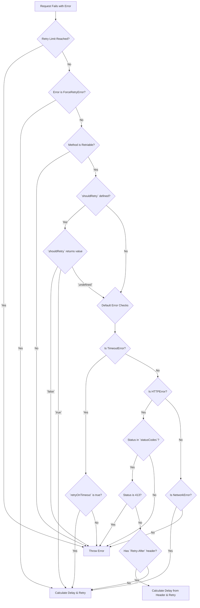
*Diagram based on the implementation in `source/core/Ky.ts:504-590`*

## Retriable Errors

The retry mechanism is designed to handle specific, recoverable error conditions.

Sources: [source/core/Ky.ts:510-515](https://github.com/sindresorhus/ky/blob/HEAD/source/core/Ky.ts#L510-L515), [source/core/Ky.ts:540-590](https://github.com/sindresorhus/ky/blob/HEAD/source/core/Ky.ts#L540-L590)

*   **`NetworkError`**: This error is thrown for issues like DNS failures or dropped connections. These are considered transient and are retried by default for idempotent HTTP methods.
    Sources: [source/core/Ky.ts:585-587](https://github.com/sindresorhus/ky/blob/HEAD/source/core/Ky.ts#L585-L587), [source/errors/NetworkError.ts](https://github.com/sindresorhus/ky/blob/HEAD/source/errors/NetworkError.ts)

*   **`HTTPError`**: This error occurs when the server responds with a non-2xx status code. A retry is only attempted if the response status code is present in the `retry.statusCodes` array. By default, this includes server errors (5xx) and specific client errors like 408 (Request Timeout) and 429 (Too Many Requests).
    Sources: [source/core/Ky.ts:548-551](https://github.com/sindresorhus/ky/blob/HEAD/source/core/Ky.ts#L548-L551)

*   **`TimeoutError`**: This error is thrown if a request exceeds its configured `timeout` or the global `totalTimeout`. It is only retried if the `retry.retryOnTimeout` option is explicitly set to `true`.
    Sources: [source/core/Ky.ts:540-543](https://github.com/sindresorhus/ky/blob/HEAD/source/core/Ky.ts#L540-L543), [test/retry.ts:1016-1040](https://github.com/sindresorhus/ky/blob/HEAD/test/retry.ts#L1016-L1040)

*   **`ForceRetryError`**: This is a special error that can be thrown from an `afterResponse` hook to programmatically trigger a retry, bypassing the standard checks for method and status code. This allows for complex, application-specific retry logic.
    Sources: [source/core/Ky.ts:4](https://github.com/sindresorhus/ky/blob/HEAD/source/core/Ky.ts#L4), [source/core/Ky.ts:513-515](https://github.com/sindresorhus/ky/blob/HEAD/source/core/Ky.ts#L513-L515), [source/errors/ForceRetryError.ts](https://github.com/sindresorhus/ky/blob/HEAD/source/errors/ForceRetryError.ts)

## Customizing Retry Decisions with `shouldRetry`

For ultimate control, the `shouldRetry` function can be provided in the retry options. This function is called before the default error checks and can override the standard behavior.

The function receives a state object containing the `error` and the current `retryCount` (starting at 1 for the first retry).

It can return one of three values:
*   `true`: Forces a retry, bypassing all other checks (except the retry limit).
*   `false`: Prevents a retry, causing the original error to be thrown immediately.
*   `undefined`: Defers to the default retry logic (checking `retryOnTimeout`, status codes, etc.).

Sources: [source/types/retry.ts:128-174](https://github.com/sindresorhus/ky/blob/HEAD/source/types/retry.ts#L128-L174), [source/core/Ky.ts:523-537](https://github.com/sindresorhus/ky/blob/HEAD/source/core/Ky.ts#L523-L537)

The following sequence diagram shows the interaction when `shouldRetry` is used.

```mermaid
sequenceDiagram
    participant Ky as Ky Internal
    participant UserCode as shouldRetry()
    
    Ky->>Ky: Request fails, enters #calculateRetryDelay
    Ky->>Ky: Check retry limit and method
    Ky->>+UserCode: shouldRetry({error, retryCount})
    alt Returns true
        UserCode-->>-Ky: true
        Ky->>Ky: Calculate delay and schedule retry
    else Returns false
        UserCode-->>-Ky: false
        Ky->>Ky: Throw original error
    else Returns undefined
        UserCode-->>-Ky: undefined
        Ky->>Ky: Proceed with default error checks (status code, timeout, etc.)
    end
```

## Delay Calculation

### Backoff and `Retry-After`

By default, `ky` uses an exponential backoff strategy to calculate the delay between retries. The delay increases with each attempt to avoid overwhelming a struggling server. This can be clamped by `backoffLimit` or completely replaced by providing a custom `delay` function.

If a server responds with a status code in `afterStatusCodes` (e.g., 429, 503) and a `Retry-After` header, `ky` will prioritize the server-specified delay. The value can be a number of seconds or an HTTP date.

Sources: [source/core/Ky.ts:487-502](https://github.com/sindresorhus/ky/blob/HEAD/source/core/Ky.ts#L487-L502), [source/core/Ky.ts:553-575](https://github.com/sindresorhus/ky/blob/HEAD/source/core/Ky.ts#L553-L575), [test/retry.ts:185-230](https://github.com/sindresorhus/ky/blob/HEAD/test/retry.ts#L185-L230)

### Jitter

To prevent the "thundering herd" problem where many clients retry simultaneously, `ky` supports adding jitter to the retry delay. Setting `jitter: true` applies a random delay between 0 and the calculated backoff delay. A custom function can also be provided for other jitter strategies. Jitter is not applied when a `Retry-After` header is present.

Sources: [source/types/retry.ts:74-107](https://github.com/sindresorhus/ky/blob/HEAD/source/types/retry.ts#L74-L107), [source/core/Ky.ts:491-499](https://github.com/sindresorhus/ky/blob/HEAD/source/core/Ky.ts#L491-L499), [test/retry.ts:978-1014](https://github.com/sindresorhus/ky/blob/HEAD/test/retry.ts#L978-L1014)

## Timeouts and Retries

The retry mechanism interacts with two timeout settings:

*   **`timeout`**: This is a per-attempt timeout. When a request times out, the clock is reset for the next retry attempt, ensuring each attempt gets the full time budget.
    Sources: [source/core/Ky.ts:963-967](https://github.com/sindresorhus/ky/blob/HEAD/source/core/Ky.ts#L963-L967), [test/retry.ts:1325-1354](https://github.com/sindresorhus/ky/blob/HEAD/test/retry.ts#L1325-L1354)
*   **`totalTimeout`**: This is a global timeout for the entire operation, including all attempts and the delays between them. It acts as a final deadline. If this timeout is exceeded, a `TimeoutError` is thrown, and no further retries will be attempted, even if the retry `limit` has not been reached.
    Sources: [source/core/Ky.ts:858-869](https://github.com/sindresorhus/ky/blob/HEAD/source/core/Ky.ts#L858-L869), [test/retry.ts:1096-1122](https://github.com/sindresorhus/ky/blob/HEAD/test/retry.ts#L1096-L1122)

## Hooks and Retries

Hooks provide entry points to interact with the retry lifecycle.

*   **`afterResponse`**: This hook can inspect a response and decide to trigger a retry by throwing a `ForceRetryError`. This is useful for retrying on conditions not covered by default, such as a successful response with a specific payload indicating a pending operation.
    Sources: [source/core/Ky.ts:812-821](https://github.com/sindresorhus/ky/blob/HEAD/source/core/Ky.ts#L812-L821)

*   **`beforeRetry`**: This hook is executed after the decision to retry has been made but before the next request is sent. It receives the `request`, `options`, `error`, and `retryCount`. It can be used to modify the request for the next attempt (e.g., by changing headers) or to stop the retry process by returning the `stop` symbol.
    Sources: [source/core/Ky.ts:886-922](https://github.com/sindresorhus/ky/blob/HEAD/source/core/Ky.ts#L886-L922)

# Page: Error Handling in Ky

<details>
<summary>Relevant source files</summary>

The following files were used as context for generating this wiki page:

- [source/errors/KyError.ts](https://github.com/sindresorhus/ky/blob/HEAD/source/errors/KyError.ts)
- [source/errors/HTTPError.ts](https://github.com/sindresorhus/ky/blob/HEAD/source/errors/HTTPError.ts)
- [source/errors/NetworkError.ts](https://github.com/sindresorhus/ky/blob/HEAD/source/errors/NetworkError.ts)
- [source/errors/TimeoutError.ts](https://github.com/sindresorhus/ky/blob/HEAD/source/errors/TimeoutError.ts)
</details>

# Error Handling in Ky

Ky provides a structured error handling system built around a custom base error class, `KyError`. This allows for robust and predictable error management when making HTTP requests. All errors originating from Ky's HTTP lifecycle, such as failed status codes, network issues, or timeouts, extend this base class. This design enables developers to easily distinguish Ky-specific errors from other exceptions in their code using `instanceof KyError` or the `isKyError()` type guard.

It is important to note that not all errors related to a Ky request are instances of `KyError`. For example, a `SchemaValidationError` is intentionally excluded, as it originates from user-provided schema validation logic rather than a failure in the HTTP request-response cycle itself.

Sources: [source/errors/KyError.ts:2-7](https://github.com/sindresorhus/ky/blob/HEAD/source/errors/KyError.ts#L2-L7)

## Error Class Hierarchy

All custom errors in Ky inherit from the `KyError` base class, which in turn extends the standard JavaScript `Error` class. This creates a clear and organized hierarchy for different failure scenarios.

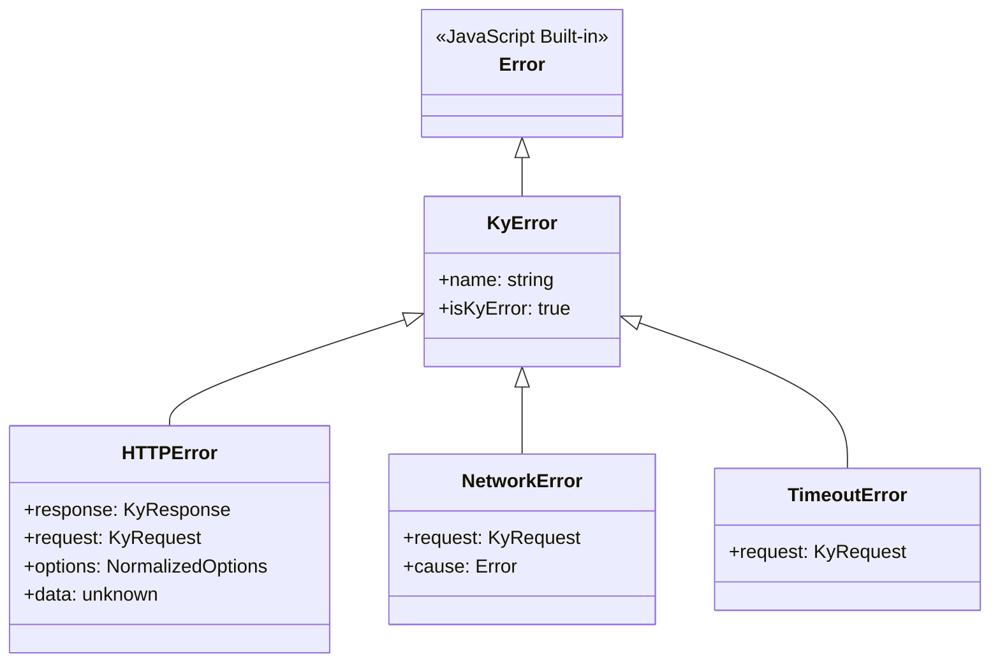
This diagram illustrates the inheritance structure of Ky's error classes.

Sources: [source/errors/KyError.ts:8](https://github.com/sindresorhus/ky/blob/HEAD/source/errors/KyError.ts#L8), [source/errors/HTTPError.ts:15](https://github.com/sindresorhus/ky/blob/HEAD/source/errors/HTTPError.ts#L15), [source/errors/NetworkError.ts:11](https://github.com/sindresorhus/ky/blob/HEAD/source/errors/NetworkError.ts#L11), [source/errors/TimeoutError.ts:7](https://github.com/sindresorhus/ky/blob/HEAD/source/errors/TimeoutError.ts#L7)

## Error Types

### `KyError` (Base Class)

`KyError` is the fundamental error class for all exceptions thrown by Ky during the request lifecycle. It is not thrown directly but serves as a parent class for more specific errors.

-   **Purpose**: To provide a common type that can be used to catch any error originating from Ky.
-   **Properties**:
    -   `name`: Set to `'KyError'`.
    -   `isKyError`: A getter that always returns `true`, useful for type guarding and cross-realm checks.

Sources: [source/errors/KyError.ts:2-14](https://github.com/sindresorhus/ky/blob/HEAD/source/errors/KyError.ts#L2-L14)

### `HTTPError`

An `HTTPError` is thrown when a response is received with a non-2xx status code and the `throwHttpErrors` option is enabled. This is one of the most common errors encountered when using Ky.

-   **Properties**:
    -   `name`: Set to `'HTTPError'`.
    -   `response`: The `Response` object. The body of this response is consumed to populate the `data` property, so methods like `response.json()` will not work.
    -   `request`: The `Request` object that initiated the call.
    -   `options`: The normalized options used for the request.
    -   `data`: The pre-parsed response body. For JSON responses, it's parsed via `JSON.parse` (or a custom `parseJson` function). For other types, it's plain text. It will be `undefined` if the body is empty or parsing fails. Population of this property is bounded by the request timeout and a 10 MiB size limit.

The error message is constructed using the response's status code and status text, for example: `Request failed with status code 404 Not Found: GET https://example.com`.

Sources: [source/errors/HTTPError.ts:7-34](https://github.com/sindresorhus/ky/blob/HEAD/source/errors/HTTPError.ts#L7-L34)

### `NetworkError`

A `NetworkError` is thrown when the request fails due to a client-side network issue, such as a DNS failure, a refused connection, or the client being offline. These errors are automatically retried for idempotent request methods.

-   **Properties**:
    -   `name`: Set to `'NetworkError'`.
    -   `request`: The `Request` object that failed.
    -   `cause`: The original, underlying error that caused the network failure is available via the standard `cause` property on the error instance.

The error message indicates a network failure, for example: `Request failed due to a network error: GET https://example.com`.

Sources: [source/errors/NetworkError.ts:5-19](https://github.com/sindresorhus/ky/blob/HEAD/source/errors/NetworkError.ts#L5-L19)

### `TimeoutError`

A `TimeoutError` is thrown if a request does not complete within the specified `timeout` duration in the options.

-   **Properties**:
    -   `name`: Set to `'TimeoutError'`.
    -   `request`: The `Request` object that timed out.

The error message clearly states that the request timed out, for example: `Request timed out: GET https://example.com`.

Sources: [source/errors/TimeoutError.ts:5-15](https://github.com/sindresorhus/ky/blob/HEAD/source/errors/TimeoutError.ts#L5-L15)

## Summary of Error Types

The following table summarizes the primary error types in Ky, their key properties, and the conditions under which they are thrown.

| Error Class      | Key Properties                               | When Thrown                                                              |
|------------------|----------------------------------------------|--------------------------------------------------------------------------|
| `KyError`        | `name`, `isKyError`                          | Base class for all Ky errors; not thrown directly.                       |
| `HTTPError`      | `response`, `request`, `options`, `data`     | Response has a non-2xx status code and `throwHttpErrors` is enabled.     |
| `NetworkError`   | `request`, `cause`                           | A network error occurs (e.g., DNS failure, connection refused).          |
| `TimeoutError`   | `request`                                    | The request exceeds the configured timeout.                              |

Sources: [source/errors/KyError.ts](https://github.com/sindresorhus/ky/blob/HEAD/source/errors/KyError.ts), [source/errors/HTTPError.ts](https://github.com/sindresorhus/ky/blob/HEAD/source/errors/HTTPError.ts), [source/errors/NetworkError.ts](https://github.com/sindresorhus/ky/blob/HEAD/source/errors/NetworkError.ts), [source/errors/TimeoutError.ts](https://github.com/sindresorhus/ky/blob/HEAD/source/errors/TimeoutError.ts)

# Page: Hooks and the Request Lifecycle

<details>
<summary>Relevant source files</summary>

The following files were used as context for generating this wiki page:

- [source/types/hooks.ts](https://github.com/sindresorhus/ky/blob/HEAD/source/types/hooks.ts)
- [source/core/Ky.ts](https://github.com/sindresorhus/ky/blob/HEAD/source/core/Ky.ts)
- [test/hooks.ts](https://github.com/sindresorhus/ky/blob/HEAD/test/hooks.ts)
</details>

# Hooks and the Request Lifecycle

The `ky` library provides a powerful hook system that allows developers to intercept and modify the request/response lifecycle at various key stages. This enables advanced functionality such as modifying request options, handling authentication flows, implementing custom retry logic, and augmenting errors before they are thrown. Hooks are registered as arrays of functions for specific lifecycle events within the `options` object.

The lifecycle is designed to be robust, with a clear flow for initial requests, retries, and error handling. Each hook receives a state object containing the current `request`, normalized `options`, `retryCount`, and other context-specific data like the `response` or `error`.

Sources: [source/types/hooks.ts:88](https://github.com/sindresorhus/ky/blob/HEAD/source/types/hooks.ts#L88), [source/core/Ky.ts:142-337](https://github.com/sindresorhus/ky/blob/HEAD/source/core/Ky.ts#L142-L337)

## Request Lifecycle Overview

The request lifecycle in `ky` follows a well-defined sequence of events, providing multiple points for intervention via hooks. The process begins with option initialization and proceeds through request creation, potential retries, response handling, and final error processing.

The following diagram illustrates the complete lifecycle, including the execution order of all available hooks.

```mermaid
sequenceDiagram
    participant User
    participant ky
    participant Ky instance
    participant Fetch API

    User->>ky: Call ky(input, options)
    ky->>ky: Ky.create(input, options)
    ky->>Ky instance: Run init hooks (sync)
    ky->>Ky instance: Create Request object
    activate Ky instance

    Ky instance->>Ky instance: Run beforeRequest hooks (async)
    alt Hook returns a Response
        Ky instance-->>User: Return Response from hook
    else Hook modifies/returns Request
        loop Retry & Fetch Logic
            Ky instance->>+Fetch API: #fetch()
            alt Successful Fetch
                Fetch API-->>-Ky instance: Return Response
                Ky instance->>Ky instance: Run afterResponse hooks
                alt Hook returns ky.retry()
                    Ky instance->>Ky instance: Throw ForceRetryError
                    Note right of Ky instance: Enters retry path
                else Hook returns new/modified Response
                    Ky instance-->>User: Return final Response
                    break
                end
            else Fetch Fails (HTTP/Network/Timeout Error)
                Fetch API-->>-Ky instance: Throw Error
            end

            break On unrecoverable error or no more retries
                Ky instance->>Ky instance: Run beforeError hooks
                Ky instance-->>User: Throw final Error
            end

            Ky instance->>Ky instance: #calculateRetryDelay()
            Ky instance->>Ky instance: Run beforeRetry hooks
            alt Hook returns ky.stop or throws
                Ky instance->>Ky instance: Run beforeError hooks
                Ky instance-->>User: Throw final Error
                break
            else Hook returns a Response
                Ky instance->>Ky instance: Run afterResponse hooks
                Ky instance-->>User: Return Response from hook
                break
            else Hook modifies Request or returns void
                Note right of Ky instance: Continue to next retry iteration
            end
        end
    end
    deactivate Ky instance
```
Sources: [source/core/Ky.ts:153-298](https://github.com/sindresorhus/ky/blob/HEAD/source/core/Ky.ts#L153-L298)

## Hook Types

`ky` provides five distinct hooks, each targeting a specific phase of the request lifecycle. They are defined in the `hooks` property of the options object.

| Hook            | Trigger                                                      | Purpose                                                                                             |
| --------------- | ------------------------------------------------------------ | --------------------------------------------------------------------------------------------------- |
| `init`          | Before the `Request` object is created.                      | Synchronously modify mutable options (`headers`, `json`, `searchParams`, etc.).                     |
| `beforeRequest` | After the `Request` is created, just before it is sent.      | Modify the outgoing `Request` or bypass the network by returning a `Response`.                      |
| `beforeRetry`   | Before a retry attempt is made after a failure.              | Modify the retry `Request`, implement custom retry logic, or prevent the retry.                     |
| `afterResponse` | After a network response is received.                        | Read or modify the `Response`, or trigger a retry based on the response content.                    |
- [source/types/hooks.ts:88-365](https://github.com/sindresorhus/ky/blob/HEAD/source/types/hooks.ts#L88-L365)

### `init`

The `init` hook is the first to run in the lifecycle. It allows for synchronous modification of the `options` object before the `Request` is constructed. This is the ideal place to inject default values, such as API keys in search parameters or authorization headers.

Unlike other hooks, `init` hooks are synchronous. Any error thrown will propagate immediately and will not be caught by `beforeError` hooks. To prevent state from leaking between requests, `ky` shallow-clones mutable options like `json`, `headers`, and `retry` before passing them to the `init` hook.

**Type Definition:**
```typescript
// source/types/hooks.ts:28
export type InitHook = (options: Options) => void;
```

**Example:**
```typescript
// source/types/hooks.ts:100-108
const api = ky.extend({
	hooks: {
		init: [
			options => {
				options.searchParams = {apiKey: getApiKey()};
			},
		],
	},
});
```
Sources: [source/types/hooks.ts:28, 90-93](), [source/core/Ky.ts:96-110, 144-149]()

### `beforeRequest`

The `beforeRequest` hook runs just before the request is sent over the network. It receives the final `Request` object and normalized options. This hook can be used to make last-minute modifications to the request, such as adding dynamic headers.

This hook runs only once for a given `ky` call, before any retry logic begins. Therefore, its `retryCount` is always `0`. The hook can return a new `Request` to replace the original one, or it can return a `Response` to bypass the network call entirely, which is useful for mocking or caching. Any error thrown here is considered fatal and will not trigger retries.

**Type Definition:**
```typescript
// source/types/hooks.ts:40
export type BeforeRequestHook = (state: BeforeRequestState) => Request | Response | void | Promise<Request | Response | void>;
```

**Execution Logic:**
```typescript
// source/core/Ky.ts:767-784
async #runBeforeRequestHooks(): Promise<Response | undefined> {
	for (const hook of this.#options.hooks.beforeRequest) {
		// ...
		const result = await hook({
			request: this.request,
			options: this.#getNormalizedOptions(),
			retryCount: 0,
		});

		if (isRequestInstance(result)) {
			this.#assignRequest(result);
		} else if (isResponseInstance(result)) {
			return result;
		}
	}

	return undefined;
}
```
Sources: [source/types/hooks.ts:40, 119-125](), [source/core/Ky.ts:767-784](https://github.com/sindresorhus/ky/blob/HEAD/source/core/Ky.ts#L767-L784), [test/hooks.ts:752-788](https://github.com/sindresorhus/ky/blob/HEAD/test/hooks.ts#L752-L788)

### `beforeRetry`

The `beforeRetry` hook is executed when a request fails and a retry is about to be attempted. It receives the `request`, `options`, the `error` that triggered the retry, and the current `retryCount` (which is always `>= 1`).

This hook is commonly used for scenarios like refreshing an expired authentication token. It can return a new `Request` to be used for the retry attempt, a `Response` to use instead of retrying, or the `ky.stop` symbol to prevent the retry altogether. Throwing an error from this hook is a fatal action that bypasses `beforeError` and rejects the promise immediately.

**Type Definition:**
```typescript
// source/types/hooks.ts:53
export type BeforeRetryHook = (state: BeforeRetryState) => Request | Response | typeof stop | void | Promise<Request | Response | typeof stop | void>;
```

**Example: Refreshing a token**
```typescript
// source/types/hooks.ts:188-198
const response = await ky('https://example.com', {
	hooks: {
		beforeRetry: [
			async ({request, options, error, retryCount}) => {
				const token = await ky('https://example.com/refresh-token');
				request.headers.set('Authorization', `token ${token}`);
			}
		]
	}
});
```
Sources: [source/types/hooks.ts:53, 170-181](), [source/core/Ky.ts:886-922](https://github.com/sindresorhus/ky/blob/HEAD/source/core/Ky.ts#L886-L922), [source/core/constants.js](https://github.com/sindresorhus/ky/blob/HEAD/source/core/constants.js)

### `afterResponse`

The `afterResponse` hook runs after a response is successfully received from the network, but before the promise is resolved. It receives a clone of the `response` and can be used for logging, modifying the response, or initiating a retry based on the response body.

A key feature of this hook is the ability to force a retry by returning `ky.retry()`. This is useful when the server returns a `200 OK` status but the response body indicates a transient issue (e.g., a rate limit message). Any other error thrown from this hook is fatal and will not trigger Ky's retry logic.

**Type Definition:**
```typescript
// source/types/hooks.ts:86
export type AfterResponseHook = (state: AfterResponseState) => Response | RetryMarker | void | Promise<Response | RetryMarker | void>;
```

**Execution Logic:**
When a hook returns a `RetryMarker` (created by `ky.retry()`), the core logic throws a `ForceRetryError`, which is caught by the retry handler to initiate a new attempt.

```typescript
// source/core/Ky.ts:812-821
if (modifiedResponse instanceof RetryMarker) {
	// Cancel both the cloned response passed to the hook and the current response to prevent resource leaks (especially important in Deno/Bun).
	// Do not await cancellation since hooks can clone the response, leaving extra tee branches that keep cancel promises pending per the Streams spec.
	if (hookResponse !== response) {
		this.#cancelResponseBody(hookResponse);
	}

	this.#cancelResponseBody(response);
	throw new ForceRetryError(modifiedResponse.options);
}
```
Sources: [source/types/hooks.ts:86, 294-300](), [source/core/Ky.ts:786-842](https://github.com/sindresorhus/ky/blob/HEAD/source/core/Ky.ts#L786-L842), [source/errors/ForceRetryError.ts](https://github.com/sindresorhus/ky/blob/HEAD/source/errors/ForceRetryError.ts)

### `beforeError`

The `beforeError` hook is the final step before a request promise is rejected. It runs for any error that has exhausted all retry attempts or is considered fatal. This hook receives the final `error` and can be used to transform it into a more specific, custom error type, or to add additional context for logging and debugging.

The hook must return an `Error` instance. If it returns any other value, the original error is thrown. This hook is called for all `ky` error types, including `HTTPError`, `NetworkError`, and `TimeoutError`.

**Type Definition:**
```typescript
// source/types/hooks.ts:71
export type BeforeErrorHook = (state: BeforeErrorState) => Error | Promise<Error>;
```

**Execution Logic:**
The main promise logic is wrapped in a `try...catch` block. The `catch` block iterates through the `beforeError` hooks, allowing each one to process or replace the error.

```typescript
// source/core/Ky.ts:269-285
let processedError: Error = error;
for (const hook of ky.#options.hooks.beforeError) {
	// ...
	// eslint-disable-next-line no-await-in-loop
	const hookResult: unknown = await hook({
		request: ky.request,
		options: ky.#getNormalizedOptions(),
		error: processedError,
		retryCount: ky.#retryCount,
	});

	// Only overwrite if the hook returns a valid Error instance.
	if (hookResult instanceof Error) {
		processedError = hookResult;
	}
}
```
Sources: [source/types/hooks.ts:71, 252-256](), [source/core/Ky.ts:269-287](https://github.com/sindresorhus/ky/blob/HEAD/source/core/Ky.ts#L269-L287)

## State Objects

Each asynchronous hook receives a state object with properties relevant to its stage in the lifecycle.

### `BeforeRequestState`
Passed to `beforeRequest` hooks.

| Property     | Type                | Description                                                                    |
|--------------|---------------------|--------------------------------------------------------------------------------|
| `request`    | `KyRequest`         | The mutable `Request` object about to be sent.                                 |
| `options`    | `NormalizedOptions` | The normalized, immutable `ky` options for the request.                        |
| `retryCount` | `0`                 | Always `0`, as this hook runs before any retries.                              |
Sources: [source/types/hooks.ts:30-38](https://github.com/sindresorhus/ky/blob/HEAD/source/types/hooks.ts#L30-L38)

### `BeforeRetryState`
Passed to `beforeRetry` hooks.

| Property     | Type                | Description                                                                    |
|--------------|---------------------|--------------------------------------------------------------------------------|
| `request`    | `KyRequest`         | The mutable `Request` object for the retry attempt.                            |
| `options`    | `NormalizedOptions` | The normalized, immutable `ky` options.                                        |
| `error`      | `Error`             | The error that triggered the retry (e.g., `HTTPError`, `TimeoutError`).        |
| `retryCount` | `number`            | The number of retries attempted. Always `>= 1`.                                |
Sources: [source/types/hooks.ts:42-51](https://github.com/sindresorhus/ky/blob/HEAD/source/types/hooks.ts#L42-L51)

### `AfterResponseState`
Passed to `afterResponse` hooks.

| Property     | Type                | Description                                                                    |
|--------------|---------------------|--------------------------------------------------------------------------------|
| `request`    | `KyRequest`         | The original `Request` object.                                                 |
| `options`    | `NormalizedOptions` | The normalized, immutable `ky` options.                                        |
| `response`   | `KyResponse`        | A clone of the received `Response` object.                                     |
| `retryCount` | `number`            | The number of retries attempted. `0` for the initial request.                  |
Sources: [source/types/hooks.ts:73-84](https://github.com/sindresorhus/ky/blob/HEAD/source/types/hooks.ts#L73-L84)

### `BeforeErrorState`
Passed to `beforeError` hooks.

| Property     | Type                | Description                                                                    |
|--------------|---------------------|--------------------------------------------------------------------------------|
| `request`    | `KyRequest`         | The final `Request` that resulted in the error.                                |
| `options`    | `NormalizedOptions` | The normalized, immutable `ky` options.                                        |
| `error`      | `Error`             | The `Error` instance about to be thrown.                                       |
| `retryCount` | `number`            | The number of retries attempted before this final error.                       |
Sources: [source/types/hooks.ts:55-68](https://github.com/sindresorhus/ky/blob/HEAD/source/types/hooks.ts#L55-L68)

## Summary

The `ky` hook system offers comprehensive control over the entire request lifecycle. By tapping into the `init`, `beforeRequest`, `beforeRetry`, `afterResponse`, and `beforeError` events, developers can build sophisticated and resilient HTTP clients. This system is fundamental for handling dynamic request modifications, complex authentication schemes like token refreshing, custom caching strategies, and tailored error reporting. The clear separation of concerns between hooks ensures that logic remains organized and maintainable.

# Page: Creating Custom Instances

<details>
<summary>Relevant source files</summary>

The following files were used as context for generating this wiki page:

- [source/core/Ky.ts](https://github.com/sindresorhus/ky/blob/HEAD/source/core/Ky.ts)
- [readme.md](https://github.com/sindresorhus/ky/blob/HEAD/readme.md)
</details>

# Creating Custom Instances

Ky allows for the creation of custom instances with pre-configured default options. This is a powerful feature for reducing boilerplate and creating specialized API clients. Instead of passing the same options (like headers, a base URL, or hooks) to every request, you can encapsulate this configuration within a new Ky instance.

There are two primary methods for creating custom instances: `ky.create()` and `ky.extend()`. The choice between them depends on whether you need a completely new configuration or wish to build upon an existing one. These instances are ideal for defining API-specific clients, such as one for a primary API and another for a separate authentication service, each with its own set of defaults.

Sources: [readme.md:940-944](https://github.com/sindresorhus/ky/blob/HEAD/readme.md#L940-L944), [readme.md:1026-1029](https://github.com/sindresorhus/ky/blob/HEAD/readme.md#L1026-L1029)

## Instance Creation Methods

Ky provides two distinct factory methods for generating new instances.

### `ky.create(defaultOptions)`

This method creates a new, isolated Ky instance with a fresh set of default options. It does not inherit any configuration from the global `ky` object or any other instance. This is useful for defining a completely independent client, for example, when interacting with an external API that has different requirements from your primary application API.

Any options provided to `ky.create()` will become the default for all requests made with the new instance. These defaults can still be overridden on a per-request basis.

Sources: [readme.md:1026-1038](https://github.com/sindresorhus/ky/blob/HEAD/readme.md#L1026-L1038), [source/core/Ky.ts:143-152](https://github.com/sindresorhus/ky/blob/HEAD/source/core/Ky.ts#L143-L152)

### `ky.extend(defaultOptions)`

In contrast to `create`, `ky.extend()` creates a new instance that inherits and merges its defaults from the parent instance. This is the most common way to create specialized instances. For example, you can create a base `api` instance with authentication hooks and then extend it to create more specific clients like `usersApi` or `productsApi`, which inherit the authentication logic and add their own `prefix`.

Options are deep-merged by default. For instance, `hooks` arrays are concatenated, and `headers` objects are combined. This merging behavior can be overridden using `replaceOption`.

Sources: [readme.md:940-945](https://github.com/sindresorhus/ky/blob/HEAD/readme.md#L940-L945), [readme.md:1006-1007](https://github.com/sindresorhus/ky/blob/HEAD/readme.md#L1006-L1007)

### Comparison

| Feature | `ky.create()` | `ky.extend()` |
| :--- | :--- | :--- |
| **Inheritance** | No. Creates a completely new instance. | Yes. Inherits and merges defaults from the parent. |
| **Use Case** | Defining a base API client or a client for a completely separate service. | Creating specialized clients that build upon an existing configuration. |
| **Configuration** | Starts with Ky's built-in defaults, overridden by `defaultOptions`. | Starts with the parent's defaults, which are then merged with `defaultOptions`. |

Sources: [readme.md:940-944](https://github.com/sindresorhus/ky/blob/HEAD/readme.md#L940-L944), [readme.md:1026-1029](https://github.com/sindresorhus/ky/blob/HEAD/readme.md#L1026-L1029)

The following diagram illustrates the inheritance relationship between the different instance creation methods.

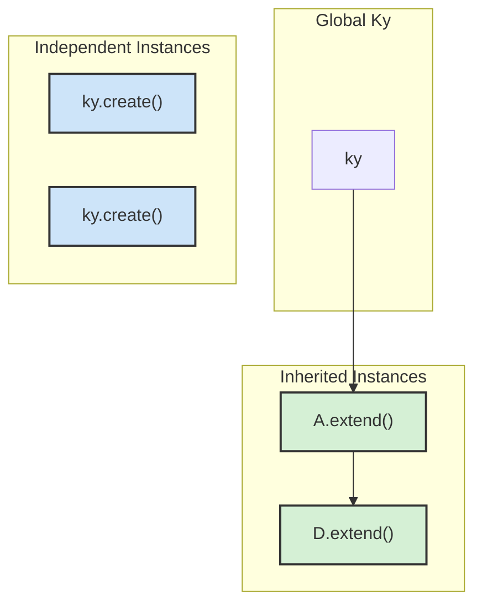
*Diagram illustrating that `create()` produces isolated instances, while `extend()` creates a chain of inheritance.*

Sources: [readme.md:940-944](https://github.com/sindresorhus/ky/blob/HEAD/readme.md#L940-L944), [readme.md:1026-1029](https://github.com/sindresorhus/ky/blob/HEAD/readme.md#L1026-L1029)

## Configuration and Options

When creating a new instance, you can provide any of the standard Ky options as defaults. These options are processed in the `Ky` class constructor.

```typescript
// source/core/Ky.ts:364-383

constructor(input: Input, options: Options = {}) {
    this.#input = input;
    // ...
    this.#options = {
        ...options,
        headers: mergeHeaders((this.#input as Request).headers, options.headers),
        hooks: mergeHooks({}, options.hooks),
        method: normalizeRequestMethod(options.method ?? (this.#input as Request).method ?? 'GET'),
        // ...
        prefix: String(options.prefix || ''),
        retry: normalizeRetryOptions(options.retry),
        throwHttpErrors: options.throwHttpErrors ?? true,
        timeout: options.timeout ?? 10_000,
        totalTimeout: options.totalTimeout ?? false,
        fetch: options.fetch ?? globalThis.fetch.bind(globalThis),
        context: options.context ?? {},
    };
}
```
*The constructor initializes a new request instance by merging provided options with defaults.*

Sources: [source/core/Ky.ts:364-383](https://github.com/sindresorhus/ky/blob/HEAD/source/core/Ky.ts#L364-L383)

### Merging vs. Replacing Options

When using `ky.extend()`, certain options are merged by default:
- `hooks`: New hooks are appended to the parent's hooks.
- `headers`: New headers are merged with the parent's headers.
- `searchParams`: New search parameters are added to the parent's.
- `context`: Top-level properties are merged (shallow merge).

To completely replace an option instead of merging it, use the `replaceOption` utility.

```javascript
import ky, {replaceOption} from 'ky';

const api = ky.create({
	hooks: {
		beforeRequest: [addAuth, addTracking],
	},
});

// Replaces instead of appending
const replaced = api.extend({hooks: replaceOption({beforeRequest: [onlyThis]})});
// replaced hooks.beforeRequest is [onlyThis]
```

Sources: [readme.md:1006-1024](https://github.com/sindresorhus/ky/blob/HEAD/readme.md#L1006-L1024), [readme.md:1344-1360](https://github.com/sindresorhus/ky/blob/HEAD/readme.md#L1344-L1360)

## Common Use Cases

### Setting a Base URL

A common pattern is to create an instance with a `baseUrl` for a specific API endpoint. This simplifies calls by allowing you to use relative paths.

```javascript
import ky from 'ky';

// On https://my-site.com

const api = ky.create({baseUrl: 'https://example.com/api/'});

const response = await api.get('users/123');
//=> Makes a request to 'https://example.com/api/users/123'
```
The `baseUrl` is used to resolve relative `input` URLs. If the `input` is an absolute URL, the `baseUrl` is ignored.

Sources: [readme.md:221-232](https://github.com/sindresorhus/ky/blob/HEAD/readme.md#L221-L232), [readme.md:1035-1038](https://github.com/sindresorhus/ky/blob/HEAD/readme.md#L1035-L1038), [source/core/Ky.ts:396-405](https://github.com/sindresorhus/ky/blob/HEAD/source/core/Ky.ts#L396-L405)

### Default Headers and Authentication

Custom instances are perfect for handling authentication. You can create an instance that automatically adds an `Authorization` header to every request using a `beforeRequest` hook.

```javascript
const api = ky.create({
	hooks: {
		beforeRequest: [
			({request}) => {
				request.headers.set('Authorization', `Bearer ${getToken()}`);
			}
		]
	}
});

// All requests made with `api` will now include the auth header.
await api.get('protected-resource');
```

Sources: [readme.md:1691-1705](https://github.com/sindresorhus/ky/blob/HEAD/readme.md#L1691-L1705), [source/core/Ky.ts:768-784](https://github.com/sindresorhus/ky/blob/HEAD/source/core/Ky.ts#L768-L784)

### Custom Hooks for Logging or Error Handling

You can attach default hooks to an instance for cross-cutting concerns like logging, instrumentation, or customized error handling.

The diagram below shows the sequence of a request made with a custom instance that has default hooks.

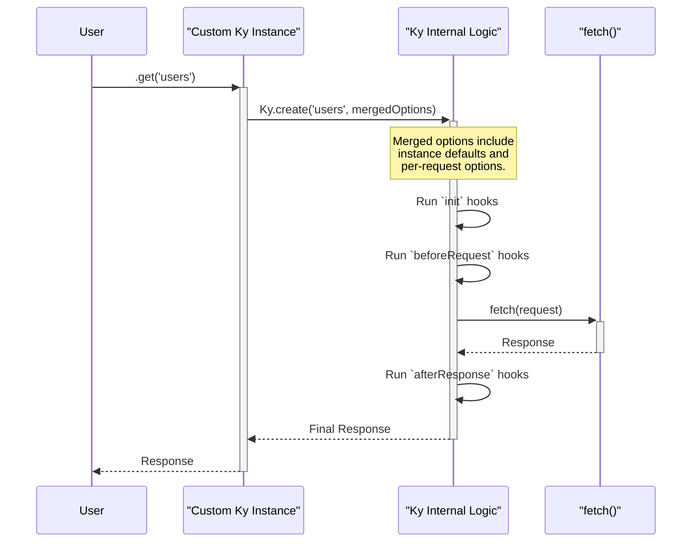
*Sequence of a request showing how default options and hooks from a custom instance are applied.*

Sources: [readme.md:442-448](https://github.com/sindresorhus/ky/blob/HEAD/readme.md#L442-L448), [source/core/Ky.ts:143-152](https://github.com/sindresorhus/ky/blob/HEAD/source/core/Ky.ts#L143-L152), [source/core/Ky.ts:767-842](https://github.com/sindresorhus/ky/blob/HEAD/source/core/Ky.ts#L767-L842)

### Overriding the Fetch Implementation

For testing, server-side rendering (SSR), or instrumentation, you can provide a custom `fetch` function. This function must be compatible with the standard Fetch API.

```javascript
import ky from 'ky';

const instrumentedApi = ky.create({
	fetch: async (request, init) => {
		const start = performance.now();
		const response = await fetch(request, init);
		const duration = performance.now() - start;
		console.log(`${request.method} ${request.url} - ${response.status} (${Math.round(duration)}ms)`);
		return response;
	}
});

const json = await instrumentedApi('https://example.com').json();
```
This creates an instance where every request is timed and logged to the console.

Sources: [readme.md:850-876](https://github.com/sindresorhus/ky/blob/HEAD/readme.md#L850-L876), [source/core/Ky.ts:381](https://github.com/sindresorhus/ky/blob/HEAD/source/core/Ky.ts#L381)

# Page: Response Schema Validation

<details>
<summary>Relevant source files</summary>

The following files were used as context for generating this wiki page:

- [source/errors/SchemaValidationError.ts](https://github.com/sindresorhus/ky/blob/HEAD/source/errors/SchemaValidationError.ts)
- [source/types/standard-schema.ts](https://github.com/sindresorhus/ky/blob/HEAD/source/types/standard-schema.ts)
- [readme.md](https://github.com/sindresorhus/ky/blob/HEAD/readme.md)
</details>

# Response Schema Validation

Ky provides a powerful feature to validate the structure of JSON responses directly within the request lifecycle. By passing a schema-compatible validator to the `.json()` method, you can ensure that the received data conforms to a predefined contract, enhancing type safety and data integrity. This validation is built upon the [Standard Schema](https://standardschema.dev) interface, allowing integration with popular validation libraries like Zod and Valibot.

When validation fails, Ky throws a specific `SchemaValidationError`, which contains detailed information about the validation issues. This error is distinct from HTTP or network errors, as it signifies that the request was successful, but the response body did not match the expected schema.

Sources: [readme.md:55](https://github.com/sindresorhus/ky/blob/HEAD/readme.md#L55), [readme.md:146-147](https://github.com/sindresorhus/ky/blob/HEAD/readme.md#L146-L147)

## Validation Flow

The schema validation process is integrated into the `.json()` body shortcut. When a schema is provided, Ky first parses the JSON response and then passes the resulting object to the schema's `validate` function.

Sources: [source/core/Ky.ts](https://github.com/sindresorhus/ky/blob/HEAD/source/core/Ky.ts)

### Sequence Diagram

The following diagram illustrates the sequence of events when `.json()` is called with a schema.

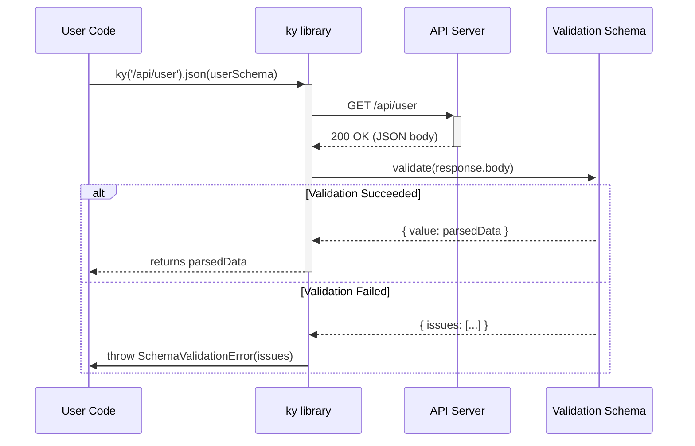
Sources: [readme.md:154-161](https://github.com/sindresorhus/ky/blob/HEAD/readme.md#L154-L161)

### Usage Example

To use response schema validation, you define a schema using a compatible library (like Zod) and pass it as an argument to the `.json()` method.

```typescript
import ky, {SchemaValidationError} from 'ky';
import {z} from 'zod';

const userSchema = z.object({name: z.string()});

try {
	// Pass the schema to .json()
	const user = await ky('/api/user').json(userSchema);
	console.log(user.name);
} catch (error) {
	// Catch the specific validation error
	if (error instanceof SchemaValidationError) {
		console.error(error.issues);
	}
}
```
Sources: [readme.md:148-162](https://github.com/sindresorhus/ky/blob/HEAD/readme.md#L148-L162), [source/errors/SchemaValidationError.ts:9-23](https://github.com/sindresorhus/ky/blob/HEAD/source/errors/SchemaValidationError.ts#L9-L23)

## The Standard Schema Interface

Ky's validation mechanism relies on a contract known as `StandardSchemaV1`. Any validation library that adheres to this interface can be used with Ky. The interface defines the shape of the schema object, its validation function, and the structure of success and failure results.

Sources: [source/types/standard-schema.ts](https://github.com/sindresorhus/ky/blob/HEAD/source/types/standard-schema.ts)

### Interface Structure

The diagram below shows the relationships between the core types of the `StandardSchemaV1` interface.

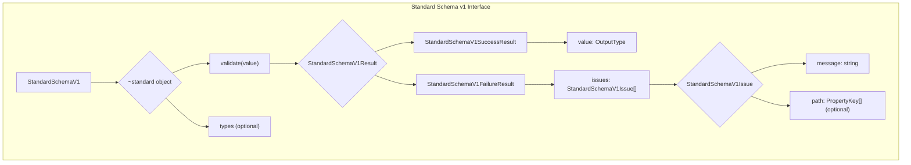
Sources: [source/types/standard-schema.ts:1-37](https://github.com/sindresorhus/ky/blob/HEAD/source/types/standard-schema.ts#L1-L37)

### Key Data Structures

The interface is composed of several key types that define the validation input, output, and error details.

| Type | Description |
| --- | --- |
| `StandardSchemaV1` | The top-level schema object. It must contain a `~standard` property which holds the validation logic and metadata. |
| `StandardSchemaV1Result<T>` | A union type representing the outcome of validation. It can be either a `StandardSchemaV1SuccessResult<T>` or a `StandardSchemaV1FailureResult`. |
| `StandardSchemaV1SuccessResult<T>` | Represents a successful validation, containing the parsed and validated `value` of type `T`. |
| `StandardSchemaV1FailureResult` | Represents a failed validation, containing a readonly array of `issues`. |

Sources: [source/types/standard-schema.ts:6-17](https://github.com/sindresorhus/ky/blob/HEAD/source/types/standard-schema.ts#L6-L17), [source/types/standard-schema.ts:27-37](https://github.com/sindresorhus/ky/blob/HEAD/source/types/standard-schema.ts#L27-L37)

### Validation Issues

When validation fails, the result contains an array of `StandardSchemaV1Issue` objects. Each issue provides details about a specific validation error.

| Property | Type | Description |
| --- | --- | --- |
| `message` | `string` | A human-readable error message describing the validation failure. |
| `path` | `ReadonlyArray<PropertyKey | {key: PropertyKey}>` | (Optional) An array representing the path to the invalid property within the validated object. |

Sources: [source/types/standard-schema.ts:1-4](https://github.com/sindresorhus/ky/blob/HEAD/source/types/standard-schema.ts#L1-L4)

## Error Handling: `SchemaValidationError`

If the schema validation fails, Ky throws a `SchemaValidationError`. This error is specifically designed to report validation issues and is separate from errors related to the HTTP request itself.

Sources: [source/errors/SchemaValidationError.ts](https://github.com/sindresorhus/ky/blob/HEAD/source/errors/SchemaValidationError.ts)

### Error Class Details

The `SchemaValidationError` provides a structured way to access validation problems.

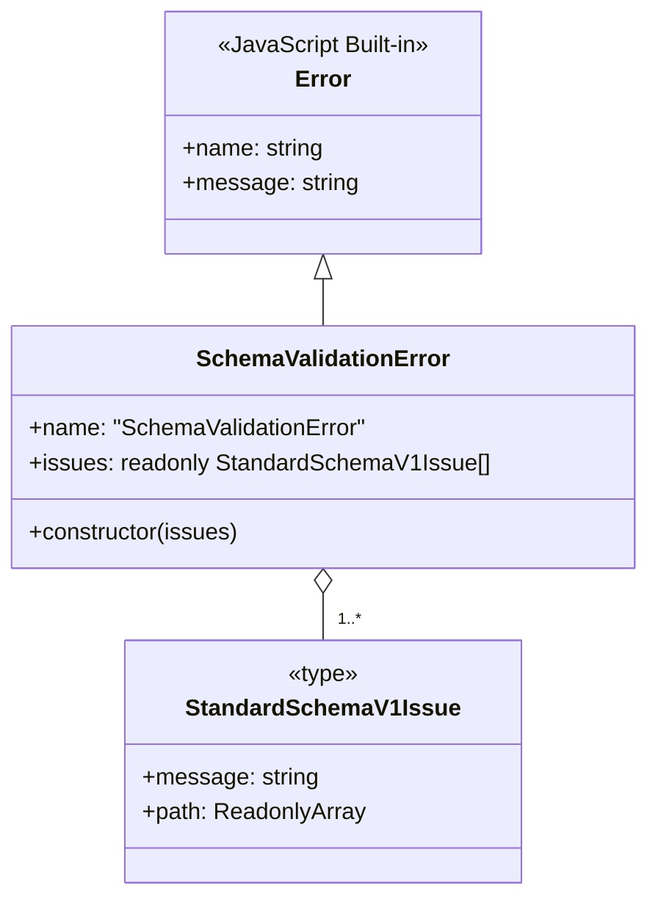
Sources: [source/errors/SchemaValidationError.ts:25-33](https://github.com/sindresorhus/ky/blob/HEAD/source/errors/SchemaValidationError.ts#L25-L33), [source/types/standard-schema.ts:1-4](https://github.com/sindresorhus/ky/blob/HEAD/source/types/standard-schema.ts#L1-L4)

### Architectural Distinction

It is important to note that `SchemaValidationError` does **not** extend `KyError`. This is an intentional design choice. A `SchemaValidationError` indicates that the HTTP request completed successfully (e.g., received a 200 OK response), but the content of the response body failed validation against the user-provided schema. `KyError` and its subclasses (`HTTPError`, `TimeoutError`, etc.) represent failures in the HTTP request lifecycle itself.

This distinction means that `SchemaValidationError` will not be matched by the `isKyError()` type guard.

Sources: [source/errors/SchemaValidationError.ts:6-7](https://github.com/sindresorhus/ky/blob/HEAD/source/errors/SchemaValidationError.ts#L6-L7), [readme.md:1225](https://github.com/sindresorhus/ky/blob/HEAD/readme.md#L1225), [readme.md:1288](https://github.com/sindresorhus/ky/blob/HEAD/readme.md#L1288)

# Page: Guide: Authentication and Token Refresh

<details>
<summary>Relevant source files</summary>

The following files were used as context for generating this wiki page:

- [readme.md](https://github.com/sindresorhus/ky/blob/HEAD/readme.md)
- [test/hooks.ts](https://github.com/sindresorhus/ky/blob/HEAD/test/hooks.ts)
</details>

# Guide: Authentication and Token Refresh

`ky` provides a flexible system of hooks that allows for robust implementation of authentication and authorization flows, such as attaching tokens to requests and automatically refreshing them when they expire. This guide details the common patterns for handling these scenarios. The core mechanism relies on `ky`'s hooks, which are defined as part of the `Options` type.

Sources: [readme.md:442-447](https://github.com/sindresorhus/ky/blob/HEAD/readme.md#L442-L447), [source/types/options.ts:12](https://github.com/sindresorhus/ky/blob/HEAD/source/types/options.ts#L12)

## Attaching Authentication Tokens

The most common authentication pattern is to include an `Authorization` header with a bearer token in every request. The `beforeRequest` hook is the ideal place to implement this logic. By creating an extended `ky` instance, you can ensure the token is attached automatically to all requests made through that instance.

Sources: [readme.md:1691-1693](https://github.com/sindresorhus/ky/blob/HEAD/readme.md#L1691-L1693)

### Implementation

Create a `ky` instance with a `beforeRequest` hook that retrieves the current token and sets the `Authorization` header.

```javascript
const api = ky.create({
	hooks: {
		beforeRequest: [
			({request}) => {
				request.headers.set('Authorization', `Bearer ${getToken()}`);
			}
		]
	}
});
```

This ensures that any call made with the `api` instance, such as `api.get('protected/resource')`, will include the necessary authentication header.

Sources: [readme.md:1695-1705](https://github.com/sindresorhus/ky/blob/HEAD/readme.md#L1695-L1705)

## Token Refresh Strategies

When an access token expires, APIs typically respond with a `401 Unauthorized` status. `ky` offers two primary strategies to handle this: reacting to the error with `beforeRetry` or proactively handling the response with `afterResponse`.

### Strategy 1: Retry on 401 with `beforeRetry`

This approach leverages `ky`'s built-in retry mechanism. By configuring `ky` to retry on `401` status codes, the `beforeRetry` hook can be used to fetch a new token and modify the request before the retry attempt.

Sources: [readme.md:1707-1710](https://github.com/sindresorhus/ky/blob/HEAD/readme.md#L1707-L1710)

#### Configuration

1.  **Enable Retry on 401:** Add `401` to the `retry.statusCodes` array in the `ky` instance configuration.
2.  **Implement `beforeRetry` Hook:** In the hook, perform the token refresh logic and update the `Authorization` header on the request object.

```javascript
const api = ky.create({
	retry: {statusCodes: [401]},
	hooks: {
		beforeRetry: [
			async ({request}) => {
				const token = await refreshToken();
				request.headers.set('Authorization', `Bearer ${token}`);
			}
		]
	}
});
```

Sources: [readme.md:1712-1722](https://github.com/sindresorhus/ky/blob/HEAD/readme.md#L1712-L1722)

#### Flow Diagram

This diagram illustrates the sequence of events when a token expires and is refreshed using the `beforeRetry` hook.

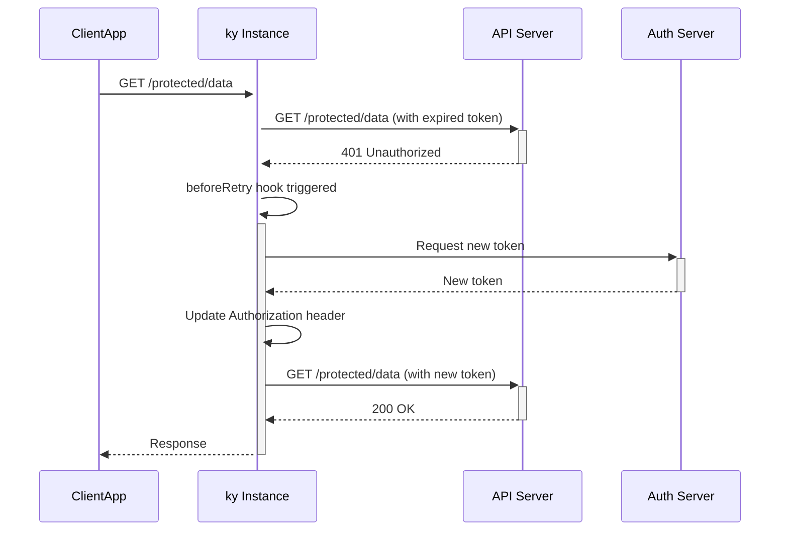

Sources: [readme.md:531-532](https://github.com/sindresorhus/ky/blob/HEAD/readme.md#L531-L532), [readme.md:1715-1719](https://github.com/sindresorhus/ky/blob/HEAD/readme.md#L1715-L1719)

### Strategy 2: Proactive Refresh with `afterResponse`

A more advanced and flexible strategy uses the `afterResponse` hook. This hook intercepts every response, including successful ones, before `ky` processes it. It can inspect the response and, if it indicates an expired token (e.g., status 401), it can initiate a token refresh and then force a new attempt using `ky.retry()`.

This approach provides more control, as it doesn't rely on the generic retry mechanism and can handle cases where an API signals an expired token in the response body even with a 200 status code.

Sources: [readme.md:652-654](https://github.com/sindresorhus/ky/blob/HEAD/readme.md#L652-L654), [readme.md:1739-1741](https://github.com/sindresorhus/ky/blob/HEAD/readme.md#L1739-L1741)

#### Implementation

The `afterResponse` hook checks the response status. If it's `401`, it calls the refresh token endpoint. It then constructs a new `Request` object with the updated `Authorization` header and returns `ky.retry({request: newRequest})` to trigger a new attempt.

It is critical to check `retryCount === 0` to prevent an infinite loop in case the refresh logic itself fails or returns another invalid token.

```javascript
const api = ky.extend({
    hooks: {
        afterResponse: [
            async ({request, response, retryCount}) => {
                if (response.status === 401 && retryCount === 0) {
                    // Only refresh on first 401, not on subsequent retries
                    const {token} = await ky.post('https://example.com/auth/refresh').json();

                    const headers = new Headers(request.headers);
                    headers.set('Authorization', `Bearer ${token}`);

                    return ky.retry({
                        request: new Request(request, {headers}),
                        code: 'TOKEN_REFRESHED'
                    });
                }
            },
        ],
    },
});
```

This pattern is extensively tested to handle various scenarios, including refresh failures and preventing infinite loops.

Sources: [readme.md:677-691](https://github.com/sindresorhus/ky/blob/HEAD/readme.md#L677-L691), [test/hooks.ts:3510-3621](https://github.com/sindresorhus/ky/blob/HEAD/test/hooks.ts#L3510-L3621)

#### Flow Diagram

This diagram shows the token refresh flow using the `afterResponse` hook.

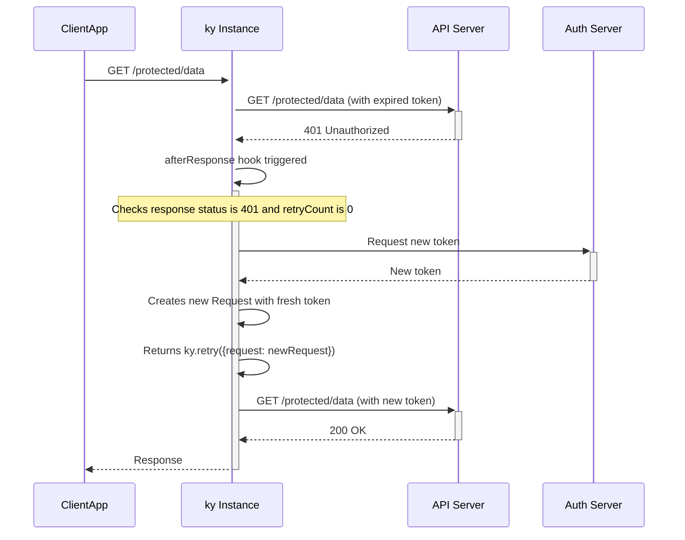

Sources: [readme.md:677-691](https://github.com/sindresorhus/ky/blob/HEAD/readme.md#L677-L691), [test/hooks.ts:3536-3552](https://github.com/sindresorhus/ky/blob/HEAD/test/hooks.ts#L3536-L3552)

### Comparison of Strategies

| Feature | `beforeRetry` Strategy | `afterResponse` Strategy |
| :--- | :--- | :--- |
| **Trigger** | `HTTPError` with a status code in `retry.statusCodes`. | Any `Response` object, successful or not. |
| **Control** | Relies on the standard retry mechanism. | Finer control; can trigger retries based on response body content. |
| **Flexibility** | Modifies the existing request for the retry attempt. | Can create and substitute a completely new `Request` for the retry. |
| **Use Case** | Simple, conventional token refresh based on `401` status. | Complex scenarios, like refreshing based on body content or preventing infinite refresh loops. |

Sources: [readme.md:531-533](https://github.com/sindresorhus/ky/blob/HEAD/readme.md#L531-L533), [readme.md:652-654](https://github.com/sindresorhus/ky/blob/HEAD/readme.md#L652-L654), [readme.md:1081-1083](https://github.com/sindresorhus/ky/blob/HEAD/readme.md#L1081-L1083)

## Handling Edge Cases

When implementing token refresh, it's important to consider edge cases to ensure the application is robust.

### Preventing Infinite Refresh Loops

If the token refresh endpoint provides another invalid token, the application could enter an infinite loop of `401` responses and refresh attempts. The `afterResponse` strategy mitigates this by checking `retryCount === 0`, ensuring the refresh logic only runs on the very first `401` error for a given request. The standard retry mechanism will handle subsequent failures up to the configured `retry.limit`.

Sources: [readme.md:679](https://github.com/sindresorhus/ky/blob/HEAD/readme.md#L679), [test/hooks.ts:3568-3621](https://github.com/sindresorhus/ky/blob/HEAD/test/hooks.ts#L3568-L3621)

### Refresh Endpoint Failures

If the call to the refresh token endpoint itself fails (e.g., with a 500 error or a 401 if the refresh token is also invalid), the hook will throw an error. This error is treated as fatal by `ky` and will not trigger further retries of the original request. The promise for the original request will be rejected with the error from the refresh call.

Sources: [test/hooks.ts:3623-3677](https://github.com/sindresorhus/ky/blob/HEAD/test/hooks.ts#L3623-L3677), [test/hooks.ts:3679-3732](https://github.com/sindresorhus/ky/blob/HEAD/test/hooks.ts#L3679-L3732)

# Page: Guide: Cancellation and Timeouts

<details>
<summary>Relevant source files</summary>

The following files were used as context for generating this wiki page:

- [source/utils/timeout.ts](https://github.com/sindresorhus/ky/blob/HEAD/source/utils/timeout.ts)
- [source/errors/TimeoutError.ts](https://github.com/sindresorhus/ky/blob/HEAD/source/errors/TimeoutError.ts)
- [readme.md](https://github.com/sindresorhus/ky/blob/HEAD/readme.md)
</details>

# Guide: Cancellation and Timeouts

Ky provides robust mechanisms for controlling the lifecycle of an HTTP request, including cancellation and timeouts. It supports manual request cancellation through the standard `AbortController` API and enhances the native Fetch API with its own timeout logic. When a request exceeds its configured time limit, Ky throws a `TimeoutError`, which can be handled and integrated with the library's powerful retry system.

Sources: [`readme.md:50`](), [`readme.md:410-418`](), [`readme.md:1306-1308`]()

## Request Cancellation

Ky supports request cancellation by leveraging the native `AbortController` API. To make a request cancellable, you create an `AbortController` instance and pass its `signal` property in the Ky options object. Calling `controller.abort()` at any time will abort the underlying fetch request, causing the promise returned by Ky to reject with an `AbortError`.

Sources: [`readme.md:1441-1444`]()

### Example

```javascript
import ky from 'ky';

const controller = new AbortController();
const {signal} = controller;

// Abort the request after 5 seconds
setTimeout(() => {
	controller.abort();
}, 5000);

try {
	console.log(await ky(url, {signal}).text());
} catch (error) {
	if (error.name === 'AbortError') {
		console.log('Fetch aborted');
	} else {
		console.error('Fetch error:', error);
	}
}
```

Sources: [`readme.md:1447-1466`]()

## Timeout Management

Ky offers two distinct options for managing request timeouts, providing granular control over both individual attempts and the entire request-retry lifecycle.

| Option | Type | Default | Description |
| :--- | :--- | :--- | :--- |
| `timeout` | `number` \| `false` | `10000` | Per-attempt timeout in milliseconds. Applied independently to each retry. |
| `totalTimeout` | `number` \| `false` | `false` | Overall timeout in milliseconds for the entire operation, including all retries and delays. |
| `retry.retryOnTimeout` | `boolean` | `false` | Determines whether to retry a request that has failed due to a timeout. |

Sources: [`readme.md:287`](), [`readme.md:410-427`]()

### Per-Attempt Timeout (`timeout`)

The `timeout` option sets a time limit in milliseconds for each individual request attempt. If a response is not received within this period, the attempt is aborted, and a `TimeoutError` is thrown. This timeout is reset and applied to each subsequent retry. The default value is 10,000 ms (10 seconds). You can disable the per-attempt timeout by setting this option to `false`.

Sources: [`readme.md:412-418`]()

### Overall Timeout (`totalTimeout`)

The `totalTimeout` option enforces a time limit on the entire operation, from the initial request to the final resolution, including any retries and backoff delays. If the total elapsed time exceeds this value, the operation is aborted, and a `TimeoutError` is thrown. This option is disabled by default.

#### Example

The following example configures each attempt to time out after 5 seconds, while ensuring the entire process (including up to 3 retries) does not exceed 30 seconds.

```javascript
import ky from 'ky';

// Each attempt gets 5s, but the whole operation must complete within 30s
const json = await ky('https://example.com', {
	timeout: 5000,
	totalTimeout: 30_000,
	retry: {
		limit: 3,
		retryOnTimeout: true,
	}
}).json();
```

Sources: [`readme.md:419-440`]()

## Timeout Implementation

Ky's timeout functionality is implemented in a utility function that wraps the native `fetch` call. This wrapper effectively creates a race between the HTTP request and a `setTimeout` timer.

The flow is as follows:
1.  A `setTimeout` is initiated with the configured `timeout` duration.
2.  The `fetch` request is dispatched.
3.  If the `fetch` request resolves or rejects before the timer fires, the timer is cancelled via `clearTimeout()`, and the promise resolves or rejects accordingly.
4.  If the timer fires first, the request is aborted using the internal `AbortController`, and the promise is rejected with a `TimeoutError`.

This implementation is detailed in `source/utils/timeout.ts`.

Sources: [`source/utils/timeout.ts:9-32`]()

### Sequence Diagram

The following diagram illustrates the race condition between the `fetch` call and the `setTimeout` timer.

```mermaid
sequenceDiagram
    participant Client
    participant timeout()
    participant setTimeout()
    participant fetch()

    Client->>+timeout(): Call with request and options
    timeout()->>setTimeout(): Start timer (options.timeout)
    timeout()->>+fetch(): Initiate fetch request
    alt Timeout Occurs First
        setTimeout()-->>timeout(): Timer fires
        timeout()->>fetch(): abortController.abort()
        timeout()-->>-Client: reject(new TimeoutError())
    else Fetch Completes First
        fetch()-->>-timeout(): Response or Error
        timeout()->>setTimeout(): clearTimeout()
        timeout()-->>-Client: resolve(response) or reject(error)
    end
```

Sources: [`source/utils/timeout.ts:15-31`]()

## The `TimeoutError`

When a request exceeds either the `timeout` or `totalTimeout` limit, Ky throws a `TimeoutError`. This custom error class extends `KyError` and provides context about the failed request.

The `TimeoutError` instance contains a `request` property, which holds the original `Request` object. This is useful for debugging and logging purposes, as it allows you to inspect the URL, method, and headers of the request that timed out.

Sources: [`source/errors/TimeoutError.ts:5-14`](), [`readme.md:1308`]()

### Class Definition

```typescript
// source/errors/TimeoutError.ts

export class TimeoutError extends KyError {
	override name = 'TimeoutError' as const;
	request: KyRequest;

	constructor(request: Request) {
		super(`Request timed out: ${request.method} ${request.url}`);
		this.request = request;
	}
}
```

Sources: [`source/errors/TimeoutError.ts:7-15`]()

### Error Handling

You can catch this specific error using an `instanceof` check or the `isTimeoutError()` type guard.

```javascript
import ky, {isTimeoutError} from 'ky';

try {
	await ky('https://example.com', {timeout: 1000}).json();
} catch (error) {
	if (isTimeoutError(error)) {
		console.log('Request timed out');
        // Access the original request
        console.log(error.request.url);
	}
}
```

Sources: [`readme.md:1311-1320`]()

## Interaction with Retries

By default, a request that fails with a `TimeoutError` is not retried. This behavior can be overridden by setting the `retryOnTimeout` option to `true` within the `retry` configuration object. When enabled, Ky will treat a timeout as a retriable failure, subject to the configured `limit` and `methods`.

Sources: [`readme.md:310-311`]()

### Retry Logic Flow

The following diagram shows how the `retryOnTimeout` option influences the control flow when a timeout occurs.

```mermaid
graph TD
    A[Request Initiated] --> B{Timeout Occurs?};
    B -- No --> C[Request Succeeds/Fails];
    B -- Yes --> D[Throw TimeoutError];
    D --> E{retryOnTimeout === true?};
    E -- No --> F[Promise Rejects with TimeoutError];
    E -- Yes --> G{Retry Limit Reached?};
    G -- No --> H[Perform Retry];
    H --> A;
    G -- Yes --> F;
```

Sources: [`readme.md:310-311`](), [`readme.md:345-348`]()

### Example: Retrying on Timeout

```javascript
import ky from 'ky';

const json = await ky('https://example.com', {
	timeout: 5000,
	retry: {
		limit: 3,
		retryOnTimeout: true
	}
}).json();
```

In this configuration, if the initial request times out after 5 seconds, Ky will attempt to retry it up to 3 more times. Each retry will also have a 5-second timeout.

Sources: [`readme.md:338-350`]()

# Page: Guide: Progress Events and Streaming

<details>
<summary>Relevant source files</summary>

The following files were used as context for generating this wiki page:

- [source/utils/body.ts](https://github.com/sindresorhus/ky/blob/HEAD/source/utils/body.ts)
- [readme.md](https://github.com/sindresorhus/ky/blob/HEAD/readme.md)
- [test/stream.ts](https://github.com/sindresorhus/ky/blob/HEAD/test/stream.ts)
</details>

# Guide: Progress Events and Streaming

Ky provides a powerful and elegant API for monitoring upload and download progress, leveraging the modern Fetch API's streaming capabilities. This is accomplished through two primary options: `onDownloadProgress` and `onUploadProgress`. These handlers allow developers to track the transfer of data in real-time, which is essential for user-facing applications dealing with large files or slow network conditions.

The core of this functionality is built upon `ReadableStream` and `TransformStream`, allowing Ky to intercept data chunks as they are sent or received without buffering the entire body in memory unnecessarily. This makes the progress reporting efficient and suitable for large data transfers.

Sources: [readme.md:51](https://github.com/sindresorhus/ky/blob/HEAD/readme.md#L51), [readme.md:735-789](https://github.com/sindresorhus/ky/blob/HEAD/readme.md#L735-L789), [source/utils/body.ts](https://github.com/sindresorhus/ky/blob/HEAD/source/utils/body.ts)

## Download Progress

Download progress can be monitored by providing an `onDownloadProgress` callback in the options object. This feature is implemented by wrapping the original `Response` body in a `TransformStream` that reports progress as data chunks are read.

Sources: [readme.md:735-737](https://github.com/sindresorhus/ky/blob/HEAD/readme.md#L735-L737)

### API and Usage

The `onDownloadProgress` function receives two arguments:

1.  `progress`: An object containing details about the transfer.
    *   `percent`: A number between 0 and 1 representing the completion percentage.
    *   `transferredBytes`: The total number of bytes transferred so far.
    *   `totalBytes`: The total expected size of the download, derived from the `Content-Length` header. This may be `0` if the header is not present.
2.  `chunk`: A `Uint8Array` containing the most recently received data chunk.

**Example:**

```javascript
import ky from 'ky';

const response = await ky('https://example.com/large-file', {
	onDownloadProgress: (progress, chunk) => {
		console.log(`${progress.percent * 100}% - ${progress.transferredBytes} of ${progress.totalBytes} bytes`);
	}
});
```

Sources: [readme.md:739-759](https://github.com/sindresorhus/ky/blob/HEAD/readme.md#L739-L759)

### Implementation Details

The `streamResponse` function is responsible for setting up download progress reporting.

1.  It checks if the response has a body.
2.  It retrieves the `content-length` header to determine `totalBytes`.
3.  It wraps the `response.body` (a `ReadableStream`) with the `withProgress` utility function.
4.  A new `Response` is constructed with the progress-reporting stream.

Sources: [source/utils/body.ts:79-96](https://github.com/sindresorhus/ky/blob/HEAD/source/utils/body.ts#L79-L96)

The data flow for download progress is as follows:

```mermaid
sequenceDiagram
    participant User as User Code
    participant Ky as ky('https://...')
    participant Fetch as Fetch API
    participant Server
    participant streamResponse as streamResponse()
    participant withProgress as withProgress()

    User->>+Ky: Makes request with onDownloadProgress
    Ky->>+Fetch: fetch(request)
    Fetch->>+Server: HTTP Request
    Server-->>-Fetch: HTTP Response (with body stream)
    Fetch-->>-Ky: Returns Response object
    Ky->>+streamResponse: Processes Response
    streamResponse->>+withProgress: Wraps response.body
    withProgress-->>-streamResponse: Returns TransformStream
    streamResponse-->>-Ky: Returns new Response with wrapped body
    Ky-->>-User: Returns Response
    User->>Ky: Consumes response body (.json(), .text(), etc.)
    loop For each data chunk
        Ky->>withProgress: Reads from stream
        withProgress->>withProgress: Calculates progress
        withProgress-->>User: onDownloadProgress(progress, chunk)
    end
```

Sources: [source/utils/body.ts:79-96](https://github.com/sindresorhus/ky/blob/HEAD/source/utils/body.ts#L79-L96), [source/utils/body.ts:46-77](https://github.com/sindresorhus/ky/blob/HEAD/source/utils/body.ts#L46-L77)

## Upload Progress

Upload progress is monitored similarly, via an `onUploadProgress` callback. This feature requires browser support for request streams and is silently ignored in unsupported environments.

Sources: [readme.md:761-769](https://github.com/sindresorhus/ky/blob/HEAD/readme.md#L761-L769)

### API and Usage

The `onUploadProgress` function receives the same arguments as its download counterpart: `progress` and `chunk`.

**Example:**

```javascript
import ky from 'ky';

const response = await ky.post('https://example.com/upload', {
	body: largeFile,
	onUploadProgress: (progress, chunk) => {
		console.log(`${progress.percent * 100}% - ${progress.transferredBytes} of ${progress.totalBytes} bytes`);
	}
});
```

Sources: [readme.md:770-789](https://github.com/sindresorhus/ky/blob/HEAD/readme.md#L770-L789)

### Implementation Details

The `streamRequest` function enables upload progress reporting.

1.  It checks if the request has a body.
2.  It calculates the `totalBytes` of the original request body using the `getBodySize` utility. This is necessary because once the body is converted to a stream, its total size is not easily accessible.
3.  It wraps the `request.body` stream using the same `withProgress` utility.
4.  A new `Request` is created with the wrapped body and the `duplex: 'half'` option, which is required for streaming request bodies.

Sources: [source/utils/body.ts:98-112](https://github.com/sindresorhus/ky/blob/HEAD/source/utils/body.ts#L98-L112)

The data flow for upload progress is as follows:

```mermaid
graph TD
    A["User calls ky.post() with body and onUploadProgress"] --> B["Ky calls streamRequest()"];
    B --> C["streamRequest() calls getBodySize(originalBody)"];
    C --> D["getBodySize() calculates totalBytes"];
    B --> E["streamRequest() calls withProgress(request.body, totalBytes)"];
    E --> F["withProgress() returns a new ReadableStream"];
    F --> G["streamRequest() creates a new Request with the wrapped stream"];
    G --> H["Ky sends the new Request via Fetch API"];
    subgraph "Data Transfer"
        I["Stream reader pulls chunks"] --> J["withProgress() transform intercepts chunks"];
        J --> K["onUploadProgress callback is invoked"];
        J --> L["Chunk is passed to the server"];
    end
    H --> I;
```

Sources: [source/utils/body.ts:98-112](https://github.com/sindresorhus/ky/blob/HEAD/source/utils/body.ts#L98-L112), [source/utils/body.ts:7-44](https://github.com/sindresorhus/ky/blob/HEAD/source/utils/body.ts#L7-L44), [source/utils/body.ts:46-77](https://github.com/sindresorhus/ky/blob/HEAD/source/utils/body.ts#L46-L77)

## Core Progress Logic

Both upload and download progress rely on a shared `withProgress` function that uses a `TransformStream`.

Sources: [source/utils/body.ts:46-77](https://github.com/sindresorhus/ky/blob/HEAD/source/utils/body.ts#L46-L77)

### `withProgress` Function

This function takes a `ReadableStream`, `totalBytes`, and the progress callback as input. It pipes the stream through a `TransformStream` with custom `transform` and `flush` logic.

-   **`transform(currentChunk, controller)`**:
    1.  The `currentChunk` is immediately enqueued to pass it downstream (`controller.enqueue(currentChunk)`).
    2.  Progress is calculated based on the `previousChunk`. This ensures that the `transferredBytes` count reflects data that has already been successfully processed and passed on.
    3.  To prevent reporting 100% before the stream is fully consumed (in case `totalBytes` is an estimate), the percentage is capped at `1 - Number.EPSILON`.
    4.  The `onProgress` callback is invoked with the calculated progress and the `previousChunk`.
    5.  The `currentChunk` is stored as `previousChunk` for the next iteration.

-   **`flush()`**:
    1.  This method is called when the stream is about to close.
    2.  It processes the final `previousChunk` to account for the last piece of data.
    3.  It invokes the `onProgress` callback one last time with `percent: 1` to signal completion.

Sources: [source/utils/body.ts:46-77](https://github.com/sindresorhus/ky/blob/HEAD/source/utils/body.ts#L46-L77)

### Body Size Calculation

For upload progress, accurately determining the total size of the request body is critical. The `getBodySize` function handles various body types.

| Body Type | Size Calculation Method |
| :--- | :--- |
| `FormData` | Approximated by summing boundary sizes and the byte length of each key and value. File sizes are used directly. |
| `Blob` | `body.size` |
| `ArrayBuffer` / `ArrayBufferView` | `body.byteLength` |
| `string` | `new TextEncoder().encode(body).byteLength` |
| `URLSearchParams` | `new TextEncoder().encode(body.toString()).byteLength` |
| `null` / `undefined` | `0` |

Sources: [source/utils/body.ts:7-44](https://github.com/sindresorhus/ky/blob/HEAD/source/utils/body.ts#L7-L44)

## Advanced Scenarios and Edge Cases

The test suite reveals how progress reporting behaves in more complex situations involving hooks and retries.

-   **Hooks**: Using `beforeRequest` hooks to return a new `Request` (e.g., to add headers) does not interfere with or duplicate progress events. If the body is replaced in a hook, `ky` correctly calculates the new body's size and reports progress against it.
    Sources: [test/stream.ts:72-107](https://github.com/sindresorhus/ky/blob/HEAD/test/stream.ts#L72-L107), [test/stream.ts:165-248](https://github.com/sindresorhus/ky/blob/HEAD/test/stream.ts#L165-L248)
-   **Retries**: When a request is retried, `onUploadProgress` events are emitted independently for each attempt, tracking the progress of that specific attempt from 0% to 100%. This holds true even if the request body is modified between retries using a `beforeRetry` hook.
    Sources: [test/stream.ts:109-163](https://github.com/sindresorhus/ky/blob/HEAD/test/stream.ts#L109-L163), [test/stream.ts:418-476](https://github.com/sindresorhus/ky/blob/HEAD/test/stream.ts#L418-L476), [test/stream.ts:683-756](https://github.com/sindresorhus/ky/blob/HEAD/test/stream.ts#L683-L756)
-   **Forced Retries**: If an `afterResponse` hook forces a retry with `ky.retry({request: new Request(...)})`, the upload progress tracking is correctly re-initialized for the new request, even if its body is different from the original.
    Sources: [test/stream.ts:558-629](https://github.com/sindresorhus/ky/blob/HEAD/test/stream.ts#L558-L629), [test/stream.ts:758-839](https://github.com/sindresorhus/ky/blob/HEAD/test/stream.ts#L758-L839)

## Summary

Ky's progress event system is a robust feature that provides detailed insight into data transfers. By building on standard stream APIs, it offers an efficient and flexible way to monitor both uploads and downloads. The implementation is carefully designed to handle various body types, request modifications via hooks, and complex retry scenarios, ensuring that progress reporting remains accurate and reliable.
